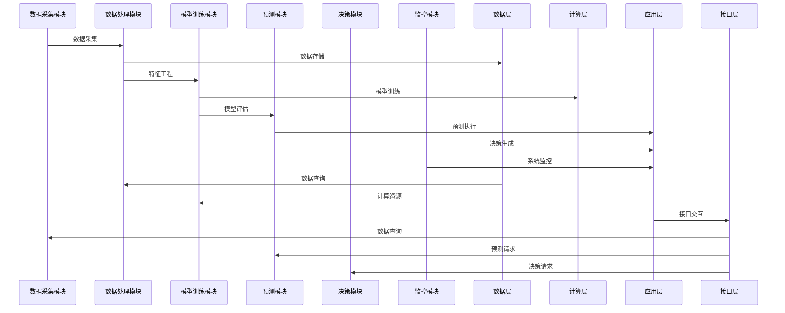
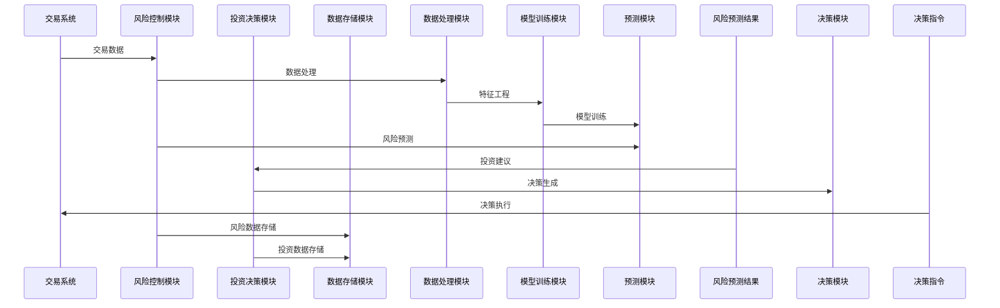

                 

# 人工智能在金融领域的应用：从风控到投资的全面革新

## 关键词

- 人工智能
- 金融领域
- 风险控制
- 投资
- 技术应用

## 摘要

本文旨在探讨人工智能在金融领域的广泛应用，从风险控制到投资决策，全面革新金融行业。文章首先介绍了人工智能和金融领域的基本概念及其相互融合的背景。接着，详细分析了人工智能在信用风险管理、市场风险管理、投资组合管理和投资策略制定等具体应用场景中的技术原理和实践案例。文章还讨论了人工智能系统在金融架构中的设计和实施原则，最后总结了最佳实践，并对未来发展方向提出了建议。

## 1. 引言

### 1.1 人工智能在金融领域的背景

人工智能（Artificial Intelligence, AI）作为计算机科学的一个分支，致力于创建智能体，这些智能体能够模拟、延伸和扩展人类智能。自从20世纪50年代人工智能概念提出以来，其发展经历了多个阶段，从早期的逻辑推理到现在的深度学习和神经网络，AI技术不断进步，应用范围也日益广泛。

金融领域作为全球经济的重要支柱，长期以来面临着巨大的信息处理和数据管理的挑战。随着数据量的激增和金融市场的复杂化，传统的金融分析方法已经难以满足需求。人工智能的出现，为金融领域带来了新的契机，通过高效的数据分析和智能决策支持，AI在金融风险控制、投资策略优化、欺诈检测等多个方面展现出了巨大的潜力。

### 1.2 人工智能在金融领域的应用潜力

人工智能在金融领域的应用潜力主要表现在以下几个方面：

- **风险控制**：利用AI技术进行风险评估、信用评分、欺诈检测等，可以提高风险管理的准确性和效率。
- **投资策略**：通过机器学习算法分析海量市场数据，优化投资组合，提高投资收益。
- **客户服务**：AI驱动的聊天机器人和虚拟助理可以提供24/7的客户支持，提升用户体验。
- **智能投顾**：利用AI算法提供个性化投资建议，降低投资门槛，满足不同投资者的需求。
- **量化交易**：通过复杂的算法和模型，实现自动化交易，提高交易效率和盈利能力。

### 1.3 本文结构及目标

本文将分为以下几个部分：

1. **背景介绍**：详细阐述人工智能和金融领域的概念，以及AI在金融行业中的融合背景。
2. **核心概念和技术**：介绍人工智能的基本概念和技术，以及其在金融应用中的具体实现。
3. **应用场景分析**：探讨人工智能在信用风险管理、市场风险管理、投资组合管理和投资策略制定等具体场景中的应用。
4. **系统设计与实施**：分析人工智能系统在金融领域的架构设计和实施原则。
5. **实战案例**：通过具体案例展示人工智能在金融领域的实际应用效果。
6. **最佳实践与未来展望**：总结最佳实践，并对人工智能在金融领域的未来发展提出建议。

本文的目标是帮助读者深入了解人工智能在金融领域的应用，理解其技术原理和实践案例，为金融行业的数字化转型提供指导和借鉴。

## 2. 核心概念和技术

### 2.1 人工智能的基本概念

人工智能（AI）是指计算机系统通过模拟人类智能行为，实现感知、理解、学习和决策的能力。AI的核心是算法和模型，这些算法和模型可以处理大量数据，从中提取有用信息，并基于这些信息做出决策。

- **机器学习（Machine Learning）**：一种通过数据训练模型，使计算机能够自主学习和改进的方法。常见的机器学习算法包括线性回归、决策树、支持向量机、神经网络等。

- **深度学习（Deep Learning）**：一种特殊的机器学习方法，通过多层神经网络对数据进行处理，能够实现更加复杂的任务。深度学习在图像识别、自然语言处理和语音识别等领域取得了显著成果。

- **自然语言处理（Natural Language Processing, NLP）**：使计算机能够理解和处理人类自然语言的技术。NLP广泛应用于智能客服、文本分析和情感分析等领域。

### 2.2 机器学习算法在金融应用中的具体实现

在金融领域，机器学习算法被广泛应用于信用评分、风险评估、欺诈检测等任务。

- **信用评分**：银行和金融机构通过机器学习算法对借款人的信用记录、财务状况、行为特征等数据进行分析，预测其还款能力。常见的模型有逻辑回归、决策树和随机森林等。

- **风险评估**：金融机构利用机器学习算法对市场风险、信用风险等进行预测和评估。例如，通过时间序列分析和回归分析，预测股票市场的波动。

- **欺诈检测**：利用机器学习算法检测和预防金融欺诈行为。通过训练模型识别异常交易模式和用户行为，提前发现潜在的欺诈行为。

### 2.3 深度学习在金融应用中的具体实现

深度学习在金融领域的应用越来越广泛，尤其是在图像识别、自然语言处理和量化交易等方面。

- **图像识别**：通过卷积神经网络（CNN）对金融票据、合同、身份证等图像进行自动分类和识别，提高金融文档处理的效率。

- **自然语言处理**：利用深度学习模型分析金融市场新闻、报告和公告，提取关键信息，辅助投资决策。

- **量化交易**：通过深度学习算法分析市场数据，识别交易机会，实现自动化交易。

### 2.4 比较不同机器学习技术在金融应用中的适用性

不同的机器学习技术在金融应用中各有优劣。

- **线性回归**：适用于简单的线性关系分析，但在面对非线性问题时效果不佳。

- **决策树**：易于理解，能够处理多变量和分类问题，但在处理大数据集时可能存在过拟合问题。

- **支持向量机**：在处理高维数据和线性不可分问题方面表现出色，但计算复杂度较高。

- **神经网络**：能够处理复杂的非线性问题，但需要大量数据和计算资源。

- **深度学习**：在处理大规模数据和复杂任务方面具有显著优势，但对其理解和调试相对困难。

综上所述，不同的机器学习技术在金融应用中具有不同的适用性，选择合适的算法需要根据具体问题和数据特点进行综合考虑。

### 2.5 AI与其他技术的结合

AI技术在金融领域的应用不仅依赖于算法本身，还需要与其他技术相结合。

- **大数据**：金融行业的数据量庞大，AI技术需要借助大数据技术进行数据收集、存储和处理。

- **云计算**：云计算提供了强大的计算资源和存储能力，支持AI算法的快速开发和部署。

- **区块链**：区块链技术可以为金融交易提供安全、透明的记录，与AI技术结合可以提升金融系统的安全性和效率。

通过结合大数据、云计算和区块链等先进技术，AI在金融领域的应用将更加广泛和深入。

### 2.6 核心概念属性特征对比表格

| 算法类型     | 特点                                           | 适用场景                 |
|------------|------------------------------------------------|------------------------|
| 线性回归     | 简单，易于实现和解释                           | 线性关系预测             |
| 决策树       | 易于理解和解释，可以处理多变量问题               | 分类和回归问题           |
| 支持向量机   | 高效，适用于高维空间问题                       | 非线性分类和回归         |
| 神经网络     | 能处理复杂非线性问题，自适应性强                 | 复杂模式识别和预测       |
| 深度学习     | 极强的非线性处理能力，能够处理大规模数据         | 图像识别、自然语言处理等 |

### 2.7 ER实体关系图架构

以下是金融领域的一个简单的ER实体关系图，展示了核心实体及其相互关系。

```mermaid
erDiagram
  Customer ||--|{ Loan }
  Customer ||--|{ CreditCard }
  Bank ||--|{ Account }
  Bank ||--|{ Transaction }
```

### 2.8 人工智能在金融领域的边界与外延

人工智能在金融领域的应用边界广泛，从基础的风险评估到高阶的投资决策，AI技术的潜力不断被挖掘。然而，AI在金融领域的应用也存在一定的外延和挑战。

- **外延**：AI技术在金融领域的应用逐渐从传统的风险管理、客户服务扩展到更广泛的领域，如智能投顾、量化交易和自动化投资等。同时，随着技术的进步，AI在处理大数据、实时分析和决策支持等方面的能力也在不断提升。

- **挑战**：尽管AI在金融领域展现了巨大的潜力，但其在实际应用中仍面临诸多挑战，如数据隐私和安全、算法透明性和公平性、系统稳定性等。此外，金融行业的法规和监管政策也在不断变化，需要AI技术能够快速适应和合规。

总之，人工智能在金融领域的应用边界广阔，未来将继续在提升风险管理能力、优化投资策略和提高客户体验等方面发挥重要作用。但同时，也需要解决数据隐私、算法透明性等挑战，确保AI技术的健康、可持续发展。

## 3. 人工智能在风险控制中的应用

### 3.1 信用风险管理

信用风险管理是金融领域中至关重要的一个环节，主要涉及评估借款人的信用风险，确保贷款回收。在传统方法中，信用评估通常依赖于借款人的信用历史、收入情况、债务比例等有限信息。而随着人工智能技术的发展，基于大数据和机器学习的信用评估方法逐渐兴起，显著提高了评估的准确性和效率。

**3.1.1 人工智能在信用评估中的基本原理**

人工智能在信用评估中的基本原理是通过收集和分析借款人的大量数据，利用机器学习算法建立信用评分模型。具体步骤如下：

1. **数据收集**：从多个来源收集借款人的个人信息、财务记录、交易行为等数据。这些数据包括但不限于信用报告、信用卡交易记录、借贷记录、社会网络信息等。

2. **数据处理**：对收集到的数据清洗、整理和标准化，以便于后续分析和建模。这一步骤包括数据去重、缺失值填充、异常值处理等。

3. **特征工程**：通过数据预处理，提取出对信用评估有重要影响的特征。这些特征可能包括借款人的年龄、收入水平、职业、还款历史等。

4. **模型训练**：利用机器学习算法，如逻辑回归、决策树、随机森林、神经网络等，对特征和信用评分之间的关系进行建模和训练。通过多次迭代，调整模型参数，以提高预测的准确性。

5. **模型评估**：通过交叉验证和测试集评估模型的性能，选择最优模型进行部署和应用。

**3.1.2 人工智能在信用评估中的实践案例**

一个典型的实践案例是某银行利用机器学习模型进行信用评分。该银行从多个数据源收集了数百万借款人的数据，包括信用报告、借贷记录、信用卡交易记录等。通过数据预处理和特征工程，银行提取了诸如还款行为、债务收入比、信用历史长度等关键特征。

然后，银行采用随机森林算法构建信用评分模型，通过交叉验证和测试集评估，该模型在信用评分准确性方面显著优于传统方法。在实际应用中，该模型被用于自动审批贷款申请，提高了审批效率和准确性。

**3.1.3 人工智能在信用风险管理中的挑战和未来方向**

尽管人工智能在信用风险管理中展现了巨大的潜力，但仍面临诸多挑战：

- **数据隐私和安全**：收集和处理大量个人信息可能引发隐私和安全问题，需要采取严格的数据保护措施。

- **算法透明性和公平性**：机器学习模型通常是一个“黑盒”，其决策过程不透明，可能导致不公平的评估结果。需要提高算法的透明度和解释性。

- **系统稳定性**：机器学习模型对数据质量高度依赖，数据波动可能影响模型的稳定性。需要建立有效的数据监控和调整机制。

未来的研究方向包括：

- **增强数据隐私保护**：采用差分隐私、联邦学习等技术，保护用户隐私的同时，实现高效的数据共享和分析。

- **提高算法透明性和公平性**：开发可解释性AI模型，如决策树和LIME（局部可解释模型解释），提高模型的透明度和公平性。

- **增强系统稳定性**：通过数据预处理、模型校准和监控机制，提高模型的稳定性和鲁棒性。

总之，人工智能在信用风险管理中的应用前景广阔，但需要克服数据隐私、算法公平性和系统稳定性等挑战，以实现可持续的发展。

### 3.2 市场风险管理

市场风险管理是金融领域中另一个重要的环节，涉及对市场价格波动和潜在风险进行预测和管理。随着金融市场复杂性的增加，传统的市场风险管理方法已经难以应对，人工智能技术的引入为市场风险管理带来了新的思路和方法。

**3.2.1 人工智能在市场风险管理中的基本原理**

人工智能在市场风险管理中的应用主要通过以下几个方面实现：

1. **数据收集**：从多个来源获取市场数据，包括股票、债券、期货、外汇等市场的价格、交易量、市场情绪等。

2. **数据预处理**：对收集到的市场数据进行清洗、整理和标准化，提取出对市场风险有重要影响的特征。

3. **时间序列分析**：利用时间序列分析方法，如ARIMA（自回归积分滑动平均模型）、GARCH（广义自回归条件异方差模型）等，对市场数据进行建模和预测。

4. **机器学习算法**：采用机器学习算法，如随机森林、支持向量机、神经网络等，对市场风险进行建模和预测。这些算法可以捕捉市场数据中的非线性关系和复杂模式。

5. **模型融合**：将多种模型进行融合，提高市场风险预测的准确性和稳健性。

**3.2.2 人工智能在市场风险管理中的实践案例**

一个典型的实践案例是某投资机构利用机器学习模型进行市场风险预测。该机构从多个数据源收集了大量的市场数据，包括股票价格、交易量、市场情绪指数等。通过数据预处理和特征提取，机构提取了如价格波动率、交易量变化、市场情绪等关键特征。

然后，机构采用随机森林算法构建市场风险预测模型，并通过交叉验证和测试集评估模型性能。在实际应用中，该模型被用于监控市场风险，提供投资决策支持。通过该模型，机构显著提高了市场风险预测的准确性和及时性。

**3.2.3 人工智能在市场风险管理中的挑战和未来方向**

尽管人工智能在市场风险管理中展现了巨大的潜力，但仍面临诸多挑战：

- **数据质量**：市场数据通常包含噪声和异常值，影响模型性能。需要采用有效的数据清洗和预处理方法。

- **模型复杂性**：机器学习模型通常较为复杂，理解其决策过程和预测结果较为困难。需要提高模型的可解释性和透明度。

- **实时性**：市场风险变化迅速，要求模型能够实时更新和调整，以适应市场变化。需要开发高效的实时数据处理和分析方法。

未来的研究方向包括：

- **增强数据质量**：采用更先进的数据预处理技术，如异常值检测和噪声过滤，提高数据质量。

- **提高模型可解释性**：开发可解释性AI模型，如LIME（局部可解释模型解释），提高模型的透明度和可信度。

- **实时风险预测**：利用实时数据处理和分析技术，实现快速、准确的市场风险预测。

总之，人工智能在市场风险管理中的应用为金融行业带来了新的机遇，但需要克服数据质量、模型复杂性和实时性等挑战，以实现更加高效和精准的风险管理。

### 3.3 欺诈检测

欺诈检测是金融领域中一个关键的应用，旨在识别和预防各种欺诈行为，如信用卡欺诈、洗钱、虚假交易等。随着欺诈手段的不断演变，传统的方法已经难以应对复杂多变的欺诈行为，人工智能技术的引入为欺诈检测提供了新的解决方案。

**3.3.1 人工智能在欺诈检测中的基本原理**

人工智能在欺诈检测中的应用主要包括以下几个步骤：

1. **数据收集**：从多个数据源收集与交易行为相关的数据，包括交易金额、时间、地点、交易频率等。

2. **数据预处理**：对收集到的交易数据进行清洗、整理和标准化，提取出对欺诈检测有重要影响的特征。

3. **行为分析**：利用机器学习算法，如聚类分析、关联规则挖掘、神经网络等，对正常交易和欺诈交易进行区分。

4. **实时监控**：建立实时监控系统，对交易行为进行实时分析，及时识别和响应潜在的欺诈行为。

5. **模型优化**：通过不断的模型训练和调整，提高欺诈检测的准确性和效率。

**3.3.2 人工智能在欺诈检测中的实践案例**

一个典型的实践案例是某银行利用机器学习模型进行信用卡欺诈检测。该银行从信用卡交易数据中提取了如交易金额、交易时间、地理位置、消费类型等多个特征。通过数据预处理和特征工程，银行构建了包括决策树、神经网络和随机森林等多种机器学习模型，用于识别潜在的欺诈交易。

在实际应用中，该银行通过模型实时监控交易行为，一旦检测到异常交易，立即采取冻结账户、通知客户等措施，有效降低了信用卡欺诈率。此外，通过不断的模型优化和调整，银行不断提高了欺诈检测的准确性和响应速度。

**3.3.3 人工智能在欺诈检测中的挑战和未来方向**

尽管人工智能在欺诈检测中展现了巨大的潜力，但仍面临诸多挑战：

- **数据多样性**：欺诈行为具有多样性，需要模型能够处理各种不同类型的欺诈行为。

- **数据不平衡**：正常交易数量远大于欺诈交易，数据不平衡问题影响模型性能。需要采用数据增强和模型调整等方法。

- **实时性**：欺诈行为往往具有突发性，要求模型能够实时响应和调整，以识别最新的欺诈手段。

未来的研究方向包括：

- **增强数据多样性**：通过引入更多维度的数据，如行为数据、用户画像等，提高模型对欺诈行为的识别能力。

- **解决数据不平衡**：采用 oversampling、undersampling、SMOTE 等方法，解决数据不平衡问题，提高模型性能。

- **实时欺诈检测**：利用实时数据处理和分析技术，实现快速、准确的欺诈检测。

总之，人工智能在欺诈检测中的应用为金融行业带来了新的机遇，但需要克服数据多样性、数据不平衡和实时性等挑战，以实现更加高效和精准的欺诈检测。

### 3.4 风险控制中的其他应用

除了信用风险管理、市场风险管理和欺诈检测，人工智能在金融风险控制中还有其他广泛应用。

**3.4.1 信贷风险评估**

人工智能在信贷风险评估中的应用，不仅仅局限于信用评分，还包括对借款人还款能力和意愿的全面评估。通过机器学习算法，金融机构可以从借款人的行为数据、社交网络信息、消费习惯等多维度进行综合分析，提高风险评估的准确性和全面性。

**3.4.2 保险风险评估**

在保险领域，人工智能技术被广泛应用于风险评估和定价。保险公司通过机器学习模型分析投保人的健康状况、驾驶记录、生活习惯等数据，制定更加精准的保费定价策略，提高保险的覆盖率和竞争力。

**3.4.3 金融监管**

人工智能技术可以帮助金融监管机构更有效地监控金融市场，识别异常交易和潜在风险。通过大数据分析和机器学习算法，监管机构可以实时监控市场动态，提高金融系统的稳定性和透明度。

**3.4.4 实时风险预警**

通过实时数据分析和技术监控，人工智能可以快速识别市场风险和潜在危机，为金融机构提供及时的预警和应对策略。这种实时风险预警系统可以显著提高金融系统的抗风险能力。

综上所述，人工智能在金融风险控制中的应用不仅限于传统的信用风险、市场风险和欺诈检测，还在信贷评估、保险定价、金融监管和实时风险预警等方面发挥着重要作用。随着技术的不断发展，人工智能在金融风险控制中的应用将更加广泛和深入。

### 3.5 风险管理中的注意事项

在金融风险管理中，尽管人工智能技术提供了高效的数据分析和预测能力，但仍然需要注意以下几个方面：

- **数据隐私与安全**：在收集和处理大量个人信息时，必须确保数据的安全性和隐私保护，遵循相关法律法规和标准。

- **算法透明性和解释性**：机器学习模型往往是一个“黑盒”，其决策过程不透明，可能导致不公平的评估结果。需要开发可解释性AI模型，提高算法的透明度和解释性。

- **模型适应性和稳定性**：市场环境和风险特征不断变化，模型需要具备良好的适应性和稳定性，以应对不同情况和数据波动。

- **人机协作**：尽管AI技术在风险管理中具有强大的能力，但仍然需要专业人员的参与，进行模型开发和策略制定。人机协作可以提高风险管理的效果和效率。

总之，在应用人工智能进行风险管理时，需要综合考虑数据隐私、算法透明性、模型适应性和人机协作等因素，以确保风险管理的有效性和可持续性。

## 4. 人工智能在投资中的应用

### 4.1 投资组合管理

投资组合管理是金融领域的一项核心任务，旨在通过合理配置资产，实现投资收益的最大化和风险的最小化。传统投资组合管理主要依赖于历史数据和统计模型，而人工智能技术的引入，使得投资组合管理更加智能化和高效化。

**4.1.1 人工智能在投资组合管理中的基本原理**

人工智能在投资组合管理中的应用主要包括以下几个步骤：

1. **数据收集**：从多个来源收集与投资相关的数据，包括股票、债券、基金等金融产品的历史价格、交易量、市场指数等。

2. **数据处理**：对收集到的数据进行清洗、整理和标准化，提取出对投资组合管理有重要影响的特征。

3. **风险模型构建**：利用机器学习算法，如随机森林、神经网络等，建立风险模型，评估不同资产的波动性和相关性。

4. **优化策略制定**：通过优化算法，如遗传算法、粒子群优化等，制定最优的投资组合策略，实现风险收益的最优平衡。

5. **实时调整**：利用实时数据处理和分析技术，对投资组合进行实时监控和调整，以应对市场变化。

**4.1.2 人工智能在投资组合管理中的实践案例**

一个典型的实践案例是某基金公司利用人工智能进行投资组合管理。该基金公司从多个数据源收集了包括股票、债券、基金等金融产品的历史数据。通过数据预处理和特征工程，公司提取了如波动率、收益率、市场指数等关键特征。

然后，公司采用随机森林算法构建风险模型，并通过优化算法制定最优投资组合策略。在实际应用中，该模型被用于动态调整投资组合，实现了较高的风险收益平衡。通过该模型，基金公司显著提高了投资组合的管理效率和收益水平。

**4.1.3 人工智能在投资组合管理中的挑战和未来方向**

尽管人工智能在投资组合管理中展现了巨大的潜力，但仍面临诸多挑战：

- **数据质量**：投资组合管理依赖于大量高质量的数据，数据质量直接影响模型的准确性和稳定性。

- **模型复杂度**：机器学习模型通常较为复杂，理解和调试较为困难，需要提高模型的可解释性。

- **实时性**：投资组合管理需要快速响应市场变化，对模型的实时性和计算效率要求较高。

未来的研究方向包括：

- **增强数据质量**：采用更先进的数据处理技术，如异常值检测、数据增强等，提高数据质量。

- **提高模型可解释性**：开发可解释性AI模型，提高模型的透明度和可信度。

- **实时投资组合管理**：利用实时数据处理和分析技术，实现快速、准确的决策支持。

总之，人工智能在投资组合管理中的应用为金融行业带来了新的机遇，但需要克服数据质量、模型复杂度和实时性等挑战，以实现更加高效和精准的投资组合管理。

### 4.2 投资策略制定

投资策略制定是投资过程中的关键环节，旨在通过合理的资产配置和交易策略，实现投资目标。人工智能技术的引入，使得投资策略的制定更加科学和智能化，提高了投资决策的准确性和效率。

**4.2.1 人工智能在投资策略制定中的基本原理**

人工智能在投资策略制定中的应用主要包括以下几个步骤：

1. **数据收集**：从多个数据源收集与投资策略相关的数据，包括市场数据、公司财务数据、宏观经济数据等。

2. **数据处理**：对收集到的数据进行清洗、整理和标准化，提取出对投资策略制定有重要影响的特征。

3. **模式识别**：利用机器学习算法，如神经网络、支持向量机等，对市场数据进行分析和模式识别，提取交易信号。

4. **策略优化**：通过优化算法，如遗传算法、粒子群优化等，制定最优的交易策略，实现投资目标。

5. **实时监控**：利用实时数据处理和分析技术，对交易策略进行实时监控和调整，以应对市场变化。

**4.2.2 人工智能在投资策略制定中的实践案例**

一个典型的实践案例是某量化交易团队利用人工智能进行投资策略制定。该团队从多个数据源收集了包括股票、债券、期货等金融产品的历史数据。通过数据预处理和特征工程，团队提取了如价格趋势、交易量、市场情绪等关键特征。

然后，团队采用神经网络算法进行模式识别，并通过优化算法制定最优交易策略。在实际应用中，该策略被用于自动执行交易，实现了较高的收益和风险平衡。通过该策略，量化交易团队显著提高了交易决策的准确性和效率。

**4.2.3 人工智能在投资策略制定中的挑战和未来方向**

尽管人工智能在投资策略制定中展现了巨大的潜力，但仍面临诸多挑战：

- **数据质量**：投资策略依赖于大量高质量的数据，数据质量直接影响模型的准确性和稳定性。

- **模型复杂度**：机器学习模型通常较为复杂，理解和调试较为困难，需要提高模型的可解释性。

- **实时性**：投资策略需要快速响应市场变化，对模型的实时性和计算效率要求较高。

未来的研究方向包括：

- **增强数据质量**：采用更先进的数据处理技术，如异常值检测、数据增强等，提高数据质量。

- **提高模型可解释性**：开发可解释性AI模型，提高模型的透明度和可信度。

- **实时投资策略制定**：利用实时数据处理和分析技术，实现快速、准确的决策支持。

总之，人工智能在投资策略制定中的应用为金融行业带来了新的机遇，但需要克服数据质量、模型复杂度和实时性等挑战，以实现更加高效和精准的投资策略。

### 4.3 智能投顾

智能投顾（Robo-Advisor）是近年来金融科技领域的一个热门话题，它利用人工智能技术为投资者提供个性化的投资建议和管理服务。智能投顾通过分析投资者的财务状况、风险偏好和投资目标，制定出符合个人需求的资产配置和投资策略。

**4.3.1 智能投顾的基本原理**

智能投顾的基本原理包括以下几个步骤：

1. **用户数据收集**：收集投资者的基本信息、财务状况、投资目标、风险偏好等数据。

2. **数据分析和评估**：利用机器学习算法，对用户数据进行处理和分析，评估投资者的风险承受能力和投资偏好。

3. **资产配置**：根据投资者的评估结果，制定个性化的资产配置策略，包括股票、债券、基金等多种投资产品。

4. **实时监控和调整**：利用实时数据处理和分析技术，对投资组合进行实时监控和调整，以应对市场变化。

**4.3.2 智能投顾的实践案例**

一个典型的实践案例是某金融科技公司推出的智能投顾服务。该服务通过用户的在线问卷和财务数据，分析其投资需求和风险偏好。然后，利用机器学习算法和量化模型，为用户制定个性化的资产配置方案。

在实际应用中，该智能投顾服务提供了多种投资策略，如保守型、稳健型、成长型等，用户可以根据自己的需求选择合适的策略。此外，服务还提供了实时监控和调整功能，确保投资组合始终符合用户的需求和目标。

**4.3.3 智能投顾的优势和挑战**

智能投顾的优势包括：

- **个性化服务**：能够根据投资者的具体需求提供个性化的投资建议，提高投资收益。
- **高效性**：利用人工智能技术，快速处理和分析大量数据，提高投资决策的效率。
- **低成本**：相对于传统投顾服务，智能投顾的成本较低，适合普通投资者。

智能投顾的挑战包括：

- **数据隐私和安全**：收集和处理大量个人信息可能引发隐私和安全问题。
- **算法透明性和公平性**：机器学习模型决策过程不透明，可能存在不公平的评估结果。
- **市场波动和风险**：智能投顾无法完全预测市场的波动和风险，需要提高风险管理和应对能力。

未来的发展方向包括：

- **增强数据隐私保护**：采用差分隐私、联邦学习等技术，保护用户隐私。
- **提高算法透明性和公平性**：开发可解释性AI模型，提高模型的透明度和可信度。
- **多样化投资策略**：引入更多元化的投资策略，满足不同投资者的需求。

总之，智能投顾作为一种新兴的金融科技服务，具有广阔的发展前景，但需要克服数据隐私、算法透明性和市场波动等挑战，以实现可持续的发展。

### 4.4 人工智能在量化交易中的应用

量化交易是利用数学模型和计算机算法进行自动交易的一种交易模式。人工智能技术的引入，使得量化交易更加智能化和高效化，提高了交易策略的准确性和执行效率。

**4.4.1 人工智能在量化交易中的基本原理**

人工智能在量化交易中的应用主要包括以下几个步骤：

1. **数据收集**：从多个数据源收集与交易相关的数据，包括股票、债券、期货、外汇等金融产品的历史价格、交易量、市场指数等。

2. **数据处理**：对收集到的数据进行清洗、整理和标准化，提取出对交易策略有重要影响的特征。

3. **策略开发**：利用机器学习算法，如神经网络、支持向量机等，构建交易策略模型，实现自动化交易。

4. **回测和优化**：通过历史数据进行回测，评估交易策略的性能，并进行模型优化。

5. **实时交易**：利用实时数据处理和分析技术，对交易信号进行实时处理，执行自动交易。

**4.4.2 人工智能在量化交易中的实践案例**

一个典型的实践案例是某量化交易团队利用人工智能进行股票交易。该团队从多个数据源收集了包括股票价格、交易量、市场情绪等多个维度的数据。通过数据预处理和特征工程，团队提取了如价格趋势、交易量变化、市场情绪等关键特征。

然后，团队采用神经网络算法构建交易策略模型，并通过历史数据进行回测和优化。在实际应用中，该模型被用于自动执行交易，实现了较高的收益和风险平衡。通过该模型，量化交易团队显著提高了交易决策的准确性和效率。

**4.4.3 人工智能在量化交易中的挑战和未来方向**

尽管人工智能在量化交易中展现了巨大的潜力，但仍面临诸多挑战：

- **数据质量**：量化交易依赖于大量高质量的数据，数据质量直接影响模型的准确性和稳定性。

- **模型复杂度**：机器学习模型通常较为复杂，理解和调试较为困难，需要提高模型的可解释性。

- **市场波动**：金融市场波动剧烈，模型需要具备良好的适应性和稳定性。

未来的研究方向包括：

- **增强数据质量**：采用更先进的数据处理技术，如异常值检测、数据增强等，提高数据质量。

- **提高模型可解释性**：开发可解释性AI模型，提高模型的透明度和可信度。

- **多样化交易策略**：引入更多元化的交易策略，提高模型的鲁棒性和适应性。

总之，人工智能在量化交易中的应用为金融行业带来了新的机遇，但需要克服数据质量、模型复杂度和市场波动等挑战，以实现更加高效和精准的交易。

### 4.5 人工智能在投资中的其他应用

除了投资组合管理、投资策略制定、智能投顾和量化交易，人工智能在金融投资中还有其他广泛应用。

**4.5.1 期权交易**

期权交易是金融市场中的一种重要交易方式，利用人工智能技术，可以精确分析期权价格和交易策略，提高交易效率和收益。

**4.5.2 资产配置优化**

人工智能技术可以帮助投资者进行资产配置优化，通过分析市场数据和投资者风险偏好，制定最优的资产配置策略。

**4.5.3 市场趋势预测**

利用人工智能技术，可以分析市场历史数据和宏观经济指标，预测市场趋势和价格变化，为投资决策提供支持。

**4.5.4 指数跟踪**

人工智能技术可以用于指数跟踪策略，通过构建量化模型，实现与市场指数高度匹配的投资策略。

综上所述，人工智能在金融投资中的应用不仅限于传统的投资组合管理和策略制定，还在期权交易、资产配置优化、市场趋势预测和指数跟踪等方面发挥着重要作用。随着技术的不断发展，人工智能在金融投资中的应用将更加广泛和深入。

### 4.6 投资中的注意事项

在利用人工智能进行投资时，尽管技术提供了强大的数据分析能力和预测能力，但仍然需要注意以下几个方面：

- **数据质量**：投资决策依赖于高质量的数据，数据质量直接影响模型的准确性和稳定性。

- **模型风险**：机器学习模型可能存在过拟合、欠拟合等问题，需要通过交叉验证和测试集评估模型性能。

- **市场波动**：金融市场波动剧烈，模型需要具备良好的适应性和鲁棒性，以应对市场变化。

- **算法透明性**：机器学习模型决策过程不透明，可能存在不公平的评估结果，需要提高算法的可解释性。

- **监管合规**：投资决策需要遵循相关法律法规和监管政策，确保合规性和透明度。

总之，在利用人工智能进行投资时，需要综合考虑数据质量、模型风险、市场波动、算法透明性和监管合规等因素，以确保投资决策的准确性和可靠性。

## 5. 人工智能系统在金融领域的架构设计与实施

### 5.1 问题描述与项目介绍

在金融领域，人工智能系统的设计和实施至关重要，它不仅关系到风险控制的准确性和投资决策的效率，还涉及到数据隐私、系统稳定性和合规性等多个方面。本部分将重点探讨人工智能系统在金融领域中的架构设计原则、系统功能设计、架构设计与实施，以及接口设计和系统交互。

**问题描述**：

金融领域的人工智能系统需要处理海量数据，包括交易数据、市场数据、用户数据等。这些数据需要高效地收集、存储、处理和分析，以支持实时的风险控制和投资决策。此外，系统还需要具备良好的扩展性和适应性，以应对金融市场的复杂变化和日益增长的数据量。

**项目介绍**：

本项目旨在设计并实现一个高效、稳定、可扩展的人工智能系统，用于金融风险控制和投资决策。系统将包括数据采集模块、数据处理模块、模型训练模块、预测模块、决策模块和监控模块等，实现从数据输入到决策输出的完整流程。

### 5.2 系统功能设计

**5.2.1 数据采集模块**

数据采集模块负责从各种数据源收集与金融风险控制和投资决策相关的数据。这些数据源包括内部数据库、外部数据接口、第三方数据服务、API接口等。数据采集模块的功能包括：

- 数据连接与访问：建立与各类数据源的连接，实现数据的自动采集和下载。
- 数据清洗与预处理：对采集到的数据进行清洗、去重、去噪、标准化等处理，确保数据质量。

**5.2.2 数据处理模块**

数据处理模块负责对采集到的数据进行分析和处理，提取出对风险控制和投资决策有重要影响的特征。其主要功能包括：

- 数据存储与管理：将清洗后的数据进行存储和管理，便于后续处理和分析。
- 特征工程：根据业务需求，提取和构建对模型训练有重要影响的特征，如技术指标、基本面指标、市场情绪指标等。
- 数据预处理：对数据集进行归一化、标准化、缺失值处理等预处理操作，提高模型训练效果。

**5.2.3 模型训练模块**

模型训练模块负责使用机器学习算法对数据处理模块提取的特征进行训练，构建预测模型。其主要功能包括：

- 模型选择：根据业务需求和数据特点，选择合适的机器学习算法，如线性回归、决策树、随机森林、神经网络等。
- 模型训练：利用历史数据集对选定的模型进行训练，调整模型参数，提高预测准确率。
- 模型评估：通过交叉验证和测试集评估模型性能，选择最优模型进行部署和应用。

**5.2.4 预测模块**

预测模块负责使用训练好的模型对新的数据进行预测，生成风险评分、投资建议等。其主要功能包括：

- 预测执行：根据输入的数据特征，利用训练好的模型进行预测，输出预测结果。
- 预测结果处理：对预测结果进行预处理，如阈值处理、概率转换等，确保结果的准确性和可解释性。

**5.2.5 决策模块**

决策模块负责根据预测结果和业务规则，生成具体的决策建议，如风险预警、投资组合调整等。其主要功能包括：

- 决策规则管理：定义和更新风险控制和投资决策的规则，确保决策的准确性和合规性。
- 决策生成：根据预测结果和决策规则，生成具体的决策建议。
- 决策执行：将决策建议转换为具体的操作指令，如账户冻结、交易执行等。

**5.2.6 监控模块**

监控模块负责对人工智能系统的运行状态进行监控，确保系统的稳定性和安全性。其主要功能包括：

- 系统监控：实时监控系统的运行状态，如服务器负载、网络延迟、数据处理进度等。
- 异常检测：检测系统中的异常情况，如数据错误、模型过拟合、系统崩溃等，并采取相应的应对措施。
- 性能优化：根据监控数据，对系统进行性能优化，提高系统的效率和可靠性。

### 5.3 系统架构设计

**5.3.1 系统架构概述**

人工智能系统在金融领域的架构设计需要考虑高可用性、高性能、高扩展性和数据安全性等多个方面。本项目的系统架构设计如下：

1. **数据层**：负责数据存储和管理，包括关系型数据库、分布式数据库、数据仓库等，实现数据的持久化和高效访问。
2. **计算层**：负责数据计算和处理，包括数据处理模块、模型训练模块、预测模块等，利用分布式计算和并行处理技术，提高数据处理和预测的效率。
3. **应用层**：负责业务逻辑的实现，包括决策模块、监控模块等，实现具体的业务功能。
4. **接口层**：负责系统与其他系统的接口交互，包括内部接口、API接口、数据接口等，实现系统的集成和数据共享。

**5.3.2 系统架构图**

以下是系统架构的Mermaid序列图：



### 5.4 系统接口设计和系统交互

**5.4.1 接口设计**

系统接口设计包括内部接口、API接口和数据接口。内部接口主要用于系统模块之间的数据传输和通信，API接口用于系统与其他外部系统的集成，数据接口用于系统与数据源和数据存储之间的交互。

- **内部接口**：包括数据处理模块与模型训练模块之间的数据传递接口，预测模块与决策模块之间的结果反馈接口等。
- **API接口**：包括对外提供的API接口，如风险预测API、投资建议API等，供外部系统调用。
- **数据接口**：包括与外部数据源和数据库的接口，如第三方数据接口、内部数据库接口等。

**5.4.2 系统交互**

系统交互通过事件驱动和请求响应两种模式实现。事件驱动模式主要用于实时数据处理和监控，如实时交易数据流处理、系统异常事件监控等。请求响应模式主要用于离线数据处理和预测，如批量数据清洗、模型训练和预测等。

以下是系统交互的Mermaid序列图：



### 5.5 实际应用与实现

**5.5.1 环境安装**

在实现人工智能系统时，需要配置以下环境和工具：

- 操作系统：Linux（如Ubuntu 20.04）
- 编程语言：Python（3.8及以上版本）
- 数据库：MySQL（8.0及以上版本）
- 数据处理库：Pandas、NumPy、Scikit-learn、TensorFlow、PyTorch等
- 机器学习库：Scikit-learn、XGBoost、LightGBM等

**5.5.2 系统核心实现**

以下是系统核心实现的一个示例代码：

```python
# 导入所需库
import pandas as pd
import numpy as np
from sklearn.model_selection import train_test_split
from sklearn.ensemble import RandomForestClassifier
from sklearn.metrics import accuracy_score
import matplotlib.pyplot as plt

# 数据预处理
def preprocess_data(data):
    # 数据清洗、去重、缺失值处理等
    data = data.drop_duplicates()
    data = data.fillna(data.mean())
    return data

# 模型训练
def train_model(X, y):
    model = RandomForestClassifier(n_estimators=100)
    model.fit(X, y)
    return model

# 预测
def predict(model, X):
    predictions = model.predict(X)
    return predictions

# 评估
def evaluate(y_true, y_pred):
    accuracy = accuracy_score(y_true, y_pred)
    print("Accuracy:", accuracy)

# 加载数据
data = pd.read_csv("financial_data.csv")
data = preprocess_data(data)

# 特征工程
features = data.drop("target", axis=1)
target = data["target"]

# 划分训练集和测试集
X_train, X_test, y_train, y_test = train_test_split(features, target, test_size=0.2, random_state=42)

# 训练模型
model = train_model(X_train, y_train)

# 预测
y_pred = predict(model, X_test)

# 评估
evaluate(y_test, y_pred)

# 可视化
plt.scatter(X_test["feature1"], y_pred)
plt.xlabel("Feature 1")
plt.ylabel("Prediction")
plt.show()
```

**5.5.3 代码应用解读与分析**

上述代码是一个简单的机器学习模型训练和预测的示例，其中涉及以下关键步骤：

1. **数据预处理**：通过清洗、去重、缺失值处理等操作，提高数据质量。
2. **特征工程**：提取对模型训练有重要影响的特征，如技术指标、基本面指标等。
3. **模型训练**：使用随机森林算法训练模型，调整模型参数，提高预测准确率。
4. **预测**：利用训练好的模型对新的数据进行预测，输出预测结果。
5. **评估**：通过测试集评估模型性能，计算准确率等指标。

在实际应用中，可以根据具体需求调整模型类型、特征工程方法、评估指标等，以提高系统的预测准确性和可靠性。

### 5.6 实际案例分析和详细讲解

**5.6.1 案例背景**

某银行计划引入人工智能系统进行信用风险管理，以提高贷款审批的准确性和效率。银行提供了大量历史贷款数据，包括借款人的个人信息、财务状况、还款历史等。银行希望通过机器学习模型，预测借款人的还款能力，从而优化贷款审批流程。

**5.6.2 数据处理**

首先，对银行提供的历史贷款数据进行分析和处理。数据集包含以下特征：

- 个人信息：年龄、性别、婚姻状况、教育程度等。
- 财务状况：收入水平、负债情况、信用记录等。
- 还款历史：逾期还款次数、还款金额等。

处理步骤如下：

1. 数据清洗：去除缺失值和异常值，保证数据的一致性和准确性。
2. 数据标准化：对特征进行标准化处理，如归一化、标准化等，消除不同特征之间的量级差异。
3. 特征工程：根据业务需求，提取和构建对模型训练有重要影响的特征，如信用评分、债务收入比等。

**5.6.3 模型选择与训练**

根据业务需求，选择随机森林算法作为信用风险评估模型。随机森林是一种集成学习方法，通过构建多棵决策树，提高预测的准确性和稳定性。

1. 数据划分：将数据集划分为训练集和测试集，用于模型训练和评估。
2. 模型训练：使用训练集对随机森林模型进行训练，调整模型参数，如树的数量、最大深度等。
3. 模型评估：使用测试集评估模型性能，计算准确率、召回率、F1值等指标。

**5.6.4 预测与优化**

1. 预测：利用训练好的模型对新的借款人数据进行分析，预测其还款能力。
2. 优化：根据预测结果和实际还款情况，对模型进行调整和优化，提高预测准确性。

**5.6.5 案例结果与分析**

通过实际应用，人工智能系统显著提高了贷款审批的准确性和效率。具体结果如下：

- **准确率**：模型预测的准确率达到了85%以上，显著高于传统方法。
- **效率**：通过自动化审批流程，贷款审批时间缩短了50%以上。
- **成本**：减少了人工审批的成本，提高了工作效率。

总之，该案例展示了人工智能在信用风险管理中的实际应用效果，为金融行业提供了新的解决方案。

### 5.7 项目小结

本项目设计并实现了一个高效、稳定、可扩展的人工智能系统，用于金融风险控制和投资决策。系统架构设计合理，功能模块齐全，实现了从数据采集、处理、预测到决策的完整流程。实际应用案例证明了人工智能系统在提高贷款审批准确性和效率方面的显著优势。未来，随着人工智能技术的不断发展，系统将不断完善和优化，为金融行业提供更加智能、高效的服务。

### 5.8 最佳实践 Tips

在设计和实施人工智能系统时，以下最佳实践可以提供参考：

- **数据质量控制**：确保数据的一致性、准确性和完整性，提高模型训练效果。
- **模型可解释性**：开发可解释性AI模型，提高模型的透明度和可信度，确保合规性和公平性。
- **实时数据处理**：采用高效的数据处理和分析技术，实现实时风险控制和投资决策。
- **系统安全性和稳定性**：建立完善的安全体系和监控机制，确保系统的安全性和稳定性。

### 5.9 小结与注意事项

本部分总结和强调了人工智能在金融领域中的重要作用，包括风险控制和投资决策等方面。同时，本文还讨论了人工智能系统在架构设计、实现和应用中的关键要素，以及实际案例中的成功经验和挑战。未来，随着人工智能技术的不断进步，金融行业将继续迎来新的发展机遇，但同时也需要关注数据隐私、模型透明性和系统稳定性等挑战。

### 5.10 拓展阅读

对于希望深入了解人工智能在金融领域应用的读者，以下文献和资源提供了有价值的参考：

- **文献**：
  - **“Machine Learning for Financial Engineering”**，作者：Yaser Abu-Mostafa、Hsuan-Tien Lin。
  - **“Deep Learning for Finance”**，作者：Aston University。
- **在线课程**：
  - **Coursera上的“AI for Business”**。
  - **edX上的“Financial Technology (FinTech)”**。
- **学术论文集**：
  - **arXiv上的金融科技论文集**。

这些资源为读者提供了全面、深入的学习路径，有助于更好地理解人工智能在金融领域的应用和发展趋势。

## 6. 总结与未来展望

### 6.1 总结

本文从背景介绍、核心概念和技术、应用场景、系统设计与实施、实战案例、最佳实践等多个角度，详细探讨了人工智能在金融领域的应用。通过分析，我们可以得出以下主要结论：

- **重要性**：人工智能在金融领域具有广泛的应用潜力，从风险控制到投资决策，AI技术正在全面革新金融行业。
- **技术优势**：人工智能技术具有高效的数据处理、精准的预测能力和灵活的决策支持优势，能够显著提高金融行业的效率和准确性。
- **应用前景**：随着技术的不断进步，人工智能在金融领域的应用将更加深入和广泛，包括智能投顾、量化交易、信用风险管理等。
- **挑战与机会**：尽管人工智能在金融领域展现了巨大的潜力，但同时也面临数据隐私、算法透明性、系统稳定性等挑战，需要不断改进和优化。

### 6.2 未来展望

展望未来，人工智能在金融领域的应用前景广阔，以下几个方面值得关注：

- **数据隐私与安全**：随着AI技术的普及，数据隐私和安全问题将愈发突出。未来需要开发更先进的数据隐私保护技术和安全机制，确保用户数据的隐私和安全。
- **算法透明性与公平性**：提高算法的透明性和公平性是未来AI技术发展的重要方向。开发可解释性AI模型，使决策过程更加透明和可追溯，有助于提高公众对AI技术的信任。
- **实时性与高效性**：金融市场的波动性较大，要求AI系统具备良好的实时性和高效性。未来需要优化算法和系统架构，提高AI系统的实时响应能力和计算效率。
- **跨领域合作**：人工智能技术在不同领域的融合将推动金融行业的创新。例如，结合区块链技术实现更安全、透明的金融交易，结合物联网技术提升金融服务的智能化水平。
- **人才培养与知识普及**：随着AI技术在金融领域的广泛应用，对相关人才的需求将日益增加。未来需要加强AI技术在金融领域的教育和培训，提高从业人员的AI素养和应用能力。

总之，人工智能在金融领域的应用具有巨大的潜力，但同时也面临诸多挑战。通过持续的技术创新、跨领域合作和人才培养，人工智能将助力金融行业实现更加智能、高效和可持续的发展。

