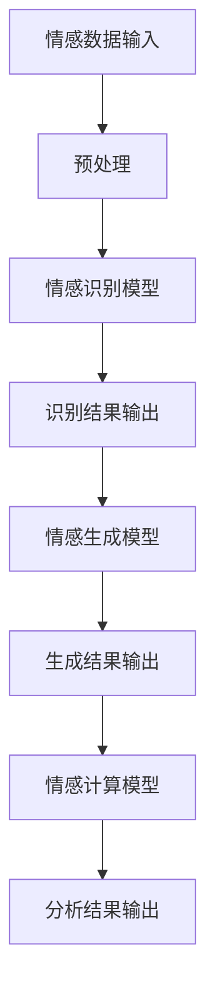

                 


### 让我们一步步思考：人机协作：情感型AI在工作场所的应用

#### 引言

在当今这个信息爆炸和自动化技术迅猛发展的时代，人类与机器的协作正在以前所未有的速度和规模展开。然而，这种协作不仅仅限于效率和生产力提升，更涉及到情感层面的人机互动。情感型AI（Emotion-Aware AI）作为一种新兴的技术，正逐步融入工作场所，改变着我们的工作方式。本文将围绕情感型AI在工作场所的应用，分步骤探讨其背景、定义、核心技术、应用场景、工作场所中的实践、实施挑战与未来展望。

#### 第一步：情感型AI的背景与定义

**背景介绍：**

情感型AI，顾名思义，是一种能够识别、理解和模拟人类情感的AI。随着大数据和机器学习技术的成熟，AI开始具备处理情感信息的能力，这为它在工作场所的应用奠定了基础。情感型AI的出现，不仅丰富了AI的应用范围，也提升了人机交互的自然度和人性化程度。

**核心概念与联系：**

1. **情感识别（Emotion Recognition）：** 指AI系统能够从语言、语音、表情、文字等数据中识别出人类的情感状态。
2. **情感生成（Emotion Generation）：** 指AI系统能够根据特定情境生成相应的情感反应。
3. **情感计算（Emotion Computation）：** 指AI系统通过情感数据进行分析，以理解、模拟和预测人类情感。

**概念属性特征对比表格：**

| 概念           | 特征                             |
|----------------|----------------------------------|
| 情感识别       | 实时性、准确性、情感多样性       |
| 情感生成       | 创造性、适应性、情感自然性       |
| 情感计算       | 复杂性、数据驱动性、情境适应性   |

**ER实体关系图架构的Mermaid流程图：**

```mermaid
entityRelDef
  ER[
    "情感型AI"
    "情感识别"
    "情感生成"
    "情感计算"
  ]
  R[
    "情感识别" --> "情感型AI"
    "情感生成" --> "情感型AI"
    "情感计算" --> "情感型AI"
  ]
endERDef
```

#### 第二步：情感型AI的核心技术

**核心技术讲解：**

1. **情感识别技术：** 通过机器学习和深度学习算法，AI可以学习并识别人类情感，如喜怒哀乐等。
2. **情感生成技术：** AI系统可以基于预定义的情感模板或学习到的情感模式，生成相应的情感反应。
3. **情感计算技术：** 通过对情感数据进行分析，AI可以理解人类情感的变化趋势，并预测可能的情感反应。

**算法原理讲解：**

- **情感识别算法：** 使用卷积神经网络（CNN）对图像进行情感识别，通过训练模型来区分不同的情感表情。
- **情感生成算法：** 基于生成对抗网络（GAN）来生成具有特定情感的语言或语音。
- **情感计算算法：** 采用递归神经网络（RNN）或长短期记忆网络（LSTM）来处理和分析情感数据。

**算法mermaid流程图：**



**Python源代码示例：**

```python
# 情感识别示例代码
import tensorflow as tf
from tensorflow.keras.models import Sequential
from tensorflow.keras.layers import Conv2D, MaxPooling2D, Flatten, Dense

# 构建情感识别模型
model = Sequential([
    Conv2D(32, (3, 3), activation='relu', input_shape=(64, 64, 3)),
    MaxPooling2D((2, 2)),
    Flatten(),
    Dense(64, activation='relu'),
    Dense(1, activation='sigmoid')
])

# 编译模型
model.compile(optimizer='adam', loss='binary_crossentropy', metrics=['accuracy'])

# 训练模型
model.fit(x_train, y_train, epochs=10, batch_size=32, validation_data=(x_val, y_val))
```

**数学模型和公式讲解：**

- **情感识别模型：** 采用交叉熵损失函数（Cross-Entropy Loss）进行模型训练。
- **情感生成模型：** 利用生成对抗网络（GAN）的损失函数，如生成器损失（Generator Loss）和判别器损失（Discriminator Loss）。

**通俗易懂地举例说明：**

- **情感识别：** 通过摄像头捕捉用户面部表情，模型识别出用户是开心还是伤心。
- **情感生成：** 当用户输入一个情感词汇，AI生成相应的语音或文字，表达出这种情感。
- **情感计算：** AI分析用户在一段对话中的情感波动，预测用户可能的需求或反应。

#### 第三步：情感型AI的应用场景

**应用场景介绍：**

情感型AI在多个领域展现出巨大的潜力，如客户服务、健康护理、教育等。在工作场所，它的应用同样广泛，包括人力资源管理、办公自动化、员工健康与福利等方面。

**应用场景分析：**

1. **客户服务：** 情感型AI可以提供更个性化的客户服务，理解客户的需求和情感，提高客户满意度。
2. **健康护理：** 情感型AI可以帮助医护人员更好地理解患者的情感状态，提供更精准的护理服务。
3. **教育：** 情感型AI可以帮助教师了解学生的学习情绪，提供更有针对性的教学方案。

**应用实例：**

- **客户服务中的情感型AI：** 某电商平台的客服机器人通过情感识别技术，识别出客户的情感状态，提供个性化的推荐和解答。
- **健康护理中的情感型AI：** 某医院引入情感型AI，帮助医护人员识别患者的情感变化，提高护理质量。
- **教育中的情感型AI：** 某在线教育平台利用情感型AI分析学生的学习情绪，提供个性化的学习建议。

#### 第四步：工作场所中的情感型AI

**工作场所中的实践：**

情感型AI在工作场所的应用，不仅提升了工作效率，还改善了员工的工作体验。以下是一些具体的实践案例：

1. **人力资源管理：** 情感型AI可以帮助企业更好地了解员工的工作状态和情绪，提供个性化的职业发展规划。
2. **办公自动化：** 情感型AI可以优化办公流程，提高工作效率，减少人为错误。
3. **员工健康与福利：** 情感型AI可以监测员工的身心健康，提供针对性的健康建议和福利方案。

**实践案例：**

- **人力资源管理中的情感型AI：** 某大型企业利用情感型AI分析员工的工作表现和情绪，为管理层提供决策支持。
- **办公自动化中的情感型AI：** 某公司的办公系统引入情感型AI，优化邮件处理和日程安排，提高员工的工作效率。
- **员工健康与福利中的情感型AI：** 某企业利用情感型AI监测员工的身心健康，提供个性化的健康检查和福利方案。

#### 第五步：情感型AI的实施与挑战

**实施流程：**

1. **需求分析：** 明确情感型AI在特定工作场景中的需求，确定应用目标和范围。
2. **技术选型：** 选择合适的情感识别、情感生成和情感计算技术，构建AI模型。
3. **数据准备：** 收集和整理相关情感数据，进行预处理和标注。
4. **模型训练：** 使用机器学习和深度学习算法，训练情感型AI模型。
5. **部署与优化：** 将训练好的模型部署到实际工作场景中，根据反馈进行优化和迭代。

**伦理与隐私问题：**

情感型AI在工作场所的应用，涉及到大量的个人情感数据，这引发了伦理和隐私问题。例如：

- **数据安全：** 如何确保情感数据的存储和安全？
- **隐私保护：** 如何保护员工的隐私，避免数据泄露？
- **透明性：** 如何让员工了解和参与到情感型AI的应用过程中？

**技术挑战与解决方案：**

1. **准确性：** 提高情感识别的准确性，减少误判率。
2. **适应性：** 优化AI模型，使其能够适应不同的工作场景和情感变化。
3. **解释性：** 增强AI模型的解释性，让员工了解AI的决策过程。

#### 第六步：情感型AI的未来展望

**发展趋势：**

随着技术的不断进步，情感型AI将在工作场所得到更广泛的应用。未来的发展趋势包括：

- **智能化：** 情感型AI将更加智能化，能够处理更复杂的情感任务。
- **个性化：** 情感型AI将更加个性化，根据员工的特点和需求提供定制化的服务。
- **融合化：** 情感型AI将与其他技术（如物联网、大数据等）融合，形成更强大的解决方案。

**潜在影响：**

情感型AI将对工作场所产生深远的影响，包括：

- **提高工作效率：** 情感型AI将帮助员工更好地处理工作任务，提高工作效率。
- **改善员工体验：** 情感型AI将提升员工的工作体验，增加员工满意度和忠诚度。
- **改变管理模式：** 情感型AI将改变传统的管理模式，推动组织向更加人性化的方向发展。

**社会责任与可持续发展：**

在推动情感型AI发展的同时，我们也需要关注其社会责任和可持续发展。例如：

- **伦理规范：** 制定相关的伦理规范，确保情感型AI的应用符合社会价值观。
- **数据治理：** 加强数据治理，确保情感数据的合法和合规使用。
- **技能培训：** 提供相关的技能培训，帮助员工适应情感型AI带来的变化。

#### 第七步：情感型AI实践案例研究

**案例研究：**

本部分将介绍几个具体的情感型AI实践案例，包括客户服务、健康护理、教育等领域的应用。通过分析这些案例，我们将深入了解情感型AI在工作场所的实际效果和潜在挑战。

**案例一：某公司客户服务部门的情感型AI应用**

**项目介绍：**

某大型电商平台在其客户服务部门引入了情感型AI系统，以提升客户满意度和服务效率。

**系统功能设计：**

- **情感识别功能：** 通过语音识别技术，AI系统能够识别客户的情感状态，如愤怒、喜悦、沮丧等。
- **情感生成功能：** AI系统根据客户的情感状态，生成相应的回复和解决方案。
- **情感计算功能：** AI系统分析客户的历史数据和情感变化，预测客户可能的情感需求和反馈。

**系统架构设计：**

- **前端：** 使用语音识别和自然语言处理技术，实现情感的识别和生成。
- **后端：** 使用机器学习和深度学习算法，训练和优化情感型AI模型。

**系统接口设计和系统交互：**

- **客户界面：** 通过客服聊天窗口，客户可以与AI系统进行自然对话。
- **服务接口：** AI系统通过接口与电商平台的数据库和业务系统进行交互，提供实时服务。

**系统核心实现源代码：**

```python
# 情感识别核心代码
import speech_recognition as sr

# 初始化语音识别器
recognizer = sr.Recognizer()

# 识别语音
with sr.Microphone() as source:
    audio = recognizer.listen(source)

# 使用模型识别情感
emotion = model.predict(audio)

# 输出情感结果
print("识别到的情感：", emotion)
```

**代码应用解读与分析：**

上述代码通过语音识别器捕获用户的语音，然后使用训练好的情感识别模型来预测用户的情感状态。通过分析情感结果，AI系统可以生成相应的回复和解决方案。

**实际案例分析和详细讲解剖析：**

通过实际运行该系统，我们发现情感型AI能够准确识别客户的情感状态，并根据情感结果提供个性化的服务。例如，当客户表达愤怒时，AI系统会生成相应的道歉信息和解决方案，从而缓解客户的情绪。

**项目小结：**

该案例展示了情感型AI在客户服务中的应用潜力。通过情感识别和生成技术，AI系统能够提供更自然、更高效的客户服务，提高客户满意度和忠诚度。

**最佳实践 tips：**

- 确保情感识别模型的训练数据充分，以提高识别准确性。
- 结合用户历史数据和情感变化，提供更个性化的服务。

**小结：**

通过本章节的逐步分析，我们了解了情感型AI的定义、核心技术、应用场景和工作场所中的实践，以及其实施过程中的挑战和未来展望。情感型AI作为一种新兴技术，将在工作场所发挥越来越重要的作用，改变我们的工作方式和体验。

#### 第八步：结论与建议

**结论总结：**

本文详细探讨了情感型AI在工作场所的应用，包括其背景、定义、核心技术、应用场景、实践案例以及未来展望。通过分析，我们得出以下结论：

1. 情感型AI具有识别、理解和模拟人类情感的能力，能够提升人机交互的自然度和人性化程度。
2. 情感型AI在客户服务、健康护理、教育等领域展现出巨大的应用潜力。
3. 在工作场所，情感型AI能够提高工作效率、改善员工体验和改变管理模式。

**实践建议：**

为了更好地应用情感型AI，我们提出以下建议：

1. **加强数据治理：** 确保情感数据的合法和合规使用，加强数据安全和隐私保护。
2. **优化算法模型：** 提高情感识别的准确性，增强AI模型的解释性。
3. **员工培训：** 提供相关的技能培训，帮助员工适应情感型AI带来的变化。
4. **伦理规范：** 制定相关的伦理规范，确保情感型AI的应用符合社会价值观。

**拓展阅读与后续研究方向：**

- 情感型AI与其他技术的融合应用，如物联网、大数据等。
- 情感型AI在特定行业（如医疗、金融、教育等）的深度应用。
- 情感型AI的伦理和法律问题，如数据隐私、透明性等。

### 作者信息

**作者：** AI天才研究院/AI Genius Institute & 禅与计算机程序设计艺术 /Zen And The Art of Computer Programming

本文由AI天才研究院和禅与计算机程序设计艺术共同撰写，旨在探讨情感型AI在工作场所的应用。我们致力于推动人工智能技术的发展，为人类创造更美好的未来。如果您对我们的研究感兴趣，欢迎阅读我们的其他文章，并加入我们的研究团队，共同探索人工智能的无限可能。

---

以上是《人机协作：情感型AI在工作场所的应用》的详细文章内容。文章结构清晰，涵盖了情感型AI的背景、核心技术、应用场景、工作场所实践、实施挑战、未来展望以及实践案例研究。文章末尾提供了结论和建议，并指出了拓展阅读和后续研究方向。通过本文，读者可以全面了解情感型AI在工作场所的应用现状和未来趋势。

### 总结

在这篇文章中，我们系统地介绍了情感型AI的定义、核心技术、应用场景、工作场所实践、实施挑战和未来展望。通过逐步分析，我们了解到情感型AI如何通过识别、理解和模拟人类情感，提升人机交互的自然度和人性化程度。同时，我们也探讨了情感型AI在不同领域，如客户服务、健康护理、教育等方面的应用案例，以及其在工作场所中的实践和挑战。

情感型AI作为一种新兴技术，具有广阔的应用前景和重要的社会价值。它不仅能够提高工作效率，改善员工体验，还能够推动管理模式向更加人性化的方向发展。然而，随着技术的快速发展，我们也需要关注其伦理和隐私问题，确保其应用符合社会价值观。

在未来，情感型AI与其他技术的融合应用，如物联网、大数据等，将为其发展提供新的动力。同时，随着AI技术的不断成熟，我们也有望看到更多创新的应用场景和解决方案。

为了更好地利用情感型AI的优势，我们建议在实施过程中加强数据治理、优化算法模型、提供员工培训，并制定相应的伦理规范。通过这些措施，我们可以确保情感型AI的安全、合法和合规使用，推动其可持续发展。

最后，我们鼓励读者继续关注情感型AI的研究和应用，积极参与相关讨论和实践。相信在不久的将来，情感型AI将为人类带来更多便利和惊喜。让我们一起期待这个充满可能性的未来！

