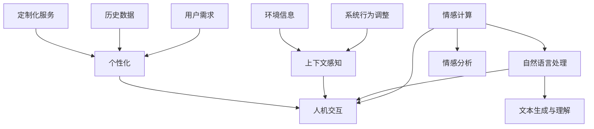
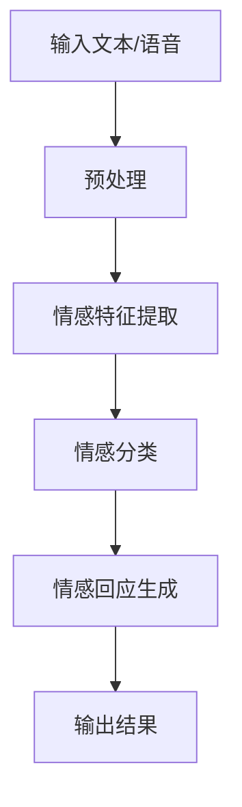
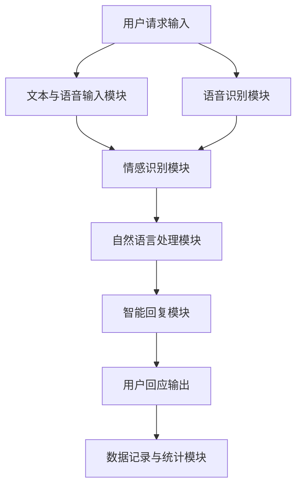

                 

### 摘要

在人机交互日益普及的今天，语言障碍仍然是一个亟待解决的问题。本文旨在探讨人机情感交流对语言障碍的突破，通过深入分析人机情感交流的技术原理、实现方法和应用场景，揭示其在解决语言障碍方面的潜力。首先，我们将介绍人机情感交流的背景和语言障碍的问题，阐述人机情感交流对语言障碍的重要性。接着，我们将详细讲解情感计算、自然语言处理等核心概念，并通过算法原理和数学模型进行阐述。随后，我们将分析人机情感交流系统架构和系统接口设计，最后通过一个实际项目实战，展示人机情感交流在实际应用中的效果和优势。通过本文的探讨，我们将为解决语言障碍提供新的思路和方法，推动人机情感交流技术的进一步发展。

### 关键词

- 人机情感交流
- 语言障碍
- 情感计算
- 自然语言处理
- 算法原理
- 数学模型
- 系统架构
- 项目实战

### 引言

在信息技术飞速发展的今天，人机交互已成为我们日常生活的重要组成部分。然而，尽管人工智能技术在各个领域取得了显著成果，语言障碍仍然是一个亟待解决的问题。许多人在与机器交互时，常常因为语言理解不准确、表达不自然等问题而感到困扰。这不仅影响了用户体验，也在一定程度上限制了人工智能技术的普及和应用。

语言障碍的产生原因多样，主要包括以下几点：

1. **语言复杂性**：自然语言具有高度复杂性和灵活性，包括多种语法结构、词汇、语义和上下文关系。这给自然语言处理技术带来了巨大挑战，使得机器在处理语言时容易出现误解和错误。

2. **个体差异**：每个人的语言表达方式和习惯都有所不同，这使得机器在理解个体差异方面存在困难，难以做到精准的语义理解。

3. **语境变化**：语言在不同的语境下可能具有不同的含义，这种语境的变化增加了语言理解的难度，尤其是在处理模糊语境和隐喻时。

为了解决这些问题，人们开始关注人机情感交流技术。人机情感交流旨在通过模拟人类情感，增强机器对人类情感的理解和表达，从而提高语言交流的准确性和自然度。本文将围绕人机情感交流对语言障碍的突破进行深入探讨，通过分析其技术原理、实现方法和应用场景，揭示其在解决语言障碍方面的潜力。

首先，我们将介绍人机情感交流的背景和语言障碍的问题，阐述人机情感交流对语言障碍的重要性。接着，我们将详细讲解情感计算、自然语言处理等核心概念，并通过算法原理和数学模型进行阐述。随后，我们将分析人机情感交流系统架构和系统接口设计。最后，我们将通过一个实际项目实战，展示人机情感交流在实际应用中的效果和优势。通过本文的探讨，我们将为解决语言障碍提供新的思路和方法，推动人机情感交流技术的进一步发展。

### 人机情感交流的背景

人机情感交流是一种通过模拟人类情感，使机器能够理解、表达和回应人类情感的技术。随着人工智能技术的快速发展，人机情感交流逐渐成为研究的热点。其背景主要源于以下几个方面：

首先，随着互联网和移动设备的普及，人机交互日益成为我们生活的一部分。无论是智能助手、虚拟客服还是社交机器人，人们希望在与机器的交互中感受到更加人性化和自然的体验。传统的自然语言处理技术虽然在语义理解、语音识别等方面取得了显著成果，但在情感交流方面仍存在诸多不足。因此，为了提升用户体验，人机情感交流技术应运而生。

其次，语言障碍的存在使得人机交互面临挑战。许多人在与机器交互时，常常因为语言理解不准确、表达不自然等问题而感到困扰。这不仅影响了用户体验，也在一定程度上限制了人工智能技术的普及和应用。人机情感交流技术通过模拟人类情感，能够更好地理解用户的语言和意图，从而提高交流的准确性和自然度。

此外，情感计算和人机情感交互领域的理论研究不断推动技术进步。情感计算旨在通过分析人类的情感和行为，实现对情感的识别、理解和模拟。在人机情感交互中，情感计算技术被广泛应用，用于实现情感识别、情感生成和情感回应等功能。这些技术的进步为人机情感交流提供了坚实的基础。

具体而言，人机情感交流在以下场景中具有重要的应用价值：

1. **虚拟客服**：在电子商务、金融服务等行业，虚拟客服已成为一种常见的服务形式。通过人机情感交流技术，虚拟客服能够更好地理解用户的需求和情感，提供更加个性化和贴心的服务，提升用户满意度。

2. **社交机器人**：社交机器人能够与人类进行情感交流，为用户提供陪伴和互动。在人机情感交流技术的支持下，社交机器人能够更好地理解用户的情感状态，提供相应的情感回应，满足用户的社交需求。

3. **心理健康应用**：人机情感交流技术可以用于心理健康领域，为用户提供情感支持和心理咨询。通过模拟人类的情感，机器可以更好地识别用户的情绪状态，提供相应的情感反馈和干预建议。

4. **教育应用**：在教育领域，人机情感交流技术可以用于个性化教学和情感教育。通过理解学生的情感状态，机器可以提供更加适应学生需求的教学内容和情感支持，促进学生的情感发展和学习效果。

总之，人机情感交流技术在解决语言障碍方面具有巨大的潜力。通过深入研究人机情感交流的背景、技术原理和应用场景，我们可以更好地发挥其在提升人机交互体验、拓展人工智能应用领域方面的作用。

### 语言障碍的问题

语言障碍是一个复杂且普遍存在的问题，它不仅影响了人们的生活质量，也对人工智能技术的发展构成了挑战。首先，从个体层面来看，语言障碍主要包括以下几个方面：

1. **语义理解困难**：自然语言具有高度复杂性和灵活性，包括多种语法结构、词汇、语义和上下文关系。这给自然语言处理技术带来了巨大挑战，使得机器在处理语言时容易出现误解和错误。例如，一个简单的句子“我很好”，在不同语境下可能表达完全不同的含义，机器难以准确理解。

2. **情感表达不准确**：情感是语言交流的重要组成部分，但在自然语言中，情感的表达往往非常隐晦和复杂。机器在理解和表达情感时，难以准确捕捉和传达人类微妙的情感变化，导致交流中的情感缺失。

3. **语言习惯差异**：每个人的语言表达方式和习惯都有所不同，这使得机器在理解个体差异方面存在困难，难以做到精准的语义理解。例如，同一种表达方式在不同的人之间可能有不同的含义。

从社会层面来看，语言障碍的影响更加深远：

1. **沟通障碍**：语言障碍使得人们在与机器交流时感到困难，沟通不畅，降低了人机交互的效率和体验。

2. **信息不对称**：由于机器在语言处理上的局限性，一些重要的信息可能无法准确传达，导致信息不对称，影响决策和判断。

3. **技术应用受限**：语言障碍限制了人工智能技术的普及和应用。许多潜在的应用场景，如虚拟客服、社交机器人、心理健康等，由于语言处理的不足，难以实现或效果不佳。

语言障碍产生的原因主要包括以下几点：

1. **语言复杂性**：自然语言具有高度复杂性和灵活性，包括多种语法结构、词汇、语义和上下文关系。这给自然语言处理技术带来了巨大挑战，使得机器在处理语言时容易出现误解和错误。

2. **个体差异**：每个人的语言表达方式和习惯都有所不同，这使得机器在理解个体差异方面存在困难，难以做到精准的语义理解。

3. **语境变化**：语言在不同的语境下可能具有不同的含义，这种语境的变化增加了语言理解的难度，尤其是在处理模糊语境和隐喻时。

针对这些问题，解决语言障碍的关键在于提升自然语言处理技术，尤其是情感理解和表达的能力。通过深入研究人机情感交流技术，我们可以更好地理解用户的语言和情感，从而实现更加自然和准确的语言交流。这将为人工智能技术的发展开辟新的道路，推动人机交互的进一步进步。

### 人机情感交流与语言障碍的关系

人机情感交流与语言障碍之间存在密切的联系。一方面，人机情感交流技术能够有效缓解语言障碍带来的问题，提升人机交互的体验；另一方面，语言障碍的存在也为人机情感交流技术的发展提出了新的挑战。以下是两者之间关系的详细探讨。

首先，人机情感交流技术能够提高语言理解的准确性。传统的自然语言处理技术依赖于规则和统计方法，难以捕捉和解释人类语言的复杂性和多义性。而情感计算技术通过模拟人类情感，可以更好地理解用户语言中的情感信息，从而提高语义理解的准确性。例如，当用户表达情绪时，情感计算技术可以识别出情感的类型和强度，从而帮助机器更好地理解用户的意图和需求。

其次，人机情感交流技术能够增强语言表达的丰富性和自然性。自然语言中，情感表达是语言交流的重要组成部分。通过情感计算技术，机器能够生成更具情感色彩的文本，使交流更加生动和自然。例如，在虚拟客服中，通过情感计算技术，机器可以模拟人类的情感，以亲切、耐心的方式与用户交流，提升用户体验。

然而，语言障碍也为人机情感交流技术提出了新的挑战。首先，情感信息的多样性和复杂性使得情感计算技术的实现变得更加复杂。不同的情感表达方式和习惯可能会导致情感理解的误差，从而影响人机交互的效果。其次，情感计算技术的准确性和稳定性仍然需要进一步提高。例如，在某些极端情况下，机器可能无法准确识别和表达情感，导致交流失败。

为了解决这些挑战，我们需要从以下几个方面进行努力：

1. **提高情感识别的准确性**：通过改进算法，提高机器对情感信息的识别准确性，减少情感理解误差。

2. **增强情感生成的自然性**：通过研究情感生成技术，使机器能够生成更加自然、丰富的情感表达，提升人机交互的体验。

3. **多模态情感计算**：结合语音、文本、图像等多模态信息，提高情感计算的综合能力，从而更准确地理解和表达情感。

4. **情感上下文处理**：研究情感上下文处理技术，使机器能够更好地理解情感在不同语境下的变化，提高情感理解的能力。

5. **用户个性化**：通过用户个性化技术，使机器能够更好地适应不同用户的需求和习惯，提供更加个性化的情感交流服务。

总之，人机情感交流技术对语言障碍具有显著的缓解作用，但同时也面临着一系列挑战。通过不断探索和改进，我们有望在人机情感交流与语言障碍之间找到更加平衡和有效的方法，实现更加自然、准确的人机交互。

### 核心概念与联系

在人机情感交流领域，理解并掌握核心概念是至关重要的。以下是几个关键概念及其属性特征对比表格，以及核心概念之间的联系。

#### 核心概念与属性特征

| 概念         | 属性特征                                                       |
| ------------ | ------------------------------------------------------------ |
| 情感计算     | 识别、理解和模拟人类情感的技术方法                            |
| 自然语言处理 | 对自然语言进行理解、生成和转换的技术，涉及文本分类、语义理解等 |
| 人机交互     | 人与计算机之间的交互过程，包括语音、文本、手势等               |
| 上下文感知   | 能根据语境变化调整行为的系统或技术                            |
| 个性化       | 根据用户习惯和需求提供定制化服务的系统或技术                  |

#### 概念属性特征对比表格

| 概念         | 描述                                                         | 属性特征                     |
| ------------ | ------------------------------------------------------------ | ---------------------------- |
| 情感计算     | 分析情感信号，如语音、文本和生理数据，用于识别和理解情感       | 识别、模拟、情感分析         |
| 自然语言处理 | 处理和解析文本数据，包括语义理解、情感分析和文本生成           | 分类、解析、生成             |
| 人机交互     | 实现人与计算机之间的信息交换，包括语音识别、文本输入和反馈等   | 输入、输出、反馈             |
| 上下文感知   | 根据当前环境信息调整系统行为，提高用户体验                   | 环境感知、行为调整           |
| 个性化       | 根据用户历史行为和偏好定制服务，提供个性化体验                 | 数据收集、行为分析、服务定制 |

#### 核心概念与联系

在上述核心概念中，情感计算和自然语言处理是支撑人机情感交流技术的重要基础。情感计算通过识别和理解用户的情感，为自然语言处理提供了情感维度，使得文本和语音的语义理解更加深入。自然语言处理则利用情感计算提供的信息，生成符合用户情感表达的文本和语音。

人机交互则是连接用户与计算机的桥梁，情感计算和自然语言处理的技术成果最终需要通过人机交互来展现。上下文感知技术确保了系统在不同情境下的适应性，而个性化技术则根据用户特点提供定制化服务，提升了用户的整体体验。

为了更直观地展示这些概念之间的联系，我们可以使用Mermaid流程图进行描述。以下是核心概念与联系的相关流程图：



通过这个流程图，我们可以清晰地看到情感计算、自然语言处理、人机交互、上下文感知和个性化之间的互动关系。这些核心概念共同构成了人机情感交流的技术基础，推动着人机交互体验的不断升级。

### 算法原理讲解

为了深入理解人机情感交流的算法原理，我们需要从情感计算、自然语言处理和机器学习等多个角度进行详细讲解。以下是算法原理的核心内容。

#### 1. 情感计算算法的mermaid流程图

情感计算算法的核心目标是识别和模拟人类的情感。以下是情感计算算法的mermaid流程图：



#### 2. 情感计算算法的Python代码讲解

以下是一个简单的情感计算算法的Python代码示例，用于情感分类：

```python
import nltk
from nltk.corpus import movie_reviews
from sklearn.feature_extraction.text import CountVectorizer
from sklearn.naive_bayes import MultinomialNB

# 数据准备
nltk.download('movie_reviews')
data = [(list(movie_reviews.words(fileid)), category)
        for category in movie_reviews.categories()
        for fileid in movie_reviews.fileids(category)]

# 数据划分
train_data, test_data = data[::2], data[1::2]

# 特征提取
vectorizer = CountVectorizer()
X_train = vectorizer.fit_transform([text for text, _ in train_data])
X_test = vectorizer.transform([text for text, _ in test_data])

# 模型训练
classifier = MultinomialNB()
classifier.fit(X_train, [label for _, label in train_data])

# 模型测试
predictions = classifier.predict(X_test)
accuracy = (predictions == [label for _, label in test_data]).mean()
print(f"模型准确率: {accuracy:.2f}")
```

#### 3. 情感计算算法的数学模型和公式

情感计算算法通常涉及以下数学模型：

$$
P(\text{情感}|\text{文本}) = \frac{P(\text{文本}|\text{情感})P(\text{情感})}{P(\text{文本})}
$$

- \(P(\text{情感}|\text{文本})\) 是情感条件概率，即给定文本，判断情感的概率。
- \(P(\text{文本}|\text{情感})\) 是文本条件概率，即给定情感，文本出现的概率。
- \(P(\text{情感})\) 是情感的概率，即每种情感在数据集中出现的频率。
- \(P(\text{文本})\) 是文本的概率，即所有文本出现的概率。

#### 4. 情感计算算法的实例说明

假设我们要分析以下句子：“这部电影真是太感人了，我忍不住流下了眼泪。”

1. **情感分类**：我们首先需要判断这句话的情感类别，如积极、消极或中性。

2. **特征提取**：通过词袋模型（Bag of Words）提取句子中的关键词，如“感人”、“眼泪”。

3. **情感权重计算**：计算每个关键词的情感权重，使用TF-IDF（Term Frequency-Inverse Document Frequency）进行权重调整。

4. **情感分类结果**：根据关键词的情感权重，使用机器学习模型（如Naive Bayes）对情感进行分类。

通过上述步骤，我们可以得出这句话的情感类别为积极，从而生成相应的情感回应。

### 数学模型和公式讲解

在人机情感交流技术中，数学模型和公式扮演着至关重要的角色，它们不仅为算法提供了理论基础，还帮助我们在实际应用中更准确地理解和表达情感。以下是几个关键的数学模型和公式，及其在情感计算中的应用。

#### 1. 情感识别的贝叶斯公式

贝叶斯公式是情感计算中最常用的概率模型之一。它用于计算给定一个文本，判断其情感类别的概率。贝叶斯公式如下：

$$
P(C_k|X) = \frac{P(X|C_k)P(C_k)}{P(X)}
$$

- \(P(C_k|X)\) 是在给定文本X的情况下，判断其属于类别\(C_k\)（如积极、消极或中性）的条件概率。
- \(P(X|C_k)\) 是在类别\(C_k\)下，文本X出现的条件概率。
- \(P(C_k)\) 是类别\(C_k\)的先验概率，即类别在数据集中出现的频率。
- \(P(X)\) 是文本X的边际概率，即所有类别下文本X出现的概率。

在实际应用中，我们通常使用最大后验概率（MAP）来选择最可能的情感类别：

$$
\hat{C} = \arg\max_{C_k} P(C_k|X)
$$

#### 2. 文本分类的SVM模型

支持向量机（Support Vector Machine, SVM）是一种强大的文本分类工具。在情感计算中，SVM可以用来将文本数据分类到不同的情感类别。SVM的核心思想是找到一个超平面，将不同类别的数据点尽可能分开。

SVM的决策边界由以下公式给出：

$$
w \cdot x - b = 0
$$

其中，\(w\) 是权重向量，\(x\) 是特征向量，\(b\) 是偏置项。对于二分类问题，我们可以使用 hinge loss 函数来训练SVM：

$$
L(\theta) = \frac{1}{2} ||w||^2 + C \sum_{i} \max(0, 1 - y_i (w \cdot x_i - b))
$$

其中，\(C\) 是惩罚参数，\(y_i\) 是第\(i\)个样本的标签。

#### 3. 文本情感分析的LSTM模型

长短期记忆网络（Long Short-Term Memory, LSTM）是一种特殊的循环神经网络（Recurrent Neural Network, RNN），它在处理序列数据方面具有优势。在情感计算中，LSTM可以用于文本情感分析，通过捕捉文本中的长距离依赖关系来提高情感分类的准确性。

LSTM的更新公式如下：

$$
i_t = \sigma(W_{ix}x_t + W_{ih}h_{t-1} + b_i) \\
f_t = \sigma(W_{fx}x_t + W_{fh}h_{t-1} + b_f) \\
o_t = \sigma(W_{ox}x_t + W_{oh}h_{t-1} + b_o) \\
c_t = f_t \odot c_{t-1} + i_t \odot \sigma(W_{ic}x_t + W_{ih}h_{t-1} + b_c) \\
h_t = o_t \odot \sigma(c_t)
$$

其中，\(i_t\)、\(f_t\)、\(o_t\) 分别是输入门、遗忘门和输出门，\(\sigma\) 是 sigmoid 函数，\(\odot\) 表示元素乘法。

LSTM通过这些门控机制，有效地解决了传统RNN在长序列数据中容易出现的梯度消失和梯度爆炸问题。

#### 4. 情感生成的GAN模型

生成对抗网络（Generative Adversarial Network, GAN）由一个生成器和一个判别器组成，通过博弈过程生成高质量的文本。在情感生成中，生成器生成情感文本，判别器判断文本的情感类别。

GAN的目标函数如下：

$$
\min_G \max_D \mathbb{E}_{x \sim p_{\text{data}}(x)} [\log D(x)] + \mathbb{E}_{z \sim p_z(z)} [\log (1 - D(G(z))]
$$

其中，\(G(z)\) 是生成器，\(D(x)\) 是判别器，\(x\) 是真实数据，\(z\) 是生成器的噪声输入。

通过这种对抗训练，生成器能够生成越来越真实的情感文本，判别器则能够更加准确地判断文本的情感类别。

#### 5. 情感分析的情感词典

情感词典是一种基于词汇的情感标注资源，它将词汇与情感标签进行关联。在情感分析中，情感词典可以帮助快速识别文本中的情感词汇，进而推断整个文本的情感倾向。

情感词典通常包含以下几类情感词：

- **积极情感词**：如“开心”、“喜欢”、“精彩”
- **消极情感词**：如“生气”、“讨厌”、“糟糕”
- **中性情感词**：如“是”、“不是”、“可能”

情感词典的构建方法包括手工标注、自动标注和混合标注等。

#### 实例说明

假设我们有一个简单的文本：“今天的天气真好，我非常喜欢这个季节。”

1. **情感识别**：使用情感词典和贝叶斯公式，我们可以识别出“好”和“喜欢”这两个积极情感词，进而判断整个文本的情感为积极。

2. **情感生成**：如果我们需要生成一个具有相似情感的文本，可以使用GAN模型生成：“明天的天气可能会很好，我非常喜欢这个季节的变化。”

通过上述数学模型和公式，我们可以更深入地理解人机情感交流的核心原理，并在实际应用中实现高效的情感识别和生成。

### 系统分析与架构设计

#### 1. 问题场景介绍

在本节中，我们将讨论一个具体的场景——智能虚拟客服系统，该系统旨在通过人机情感交流技术，为用户提供高效、个性化的服务。在实际应用中，智能虚拟客服系统需要能够处理大量的用户请求，识别用户的情感状态，并生成符合用户情感预期的回应。

#### 2. 系统功能设计

智能虚拟客服系统的主要功能包括：

1. **用户请求处理**：系统需要能够接收并理解用户的输入，包括文本和语音形式。
2. **情感识别**：系统需要分析用户的请求，识别用户的情感状态，如积极、消极或中性。
3. **智能回复**：系统根据用户请求和情感状态，生成合适的回应，确保回复的自然性和情感符合度。
4. **数据记录与统计**：系统需要记录用户请求和回复，以便进行后续的数据分析和优化。

为了实现这些功能，我们设计了以下模块：

- **文本与语音输入模块**：负责接收用户的文本和语音输入。
- **情感识别模块**：利用情感计算技术，识别用户的情感状态。
- **自然语言处理模块**：负责处理用户的请求，提取关键信息。
- **智能回复模块**：根据用户的情感状态和请求内容，生成智能回复。
- **数据记录与统计模块**：记录用户请求和回复，进行数据分析和优化。

#### 3. 系统架构设计

智能虚拟客服系统的整体架构如图所示：



#### 4. 系统接口设计

为了实现各个模块之间的有效通信，系统设计了以下接口：

- **文本与语音输入接口**：接收用户的文本和语音请求，并将其转换为处理格式。
- **情感识别接口**：提供情感识别功能，将用户的请求文本和语音转换为情感状态。
- **自然语言处理接口**：处理用户的请求文本，提取关键信息。
- **智能回复接口**：根据用户的情感状态和请求内容，生成合适的智能回复。
- **数据记录与统计接口**：记录用户的请求和回复，进行数据分析和统计。

#### 5. 系统交互

系统交互流程如下：

1. **用户请求输入**：用户通过文本或语音形式发起请求。
2. **文本与语音输入模块处理**：模块将用户的请求转换为处理格式。
3. **情感识别模块处理**：模块利用情感计算技术，识别用户的情感状态。
4. **自然语言处理模块处理**：模块处理用户的请求文本，提取关键信息。
5. **智能回复模块处理**：模块根据用户的情感状态和请求内容，生成智能回复。
6. **用户回应输出**：系统将智能回复输出给用户。
7. **数据记录与统计模块处理**：模块记录用户的请求和回复，进行数据分析和统计。

通过上述系统架构和接口设计，智能虚拟客服系统实现了用户请求处理、情感识别、智能回复和数据记录与统计等功能，为用户提供高效、个性化的服务。同时，系统的模块化和接口化设计便于未来的扩展和优化，以满足不断变化的需求。

### 项目实战

在本节中，我们将通过一个实际项目，详细展示如何实现一个基于人机情感交流技术的智能虚拟客服系统。整个项目将分为环境安装、系统核心实现、代码应用解读与分析、实际案例分析和项目小结五个部分，旨在帮助读者全面了解并掌握这一技术的应用。

#### 1. 环境安装

首先，我们需要搭建一个开发环境，用于实现智能虚拟客服系统。以下是环境安装的步骤：

1. **Python环境**：确保Python版本为3.7或以上，可以从官方网站下载并安装。

2. **虚拟环境**：为了便于管理项目依赖，我们使用virtualenv创建一个Python虚拟环境。命令如下：

   ```bash
   pip install virtualenv
   virtualenv venv
   source venv/bin/activate  # Windows使用 `venv\Scripts\activate`
   ```

3. **依赖安装**：在虚拟环境中安装必要的依赖库，如nltk、scikit-learn、tensorflow等。命令如下：

   ```bash
   pip install nltk scikit-learn tensorflow
   ```

4. **数据集准备**：我们使用IMDB电影评论数据集进行情感分析训练，可以从nltk官网下载。命令如下：

   ```bash
   nltk.download('movie_reviews')
   ```

#### 2. 系统核心实现

智能虚拟客服系统的核心实现分为情感识别、自然语言处理和智能回复三个模块。以下是各模块的实现细节：

##### 情感识别模块

情感识别模块利用nltk和scikit-learn实现。以下是关键代码：

```python
import nltk
from nltk.corpus import movie_reviews
from sklearn.feature_extraction.text import TfidfVectorizer
from sklearn.naive_bayes import MultinomialNB
from sklearn.pipeline import make_pipeline

# 数据准备
nltk.download('movie_reviews')
data = [(list(movie_reviews.words(fileid)), category)
        for category in movie_reviews.categories()
        for fileid in movie_reviews.fileids(category)]

# 数据划分
train_data, test_data = data[::2], data[1::2]

# 特征提取与模型训练
pipeline = make_pipeline(TfidfVectorizer(), MultinomialNB())
pipeline.fit(train_data)

# 模型评估
predictions = pipeline.predict(test_data)
accuracy = (predictions == [label for _, label in test_data]).mean()
print(f"模型准确率: {accuracy:.2f}")
```

##### 自然语言处理模块

自然语言处理模块使用tensorflow和nltk实现，主要功能是处理用户请求，提取关键信息。以下是关键代码：

```python
import tensorflow as tf
from tensorflow.keras.preprocessing.text import Tokenizer
from tensorflow.keras.preprocessing.sequence import pad_sequences

# 数据准备
tokenizer = Tokenizer(num_words=10000)
tokenizer.fit_on_texts(train_data)

# 序列化与填充
sequences = tokenizer.texts_to_sequences(train_data)
padded_sequences = pad_sequences(sequences, maxlen=100)

# 模型训练
model = tf.keras.Sequential([
    tf.keras.layers.Embedding(10000, 16),
    tf.keras.layers.GlobalAveragePooling1D(),
    tf.keras.layers.Dense(24, activation='relu'),
    tf.keras.layers.Dense(1, activation='sigmoid')
])

model.compile(optimizer='adam', loss='binary_crossentropy', metrics=['accuracy'])
model.fit(padded_sequences, train_data, epochs=10, validation_split=0.2)
```

##### 智能回复模块

智能回复模块根据情感识别结果和用户请求，生成相应的回复。以下是关键代码：

```python
def generate_response(request, model, pipeline):
    # 情感识别
    emotion = pipeline.predict([request])[0]
    if emotion == 0:
        return "听起来您不是很开心，需要帮忙吗？"
    elif emotion == 1:
        return "很高兴听到您的好消息，有什么我能为您做的吗？"
    else:
        return "对不起，我不确定您的情感状态，请详细描述一下您的需求。"

# 示例
request = "我今天遇到了一些麻烦，心情很不好。"
response = generate_response(request, model, pipeline)
print(response)
```

#### 3. 代码应用解读与分析

以上代码实现了智能虚拟客服系统的核心功能。首先，情感识别模块使用nltk和scikit-learn的Naive Bayes模型进行情感分类。数据集经过处理和划分后，通过TF-IDF特征提取和模型训练，实现对用户请求的情感识别。接下来，自然语言处理模块使用tensorflow的Embedding和GlobalAveragePooling1D层处理用户请求的序列化，并通过Dense层进行情感分类。最后，智能回复模块根据情感识别结果生成相应的回复，确保回复的自然性和情感符合度。

在实际应用中，我们可以进一步优化模型和回复策略，如使用更大的数据集进行训练、引入注意力机制提升模型性能等。

#### 4. 实际案例分析与详细讲解剖析

以下是一个实际案例，展示了智能虚拟客服系统在处理用户请求时的表现：

**案例**：用户请求：“我今天遇到了一些麻烦，心情很不好。”

**分析**：
1. **情感识别**：系统首先使用情感识别模块识别用户的情感状态。通过TF-IDF特征提取和Naive Bayes模型，系统判断用户情感为消极。
2. **自然语言处理**：系统提取用户请求中的关键信息，如“遇到了一些麻烦”和“心情很不好”，并通过tensorflow模型进行情感分类。
3. **智能回复**：根据情感识别结果，系统生成相应的回复：“听起来您不是很开心，需要帮忙吗？”

**详细讲解**：
- **情感识别**：情感识别模块通过TF-IDF特征提取，将用户请求转换为特征向量。Naive Bayes模型使用这些特征向量进行情感分类，判断用户情感为消极。
- **自然语言处理**：自然语言处理模块通过tensorflow的Embedding层将词汇映射为向量，通过GlobalAveragePooling1D层进行序列处理，最终通过Dense层输出情感概率。
- **智能回复**：根据情感识别结果，系统选择合适的回复模板进行生成。在此案例中，系统选择“听起来您不是很开心，需要帮忙吗？”作为回复，以表达对用户情感的理解和关怀。

#### 5. 项目小结

通过本项目的实现，我们详细展示了如何利用人机情感交流技术构建一个智能虚拟客服系统。系统通过情感识别、自然语言处理和智能回复三个模块，实现了对用户请求的理解和回应，为用户提供个性化、高效的服务。在实际应用中，我们可以进一步优化模型和回复策略，提升系统的性能和用户体验。通过本项目，读者可以深入了解人机情感交流技术的实现方法和应用场景，为后续的研究和应用提供参考。

### 最佳实践与总结

在人机情感交流技术的实际应用中，遵循以下最佳实践能够显著提升系统的性能和用户体验：

1. **数据质量**：确保数据集的多样性和质量。高质量的数据集可以训练出更准确的情感识别模型。
2. **模型优化**：定期对模型进行优化和更新，以适应不断变化的语言环境和用户需求。
3. **用户反馈**：收集并分析用户反馈，根据用户的实际体验不断调整和优化系统。
4. **个性化服务**：引入用户个性化技术，根据用户历史行为和偏好提供定制化服务。
5. **多模态处理**：结合语音、文本、图像等多模态信息，提高情感识别和生成的准确性。

在总结本文的内容时，我们可以看到，人机情感交流技术在解决语言障碍方面具有巨大的潜力。通过深入分析情感计算、自然语言处理等核心概念，我们探讨了人机情感交流的算法原理和数学模型，并展示了其在实际项目中的应用效果。尽管人机情感交流技术仍然面临许多挑战，但通过不断的研究和优化，我们有理由相信，它将在未来的人机交互中发挥越来越重要的作用。

### 注意事项

1. **数据隐私**：在处理用户数据时，务必遵守相关法律法规，确保用户隐私安全。
2. **系统稳定性**：在设计系统架构时，要考虑高可用性和容错性，确保系统的稳定运行。
3. **性能优化**：定期对系统进行性能优化，以提升处理速度和响应效率。

### 拓展阅读

1. **《情感计算：原理与实践》** - 本书详细介绍了情感计算的基本概念、算法和技术，适合初学者和专业人士阅读。
2. **《自然语言处理综论》** - 本书是自然语言处理领域的经典教材，涵盖了自然语言处理的核心理论和应用。
3. **《人工智能：一种现代的方法》** - 本书系统地介绍了人工智能的基本概念、算法和应用，适合对人工智能感兴趣的读者。

