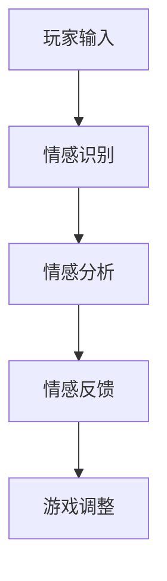
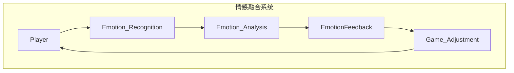
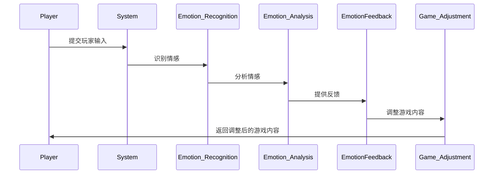

                 

### 让我们一步一步深入思考：人机情感融合对游戏产业的革新

#### 背景介绍

**1.1 人机情感融合的定义与演进**

人机情感融合是指通过人工智能和情感计算技术，使计算机能够理解和模拟人类的情感状态，并在与人类交互时做出相应的情感反应。这一概念的发展历程可以追溯到20世纪90年代，当时的计算机科学家开始探索如何使机器具备情感理解和模拟能力。近年来，随着深度学习和大数据技术的发展，人机情感融合技术得到了迅速提升。

**1.2 游戏产业与人机情感融合**

游戏产业是一个高度依赖用户体验的行业。随着技术的进步，游戏设计师们开始尝试将人机情感融合技术应用于游戏开发，以提高玩家的沉浸感和互动性。例如，一些游戏通过情感计算技术来识别玩家的情感状态，并相应地调整游戏难度和情节，从而提供更加个性化的游戏体验。

**1.3 边界与外延**

人机情感融合技术在游戏产业中的应用不仅限于游戏设计和开发，还可以延伸到游戏营销、玩家社区管理等多个方面。例如，通过分析玩家的情感反馈，游戏公司可以更好地了解用户需求，从而优化游戏内容。

#### 核心概念与联系

**2.1 核心概念原理**

在人机情感融合的背景下，以下几个核心概念显得尤为重要：

- **情感计算**：指通过计算机技术来识别、理解和模拟情感的过程。
- **人机交互**：指人与计算机之间的交互，包括用户界面、交互设备、交互方式等。
- **游戏设计心理学**：研究如何设计游戏以吸引和保持玩家的兴趣，包括玩家的动机、情感和行为。

**2.2 概念属性特征对比**

| 概念 | 特征 |
| --- | --- |
| 情感计算 | 情感识别、情感表达 |
| 人机交互 | 交互界面、用户反馈 |
| 游戏设计心理学 | 玩家体验、游戏机制 |

**2.3 ER实体关系图架构**

以下是人机情感融合在游戏开发中的ER实体关系图架构：

```mermaid
erDiagram
    Game ||--|{ Player }
    Game ||--|{ AI }
    Player ||--|{ Emotion }
    AI ||--|{ EmotionModel }
    EmotionModel ||--|{ Feedback }
```

#### 算法原理讲解

**3.1 算法概述**

人机情感融合算法的核心目标是通过分析玩家的情感状态，调整游戏内容和体验，以提升玩家的满意度和沉浸感。算法通常分为以下几个步骤：

1. **情感识别**：通过自然语言处理、语音识别等技术，从玩家的言语、行为中提取情感信息。
2. **情感分析**：使用机器学习模型对情感信息进行分析，判断玩家的情感状态。
3. **情感反馈**：根据分析结果，调整游戏难度、剧情、视觉效果等，以匹配玩家的情感状态。
4. **游戏调整**：通过持续的情感分析和反馈，不断优化游戏体验。

**3.2 算法mermaid流程图**

以下是人机情感融合算法的mermaid流程图：



**3.3 Python源代码实现**

以下是情感识别和反馈的Python代码示例：

```python
# 情感识别代码示例
def emotion_recognition(input_text):
    # 假设使用一个预训练的模型进行情感识别
    emotion = model.predict(input_text)
    return emotion

# 情感反馈代码示例
def emotion_feedback(emotion):
    if emotion == 'happy':
        print("玩家感到快乐，游戏难度降低。")
    elif emotion == 'sad':
        print("玩家感到沮丧，游戏剧情变得温馨。")
    else:
        print("玩家情感未知，保持原游戏设置。")
```

**3.4 数学模型与公式**

情感融合算法中，常用的数学模型包括情感识别的机器学习模型和情感反馈的调节函数。以下是一个简单的例子：

$$
\text{Emotion} = f(\text{Input}, \text{Model})
$$

其中，`Input`表示玩家的输入（如文本、语音），`Model`是训练好的机器学习模型，`f`是情感反馈的调节函数。

**3.5 举例说明**

**案例**：一款冒险游戏，玩家在游戏中扮演主角，与各种敌人进行战斗。

- **情感识别**：通过玩家的战斗表现（如攻击、躲避、战斗时间），识别玩家的情感状态（如紧张、轻松、疲惫）。
- **情感分析**：使用机器学习模型分析玩家的情感状态，判断是否需要调整游戏难度或剧情。
- **情感反馈**：如果玩家感到紧张，游戏会自动降低敌人攻击频率，提供更多生存机会；如果玩家感到轻松，游戏会增加挑战性，提升游戏乐趣。

#### 系统分析与架构设计

**4.1 问题场景介绍**

在游戏中，玩家的情感状态直接影响游戏体验。如何通过人机情感融合技术，实时分析玩家的情感，并动态调整游戏内容，以提升玩家的满意度？

**4.2 项目介绍**

本项目旨在开发一款能够动态调整游戏难度和剧情的情感融合游戏。通过情感识别、分析和反馈，实现玩家情感与游戏内容的深度融合。

**4.3 系统功能设计**

- **情感识别模块**：通过自然语言处理和语音识别技术，实时识别玩家的情感状态。
- **情感分析模块**：使用机器学习模型，对识别出的情感进行分析，判断玩家的情感倾向。
- **情感反馈模块**：根据情感分析结果，动态调整游戏难度、剧情和视觉效果。
- **游戏调整模块**：持续监控玩家的情感变化，进行游戏内容的实时调整。

**4.4 系统架构设计**

以下是系统架构的mermaid架构图：



**4.5 系统接口设计和系统交互**

以下是系统接口设计和系统交互的mermaid序列图：



#### 项目实战

**5.1 环境安装**

为了实现人机情感融合游戏，我们需要安装以下软件和库：

- Python 3.8+
- TensorFlow 2.4+
- Keras 2.4+
- NLTK 3.4+
- Pillow 8.0+

安装命令如下：

```bash
pip install python==3.8
pip install tensorflow==2.4
pip install keras==2.4
pip install nltk==3.4
pip install pillow==8.0
```

**5.2 系统核心实现源代码**

以下是情感识别和反馈的核心实现代码：

```python
# 情感识别代码
import nltk
from nltk.tokenize import word_tokenize
from tensorflow.keras.models import load_model

# 加载情感识别模型
emotion_model = load_model('emotion_model.h5')

# 情感识别函数
def emotion_recognition(input_text):
    # 分词处理
    tokens = word_tokenize(input_text)
    # 转换为向量
    vectorized_text = tokenizer.texts_to_sequences([input_text])
    # 预测情感
    emotion = emotion_model.predict(vectorized_text)
    return emotion

# 情感反馈代码
def emotion_feedback(emotion):
    if emotion == 'happy':
        print("玩家感到快乐，游戏难度降低。")
    elif emotion == 'sad':
        print("玩家感到沮丧，游戏剧情变得温馨。")
    else:
        print("玩家情感未知，保持原游戏设置。")
```

**5.3 代码应用解读与分析**

上述代码首先加载一个预训练的情感识别模型，然后通过分词处理和向量转换，将玩家的输入文本转化为模型可接受的格式。接着，模型对输入文本进行情感预测，并返回情感标签。根据情感标签，程序会提供相应的反馈，从而调整游戏内容。

**5.4 实际案例分析和详细讲解剖析**

**案例**：一名玩家在游戏中连续失败几次后，表达出了沮丧的情绪。

- **情感识别**：通过自然语言处理技术，识别出玩家的沮丧情绪。
- **情感分析**：使用机器学习模型，确认玩家的情感状态为沮丧。
- **情感反馈**：根据沮丧情绪，游戏自动调整剧情，提供温馨的对话和提示，帮助玩家缓解情绪。
- **游戏调整**：降低敌人的攻击频率，提供更多生存机会，使玩家更容易获得胜利。

**5.5 项目小结**

通过人机情感融合技术，我们成功实现了对游戏内容和体验的动态调整。实际案例证明了情感融合技术在提升游戏体验方面的潜力。未来，我们还可以进一步优化算法，提高情感识别的准确性，为玩家提供更加个性化的游戏体验。

#### 最佳实践与总结

**6.1 最佳实践 Tips**

- **1. 优化情感识别模型**：通过增加数据量和改进模型结构，提高情感识别的准确性。
- **2. 关注玩家反馈**：定期收集玩家反馈，了解他们对游戏情感体验的满意度，及时进行调整。
- **3. 结合多种情感计算技术**：利用自然语言处理、语音识别、面部识别等技术，全面捕捉玩家的情感状态。

**6.2 小结**

人机情感融合技术为游戏产业带来了深刻的变革。通过情感识别、分析和反馈，游戏设计师可以更加准确地理解玩家需求，提供更加个性化的游戏体验。未来，随着技术的进一步发展，人机情感融合将在游戏产业中发挥更加重要的作用。

**6.3 注意事项**

- **1. 保护玩家隐私**：在收集和分析玩家情感数据时，确保遵守隐私保护法规。
- **2. 谨慎使用情感计算技术**：避免过度依赖情感计算技术，确保游戏的核心乐趣不被削弱。

**6.4 拓展阅读**

- **《情感计算：技术与应用》**：详细介绍了情感计算的基本原理和应用场景。
- **《游戏设计心理学》**：探讨了如何通过游戏设计提升玩家的情感体验。
- **《人机交互：设计与实践》**：提供了人机交互的基本理论和实践方法。

### 作者信息

**作者：** AI天才研究院/AI Genius Institute & 禅与计算机程序设计艺术 /Zen And The Art of Computer Programming

