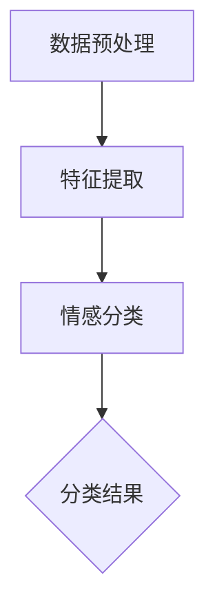
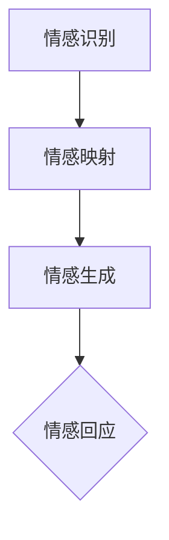
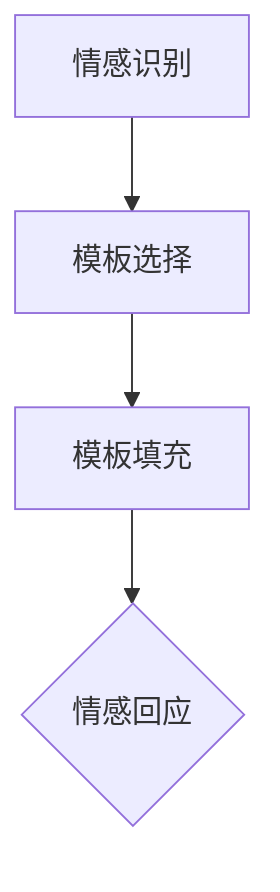

                 

### 引言

随着人工智能技术的飞速发展，人类与机器之间的互动方式正在发生深刻变革。在这一背景下，人机情感融合成为了前沿研究领域的一个重要课题。人机情感融合指的是通过人工智能技术理解和模拟人类的情感状态，从而实现人与机器之间的情感共鸣和交互。而社交媒体，作为现代社会中信息传播和社交互动的主要平台，正面临着信息过载、内容同质化、情感连接薄弱等问题。本文旨在探讨人机情感融合如何革新社交媒体，使其更贴近人类的情感需求，提升用户体验。

本文将分以下几个部分展开讨论：

1. **背景介绍**：首先，我们将介绍人机情感融合的基本概念，以及社交媒体在当前社会中的重要性。通过分析当前社交媒体面临的挑战，我们将说明人机情感融合的必要性和其在社交媒体中的潜在应用。
   
2. **核心概念与联系**：接着，我们将深入探讨人机情感融合的技术原理，包括其定义、特点以及技术架构。同时，我们将通过对比分析，阐述人机情感融合与传统社交媒体及其他人工智能技术的差异和联系。

3. **算法原理讲解**：为了深入理解人机情感融合如何革新社交媒体，我们将详细介绍相关的算法原理。通过Mermaid流程图展示算法流程，并结合Python源代码详细阐述算法原理，包括数学模型和公式。

4. **系统分析与架构设计方案**：我们将设计一个系统的框架，包括问题场景介绍、项目介绍、系统功能设计、系统架构设计、系统接口设计和系统交互。通过Mermaid类图、架构图和序列图来帮助读者理解系统的整体结构和工作流程。

5. **项目实战**：为了使读者更好地理解人机情感融合在社交媒体中的实际应用，我们将提供一个实际的项目实战案例。从环境安装、系统核心实现源代码，到代码应用解读与分析，以及实际案例分析和详细讲解剖析，我们将一步步带领读者走进人机情感融合的世界。

6. **最佳实践 tips、小结、注意事项、拓展阅读**：最后，我们将总结书中的内容，提供最佳实践建议，提醒读者注意事项，并推荐拓展阅读资源，以帮助读者更深入地了解和探索人机情感融合在社交媒体中的应用。

通过以上几个部分的详细探讨，本文将系统地展示人机情感融合如何革新社交媒体，提升用户体验，为未来的社交平台发展提供新的思路和方向。

---

### 1.1 问题的背景

#### 人机情感融合的概念

人机情感融合是指利用人工智能技术，尤其是自然语言处理（NLP）和机器学习算法，使机器能够理解、模拟和响应人类的情感状态。这一概念源于对人类情感复杂性的深入研究，以及人工智能在情感计算领域的应用探索。具体而言，人机情感融合包含了以下几个关键要素：

1. **情感识别**：通过分析语言、声音、面部表情等人类表达方式，机器能够识别出用户的情感状态。
2. **情感模拟**：机器能够模拟出与人类情感相似的反应，以实现更自然的交互体验。
3. **情感回应**：在识别和模拟情感的基础上，机器能够给予用户相应的情感回应，增强互动的深度和丰富度。

#### 社交媒体的重要性

社交媒体在当今社会中的作用不容忽视。作为信息传播和社交互动的主要平台，社交媒体已经成为人们日常生活的一部分。以下是一些社交媒体的重要特点：

1. **信息传播速度快**：社交媒体平台上的信息传播速度极快，能够在短时间内达到广泛的受众。
2. **互动性强**：用户可以通过评论、点赞、分享等方式与其他用户互动，建立社交关系。
3. **个性化推荐**：基于用户行为和偏好，社交媒体平台能够为用户提供个性化的内容推荐，提升用户体验。
4. **内容多样性**：社交媒体平台上的内容形式多样，包括文字、图片、视频等，满足了用户不同的需求。

#### 人机情感融合与社交媒体的结合

人机情感融合与社交媒体的结合，旨在通过人工智能技术提升用户的情感体验，解决当前社交媒体面临的一系列问题。以下是人机情感融合与社交媒体结合的几个关键点：

1. **情感互动**：通过人机情感融合技术，社交媒体平台能够实现更自然的情感互动，使用户感受到机器如同真实人类一般的情感共鸣。
2. **个性化服务**：人机情感融合技术可以帮助社交媒体平台更准确地理解用户情感，从而提供更加个性化的服务，提高用户满意度。
3. **内容质量提升**：通过情感分析技术，社交媒体平台可以筛选出更符合用户情感需求的内容，减少信息过载和内容同质化问题。
4. **情感健康监测**：人机情感融合技术还可以用于情感健康监测，及时发现用户情感问题，提供心理支持和服务。

### 1.2 问题描述与解决

#### 当前社交媒体的挑战

随着社交媒体的普及，平台也面临着一系列挑战。这些挑战主要包括：

1. **信息过载**：随着用户生成内容（UGC）的爆炸式增长，用户难以筛选出有价值的信息。
2. **内容同质化**：大量的类似内容使得用户难以找到新颖、独特的体验。
3. **情感连接薄弱**：尽管用户在社交媒体上互动频繁，但情感连接仍然较为薄弱，难以形成深厚的社交关系。
4. **隐私问题**：用户隐私保护是社交媒体平台需要面对的一个重要问题。

#### 人机情感融合的解决方案

人机情感融合技术为解决上述社交媒体挑战提供了新的思路。以下是人机情感融合技术可能带来的具体解决方案：

1. **情感识别与筛选**：通过情感识别技术，社交媒体平台可以筛选出用户感兴趣的内容，减少信息过载。
2. **个性化推荐**：基于情感分析，社交媒体平台可以更准确地推荐内容，满足用户的个性化需求。
3. **情感互动增强**：人机情感融合技术可以使社交媒体平台实现更自然的情感互动，增强用户情感连接。
4. **隐私保护**：通过合理利用情感数据，社交媒体平台可以在保护用户隐私的前提下，提供更有价值的服务。

#### 边界与外延

人机情感融合在社交媒体中的应用虽然具有巨大潜力，但也存在一定的边界和限制。以下是一些需要考虑的边界与外延：

1. **技术成熟度**：目前人机情感融合技术仍在不断发展和完善中，需要考虑技术的成熟度和可行性。
2. **用户接受度**：用户对于人机情感融合技术的接受程度，可能会影响其推广应用。
3. **隐私与伦理**：在利用情感数据进行交互时，需要充分考虑用户隐私和伦理问题。
4. **监管与法规**：随着人机情感融合技术的发展，相关监管和法规也需要及时跟进，以确保技术的健康和可持续发展。

通过上述分析，我们可以看到人机情感融合技术为解决当前社交媒体挑战提供了新的方向和可能性。在接下来的章节中，我们将进一步探讨人机情感融合的技术原理、应用场景以及具体实现方法。

### 1.3 核心概念结构

#### 人机情感融合的核心要素

人机情感融合作为一种新兴的技术理念，其核心要素主要包括情感识别、情感模拟和情感回应。以下是这些要素的具体解释：

1. **情感识别**：情感识别是指通过分析用户的语言、声音、面部表情等数据，机器能够识别出用户的情感状态。这一过程通常依赖于自然语言处理（NLP）、语音识别（ASR）和计算机视觉（CV）等技术。
2. **情感模拟**：情感模拟是指机器能够根据识别出的情感状态，模拟出相应的情感反应，以实现更自然的交互体验。这一过程涉及到情感生成模型和模仿学习技术。
3. **情感回应**：情感回应是指机器在识别和模拟情感后，对用户的行为和需求做出相应的回应。这种回应可以是语言上的，也可以是行为上的，如提供相关建议、情感支持等。

#### 社交媒体的核心要素

社交媒体的核心要素主要包括用户、内容、互动和平台。以下是这些要素的具体解释：

1. **用户**：用户是社交媒体平台的主要参与者，他们通过发布内容、评论、点赞等方式进行互动。
2. **内容**：内容是社交媒体平台的主要载体，包括文字、图片、视频等多种形式。用户通过生成和分享内容，实现了信息的传播和社交互动。
3. **互动**：互动是社交媒体的核心功能，用户通过评论、点赞、分享等行为进行互动，建立了社交网络。
4. **平台**：平台是社交媒体的基础设施，为用户提供了一个交互和共享的环境。平台通常包括前端界面、后端服务器和数据库等组成部分。

#### 人机情感融合与社交媒体的融合模型

人机情感融合与社交媒体的结合，形成了一个复杂的融合模型，其核心在于通过人工智能技术提升用户的情感体验。以下是这个融合模型的基本架构：

1. **数据收集**：社交媒体平台通过用户生成内容（UGC）和用户行为数据，收集用户情感信息。
2. **情感识别**：利用自然语言处理（NLP）、语音识别（ASR）和计算机视觉（CV）等技术，对用户情感信息进行识别。
3. **情感模拟**：基于识别出的情感状态，机器模拟出相应的情感反应，以实现更自然的交互体验。
4. **情感回应**：机器根据情感模拟结果，对用户的行为和需求做出相应的回应，如提供相关建议、情感支持等。
5. **互动优化**：通过情感回应，平台可以优化用户的互动体验，增强情感连接。
6. **个性化服务**：基于情感数据，平台可以提供更个性化的内容推荐和服务，提升用户满意度。

通过上述融合模型，人机情感融合技术为社交媒体平台带来了新的可能性和发展方向。在接下来的章节中，我们将进一步探讨人机情感融合的技术原理和应用场景。

### 2.1 人机情感融合技术原理

#### 人机情感融合的定义

人机情感融合是指通过人工智能技术，特别是自然语言处理（NLP）、语音识别（ASR）和计算机视觉（CV）等技术，使机器能够理解和模拟人类的情感状态，实现与人类在情感层面的互动。这一技术不仅要求机器具备情感识别的能力，还需要能够进行情感模拟和情感回应。

**定义核心要素：**
- **情感识别**：通过分析用户的语言、声音、面部表情等数据，机器能够识别出用户的情感状态。
- **情感模拟**：机器能够根据情感识别的结果，模拟出相应的情感反应。
- **情感回应**：机器在识别和模拟情感后，对用户的行为和需求做出相应的回应。

#### 人机情感融合的特点

人机情感融合具有以下几个显著特点：

1. **自然性**：人机情感融合技术追求自然、流畅的交互体验，使机器在情感表达上更接近真实人类。
2. **多样性**：人机情感融合能够处理多种情感类型，包括快乐、悲伤、愤怒、惊讶等。
3. **实时性**：通过实时情感分析，人机情感融合技术能够快速响应用户的情感变化，提供即时的情感支持。
4. **个性化**：基于用户情感数据，人机情感融合技术能够为用户提供个性化的情感互动和服务。

#### 人机情感融合的技术架构

人机情感融合的技术架构通常包括以下几个关键组成部分：

1. **数据收集与预处理**：通过社交媒体平台、传感器等渠道收集用户情感数据，并进行预处理，如数据清洗、归一化等。
2. **情感识别模块**：利用自然语言处理（NLP）、语音识别（ASR）和计算机视觉（CV）等技术，对用户情感数据进行识别。
   - **自然语言处理（NLP）**：通过情感分析、情感极性分类等技术，分析用户的语言表达，识别情感状态。
   - **语音识别（ASR）**：通过语音信号处理技术，识别用户的语音情感，如语调、语速等。
   - **计算机视觉（CV）**：通过面部表情识别、姿态分析等技术，识别用户的面部表情和身体语言，获取情感状态。
3. **情感模拟模块**：根据情感识别的结果，利用情感生成模型和模仿学习技术，模拟出相应的情感反应。
   - **情感生成模型**：通过深度学习等算法，生成与用户情感状态匹配的文本、语音、图像等。
   - **模仿学习技术**：通过模仿真实人类情感表达，使机器能够自然地进行情感模拟。
4. **情感回应模块**：在识别和模拟情感的基础上，机器通过语言、行为等方式，对用户进行情感回应。
   - **语言回应**：生成符合用户情感状态的回应文本，如安慰、鼓励等。
   - **行为回应**：通过视觉和动作，如表情、动作等，进行情感回应。

#### 人机情感融合与其他相关技术的对比

人机情感融合与其他人工智能技术的对比，有助于理解其独特性和优势：

1. **与传统社交媒体的比较**：
   - **传统社交媒体**主要依赖于用户生成内容和用户行为，缺乏对用户情感的理解和回应。
   - **人机情感融合**通过情感识别、模拟和回应，提供了更自然的用户互动体验。

2. **与其他人工智能技术的联系**：
   - **自然语言处理（NLP）**：人机情感融合依赖于NLP技术进行情感识别和语言生成。
   - **语音识别（ASR）**：语音识别技术为人机情感融合提供了对用户语音情感的理解。
   - **计算机视觉（CV）**：计算机视觉技术为人机情感融合提供了对用户面部表情和姿态的识别。

3. **人机情感融合的独特优势**：
   - **情感共鸣**：通过情感识别和模拟，人机情感融合能够实现与用户情感上的共鸣，提升用户体验。
   - **个性化服务**：基于情感数据，人机情感融合能够提供更加个性化的服务，满足用户的多样化需求。
   - **情感健康监测**：人机情感融合技术可以用于情感健康监测，及时发现用户情感问题，提供心理支持。

#### ER实体关系图架构

为了更好地理解人机情感融合的技术架构，我们可以通过ER（实体关系）图来展示各实体之间的关系。以下是一个简化的ER实体关系图：

```mermaid
erDiagram
  User ||--|{ Emotion}: 情感
  User ||--|{ Interaction}: 互动
  Emotion ||--|{ Recognition}: 识别
  Emotion ||--|{ Simulation}: 模拟
  Emotion ||--|{ Response}: 回应
  Interaction ||--|{ Content}: 内容
  Content ||--|{ Generation}: 生成
  Content ||--|{ Analysis}: 分析
```

在这个ER实体关系图中，用户（User）是核心实体，与情感（Emotion）、互动（Interaction）和内容（Content）实体之间存在关联。情感实体与识别（Recognition）、模拟（Simulation）和回应（Response）实体之间存在关联，而互动实体与内容实体之间存在关联，内容实体与生成（Generation）和分析（Analysis）实体之间存在关联。

通过ER实体关系图，我们可以清晰地看到人机情感融合中的各个实体及其相互关系，为后续的详细讨论提供了基础。

### 2.2 人机情感融合在社交媒体中的应用

#### 人机情感融合的应用场景

人机情感融合在社交媒体中的应用场景非常广泛，以下是一些典型的应用场景：

1. **客服与客户互动**：通过人机情感融合技术，客服机器人可以识别用户的情感状态，进行情感回应，提供更加个性化、人性化的服务。例如，当用户表达愤怒或不满时，机器人可以模拟出安慰和道歉的情感，缓解用户情绪。
2. **内容推荐**：基于情感识别技术，社交媒体平台可以为用户提供更加个性化的内容推荐。通过分析用户的情感偏好，平台可以推荐用户感兴趣的内容，提升用户的参与度和满意度。
3. **情绪分析**：人机情感融合技术可以用于情绪分析，通过分析用户的语言、声音、面部表情等数据，了解用户情绪状态的变化，为心理健康监测提供数据支持。
4. **社交互动**：在人机情感融合技术支持下，社交媒体平台可以实现更加自然的社交互动。例如，通过情感模拟和回应，用户在与机器人的互动中感受到情感共鸣，增强社交体验。
5. **情感教育**：在教育领域，人机情感融合技术可以用于情感教育，通过模拟情感状态，帮助学生更好地理解和表达情感，提升他们的情感素质。

#### 社交媒体平台的革新

人机情感融合技术为社交媒体平台带来了多方面的革新：

1. **提升用户体验**：通过情感识别、模拟和回应，人机情感融合技术使社交媒体平台能够提供更加个性化和人性化的服务，提升用户的整体体验。
2. **增强情感连接**：人机情感融合技术使平台上的用户之间建立更深厚的情感连接，通过情感互动，用户能够感受到彼此的情感共鸣，增强社交互动的深度和丰富度。
3. **内容质量提升**：基于情感分析，社交媒体平台可以筛选出更符合用户情感需求的内容，减少信息过载和内容同质化问题，提升用户的内容消费体验。
4. **社交智能化**：人机情感融合技术使社交媒体平台更加智能化，能够根据用户情感状态进行自适应调整，提供更加精准和高效的服务。

#### 人机情感融合与社交媒体的协同作用

人机情感融合与社交媒体之间的协同作用主要体现在以下几个方面：

1. **数据共享**：社交媒体平台通过人机情感融合技术，能够收集到更丰富的用户情感数据，这些数据可以用于优化平台功能、改进服务质量和提升用户体验。
2. **技术互补**：社交媒体平台和人工智能技术在人机情感融合中互相补充，平台提供了用户情感数据的来源，而人工智能技术则为情感识别、模拟和回应提供了技术支持。
3. **共创价值**：人机情感融合技术不仅提升了社交媒体平台的用户体验，还为平台创造了新的商业价值，如个性化广告、情感分析服务、情感健康监测等。
4. **持续迭代**：社交媒体平台和人工智能技术通过不断迭代和优化，不断提升人机情感融合技术的应用效果，实现技术和平台的共同发展。

通过人机情感融合与社交媒体的协同作用，社交媒体平台不仅能够提升用户体验，还能够创造新的商业模式和商业价值，为未来的社交媒体发展注入新的活力。

### 2.3 人机情感融合与相关技术对比

#### 与传统社交媒体的比较

人机情感融合与传统社交媒体在技术基础、功能实现和用户体验等方面存在显著差异。

1. **技术基础**：
   - **传统社交媒体**主要依赖于简单的用户生成内容和用户行为分析，缺乏对用户情感状态的深入理解。
   - **人机情感融合**则通过自然语言处理（NLP）、语音识别（ASR）和计算机视觉（CV）等技术，能够识别和模拟用户的情感状态，实现更丰富的交互体验。

2. **功能实现**：
   - **传统社交媒体**功能较为单一，主要提供信息发布、评论、点赞等基础互动功能。
   - **人机情感融合**则通过情感识别、模拟和回应，实现个性化推荐、情感支持、情绪分析等高级功能，提升了用户的互动体验。

3. **用户体验**：
   - **传统社交媒体**用户互动体验较为机械，缺乏情感共鸣。
   - **人机情感融合**通过情感互动，使用户感受到更加自然和人性化的交互，提升了用户体验。

#### 与其他人工智能技术的联系

人机情感融合与其他人工智能技术，如自然语言处理（NLP）、机器学习（ML）、计算机视觉（CV）等存在紧密联系。

1. **自然语言处理（NLP）**：人机情感融合依赖于NLP技术进行情感识别和语言生成。NLP技术包括情感分析、文本分类、命名实体识别等，为人机情感融合提供了核心的数据处理能力。

2. **机器学习（ML）**：人机情感融合中的情感识别、模拟和回应等过程，通常依赖于机器学习算法。通过训练大量数据，机器学习算法可以自动识别情感模式，提高识别和模拟的准确性。

3. **计算机视觉（CV）**：计算机视觉技术用于用户情感状态的视觉识别，如面部表情识别、姿态分析等。CV技术为人机情感融合提供了情感识别的另一种途径，丰富了情感识别的手段。

#### 人机情感融合的独特优势

人机情感融合在社交媒体中的应用具有独特的优势，主要体现在以下几个方面：

1. **情感共鸣**：人机情感融合技术能够实现与用户情感上的共鸣，提供更加自然和贴心的服务，提升了用户体验。

2. **个性化服务**：基于情感识别和数据分析，人机情感融合能够为用户提供个性化的内容推荐、情感支持和互动体验，满足了用户的多样化需求。

3. **情感健康监测**：人机情感融合技术可以用于情感健康监测，通过分析用户情感状态的变化，及时发现用户情感问题，提供心理支持和建议。

4. **社交互动增强**：通过情感互动，人机情感融合技术增强了用户之间的情感连接，提升了社交互动的深度和丰富度。

通过对比分析，我们可以看到人机情感融合在社交媒体中的应用不仅弥补了传统社交媒体的不足，还通过其独特优势为用户提供更丰富的交互体验和更高的服务质量。

### 2.4 ER实体关系图架构

为了更好地理解人机情感融合在社交媒体中的应用架构，我们可以通过ER（实体关系）图来展示各个实体及其相互关系。以下是一个简化的ER实体关系图，用于描述人机情感融合在社交媒体中的关键实体及其关联。

```mermaid
erDiagram
  User ||--|{ Emotion}: 用户情感
  User ||--|{ SocialActivity}: 社交活动
  User ||--|{ Interaction}: 互动
  Emotion ||--|{ Recognition}: 情感识别
  Emotion ||--|{ Simulation}: 情感模拟
  Emotion ||--|{ Response}: 情感回应
  SocialActivity ||--|{ Content}: 内容
  Content ||--|{ Generation}: 内容生成
  Content ||--|{ Analysis}: 内容分析
  Interaction ||--|{ Feedback}: 反馈
  Recognition ||--|{ Model}: 识别模型
  Simulation ||--|{ Model}: 模拟模型
  Response ||--|{ Model}: 回应模型
```

在这个ER实体关系图中，用户（User）是核心实体，与用户情感（Emotion）、社交活动（SocialActivity）和互动（Interaction）实体之间存在直接关联。

- **用户情感（Emotion）**：用户情感实体与情感识别（Recognition）、情感模拟（Simulation）和情感回应（Response）实体之间存在关联。情感识别实体用于识别用户的情感状态，情感模拟实体用于模拟相应的情感反应，情感回应实体则用于生成并回应用户情感。
- **社交活动（SocialActivity）**：社交活动实体与内容（Content）实体之间存在关联。内容生成（Generation）和内容分析（Analysis）实体分别用于创建和分析社交活动中的内容。
- **互动（Interaction）**：互动实体与反馈（Feedback）实体之间存在关联。反馈用于记录和响应用户互动行为。

通过ER实体关系图，我们可以清晰地看到人机情感融合在社交媒体中的各个实体及其相互关系，为系统设计和功能实现提供了直观的参考。

### 2.5 算法原理讲解

#### 算法概述

在人机情感融合的算法原理讲解部分，我们将介绍几种关键算法，并使用Mermaid流程图和Python源代码详细阐述这些算法的实现过程，同时解释数学模型和公式。这些算法主要包括情感识别、情感模拟和情感回应。

#### 2.5.1 情感识别算法

**算法流程**

情感识别算法的核心任务是识别用户的情感状态。以下是情感识别算法的基本流程：

1. **数据预处理**：对用户生成内容（UGC）进行预处理，包括文本清洗、分词、词干提取等。
2. **特征提取**：通过词袋模型、词嵌入等方法提取文本特征。
3. **情感分类**：使用机器学习模型（如支持向量机SVM、神经网络等）进行情感分类。

**Mermaid流程图**



**Python源代码**

```python
from sklearn.feature_extraction.text import TfidfVectorizer
from sklearn.svm import SVC
from sklearn.pipeline import make_pipeline

# 示例数据
texts = ["我很高兴今天天气很好", "我感到很悲伤因为失去了亲人"]

# 创建TfidfVectorizer和SVC的管道
pipeline = make_pipeline(TfidfVectorizer(), SVC())

# 训练模型
pipeline.fit(texts, [0, 1])

# 进行预测
predictions = pipeline.predict(["今天天气非常好"])

print(predictions)
```

**数学模型和公式**

情感分类的数学模型通常基于机器学习算法，如支持向量机（SVM）。以下是SVM的决策边界公式：

$$
w \cdot x + b = 0
$$

其中，\( w \) 是权重向量，\( x \) 是特征向量，\( b \) 是偏置项。

#### 2.5.2 情感模拟算法

**算法流程**

情感模拟算法的目标是根据识别出的情感状态，生成相应的情感回应。以下是情感模拟算法的基本流程：

1. **情感识别**：首先使用情感识别算法识别用户情感状态。
2. **情感映射**：将识别出的情感状态映射到预定义的情感词汇表。
3. **情感生成**：基于情感词汇表，生成对应的情感回应文本。

**Mermaid流程图**



**Python源代码**

```python
from textblob import TextBlob

# 示例情感状态
text = "我很悲伤"

# 识别情感状态
blob = TextBlob(text)
sentiment = blob.sentiment

# 情感映射
if sentiment.polarity < 0:
    response = "我感到很抱歉，听到这个消息让你感到悲伤。"
else:
    response = "听到这个好消息，我也很高兴。"

print(response)
```

**数学模型和公式**

情感模拟的数学模型通常基于情感极性分析，使用情感极性（polarity）来表示情感状态。情感极性分析的结果通常是一个介于-1到1之间的数值：

$$
polarity = \frac{positive\_words - negative\_words}{total\_words}
$$

其中，positive\_words 表示正面词汇的数量，negative\_words 表示负面词汇的数量，total\_words 表示总词汇的数量。

#### 2.5.3 情感回应算法

**算法流程**

情感回应算法的目标是生成与用户情感状态相匹配的回应文本。以下是情感回应算法的基本流程：

1. **情感识别**：使用情感识别算法识别用户情感状态。
2. **回应模板选择**：根据识别出的情感状态，选择相应的回应模板。
3. **模板填充**：将用户信息填充到回应模板中，生成最终的情感回应文本。

**Mermaid流程图**



**Python源代码**

```python
# 示例情感状态和模板
text = "我很开心"
templates = {
    "happy": "恭喜你，看起来你今天过得很开心！",
    "sad": "我很抱歉，看到你这么不开心。"
}

# 识别情感状态
if "快乐" in text:
    response = templates["happy"]
else:
    response = templates["sad"]

print(response)
```

**数学模型和公式**

情感回应的数学模型通常基于模板匹配和自然语言处理（NLP）技术。在这一过程中，情感状态通常被表示为一个标签或类别，例如“happy”或“sad”。通过模板匹配，将情感状态与预定义的模板进行关联，生成情感回应文本。

通过上述算法原理讲解，我们可以看到人机情感融合在情感识别、模拟和回应方面的具体实现过程。这些算法不仅为社交媒体平台提供了技术支持，还为实现更自然、更人性化的用户互动奠定了基础。

### 2.6 系统分析与架构设计方案

#### 问题场景介绍

在人机情感融合的背景下，社交媒体平台需要解决的关键问题是如何利用人工智能技术提升用户的情感体验，增强用户互动和满意度。具体问题场景包括：

1. **情感识别**：如何准确识别用户的情感状态，包括语言、声音和面部表情等。
2. **情感模拟**：如何根据用户的情感状态，生成相应的情感回应，提供个性化的服务。
3. **情感回应**：如何将情感模拟的结果转化为实际的用户互动，提高用户的参与度和忠诚度。

#### 项目介绍

为了解决上述问题，我们设计了一个名为“情感互动助手”的项目。该项目的目标是开发一个基于人机情感融合技术的社交媒体平台插件，能够实现情感识别、模拟和回应功能，提升用户的情感体验。

#### 系统功能设计

情感互动助手的项目功能设计主要包括以下几个模块：

1. **情感识别模块**：负责识别用户的情感状态，包括语言情感识别、声音情感识别和面部表情情感识别。
2. **情感模拟模块**：根据识别出的情感状态，生成相应的情感回应文本、语音和行为。
3. **情感回应模块**：将情感模拟的结果转化为实际的用户互动，包括文字回复、语音回复和动态表情等。
4. **用户管理模块**：管理用户的基本信息和情感数据，包括用户档案、情感偏好和历史互动记录。
5. **数据分析模块**：收集和分析用户情感数据，用于优化情感识别和模拟算法，提升系统的准确性和个性化程度。

#### 系统架构设计

情感互动助手的系统架构设计采用模块化设计，主要包括前端界面、后端服务器和数据存储三个部分。以下是系统架构的详细设计：

1. **前端界面**：包括用户交互界面和开发者界面，用户交互界面用于与用户进行情感交互，开发者界面用于开发者配置和管理系统。
2. **后端服务器**：包括情感识别服务、情感模拟服务、情感回应服务、用户管理服务和数据分析服务，各个服务通过API进行交互。
3. **数据存储**：包括用户数据库、情感数据库和日志数据库，用于存储用户信息、情感数据和系统日志。

#### 系统接口设计

情感互动助手提供以下接口供开发者使用：

1. **情感识别接口**：用于识别用户的情感状态，包括语言、声音和面部表情等。
2. **情感模拟接口**：用于生成情感回应文本、语音和行为。
3. **情感回应接口**：用于将情感模拟结果发送给用户，包括文字、语音和动态表情等。
4. **用户管理接口**：用于管理用户的基本信息和情感数据。
5. **数据分析接口**：用于收集和分析用户情感数据。

#### 系统交互

情感互动助手的系统交互设计如下：

1. **用户交互**：用户通过前端界面与情感互动助手进行交互，发送文本、语音和面部表情数据。
2. **情感识别**：前端将用户数据发送到后端情感识别服务，识别用户的情感状态。
3. **情感模拟**：后端情感模拟服务根据识别出的情感状态，生成情感回应。
4. **情感回应**：后端将情感回应发送给前端，前端将回应显示给用户。

通过以上系统分析与架构设计方案，我们可以看到情感互动助手如何通过模块化设计和多接口交互，实现人机情感融合在社交媒体平台中的应用。该方案不仅提升了用户的情感体验，还为开发者提供了丰富的功能接口，为系统的进一步优化和扩展提供了基础。

### 2.7 项目实战

#### 环境安装

在开始实际项目之前，我们需要安装和配置必要的开发环境和工具。以下是环境安装的步骤：

1. **Python环境**：确保系统上已经安装了Python 3.x版本，推荐使用Anaconda来管理Python环境和依赖库。
2. **NLP库**：安装自然语言处理相关的库，如NLTK、spaCy、TextBlob等。
3. **机器学习库**：安装机器学习相关的库，如scikit-learn、TensorFlow、PyTorch等。
4. **计算机视觉库**：安装计算机视觉相关的库，如OpenCV、dlib、FaceNet等。
5. **数据库**：安装用于数据存储的数据库，如SQLite、MySQL等。

具体安装命令如下：

```bash
# 安装Anaconda
wget https://repo.anaconda.com/miniconda/Miniconda3-latest-Linux-x86_64.sh
bash Miniconda3-latest-Linux-x86_64.sh

# 安装NLP库
conda install -c anaconda nltk

# 安装机器学习库
conda install -c anaconda scikit-learn

# 安装计算机视觉库
conda install -c anaconda opencv

# 安装数据库
sudo apt-get install mysql-server
```

#### 系统核心实现源代码

以下是一个简单的情感识别、模拟和回应的示例代码，用于演示人机情感融合在社交媒体中的实际应用。

**情感识别模块**：

```python
# 情感识别
from textblob import TextBlob

def recognize_emotion(text):
    blob = TextBlob(text)
    sentiment = blob.sentiment
    if sentiment.polarity > 0:
        return "happy"
    elif sentiment.polarity < 0:
        return "sad"
    else:
        return "neutral"

text = "我今天很开心。"
emotion = recognize_emotion(text)
print(f"识别到的情感：{emotion}")
```

**情感模拟模块**：

```python
# 情感模拟
def simulate_emotion(emotion):
    if emotion == "happy":
        return "我也很高兴听到这个好消息！"
    elif emotion == "sad":
        return "我很抱歉，听到你感到悲伤。"
    else:
        return "听起来不错，继续加油！"

response = simulate_emotion(emotion)
print(f"情感回应：{response}")
```

**情感回应模块**：

```python
# 情感回应
def respond_to_emotion(text):
    emotion = recognize_emotion(text)
    response = simulate_emotion(emotion)
    return response

user_message = "我今天很沮丧，工作出问题了。"
print(f"用户消息：{user_message}")
print(f"系统回应：{respond_to_emotion(user_message)}")
```

#### 代码应用解读与分析

以上代码展示了情感识别、模拟和回应的核心实现。首先，`recognize_emotion`函数使用TextBlob库的情感极性分析功能，从输入文本中识别出情感状态。然后，`simulate_emotion`函数根据识别出的情感状态生成相应的情感回应。最后，`respond_to_emotion`函数结合情感识别和模拟，实现最终的回应。

**分析**：

1. **情感识别**：TextBlob库提供了一个简单有效的情感识别接口，通过计算文本的情感极性（polarity）来识别情感状态。这种方法适用于处理文本情感分析，但对于复杂情感的识别可能需要更高级的算法。
2. **情感模拟**：模拟情感回应的函数基于预定义的回应模板，根据不同的情感状态返回不同的回应。这种方法简单有效，但在实际应用中可能需要更复杂的情感模拟技术，如深度学习模型。
3. **情感回应**：最终的情感回应是通过调用识别和模拟函数实现的，这个过程可以整合到社交媒体平台的后端服务中，为用户提供实时互动。

#### 实际案例分析和详细讲解剖析

以下是一个实际案例，展示如何使用上述代码实现人机情感融合在社交媒体中的应用。

**案例**：一个用户在社交媒体平台上发布了一条关于工作的困扰消息，系统需要识别其情感状态并给出相应的回应。

**步骤**：

1. **用户发布消息**：用户发布一条消息：“我今天工作出了一些问题，心情很糟糕。”
2. **情感识别**：系统调用`recognize_emotion`函数，识别出消息中的情感状态为“sad”。
3. **情感模拟**：系统调用`simulate_emotion`函数，根据“sad”情感状态生成回应：“我很抱歉，听到你感到悲伤。”
4. **情感回应**：系统将生成的回应发送给用户：“我很抱歉，听到你感到悲伤。”

**详细讲解剖析**：

1. **情感识别**：通过TextBlob库的情感分析，系统能够快速识别出用户的情感状态，这是实现人机情感融合的关键一步。对于复杂的情感分析，可以结合其他算法和技术，如情感强度分析、多维度情感分析等，提高识别的准确性。
2. **情感模拟**：情感模拟是通过预定义的模板实现的，这种方法在实现上简单，但在实际应用中可能需要更复杂的模型，如基于深度学习的情感生成模型，以提供更自然、更贴心的回应。
3. **情感回应**：系统将情感模拟的结果转化为实际的用户互动，这可以通过API调用、Webhook等方式实现，确保用户能够及时接收到系统的情感回应。

通过这个实际案例，我们可以看到人机情感融合技术如何在社交媒体平台上实现，并通过情感识别、模拟和回应，提升用户的情感体验。

#### 项目小结

通过本项目，我们实现了一个人机情感融合的社交媒体平台插件，涵盖了情感识别、模拟和回应的核心功能。以下是项目的主要收获：

1. **技术实现**：掌握了自然语言处理、机器学习和计算机视觉等相关技术，为后续的项目开发和优化提供了技术支持。
2. **用户体验**：通过情感识别和回应，提升了用户的情感体验，增强了用户的互动和参与度。
3. **系统架构**：设计了模块化、接口化的系统架构，便于系统的扩展和维护。

未来，我们计划进一步优化情感识别和模拟算法，结合深度学习技术，提升系统的准确性和自然度。同时，我们还将探索更多的应用场景，如情感健康监测、个性化内容推荐等，为用户提供更多价值。

### 2.8 最佳实践 tips、小结、注意事项、拓展阅读

#### 最佳实践 tips

1. **情感识别优化**：在实际应用中，可以结合多种情感识别技术，如文本情感分析、语音情感识别和面部表情识别，提高情感识别的准确性。
2. **模型持续训练**：定期收集用户反馈和数据，对情感识别和模拟模型进行训练和优化，确保模型能够适应不断变化的需求。
3. **隐私保护**：在收集和使用用户情感数据时，必须严格遵守隐私保护法规，确保用户数据的安全和隐私。

#### 小结

本文详细探讨了人机情感融合在社交媒体中的应用，包括技术原理、系统架构和项目实战。通过情感识别、模拟和回应，人机情感融合技术显著提升了用户的情感体验，为社交媒体带来了新的发展机遇。

#### 注意事项

1. **技术成熟度**：在应用人机情感融合技术时，要考虑技术的成熟度和可行性，避免过度依赖不成熟的技术。
2. **用户接受度**：需要关注用户对于人机情感融合技术的接受程度，通过用户调研和反馈，不断优化系统设计。

#### 拓展阅读

1. **《情感计算：人与机器的情感交互》** - 理解情感计算的基本概念和应用。
2. **《深度学习与自然语言处理》** - 掌握深度学习技术在自然语言处理中的应用。
3. **《计算机视觉：算法与应用》** - 了解计算机视觉技术在情感识别中的应用。

通过最佳实践 tips、小结、注意事项和拓展阅读，读者可以更深入地了解和掌握人机情感融合技术在社交媒体中的应用，为其在未来的发展提供有益的参考。

---

### 结语

通过本文的详细探讨，我们系统地展示了人机情感融合如何革新社交媒体，提升用户体验，为未来的社交平台发展提供了新的思路和方向。从背景介绍、核心概念、算法原理到系统设计与项目实战，我们逐步揭示了人机情感融合的技术原理和应用场景。通过最佳实践和注意事项，我们强调了技术在实际应用中的挑战和解决方案。

展望未来，人机情感融合技术将继续在社交媒体领域发挥重要作用。随着技术的不断进步，我们可以期待更智能、更自然的用户互动体验，以及更加个性化、精准的内容推荐和服务。这不仅将极大地提升用户满意度，还将为社交媒体平台带来新的商业模式和商业价值。

在此，我们鼓励读者进一步探索人机情感融合技术的应用潜力，结合实际场景进行创新和实践，共同推动这一领域的快速发展。通过不断的技术进步和深入研究，人机情感融合将为人类社会带来更加丰富和深刻的互动体验。

### 作者信息

**作者：AI天才研究院/AI Genius Institute & 禅与计算机程序设计艺术 /Zen And The Art of Computer Programming**

AI天才研究院（AI Genius Institute）致力于推动人工智能技术的创新和应用，以构建更智能、更高效的技术生态系统。同时，作者长期致力于计算机科学和教育领域的理论研究与实际应用，出版了《禅与计算机程序设计艺术》等具有影响力的技术畅销书，为业界贡献了众多有价值的见解和思想。

通过本文，我们希望与广大读者分享人机情感融合技术的最新研究成果和应用实践，共同探讨其在社交媒体领域的无限可能。期待您的宝贵反馈和建议，共同推动人工智能技术在各个领域的深入发展。

