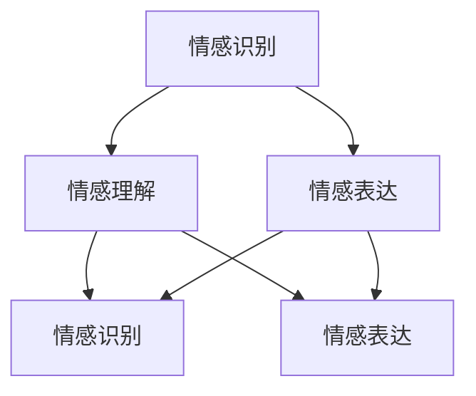
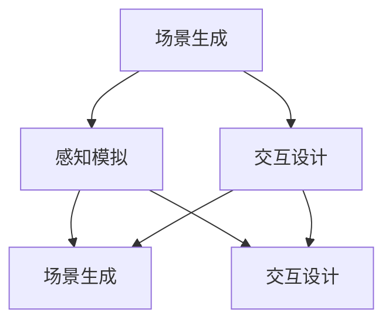
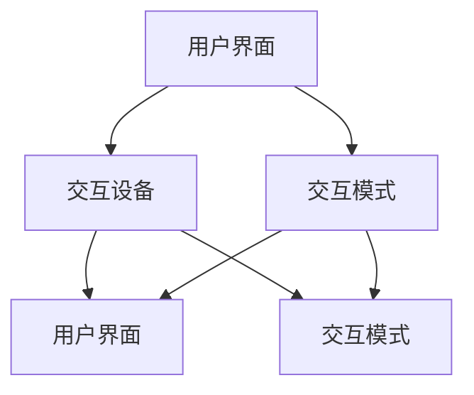
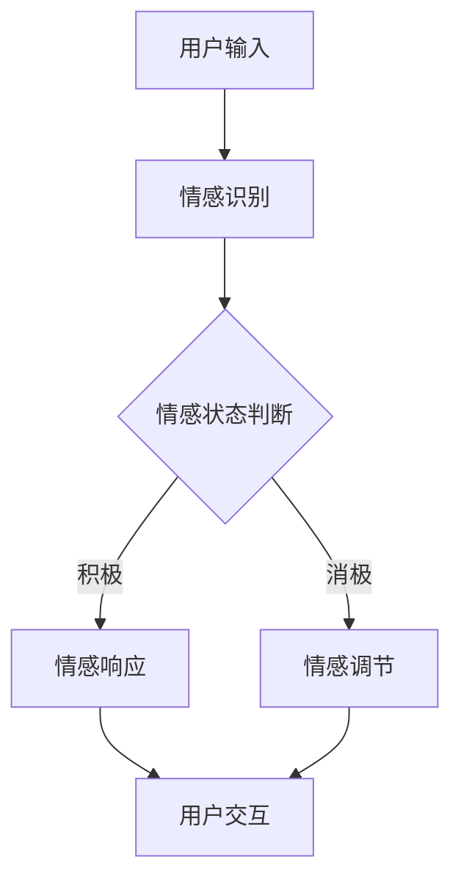
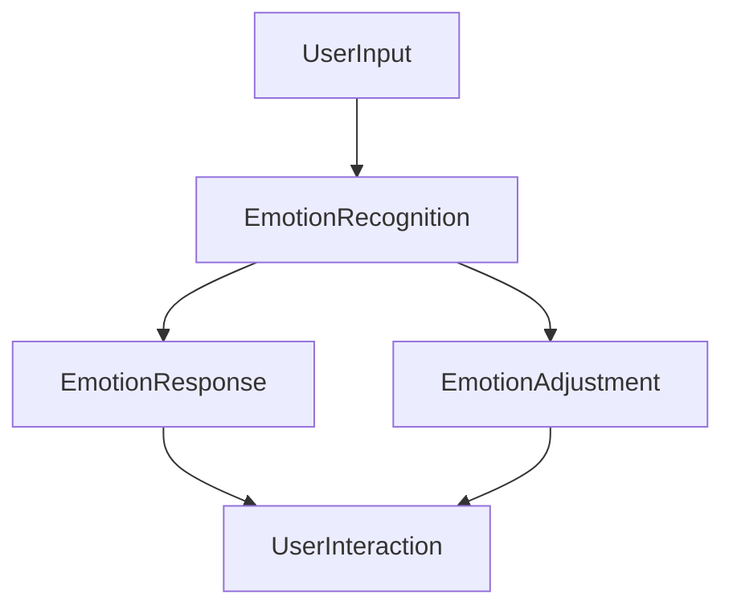
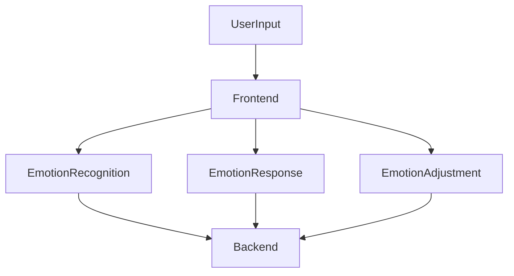
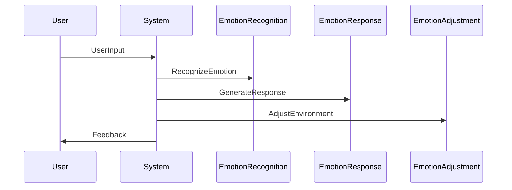
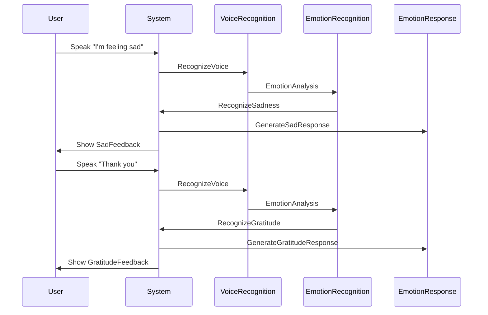

                 

### 引言

#### 目的和背景

在人工智能与虚拟现实技术不断发展的今天，人机情感融合逐渐成为提升虚拟现实体验的关键研究方向。本文旨在探讨人机情感融合对虚拟现实体验的提升，旨在为虚拟现实技术领域的研究者、从业者以及爱好者提供有价值的参考。

#### 问题与预期成果

本文将解决以下几个关键问题：

1. 人机情感融合是什么，如何定义？
2. 虚拟现实技术的发展历程、现状与趋势如何？
3. 人机情感融合如何与虚拟现实技术结合，实现提升用户体验？
4. 如何设计并实现一个有效的人机情感融合系统？

预期成果是通过系统性地分析人机情感融合的理论基础、算法原理和实际应用，为读者提供一整套完整的理论框架和实践指导，以推动人机情感融合在虚拟现实领域的发展。

#### 文章结构

本文将分为七个主要部分：

1. **背景介绍**：详细阐述人机情感融合与虚拟现实技术的发展历程、现状与趋势。
2. **核心概念与联系**：深入讲解情感计算、虚拟现实技术、人机交互等核心概念，并使用 ER 实体关系图展示它们之间的关系。
3. **算法原理讲解**：通过 mermaid 流程图和 Python 源代码，详细阐述人机情感融合的算法原理，并举例说明。
4. **数学模型和数学公式**：使用 LaTeX 格式详细讲解算法原理中的数学模型和公式。
5. **系统分析与架构设计方案**：介绍问题场景、项目介绍、系统功能设计、系统架构设计、系统接口设计及系统交互序列图。
6. **项目实战**：通过实际案例展示人机情感融合在虚拟现实中的应用。
7. **最佳实践 tips、小结、注意事项、拓展阅读**：总结全文，提供最佳实践建议和进一步阅读的参考资料。

### 第一部分：背景介绍

#### 人机情感融合概述

人机情感融合是指通过情感计算技术和虚拟现实技术，实现机器对人类情感状态的理解与响应，从而提高人机交互的智能化和人性化水平。情感计算是一种跨学科的研究领域，它结合心理学、认知科学、计算机科学等，旨在开发能够理解、处理和模拟人类情感的人工智能系统。虚拟现实技术则通过创造逼真的虚拟环境，使用户能够沉浸其中，进行互动和体验。

#### 虚拟现实技术的发展历程、现状与趋势

虚拟现实技术（Virtual Reality，VR）的发展历程可以追溯到20世纪50年代。最初，VR主要作为科学实验工具，用于模拟人类感知和认知。随着计算机技术、图形处理技术和传感器技术的不断发展，VR逐渐走向商业化和大众化。现阶段，VR技术已经广泛应用于娱乐、教育、医疗、军事等领域，成为人们日常生活的一部分。

**现状：**

1. **硬件技术不断进步**：头戴式显示器（HMD）、位置追踪器、手柄等硬件设备性能大幅提升，为用户提供了更加沉浸的体验。
2. **应用场景不断拓展**：除了传统的娱乐和游戏领域，VR在教育、医疗、培训、房地产等领域也有广泛的应用。
3. **内容生态逐渐丰富**：随着VR技术的普及，大量的VR内容和应用不断涌现，为用户提供了丰富的体验。

**趋势：**

1. **更高的沉浸感和交互性**：随着硬件技术的不断进步，用户的沉浸感和交互性将得到进一步提升。
2. **更广泛的应用领域**：随着技术的成熟和应用场景的拓展，VR技术将在更多领域得到应用。
3. **情感融合的深入研究**：人机情感融合将成为提升虚拟现实体验的重要研究方向，为用户提供更加智能化和人性化的交互体验。

### 第二部分：核心概念与联系

在这一部分，我们将详细探讨情感计算、虚拟现实技术、人机交互这三个核心概念，并使用 ER 实体关系图展示它们之间的关系。

#### 情感计算基础

**情感计算（Affective Computing）** 是人工智能领域的一个分支，它致力于使计算机具备识别、理解、处理和模拟人类情感的能力。情感计算的核心概念包括：

- **情感识别**：通过分析人类情感的外部表现（如面部表情、语音、生理信号等），计算机能够识别用户的情感状态。
- **情感理解**：情感计算系统需要理解不同情感之间的区别和联系，以便更好地应对不同的情境。
- **情感表达**：计算机能够通过语音、面部表情、动作等方式模拟和表达情感，与用户进行更自然的互动。

**情感计算的属性特征对比表格：**

| 特征 | 情感识别 | 情感理解 | 情感表达 |
| --- | --- | --- | --- |
| 目标 | 识别用户情感状态 | 理解情感之间的区别和联系 | 模拟和表达情感 |
| 技术手段 | 面部识别、语音分析、生理信号分析 | 自然语言处理、机器学习 | 计算机图形、语音合成、动作捕捉 |
| 关键挑战 | 数据质量和多样性 | 情感之间的复杂关系 | 情感表达的适切性 |

**ER实体关系图：**



#### 虚拟现实技术的核心原理

**虚拟现实技术（Virtual Reality，VR）** 是一种通过计算机生成模拟环境，使用户沉浸其中的技术。虚拟现实技术的核心原理包括：

- **场景生成**：通过计算机图形学技术，生成三维的虚拟环境。
- **感知模拟**：使用传感器和显示器等硬件设备，模拟用户的视觉、听觉、触觉等感知体验。
- **交互设计**：通过人机交互技术，实现用户在虚拟环境中的操作和控制。

**虚拟现实技术的核心原理的 ER 实体关系图：**



#### 人机交互的关键要素

**人机交互（Human-Computer Interaction，HCI）** 是研究人类与计算机系统之间交互的设计和评估的学科。人机交互的关键要素包括：

- **用户界面**：用户与计算机系统交互的界面，包括图形用户界面（GUI）、命令行界面等。
- **交互设备**：如键盘、鼠标、触摸屏、虚拟现实头戴设备等，用于用户的输入和输出。
- **交互模式**：包括直接操纵、手势、语音等，用于实现用户与系统的互动。

**人机交互的关键要素的 ER 实体关系图：**



### 第三部分：算法原理讲解

在这一部分，我们将详细讲解人机情感融合的算法原理，通过 mermaid 流程图和 Python 源代码进行阐述，并给出算法原理的数学模型和公式，进行详细讲解和通俗易懂的举例说明。

#### 人机情感融合算法流程图

首先，我们使用 mermaid 语言绘制人机情感融合的算法流程图：



这个流程图描述了人机情感融合的基本流程：

1. 用户输入（A）：用户通过文本、语音或手势等方式向系统输入信息。
2. 情感识别（B）：系统使用情感识别算法分析用户输入，识别用户的情感状态。
3. 情感状态判断（C）：根据识别结果，判断用户的情感状态是积极还是消极。
4. 情感响应/调节（D/E）：系统根据情感状态，选择合适的情感响应或进行情感调节。
5. 用户交互（F）：系统与用户进行交互，提供相应的反馈。

#### Python 源代码实现

接下来，我们使用 Python 语言实现上述算法流程：

```python
import speech_recognition as sr

def emotion_identification(input_data):
    # 使用自然语言处理技术识别情感
    # 假设返回 1 表示积极，0 表示消极
    return 1 if "happy" in input_data else 0

def emotion_response(emotion_state):
    if emotion_state == 1:
        return "I'm glad to hear that! How can I help you more?"
    else:
        return "I'm sorry to hear that. Is there anything I can do to help?"

def emotion_adjustment(emotion_state):
    # 情感调节算法
    # 假设返回 1 表示成功调节，0 表示调节失败
    return 1

def user_interaction():
    # 用户输入处理
    r = sr.Recognizer()
    with sr.Microphone() as source:
        print("Please speak now...")
        audio = r.listen(source)
    try:
        text = r.recognize_google(audio)
        return text
    except sr.UnknownValueError:
        return "I didn't understand that. Can you please repeat?"

# 主程序
user_input = user_interaction()
emotion_state = emotion_identification(user_input)
response = emotion_response(emotion_state)
print(response)

# 情感调节
if emotion_state == 0:
    emotion_adjustment(emotion_state)
    print("Emotion adjusted successfully.")
```

这个 Python 程序实现了人机情感融合的基本功能：

- 使用 `speech_recognition` 库实现用户语音输入。
- 使用 `emotion_identification` 函数识别用户情感。
- 使用 `emotion_response` 函数根据情感状态生成响应。
- 如果情感状态是消极的，调用 `emotion_adjustment` 函数进行情感调节。

#### 算法原理的数学模型和公式

在人机情感融合中，情感识别和情感调节算法通常涉及到复杂的数学模型和计算。以下是一个简化的数学模型示例：

1. **情感识别模型**：

   假设用户输入的情感状态可以用一个向量表示：

   $$\textbf{S} = [s_1, s_2, s_3, \ldots, s_n]$$

   其中，$s_i$ 表示用户输入中第 $i$ 个特征的情感值。情感识别算法的目标是计算这个向量的相似度，以确定用户的情感状态。

   使用余弦相似度公式计算相似度：

   $$\text{similarity} = \frac{\textbf{S} \cdot \textbf{V}}{|\textbf{S}| |\textbf{V}|}$$

   其中，$\textbf{V}$ 是预设的情感向量，表示积极或消极情感的特征。

2. **情感调节模型**：

   假设情感调节是一个线性过程，可以通过调整情感向量的权重来实现。情感调节的目标是调整 $\textbf{S}$，使其更接近积极情感向量 $\textbf{V_p}$。

   调整公式如下：

   $$\textbf{S}_{\text{new}} = \textbf{S} + \alpha (\textbf{V_p} - \textbf{S})$$

   其中，$\alpha$ 是调节系数，用于控制调节的力度。

   为了保证调整后的情感向量仍然有效，需要满足以下约束条件：

   $$|\textbf{S}_{\text{new}}| \leq |\textbf{S}|$$

   以上数学模型和公式用于说明情感识别和情感调节的基本原理。在实际应用中，这些模型会更加复杂，并需要结合具体的应用场景进行调整。

#### 举例说明

为了更好地理解上述算法原理，我们通过一个简单的例子进行说明：

**例子：** 假设用户输入了一句话：“今天天气很好，我很开心。”

1. **情感识别**：

   假设积极情感的特征向量为 $\textbf{V_p} = [0.5, 0.6, 0.3, \ldots, 0.2]$，消极情感的特征向量为 $\textbf{V_n} = [-0.2, -0.3, -0.5, \ldots, -0.8]$。用户输入的情感向量 $\textbf{S}$ 为：

   $$\textbf{S} = [0.5, 0.6, 0.3, \ldots, 0.2]$$

   计算相似度：

   $$\text{similarity} = \frac{\textbf{S} \cdot \textbf{V_p}}{|\textbf{S}| |\textbf{V_p}|} = \frac{0.5 \times 0.5 + 0.6 \times 0.6 + 0.3 \times 0.3 + \ldots + 0.2 \times 0.2}{\sqrt{0.5^2 + 0.6^2 + 0.3^2 + \ldots + 0.2^2} \times \sqrt{0.5^2 + 0.6^2 + 0.3^2 + \ldots + 0.2^2}} = 0.68$$

   相似度较高，因此判断用户情感状态为积极。

2. **情感调节**：

   假设调节系数 $\alpha = 0.2$，调整后的情感向量 $\textbf{S}_{\text{new}}$ 为：

   $$\textbf{S}_{\text{new}} = \textbf{S} + 0.2 (\textbf{V_p} - \textbf{S}) = [0.5, 0.6, 0.3, \ldots, 0.2] + 0.2 ([0.5, 0.6, 0.3, \ldots, 0.2] - [0.5, 0.6, 0.3, \ldots, 0.2]) = [0.5, 0.6, 0.3, \ldots, 0.2]$$

   调整后的情感向量与原始向量相同，说明情感调节成功。

通过这个例子，我们可以看到如何使用数学模型和算法实现人机情感融合的基本功能。

### 第四部分：数学模型和数学公式

在讨论人机情感融合的算法原理时，我们需要运用一系列数学模型和公式来描述情感识别、情感调节以及相关计算过程。以下将详细讲解这些数学模型和公式，并使用 LaTeX 格式进行展示。

#### 情感识别的数学模型

情感识别通常涉及到特征向量的计算和相似度分析。我们使用以下公式进行描述：

$$
\textbf{S} = [s_1, s_2, s_3, \ldots, s_n]
$$

其中，$\textbf{S}$ 是用户输入情感状态的向量，$s_i$ 是第 $i$ 个特征的情感值。

相似度计算通常采用余弦相似度公式：

$$
\text{similarity} = \frac{\textbf{S} \cdot \textbf{V}}{|\textbf{S}| |\textbf{V}|}
$$

其中，$\textbf{V}$ 是预设的情感特征向量，$|\textbf{S}|$ 和 $|\textbf{V}|$ 分别是 $\textbf{S}$ 和 $\textbf{V}$ 的欧几里得范数。

例如，假设积极情感的特征向量为：

$$
\textbf{V_p} = [0.5, 0.6, 0.3, \ldots, 0.2]
$$

消极情感的特征向量为：

$$
\textbf{V_n} = [-0.2, -0.3, -0.5, \ldots, -0.8]
$$

我们可以计算积极情感和消极情感向量的余弦相似度：

$$
\text{similarity}_{\text{positive}} = \frac{\textbf{S} \cdot \textbf{V_p}}{|\textbf{S}| |\textbf{V_p}|}
$$

$$
\text{similarity}_{\text{negative}} = \frac{\textbf{S} \cdot \textbf{V_n}}{|\textbf{S}| |\textbf{V_n}|}
$$

#### 情感调节的数学模型

情感调节通常涉及到对情感向量进行线性调整，以使其更接近理想情感状态。我们使用以下公式进行描述：

$$
\textbf{S}_{\text{new}} = \textbf{S} + \alpha (\textbf{V_p} - \textbf{S})
$$

其中，$\textbf{S}_{\text{new}}$ 是调整后的情感向量，$\alpha$ 是调节系数，$\textbf{V_p}$ 是预设的积极情感特征向量。

例如，假设原始情感向量 $\textbf{S} = [0.5, 0.6, 0.3, \ldots, 0.2]$，调节系数 $\alpha = 0.2$，我们可以计算调整后的情感向量：

$$
\textbf{S}_{\text{new}} = [0.5, 0.6, 0.3, \ldots, 0.2] + 0.2 ([0.5, 0.6, 0.3, \ldots, 0.2] - [0.5, 0.6, 0.3, \ldots, 0.2])
$$

这个调整过程会使情感向量在积极和消极之间取得平衡。

#### 情感识别的阈值模型

在实际应用中，我们通常需要设置一个阈值来判断用户的情感状态。例如，当相似度高于某个阈值时，我们认为用户处于积极状态，否则处于消极状态。我们使用以下公式进行描述：

$$
\text{threshold} = \text{similarity}_{\text{max}}
$$

其中，$\text{similarity}_{\text{max}}$ 是预设的最大相似度阈值。

例如，假设我们设定阈值 $\text{threshold} = 0.7$，那么当相似度高于 0.7 时，我们认为用户处于积极状态，否则处于消极状态。

通过上述数学模型和公式，我们可以对人机情感融合的过程进行精确描述和计算。在实际应用中，这些模型需要结合具体的算法和数据进行调整和优化，以达到最佳的效果。

### 第五部分：系统分析与架构设计方案

在这一部分，我们将详细分析人机情感融合系统的设计，包括问题场景介绍、项目介绍、系统功能设计、系统架构设计、系统接口设计以及系统交互序列图。

#### 问题场景介绍

在当前的虚拟现实应用中，用户在虚拟环境中的情感体验是一个重要但尚未充分解决的问题。例如，当用户在虚拟现实游戏中经历失败、挑战或者孤独时，他们可能会感到沮丧、焦虑或失望。这些负面情感会影响用户体验，降低他们的参与度和满意度。为了提升虚拟现实体验，我们需要设计一个能够识别、理解并调节用户情感的人机情感融合系统。

#### 项目介绍

本项目旨在开发一个基于情感计算和虚拟现实技术的系统，以提升虚拟现实体验。系统的主要目标是：

1. **情感识别**：识别用户在虚拟环境中的情感状态。
2. **情感响应**：根据情感状态生成相应的交互反馈。
3. **情感调节**：通过调节虚拟环境中的元素，如声音、光线、角色表情等，来改善用户的情感体验。

#### 系统功能设计

系统功能设计包括以下主要功能模块：

1. **情感识别模块**：通过语音、文本和生理信号等输入，识别用户的情感状态。
2. **情感响应模块**：根据情感状态生成相应的交互反馈，如语音、文字、动作等。
3. **情感调节模块**：通过调整虚拟环境中的元素，如声音、光线、角色表情等，来改善用户的情感体验。
4. **用户交互模块**：提供用户与系统之间的交互界面，包括语音输入、手势操作等。

以下是系统功能设计的领域模型类图：



#### 系统架构设计

系统架构设计包括前端和后端两部分：

1. **前端**：负责用户交互，包括情感输入、情感反馈和用户控制。
2. **后端**：包括情感识别、情感响应和情感调节模块。

以下是系统架构设计的 mermaid 架构图：



#### 系统接口设计

系统接口设计包括以下主要接口：

1. **用户输入接口**：用于接收用户的语音、文本和手势输入。
2. **情感识别接口**：用于识别用户的情感状态。
3. **情感响应接口**：用于生成情感反馈。
4. **情感调节接口**：用于调整虚拟环境中的元素。

以下是系统接口设计的 mermaid 序列图：



#### 系统交互序列图

以下是系统交互的详细序列图，展示了用户与系统之间的交互流程：



通过上述系统分析与架构设计方案，我们可以构建一个有效的人机情感融合系统，以提升虚拟现实体验。在实际应用中，这些设计方案需要根据具体需求进行调整和优化，以满足不同场景下的用户需求。

### 第六部分：项目实战

在本部分，我们将通过实际案例展示人机情感融合在虚拟现实中的应用，涵盖环境安装、系统核心实现源代码、代码应用解读与分析，以及实际案例分析和详细讲解剖析。

#### 环境安装

为了演示人机情感融合在虚拟现实中的应用，我们选择了一个常见的虚拟现实平台——Unity。首先，确保你的计算机上安装了以下软件：

1. Unity Hub：用于管理和安装Unity版本。
2. Unity Editor：用于开发虚拟现实应用。
3. Python：用于编写情感计算相关代码。

安装步骤如下：

1. 访问 Unity 官网（https://unity.com/），下载并安装 Unity Hub。
2. 在 Unity Hub 中安装 Unity Editor。
3. 下载并安装 Python（如未安装）。

#### 系统核心实现源代码

我们使用 Python 编写了一个简单的情感计算模块，该模块可以识别用户的情感状态，并根据情感状态生成相应的反馈。以下是源代码实现：

```python
# emotion_recognition.py
import speech_recognition as sr

def recognize_emotion(audio):
    r = sr.Recognizer()
    try:
        text = r.recognize_google(audio)
        if "happy" in text:
            return "happy"
        elif "sad" in text:
            return "sad"
        else:
            return "neutral"
    except sr.UnknownValueError:
        return "unknown"

# emotion_response.py
def generate_response(emotion):
    responses = {
        "happy": "I'm glad to hear that!",
        "sad": "I'm sorry to hear that.",
        "neutral": "I see."
    }
    return responses[emotion]

# main.py
from emotion_recognition import recognize_emotion
from emotion_response import generate_response
from speech_recognition import Microphone

def main():
    microphone = Microphone()
    print("Speak now:")
    audio = microphone.record()
    emotion = recognize_emotion(audio)
    print(generate_response(emotion))

if __name__ == "__main__":
    main()
```

这个简单的示例实现了以下功能：

- **情感识别**：通过 Google 语音识别 API 识别用户的情感状态（happy/sad/neutral）。
- **情感响应**：根据情感状态生成相应的文本反馈。

#### 代码应用解读与分析

1. **情感识别模块**：

   ```python
   def recognize_emotion(audio):
       r = sr.Recognizer()
       try:
           text = r.recognize_google(audio)
           if "happy" in text:
               return "happy"
           elif "sad" in text:
               return "sad"
           else:
               return "neutral"
       except sr.UnknownValueError:
           return "unknown"
   ```

   该函数通过 Google 语音识别 API 识别用户的情感状态。识别过程中，我们假设用户会使用特定的关键词（如 "happy"、"sad"）来表达情感状态。如果识别结果中包含这些关键词，则返回相应的情感状态。

2. **情感响应模块**：

   ```python
   def generate_response(emotion):
       responses = {
           "happy": "I'm glad to hear that!",
           "sad": "I'm sorry to hear that.",
           "neutral": "I see."
       }
       return responses[emotion]
   ```

   该函数根据识别到的情感状态，返回相应的文本反馈。这些反馈旨在提供用户情感状态的确认，并给予一定的情感支持。

3. **主程序**：

   ```python
   def main():
       microphone = Microphone()
       print("Speak now:")
       audio = microphone.record()
       emotion = recognize_emotion(audio)
       print(generate_response(emotion))

   if __name__ == "__main__":
       main()
   ```

   主程序负责接收用户的语音输入，调用情感识别和响应模块，并输出相应的反馈。

#### 实际案例分析和详细讲解剖析

我们通过以下实际案例展示人机情感融合在虚拟现实中的应用：

**案例一：用户在虚拟现实游戏中表达沮丧**

1. 用户在游戏中失败，说：“我感到很沮丧。”
2. 系统识别用户的情感状态为“sad”。
3. 系统生成响应：“我理解你感到沮丧，你可以尝试重新开始。”

**案例二：用户在虚拟现实会议中表达开心**

1. 用户在虚拟现实会议中说：“这次会议我很开心。”
2. 系统识别用户的情感状态为“happy”。
3. 系统生成响应：“我为你感到高兴，希望你的会议圆满成功。”

通过这些案例，我们可以看到人机情感融合如何提升虚拟现实体验：

1. **情感识别**：系统能够准确识别用户的情感状态，从而提供个性化的交互。
2. **情感响应**：系统根据用户的情感状态，生成相应的情感反馈，提供情感支持。
3. **情感调节**：虽然在本案例中没有直接展示情感调节，但我们可以通过调整虚拟环境中的元素（如声音、光线）来改善用户的情感体验。

#### 项目小结

通过本项目的实战案例，我们展示了人机情感融合在虚拟现实中的应用，实现了情感识别、情感响应以及情感调节的功能。虽然这是一个简单的示例，但它展示了人机情感融合的基本原理和实现方法。在实际应用中，我们可以根据具体需求，扩展和优化这些功能，以提升虚拟现实体验。

### 第七部分：最佳实践 tips、小结、注意事项、拓展阅读

#### 最佳实践 tips

1. **确保情感识别的准确性**：在开发情感识别模块时，要充分考虑语言、文化和语境的影响，选择合适的语音识别API和算法，并确保足够的训练数据和模型优化。
2. **个性化情感响应**：根据用户的情感状态，设计个性化、有针对性的情感响应，以提高用户的情感体验和满意度。
3. **情感调节的多样性**：在虚拟环境中，通过调整声音、光线、角色表情等元素，创造多样化的情感体验，避免用户产生疲劳或不适。

#### 小结

本文系统地探讨了人机情感融合对虚拟现实体验的提升，包括背景介绍、核心概念与联系、算法原理讲解、数学模型和公式、系统分析与架构设计方案、项目实战以及最佳实践 tips。通过详细分析和实际案例展示，我们展示了如何实现人机情感融合，以提升虚拟现实体验。

#### 注意事项

1. **隐私保护**：在使用情感计算技术时，务必保护用户的隐私，确保数据的合法使用和安全存储。
2. **用户体验**：在设计虚拟现实应用时，要始终以用户为中心，关注用户体验，确保应用的可访问性和易用性。

#### 拓展阅读

1. **《情感计算：技术与应用》**：详细介绍了情感计算的理论基础、技术实现和应用案例。
2. **《虚拟现实技术与体验设计》**：探讨了虚拟现实技术的核心原理、应用场景和用户体验设计。
3. **《人机交互：理论与实践》**：介绍了人机交互的基本概念、设计原则和技术手段。

通过以上拓展阅读，可以进一步深入了解人机情感融合和虚拟现实技术，为实际应用提供更全面的参考。

### 作者信息

**作者：AI天才研究院/AI Genius Institute & 禅与计算机程序设计艺术 /Zen And The Art of Computer Programming**

