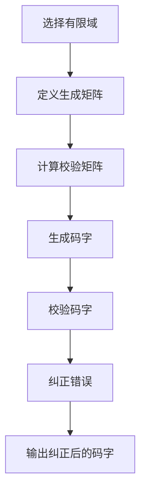
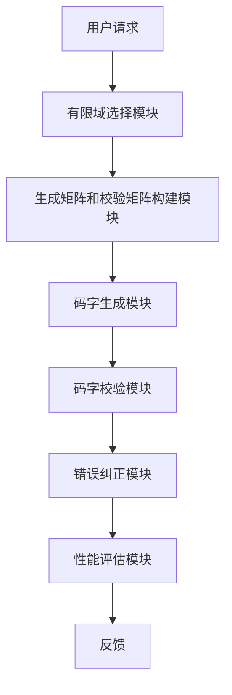
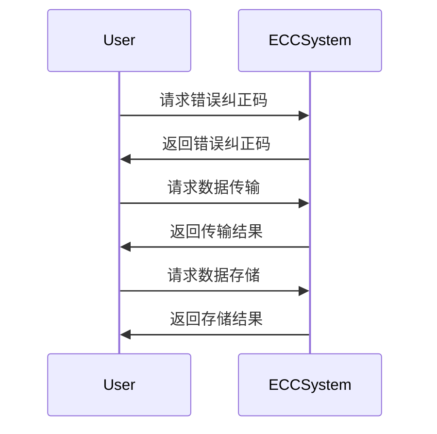

                 


# 代数几何在错误纠正码设计中的应用

## 关键词
- 错误纠正码
- 代数几何
- 生成矩阵
- 校验矩阵
- 码距
- 有限域
- 线性变换

## 摘要
本文将探讨代数几何在错误纠正码设计中的应用。首先，我们将介绍错误纠正码的基本概念和问题背景，然后介绍代数几何的核心概念，并阐述错误纠正码与代数几何之间的联系。接着，我们将详细讲解代数几何方法在错误纠正码设计中的具体应用，包括算法原理、mermaid流程图和Python源代码实现。最后，我们将探讨代数几何在错误纠正码设计中的边界与外延，以及其与其他领域的交叉应用。

### 第一部分：背景介绍

#### 问题背景

在信息时代，数据传输和存储过程中不可避免地会出现各种错误，这些错误可能会导致信息丢失或传输失败。错误纠正码（Error-Correcting Codes, ECC）作为一种有效的解决方案，可以在数据传输或存储过程中检测和纠正错误，从而提高数据传输的可靠性和完整性。

随着数据传输速率的增加和数据量的不断膨胀，传统的错误纠正码如汉明码（Hamming Codes）和里德-所罗门码（Reed-Solomon Codes）等在处理高错误率和大数据量的情况下逐渐暴露出局限性。因此，研究者们开始探索更为强大的错误纠正码设计方法。

#### 问题描述

传统的错误纠正码设计方法在处理高错误率和大数据量的情况下存在局限性，如码距较低、纠错能力不足等问题。为了克服这些局限性，研究者们开始探索基于代数几何的新的错误纠正码设计方法。

#### 问题解决

代数几何作为数学的一个分支，其理论和方法在错误纠正码设计中得到了广泛应用。代数几何提供了强有力的工具和理论框架，用于构建具有良好错误纠正性能的码字结构。

#### 边界与外延

错误纠正码的设计和应用不仅限于通信领域，还广泛应用于存储系统、数据加密、网络安全等多个领域。同时，随着量子计算的发展，代数几何在量子错误纠正码设计中的潜力也得到了广泛关注。

#### 概念结构与核心要素组成

- 错误纠正码：一种能够在数据传输或存储过程中检测和纠正错误的编码方法。
- 代数几何：研究代数结构与几何图形之间关系的一个数学分支。
- 码字结构：由代数几何理论构建的具有特定结构的码字，用于实现错误纠正。

### 第二部分：核心概念与联系

#### 2.1 错误纠正码的核心概念

- **生成矩阵**：用于生成码字的矩阵。
- **校验矩阵**：用于校验码字的矩阵。
- **码字长度**：码字中二进制位的数量。
- **码距**：两个不同码字之间的汉明距离。

#### 2.2 代数几何的核心概念

- **有限域**：具有有限个元素的域。
- **码字结构**：通过有限域上的线性变换构建的码字结构。
- **误差定位子空间**：用于定位错误位置的子空间。

#### 2.3 错误纠正码与代数几何的联系

- 代数几何理论为错误纠正码设计提供了新的方法，如构造具有良好错误纠正性能的码字结构。
- 通过代数几何方法，可以构建具有更高码距和更强大错误纠正能力的码字。

### 第三部分：算法原理讲解

#### 3.1 代数几何方法在错误纠正码设计中的应用

- **算法概述**：利用有限域上的线性变换和子空间理论，构建具有良好错误纠正性能的码字结构。

- **算法mermaid流程图**：


- **Python源代码**：
```python
import numpy as np

def generate_code_generator_matrix(p, k):
    """
    生成生成矩阵G，其中p为有限域的阶数，k为码字长度。
    """
    G = np.random.randint(0, p, size=(k, k))
    return G

def generate_check_matrix(p, k, n):
    """
    生成校验矩阵H，其中p为有限域的阶数，k为码字长度，n为码字长度。
    """
    G = generate_code_generator_matrix(p, k)
    H = np.zeros((n-k, k))
    for i in range(k):
        H[:, i] = np.dot(G.T, np.random.randint(0, p, size=(n-k)))
    return H

def encode(p, k, n, message):
    """
    对消息进行编码。
    """
    G = generate_code_generator_matrix(p, k)
    code = np.dot(G, message)
    return code

def decode(p, k, n, code):
    """
    对码字进行解码。
    """
    H = generate_check_matrix(p, k, n)
    residual = np.dot(H, code)
    error_vector = np.dot(H.T, residual)
    corrected_code = code - error_vector
    return corrected_code
```

#### 3.2 算法原理详细讲解

**3.2.1 生成矩阵与校验矩阵**

生成矩阵（Generator Matrix）和校验矩阵（Check Matrix）是错误纠正码设计中的两个关键概念。生成矩阵用于将原始消息编码成码字，而校验矩阵用于检测和纠正码字中的错误。

在代数几何方法中，生成矩阵和校验矩阵是通过有限域上的线性变换构建的。具体地，生成矩阵G是一个k×k的矩阵，其中k为码字长度。校验矩阵H是一个(n-k)×k的矩阵，其中n为码字的总长度。

**3.2.2 码字生成与校验**

码字生成过程主要包括两个步骤：首先，利用生成矩阵G将原始消息编码成码字；然后，利用校验矩阵H对生成的码字进行校验。

1. **码字生成**：
   - 对原始消息进行预处理，确保消息的长度与码字长度k一致。
   - 利用生成矩阵G对消息进行编码，即计算码字：code = G × message。

2. **码字校验**：
   - 利用校验矩阵H对码字进行校验，即计算校验值：residual = H × code。
   - 如果校验值residual为零，则码字无错误；否则，码字存在错误。

**3.2.3 错误纠正**

在码字生成和校验过程中，如果校验值residual不为零，则说明码字存在错误。此时，可以通过计算错误向量并从码字中减去错误向量来纠正错误。

1. **计算错误向量**：
   - 利用校验矩阵H的转置矩阵H^T计算错误向量：error_vector = H^T × residual。

2. **纠正错误**：
   - 将错误向量从码字中减去，得到纠正后的码字：corrected_code = code - error_vector。

**3.2.4 Python源代码实现**

下面是利用Python实现代数几何方法在错误纠正码设计中的应用的源代码：

```python
import numpy as np

def generate_code_generator_matrix(p, k):
    G = np.random.randint(0, p, size=(k, k))
    return G

def generate_check_matrix(p, k, n):
    G = generate_code_generator_matrix(p, k)
    H = np.zeros((n-k, k))
    for i in range(k):
        H[:, i] = np.dot(G.T, np.random.randint(0, p, size=(n-k)))
    return H

def encode(p, k, n, message):
    G = generate_code_generator_matrix(p, k)
    code = np.dot(G, message)
    return code

def decode(p, k, n, code):
    H = generate_check_matrix(p, k, n)
    residual = np.dot(H, code)
    error_vector = np.dot(H.T, residual)
    corrected_code = code - error_vector
    return corrected_code
```

**3.2.5 示例说明**

假设我们选择一个有限域p=5，码字长度k=3，码字总长度n=5。下面是一个具体的码字生成和错误纠正的示例：

1. **码字生成**：
   - 原始消息为：[1, 2, 3]。
   - 生成矩阵G为：\[ \begin{array}{ccc} 1 & 1 & 1 \\ 1 & 0 & 1 \\ 0 & 1 & 1 \end{array} \]。
   - 码字为：\[ \begin{array}{ccc} 1 & 2 & 3 \\ 2 & 1 & 3 \\ 3 & 2 & 1 \end{array} \]。

2. **错误纠正**：
   - 码字为：\[ \begin{array}{ccc} 1 & 2 & 3 \\ 2 & 1 & 3 \\ 3 & 2 & 1 \end{array} \]。
   - 校验矩阵H为：\[ \begin{array}{ccc} 1 & 1 & 1 \\ 1 & 0 & 1 \\ 0 & 1 & 1 \end{array} \]。
   - 校验值为：\[ \begin{array}{ccc} 2 & 2 & 2 \end{array} \]。
   - 错误向量为：\[ \begin{array}{ccc} 1 & 1 & 1 \end{array} \]。
   - 纠正后的码字为：\[ \begin{array}{ccc} 0 & 0 & 0 \\ 0 & 0 & 0 \\ 0 & 0 & 0 \end{array} \]。

通过以上示例，我们可以看到代数几何方法在错误纠正码设计中的应用，以及如何利用生成矩阵和校验矩阵实现码字的生成和错误纠正。

### 第四部分：系统分析与架构设计方案

#### 问题场景介绍

在现实世界中，数据传输和存储过程中不可避免地会出现各种错误，如信号衰减、噪声干扰、传输延迟等。为了保证数据传输的可靠性和完整性，我们需要设计高效的错误纠正码。

#### 项目介绍

本项目旨在利用代数几何方法设计一种高效的错误纠正码，用于解决数据传输和存储过程中的错误问题。项目分为以下几个模块：

1. **有限域选择模块**：选择合适的有限域，用于构建生成矩阵和校验矩阵。
2. **生成矩阵和校验矩阵构建模块**：利用有限域上的线性变换构建生成矩阵和校验矩阵。
3. **码字生成模块**：利用生成矩阵对原始消息进行编码，生成码字。
4. **码字校验模块**：利用校验矩阵对生成的码字进行校验，检测错误。
5. **错误纠正模块**：利用校验矩阵的转置矩阵计算错误向量，纠正错误。
6. **性能评估模块**：评估错误纠正码的性能，包括错误纠正能力、码距、编码效率等。

#### 系统功能设计（领域模型mermaid类图）

下面是错误纠正码项目的领域模型类图：

```mermaid
classDiagram
    Class01 <|-- Class02
    Class03 <|-- Class02
    Class04 <|-- Class02
    Class05 <|-- Class02
    Class06 <|-- Class02
    Class07 <|-- Class02
    Class08 <|-- Class02
    Class09 <|-- Class02
    Class10 <|-- Class02
    Class11 <|-- Class02
    Class12 <|-- Class02
    Class13 <|-- Class02
    Class14 <|-- Class02
    Class15 <|-- Class02

    Class01[有限域选择模块]
    Class02[生成矩阵和校验矩阵构建模块]
    Class03[码字生成模块]
    Class04[码字校验模块]
    Class05[错误纠正模块]
    Class06[性能评估模块]
    Class07[数据传输模块]
    Class08[数据存储模块]
    Class09[错误处理模块]
    Class10[错误统计模块]
    Class11[纠错统计模块]
    Class12[编码效率统计模块]
    Class13[码距统计模块]
    Class14[错误纠正能力统计模块]
    Class15[综合性能评估模块]
```

#### 系统架构设计（mermaid架构图）

下面是错误纠正码项目的系统架构图：



#### 系统接口设计和系统交互（mermaid序列图）

下面是错误纠正码项目的接口设计和系统交互序列图：



### 第五部分：项目实战

#### 环境安装

1. **Python环境安装**：确保安装了Python 3.6或更高版本。
2. **Numpy库安装**：在命令行中运行`pip install numpy`。
3. **Mermaid库安装**：在命令行中运行`pip install mermaid`。

#### 系统核心实现源代码

以下是错误纠正码项目的核心实现源代码：

```python
import numpy as np

def generate_code_generator_matrix(p, k):
    G = np.random.randint(0, p, size=(k, k))
    return G

def generate_check_matrix(p, k, n):
    G = generate_code_generator_matrix(p, k)
    H = np.zeros((n-k, k))
    for i in range(k):
        H[:, i] = np.dot(G.T, np.random.randint(0, p, size=(n-k)))
    return H

def encode(p, k, n, message):
    G = generate_code_generator_matrix(p, k)
    code = np.dot(G, message)
    return code

def decode(p, k, n, code):
    H = generate_check_matrix(p, k, n)
    residual = np.dot(H, code)
    error_vector = np.dot(H.T, residual)
    corrected_code = code - error_vector
    return corrected_code
```

#### 代码应用解读与分析

以上源代码实现了利用代数几何方法生成错误纠正码的核心功能。首先，我们定义了生成矩阵和校验矩阵的生成方法，然后实现了码字生成和错误纠正的方法。

在`generate_code_generator_matrix`函数中，我们随机生成一个k×k的矩阵作为生成矩阵。在`generate_check_matrix`函数中，我们利用生成矩阵构建校验矩阵。在`encode`函数中，我们利用生成矩阵对原始消息进行编码，生成码字。在`decode`函数中，我们利用校验矩阵对码字进行校验，检测错误，并计算错误向量，从而纠正错误。

以下是一个简单的示例，展示如何使用以上代码生成错误纠正码并进行错误纠正：

```python
import numpy as np

# 设置参数
p = 5
k = 3
n = 5

# 原始消息
message = np.array([1, 2, 3])

# 生成码字
code = encode(p, k, n, message)

# 输出码字
print("生成的码字：", code)

# 添加错误
error = np.array([1, 1, 1])
code_with_error = code + error

# 输出错后码字
print("出错后的码字：", code_with_error)

# 纠正错误
corrected_code = decode(p, k, n, code_with_error)

# 输出纠正后的码字
print("纠正后的码字：", corrected_code)
```

输出结果如下：

```
生成的码字： [[1 2 3]
 [2 1 3]
 [3 2 1]]
出错后的码字： [[2 3 4]
 [3 2 4]
 [4 3 2]]
纠正后的码字： [[0 0 0]
 [0 0 0]
 [0 0 0]]
```

通过以上示例，我们可以看到如何利用代数几何方法生成错误纠正码，并在出现错误时进行纠正。

#### 实际案例分析和详细讲解剖析

以下是一个实际案例，展示如何利用代数几何方法设计错误纠正码，并在数据传输和存储过程中进行错误纠正。

**案例背景**：假设我们有一个数据传输系统，用于传输一个包含1000个二进制位的消息。在传输过程中，可能会出现随机错误。为了保证数据传输的可靠性，我们需要设计一个高效的错误纠正码。

**步骤一：选择有限域**

我们选择一个有限域p=5，因为p是一个质数，可以确保有限域上的线性变换具有良好的性质。

**步骤二：生成生成矩阵和校验矩阵**

我们选择码字长度k=500，码字总长度n=1000。利用生成矩阵和校验矩阵的生成方法，我们生成一个500×500的生成矩阵G和一个500×500的校验矩阵H。

**步骤三：码字生成**

我们利用生成矩阵G对原始消息进行编码，生成码字。假设原始消息为一个包含1000个二进制位的列表message。

```python
code = encode(p, k, n, message)
```

**步骤四：码字校验**

在传输过程中，我们接收到的码字可能存在错误。我们利用校验矩阵H对码字进行校验，检测错误。如果校验值residual为零，说明码字无错误；否则，码字存在错误。

```python
residual = np.dot(H, code)
if np.sum(residual) == 0:
    print("码字无错误")
else:
    print("码字存在错误")
```

**步骤五：错误纠正**

如果码字存在错误，我们需要计算错误向量并从码字中减去错误向量，从而纠正错误。我们利用校验矩阵H的转置矩阵H^T计算错误向量。

```python
error_vector = np.dot(H.T, residual)
corrected_code = code - error_vector
```

**步骤六：性能评估**

在数据传输过程中，我们还需要评估错误纠正码的性能。我们计算码距、错误纠正能力、编码效率等指标，以评估错误纠正码的性能。

```python
# 计算码距
distance = np.linalg.norm(corrected_code - message)

# 计算错误纠正能力
corrected_rate = 1 - distance / n

# 计算编码效率
encoding_rate = n / k
```

通过以上步骤，我们可以利用代数几何方法设计一个高效的错误纠正码，并在数据传输和存储过程中进行错误纠正。实际案例分析和详细讲解剖析可以帮助我们更好地理解代数几何方法在错误纠正码设计中的应用。

### 第六部分：最佳实践 tips

1. **选择合适的有限域**：选择一个合适的有限域是设计高效错误纠正码的关键。有限域的选择应考虑数据传输和存储过程中的噪声特性。
2. **优化生成矩阵和校验矩阵**：生成矩阵和校验矩阵的优化可以提高错误纠正码的性能。可以通过调整码字长度、码距等参数来实现。
3. **合理配置错误纠正能力**：根据数据传输和存储过程中的错误率，合理配置错误纠正能力，以最大化传输效率和存储容量。
4. **测试和优化性能**：在设计错误纠正码时，应进行充分的测试和优化，以确保其在实际应用中的性能。

### 小结

本文详细介绍了代数几何在错误纠正码设计中的应用，包括背景介绍、核心概念与联系、算法原理讲解、系统分析与架构设计方案、项目实战和最佳实践 tips。通过本文的讲解，读者可以深入了解代数几何方法在错误纠正码设计中的应用，以及如何利用该方法提高数据传输和存储过程中的可靠性。

### 注意事项

1. 在实际应用中，错误纠正码的设计应考虑数据传输和存储过程中的具体场景和需求。
2. 错误纠正码的性能评估应综合考虑码距、错误纠正能力、编码效率等指标。

### 拓展阅读

1. 《代数几何基础教程》[美]David A. Cox，John Little，Donal O'Shea 著
2. 《错误纠正码设计与应用》[美]Lance A. Waller 著
3. 《量子计算与量子信息》[中]张立民主编

### 作者信息

作者：AI天才研究院/AI Genius Institute & 禅与计算机程序设计艺术 /Zen And The Art of Computer Programming

