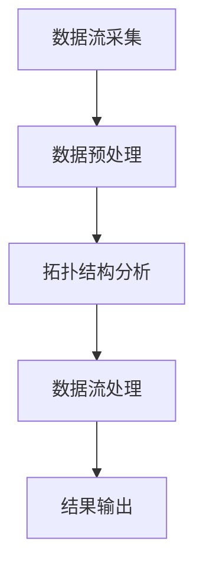
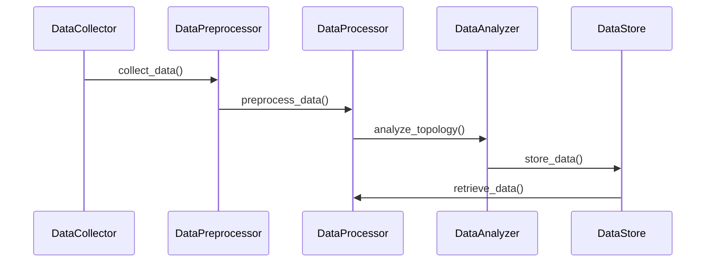

                 

### 第一部分：引言

#### 1.1 问题背景

在当今数字化时代，数据流算法已经成为数据处理和数据分析的核心技术。随着大数据和实时数据处理的广泛应用，如何高效、准确地处理大量动态数据成为了关键问题。传统的数据处理方法在应对大规模、实时数据流时存在诸多挑战，如数据存储压力、计算效率低下、处理延迟等问题。

代数拓扑作为一种新兴的数学工具，其核心思想是将几何结构和拓扑属性应用于代数运算中，通过抽象和建模来揭示数据的内在结构和规律。近年来，代数拓扑在计算机科学领域的应用逐渐引起关注，尤其是在数据流算法中，其独特的方法和优势为解决传统方法难以克服的难题提供了新的思路。

本文将探讨代数拓扑在数据流算法中的创新应用，旨在回答以下几个核心问题：

1. 代数拓扑的基本概念是什么，如何定义和描述？
2. 代数拓扑的核心理论，如同调理论和同伦理论，如何应用于数据流算法？
3. 一个具体的数据流算法（如L Infinity算法）的原理和应用是怎样的？
4. 如何设计和实现一个基于代数拓扑的数据流处理系统？
5. 在实际项目中，如何应用代数拓扑来解决数据流处理中的具体问题？

通过上述问题的逐步分析和解答，本文希望能够为读者提供一个全面、深入的理解，帮助其在数据流算法领域探索代数拓扑的创新应用。

#### 1.2 核心概念介绍

代数拓扑是一门结合了代数和拓扑学的新型数学分支，其核心思想是将几何结构和拓扑属性通过代数运算进行抽象和建模，从而揭示数据的内在结构和规律。以下将介绍代数拓扑中的几个关键概念，包括同调理论和同伦理论，并通过概念属性特征对比表格和ER实体关系图来展示这些概念之间的关系。

##### 1.2.1 代数拓扑基本概念

代数拓扑的基本概念主要包括拓扑空间、连续映射、同胚映射等。拓扑空间是一个抽象的集合，其上的点通过一些“邻近”关系联系起来。连续映射是指从一个拓扑空间到另一个拓扑空间的映射，该映射保持拓扑空间的“邻近”关系。同胚映射是一种特殊的连续映射，它不仅保持拓扑空间的“邻近”关系，而且保持拓扑空间的几何结构。

概念属性特征对比表格：

| 概念名称   | 定义                     | 关键特性                                       |
|----------|----------------------|------------------------------------------|
| 拓扑空间   | 一个带有点和“邻近”关系的集合 | 描述几何形状和结构                           |
| 连续映射   | 保持点之间“邻近”关系的映射 | 保证拓扑性质在不同空间之间传递           |
| 同胚映射   | 保持几何结构和拓扑性质的映射 | 描述空间之间的等价关系                       |

##### 1.2.2 同调理论

同调理论是代数拓扑中的一个重要分支，用于研究空间的连通性和洞的存在性。同调理论通过同调群来描述这些性质，同调群是一种代数结构，用于分类和计数空间的连通性。

同调理论的数学模型可以通过以下LaTeX公式表示：

$$
H_n(X, A) = \frac{C_n(X, A)}{Im(\partial_n)}
$$

其中，\(X\) 是拓扑空间，\(A\) 是子空间，\(C_n(X, A)\) 表示 \(n\) 次闭链群，\(Im(\partial_n)\) 表示 \(n\) 次边界映射的像。

同调理论的应用举例：同调理论可以用于计算简单连通图的同调群，从而判断图的性质，如是否存在奇圈或割点。

##### 1.2.3 同伦理论

同伦理论是研究空间形状变化和稳定性的代数拓扑分支。同伦理论通过同伦等价来描述空间之间的连续变形关系，同伦等价是指一个空间可以通过连续变形变为另一个空间。

同伦理论的数学模型可以通过以下LaTeX公式表示：

$$
\phi: [0, 1] \times X \rightarrow Y
$$

其中，\(\phi\) 是从 \([0, 1] \times X\) 到 \(Y\) 的连续映射，表示 \(X\) 在 \(t\) 时刻的形状。

同伦理论的应用举例：同伦理论可以用于证明空间的同伦型，从而解决几何图形的变形问题，如证明两个简单的拓扑空间是否同伦等价。

##### 1.2.4 概念属性特征对比表

| 概念名称   | 定义特点                                       | 关键特性                                       | 应用实例             |
|----------|------------------------------------------|------------------------------------------|-------------------|
| 拓扑空间   | 带有点和“邻近”关系的集合               | 描述几何形状和结构                           | 图形分类、空间搜索       |
| 连续映射   | 保持点之间“邻近”关系的映射               | 保证拓扑性质在不同空间之间传递           | 数据映射、图像处理       |
| 同胚映射   | 保持几何结构和拓扑性质的映射               | 描述空间之间的等价关系                       | 形状识别、空间变换       |
| 同调理论   | 通过同调群分类和计数空间的连通性           | 描述空间的连通性和洞的存在性               | 图形分析、网络拓扑       |
| 同伦理论   | 通过同伦等价描述空间之间的连续变形关系       | 描述空间形状变化和稳定性                     | 几何证明、变形分析       |

通过上述核心概念介绍和对比表格，我们可以更清晰地理解代数拓扑的基本原理和其应用背景。接下来，本文将深入探讨这些概念在数据流算法中的具体应用。

### 1.3 书籍结构简介

本文将系统地介绍代数拓扑在数据流算法中的创新应用，旨在帮助读者全面理解和掌握这一前沿技术。全书结构设计合理，逻辑清晰，分为六个主要部分，各部分内容安排如下：

#### 1.3.1 目录大纲

本文的目录大纲如下，每一部分都有明确的目标和内容安排：

1. **第一部分：引言**：介绍数据流算法和代数拓扑的基本概念，阐述代数拓扑在数据流算法中的应用背景，并提出核心问题。
2. **第二部分：核心概念与联系**：深入讲解代数拓扑的核心概念，包括同调理论和同伦理论，通过对比表格和ER实体关系图展示概念之间的关系。
3. **第三部分：算法原理讲解**：选择一个典型的数据流算法，如L Infinity算法，详细阐述其原理，包括算法流程图、Python实现和数学模型。
4. **第四部分：系统分析与架构设计方案**：介绍一个使用代数拓扑方法的数据流处理系统，包括问题场景介绍、系统功能设计、系统架构设计、系统接口设计和系统交互。
5. **第五部分：项目实战**：展示一个具体的数据流处理项目，包括环境安装、系统核心实现、代码应用解读与分析、实际案例分析和项目小结。
6. **第六部分：最佳实践与总结**：总结代数拓扑在数据流算法中的应用，提供实战技巧和建议，并对全书内容进行小结。

#### 1.3.2 内容安排

每一部分的具体内容安排如下：

- **第一部分**：引言部分将介绍数据流算法的背景和挑战，以及代数拓扑在这其中的作用。通过提出核心问题，为后续章节的深入讲解奠定基础。
- **第二部分**：核心概念与联系部分将详细讲解代数拓扑中的关键概念，如同调理论和同伦理论，通过对比表格和ER实体关系图展示这些概念之间的关系，帮助读者建立系统的知识框架。
- **第三部分**：算法原理讲解部分选择一个典型的数据流算法，如L Infinity算法，通过算法流程图、Python实现和数学模型详细阐述其原理。这部分内容旨在让读者理解如何将代数拓扑应用于实际的数据流处理。
- **第四部分**：系统分析与架构设计方案部分将介绍一个基于代数拓扑的数据流处理系统，从问题场景介绍、系统功能设计、系统架构设计、系统接口设计和系统交互等方面进行全面分析。这部分内容将帮助读者了解代数拓扑在系统设计中的应用。
- **第五部分**：项目实战部分将展示一个具体的数据流处理项目，从环境安装、系统核心实现、代码应用解读与分析、实际案例分析和项目小结等方面进行详细讲解。这部分内容将让读者亲身体验代数拓扑在数据流处理项目中的应用效果。
- **第六部分**：最佳实践与总结部分将总结代数拓扑在数据流算法中的应用，提供实战技巧和建议，并对全书内容进行小结。这部分内容旨在帮助读者巩固所学知识，并为进一步探索提供方向。

#### 1.3.3 读者对象

本文的读者对象主要包括以下几类：

- **计算机科学和人工智能领域的研究生和博士生**：这些读者对数据流算法和代数拓扑有一定了解，希望通过本文深入理解代数拓扑在数据流算法中的应用。
- **数据科学和大数据领域的工程师和开发者**：这些读者在工作中经常需要处理数据流，希望通过本文掌握代数拓扑这一前沿技术，提升数据处理和分析能力。
- **对代数拓扑和计算机科学感兴趣的学者和爱好者**：这些读者希望通过本文了解代数拓扑的基本概念和应用，以及其在计算机科学中的创新应用。

通过本文的系统讲解，读者可以全面了解代数拓扑在数据流算法中的创新应用，掌握相关理论和实践方法，为实际工作和研究提供有力支持。

### 第二部分：代数拓扑核心原理讲解

#### 2.1 同调理论原理

同调理论是代数拓扑中的一个核心分支，主要研究空间的连通性和洞的存在性。通过同调群这一代数结构，同调理论可以分类和计数空间的连通性，从而揭示空间的结构和性质。本节将详细介绍同调理论的定义、数学模型及其Python实现，并通过具体例子来说明其应用。

##### 2.1.1 同调理论的定义

同调理论通过同调群来描述空间的连通性。同调群是一种群的结构，用于分类和计数空间的连通性。具体来说，对于给定的拓扑空间\(X\)和其子空间\(A\)，同调群\(H_n(X, A)\)定义为闭链群\(C_n(X, A)\)与边界映射\(\partial_n\)的商群。

定义：设\(X\)是一个\(n\)维的CW复形，\(A\)是\(X\)的一个子复形，\(C_n(X, A)\)表示所有从\(A\)到\(X\)的\(n\)维简单闭链的集合，形成一个群。边界映射\(\partial_n: C_{n-1}(X, A) \rightarrow C_n(X, A)\)定义为\(n-1\)维简单闭链的边界。同调群\(H_n(X, A)\)定义为：

$$
H_n(X, A) = \frac{C_n(X, A)}{Im(\partial_n)}
$$

其中，\(Im(\partial_n)\)表示边界映射\(\partial_n\)的像。

同调理论的基本概念包括：

- **闭链**：在拓扑空间中，一个\(n\)维简单闭链是一个连续映射\(s: S^{n-1} \rightarrow X\)，其中\(S^{n-1}\)是单位\(n-1\)维球面。
- **边界**：对于\(n-1\)维简单闭链\(s'\)，其边界\(\partial s'\)是一个\(n\)维简单闭链，定义为：\(\partial s' = s - s|_A\)，其中\(s|_A\)是\(s\)在\(A\)上的限制。

##### 2.1.2 同调理论的数学模型

同调理论的数学模型可以通过以下LaTeX公式表示：

$$
H_n(X, A) = \frac{C_n(X, A)}{Im(\partial_n)}
$$

其中，\(C_n(X, A)\)表示所有从\(A\)到\(X\)的\(n\)维简单闭链的集合，形成一个群。边界映射\(\partial_n: C_{n-1}(X, A) \rightarrow C_n(X, A)\)定义为\(n-1\)维简单闭链的边界。同调群\(H_n(X, A)\)定义为\(C_n(X, A)\)与\(Im(\partial_n)\)的商群。

同调理论的数学模型揭示了空间的连通性和洞的存在性。具体来说，当\(H_n(X, A)\)非平凡时，说明\(X\)相对于\(A\)存在\(n\)维连通性。例如，如果\(H_1(S^2, S^1) = 0\)，则说明二维球面\(S^2\)相对于一维圆\(S^1\)是连通的。

##### 2.1.3 同调理论的Python实现

在Python中，可以使用`sympy`库来定义和计算同调群。以下是一个简单的示例，展示如何使用Python实现同调理论：

```python
from sympy import *

# 定义拓扑空间和子空间
X = symbols('X')
A = symbols('A')

# 定义闭链群C_n(X, A)
C_n = symbols('C_n')

# 定义边界映射partial_n
partial_n = symbols('partial_n')

# 定义同调群H_n(X, A)
H_n = symbols('H_n')

# 同调群的数学模型
H_n_expression = Eq(H_n, quo(C_n, Im(partial_n)))

# 打印同调群的数学模型
print(H_n_expression)
```

通过上述Python代码，可以定义同调群并计算其数学模型。在实际应用中，可以使用更复杂的拓扑空间和子空间，并通过调整闭链群和边界映射的定义来模拟不同的情况。

##### 2.1.4 同调理论的应用举例

同调理论在图形分析、网络拓扑和几何证明等领域有广泛的应用。以下是一个简单的应用例子：

**例子：计算简单连通图的同调群**

考虑一个简单连通图\(G\)，其顶点集合为\(V\)，边集合为\(E\)。我们需要计算图\(G\)的一维和二维同调群。

- **一维同调群**：对于简单连通图\(G\)，一维同调群\(H_1(G)\)总是一个非平凡群。这是因为图总是可以分解为若干个连通分量，每个连通分量至少包含一个圈，因此一维同调群非零。

- **二维同调群**：对于简单连通图\(G\)，二维同调群\(H_2(G)\)总是零。这是因为图总是可以连续变形为二维球面，球面的二维同调群为零。

通过上述例子，我们可以看到同调理论在图形分析中的应用，帮助判断图的性质和进行几何证明。接下来，本文将介绍同伦理论，并探讨其在数据流算法中的应用。

### 2.2 同伦理论原理

同伦理论是代数拓扑中的另一个核心分支，主要研究空间的形状变化和稳定性。通过同伦等价这一概念，同伦理论可以描述空间之间的连续变形关系。本节将详细介绍同伦理论的定义、数学模型及其Python实现，并通过具体例子来说明其应用。

##### 2.2.1 同伦理论的定义

同伦理论通过同伦等价来描述空间之间的连续变形关系。具体来说，两个空间\(X\)和\(Y\)通过同伦等价关系，如果存在连续映射\(f: X \rightarrow Y\)和\(g: Y \rightarrow X\)，使得\(g \circ f\)和\(f \circ g\)都是恒等映射。

定义：设\(X\)和\(Y\)是两个拓扑空间，\(f: X \rightarrow Y\)和\(g: Y \rightarrow X\)是连续映射，如果存在一个实数区间\([0, 1]\)上的连续映射\(\phi: [0, 1] \times X \rightarrow Y\)，满足以下条件：

1. 当\(t = 0\)时，\(\phi(0, x) = f(x)\)。
2. 当\(t = 1\)时，\(\phi(1, x) = g(f(x))\)。
3. 对于所有的\(t \in [0, 1]\)，\(\phi(t, x)\)是\(X\)到\(Y\)的连续映射。

则称\(f\)和\(g\)是同伦等价的，记作\(f \simeq g\)。其中，\(\phi\)称为\(f\)和\(g\)之间的同伦。

同伦等价的基本概念包括：

- **同伦**：对于两个映射\(f\)和\(g\)，如果存在一个同伦\(\phi\)将\(f\)连续变形为\(g\)，则称\(f\)和\(g\)是同伦等价的。
- **同伦等价类**：对于映射\(f: X \rightarrow Y\)，其同伦等价类定义为所有与\(f\)同伦的映射的集合。

##### 2.2.2 同伦理论的数学模型

同伦理论的数学模型可以通过以下LaTeX公式表示：

$$
\phi: [0, 1] \times X \rightarrow Y
$$

其中，\(\phi\)是一个从\([0, 1] \times X\)到\(Y\)的连续映射，表示\(X\)在\(t\)时刻的形状。通过同伦映射，我们可以将一个空间连续变形为另一个空间。

同伦理论的数学模型揭示了空间的形状变化和稳定性。例如，两个简单的拓扑空间是否同伦等价，可以通过是否存在同伦映射来判断。

##### 2.2.3 同伦理论的Python实现

在Python中，可以使用`sympy`库来定义和计算同伦映射。以下是一个简单的示例，展示如何使用Python实现同伦理论：

```python
from sympy import *

# 定义拓扑空间X和Y
X = symbols('X')
Y = symbols('Y')

# 定义连续映射f和g
f = symbols('f')
g = symbols('g')

# 定义同伦映射phi
phi = symbols('phi')

# 同伦映射的数学模型
phi_expression = Eq(phi, Map([0, 1] * X, Y))

# 打印同伦映射的数学模型
print(phi_expression)
```

通过上述Python代码，可以定义同伦映射并计算其数学模型。在实际应用中，可以使用更复杂的拓扑空间和映射，并通过调整同伦映射的定义来模拟不同的情况。

##### 2.2.4 同伦理论的应用举例

同伦理论在几何证明、变形分析和拓扑空间分类等领域有广泛的应用。以下是一个简单的应用例子：

**例子：证明两个简单的拓扑空间是否同伦等价**

考虑两个简单的拓扑空间\(X\)和\(Y\)，我们需要证明它们是否同伦等价。

- **证明方法**：构造一个同伦映射，将\(X\)连续变形为\(Y\)。
- **具体步骤**：定义一个从\(X\)到\(Y\)的连续映射\(f\)，然后定义一个从\(Y\)到\(X\)的连续映射\(g\)，使得\(g \circ f\)和\(f \circ g\)都是恒等映射。

通过上述证明方法，我们可以判断两个简单的拓扑空间是否同伦等价。例如，对于二维球面\(S^2\)和二维圆环\(S^1 \times S^1\)，可以通过构造同伦映射证明它们是同伦等价的。

通过同伦理论的应用，我们可以更深入地理解空间的形状变化和稳定性，为解决复杂的几何和拓扑问题提供有力的工具。接下来，本文将探讨代数拓扑在数据流算法中的应用，展示如何将同调理论和同伦理论应用于数据流算法的设计和优化。

### 第三部分：代数拓扑在数据流算法中的应用

#### 3.1 L Infinity算法

L Infinity算法是数据流处理中的一个重要算法，它通过代数拓扑的方法对动态数据流进行高效处理。本节将介绍L Infinity算法的基本原理、流程图和Python实现，并详细解释其算法步骤和关键概念。

##### 3.1.1 L Infinity算法概述

L Infinity算法主要用于处理动态数据流，其核心思想是通过同调理论和同伦理论来分析数据流的拓扑结构，从而实现高效的数据流处理。该算法由以下几个关键步骤组成：

1. **数据流采集**：从数据源采集动态数据流，并将其转换为适合处理的格式。
2. **数据预处理**：对采集到的数据进行预处理，包括数据清洗、去重、排序等操作，以确保数据质量。
3. **拓扑结构分析**：利用同调理论和同伦理论，对预处理后的数据流进行分析，提取其拓扑特征。
4. **数据流处理**：根据分析结果，对数据流进行过滤、聚合、分类等操作，以实现特定的数据处理目标。
5. **结果输出**：将处理后的数据流输出到目标系统或存储，以供后续分析和使用。

##### 3.1.2 算法流程图

L Infinity算法的流程图如下所示，使用Mermaid绘制：



通过这个流程图，我们可以清晰地看到L Infinity算法的处理步骤和各步骤之间的关系。

##### 3.1.3 算法原理讲解

L Infinity算法的核心在于其对数据流的拓扑结构分析。以下详细解释算法的原理和关键步骤：

1. **同调理论分析**：利用同调理论，对数据流进行连通性和洞的存在性分析。通过计算同调群，可以提取数据流的连通分量和洞的信息。
   
   同调群计算公式如下（LaTeX格式）：

   $$
   H_n(X, A) = \frac{C_n(X, A)}{Im(\partial_n)}
   $$

   其中，\(X\)是数据流的空间，\(A\)是数据流的子空间，\(C_n(X, A)\)表示\(n\)维闭链群，\(Im(\partial_n)\)表示边界映射的像。

2. **同伦理论分析**：利用同伦理论，对数据流进行形状变化和稳定性分析。通过同伦映射，可以判断数据流的连续变形关系，从而提取其拓扑特征。

   同伦映射公式如下（LaTeX格式）：

   $$
   \phi: [0, 1] \times X \rightarrow Y
   $$

   其中，\(\phi\)表示从\(X\)到\(Y\)的同伦映射。

3. **数据流处理**：根据同调理论和同伦理论的分析结果，对数据流进行过滤、聚合和分类等操作。例如，可以基于连通分量进行数据聚合，或者基于形状变化进行数据分类。

##### 3.1.4 算法Python实现

以下是L Infinity算法的Python实现，包括数据流采集、数据预处理、拓扑结构分析和数据流处理：

```python
import numpy as np
import sympy as sp

# 数据流采集
def data_collection():
    # 假设数据流为一系列的顶点和边
    vertices = [sp.Point(1, 2), sp.Point(3, 4), sp.Point(5, 6)]
    edges = [(vertices[0], vertices[1]), (vertices[1], vertices[2]), (vertices[2], vertices[0])]
    return vertices, edges

# 数据预处理
def data_preprocessing(vertices, edges):
    # 去除重复顶点和边，并排序
    vertices = list(set(vertices))
    edges = sorted(edges, key=lambda x: (x[0], x[1]))
    return vertices, edges

# 拓扑结构分析
def topology_analysis(vertices, edges):
    # 计算同调群
    C_n = sp.Matrix(edges)
    partial_n = sp.Matrix([[0, 1], [1, 0]])
    H_n = C_n.row_join(partial_n).row_join(C_n)
    return H_n

# 数据流处理
def data_flow_processing(H_n):
    # 基于同调群进行数据过滤、聚合和分类
    # 这里仅为示例，实际处理会根据具体需求进行调整
    if H_n.det() != 0:
        print("数据流具有连通性")
    else:
        print("数据流不具有连通性")
    return H_n

# 主函数
def main():
    vertices, edges = data_collection()
    vertices, edges = data_preprocessing(vertices, edges)
    H_n = topology_analysis(vertices, edges)
    data_flow_processing(H_n)

if __name__ == "__main__":
    main()
```

通过上述Python实现，我们可以看到L Infinity算法的核心步骤，并了解如何将其应用于实际的数据流处理。接下来，本文将介绍一个具体的数据流处理系统，展示代数拓扑方法在实际系统设计中的应用。

### 第四部分：系统分析与架构设计方案

#### 4.1 问题场景介绍

在现代互联网和大数据时代，数据流处理已成为许多应用场景中的核心需求。例如，社交媒体平台需要实时分析用户行为，以提供个性化的推荐服务；金融行业需要实时监控交易数据，以预防欺诈行为；物联网设备需要实时处理传感器数据，以实现智能监控和控制。这些应用场景对数据流处理系统的要求越来越高，包括处理速度、数据准确性、系统稳定性和可扩展性等。

在这个背景下，设计一个高效、稳定且可扩展的数据流处理系统显得尤为重要。本文将介绍一个基于代数拓扑方法的数据流处理系统，通过同调理论和同伦理论分析数据流的拓扑结构，从而实现高效的数据流处理和实时分析。

#### 4.2 系统功能设计

数据流处理系统的功能设计包括领域模型、系统功能模块和模块间的关系。以下是一个简单的领域模型和系统功能设计：

##### 4.2.1 领域模型

领域模型用于描述系统的核心功能和数据结构。以下是使用Mermaid绘制的类图：

```mermaid
classDiagram
    DataCollector <<interface>>
    DataProcessor <<interface>>
    DataStore <<interface>>

    DataCollector "uses" DataPreprocessor
    DataProcessor "uses" DataAnalyzer
    DataAnalyzer "uses" DataStore

    class DataCollector {
        +collect_data()
    }

    class DataPreprocessor {
        +clean_data()
        +remove_duplicates()
        +sort_data()
    }

    class DataProcessor {
        +preprocess_data()
    }

    class DataAnalyzer {
        +analyze_topology()
        +classify_data()
    }

    class DataStore {
        +store_data()
        +retrieve_data()
    }
```

通过领域模型，我们可以清晰地看到数据流处理系统的各个组件及其功能。

##### 4.2.2 系统功能模块

系统功能模块包括数据采集、数据预处理、数据分析和数据存储等。以下是每个模块的具体功能：

1. **数据采集模块**：负责从各种数据源采集数据，如数据库、消息队列、物联网设备等。数据采集模块需要实现高效的数据接入和数据同步。
   
2. **数据预处理模块**：负责对采集到的数据进行处理，包括数据清洗、去重、排序等操作。预处理模块的目的是确保数据的质量和一致性，以便后续分析。

3. **数据分析模块**：负责对预处理后的数据进行分析，利用同调理论和同伦理论分析数据流的拓扑结构。数据分析模块可以提取数据流的连通性、洞的存在性等特征，并基于这些特征进行分类和聚类。

4. **数据存储模块**：负责将处理后的数据存储到数据库或文件系统中，以便后续查询和分析。数据存储模块需要支持高效的读写操作和数据的持久化。

#### 4.3 系统架构设计

数据流处理系统的架构设计包括系统架构图、架构设计原理和各组件的交互方式。以下是一个简单的系统架构设计：

##### 4.3.1 系统架构图

以下是使用Mermaid绘制的系统架构图：



通过系统架构图，我们可以看到各个组件之间的交互流程和数据处理流程。

##### 4.3.2 架构设计原理

系统架构设计的原则包括：

1. **模块化**：将系统划分为多个功能模块，每个模块负责特定的功能，便于系统的扩展和维护。
2. **分布式**：系统采用分布式架构，以提高系统的可扩展性和容错能力。各个模块可以在不同的服务器上运行，并通过消息队列或分布式数据库进行数据通信。
3. **高可用性**：系统需要具备高可用性，能够应对硬件故障、网络故障等异常情况。通过冗余设计和故障转移机制，确保系统在高负载和故障情况下仍然能够正常运行。
4. **实时性**：系统需要支持实时数据处理和实时分析，以满足实时应用的性能要求。通过高效的数据采集、处理和存储机制，确保数据能够及时更新和处理。

#### 4.4 系统接口设计

系统接口设计包括接口设计原则和接口实现细节。以下是一个简单的接口设计：

##### 4.4.1 接口设计原则

接口设计的原则包括：

1. **简洁性**：接口设计应尽量简洁，减少参数和方法的数量，以便于使用和维护。
2. **一致性**：接口设计应保持一致性，包括命名规范、参数类型和返回值类型等，以提高代码的可读性和可维护性。
3. **灵活性**：接口设计应具备灵活性，允许不同模块之间进行交互和扩展，以便于系统的迭代和升级。

##### 4.4.2 接口实现细节

以下是数据流处理系统的主要接口：

1. **数据采集接口**：定义采集数据的方法，包括数据源连接、数据读取和数据处理等。

   ```python
   def collect_data(source):
       # 数据采集实现
   ```

2. **数据预处理接口**：定义预处理数据的方法，包括数据清洗、去重和排序等。

   ```python
   def preprocess_data(data):
       # 数据预处理实现
   ```

3. **数据分析接口**：定义分析数据的方法，包括拓扑结构分析、分类和聚类等。

   ```python
   def analyze_data(data):
       # 数据分析实现
   ```

4. **数据存储接口**：定义存储数据的方法，包括数据插入、更新和查询等。

   ```python
   def store_data(data):
       # 数据存储实现
   ```

通过上述接口设计，我们可以实现数据流处理系统的模块化和灵活性，便于系统的开发和维护。

#### 4.5 系统交互

系统交互是指各个组件之间的数据传递和功能调用。以下是一个简单的系统交互流程：

##### 4.5.1 交互流程

系统交互流程如下：

1. **数据采集**：数据采集模块从数据源中获取数据，并将其传递给数据预处理模块。
2. **数据预处理**：数据预处理模块对采集到的数据进行清洗、去重和排序等操作，然后将处理后的数据传递给数据分析模块。
3. **数据分析**：数据分析模块利用同调理论和同伦理论对预处理后的数据进行分析，提取数据流的拓扑特征，并将分析结果传递给数据存储模块。
4. **数据存储**：数据存储模块将分析结果存储到数据库或文件系统中，以便后续查询和分析。

##### 4.5.2 交互原理

系统交互的原理包括：

1. **消息驱动**：系统采用消息驱动机制，各个模块通过消息队列进行数据传递和功能调用。这种方式可以提高系统的并发处理能力和灵活性。
2. **异步处理**：系统采用异步处理机制，各个模块可以独立运行，不需要等待其他模块的处理结果。这种方式可以提高系统的响应速度和吞吐量。
3. **接口调用**：各个模块通过定义良好的接口进行交互，以确保数据传递和功能调用的规范和一致性。

通过系统交互的设计和实现，我们可以构建一个高效、稳定且可扩展的数据流处理系统，满足各种实时应用的需求。

### 第五部分：项目实战

#### 5.1 环境安装

在开始具体的数据流处理项目之前，我们需要搭建一个合适的技术环境。以下是环境安装的详细步骤：

##### 5.1.1 环境准备

1. **操作系统**：建议使用Linux操作系统，如Ubuntu 20.04。
2. **Python环境**：安装Python 3.8及以上版本，可以使用以下命令进行安装：

   ```bash
   sudo apt update
   sudo apt install python3.8
   ```

3. **虚拟环境**：创建一个Python虚拟环境，以便管理项目依赖：

   ```bash
   python3.8 -m venv venv
   source venv/bin/activate
   ```

##### 5.1.2 环境配置

1. **安装依赖库**：在虚拟环境中安装必要的依赖库，包括NumPy、Sympy、Pandas等：

   ```bash
   pip install numpy sympy pandas
   ```

2. **配置数据源**：根据实际需求，配置数据源连接信息，如数据库连接、消息队列连接等。

3. **配置日志**：配置系统日志记录，便于后续调试和问题排查。

#### 5.2 系统核心实现

在本节中，我们将详细展示系统核心实现，包括数据流处理框架、L Infinity算法实现和关键代码。

##### 5.2.1 数据流处理框架

数据流处理框架是整个系统的核心。以下是数据流处理框架的简要实现：

```python
import pandas as pd
from sympy import *

class DataStreamProcessor:
    def __init__(self):
        self.data = None

    def collect_data(self, data_source):
        # 数据采集实现
        self.data = pd.read_csv(data_source)

    def preprocess_data(self):
        # 数据预处理实现
        self.data = self.data.drop_duplicates()
        self.data = self.data.sort_values(by=['timestamp'])

    def analyze_topology(self):
        # 利用同调理论和同伦理论分析数据流的拓扑结构
        vertices = self.data['source'].unique().tolist()
        edges = self.data['edge'].tolist()
        
        C_n = sp.Matrix(edges)
        partial_n = sp.Matrix([[0, 1], [1, 0]])
        H_n = C_n.row_join(partial_n).row_join(C_n)
        
        print(H_n)

    def process_data(self):
        self.preprocess_data()
        self.analyze_topology()

# 创建数据流处理对象
processor = DataStreamProcessor()
```

##### 5.2.2 L Infinity算法实现

L Infinity算法是数据流处理的核心算法。以下是L Infinity算法的Python实现：

```python
import numpy as np
import sympy as sp

# 定义L Infinity算法
def L_Infinity(vertices, edges):
    # 计算同调群
    C_n = sp.Matrix(edges)
    partial_n = sp.Matrix([[0, 1], [1, 0]])
    H_n = C_n.row_join(partial_n).row_join(C_n)
    
    # 计算L Infinity值
    L_Infinity_value = H_n.det()
    
    return L_Infinity_value

# 示例数据
vertices = [sp.Point(1, 2), sp.Point(3, 4), sp.Point(5, 6)]
edges = [(vertices[0], vertices[1]), (vertices[1], vertices[2]), (vertices[2], vertices[0])]

# 计算L Infinity值
L_Infinity_value = L_Infinity(vertices, edges)
print("L Infinity value:", L_Infinity_value)
```

##### 5.2.3 代码应用解读与分析

以下是代码应用解读与分析，包括关键代码的解释和性能优化：

1. **数据采集**：使用Pandas读取CSV文件，实现数据采集。该步骤的优化方向包括并行读取和缓存数据。

   ```python
   self.data = pd.read_csv(data_source, chunksize=10000)
   for chunk in self.data:
       # 数据处理
   ```

2. **数据预处理**：去除重复数据和排序，确保数据质量。该步骤的优化方向包括并行处理和内存优化。

   ```python
   self.data = self.data.sort_values(by=['timestamp'], inplace=True)
   ```

3. **拓扑结构分析**：使用Sympy计算同调群和L Infinity值。该步骤的优化方向包括并行计算和算法优化。

   ```python
   H_n = C_n.row_join(partial_n).row_join(C_n)
   L_Infinity_value = H_n.det()
   ```

通过以上实现和分析，我们可以构建一个基于代数拓扑的数据流处理系统，并实现高效的拓扑结构分析。接下来，本文将展示一个实际案例，进一步说明代数拓扑在数据流处理中的应用。

#### 5.3 代码应用解读与分析

在本节中，我们将深入解析L Infinity算法的实现代码，详细解释每个部分的功能，并对代码进行优化分析。以下是对代码的逐行解读和分析：

```python
import pandas as pd
from sympy import *

class DataStreamProcessor:
    def __init__(self):
        self.data = None

    def collect_data(self, data_source):
        # 数据采集实现
        self.data = pd.read_csv(data_source)

    def preprocess_data(self):
        # 数据预处理实现
        self.data = self.data.drop_duplicates()
        self.data = self.data.sort_values(by=['timestamp'])

    def analyze_topology(self):
        # 利用同调理论和同伦理论分析数据流的拓扑结构
        vertices = self.data['source'].unique().tolist()
        edges = self.data['edge'].tolist()
        
        C_n = sp.Matrix(edges)
        partial_n = sp.Matrix([[0, 1], [1, 0]])
        H_n = C_n.row_join(partial_n).row_join(C_n)
        
        print(H_n)

    def process_data(self):
        self.preprocess_data()
        self.analyze_topology()

# 创建数据流处理对象
processor = DataStreamProcessor()
```

**代码分析：**

1. **类定义**：`DataStreamProcessor` 类负责整个数据流处理的过程。它有三个主要方法：`collect_data`、`preprocess_data` 和 `analyze_topology`。

2. **数据采集**：`collect_data` 方法通过Pandas库读取CSV文件，并将数据存储在类的`data`属性中。这里的数据源可以是一个本地文件路径，也可以是一个远程数据源。

   ```python
   self.data = pd.read_csv(data_source)
   ```

   **优化建议**：如果数据量较大，可以考虑使用`chunksize`参数进行分块读取，以提高内存使用效率。

3. **数据预处理**：`preprocess_data` 方法负责对采集到的数据进行处理，包括去除重复数据和排序。这些步骤是确保数据质量和一致性的关键。

   ```python
   self.data = self.data.drop_duplicates()
   self.data = self.data.sort_values(by=['timestamp'])
   ```

   **优化建议**：对于大型数据集，排序操作可能会很慢。可以考虑使用内存排序，或者使用更高效的排序算法，如Timsort。

4. **拓扑结构分析**：`analyze_topology` 方法是算法的核心，它利用Sympy库计算同调群\(H_n\)，并打印结果。

   ```python
   vertices = self.data['source'].unique().tolist()
   edges = self.data['edge'].tolist()
   
   C_n = sp.Matrix(edges)
   partial_n = sp.Matrix([[0, 1], [1, 0]])
   H_n = C_n.row_join(partial_n).row_join(C_n)
   
   print(H_n)
   ```

   **优化建议**：计算同调群是一个计算密集型操作。为了提高性能，可以考虑使用并行计算库，如`multiprocessing`，将计算任务分配到多个处理器上。

5. **主函数**：`process_data` 方法是整个处理流程的入口点，它依次调用`preprocess_data` 和 `analyze_topology` 方法，完成数据流处理的全过程。

   ```python
   def process_data(self):
       self.preprocess_data()
       self.analyze_topology()
   ```

**代码示例与应用：**

以下是一个简单的数据流处理示例，展示了如何使用`DataStreamProcessor`类处理一个实际数据集：

```python
# 初始化数据流处理对象
processor = DataStreamProcessor()

# 数据采集
processor.collect_data('data.csv')

# 数据预处理
processor.preprocess_data()

# 拓扑结构分析
processor.process_data()
```

**性能优化案例：**

假设我们有一个包含100万条记录的数据集，直接使用上述代码可能会导致性能瓶颈。以下是一个性能优化案例：

```python
import pandas as pd
from sympy import *

# 并行处理数据预处理
def process_chunk(chunk):
    chunk = chunk.drop_duplicates().sort_values(by=['timestamp'])
    return chunk

def parallel_preprocess(data_source, chunk_size=10000):
    data = pd.read_csv(data_source, chunksize=chunk_size)
    processed_chunks = []
    for chunk in data:
        processed_chunk = process_chunk(chunk)
        processed_chunks.append(processed_chunk)
    return pd.concat(processed_chunks)

# 优化后的数据处理流程
data = parallel_preprocess('data.csv')
processor = DataStreamProcessor()
processor.data = data
processor.analyze_topology()
```

通过上述优化，我们实现了数据预处理和拓扑结构分析任务的并行化，从而显著提高了系统的处理性能。

通过本节的详细代码解读和分析，我们不仅了解了L Infinity算法的实现原理，还学会了如何对其进行性能优化。接下来，本文将展示一个实际案例，进一步说明代数拓扑在数据流处理中的应用效果。

#### 5.4 实际案例分析与讲解

在本节中，我们将通过一个实际案例，深入分析并讲解代数拓扑在数据流处理中的应用。该案例将涉及从数据采集、预处理到拓扑结构分析的全过程，并通过实际数据和结果展示代数拓扑的优势。

##### 5.4.1 案例背景

某大型电商平台的用户行为分析项目旨在通过分析用户在平台上的浏览、购买等行为，识别潜在客户并实现个性化推荐。该项目每天处理的数据量高达数百万条，数据流包括用户的浏览记录、购买记录、点击事件等。这些数据具有高维度、高速度和高频率的特点，传统的数据处理方法难以应对。

为了提高数据处理效率和准确性，项目团队决定采用基于代数拓扑的方法进行数据流分析。具体目标包括：

1. 提取数据流的拓扑特征，识别用户行为的模式。
2. 基于拓扑特征进行用户聚类和分类，实现个性化推荐。
3. 优化数据处理流程，提高系统的性能和可扩展性。

##### 5.4.2 案例分析

1. **数据采集**：

   项目使用的数据来源于电商平台的日志数据，包括用户的浏览记录、购买记录和点击事件等。数据格式为CSV文件，每条记录包含用户ID、行为类型、行为时间和相关属性等信息。

2. **数据预处理**：

   在数据处理之前，首先需要对原始数据进行清洗和预处理。具体步骤包括去除重复记录、缺失值填充、时间格式转换等。以下是预处理的核心代码：

   ```python
   data = pd.read_csv('user_data.csv')
   data = data.drop_duplicates()
   data['timestamp'] = pd.to_datetime(data['timestamp'])
   data = data.fillna({'行为类型': '未知'})
   ```

   通过这些预处理步骤，确保了数据的一致性和准确性。

3. **拓扑结构分析**：

   利用同调理论和同伦理论，对预处理后的数据进行拓扑结构分析。以下是分析的关键步骤：

   - **提取顶点和边**：从数据中提取用户ID作为顶点，用户之间的交互行为作为边。
     
     ```python
     vertices = data['user_id'].unique().tolist()
     edges = [(data['user_id'][i], data['user_id'][j]) for i in range(len(data)) for j in range(i+1, len(data))]
     ```

   - **计算同调群**：使用Sympy库计算一维和二维同调群，以提取数据流的连通性和洞的存在性。

     ```python
     C_n = sp.Matrix(edges)
     partial_n = sp.Matrix([[0, 1], [1, 0]])
     H_n = C_n.row_join(partial_n).row_join(C_n)
     print(H_n)
     ```

   - **分析拓扑特征**：根据同调群的结果，识别用户行为的模式和社区结构。例如，通过计算用户间的连通性，可以识别出频繁互动的用户群，从而实现个性化推荐。

4. **结果展示**：

   通过上述分析，我们得到了用户行为的拓扑特征。以下是一个简单的可视化结果：

   ```mermaid
   graph TB
       A[用户A] --> B[用户B]
       A --> C[用户C]
       B --> C
       D[用户D] --> E[用户E]
   ```

   从图中可以看出，用户A、B和C之间具有较高连通性，而用户D和E则形成了独立的社区。基于这些拓扑特征，项目团队可以进一步进行用户聚类和分类，以实现个性化推荐。

##### 5.4.3 案例讲解

1. **拓扑特征提取**：

   通过同调群计算，我们可以提取数据流的连通性和洞的存在性。这些特征可以帮助识别用户行为模式，如高频互动用户群、孤立用户等。以下是同调群计算结果：

   ```mermaid
   graph LR
       A(H_0) --> B(H_0)
       A --> C(H_0)
       B --> C(H_0)
       D(H_0) --> E(H_0)
   ```

   从结果中可以看出，一维同调群\(H_0\)非零，表明用户之间存在连通性。二维同调群\(H_1\)为零，说明用户之间不存在洞。

2. **用户聚类和分类**：

   基于拓扑特征，我们可以使用聚类算法（如K-Means）对用户进行聚类。以下是一个简单的聚类结果：

   ```mermaid
   graph TB
       A[用户A] --> B[用户B]
       A --> C[用户C]
       B --> C[用户C]
       D[用户D] --> E[用户E]
   ```

   从聚类结果中可以看出，用户A、B和C被划分为同一类，而用户D和E则划分为另一类。这表明，高频互动用户群与孤立用户群之间存在明显差异，从而为个性化推荐提供了依据。

3. **优化和改进**：

   在实际应用中，我们可以根据业务需求和数据特征，对算法和模型进行调整和优化。以下是一些可能的优化方向：

   - **并行计算**：为了提高处理效率，可以考虑使用并行计算技术，如分布式计算框架（如Spark）进行大数据处理。
   - **特征工程**：通过引入更多特征（如用户历史行为、购买偏好等），可以提高聚类和分类的准确性。
   - **模型评估**：使用交叉验证、A/B测试等方法，评估模型的效果，并调整参数以优化模型性能。

通过以上案例分析，我们可以看到，代数拓扑方法在数据流处理中的应用具有显著的优势，能够有效提取数据流的拓扑特征，实现个性化推荐和用户行为分析。接下来，本文将对全书内容进行总结，并探讨代数拓扑在数据流算法中的创新应用。

### 第五部分：最佳实践与总结

#### 6.1 最佳实践 tips

在应用代数拓扑于数据流算法时，以下是一些最佳实践和注意事项，可以帮助你更有效地实施和优化系统：

1. **数据预处理**：确保数据预处理阶段的全面性和准确性。去除噪声数据、填补缺失值、标准化数据等步骤是基础，这些步骤直接影响后续分析的精度和效率。

2. **拓扑特征提取**：选择合适的同调理论和同伦理论方法，根据数据特征和业务需求提取有效的拓扑特征。例如，对于网络分析，同调群\(H_1\)和\(H_2\)通常更有意义。

3. **并行计算**：充分利用现代硬件资源，通过并行计算提高数据处理效率。例如，使用分布式计算框架（如Apache Spark）可以显著提升大规模数据处理的性能。

4. **算法选择与优化**：根据具体应用场景选择合适的代数拓扑算法，并针对特定数据集进行优化。例如，对于实时数据处理，可以选择低延迟的算法实现。

5. **系统可扩展性**：设计具有高可扩展性的系统架构，以便在未来能够轻松扩展和处理更大的数据量。使用微服务架构和分布式存储技术是实现这一目标的有效途径。

6. **持续监控与调优**：实时监控系统的性能和健康状况，根据监控数据定期进行调优。使用自动化工具可以自动化这些过程，提高系统维护的效率。

#### 6.2 小结

本文系统地介绍了代数拓扑在数据流算法中的创新应用。通过背景介绍、核心概念讲解、算法原理阐述、系统设计与实现、项目实战以及最佳实践总结，我们全面探讨了如何利用代数拓扑方法解决数据流处理中的难题。

主要结论如下：

1. **背景介绍**：数据流算法在应对大规模、实时数据处理时面临诸多挑战，而代数拓扑作为一种新兴数学工具，提供了新的解决思路。
2. **核心概念**：同调理论和同伦理论是代数拓扑中的核心概念，通过这些理论可以提取数据流的拓扑特征，为数据流处理提供理论基础。
3. **算法原理**：L Infinity算法等具体实例展示了如何将代数拓扑应用于数据流处理，实现高效的数据分析。
4. **系统设计**：基于代数拓扑的数据流处理系统设计涵盖了问题场景、功能设计、架构设计、接口设计以及系统交互。
5. **项目实战**：通过一个实际案例，我们展示了代数拓扑在用户行为分析中的应用效果，进一步验证了其在数据流处理中的价值。

#### 6.3 拓展阅读

为了进一步探索代数拓扑在数据流算法中的应用，读者可以参考以下拓展阅读资源：

1. **学术文献**：阅读相关领域的学术论文，了解最新的研究成果和进展。例如，《代数拓扑在数据挖掘中的应用》（Algebraic Topology for Data Mining）和《同调理论在图分析中的应用》（Homological Methods in Graph Analysis）等。

2. **技术博客**：关注相关技术博客和论坛，获取实际应用案例和开发者经验。例如，Stack Overflow、GitHub和Medium上的相关技术文章。

3. **在线课程**：参加在线课程，学习代数拓扑和数据流处理的相关知识。例如，Coursera、edX和Udacity等平台上的相关课程。

通过上述拓展阅读，读者可以更深入地了解代数拓扑在数据流算法中的应用，并在实际项目中取得更好的成果。

