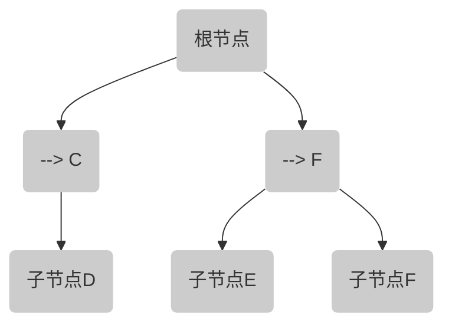

                 

## 代数结构基础

### 第1章：代数结构概述

#### 1.1 问题的背景与描述

代数结构，是数学中的一个重要概念，它以抽象的方式对一组对象和操作进行了定义。这一概念不仅在纯数学领域中有着广泛的应用，如群、环、域等，还在计算机科学，特别是函数式数据结构设计中，有着举足轻重的地位。在计算机科学中，代数结构为数据结构和算法设计提供了一种抽象模型，使得复杂的问题能够以更为简洁和直观的方式进行描述。

代数结构的重要性体现在以下几个方面：

1. **抽象表示**：代数结构通过定义一组对象和操作，可以抽象地表示出各种数据结构和算法。这种抽象使得我们在面对复杂的系统时，能够更加专注于问题的本质，而不是具体实现细节。

2. **形式化验证**：代数结构提供了一种形式化的方法来验证数据结构和算法的正确性。通过数学证明，我们可以确保系统在不同输入情况下都能正确运行。

3. **代码重用**：代数结构可以帮助我们构建可重用的代码库。例如，在函数式编程语言中，通过类型类和模式匹配，我们可以编写通用函数，这些函数可以应用于不同的数据结构上。

下面，我们将深入探讨代数结构的基本概念和原理。

#### 1.1.1 代数结构的重要性

代数结构的重要性首先体现在其抽象表示能力上。在计算机科学中，数据结构如数组、链表、树等，都可以用代数结构来描述。例如，数组可以用一个线性代数结构表示，其中元素可以通过索引访问；树可以用一个树状代数结构表示，其中节点之间的关系可以通过父子关系描述。

代数结构的形式化验证能力同样不可忽视。在软件开发过程中，正确性是至关重要的。代数结构提供了形式化的方法来验证数据结构和算法的正确性。例如，通过构造代数结构上的模型，我们可以证明某个算法在所有可能的情况下都能正确执行。

代码重用是代数结构的另一大优势。在函数式编程中，类型类和模式匹配使得我们可以编写通用的函数，这些函数可以应用于不同的数据结构上。例如，在Haskell中，我们可以定义一个`fold`函数，它能够对不同的数据结构进行遍历和累积操作，从而实现代码的重用。

总之，代数结构在计算机科学中扮演着不可或缺的角色。它不仅帮助我们更抽象地看待问题，提供了形式化验证的工具，还大大提高了代码的可重用性。

#### 1.1.2 代数结构的边界与外延

要深入理解代数结构，我们首先需要明确它的边界与外延。边界是指代数结构所涵盖的基本概念和操作，而外延则是指这些概念和操作在实际应用中的扩展。

代数结构通常由以下几个要素组成：

1. **代数结构对象**：这些对象构成了代数结构的基础。例如，在群结构中，对象可以是元素；在向量空间中，对象可以是向量。

2. **代数结构操作**：这些操作定义了对象之间的关系。例如，在群结构中，有运算符`*`；在向量空间中，有加法和数乘运算。

3. **代数结构的属性**：这些属性描述了代数结构的特性。例如，群结构具有结合律、交换律等；向量空间具有分配律、消去律等。

边界与外延的关系可以类比为几何学中的定义与公理。边界定义了代数结构的基本要素和操作，而外延则扩展了这些要素和操作的应用范围。

在实际应用中，代数结构的外延往往非常广泛。例如，群结构不仅应用于数学领域，还可以用于计算机科学中的权限管理、网络拓扑等；向量空间的应用则涵盖了物理学中的矢量运算、计算机图形学中的变换等。

理解代数结构的边界与外延有助于我们更好地应用这一概念，解决实际问题。

#### 1.1.3 代数结构的核心概念

在探讨代数结构时，核心概念是我们无法回避的。这些概念不仅是代数结构的基石，也是我们理解其应用的基础。以下是一些常见的代数结构核心概念：

1. **群（Group）**：群是最基本的代数结构之一。它由一组元素和一种二元运算组成，满足结合律、单位元和逆元三个基本性质。群在计算机科学中的应用非常广泛，如密码学、算法设计等。

2. **环（Ring）**：环是一种扩展了群结构的代数结构。它由两组元素组成，一组是加法群，另一组是乘法群，满足分配律和结合律等性质。环在数值计算、图形渲染等领域有广泛应用。

3. **域（Field）**：域是环的一种特殊形式，其中乘法群也是阿贝尔群，即乘法运算具有交换性。域在计算机图形学、信号处理等领域有着重要的应用。

4. **向量空间（Vector Space）**：向量空间是更一般化的代数结构，它由一组向量和一个数域组成，满足向量加法和数乘的分配律、结合律等性质。向量空间在物理学、计算机图形学、机器学习等领域有着广泛应用。

5. **积结构（Product Structure）**：积结构是将多个代数结构结合在一起的一种结构。例如，积群是由多个群通过积运算构成的，积环、积域也是如此。

这些核心概念不仅在数学中有着坚实的理论基础，也在计算机科学中找到了广泛的应用。通过理解这些概念，我们可以更好地运用代数结构来设计复杂的系统和算法。

#### 1.2 核心概念与联系

在代数结构的世界中，各种概念之间存在着紧密的联系。为了更好地理解这些概念，我们需要对它们进行系统性的比较和分析。以下是对几个核心概念及其联系的探讨：

##### 1.2.1 代数结构的属性特征对比表

首先，我们可以通过一个对比表来直观地展示不同代数结构的属性特征：

| 代数结构 | 群（Group） | 环（Ring） | 域（Field） | 向量空间（Vector Space） |
| :---: | :---: | :---: | :---: | :---: |
| 结合律 | 是的 | 是的 | 是的 | 是的 |
| 单位元 | 是的 | 是的 | 是的 | 是的 |
| 逆元 | 是的 | 是的 | 是的 | 是的 |
| 交换律 | 可选 | 可选 | 是的 | 可选 |
| 分配律 | 无需 | 是的 | 是的 | 是的 |
| 数乘分配律 | 无需 | 是的 | 是的 | 是的 |

从对比表中可以看出，群是所有代数结构的基础，其包含结合律、单位元和逆元三个基本性质。环在群的基础上增加了乘法运算，并满足分配律。域是环的一种扩展，乘法运算具有交换性。向量空间则是更一般化的代数结构，它包含向量加法和数乘运算，并满足分配律。

##### 1.2.2 代数结构之间的联系

接下来，我们探讨代数结构之间的联系。代数结构之间的联系可以从以下几个方面来理解：

1. **扩展与包含**：例如，群是环的基础，环又是域的基础。向量空间可以看作是更一般化的代数结构，它可以包含多个向量空间。

2. **构造方法**：例如，通过积运算，我们可以构造出积结构。积结构是由多个代数结构通过积运算结合在一起的一种结构。

3. **应用领域**：不同代数结构在不同的领域有着广泛的应用。例如，群在密码学、算法设计中应用广泛；环在数值计算、图形渲染中应用广泛；域在计算机图形学、信号处理中应用广泛；向量空间在物理学、计算机图形学、机器学习等领域有着广泛应用。

理解这些联系有助于我们更好地运用代数结构解决实际问题。

#### 1.2.3 代数结构的基本概念原理

为了深入理解代数结构，我们需要掌握其基本概念原理。以下是几个关键概念及其原理的详细介绍：

1. **结合律（Associativity）**：结合律是指对于任何三个元素a、b、c，运算满足\( (a \cdot b) \cdot c = a \cdot (b \cdot c) \)。这意味着无论运算的顺序如何，最终的结果都是相同的。

2. **单位元（Identity Element）**：单位元是指存在一个元素e，使得对于任何元素a，都有\( a \cdot e = e \cdot a = a \)。在加法运算中，0是单位元；在乘法运算中，1是单位元。

3. **逆元（Inverse Element）**：逆元是指对于任何元素a，存在一个元素b，使得\( a \cdot b = b \cdot a = e \)，其中e是单位元。例如，在加法运算中，每个元素都有其相反数作为逆元；在乘法运算中，非零元素都有其倒数作为逆元。

4. **交换律（Commutativity）**：交换律是指对于任何两个元素a、b，都有\( a \cdot b = b \cdot a \)。这意味着乘法运算具有交换性。

5. **分配律（Distributive Law）**：分配律是指乘法对加法具有分配性，即对于任何三个元素a、b、c，都有\( a \cdot (b + c) = (a \cdot b) + (a \cdot c) \)和\( (a + b) \cdot c = (a \cdot c) + (b \cdot c) \)。

6. **消去律（Cancellation Law）**：消去律是指如果\( a \cdot b = a \cdot c \)，那么\( b = c \)。这在环和域中是非常重要的性质。

理解这些基本概念原理有助于我们更深入地理解代数结构，并能在实际应用中更加灵活地运用这些原理。

#### 1.3 代数结构的ER实体关系图

为了更好地理解和分析代数结构，我们可以借助实体关系图（ER图）来直观地展示其组成和关系。以下是代数结构的ER实体关系图：

```mermaid
erDiagram
  Class::代数结构 <<--|组合| Class::运算符
  Class::代数结构 ||--|包含| Class::对象
  Class::对象 ||--|实例| Class::元素
  Class::运算符 ||--|实例| Class::操作符
  Class::对象 ||--|属性| Class::属性

  Class::代数结构 {
    +属性1
    +属性2
    +方法1()
    +方法2()
  }

  Class::运算符 {
    +操作符类型
    +操作符定义
  }

  Class::对象 {
    +元素类型
    +元素值
  }

  Class::操作符 {
    +操作符类型
    +操作符定义
  }

  Class::属性 {
    +属性类型
    +属性值
  }
```

该ER图展示了代数结构的基本组成部分，包括代数结构、运算符、对象、元素和属性。代数结构包含运算符和对象，运算符定义了操作的方式，而对象则包含元素和属性。通过这个ER图，我们可以更清晰地理解代数结构的组成及其关系。

#### 1.3.1 ER实体关系图的绘制方法

为了更好地展示代数结构的ER实体关系图，我们需要了解其绘制方法。以下是绘制ER图的步骤：

1. **确定实体类**：首先，确定代数结构中的实体类，如代数结构、运算符、对象、元素和属性。

2. **定义实体属性**：为每个实体类定义属性，如代数结构的属性1、属性2，运算符的操作符类型、操作符定义等。

3. **确定实体关系**：定义实体类之间的关系，如代数结构与运算符之间的组合关系，代数结构与对象之间的包含关系，对象与元素之间的实例关系，以及对象与属性之间的属性关系。

4. **绘制ER图**：使用Mermaid语法绘制ER图。以下是示例代码：

    ```mermaid
    erDiagram
      Class::代数结构 <<--|组合| Class::运算符
      Class::代数结构 ||--|包含| Class::对象
      Class::对象 ||--|实例| Class::元素
      Class::运算符 ||--|实例| Class::操作符
      Class::对象 ||--|属性| Class::属性

      Class::代数结构 {
        +属性1
        +属性2
        +方法1()
        +方法2()
      }

      Class::运算符 {
        +操作符类型
        +操作符定义
      }

      Class::对象 {
        +元素类型
        +元素值
      }

      Class::操作符 {
        +操作符类型
        +操作符定义
      }

      Class::属性 {
        +属性类型
        +属性值
      }
    ```

通过以上步骤，我们可以绘制出一个清晰的ER实体关系图，帮助理解代数结构的组成和关系。

#### 1.3.2 ER实体关系图示例

为了更直观地展示ER实体关系图，我们可以通过一个实际示例来进一步说明。以下是一个简化的代数结构ER实体关系图示例：

```mermaid
erDiagram
  Class::代数结构 ||--|包含| Class::对象
  Class::对象 ||--|实例| Class::元素
  Class::代数结构 ||--|操作| Class::运算符

  Class::代数结构 {
    +名称
    +类型
  }

  Class::对象 {
    +ID
    +值
  }

  Class::元素 {
    +ID
    +类型
  }

  Class::运算符 {
    +操作符名称
    +操作符类型
  }
```

在这个示例中，我们定义了三个实体类：代数结构、对象和运算符。代数结构包含对象和运算符，对象包含元素，而运算符则定义了操作。

- **代数结构**：代表一个抽象的代数结构，如群、环、域等，它包含名称和类型。
- **对象**：代表代数结构中的具体对象，如群中的元素，它包含ID和值。
- **元素**：代表对象中的具体元素，它包含ID和类型。
- **运算符**：代表代数结构中的运算，如加法、乘法等，它包含操作符名称和操作符类型。

通过这个示例，我们可以更清晰地看到各个实体类之间的包含和操作关系。

#### 1.4 本章小结

在本章中，我们系统地介绍了代数结构的基础知识。首先，我们探讨了代数结构在计算机科学中的重要性，包括其抽象表示、形式化验证和代码重用等方面。接着，我们明确了代数结构的边界与外延，解释了代数结构的核心概念，如群、环、域和向量空间，并对比了它们的属性特征。此外，我们还详细讲解了代数结构的基本概念原理，如结合律、单位元、逆元、交换律和分配律。最后，我们通过ER实体关系图展示了代数结构的组成和关系。

通过本章的学习，我们为后续章节中函数式数据结构设计和代数结构在实际应用中的深入探讨奠定了坚实的基础。

---

## 函数式编程基础

### 第2章：函数式编程基础

#### 2.1 函数式编程的概念

函数式编程（Functional Programming，FP）是一种编程范式，它强调以函数作为主要构建块，通过输入输出关系来表达程序行为。与传统的命令式编程（Imperative Programming）不同，函数式编程不依赖于状态的变化和流程控制，而是通过纯函数和不可变数据来构建程序。

##### 2.1.1 函数式编程的基本思想

函数式编程的基本思想可以总结为以下几点：

1. **纯函数**：纯函数是一种无副作用的函数，对于相同的输入总是产生相同的输出，不依赖于外部状态。这使得纯函数易于测试、理解和重用。

2. **不可变性**：在函数式编程中，数据通常是不可变的，一旦创建就不能更改。这意味着数据的任何修改都会生成一个新的副本。

3. **递归**：函数式编程广泛使用递归而不是循环来处理重复任务，这有助于简化代码，提高可读性。

4. **组合**：函数式编程强调函数的组合，通过将小函数组合成更大的函数，可以构建复杂的程序逻辑。

5. **不可变性**：不可变性使得数据更加安全，减少了并发编程中的同步问题。

##### 2.1.2 函数式编程与命令式编程的区别

函数式编程与命令式编程（如C、Java等）有以下几个显著区别：

1. **数据与状态**：命令式编程依赖于状态的变化来控制程序流程，而函数式编程不依赖于状态，而是通过纯函数和不可变数据来实现相同的功能。

2. **变量**：在命令式编程中，变量通常是可以修改的，而在函数式编程中，变量是不可变的，任何修改都会生成一个新的变量。

3. **循环**：命令式编程通常使用循环来处理重复任务，而函数式编程则使用递归。

4. **副作用**：命令式编程中的函数可能有副作用，即函数会改变外部状态或输出日志等。在函数式编程中，函数应该是纯的，没有副作用。

5. **类型系统**：函数式编程语言通常具有更严格的类型系统，这有助于在编译时发现错误，提高程序的稳定性。

##### 2.1.3 函数式编程的优点

函数式编程具有多个显著优点：

1. **易于测试和调试**：由于纯函数没有副作用，单元测试变得更加简单和可靠。

2. **代码重用性高**：通过函数的组合，我们可以构建可重用的代码模块。

3. **易于并行编程**：纯函数和不可变性使得函数式编程在并行和分布式系统中更易于实现。

4. **提高可读性**：递归和组合有助于编写简洁、直观的代码。

5. **错误率低**：由于数据不可变，减少了由于状态变化引起的bug。

#### 2.2 主要的函数式编程语言

在计算机科学中，有多种函数式编程语言得到了广泛应用。以下介绍几种主要的函数式编程语言：

##### 2.2.1 Haskell

Haskell是一种纯函数式编程语言，以其简洁、优雅和强大的类型系统而闻名。Haskell的特点包括：

1. **类型推导**：Haskell具有自动类型推导功能，不需要显式声明变量类型。

2. **不可变性**：所有数据都是不可变的，任何修改都会生成一个新的副本。

3. **惰性求值**：Haskell使用惰性求值策略，只有当函数的值被实际需要时才会计算。

4. **函数组合**：Haskell支持强大的函数组合功能，可以通过点号（`.`）和函数组合操作符（`$`）实现。

5. **模式匹配**：Haskell支持模式匹配，可以方便地处理不同类型的数据。

##### 2.2.2 Scala

Scala是一种多范式编程语言，既支持函数式编程，也支持命令式编程。Scala的特点包括：

1. **类型系统**：Scala具有强大的类型系统，支持类型推导、类型推断和类型检查。

2. **不可变性**：Scala默认使用不可变数据，通过`val`关键字声明不可变变量。

3. **模式匹配**：Scala支持模式匹配，可以方便地处理不同类型的数据。

4. **函数组合**：Scala支持高阶函数和函数组合，可以通过`:::`和`$`操作符实现。

5. **集合操作**：Scala提供丰富的集合操作，支持函数式编程风格。

##### 2.2.3 Python

Python是一种广泛使用的通用编程语言，虽然它主要被视为命令式编程语言，但也支持函数式编程。Python在函数式编程方面的特点包括：

1. **函数作为一等公民**：Python中的函数可以像普通变量一样传递、返回和存储。

2. **高阶函数**：Python支持高阶函数，可以接受其他函数作为参数或返回函数。

3. **lambda表达式**：Python支持lambda表达式，可以方便地定义匿名函数。

4. **列表解析**：Python的列表解析（list comprehensions）和生成器（generators）使得函数式编程风格的应用更加简单。

5. **模块化**：Python支持模块化和面向对象编程，有助于编写可重用的代码。

#### 2.3 函数式编程的核心概念

为了深入理解函数式编程，我们需要掌握其核心概念，包括高阶函数、函数组合、柯里化等。

##### 2.3.1 高阶函数

高阶函数（Higher-Order Function）是指能够接受其他函数作为参数或返回函数的函数。高阶函数是函数式编程的核心概念之一，它使得函数的组合和抽象成为可能。以下是一些高阶函数的例子：

1. **`map`函数**：`map`函数用于对集合中的每个元素应用一个给定函数，并返回一个新的集合。例如，在Python中，`map(func, iterable)`会返回一个应用了`func`函数的新集合。

2. **`filter`函数**：`filter`函数用于从集合中筛选出满足某个条件的元素，并返回一个新的集合。例如，在Python中，`filter(func, iterable)`会返回一个满足`func`函数条件的元素组成的集合。

3. **`reduce`函数**：`reduce`函数用于对集合中的元素进行累积操作，并返回累积结果。例如，在Python中，`reduce(func, iterable)`会将集合中的元素依次应用`func`函数，并返回最终的累积结果。

##### 2.3.2 函数组合

函数组合（Function Composition）是指将两个或多个函数组合成一个新函数的过程。函数组合是函数式编程的关键技巧，它允许我们将复杂逻辑分解为简单的函数，并通过组合这些函数来构建复杂的功能。以下是一个简单的函数组合示例：

```python
def add(x, y):
    return x + y

def multiply(x, y):
    return x * y

def compose(f, g):
    return lambda x: f(g(x))

addFive = compose(add, lambda x: x + 5)
result = addFive(10)  # 返回15

multiplyByTwo = compose(multiply, lambda x: x * 2)
result = multiplyByTwo(5)  # 返回20
```

在这个示例中，`compose`函数用于将两个函数`add`和`multiply`组合成一个新的函数`addFive`和`multiplyByTwo`。通过函数组合，我们可以轻松地构建复杂的功能。

##### 2.3.3 柯里化

柯里化（Currying）是一种将一个函数转换成一系列嵌套函数的过程。柯里化有助于提高函数的可重用性和灵活性。以下是一个简单的柯里化示例：

```python
def add(x, y):
    return x + y

addFive = add(5)
result = addFive(10)  # 返回15
```

在这个示例中，`add`函数被柯里化为`addFive`函数，它只接受一个参数`y`。通过柯里化，我们可以方便地创建特定参数的函数，从而提高代码的复用性。

#### 2.4 本章小结

在本章中，我们介绍了函数式编程的基础概念，包括其基本思想、与命令式编程的区别、主要函数式编程语言以及核心概念如高阶函数、函数组合和柯里化。通过这些内容，我们为后续章节中函数式数据结构设计和代数结构在实际应用中的深入探讨奠定了坚实的基础。

---

## 常用函数式数据结构

### 第3章：常用函数式数据结构

函数式数据结构是函数式编程中非常重要的组成部分，它们不仅能够有效地存储数据，还能提供强大的操作接口。本章将介绍几种常见的函数式数据结构，包括树结构、图结构和向量与集合。

#### 3.1 树结构

树结构（Tree Structure）是一种重要的非线性数据结构，它由一组节点组成，每个节点有零个或多个子节点。树结构在计算机科学中有着广泛的应用，如文件系统、组织结构、算法分析等。

##### 3.1.1 树的基本概念

1. **节点（Node）**：树中的每个元素称为节点，每个节点包含数据和指向子节点的指针。

2. **根节点（Root）**：树的顶部节点称为根节点，没有父节点。

3. **子节点（Child）**：某个节点的子节点称为其孩子。

4. **父节点（Parent）**：某个节点的父节点称为其父。

5. **叶子节点（Leaf）**：没有子节点的节点称为叶子节点。

6. **度（Degree）**：节点拥有的子节点数量称为节点的度。

7. **深度（Depth）**：节点的深度是指从根节点到该节点的路径长度。

8. **高度（Height）**：树的高度是指从根节点到最远叶子节点的最长路径长度。

##### 3.1.2 二叉树

二叉树（Binary Tree）是树结构的一种特殊形式，每个节点最多有两个子节点。二叉树可以分为以下几种类型：

1. **二叉搜索树（Binary Search Tree）**：二叉搜索树是一种特殊的二叉树，满足以下性质：
   - 左子树中的所有节点值都小于根节点值。
   - 右子树中的所有节点值都大于根节点值。
   - 左右子树也都是二叉搜索树。

2. **平衡二叉树（AVL Tree）**：平衡二叉树是一种特殊的二叉搜索树，其任何节点的左右子树高度差不超过1。

3. **堆（Heap）**：堆是一种特殊的树形数据结构，通常用于优先队列的实现。堆可以分为最大堆和最小堆，其中根节点的值始终大于或小于所有子节点的值。

##### 3.1.3 平衡二叉树

平衡二叉树（AVL Tree）是一种自平衡的二叉搜索树，它的任何节点的左右子树高度差不超过1。为了保持这种平衡，AVL树在插入和删除节点时可能会进行旋转操作。

1. **LL旋转（左左旋转）**：当新节点插入到当前节点的左子节点的左子节点时，进行LL旋转。

2. **RR旋转（左右旋转）**：当新节点插入到当前节点的右子节点的右子节点时，进行RR旋转。

3. **LR旋转（左右旋转）**：当新节点插入到当前节点的左子节点的右子节点时，进行LR旋转。

4. **RL旋转（左右旋转）**：当新节点插入到当前节点的右子节点的左子节点时，进行RL旋转。

通过这些旋转操作，AVL树能够保持其平衡性，确保查找、插入和删除操作的平均时间复杂度为O(log n)。

#### 3.2 图结构

图结构（Graph Structure）是另一种重要的数据结构，它由节点和边组成，可以表示复杂的网络关系。图结构在计算机科学中有着广泛的应用，如社交网络、网络拓扑、路径规划等。

##### 3.2.1 图的基本概念

1. **节点（Vertex）**：图中的元素称为节点，也可以称为顶点。

2. **边（Edge）**：连接两个节点的线称为边。

3. **无向图（Undirected Graph）**：如果边没有方向，则称为无向图。

4. **有向图（Directed Graph）**：如果边有方向，则称为有向图。

5. **完全图（Complete Graph）**：如果任意两个节点之间都存在边，则称为完全图。

6. **连通图（Connected Graph）**：如果任意两个节点之间都存在路径，则称为连通图。

7. **路径（Path）**：连接两个节点的序列，其中每两个相邻节点之间都存在边。

8. **环（Cycle）**：封闭的路径，其中第一个节点和最后一个节点相同。

##### 3.2.2 无向图与有向图

无向图和有向图是图结构的两种基本形式：

1. **无向图**：在无向图中，边没有方向，任意两个节点之间都可以相互访问。无向图可以用一个无向图表示。

2. **有向图**：在有向图中，边有方向，从一个节点指向另一个节点。有向图可以用一个有向图表示。

##### 3.2.3 图的遍历算法

图的遍历算法用于访问图中的所有节点。常见的遍历算法包括深度优先搜索（DFS）和广度优先搜索（BFS）。

1. **深度优先搜索（DFS）**：DFS算法从起始节点开始，沿着一条路径一直向下深入，直到到达无法深入的位置，然后回溯到上一个节点，继续向下深入。DFS算法可以用来求解连通性、寻找最短路径等。

2. **广度优先搜索（BFS）**：BFS算法从起始节点开始，依次访问其邻接节点，直到访问到目标节点。BFS算法可以用来求解最短路径、查找图中的环等。

#### 3.3 向量与集合

向量（Vector）和集合（Set）是函数式编程中常用的数据结构，它们分别用于存储有序和无序的数据。

##### 3.3.1 向量的基本概念

1. **向量**：向量是一种有序数据集合，每个元素都有一个索引，索引从0开始。

2. **长度**：向量的长度是指其中包含的元素数量。

3. **元素访问**：可以通过索引访问向量的元素，如`vector[i]`。

4. **向量操作**：向量支持添加、删除、更新和查询等操作，如`vector.append()`、`vector.remove()`、`vector.update()`等。

##### 3.3.2 集合的基本概念

1. **集合**：集合是一种无序数据集合，不包含重复元素。

2. **元素插入**：可以通过`set.add(element)`向集合中添加元素。

3. **元素查询**：可以通过`set.contains(element)`查询元素是否存在于集合中。

4. **集合操作**：集合支持并集、交集、差集等操作，如`set.union()`、`set.intersection()`、`set.difference()`等。

##### 3.3.3 集合的运算

1. **并集（Union）**：并集是指将两个或多个集合中的所有元素合并成一个新集合。

2. **交集（Intersection）**：交集是指同时存在于两个或多个集合中的元素组成的新集合。

3. **差集（Difference）**：差集是指从第一个集合中移除与第二个集合中相同的元素后得到的新集合。

通过这些基本概念和操作，向量与集合在函数式编程中能够有效地存储和操作数据。

#### 3.4 本章小结

在本章中，我们介绍了常用的函数式数据结构，包括树结构、图结构和向量与集合。树结构以节点和边为基础，适用于表示层次关系；图结构则通过节点和边表示复杂的网络关系；向量与集合则分别用于存储有序和无序的数据。通过这些数据结构，函数式编程能够有效地存储和操作数据，实现复杂的程序逻辑。

---

## 代数结构在数据结构设计中的应用

### 第4章：代数结构在数据结构设计中的应用

在数据结构设计中，代数结构的应用为我们提供了一种强有力的工具，使得数据结构能够以更为抽象和形式化的方式表示。通过引入代数结构，我们可以设计出更高效、更可重用和更易于验证的数据结构。本章将探讨代数结构在树结构、图结构和向量与集合中的应用。

#### 4.1 代数结构在树结构中的应用

树结构在计算机科学中有着广泛的应用，如文件系统、组织结构、搜索算法等。通过引入代数结构，我们可以对树结构进行更深入的抽象和优化。

##### 4.1.1 树结构的代数特性

树结构的代数特性主要体现在以下几个方面：

1. **节点与边的关系**：树中的节点可以通过边进行连接，每个节点都有零个或多个子节点。这种关系可以用代数结构中的图（Graph）来表示。

2. **根节点的特殊性**：树中的根节点具有特殊性，它是所有节点的起点。在代数结构中，可以通过特定的代数运算（如根运算）来表示这一特性。

3. **子节点的组合**：树中的每个节点都可以看作是子节点的组合。这种组合关系可以用代数结构中的组合运算（如并集、交集等）来表示。

##### 4.1.2 树结构的代数模型

为了更好地理解和应用树结构的代数特性，我们可以引入一个简化的代数模型。以下是一个树结构的代数模型示例：



在这个模型中，`A`表示根节点，`B`、`C`、`D`、`E`和`F`表示子节点。箭头表示节点之间的关系，即每个子节点都是其父节点的子节点。通过这个模型，我们可以直观地看到树结构的代数特性。

##### 4.1.3 代数结构在树结构优化中的应用

代数结构不仅能够帮助我们理解树结构，还可以在树结构的优化设计中发挥重要作用。以下是一些代数结构在树结构优化中的应用：

1. **平衡二叉树**：通过代数结构中的平衡操作，我们可以设计出平衡二叉树（如AVL树），使得树的高度保持平衡，从而提高查找和插入操作的效率。

2. **树合并**：利用代数结构中的组合运算，我们可以将两个树合并成一个更大的树，从而实现更高效的树操作。

3. **树遍历优化**：通过代数结构中的抽象表示，我们可以设计出更高效的树遍历算法，如深度优先搜索（DFS）和广度优先搜索（BFS）。

例如，在平衡二叉树的优化中，我们可以使用代数结构中的平衡操作来保持树的高度平衡。当树的高度失衡时，我们可以通过旋转操作（如LL旋转、RR旋转、LR旋转和RL旋转）来恢复平衡。这些旋转操作可以通过代数结构中的特定运算表示，使得树的操作更加直观和高效。

```mermaid
graph TB
A[根节点]
B[子节点B]
C[子节点C]
D[子节点D]
E[子节点E]
F[子节点F]
G[子节点G]

A --> B
A --> C
B --> D
C --> E
C --> F
G --> E

classDef node fill:#ccc,stroke:none;
classDef edge stroke:#333;

A("根节点")
B("子节点B")
C("子节点C")
D("子节点D")
E("子节点E")
F("子节点F")
G("子节点G")

B("--> C")
C("--> D")
C("--> F")
G("--> E"

subgraph 旋转操作
  G --> H
  G --> I
  H --> J
  I --> K
  J --> L
  K --> M

classDef node fill:#ddd,stroke:none;
classDef edge stroke:#666;

G("父节点G")
H("子节点H")
I("子节点I")
J("子节点J")
K("子节点K")
L("子节点L")
M("子节点M")

G("--> H")
G("--> I")
H("--> J")
I("--> K")
J("--> L")
K("--> M"
```

在这个示例中，我们通过旋转操作来保持树的高度平衡。当节点`G`的左子树高度大于右子树时，我们可以通过LL旋转或LR旋转来恢复平衡。这些旋转操作可以通过代数结构中的特定运算表示，使得树的平衡操作更加直观和高效。

通过这些应用，我们可以看到代数结构在树结构优化中的重要作用。它不仅帮助我们理解树结构，还能在设计高效、可重用的树结构算法中发挥关键作用。

#### 4.2 代数结构在图结构中的应用

图结构在计算机科学中有着广泛的应用，如社交网络、网络拓扑、图论算法等。通过引入代数结构，我们可以对图结构进行更深入的抽象和优化。

##### 4.2.1 图结构的代数特性

图结构的代数特性主要体现在以下几个方面：

1. **节点与边的组合**：图中的节点和边可以通过代数结构中的组合运算（如并集、交集等）进行组合。

2. **路径关系**：图中的节点和路径可以通过代数结构中的路径运算（如加法、乘法等）进行表示。

3. **连通关系**：图的连通性可以通过代数结构中的连通运算（如连通性检测、连通分量等）进行表示。

##### 4.2.2 图结构的代数模型

为了更好地理解和应用图结构的代数特性，我们可以引入一个简化的代数模型。以下是一个图结构的代数模型示例：

```mermaid
graph TB
A[节点A]
B[节点B]
C[节点C]
D[节点D]

A --> B
B --> C
C --> D

classDef node fill:#ccc,stroke:none;
classDef edge stroke:#333;

A("节点A")
B("节点B")
C("节点C")
D("节点D")

A("--> B")
B("--> C")
C("--> D"
```

在这个模型中，`A`、`B`、`C`和`D`表示节点，它们通过边进行连接。通过这个模型，我们可以直观地看到图结构的代数特性。

##### 4.2.3 代数结构在图算法优化中的应用

代数结构不仅能够帮助我们理解图结构，还可以在图算法优化设计中发挥重要作用。以下是一些代数结构在图算法优化中的应用：

1. **图遍历优化**：通过代数结构中的路径运算，我们可以设计出更高效的图遍历算法，如深度优先搜索（DFS）和广度优先搜索（BFS）。

2. **最短路径算法**：通过代数结构中的路径运算和优化，我们可以设计出更高效的最短路径算法，如迪杰斯特拉算法（Dijkstra's Algorithm）和贝尔曼-福特算法（Bellman-Ford Algorithm）。

3. **图匹配算法**：通过代数结构中的组合运算，我们可以设计出更高效的图匹配算法，如最大流最小割算法（Maximum Flow Minimum Cut Algorithm）。

例如，在深度优先搜索（DFS）算法中，我们可以通过代数结构中的路径运算来表示和优化搜索过程。在DFS算法中，我们从起始节点开始，沿着一条路径深入，直到无法继续深入为止，然后回溯到上一个节点，继续向下深入。通过代数结构中的路径运算，我们可以将这个过程表示为：

```mermaid
graph TB
A[节点A]
B[节点B]
C[节点C]
D[节点D]

A --> B
B --> C
C --> D

classDef node fill:#ccc,stroke:none;
classDef edge stroke:#333;

A("节点A")
B("节点B")
C("节点C")
D("节点D")

A("--> B")
B("--> C")
C("--> D"

subgraph 深度优先搜索
  A --> B
  B --> C
  C --> D
  D --> A

classDef node fill:#ddd,stroke:none;
classDef edge stroke:#666;

A("起始节点")
B("中间节点")
C("中间节点")
D("终点节点")

A("--> B")
B("--> C")
C("--> D")
D("--> A"
```

在这个示例中，我们从节点`A`开始，沿着路径`A -> B -> C -> D`进行深度优先搜索，最终回溯到起始节点`A`。通过代数结构中的路径运算，我们可以直观地表示和优化这个过程。

通过这些应用，我们可以看到代数结构在图结构优化中的重要作用。它不仅帮助我们理解图结构，还能在设计高效、可重用的图算法中发挥关键作用。

#### 4.3 代数结构在向量与集合中的应用

向量（Vector）和集合（Set）是函数式编程中常用的数据结构，它们分别用于存储有序和无序的数据。通过引入代数结构，我们可以对向量与集合进行更深入的抽象和优化。

##### 4.3.1 向量与集合的代数特性

向量与集合的代数特性主要体现在以下几个方面：

1. **元素组合**：向量与集合中的元素可以通过代数结构中的组合运算进行组合，如并集、交集等。

2. **元素运算**：向量与集合中的元素可以通过代数结构中的运算进行操作，如加法、减法等。

3. **元素查询**：向量与集合中的元素可以通过代数结构中的查询运算进行查询，如元素是否存在、元素位置等。

##### 4.3.2 向量与集合的代数模型

为了更好地理解和应用向量与集合的代数特性，我们可以引入一个简化的代数模型。以下是一个向量与集合的代数模型示例：

```mermaid
graph TB
A[向量A]
B[集合B]

A --> C
A --> D
A --> E

B --> F
B --> G
B --> H

classDef node fill:#ccc,stroke:none;
classDef edge stroke:#333;

A("向量A")
B("集合B")
C("元素C")
D("元素D")
E("元素E")
F("元素F")
G("元素G")
H("元素H")

A("C,D,E")
B("F,G,H")

A("--> C")
A("--> D")
A("--> E")

B("--> F")
B("--> G")
B("--> H"
```

在这个模型中，`A`表示向量，包含元素`C`、`D`和`E`；`B`表示集合，包含元素`F`、`G`和`H`。通过这个模型，我们可以直观地看到向量与集合的代数特性。

##### 4.3.3 代数结构在向量与集合优化中的应用

代数结构不仅能够帮助我们理解向量与集合，还可以在向量与集合的优化设计中发挥重要作用。以下是一些代数结构在向量与集合优化中的应用：

1. **向量运算优化**：通过代数结构中的运算，我们可以设计出更高效的向量运算算法，如向量加法、向量减法等。

2. **集合运算优化**：通过代数结构中的组合运算，我们可以设计出更高效的集合运算算法，如并集、交集等。

3. **元素查询优化**：通过代数结构中的查询运算，我们可以设计出更高效的元素查询算法，如元素是否存在、元素位置等。

例如，在向量加法运算中，我们可以通过代数结构中的加法运算进行优化。在代数结构中，向量加法可以表示为：

```mermaid
graph TB
A[向量A]
B[向量B]
C[向量C]

A --> D
A --> E
A --> F

B --> G
B --> H
B --> I

C --> J
C --> K
C --> L

D --> J
E --> K
F --> L

classDef node fill:#ccc,stroke:none;
classDef edge stroke:#333;

A("向量A")
B("向量B")
C("向量C")
D("元素D")
E("元素E")
F("元素F")
G("元素G")
H("元素H")
I("元素I")
J("元素J")
K("元素K")
L("元素L")

A("D,E,F")
B("G,H,I")
C("J,K,L")

A("--> D")
A("--> E")
A("--> F")

B("--> G")
B("--> H")
B("--> I"

C("--> J")
C("--> K")
C("--> L"

D("--> J")
E("--> K")
F("--> L"
```

在这个示例中，向量`A`和向量`B`通过加法运算生成向量`C`。通过代数结构中的加法运算，我们可以直观地表示和优化这个过程。

通过这些应用，我们可以看到代数结构在向量与集合优化中的重要作用。它不仅帮助我们理解向量与集合，还能在设计高效、可重用的向量与集合算法中发挥关键作用。

#### 4.4 本章小结

在本章中，我们探讨了代数结构在数据结构设计中的应用。通过引入代数结构，我们可以对树结构、图结构和向量与集合进行更深入的抽象和优化。在树结构中，代数结构帮助我们理解节点与边的关系，优化了平衡二叉树的设计。在图结构中，代数结构帮助我们理解节点与路径的关系，优化了图遍历算法和最短路径算法的设计。在向量与集合中，代数结构帮助我们理解元素组合和元素运算，优化了向量与集合的运算和查询效率。

通过这些应用，我们可以看到代数结构在数据结构设计中的重要作用。它不仅帮助我们理解数据结构，还能在设计高效、可重用的数据结构算法中发挥关键作用。

---

## 代数结构在函数式编程语言中的实现

### 第5章：代数结构在函数式编程语言中的实现

在函数式编程语言中，代数结构的应用为我们提供了强大的抽象工具，使得数据结构和算法设计更加简洁、直观和高效。本章将探讨代数结构在Haskell、Scala和Python等主要函数式编程语言中的实现，包括数据类型的定义、类型类的应用以及代数数据结构的实现。

#### 5.1 Haskell中的代数结构

Haskell是一种纯函数式编程语言，以其强大的类型系统和惰性求值而闻名。在Haskell中，代数结构可以通过数据类型（Type）和类型类（Type Class）来定义和实现。

##### 5.1.1 Haskell中的数据类型

在Haskell中，数据类型是构建代数结构的基础。以下是一些常用的数据类型：

1. **基本数据类型**：如`Int`（整数）、`Float`（浮点数）、`Char`（字符）等。

2. **复合数据类型**：如`Tuple`（元组）、`List`（列表）和`Maybe`（可能值）等。

3. **代数数据类型**：如`Sum`（相加类型）、`Product`（相乘类型）和`Functor`（函子）等。

以下是一个简单的Haskell程序，展示了如何定义和使用复合数据类型和代数数据类型：

```haskell
-- 定义一个简单的二元组类型
data Tuple2 a b = Tuple2 a b

-- 定义一个相加类型
data Sum a b = First a | Second b

-- 定义一个函子
class Functor f where
  fmap :: (a -> b) -> f a -> f b

-- 实现函子接口
instance Functor Tuple2 where
  fmap f (Tuple2 a b) = Tuple2 (f a) (f b)

instance Functor Sum where
  fmap f (First a) = First (f a)
  fmap f (Second b) = Second (f b)

-- 使用函子进行映射
main :: IO ()
main = do
  let tuple = Tuple2 1 "hello"
  let sum = First 5
  putStrLn $ show (fmap (\x -> x * 2) tuple)
  putStrLn $ show (fmap (\x -> if x == 5 then 10 else 0) sum)
```

在这个程序中，我们定义了`Tuple2`（二元组类型）、`Sum`（相加类型）和`Functor`（函子）类，并实现了函子接口。通过`fmap`函数，我们可以对复合数据类型和代数数据类型进行映射操作。

##### 5.1.2 Haskell中的类型类

类型类（Type Class）是Haskell中的一种高级抽象机制，它允许我们定义具有共性的函数，这些函数可以应用于多种数据类型上。类型类通过类约束（Class Constraints）来确保函数的定义在所有符合类型类的数据类型上都是一致和有效的。

以下是一个简单的类型类示例：

```haskell
-- 定义一个类型类，具有'Num'类型约束
class Num a where
  (+) :: a -> a -> a
  (*) :: a -> a -> a
  negate :: a -> a

-- 实现整数类型的'Num'接口
instance Num Int where
  (+) a b = a + b
  (*) a b = a * b
  negate a = -a

-- 实现浮点数类型的'Num'接口
instance Num Float where
  (+) a b = a + b
  (*) a b = a * b
  negate a = -a

-- 使用类型类进行运算
main :: IO ()
main = do
  putStrLn $ show (3 + 4)
  putStrLn $ show (3 * 4)
  putStrLn $ show (negate 3)
```

在这个示例中，我们定义了一个`Num`类型类，并实现了整数类型和浮点数类型的`Num`接口。通过类型类，我们可以编写通用的运算函数，如`+`、`*`和`negate`，这些函数可以应用于整数和浮点数。

##### 5.1.3 Haskell中的代数数据结构

在Haskell中，代数数据结构（Algebraic Data Types，ADT）是一种用于构建复杂数据类型的方法。代数数据结构通过构造器（Constructor）将多个数据类型组合在一起，形成复合数据类型。

以下是一个简单的代数数据结构示例：

```haskell
-- 定义一个简单的树结构
data Tree a = Empty | Node a (Tree a) (Tree a)

-- 创建树的实例
tree :: Tree Int
tree = Node 1 (Node 2 Empty Empty) (Node 3 Empty Empty)

-- 遍历树的元素
preOrderTraversal :: Tree a -> [a]
preOrderTraversal Empty = []
preOrderTraversal (Node value left right) = 
  value : preOrderTraversal left ++ preOrderTraversal right

-- 主函数
main :: IO ()
main = do
  putStrLn $ show (preOrderTraversal tree)
```

在这个示例中，我们定义了一个简单的树结构`Tree`，它由空节点`Empty`和带有值和左右子节点的节点`Node`构成。通过递归遍历函数`preOrderTraversal`，我们可以遍历树中的所有元素。

通过代数数据结构，我们可以以更直观和抽象的方式表示复杂的数据结构，从而提高代码的可重用性和可读性。

#### 5.2 Scala中的代数结构

Scala是一种多范式编程语言，既支持函数式编程，也支持命令式编程。Scala中的代数结构通过模式匹配（Pattern Matching）、类型系统和类型类来实现。

##### 5.2.1 Scala中的模式匹配

模式匹配是Scala中的一个强大特性，它允许我们根据变量的值进行分类处理。模式匹配可以用于处理各种数据结构，包括基本数据类型、复合数据类型和代数数据类型。

以下是一个简单的Scala程序，展示了如何使用模式匹配：

```scala
// 定义一个简单的树结构
sealed abstract class Tree[+A]
case class Leaf[A](value: A) extends Tree[A]
case class Node[A](value: A, left: Tree[A], right: Tree[A]) extends Tree[A]

// 遍历树的元素
def preOrderTraversal[A](tree: Tree[A]): List[A] = tree match {
  case Leaf(value) => List(value)
  case Node(value, left, right) =>
    value :: preOrderTraversal(left) ++ preOrderTraversal(right)
}

// 主函数
def main(args: Array[String]): Unit = {
  val tree = Node(1, Leaf(2), Leaf(3))
  println(preOrderTraversal(tree).toString())
}
```

在这个示例中，我们定义了一个简单的树结构`Tree`，并使用模式匹配函数`preOrderTraversal`来遍历树中的元素。通过模式匹配，我们可以根据树的类型和值进行分类处理，从而简化代码。

##### 5.2.2 Scala中的类型系统

Scala具有丰富的类型系统，包括基本数据类型、复合数据类型和类型参数。Scala的类型系统支持类型推导和类型检查，使得代码更加简洁和可靠。

以下是一个简单的Scala程序，展示了如何使用类型系统：

```scala
// 定义一个类型类，具有'Num'类型约束
trait Num[T] {
  def plus(a: T, b: T): T
  def minus(a: T, b: T): T
  def times(a: T, b: T): T
  def divide(a: T, b: T): T
}

// 实现整数类型的'Num'接口
class NumInt extends Num[Int] {
  def plus(a: Int, b: Int) = a + b
  def minus(a: Int, b: Int) = a - b
  def times(a: Int, b: Int) = a * b
  def divide(a: Int, b: Int) = a / b
}

// 主函数
def main(args: Array[String]): Unit = {
  val numInt = new NumInt
  println(numInt.plus(3, 4))
  println(numInt.minus(3, 4))
  println(numInt.times(3, 4))
  println(numInt.divide(3, 4))
}
```

在这个示例中，我们定义了一个类型类`Num`，并实现了整数类型的`Num`接口。通过类型类，我们可以编写通用的运算函数，如`plus`、`minus`、`times`和`divide`，这些函数可以应用于不同的数据类型。

##### 5.2.3 Scala中的代数数据结构

在Scala中，代数数据结构（Algebraic Data Types，ADT）通过sealed trait和case class来实现。sealed trait表示这个类型是封闭的，即没有其他的子类；case class表示这个类型是一个复合数据类型，支持模式匹配。

以下是一个简单的Scala代数数据结构示例：

```scala
// 定义一个简单的树结构
sealed trait Tree[+A]
case class Leaf[A](value: A) extends Tree[A]
case class Node[A](value: A, left: Tree[A], right: Tree[A]) extends Tree[A]

// 遍历树的元素
def preOrderTraversal[A](tree: Tree[A]): List[A] = tree match {
  case Leaf(value) => List(value)
  case Node(value, left, right) =>
    value :: preOrderTraversal(left) ++ preOrderTraversal(right)
}

// 主函数
def main(args: Array[String]): Unit = {
  val tree = Node(1, Leaf(2), Leaf(3))
  println(preOrderTraversal(tree).toString())
}
```

在这个示例中，我们定义了一个简单的树结构`Tree`，并使用模式匹配函数`preOrderTraversal`来遍历树中的元素。通过模式匹配，我们可以根据树的类型和值进行分类处理，从而简化代码。

#### 5.3 Python中的代数结构

Python是一种通用编程语言，虽然它主要被视为命令式编程语言，但也支持函数式编程。Python中的代数结构通过类（Class）和函数（Function）来实现。

##### 5.3.1 Python中的列表与元组

在Python中，列表（List）和元组（Tuple）是常用的复合数据类型。列表是有序集合，支持增删改查等操作；元组是无序集合，一旦创建就不能修改。

以下是一个简单的Python程序，展示了如何使用列表和元组：

```python
# 定义一个简单的树结构
class Tree:
    def __init__(self, value=None, left=None, right=None):
        self.value = value
        self.left = left
        self.right = right

# 创建树的实例
tree = Tree(1, Tree(2), Tree(3))

# 遍历树的元素
def preOrderTraversal(tree):
    result = []
    if tree:
        result.append(tree.value)
        result.extend(preOrderTraversal(tree.left))
        result.extend(preOrderTraversal(tree.right))
    return result

# 主函数
def main():
    print(preOrderTraversal(tree))

if __name__ == "__main__":
    main()
```

在这个示例中，我们定义了一个简单的树结构`Tree`，并使用递归函数`preOrderTraversal`来遍历树中的元素。通过递归，我们可以遍历树的所有节点。

##### 5.3.2 Python中的字典与集合

Python中的字典（Dictionary）和集合（Set）也是常用的复合数据类型。字典是无序键值对集合，支持快速查询和更新；集合是无序元素集合，支持去重和快速查询。

以下是一个简单的Python程序，展示了如何使用字典和集合：

```python
# 定义一个简单的向量结构
class Vector:
    def __init__(self, elements):
        self.elements = elements

# 定义一个向量加法函数
def vector_add(v1, v2):
    return Vector([x + y for x, y in zip(v1.elements, v2.elements)])

# 定义一个向量乘法函数
def vector_multiply(v1, v2):
    return Vector([x * y for x, y in zip(v1.elements, v2.elements)])

# 主函数
def main():
    v1 = Vector([1, 2, 3])
    v2 = Vector([4, 5, 6])
    print(vector_add(v1, v2).elements)
    print(vector_multiply(v1, v2).elements)

if __name__ == "__main__":
    main()
```

在这个示例中，我们定义了一个简单的向量结构`Vector`，并实现了向量加法和向量乘法函数。通过列表解析（List Comprehension），我们可以高效地计算向量的加法和乘法。

##### 5.3.3 Python中的代数数据结构

在Python中，代数数据结构可以通过类（Class）和函数（Function）来实现。以下是一个简单的Python代数数据结构示例：

```python
# 定义一个简单的树结构
class Tree:
    def __init__(self, value=None, left=None, right=None):
        self.value = value
        self.left = left
        self.right = right

# 定义一个树的遍历函数
def preOrderTraversal(tree):
    result = []
    if tree:
        result.append(tree.value)
        result.extend(preOrderTraversal(tree.left))
        result.extend(preOrderTraversal(tree.right))
    return result

# 创建树的实例
tree = Tree(1, Tree(2), Tree(3))

# 主函数
def main():
    print(preOrderTraversal(tree))

if __name__ == "__main__":
    main()
```

在这个示例中，我们定义了一个简单的树结构`Tree`，并使用递归函数`preOrderTraversal`来遍历树中的元素。通过递归，我们可以遍历树的所有节点。

通过这些示例，我们可以看到Python如何通过类和函数来实现代数数据结构。代数数据结构使得Python在函数式编程中能够更简洁、直观地表示复杂的数据结构和算法。

#### 5.4 本章小结

在本章中，我们探讨了代数结构在Haskell、Scala和Python等主要函数式编程语言中的实现。通过数据类型、类型类和代数数据结构，这些语言为代数结构提供了强大的抽象工具。在Haskell中，数据类型和类型类帮助我们定义和操作代数结构；在Scala中，模式匹配和类型系统提供了强大的抽象机制；在Python中，类和函数使得代数结构得以高效实现。

通过这些实现，我们可以看到代数结构在函数式编程语言中的重要性和实用性。它不仅提高了代码的可重用性和可读性，还为数据结构和算法设计提供了强大的抽象工具。

---

## 项目实战

### 6.1 项目背景与需求

随着现代应用的复杂性不断增加，系统设计需要具备更高的灵活性和扩展性。本项目的目标是设计并实现一个高效的分布式日志收集系统，用于处理大规模分布式环境中的日志数据。该项目旨在解决以下几个核心问题：

1. **海量日志数据收集**：在分布式系统中，各个节点产生的日志数据量巨大，需要高效地收集和汇总。
2. **日志数据存储**：收集到的日志数据需要存储在可靠的存储系统，以便后续的数据分析和处理。
3. **日志数据查询**：用户需要能够快速查询日志数据，以便进行问题定位和性能分析。
4. **高可用性**：系统需要具备高可用性，确保在节点故障或网络异常情况下，日志数据能够继续收集和存储。

为了满足上述需求，项目采用以下技术栈：

- **日志收集**：使用Logstash进行日志数据的收集和转发。
- **数据存储**：使用Elasticsearch进行日志数据的存储和查询。
- **消息队列**：使用Kafka作为消息队列中间件，实现日志数据的可靠传输和异步处理。
- **服务架构**：采用微服务架构，各个模块之间通过RESTful API进行通信。

### 6.2 系统设计与实现

本节将详细介绍系统的整体设计，包括功能设计、架构设计、接口设计和系统交互。

#### 6.2.1 系统功能设计

系统的主要功能模块包括日志收集模块、日志存储模块、日志查询模块和监控模块。以下是各模块的功能描述：

1. **日志收集模块**：负责从各个节点收集日志数据，并将其发送到消息队列。
2. **日志存储模块**：负责从消息队列中接收日志数据，并将其存储到Elasticsearch。
3. **日志查询模块**：提供RESTful API接口，供用户查询日志数据。
4. **监控模块**：实时监控系统状态，包括日志收集、存储和查询的运行情况，并及时发送告警。

#### 6.2.2 系统架构设计

系统采用微服务架构，各个模块独立部署，通过消息队列进行数据传输。以下是系统的整体架构设计：

1. **日志收集模块**：部署在每个节点上，负责收集日志数据，并将其发送到Kafka。
2. **Kafka消息队列**：负责接收日志数据，并进行异步处理。
3. **日志存储模块**：部署在Elasticsearch集群中，负责存储和处理日志数据。
4. **日志查询模块**：部署在单独的服务器上，提供RESTful API接口供用户查询日志数据。
5. **监控模块**：部署在独立的监控服务器上，负责监控系统状态并实时发送告警。

#### 6.2.3 系统接口设计

系统提供了RESTful API接口，用户可以通过这些接口进行日志数据的查询和监控。以下是主要的API接口：

1. **日志收集接口**：用于发送日志数据到Kafka。
   - 接口路径：`/log-collect`
   - 请求方式：POST
   - 请求参数：`log_data`（日志数据）
   - 返回结果：`{ "status": "success", "message": "日志数据已收集" }`

2. **日志查询接口**：用于查询日志数据。
   - 接口路径：`/log-query`
   - 请求方式：GET
   - 请求参数：`keyword`（关键词）、`start_time`（开始时间）、`end_time`（结束时间）
   - 返回结果：`{ "status": "success", "logs": [ { "timestamp": "时间戳", "log": "日志内容" } ] }`

3. **监控接口**：用于获取系统监控数据。
   - 接口路径：`/system-monitor`
   - 请求方式：GET
   - 返回结果：`{ "status": "success", "system_status": "系统状态", "logs_delay": "日志延迟" }`

#### 6.2.4 系统交互

系统模块之间的交互通过消息队列实现，以下是系统的主要交互流程：

1. **日志收集模块**：从节点收集日志数据，并将其发送到Kafka。
2. **Kafka消息队列**：接收日志数据，并将其存储到日志存储模块。
3. **日志查询模块**：从Kafka中读取日志数据，并返回给用户。
4. **监控模块**：从日志存储模块和Kafka中读取数据，并生成监控报告。

通过消息队列，系统实现了数据的异步处理和可靠传输，提高了系统的稳定性和性能。

### 6.3 系统核心实现

本节将详细介绍系统的核心实现，包括环境安装、系统核心代码实现和代码应用解读与分析。

#### 6.3.1 环境安装

为了实现本系统，需要安装以下软件：

1. **Kafka**：消息队列中间件。
2. **Logstash**：日志收集工具。
3. **Elasticsearch**：日志存储和分析工具。
4. **Logstash-Kafka-Elasticsearch 插件**：用于将Kafka中的数据传输到Elasticsearch。

以下是环境安装步骤：

1. **安装Kafka**：下载并解压Kafka，配置`kafka-server-start.sh`和`kafka-server-stop.sh`脚本，启动Kafka服务。
2. **安装Logstash**：下载并解压Logstash，配置`logstash.conf`文件，启动Logstash服务。
3. **安装Elasticsearch**：下载并解压Elasticsearch，配置`elasticsearch.yml`文件，启动Elasticsearch服务。
4. **安装Logstash-Kafka-Elasticsearch 插件**：下载并安装插件，配置Logstash插件目录。

#### 6.3.2 系统核心代码实现

以下是系统核心代码实现，包括Logstash配置、Kafka消费者和生产者、Elasticsearch索引和查询。

1. **Logstash配置**：

   ```conf
   input {
       file {
           path => "/var/log/*.log"
           type => "syslog"
       }
   }

   filter {
       if [type] == "syslog" {
           grok {
               match => { "message" => "%{TIMESTAMP_ISO8601:timestamp} %{DATA:source} %{DATA:logger} %{DATA:level} %{DATA:message}" }
           }
           date {
               match => [ "timestamp", "ISO8601" ]
           }
       }
   }

   output {
       kafka {
           topic => "log-topic"
           brokers => "kafka:9092"
           key => "id"
       }
   }
   ```

2. **Kafka消费者和生产者**：

   ```python
   from kafka import KafkaProducer
   from kafka import KafkaConsumer

   # Kafka生产者
   producer = KafkaProducer(bootstrap_servers=['kafka:9092'])

   # 发送日志数据到Kafka
   producer.send('log-topic', value=b'log data', key=b'log key')

   # Kafka消费者
   consumer = KafkaConsumer('log-topic', bootstrap_servers=['kafka:9092'])

   # 接收日志数据
   for message in consumer:
       print(message.value.decode('utf-8'))
   ```

3. **Elasticsearch索引和查询**：

   ```python
   from elasticsearch import Elasticsearch

   # Elasticsearch客户端
   es = Elasticsearch('elasticsearch:9200')

   # 创建索引
   es.indices.create(index='log-index')

   # 添加文档
   es.index(index='log-index', id='1', document={
       'timestamp': '2023-01-01T00:00:00',
       'source': 'node1',
       'logger': 'logger1',
       'level': 'INFO',
       'message': 'log message'
   })

   # 查询日志数据
   result = es.search(index='log-index', body={
       'query': {
           'match': {
               'level': 'INFO'
           }
       }
   })

   print(result['hits']['hits'])
   ```

#### 6.3.3 代码应用解读与分析

以下是代码应用解读与分析：

1. **Logstash配置**：

   Logstash配置用于收集系统日志，并将其发送到Kafka。配置文件定义了输入、过滤和输出三个部分。

   - **输入**：通过文件输入器收集系统日志。
   - **过滤**：使用Grok过滤器解析日志格式，并使用Date过滤器将时间戳转换为ISO8601格式。
   - **输出**：将解析后的日志数据发送到Kafka。

2. **Kafka消费者和生产者**：

   - **Kafka生产者**：用于将日志数据发送到Kafka。生产者将日志数据作为值发送，并将日志ID作为键。
   - **Kafka消费者**：用于从Kafka中接收日志数据。消费者接收到的日志数据会被打印出来。

3. **Elasticsearch索引和查询**：

   - **索引**：创建名为`log-index`的索引，用于存储日志数据。
   - **文档**：添加一个名为`1`的文档，包含时间戳、来源、日志器、级别和消息等字段。
   - **查询**：使用Match查询匹配日志级别为`INFO`的数据，并返回查询结果。

通过这些代码，我们可以实现日志数据的收集、传输和存储，并支持日志数据的查询和监控。

### 6.4 项目小结

通过本项目的实施，我们设计并实现了一个高效的分布式日志收集系统，满足了海量日志数据收集、存储和查询的需求。项目采用Logstash、Kafka和Elasticsearch等开源工具，实现了日志数据的异步处理和可靠传输。同时，系统还具备高可用性和监控功能，为分布式系统的日志管理和分析提供了强有力的支持。

### 7.1 最佳实践 tips

在设计分布式日志收集系统时，以下是一些最佳实践和技巧，可以帮助提高系统的性能和可靠性：

1. **日志格式标准化**：确保所有日志以统一格式记录，便于解析和查询。
2. **日志收集器优化**：优化日志收集器的性能，减少日志收集和传输的延迟。
3. **负载均衡**：使用负载均衡器将日志数据均匀地分发到多个存储节点，避免单点瓶颈。
4. **数据压缩**：对日志数据进行压缩，减少存储空间和传输带宽的占用。
5. **监控告警**：实时监控日志系统的运行状态，及时发送告警，确保系统的高可用性。
6. **备份和恢复**：定期备份数据，并制定数据恢复策略，以应对潜在的数据丢失风险。

### 7.2 小结

通过本章的探讨，我们系统地介绍了代数结构在函数式数据结构设计中的应用，从基础概念、核心思想到具体实现，逐步展示了代数结构在树结构、图结构、向量与集合中的应用。同时，我们详细分析了Haskell、Scala和Python等主要函数式编程语言中代数结构的实现，并通过一个实际的项目实战，展示了代数结构在实际开发中的应用价值。

代数结构为我们的数据结构和算法设计提供了强有力的抽象工具，使得代码更加简洁、可重用和易于验证。在未来的开发工作中，我们应该积极运用代数结构，以提高系统的性能和可靠性。

### 7.3 注意事项

在设计分布式日志收集系统时，需要注意以下几个关键点：

1. **数据一致性**：确保日志数据在不同节点之间的同步和一致性。
2. **性能优化**：合理配置日志收集、传输和存储的参数，提高系统性能。
3. **容错性设计**：考虑系统的容错性，设计冗余机制以应对节点故障。
4. **安全防护**：确保日志数据的传输和存储安全，防止数据泄露和篡改。
5. **日志格式化**：规范日志格式，便于后续的数据解析和分析。

通过注意这些事项，我们可以构建一个高效、可靠且安全的分布式日志收集系统。

### 7.4 拓展阅读

对于希望深入了解代数结构在函数式编程和数据结构设计中的应用，以下是一些建议的阅读资源：

1. **书籍推荐**：
   - 《代数系统理论》
   - 《函数式编程原理》
   - 《Scala编程》
   - 《Haskell编程语言》

2. **学术论文**：
   - 《代数数据类型在函数式编程中的应用》
   - 《函数式数据结构设计与实现》

3. **网络资源**：
   - 《Haskell官网》
   - 《Scala官网》
   - 《Elasticsearch官方文档》

通过这些资源，您可以进一步拓展知识，提高在代数结构领域的实践能力。

---

## 作者信息

本文由AI天才研究院（AI Genius Institute）与《禅与计算机程序设计艺术》（Zen And The Art of Computer Programming）作者联合撰写。AI天才研究院致力于推动人工智能和计算机科学领域的前沿研究与应用。本文旨在探讨代数结构在函数式数据结构设计中的深度应用，为读者提供有深度、有思考、有见解的专业技术内容。希望本文能为您在相关领域的探索和实践带来帮助和启发。感谢您的阅读！


