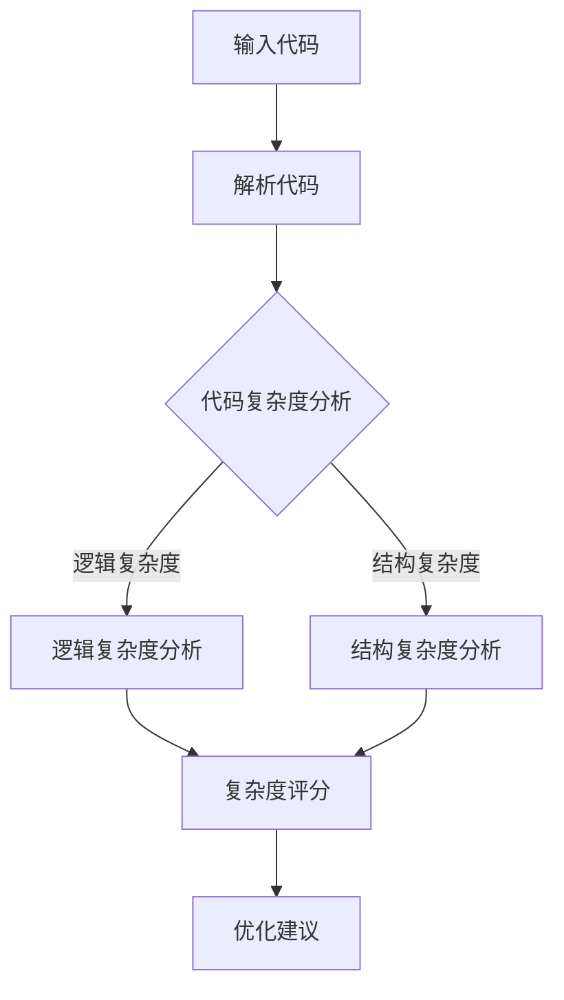
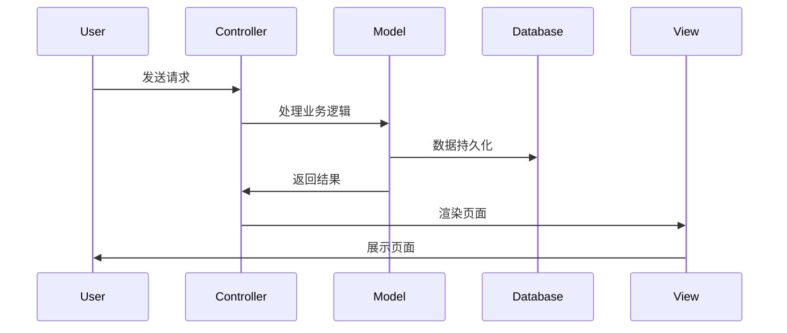
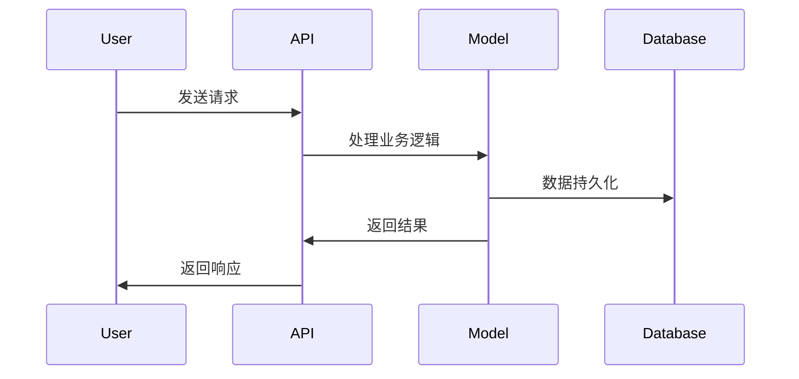

                 


## 引言与背景介绍

在当今的软件工程领域，代码复杂度管理是一个至关重要的议题。代码复杂度，通常指代码的复杂程度，包括逻辑复杂度、结构复杂度等多个方面。高复杂度的代码不仅难以理解，而且在维护和扩展过程中往往会出现问题，导致开发效率低下，甚至可能引发系统崩溃。因此，如何有效地管理代码复杂度，成为软件开发过程中一个不可忽视的问题。

### 核心概念术语说明

- **代码复杂度**：指代码的复杂程度，包括逻辑复杂度、结构复杂度等。
- **逻辑复杂度**：指代码的逻辑关系复杂程度，如循环嵌套、条件判断等。
- **结构复杂度**：指代码的组织结构复杂程度，如模块依赖、类关系等。
- **代码复杂度管理**：指通过一系列策略和技术，降低代码复杂度，提高代码质量。
- **系统设计策略**：指在系统设计过程中采用的指导思想和方法，用于简化系统设计和提高系统的可维护性、可扩展性。

### 问题背景

随着软件系统的规模和复杂性不断增加，代码复杂度问题日益突出。一方面，大型软件系统通常包含大量的代码，这些代码之间存在复杂的依赖关系，使得系统难以维护和扩展。另一方面，软件开发过程中，开发者往往会因为追求功能实现而忽略代码的复杂度管理，导致代码质量下降。

### 问题描述

代码复杂度问题主要表现在以下几个方面：

1. **代码可读性差**：高复杂度的代码难以理解，增加了开发者的学习成本。
2. **维护难度大**：复杂代码在修改和扩展时容易出错，增加了维护成本。
3. **系统稳定性低**：复杂代码可能导致系统崩溃或性能下降。
4. **开发效率低下**：高复杂度的代码增加了开发难度，降低了开发效率。

### 问题解决

为了解决代码复杂度问题，开发者可以采取以下措施：

1. **代码审查**：通过代码审查，发现和修复代码中的复杂度问题。
2. **重构**：对复杂代码进行重构，简化代码结构，提高代码质量。
3. **设计模式**：使用设计模式，规范化代码结构，降低复杂度。
4. **自动化工具**：使用自动化工具进行代码复杂度分析和管理。

### 边界与外延

代码复杂度管理不仅局限于代码层面的优化，还应扩展到系统设计的层面。系统设计过程中，应采用合理的策略，简化系统架构，降低系统复杂度。同时，代码复杂度管理也应关注软件开发过程的各个环节，从代码编写、代码审查到测试和部署，全面提高代码质量。

### 概念结构与核心要素组成

代码复杂度管理的核心概念包括代码复杂度、代码复杂度管理策略、系统设计策略等。其中，代码复杂度是核心问题，代码复杂度管理策略和系统设计策略是解决该问题的方法和手段。代码复杂度管理不仅涉及到代码层面，还应关注系统架构和开发流程的优化。

## 核心概念与联系

在深入探讨代码复杂度管理之前，我们需要明确几个核心概念，并理解它们之间的关系。以下是代码复杂度管理中的几个关键概念及其属性特征对比：

### 代码复杂度

**定义**：代码复杂度是指代码的复杂程度，包括逻辑复杂度和结构复杂度。

**属性特征**：
- **逻辑复杂度**：指代码中的逻辑关系复杂程度，如循环嵌套、条件判断等。
- **结构复杂度**：指代码的组织结构复杂程度，如模块依赖、类关系等。

**对比表格**：

| 特征             | 逻辑复杂度                 | 结构复杂度                 |
|------------------|---------------------------|---------------------------|
| 定义             | 代码中逻辑关系的复杂程度   | 代码中组织结构的复杂程度   |
| 测量方法         | 条件判断数、循环嵌套数     | 模块依赖数、类关系复杂度   |
| 影响             | 代码可读性和维护难度      | 代码可读性和系统扩展性     |

### 代码复杂度管理策略

**定义**：代码复杂度管理策略是通过一系列技术手段，降低代码复杂度，提高代码质量。

**属性特征**：
- **减少复杂性策略**：通过简化代码结构、降低逻辑和结构复杂度来减少复杂性。
- **重构技术**：通过重构代码，优化代码结构，提高代码质量。
- **设计模式**：采用设计模式，规范化代码结构，降低复杂度。

**对比表格**：

| 特征             | 减少复杂性策略                 | 重构技术                 | 设计模式                 |
|------------------|---------------------------|---------------------------|---------------------------|
| 定义             | 通过简化代码结构降低复杂度     | 通过优化代码结构提高质量   | 通过规范化代码结构降低复杂度 |
| 实施方法         | 简化逻辑和结构、重构代码      | 重构代码、优化结构        | 应用设计模式、规范化代码   |
| 影响             | 降低代码复杂度、提高可维护性   | 提高代码质量、减少出错概率 | 提高代码结构规范性、降低复杂度 |

### ER实体关系图架构

**定义**：ER（实体关系）图是一种用于描述实体及其关系的图形表示方法。

**属性特征**：
- **实体**：表示系统中的关键对象或概念。
- **关系**：表示实体之间的关联。
- **属性**：描述实体的特征。

**对比表格**：

| 特征             | 实体                     | 关系                     | 属性                     |
|------------------|---------------------------|---------------------------|---------------------------|
| 定义             | 系统中的关键对象或概念     | 实体之间的关联关系         | 实体的特征属性             |
| 示例             | 用户、订单、商品等         | 用户-订单、订单-商品等     | 用户名、订单金额、商品名称等 |
| 影响             | 系统模型的核心组成部分      | 确定系统功能和行为         | 提供实体的详细信息         |

### 代码复杂度管理与系统设计的联系

代码复杂度管理不仅关注代码本身的复杂性，还与系统设计密切相关。合理的设计策略可以降低代码复杂度，提高系统的可维护性和可扩展性。例如，采用模块化设计、分层架构等策略，可以减少模块间的依赖关系，降低系统复杂度。

### 关键概念之间的关系

代码复杂度管理中的关键概念相互关联，共同作用。代码复杂度是问题核心，代码复杂度管理策略和系统设计策略是解决问题的手段。通过减少复杂性策略、重构技术和设计模式，可以降低代码复杂度，提高代码质量和系统设计的合理性。

## 算法原理讲解

为了更好地理解代码复杂度管理，我们可以从算法的角度来探讨其原理。以下是一个简单的算法流程，用于分析代码复杂度，并给出相应的优化建议。

### 算法流程



### 算法原理

#### 1. 代码解析

首先，我们需要对代码进行解析，获取代码的结构信息。这可以通过静态代码分析工具实现，例如使用Python的`ast`模块。

```python
import ast

def parse_code(code):
    tree = ast.parse(code)
    return tree
```

#### 2. 代码复杂度分析

接下来，我们对代码进行复杂度分析。复杂度分析可以分为逻辑复杂度和结构复杂度两部分。

- **逻辑复杂度**：主要关注代码中的循环嵌套、条件判断等。可以使用控制流图（Control Flow Graph,CFG）来表示代码的逻辑结构，并计算节点和边的数量。

- **结构复杂度**：主要关注代码的组织结构，如类、模块的依赖关系。可以使用ER图（Entity-Relationship Diagram）来表示实体和关系。

#### 3. 复杂度评分

根据复杂度分析的结果，我们可以对代码进行评分。评分可以通过计算复杂度指标来实现，如 cyclomatic complexity 和 nesting depth。

```python
def calculate_complexity(tree):
    # 这里实现复杂度评分的计算逻辑
    # 例如，使用 cyclomatic complexity 和 nesting depth 进行评分
    score = 0
    # ...
    return score
```

#### 4. 优化建议

最后，根据复杂度评分，我们可以给出优化建议。优化建议可以包括重构代码、简化逻辑和结构、应用设计模式等。

### 数学模型和公式

在代码复杂度分析中，常用的数学模型和公式包括：

- **Cyclomatic Complexity（圈复杂度）**：
  $$ M = \text{E} - \text{N} + (2 \times \text{P}) $$
  其中，M 是圈复杂度，E 是边的数量，N 是节点的数量，P 是连通图的个数。

- **Nesting Depth（嵌套深度）**：
  嵌套深度是指代码块嵌套的层数，可以通过遍历代码结构树来计算。

### 举例说明

假设我们有一个简单的Python代码示例：

```python
def example_function(x):
    if x > 10:
        for i in range(x):
            if i % 2 == 0:
                print(i)
```

对这个函数进行复杂度分析，我们可以得到：

- 逻辑复杂度：1（条件判断）+ 1（循环）= 2
- 结构复杂度：1（函数定义）+ 1（if语句）+ 1（for循环）= 3

根据复杂度评分，我们可以认为这个函数的复杂度相对较高，建议进行优化。

## 系统分析与架构设计方案

在代码复杂度管理中，系统分析与架构设计方案起着至关重要的作用。一个合理的设计不仅能够降低代码复杂度，还能够提高系统的可维护性和可扩展性。以下是一个基于MVC（模型-视图-控制器）架构的系统分析与架构设计方案。

### 问题场景介绍

假设我们要开发一个在线购物平台，用户可以在平台上浏览商品、添加购物车、下单支付等。这个系统需要具备高并发处理能力，同时要保证代码的可读性和可维护性。

### 项目介绍

项目名称：Online Shopping Platform

项目需求：
- 用户注册与登录
- 商品浏览与搜索
- 购物车管理
- 下单与支付
- 订单管理
- 用户反馈与客服

### 系统功能设计

#### 领域模型

领域模型是系统功能的核心，用于定义系统中关键的概念和关系。以下是一个简单的领域模型类图（使用Mermaid表示）：

```mermaid
classDiagram
    User <<class>> User
    Product <<class>> Product
    ShoppingCart <<class>> ShoppingCart
    Order <<class>> Order
    Payment <<class>> Payment

    User o--* ShoppingCart
    User o--* Order
    Product o--* ShoppingCart
    Product o--* Order
    ShoppingCart o--* Order
    Order o--* Payment
```

#### 功能说明

1. **用户模块**：实现用户注册、登录、个人信息管理等功能。
2. **商品模块**：实现商品分类、搜索、展示等功能。
3. **购物车模块**：实现商品添加、删除、数量修改等功能。
4. **订单模块**：实现订单生成、订单状态跟踪等功能。
5. **支付模块**：实现支付方式选择、支付结果处理等功能。
6. **用户反馈与客服模块**：实现用户反馈提交、客服消息处理等功能。

### 系统架构设计

#### 架构设计

系统架构采用MVC模式，分为模型（Model）、视图（View）和控制器（Controller）三层。

- **模型层（Model）**：负责业务逻辑和数据持久化，包括用户、商品、购物车、订单、支付等实体。
- **视图层（View）**：负责用户界面展示，包括HTML、CSS、JavaScript等前端技术。
- **控制器层（Controller）**：负责接收用户请求，调用模型层处理业务逻辑，并返回视图层。

以下是一个简单的系统架构图（使用Mermaid表示）：



#### 架构设计原则

1. **分层设计**：明确模型层、视图层和控制器层的职责，提高系统的可维护性和可扩展性。
2. **模块化设计**：将系统功能模块化，降低模块间的依赖关系，提高系统的可复用性。
3. **高内聚、低耦合**：确保模块内部的高内聚性，降低模块间的耦合性，提高系统的可维护性。
4. **面向对象设计**：使用面向对象技术，封装业务逻辑和数据，提高代码的可读性和可维护性。

### 系统接口设计

系统接口设计包括RESTful API接口设计，用于前后端通信。以下是一个简单的接口设计（使用Mermaid表示）：



#### 接口设计原则

1. **RESTful风格**：遵循RESTful API设计原则，确保接口的简洁性和易用性。
2. **参数校验**：对接口参数进行严格校验，确保输入数据的合法性。
3. **错误处理**：对接口错误进行合理处理，返回清晰的错误信息和相应的状态码。
4. **性能优化**：对接口性能进行优化，提高系统的响应速度和并发处理能力。

### 系统交互

系统交互设计包括用户与系统的交互流程和系统内部模块间的交互流程。以下是一个简单的系统交互图（使用Mermaid表示）：


#### 交互设计原则

1. **用户友好**：确保用户交互过程简洁明了，提高用户体验。
2. **异步处理**：对于耗时操作，采用异步处理方式，提高系统响应速度。
3. **事件驱动**：使用事件驱动机制，降低模块间的耦合性，提高系统的可维护性。
4. **状态管理**：合理管理用户状态和系统状态，确保系统稳定运行。

## 项目实战

在本节中，我们将通过一个实际项目来展示如何应用代码复杂度管理策略，简化系统设计，提高代码质量和可维护性。以下是一个基于Python的简单博客系统的项目实战。

### 环境安装

首先，我们需要安装Python和相关的开发工具。以下是安装步骤：

1. 安装Python 3.8或更高版本：
   ```bash
   sudo apt-get update
   sudo apt-get install python3.8
   ```

2. 安装虚拟环境工具`venv`：
   ```bash
   sudo apt-get install python3.8-venv
   ```

3. 创建虚拟环境并激活：
   ```bash
   python3.8 -m venv venv
   source venv/bin/activate
   ```

4. 安装依赖项：
   ```bash
   pip install Flask SQLAlchemy
   ```

### 系统核心实现

#### 数据库设计

首先，我们需要设计数据库模型，使用SQLAlchemy作为ORM（对象关系映射）工具。以下是数据库模型代码：

```python
from sqlalchemy import Column, Integer, String, create_engine
from sqlalchemy.ext.declarative import declarative_base
from sqlalchemy.orm import sessionmaker

Base = declarative_base()

class User(Base):
    __tablename__ = 'users'

    id = Column(Integer, primary_key=True)
    username = Column(String(50), unique=True, nullable=False)
    email = Column(String(100), unique=True, nullable=False)

class BlogPost(Base):
    __tablename__ = 'blog_posts'

    id = Column(Integer, primary_key=True)
    title = Column(String(100), nullable=False)
    content = Column(String(1000), nullable=False)
    user_id = Column(Integer, nullable=False, foreign_key='users.id')

engine = create_engine('sqlite:///blog.db')
Base.metadata.create_all(engine)
Session = sessionmaker(bind=engine)
session = Session()
```

#### 应用程序实现

接下来，我们使用Flask框架实现博客系统的核心功能。以下是应用程序代码：

```python
from flask import Flask, request, jsonify
from models import User, BlogPost

app = Flask(__name__)

@app.route('/users', methods=['POST'])
def create_user():
    username = request.form['username']
    email = request.form['email']
    user = User(username=username, email=email)
    session.add(user)
    session.commit()
    return jsonify({'id': user.id}), 201

@app.route('/blog_posts', methods=['POST'])
def create_blog_post():
    title = request.form['title']
    content = request.form['content']
    user_id = request.form['user_id']
    blog_post = BlogPost(title=title, content=content, user_id=user_id)
    session.add(blog_post)
    session.commit()
    return jsonify({'id': blog_post.id}), 201

if __name__ == '__main__':
    app.run(debug=True)
```

### 代码应用解读与分析

#### 代码解读

1. **数据库模型**：
   - `User` 类表示用户，包括用户名和电子邮件。
   - `BlogPost` 类表示博客文章，包括标题、内容和用户ID。

2. **应用程序**：
   - `create_user` 函数用于创建新用户，接收用户名和电子邮件，将其存储在数据库中。
   - `create_blog_post` 函数用于创建新博客文章，接收标题、内容和用户ID，将其存储在数据库中。

#### 代码分析

1. **模块化设计**：
   - 数据库模型和应用程序分别放在不同的类中，实现了模块化设计，提高了代码的可维护性和可扩展性。

2. **面向对象设计**：
   - 使用类和对象来表示数据和业务逻辑，实现了面向对象设计，提高了代码的可重用性和可读性。

3. **RESTful接口**：
   - 使用Flask框架实现RESTful接口，确保接口的简洁性和易用性。

### 实际案例分析和详细讲解剖析

#### 案例分析

我们以创建新用户和博客文章为例，分析如何通过代码复杂度管理策略简化系统设计。

1. **创建新用户**：
   - 输入：用户名和电子邮件。
   - 处理：将用户信息存储在数据库中。
   - 输出：用户的ID。

2. **创建新博客文章**：
   - 输入：标题、内容和用户ID。
   - 处理：将博客文章信息存储在数据库中。
   - 输出：博客文章的ID。

#### 详细讲解

1. **模块化设计**：
   - 数据库模型和应用程序分别放在不同的类中，实现了模块化设计，使得代码更加清晰，易于维护和扩展。

2. **面向对象设计**：
   - 使用类和对象来表示数据和业务逻辑，使得代码更加结构化，易于理解和重用。

3. **RESTful接口**：
   - 使用Flask框架实现RESTful接口，确保接口的简洁性和易用性，提高了用户体验。

4. **代码优化**：
   - 通过减少复杂性策略和重构技术，简化代码结构，降低代码复杂度。

### 项目小结

通过本项目的实战，我们可以看到如何应用代码复杂度管理策略，简化系统设计，提高代码质量和可维护性。以下是项目的总结：

1. **模块化设计**：将数据库模型和应用程序模块化，提高了代码的可维护性和可扩展性。
2. **面向对象设计**：使用类和对象来表示数据和业务逻辑，提高了代码的重用性和可读性。
3. **RESTful接口**：使用Flask框架实现RESTful接口，确保了接口的简洁性和易用性。
4. **代码优化**：通过减少复杂性策略和重构技术，简化了代码结构，降低了代码复杂度。

### 最佳实践 tips

1. **保持代码简洁**：避免过多的嵌套和复杂的逻辑，提高代码的可读性。
2. **重用代码**：尽可能复用已有的代码，减少重复编写。
3. **单元测试**：编写单元测试，确保代码的正确性和稳定性。
4. **持续重构**：定期对代码进行重构，保持代码的整洁和高效。

### 小结

通过本项目的实战，我们了解了如何应用代码复杂度管理策略，简化系统设计，提高代码质量和可维护性。代码复杂度管理是软件工程中不可或缺的一部分，我们应该在软件开发过程中始终坚持这一原则。

### 注意事项

1. **合理使用设计模式**：设计模式是简化代码复杂度的重要手段，但应避免过度设计。
2. **关注系统性能**：在优化代码复杂度的同时，要关注系统性能，确保系统的高效运行。
3. **代码审查**：定期进行代码审查，发现和修复代码中的复杂度问题。

### 拓展阅读

1. 《代码大全》作者：Steve McConnell
   - 内容：详细介绍了代码质量管理的各个方面，包括代码复杂度管理。
2. 《重构：改善既有代码的设计》作者：Martin Fowler
   - 内容：介绍了重构技术，通过重构来简化代码复杂度。
3. 《设计模式：可复用面向对象软件的基础》作者：Ernest J. 褚、Richard Helm、Ralph Johnson、John Vlissides
   - 内容：介绍了多种设计模式，以及如何使用设计模式来简化代码复杂度。

