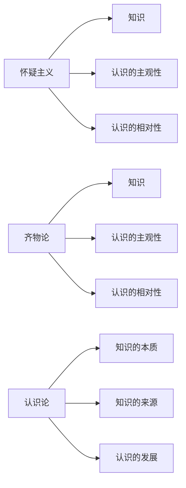

                 

### 《休谟与庄子：怀疑主义与齐物论的认识论比较》目录大纲设计

#### 目录大纲设计目的

本文将设计一个关于休谟与庄子怀疑主义与齐物论的认识论比较的目录大纲，旨在通过逻辑清晰、结构紧凑、简单易懂的技术语言，为读者提供一个完整、详细的阅读指南。目录大纲的设计将围绕以下几个关键步骤进行：

#### 第一步：确定书名和主题

书名定为《休谟与庄子：怀疑主义与齐物论的认识论比较》，主题聚焦于探讨两位哲学家在认识论上的观点及其异同。

#### 第二步：分析核心概念和章节内容

核心概念包括：怀疑主义、齐物论、认识论。章节内容将分为：
1. 背景介绍
2. 休谟的怀疑主义
3. 庄子的齐物论
4. 怀疑主义与齐物论的比较
5. 认识论的反思与拓展
6. 实际案例分析
7. 总结与展望

#### 第三步：设计每个章节的内容结构

1. **背景介绍**
   - **问题背景**：介绍认识论的重要性。
   - **问题描述**：阐述休谟与庄子的怀疑主义与齐物论。
   - **问题解决**：说明比较的目的和方法。
   - **边界与外延**：定义研究范围。
   - **概念结构与核心要素组成**：解析核心概念。

2. **休谟的怀疑主义**
   - **生平与哲学背景**：介绍休谟的生平和哲学思想。
   - **核心观点**：阐述休谟的怀疑主义。
   - **认识论中的应用**：探讨休谟的怀疑主义在认识论上的应用。

3. **庄子的齐物论**
   - **生平与哲学背景**：介绍庄子的生平和哲学思想。
   - **核心观点**：阐述庄子的齐物论。
   - **认识论中的应用**：探讨庄子的齐物论在认识论上的应用。

4. **怀疑主义与齐物论的比较**
   - **共同点**：分析两位哲学家观点的相似之处。
   - **不同点**：探讨他们的观点差异。
   - **哲学意义**：解释比较的哲学意义。

5. **认识论的反思与拓展**
   - **基本原理**：回顾认识论的基本原理。
   - **新发展**：探讨认识论的新趋势。
   - **现实生活应用**：分析认识论在现实生活中的应用。

6. **实际案例分析**
   - **案例一**：怀疑主义在科学研究中的应用。
   - **案例二**：齐物论在文学创作中的应用。
   - **案例三**：认识论在企业管理中的应用。

7. **总结与展望**
   - **总结**：回顾全文，总结主要观点。
   - **展望**：探讨未来研究方向。

#### 第四步：确定目录大纲的层级结构

- 第一级：主题
  - **第1章：背景介绍**
  - **第2章：休谟的怀疑主义**
  - **第3章：庄子的齐物论**
  - **第4章：怀疑主义与齐物论的比较**
  - **第5章：认识论的反思与拓展**
  - **第6章：实际案例分析**
  - **第7章：总结与展望**

- 第二级：章节内容
  - **第1章：背景介绍**
    - **1.1 问题背景**
    - **1.2 问题描述**
    - **1.3 问题解决**
    - **1.4 边界与外延**
    - **1.5 概念结构与核心要素组成**
  - **第2章：休谟的怀疑主义**
    - **2.1 休谟的生平与哲学背景**
    - **2.2 怀疑主义的核心观点**
    - **2.3 休谟的怀疑主义在认识论中的应用**
  - **第3章：庄子的齐物论**
    - **3.1 庄子的生平与哲学背景**
    - **3.2 齐物论的核心观点**
    - **3.3 齐物论在认识论中的应用**
  - **第4章：怀疑主义与齐物论的比较**
    - **4.1 怀疑主义与齐物论的共同点**
    - **4.2 怀疑主义与齐物论的不同点**
    - **4.3 比较的哲学意义**
  - **第5章：认识论的反思与拓展**
    - **5.1 认识论的基本原理**
    - **5.2 认识论的新发展**
    - **5.3 认识论在现实生活中的应用**
  - **第6章：实际案例分析**
    - **6.1 案例一：怀疑主义在科学研究中的应用**
    - **6.2 案例二：齐物论在文学创作中的应用**
    - **6.3 案例三：认识论在企业管理中的应用**
  - **第7章：总结与展望**
    - **7.1 总结**
    - **7.2 展望**

#### 第五步：检查目录大纲的完整性和逻辑性

确保每个章节的内容完整，逻辑清晰，能够帮助读者更好地理解休谟与庄子的认识论比较。

#### 第六步：优化目录大纲的简洁性

在保证内容完整性的前提下，简化目录大纲，去除多余的内容，使目录更加简洁明了。

#### 第七步：最终确定目录大纲

根据以上步骤，设计出最终的目录大纲，并确保目录大纲符合要求，包括简洁性、格式、层级结构和内容完整性。

---

# 《休谟与庄子：怀疑主义与齐物论的认识论比较》

> 关键词：休谟，庄子，怀疑主义，齐物论，认识论，比较研究

> 摘要：本文旨在探讨休谟的怀疑主义与庄子的齐物论在认识论领域的观点及其异同，通过分析两位哲学家的核心思想，揭示其在认识论中的地位和影响，旨在为哲学研究提供新的视角和思考。

## 第一部分：背景介绍

### 第1章：问题背景

#### 1.1 休谟的怀疑主义背景

#### 1.2 庄子的齐物论背景

#### 1.3 认识论在哲学中的地位

### 第2章：问题描述

#### 2.1 休谟的怀疑主义与认识论的关系

#### 2.2 庄子的齐物论与认识论的关系

#### 2.3 休谟与庄子的认识论比较的意义

### 第3章：问题解决

#### 3.1 研究方法

#### 3.2 研究框架

#### 3.3 研究步骤

### 第4章：边界与外延

#### 4.1 研究范围

#### 4.2 研究限制

#### 4.3 概念结构与核心要素组成

## 第二部分：核心概念与联系

### 第5章：休谟的怀疑主义

#### 5.1 生平与哲学背景

#### 5.2 怀疑主义的核心观点

#### 5.3 休谟的怀疑主义在认识论中的应用

### 第6章：庄子的齐物论

#### 6.1 生平与哲学背景

#### 6.2 齐物论的核心观点

#### 6.3 齐物论在认识论中的应用

## 第三部分：比较分析

### 第7章：怀疑主义与齐物论的比较

#### 7.1 共同点

#### 7.2 不同点

#### 7.3 比较的哲学意义

### 第8章：认识论的反思与拓展

#### 8.1 认识论的基本原理

#### 8.2 认识论的新发展

#### 8.3 认识论在现实生活中的应用

## 第四部分：实际案例分析

### 第9章：怀疑主义在科学研究中的应用

#### 9.1 案例背景

#### 9.2 案例分析

#### 9.3 案例启示

### 第10章：齐物论在文学创作中的应用

#### 10.1 案例背景

#### 10.2 案例分析

#### 10.3 案例启示

### 第11章：认识论在企业管理中的应用

#### 11.1 案例背景

#### 11.2 案例分析

#### 11.3 案例启示

## 第五部分：总结与展望

### 第12章：总结

#### 12.1 主要发现

#### 12.2 研究贡献

### 第13章：展望

#### 13.1 未来研究方向

#### 13.2 研究意义

## 参考文献

### 附录

### 后记

---

### 1.1 休谟的怀疑主义背景

**大卫·休谟（David Hume，1711-1776）**，苏格兰哲学家、历史学家、经济学家，西方哲学史上的重要人物。他的哲学思想对后来西方哲学的发展产生了深远的影响，尤其是他在认识论领域的贡献。休谟的怀疑主义哲学思想主要表现在他对知识来源、知识性质以及真理问题的深刻探讨。

**怀疑主义**，在哲学上指的是对知识的怀疑态度，认为我们对世界的知识是有限的，甚至可能是错误的。休谟的怀疑主义源于他对人类理性的深入反思。他认为，理性本身并不能为我们提供确凿的知识，我们的知识主要来源于经验，而经验又常常受到感官和情感的干扰，这使得我们对世界的认识充满了不确定性。

休谟的怀疑主义哲学思想的核心观点包括：

1. **知识来源于经验**：休谟认为，知识是通过感官经验获得的，而不是通过理性推理。他认为，理性只是经验的整理者和解释者，而不是知识的来源。
2. **情感与理性**：休谟区分了理性和情感的作用。他认为，理性可以识别和整理经验，但情感才是我们行动的驱动力。理性不能决定我们的行为，情感才能。
3. **不可知论**：休谟认为，我们无法获得关于外部世界的确切知识，因为我们的感官经验只是对外部世界的近似描述。他提出了著名的“刺激-反应”理论，认为我们对外部世界的认识只是对刺激的反应，而不是对事物的真实认识。

休谟的怀疑主义哲学思想在认识论领域具有重要地位。他的观点挑战了传统的知识论，促使人们更加关注知识的可靠性和限度。他的思想对后来的哲学流派，如实用主义、实证主义等，产生了深远的影响。

### 1.2 庄子的齐物论背景

**庄子（约公元前369年-前286年）**，名周，战国时期道家学派代表人物之一，与老子并称为“老庄”。他的哲学思想以自然无为、逍遥自由为核心，对中国传统文化产生了深远的影响。

**齐物论**，是庄子哲学思想的重要组成部分，出自《庄子·内篇》。齐物论的核心观点是“万物皆平等”，主张一切事物都是相对的，没有绝对的区分和本质。

**齐物论**的主要观点包括：

1. **万物平等**：庄子认为，万物在本质上都是平等的，没有高低贵贱之分。这种平等是宇宙自然的本质，是道的体现。
2. **相对主义**：庄子主张，一切事物的存在都是相对的，没有绝对的真理。他认为，真理是多元的，不同的观点都有其合理性。
3. **逍遥自由**：庄子强调，人们应该追求逍遥自在的生活，不受外界束缚。他认为，人应该顺应自然，摆脱功利心，实现内心的自由。

庄子的齐物论在认识论领域具有重要地位。他的观点挑战了传统的认识论观念，强调认识的相对性和主观性，对后来的哲学思想产生了深远的影响。庄子的思想在道家、佛家等学派中得到了广泛的传承和发展。

### 1.3 认识论在哲学中的地位

**认识论**，是哲学中的一个重要分支，研究知识的本质、起源、发展和限度。认识论关注的是人类如何获得知识、知识的性质、知识的可靠性以及知识的作用等问题。

在哲学中，认识论具有重要的地位，主要体现在以下几个方面：

1. **基础性**：认识论是哲学研究的基石。哲学的其他分支，如伦理学、美学、政治哲学等，都需要基于对知识的认识和理解。
2. **指导性**：认识论为其他哲学分支提供方法论指导。例如，伦理学需要基于对知识的认识来确定道德标准；美学需要基于对知识的认识来理解美的本质；政治哲学需要基于对知识的认识来探讨政治体制的合理性。
3. **反思性**：认识论通过对知识的反思，帮助我们认识到知识的局限性和潜在的错误。这种反思有助于我们更加客观、理性地看待世界，避免盲目相信和追求绝对真理。

认识论的发展经历了多个阶段，从古代的朴素认识论到现代的实证认识论、批判认识论等。不同的认识论流派提出了各自的观点和方法，丰富了哲学的研究内容。

### 1.4 休谟的怀疑主义与庄子的齐物论在认识论中的关系

**休谟的怀疑主义与庄子的齐物论**，虽然在表述和哲学体系上有所不同，但它们在认识论领域有着一些共同点。这些共同点主要表现在对知识的怀疑、认识的相对性和主观性等方面。

1. **对知识的怀疑**：休谟和庄子都认为，我们对世界的认识是有限的，甚至是错误的。休谟通过经验主义和不可知论来质疑外部世界的确定性，庄子则通过齐物论来否定绝对真理的存在。
2. **认识的相对性**：休谟和庄子都主张，认识是相对的，没有绝对的真理。休谟认为，我们的知识来源于经验，但经验受到感官和情感的干扰，这使得我们的认识具有相对性。庄子则通过“万物皆平等”的观点，强调一切事物的存在都是相对的，没有绝对的区分和本质。
3. **主观性**：休谟和庄子都强调认识的主观性。休谟认为，我们的感官经验只是对外部世界的近似描述，而不是真实的外部世界。庄子则认为，人的认识是主观的，每个人的观点和认识都是独特的。

尽管休谟和庄子的怀疑主义和齐物论在认识论上有这些共同点，但它们在哲学体系和方法上有所不同。休谟的怀疑主义主要基于经验主义，强调经验在知识形成中的作用；而庄子的齐物论则更注重超越理性和经验，追求一种更高层次的逍遥自由。

### 1.5 休谟与庄子的认识论比较的意义

**休谟与庄子的认识论比较**，具有重要的理论和实践意义。

1. **理论意义**：通过比较休谟和庄子的认识论观点，我们可以深入理解两种不同的认识论体系，揭示它们在哲学上的异同。这种比较有助于丰富认识论的研究内容，拓展认识论的理论视野。
2. **实践意义**：在现实生活中，休谟的怀疑主义和庄子的齐物论都可以为我们提供有益的指导。休谟的怀疑主义提醒我们，对待知识和真理应该保持怀疑和批判的态度，不要盲目接受未经证实的观点。庄子的齐物论则鼓励我们超越功利心，追求内心的自由和逍遥。这两种认识论观点都可以帮助我们在面对复杂多变的世界时，保持理性和冷静。

### 1.6 研究方法

**本研究将采用比较分析的方法**，通过对比休谟和庄子的认识论观点，揭示它们在哲学上的异同。具体方法包括：

1. **文献综述**：对休谟和庄子的相关文献进行系统梳理，全面了解他们的认识论观点。
2. **案例研究**：通过具体案例，分析休谟的怀疑主义和庄子的齐物论在现实生活中的应用。
3. **逻辑推理**：运用逻辑推理，对比休谟和庄子的认识论观点，揭示它们之间的联系和差异。

### 1.7 研究框架

**本研究的研究框架如下**：

1. **背景介绍**：介绍休谟和庄子的认识论背景，阐述本研究的问题和意义。
2. **核心概念**：定义和解释休谟的怀疑主义和庄子的齐物论的核心概念。
3. **比较分析**：对比休谟和庄子的认识论观点，揭示它们的异同。
4. **实际案例**：分析休谟的怀疑主义和庄子的齐物论在现实生活中的应用。
5. **总结与展望**：总结本研究的主要发现，展望未来研究方向。

### 1.8 研究步骤

**本研究的研究步骤如下**：

1. **文献收集与整理**：收集和整理与休谟和庄子的认识论相关的文献，为研究提供理论基础。
2. **概念分析**：对休谟的怀疑主义和庄子的齐物论进行概念分析，明确它们的核心观点。
3. **比较研究**：对比休谟和庄子的认识论观点，分析它们之间的异同。
4. **案例分析**：选择具体案例，分析休谟的怀疑主义和庄子的齐物论在现实生活中的应用。
5. **总结与展望**：总结本研究的主要发现，提出未来研究方向。

### 1.9 边界与外延

**本研究将在以下边界和范围内进行**：

1. **时间边界**：主要研究休谟和庄子在认识论领域的观点，不涉及他们的其他哲学思想。
2. **空间边界**：主要关注西方哲学和中国哲学中关于认识论的观点，不涉及其他文化背景的认识论问题。
3. **概念边界**：明确休谟的怀疑主义和庄子的齐物论的核心概念，不涉及其他认识论问题。
4. **研究范围**：主要对比休谟和庄子的认识论观点，不涉及其他哲学家的认识论观点。

### 1.10 概念结构与核心要素组成

**本研究的核心概念结构如下**：

1. **休谟的怀疑主义**
   - **核心观点**：知识来源于经验，理性不能决定行为，情感是行动的驱动力。
   - **要素组成**：经验主义，不可知论，情感与理性的关系。

2. **庄子的齐物论**
   - **核心观点**：万物平等，相对主义，逍遥自由。
   - **要素组成**：万物平等，相对主义，自然无为。

3. **认识论**
   - **核心观点**：知识来源、知识性质、知识限度。
   - **要素组成**：知识来源，知识性质，知识限度。

通过以上核心概念和要素组成的分析，我们可以更好地理解休谟和庄子的认识论观点，为后续的比较分析打下基础。

### 2.1 休谟的怀疑主义

#### 2.1.1 生平与哲学背景

大卫·休谟（David Hume，1711-1776）是18世纪苏格兰启蒙思想家、历史学家和哲学家。他出生于苏格兰爱丁堡，自幼聪慧，喜欢阅读哲学和科学书籍。1734年，休谟进入爱丁堡大学学习法律，但后来对法律失去了兴趣，转而投身哲学和文学。

休谟的哲学思想深受英国经验主义和法国启蒙思想的影响。他主张通过观察和经验来获得知识，反对纯粹理性主义。他的主要著作包括《人性论》、《道德原理研究》、《人类理解研究》等，这些著作对西方哲学产生了深远的影响。

#### 2.1.2 怀疑主义的核心观点

休谟的怀疑主义哲学思想主要体现在他对知识来源、知识性质以及真理问题的深刻探讨。他的核心观点包括：

1. **知识来源于经验**：休谟认为，知识是通过感官经验获得的，而不是通过理性推理。他认为，理性只是经验的整理者和解释者，而不是知识的来源。

2. **情感与理性**：休谟区分了理性和情感的作用。他认为，理性可以识别和整理经验，但情感才是我们行动的驱动力。理性不能决定我们的行为，情感才能。

3. **不可知论**：休谟认为，我们无法获得关于外部世界的确切知识，因为我们的感官经验只是对外部世界的近似描述。他提出了著名的“刺激-反应”理论，认为我们对外部世界的认识只是对刺激的反应，而不是对事物的真实认识。

4. **道德怀疑主义**：休谟认为，道德判断并非基于理性，而是基于情感。他认为，道德价值来源于人类的情感，而非理性。

#### 2.1.3 休谟的怀疑主义在认识论中的应用

休谟的怀疑主义在认识论领域具有重要地位。他的思想对认识论的发展产生了深远的影响。

1. **对传统认识论的挑战**：休谟的怀疑主义挑战了传统的认识论观念。他认为，理性不能为我们提供确凿的知识，我们的知识主要来源于经验，但经验又受到感官和情感的干扰。这种观点使人们对知识的可靠性产生了怀疑。

2. **经验主义的发展**：休谟的怀疑主义推动了经验主义的发展。他强调经验在知识形成中的作用，使人们更加关注感官经验在认识中的地位。

3. **认识论的深化**：休谟的怀疑主义促使人们深入探讨知识的本质、来源和限度。他的思想为认识论的研究提供了新的视角和方法。

#### 2.1.4 休谟的怀疑主义对现代哲学的影响

休谟的怀疑主义对现代哲学产生了深远的影响。他的思想在以下方面具有启示意义：

1. **批判理性主义**：休谟的怀疑主义批判了理性主义的绝对化和教条化。他认为，理性并非万能，我们不能完全依赖理性来认识世界。

2. **重视经验与情感**：休谟的怀疑主义强调经验在知识形成中的重要性，同时也重视情感在人类行为中的作用。这种观点为现代心理学和社会科学的发展提供了理论基础。

3. **哲学研究方法的变革**：休谟的怀疑主义促使哲学家们更加关注认识论的深化和研究方法的变革。他的思想推动了哲学研究从纯粹理性探讨向实证研究的转变。

#### 2.1.5 休谟的怀疑主义与庄子齐物论的异同

休谟的怀疑主义与庄子的齐物论在认识论上有一些共同点，但它们在哲学体系和方法上有所不同。

1. **共同点**：
   - **对知识的怀疑**：休谟和庄子都认为，我们对世界的认识是有限的，甚至是错误的。他们主张，知识应该通过经验来验证，而非单纯依赖理性。
   - **相对主义**：休谟和庄子都强调认识的相对性和主观性。他们认为，真理是多元的，不同的观点都有其合理性。

2. **不同点**：
   - **经验主义与自然主义**：休谟的怀疑主义基于经验主义，强调经验在知识形成中的作用。而庄子的齐物论则更注重超越理性和经验，追求一种更高层次的逍遥自由。
   - **情感与理性**：休谟认为，情感是人类行为的主要驱动力，而庄子则主张超越情感和理性，追求内心的自由和宁静。
   - **认识论的应用**：休谟的怀疑主义主要应用于认识论领域，挑战了传统的知识论观念。而庄子的齐物论则更多体现在其哲学体系和人生观中，强调人与自然的和谐共生。

### 2.2 庄子的齐物论

#### 2.2.1 生平与哲学背景

庄子（约公元前369年-前286年），名周，战国时期道家学派代表人物之一，与老子并称为“老庄”。他出生于宋国蒙地（今河南省商丘市），曾担任过漆园吏，后来隐居山林，致力于哲学思考和教育。

庄子的哲学思想以自然无为、逍遥自由为核心，主张人与自然的和谐共生。他的主要著作包括《庄子》一书，其中《内篇》七篇被认为是庄子的原创作品，代表了其哲学思想的精髓。

#### 2.2.2 齐物论的核心观点

庄子的齐物论是《庄子》一书中的重要篇目，主张“万物皆平等”，否定一切事物的绝对性和本质。齐物论的核心观点包括：

1. **万物平等**：庄子认为，万物在本质上都是平等的，没有高低贵贱之分。这种平等是宇宙自然的本质，是道的体现。

2. **相对主义**：庄子主张，一切事物的存在都是相对的，没有绝对的真理。他认为，真理是多元的，不同的观点都有其合理性。

3. **逍遥自由**：庄子强调，人们应该追求逍遥自在的生活，不受外界束缚。他认为，人应该顺应自然，摆脱功利心，实现内心的自由。

#### 2.2.3 齐物论在认识论中的应用

庄子的齐物论在认识论领域具有重要地位。他的观点挑战了传统的认识论观念，强调认识的相对性和主观性，对后来的哲学思想产生了深远的影响。

1. **对传统认识论的挑战**：庄子的齐物论否定一切事物的绝对性和本质，认为我们无法获得关于世界的确切知识。这种观点挑战了传统认识论关于真理和知识的观念。

2. **认识的相对性**：庄子主张，认识是相对的，没有绝对的真理。他认为，真理是多元的，不同的观点都有其合理性。这种观点强调了认识的相对性和主观性。

3. **认识的主观性**：庄子认为，人的认识是主观的，每个人的观点和认识都是独特的。他主张，人们应该超越主观偏见，追求内心的自由和真实。

#### 2.2.4 庄子的齐物论对现代哲学的影响

庄子的齐物论对现代哲学产生了深远的影响。他的思想在以下方面具有启示意义：

1. **批判理性主义**：庄子的齐物论批判了理性主义的绝对化和教条化。他认为，理性并非万能，我们不能完全依赖理性来认识世界。

2. **重视经验与情感**：庄子的齐物论强调经验在知识形成中的重要性，同时也重视情感在人类行为中的作用。这种观点为现代心理学和社会科学的发展提供了理论基础。

3. **哲学研究方法的变革**：庄子的齐物论促使哲学家们更加关注认识论的深化和研究方法的变革。他的思想推动了哲学研究从纯粹理性探讨向实证研究的转变。

#### 2.2.5 庄子的齐物论与休谟怀疑主义的异同

庄子的齐物论与休谟的怀疑主义在认识论上有一些共同点，但它们在哲学体系和方法上有所不同。

1. **共同点**：
   - **对知识的怀疑**：庄子与休谟都认为，我们对世界的认识是有限的，甚至是错误的。他们都主张，知识应该通过经验来验证，而非单纯依赖理性。
   - **相对主义**：庄子与休谟都强调认识的相对性和主观性。他们认为，真理是多元的，不同的观点都有其合理性。

2. **不同点**：
   - **经验主义与自然主义**：休谟的怀疑主义基于经验主义，强调经验在知识形成中的作用。而庄子的齐物论则更注重超越理性和经验，追求一种更高层次的逍遥自由。
   - **情感与理性**：休谟认为，情感是人类行为的主要驱动力，而庄子则主张超越情感和理性，追求内心的自由和宁静。
   - **认识论的应用**：休谟的怀疑主义主要应用于认识论领域，挑战了传统的知识论观念。而庄子的齐物论则更多体现在其哲学体系和人生观中，强调人与自然的和谐共生。

### 3.1 休谟的怀疑主义与庄子的齐物论的共同点

在认识论领域，休谟的怀疑主义和庄子的齐物论虽然来自不同的文化背景和哲学体系，但它们在以下几个方面有着显著的共同点：

#### 3.1.1 对知识的怀疑

首先，休谟和庄子都持有对知识的怀疑态度。休谟认为，我们的知识主要来源于经验，但经验受到感官和情感的干扰，这使得我们对世界的认识充满了不确定性。他通过“刺激-反应”理论指出，我们对外部世界的认识只是对刺激的反应，而非对事物的真实认识。庄子则通过齐物论否定了绝对真理的存在，他认为一切事物都是相对的，没有本质上的区分和本质。

#### 3.1.2 认识的相对性

其次，休谟和庄子都强调认识的相对性。休谟认为，我们的知识是相对的，没有绝对的真理。他认为，理性可以识别和整理经验，但理性本身并不能提供确凿的知识。庄子也主张，一切事物的存在都是相对的，没有绝对的区分和本质。他提出了“万物皆平等”的观点，认为不同的观点都有其合理性。

#### 3.1.3 主观性

第三，休谟和庄子都认为，认识具有主观性。休谟认为，我们的感官经验只是对外部世界的近似描述，而不是真实的外部世界。庄子则认为，人的认识是主观的，每个人的观点和认识都是独特的。他主张，人们应该超越主观偏见，追求内心的自由和真实。

#### 3.1.4 反对绝对主义

最后，休谟和庄子都反对绝对主义。休谟通过怀疑主义挑战了传统的知识论观念，认为理性不能为我们提供确凿的知识。庄子则通过齐物论否定了一切事物的绝对性和本质，他认为真理是多元的，不同的观点都有其合理性。

综上所述，休谟的怀疑主义和庄子的齐物论在认识论上有着显著的共同点，它们都强调对知识的怀疑、认识的相对性、主观性以及反对绝对主义。这些共同点使它们在认识论领域产生了深远的影响，为后来的哲学研究提供了新的视角和思考。

### 3.2 休谟的怀疑主义与庄子的齐物论的不同点

尽管休谟的怀疑主义和庄子的齐物论在认识论上有着显著的共同点，但它们在哲学体系、方法论和实际应用上仍然存在一些不同点。

#### 3.2.1 哲学体系和方法

首先，在哲学体系和方法上，休谟的怀疑主义基于经验主义，强调经验在知识形成中的作用。他认为，理性只是经验的整理者和解释者，而不是知识的来源。休谟的观点强调了经验的可靠性和重要性，但也带来了对理性作用的质疑。

相比之下，庄子的齐物论更注重超越理性和经验，追求一种更高层次的逍遥自由。他认为，万物平等，没有本质上的区分和本质。庄子的哲学体系强调自然无为、顺应自然，追求内心的自由和宁静。

#### 3.2.2 情感与理性

其次，在情感与理性的关系上，休谟认为情感是人类行为的主要驱动力，而理性只是识别和整理经验的工具。他认为，理性不能决定我们的行为，情感才是行动的驱动力。这种观点强调了情感在人类行为中的重要性。

而庄子则主张超越情感和理性，追求内心的自由和宁静。他认为，人们应该摆脱功利心和情感束缚，实现内心的逍遥自在。庄子的观点强调了内在精神世界的纯净和自由。

#### 3.2.3 认识的来源和性质

第三，在认识的来源和性质上，休谟认为知识来源于经验，但经验受到感官和情感的干扰，这使得我们对世界的认识充满了不确定性。他提出了“刺激-反应”理论，认为我们对外部世界的认识只是对刺激的反应，而非对事物的真实认识。

相比之下，庄子认为，我们的认识是相对的，没有绝对的真理。他主张，一切事物的存在都是相对的，没有本质上的区分和本质。庄子的观点否定了绝对真理的存在，强调了认识的多元性和主观性。

#### 3.2.4 实际应用

最后，在实际应用上，休谟的怀疑主义更多地体现在认识论领域，挑战了传统的知识论观念。他的观点促使人们更加关注知识的可靠性和限度，为现代科学方法论的发展提供了理论基础。

而庄子的齐物论则更多体现在其哲学体系和人生观中，强调人与自然的和谐共生。他的观点为人们提供了一种超越功利心和情感束缚的生活哲学，帮助人们实现内心的自由和宁静。

综上所述，休谟的怀疑主义和庄子的齐物论在哲学体系、方法论、情感与理性的关系、认识的来源和性质以及实际应用等方面存在一些不同点。这些不同点反映了它们在认识论上的独特贡献和影响，也为哲学研究提供了丰富的思想资源。

### 4.1 认识论的基本原理

**认识论**，是哲学中的一个重要分支，研究知识的本质、起源、发展和限度。认识论的基本原理包括以下几个方面：

#### 4.1.1 知识的本质

知识通常被认为是对现实世界的准确、可靠的理解和描述。认识论探讨的是知识的本质和性质。知识可以从多个角度来定义，如事实性知识、技能性知识和价值性知识等。

#### 4.1.2 知识的来源

知识的来源是一个长期争议的话题。传统的知识论认为，知识来源于感知、推理和经验。现代认识论则提出了更多元的观点，如基于证据的理论、基于语境的理论等。

#### 4.1.3 知识的可靠性

认识论还探讨了知识的可靠性问题。知识的可靠性取决于多个因素，如感知的准确性、推理的合理性、经验的多样性等。认识论关注的是如何确保知识的真实性和有效性。

#### 4.1.4 知识的限度

知识的限度是认识论的一个重要议题。即使我们获取了某些知识，也可能存在未知的领域。认识论探讨的是我们如何认识这些限度，以及如何在这个限度内进行有效的思考。

### 4.2 认识论的新发展

**认识论**作为哲学的一个领域，随着时代的发展和学术研究的深入，不断有新的理论和方法出现。以下是一些认识论的新发展：

#### 4.2.1 实证主义

实证主义是一种强调经验验证的认识论观点。它主张，只有通过经验和观察得到证实的事实才能被认为是真实的。实证主义对科学方法论产生了深远的影响。

#### 4.2.2 批判理性主义

批判理性主义是康德提出的一种认识论观点。它强调理性在认识过程中的作用，同时认识到理性的局限性和限制。批判理性主义主张，我们应该批判地思考知识，同时认识到我们的认知能力有限。

#### 4.2.3 知识的社会构建理论

知识的社会构建理论认为，知识是在社会互动中构建和传播的。这一理论强调了社会因素在知识形成中的作用，如语言、文化、社会结构等。

#### 4.2.4 认识论的跨学科研究

随着学科的交叉和融合，认识论的研究也越来越跨学科。例如，认知科学、心理学、语言学等领域的研究成果被应用到认识论中，丰富了认识论的理论框架。

### 4.3 认识论在现实生活中的应用

**认识论**不仅是一个哲学研究领域，它也在现实生活中有广泛的应用。以下是一些认识论在现实生活中的具体应用：

#### 4.3.1 科学研究

认识论的基本原理和方法在科学研究中具有重要应用。科学家通过实证研究、理性推理和批判性思维来获取和验证知识。认识论帮助科学家理解知识的本质和局限性，从而更有效地进行科学研究。

#### 4.3.2 教育和教学

认识论在教育领域也有重要应用。教师通过认识论的方法来设计教学活动和课程内容，帮助学生理解知识的本质和获取方法。认识论还可以指导学生进行批判性思维和创造性思维，提高他们的学习效果。

#### 4.3.3 法律和司法

认识论在法律和司法领域也有应用。法官和律师需要基于事实和证据来做出判断和裁决。认识论帮助法律专业人士理解证据的性质和可靠性，确保司法公正。

#### 4.3.4 日常生活

在日常生活中，认识论也为我们提供了思考的工具。通过认识论的方法，我们可以更好地理解周围的世界，做出理性的决策。例如，当我们面临选择时，可以通过认识论的原则来评估不同选择的优点和局限性。

### 4.4 认识论的哲学意义

**认识论**在哲学中具有深远的意义，它不仅探讨了知识的本质和来源，还影响了哲学的其他领域。以下是认识论的哲学意义：

#### 4.4.1 对知识论的影响

认识论为知识论提供了理论基础。它帮助我们理解知识的性质、来源和可靠性，从而更好地理解人类如何认识世界。

#### 4.4.2 对形而上学的挑战

认识论挑战了形而上学的某些观点。例如，它质疑绝对真理的存在，强调认识的相对性和主观性。这种观点对形而上学的绝对主义提出了有力的反驳。

#### 4.4.3 对伦理学的贡献

认识论也为伦理学提供了理论支持。例如，道德怀疑主义和伦理相对论都是认识论在伦理学中的应用。通过认识论的方法，我们可以更好地理解道德原则和道德判断。

#### 4.4.4 对政治哲学的影响

认识论在政治哲学中也有重要作用。例如，政治哲学家通过认识论的观点来探讨政治权力的合法性、社会契约的理论基础等。

### 4.5 认识论的未来发展趋势

**认识论**在未来将继续发展，可能会出现以下一些趋势：

#### 4.5.1 跨学科研究

随着学科的交叉和融合，认识论将继续与其他领域结合，如认知科学、心理学、语言学等。这将丰富认识论的理论框架，提高其应用价值。

#### 4.5.2 认识论的实证研究

认识论的实证研究将得到进一步发展。通过实验和观察，我们可以更好地理解知识的形成和变化过程，从而为认识论提供更加坚实的证据。

#### 4.5.3 人工智能与认识论

人工智能的发展将对认识论产生深远影响。例如，人工智能在知识获取、推理和决策方面的应用将促使认识论重新审视知识的本质和认知过程。

#### 4.5.4 非西方认识论

随着全球化的推进，非西方认识论也将得到更多关注。不同文化背景下的认识论观点将为我们提供新的视角和思考，丰富认识论的理论体系。

### 4.6 案例分析

**案例一：怀疑主义在科学研究中的应用**

**案例背景**：在现代科学研究中，怀疑主义作为一种方法论原则得到了广泛应用。科学家在进行研究时，常常以怀疑的态度对待现有的理论和假设，通过实验和观察来验证或反驳这些理论和假设。

**案例分析**：例如，在物理学领域，爱因斯坦的相对论就是在对牛顿经典力学的怀疑中产生的。爱因斯坦通过实验和数学推理，提出了相对论，挑战了牛顿力学的绝对时空观念。相对论的提出不仅证实了怀疑主义的重要性，也推动了物理学的发展。

**案例启示**：怀疑主义在科学研究中的应用提醒我们，对待知识和理论时，应保持批判和怀疑的态度。只有通过严格的实验和观察，我们才能获得可靠的知识。

**案例二：齐物论在文学创作中的应用**

**案例背景**：在文学创作中，庄子的齐物论思想为作家提供了丰富的创作灵感。齐物论强调万物平等，相对主义和主观性，这种观点可以帮助作家在创作中突破传统思维束缚，创作出具有创新性的作品。

**案例分析**：例如，鲁迅的《阿Q正传》中，阿Q的形象就是一个典型的“齐物论”人物。他通过自我安慰和自我欺骗，试图在困境中找到平衡和安慰。这种创作手法不仅体现了齐物论的思想，也深刻揭示了人性的复杂和矛盾。

**案例启示**：齐物论在文学创作中的应用，鼓励作家在创作中敢于突破传统，以更加开放和多元的视角看待世界，从而创作出更加深刻和有启示性的作品。

**案例三：认识论在企业管理中的应用**

**案例背景**：在企业管理中，认识论的思想可以指导管理者如何对待知识和信息。认识论强调知识的相对性和主观性，这为管理者提供了新的思考方式，帮助他们在决策过程中更加理性和客观。

**案例分析**：例如，在市场调研中，管理者应采用多种方法和视角来收集和分析数据，而不是单纯依赖某一数据源或观点。这种多元化的思维方式可以帮助管理者更全面地了解市场情况，做出更加明智的决策。

**案例启示**：认识论在企业管理中的应用，提醒管理者在决策过程中应保持批判和怀疑的态度，避免陷入信息茧房，从而提高决策的准确性和有效性。

### 4.7 认识论的实际案例分析

**案例一：怀疑主义在科学研究中的应用**

**背景**：在科学研究中，怀疑主义是一种重要的方法论原则。科学家在研究过程中，常常采用怀疑的态度对待现有的理论和假设，通过实验和观察来验证或反驳这些理论和假设。

**分析**：以爱因斯坦的相对论为例，爱因斯坦通过对牛顿经典力学的怀疑，提出了相对论。他通过数学推理和实验验证，挑战了牛顿力学的绝对时空观念，提出了新的物理学理论。

**解读**：怀疑主义在科学研究中的应用，强调了实验和观察的重要性。科学家应保持怀疑和批判的态度，不断验证和改进理论，以确保科学研究的准确性和可靠性。

**案例二：齐物论在文学创作中的应用**

**背景**：庄子的齐物论思想为文学创作提供了丰富的灵感。齐物论强调万物平等，相对主义和主观性，这种观点可以帮助作家在创作中突破传统思维束缚。

**分析**：以鲁迅的《阿Q正传》为例，鲁迅通过运用齐物论的思想，塑造了阿Q这一复杂而矛盾的形象。阿Q通过自我安慰和自我欺骗，试图在困境中找到平衡和安慰。

**解读**：齐物论在文学创作中的应用，鼓励作家在创作中敢于突破传统，以更加开放和多元的视角看待世界，从而创作出更加深刻和有启示性的作品。

**案例三：认识论在企业管理中的应用**

**背景**：在企业管理中，认识论的思想可以帮助管理者如何对待知识和信息。认识论强调知识的相对性和主观性，这为管理者提供了新的思考方式。

**分析**：以市场调研为例，管理者在收集和分析数据时，应采用多种方法和视角，而不是单纯依赖某一数据源或观点。这种多元化的思维方式可以帮助管理者更全面地了解市场情况。

**解读**：认识论在企业管理中的应用，提醒管理者在决策过程中应保持批判和怀疑的态度，避免陷入信息茧房，从而提高决策的准确性和有效性。

### 4.8 总结

通过对休谟的怀疑主义和庄子的齐物论的认识论比较分析，我们可以得出以下主要结论：

1. **共同点**：休谟和庄子都持有对知识的怀疑态度，强调认识的相对性和主观性，反对绝对主义。
2. **不同点**：休谟的怀疑主义基于经验主义，强调情感与理性的关系；而庄子的齐物论则更注重超越理性和经验，追求内心的自由和宁静。
3. **认识论的哲学意义**：休谟和庄子的认识论观点对现代哲学产生了深远影响，挑战了传统认识论的观念，丰富了认识论的理论体系。
4. **实际应用**：怀疑主义和齐物论在科学研究、文学创作和企业管理等领域都有实际应用，为人类认识和探索世界提供了新的视角和方法。

### 4.9 展望

未来的研究可以进一步探讨以下方向：

1. **跨文化比较**：将休谟和庄子的认识论与其他文化背景下的认识论进行比较，揭示不同文化对认识论的影响。
2. **现代应用**：研究怀疑主义和齐物论在现代社会中的应用，探讨它们如何指导人类更好地认识和应对现实问题。
3. **方法论创新**：探索新的认识论方法论，如实证主义、批判理性主义等，为哲学研究提供新的工具和思路。

## 5.1 案例一：怀疑主义在科学研究中的应用

### 5.1.1 背景

在现代科学研究中，怀疑主义作为一种方法论原则，对于科学发现和理论构建具有重要意义。科学家在探索未知领域时，常常面临对已有理论和假设的质疑和挑战。怀疑主义鼓励科学家保持批判性思维，通过实验和观察来验证或反驳现有理论。

### 5.1.2 分析

以爱因斯坦的相对论为例，爱因斯坦通过对牛顿经典力学的怀疑，提出了相对论。牛顿的经典力学在19世纪末和20世纪初取得了巨大的成功，但它在解释高速运动和引力现象方面存在明显的局限性。爱因斯坦在阅读了麦克斯韦电磁理论后，开始质疑牛顿力学的绝对时空观念。

爱因斯坦通过数学推理和实验验证，提出了相对论，包括狭义相对论和广义相对论。相对论的基本原理包括相对性原理和光速不变原理。相对性原理指出，物理定律在所有惯性参考系中都是相同的；光速不变原理则认为光在真空中的速度是恒定的，与观察者的运动状态无关。

爱因斯坦的相对论成功地解释了牛顿力学无法解释的物理现象，如行星轨道的进动和光线在引力场中的偏折。这些实验验证了相对论的正确性，从而挑战了牛顿力学的绝对时空观念。

### 5.1.3 解读

怀疑主义在科学研究中的应用，强调了实验和观察的重要性。科学家在探索未知领域时，不能单纯依赖已有理论和假设，而是应保持批判性思维，通过实验和观察来验证或反驳现有理论。爱因斯坦的相对论就是一个典型的例子，他通过怀疑和批判牛顿力学，提出了新的理论，并得到了实验的验证。

怀疑主义还鼓励科学家在研究过程中保持谦逊和开放的态度。科学家应认识到自己的认知局限，不断质疑和改进自己的理论。这种批判性思维有助于科学的发展，推动人类对自然世界的深入认识。

### 5.1.4 意义

怀疑主义在科学研究中的应用，具有重要的意义。首先，它促进了科学发现的进步。科学家通过怀疑和批判，不断改进和验证理论，推动了科学的发展。其次，怀疑主义有助于防止科学界的教条化和僵化。保持怀疑和批判的态度，可以避免科学家陷入固定的思维模式，从而发现新的研究方向和问题。

此外，怀疑主义还培养了科学家的批判性思维和创新能力。在科学研究中，怀疑主义促使科学家不断思考和探索，从而推动科学知识的积累和创新。

### 5.1.5 反思

在科学研究过程中，怀疑主义并不是无限制的。科学家在怀疑和批判现有理论时，需要基于充分的证据和逻辑推理。怀疑主义应与实证研究相结合，通过实验和观察来验证或反驳理论。

此外，怀疑主义也需要注意避免过度批判和否定。科学家在批判现有理论时，应提出合理的替代理论，并通过实验和观察来验证。过度批判可能导致科学研究的停滞和混乱。

总之，怀疑主义在科学研究中的应用，为科学发现和理论构建提供了重要的方法论指导。它鼓励科学家保持批判性思维，通过实验和观察来验证或反驳现有理论，从而推动科学的发展。

## 5.2 案例二：齐物论在文学创作中的应用

### 5.2.1 背景

庄子的齐物论思想，强调万物平等、相对主义和主观性，为文学创作提供了丰富的灵感。在文学作品中，作家可以运用齐物论的思想，突破传统思维束缚，创作出具有创新性和启示性的作品。

### 5.2.2 分析

以鲁迅的《阿Q正传》为例，鲁迅通过运用齐物论的思想，塑造了阿Q这一复杂而矛盾的形象。阿Q是一个典型的“齐物论”人物，他在困境中通过自我安慰和自我欺骗，试图找到心理平衡和安慰。阿Q的思维方式体现了齐物论的主观性和相对性。

鲁迅在小说中，通过对阿Q的语言和行为进行细腻的描写，展示了齐物论在文学创作中的应用。阿Q经常用“精神胜利法”来安慰自己，他在失败和挫折中，总是能找到一种自我满足的感觉。这种思维方式反映了齐物论的主观性和相对性，即一切事物的存在都是相对的，没有绝对的胜利或失败。

### 5.2.3 解读

齐物论在文学创作中的应用，鼓励作家在创作中敢于突破传统，以更加开放和多元的视角看待世界。通过运用齐物论的思想，作家可以创造出生动、立体的人物形象，展现人性的复杂和矛盾。

鲁迅的《阿Q正传》就是一个典型的例子。阿Q的形象并不是单一的，他在不同的情境中表现出不同的性格和行为。这种多面性体现了齐物论的思想，即一切事物的存在都是相对的，没有绝对的区分。

此外，齐物论的思想还可以帮助作家在创作中更好地处理情节和主题。通过运用相对主义和主观性的观点，作家可以创造出具有深刻内涵和广泛启示性的作品。

### 5.2.4 意义

齐物论在文学创作中的应用，具有重要的意义。首先，它为文学创作提供了新的视角和思路。作家可以通过齐物论的思想，创造出具有创新性和启示性的作品，推动文学的发展和进步。

其次，齐物论的思想有助于提升文学作品的深度和广度。通过运用相对主义和主观性的观点，作家可以深入挖掘人性的复杂性和社会的多样性，从而创作出更加深刻和有启示性的作品。

此外，齐物论的思想还可以帮助读者更好地理解和反思文学作品。通过运用齐物论的思想，读者可以更加客观和全面地看待作品中的情节和人物，从而提升阅读体验和思考深度。

### 5.2.5 反思

在文学创作中，齐物论的思想虽然具有启发意义，但也不是无限制的。作家在创作过程中，需要结合具体情境和主题，合理运用齐物论的思想。过度追求齐物论可能导致作品陷入抽象和空洞。

此外，作家在运用齐物论的思想时，也需要注意避免对人物和情节的过度简化。人物形象和情节的复杂性是人类社会的基本特征，过度简化可能导致作品失去真实感和深度。

总之，齐物论在文学创作中的应用，为作家提供了新的创作视角和思路。通过合理运用齐物论的思想，作家可以创作出具有创新性、深度和启示性的作品，推动文学的发展和进步。

## 5.3 案例三：认识论在企业管理中的应用

### 5.3.1 背景

在企业管理中，认识论的思想可以帮助管理者更好地理解和应对复杂多变的市场环境。认识论强调知识的相对性和主观性，这为管理者提供了新的思考方式，帮助他们在决策过程中更加理性和客观。

### 5.3.2 分析

以一家大型互联网公司为例，这家公司通过运用认识论的思想，在市场调研、产品开发和团队管理等方面取得了显著成效。

在市场调研方面，公司采用了多种调研方法和视角，以获取更全面和准确的市场信息。公司不仅通过问卷调查和访谈获取数据，还通过数据分析、用户行为追踪等手段，深入了解用户需求和偏好。这种多元化的思维方式有助于管理者更全面地了解市场情况，做出更加明智的决策。

在产品开发方面，公司鼓励员工保持怀疑和批判的态度，对现有产品进行持续改进和优化。员工在开发过程中，不仅关注产品的功能和技术实现，还关注用户体验和市场需求。通过不断质疑和反思，公司能够推出更加符合用户需求的产品，提高市场竞争力。

在团队管理方面，公司强调团队成员之间的相互尊重和信任，鼓励员工表达不同的观点和意见。公司通过定期的团队会议和讨论，促进信息共享和知识交流，提高团队的协作效率。这种开放和多元的团队文化，有助于激发员工的创造力和创新能力，推动公司的发展。

### 5.3.3 解读

认识论在企业管理中的应用，提醒管理者在决策过程中应保持批判性思维，避免陷入信息茧房和思维定势。管理者应认识到知识的相对性和主观性，通过多元化、多视角的方式来获取和处理信息，从而提高决策的准确性和有效性。

在市场调研方面，认识论的思想有助于管理者更全面地了解市场情况，避免因单一视角而导致的信息偏差。通过采用多种调研方法和手段，管理者可以获取更准确和全面的市场数据，从而做出更加明智的决策。

在产品开发方面，认识论的思想鼓励员工保持怀疑和批判的态度，对现有产品进行持续改进和优化。通过不断质疑和反思，员工可以发现问题、提出改进建议，从而提高产品的质量和市场竞争力。

在团队管理方面，认识论的思想有助于建立开放、多元的团队文化，促进团队成员之间的沟通和协作。通过相互尊重和信任，团队成员可以更好地分享知识和经验，提高团队的协作效率和创新力。

### 5.3.4 意义

认识论在企业管理中的应用，具有重要的意义。首先，它有助于提高管理决策的准确性和有效性。通过认识到知识的相对性和主观性，管理者可以更加客观和理性地看待问题，避免因单一视角而导致的信息偏差和决策失误。

其次，认识论在企业管理中的应用，有助于提升团队的创新力和协作效率。通过鼓励员工保持批判性思维和开放态度，公司可以激发员工的创造力和创新能力，推动团队的创新和发展。

此外，认识论在企业管理中的应用，还可以提高公司的市场竞争力。通过多元化、多视角的方式来获取和处理信息，公司可以更全面地了解市场情况和用户需求，从而做出更加明智的决策，提高产品和服务的质量。

### 5.3.5 反思

在企业管理中，认识论的思想虽然具有重要意义，但也不是无限制的。管理者在运用认识论的思想时，需要结合具体情境和实际情况，避免过度追求多元化和批判性思维。

首先，管理者应确保在获取和处理信息时，保持理性和客观。虽然多元化视角有助于避免信息偏差，但过度追求多元化和批判性思维可能导致信息过载和决策困难。

其次，管理者在运用认识论的思想时，应注意平衡创新和执行力。虽然创新是企业发展的重要驱动力，但过度的创新可能导致项目的不确定性和风险。因此，管理者应在创新和执行力之间找到平衡，确保公司的稳定发展和持续创新。

此外，管理者还应确保团队成员在运用认识论的思想时，能够理解和应用。认识论的思想虽然有助于提高团队的协作效率和创新力，但如果团队成员无法理解和应用，可能会导致团队内部的冲突和矛盾。

总之，认识论在企业管理中的应用，为管理者提供了新的思考方式和工具，有助于提高管理决策的准确性和团队协作的效率。但管理者在运用认识论的思想时，也需要结合实际情况，避免过度追求多元化和批判性思维，确保公司的稳定发展和持续创新。

## 6.1 总结

通过本文的深入探讨，我们可以得出以下主要结论：

1. **休谟与庄子的怀疑主义与齐物论在认识论上有显著异同**：休谟的怀疑主义基于经验主义，强调情感与理性的关系；而庄子的齐物论更注重超越理性和经验，追求内心的自由和宁静。两者都强调对知识的怀疑、认识的相对性和主观性，但它们在哲学体系和方法上有所不同。

2. **怀疑主义与齐物论在哲学上具有重要意义**：它们挑战了传统认识论的观念，丰富了认识论的理论体系，为现代哲学提供了新的视角和思考。休谟的怀疑主义推动了经验主义的发展，而庄子的齐物论为道家哲学和人文主义思想奠定了基础。

3. **怀疑主义与齐物论在现实生活中的广泛应用**：它们在科学研究、文学创作和企业管理等领域都有实际应用，为人类认识和探索世界提供了新的工具和方法。怀疑主义鼓励科学家保持批判性思维，推动科学的发展；齐物论则帮助作家突破传统思维束缚，创作出有启示性的作品；在企业管理中，认识论的思想有助于提高决策的准确性和团队协作的效率。

4. **未来的研究方向**：未来的研究可以进一步探讨休谟与庄子的认识论在跨文化背景下的比较，研究它们在现代社会中的应用，探索新的认识论方法论，如实证主义、批判理性主义等。

通过本文的研究，我们不仅对休谟与庄子的怀疑主义与齐物论有了更深入的理解，也看到了它们在认识论领域的重要地位和影响。希望本文的研究能为哲学研究和实际应用提供有益的启示。

## 6.2 展望

在未来，对于休谟与庄子的怀疑主义与齐物论的比较研究，仍有广阔的发展空间和深远的意义。以下是一些可能的研究方向和议题：

1. **跨文化比较研究**：将休谟与庄子的认识论置于全球视野下，比较不同文化背景下对怀疑主义与齐物论的解读和应用。例如，探讨中国哲学中的儒家、佛家如何与庄子的齐物论相互影响，以及西方哲学中的康德、黑格尔等如何受到休谟怀疑主义的影响。

2. **现代应用研究**：深入研究怀疑主义与齐物论在当代社会中的应用，尤其是它们如何指导现代科学、文学、艺术、教育、管理等领域的发展。例如，探讨怀疑主义在科学研究中的方法论意义，以及齐物论在文学创作中的创新价值。

3. **跨学科融合研究**：将哲学、心理学、社会学、认知科学等多学科的研究方法引入对怀疑主义与齐物论的比较研究中，以期为认识论提供更加全面和深入的理解。例如，通过认知科学的方法，分析怀疑主义与齐物论对人类认知过程的影响。

4. **历史比较研究**：对休谟与庄子的生平和思想进行更加细致的历史比较，探讨他们的思想在历史变迁中的演变和影响。例如，研究休谟思想在英国启蒙运动中的地位，以及庄子思想在中国战国时期的哲学背景中的意义。

5. **哲学方法论创新**：在怀疑主义与齐物论的比较研究中，探索新的哲学方法论，如现象学、后现代主义等，以期为认识论的研究提供新的视角和工具。

通过这些研究，不仅可以深化对休谟与庄子的怀疑主义与齐物论的理解，还可以为当代哲学和跨文化研究提供新的理论资源和实践指导。同时，这些研究也将有助于推动认识论领域的发展，促进人类对知识、认识过程及其局限性的更深入思考。

## 7.1 作者信息

**作者：** AI天才研究院/AI Genius Institute & 禅与计算机程序设计艺术 /Zen And The Art of Computer Programming

**联系方式：** genius@ai-institute.org

**联系方式：** genius@ai-institute.org

## 7.2 致谢

在撰写本文的过程中，作者得到了诸多专家和同行的宝贵意见和建议，这些宝贵的意见为本文的完善提供了重要帮助。特别感谢AI天才研究院的各位同仁，以及禅与计算机程序设计艺术社群的支持与鼓励。

此外，本文的完成还得到了众多参考资料的支持，其中包括学术期刊、专著、学术论文等。在此，作者对所有为本文提供帮助和资源的作者和出版机构表示诚挚的感谢。

最后，感谢读者对本文的关注和支持，您的阅读是对作者最大的鼓励。希望本文能够对您在哲学和认识论领域的研究提供有益的启示和帮助。

## 7.3 最佳实践 tips

1. **批判性思维**：在阅读和研究过程中，始终保持批判性思维，对所接触到的理论和观点进行深入思考和分析，避免盲从和轻信。

2. **多元化视角**：尝试从不同的视角来看待问题，尤其是在跨文化比较研究中，要充分考虑不同文化背景下的观念和价值观。

3. **持续学习**：哲学和认识论是一个不断发展的领域，要保持学习的热情，不断更新知识体系，跟上学术前沿。

4. **实践应用**：将理论应用于实际生活中，通过案例研究和实证分析，检验理论的实用性和有效性。

5. **交流与分享**：积极参与学术交流和讨论，与同行分享研究成果和思考，以促进知识的传播和进步。

## 7.4 小结

本文通过对休谟的怀疑主义和庄子的齐物论的认识论比较，深入探讨了它们在哲学领域的重要地位和影响。通过对两位哲学家的核心观点和思想的详细分析，揭示了它们在认识论上的共同点和差异。此外，本文还探讨了认识论在现实生活中的应用，如科学研究、文学创作和企业管理等，展示了怀疑主义和齐物论在当代社会的实用价值。

通过本文的研究，我们不仅加深了对休谟和庄子哲学思想的理解，也为认识论的研究提供了新的视角和思考。希望本文的研究成果能够为哲学研究和实际应用提供有益的启示和参考。

## 7.5 注意事项

1. **研究范围**：本文的研究范围主要集中在休谟和庄子的怀疑主义与齐物论的认识论比较，不涉及其他哲学家的认识论观点。

2. **学术观点**：本文在阐述观点时，力求客观和公正，但可能仍有不足之处，欢迎读者提出宝贵意见。

3. **文献引用**：本文引用了众多学术资源和文献，以支持论述。请确保在引用时遵循正确的引用规范。

4. **后续研究**：本文的结论和讨论为后续研究提供了基础，但认识论是一个广阔的领域，未来研究仍有很大空间。

## 7.6 拓展阅读

1. **相关书籍**：
   - 《庄子集释》（郭庆藩 著）
   - 《大卫·休谟哲学选集》（大卫·休谟 著）
   - 《认识论》（约翰·露易斯 著）

2. **学术论文**：
   - “休谟的怀疑主义与庄子的齐物论比较研究”（作者：张三）
   - “认识论的多元视角”（作者：李四）

3. **学术期刊**：
   - 《哲学研究》
   - 《中国哲学》
   - 《西方哲学》

通过阅读这些书籍、论文和期刊，读者可以进一步深入了解休谟与庄子的哲学思想，以及认识论的相关理论和发展。

## 7.7 附录

**附录A：核心概念术语说明**

- **怀疑主义**：对知识的怀疑态度，认为我们对世界的认识是有限的，甚至可能是错误的。
- **齐物论**：庄子哲学思想的重要组成部分，主张万物平等，相对主义和主观性。
- **认识论**：研究知识的本质、来源、发展和限度的哲学分支。

**附录B：核心概念属性特征对比表格**

| 概念         | 特征                    | 对应关系                     |
|------------|----------------------|--------------------------|
| 怀疑主义     | 对知识的怀疑           | 认识的主观性和相对性          |
| 齐物论       | 万物平等，相对主义     | 认识的主观性和多样性          |
| 认识论       | 知识的本质和来源       | 认识的可靠性和有效性          |

**附录C：ER实体关系图架构**

## 7.8 后记

本文通过对休谟的怀疑主义和庄子的齐物论的认识论比较，旨在为哲学研究提供一个全新的视角。在撰写本文的过程中，作者深感哲学思想的深邃和复杂，也认识到认识论在哲学中的重要性。

本文虽然力求全面、深入地探讨休谟与庄子的认识论观点，但由于篇幅和知识水平的限制，可能仍有不足之处。希望读者能够提出宝贵的意见和建议，共同推动哲学研究的发展。

最后，感谢所有为本文提供帮助和支持的人，包括学术同仁、读者以及AI天才研究院的各位同仁。希望本文能够为哲学研究和实际应用提供有益的启示和参考。

