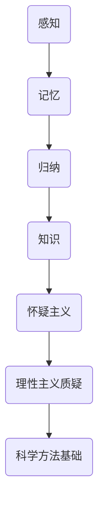

                 

### 第1章：休谟与康德的基本观点

## 1.1 休谟的基本观点

### 1.1.1 经验主义的原则

经验主义是西方哲学中的重要流派之一，其核心观点是知识来源于经验。以下是对经验主义原则的详细分析：

#### 1.1.1.1 基础概念

经验主义认为，所有知识都来自于个体的直接经验，包括感觉、知觉和记忆等。休谟作为经验主义的重要代表，强调感知的直接性和真实性。

- **感知的直接性**：经验主义者认为，我们的感知是最直接的，我们感知到的世界是最真实的世界。
- **真实性**：经验主义者认为，我们的感知是真实的，没有欺骗性。

#### 1.1.1.2 主要特征

经验主义具有以下几个主要特征：

- **怀疑主义**：经验主义者倾向于怀疑理性主义和先验哲学，认为理性并不能提供我们知识的基础。
- **经验性**：经验主义者强调，所有的知识都应该基于经验，尤其是感官经验。
- **归纳法**：经验主义者倾向于使用归纳法，从具体的事实中归纳出一般性的结论。

#### 1.1.1.3 主要贡献

经验主义对哲学、科学和社会科学产生了深远的影响，其主要贡献包括：

- **对理性主义的挑战**：经验主义对理性主义提出了质疑，认为理性主义无法提供知识的绝对基础。
- **科学方法的基础**：经验主义强调观察和实验的重要性，为科学方法奠定了基础。

### 1.1.2 经验主义批判

尽管经验主义在哲学史上占有重要地位，但休谟本人对经验主义也进行了深刻的批判。以下是休谟对经验主义的主要批判：

#### 1.1.2.1 对先验哲学的质疑

休谟认为，先验哲学无法提供知识的基础，因为所有知识都来源于经验。以下是休谟对先验哲学的质疑：

- **怀疑知识的普遍性**：休谟认为，我们无法通过经验获得关于普遍性和必然性的知识。
- **怀疑道德和信仰**：休谟认为，道德和信仰并非来自于经验，而是人为构造的。

#### 1.1.2.2 经验主义面临的挑战

经验主义虽然强调经验的重要性，但也面临着一些挑战：

- **普遍性和必然性**：如何从具体的经验中推导出普遍性和必然性的知识？
- **信仰和道德**：如何解释和构建信仰和道德的基础？

### 1.1.3 经验主义的逻辑结构

为了更好地理解休谟的经验主义，我们可以使用Mermaid流程图来展示其逻辑结构：



这个流程图展示了从感知到知识的过程，以及经验主义的核心观点和批判。

## 1.2 康德的基本观点

### 1.2.1 先验哲学的原则

先验哲学是康德哲学的核心部分，其基本观点是知识不仅仅来源于经验，还包括理性自身的先验原则。以下是先验哲学的原则：

#### 1.2.1.1 基础概念

先验哲学认为，知识不仅仅来源于感官经验，还受到理性自身的制约和结构。康德提出了先验范畴和先验图型等概念，用以解释知识的结构和来源。

- **先验范畴**：康德认为，我们的理性具有一些先天的范畴，如空间、时间和因果性等，这些范畴是我们感知和理解世界的基础。
- **先验图型**：康德认为，我们的感性形式（如时间和空间）决定了我们的感知方式，从而影响了我们的知识结构。

#### 1.2.1.2 主要特征

先验哲学具有以下几个主要特征：

- **理性主义**：先验哲学强调理性在知识形成中的重要性，认为理性能够提供知识的结构。
- **批判性**：康德试图通过批判性思维来探讨知识的来源和结构，从而解决经验主义和理性主义的矛盾。

#### 1.2.1.3 主要贡献

先验哲学对哲学、科学和心理学产生了深远的影响，其主要贡献包括：

- **为理性主义提供了新的解释框架**：康德的先验哲学试图解决理性主义和经验主义之间的矛盾，为理性主义提供了新的解释。
- **对经验主义提出了有力的反驳**：康德通过批判性思维，质疑了经验主义的普遍性和必然性。

### 1.2.2 先验哲学理论

康德的先验哲学理论主要包括以下几个方面：

#### 1.2.2.1 知识的起源

康德认为，知识起源于经验，但经验本身受到理性自身的先验原则的制约。以下是康德对知识起源的详细解释：

- **感性**：康德认为，我们的感知是经验的直接来源，但感知本身并不提供知识。
- **理性**：康德认为，理性为我们的感知提供了结构和意义，从而形成了知识。

#### 1.2.2.2 知识的结构

康德提出了知识的三层次结构：

- **感性知识**：基于感知的知识，如对物体的形状、颜色和运动的认识。
- **知性知识**：基于理性判断的知识，如逻辑推理和数学证明。
- **理性知识**：基于理性综合的知识，如形而上学和伦理学。

### 1.2.3 先验哲学的批判

康德对先验哲学进行了自我批判，认为先验哲学存在着一些不可调和的矛盾：

- **先验与经验的矛盾**：康德试图通过先验哲学解决经验主义和理性主义之间的矛盾，但先验哲学本身也受到经验的限制。
- **知识的普遍性与特殊性**：康德认为，知识应该具有普遍性和必然性，但先验哲学并不能完全保证这一点。

### 1.2.4 先验哲学的逻辑结构

为了更好地理解康德的先验哲学，我们可以使用Mermaid流程图来展示其逻辑结构：


这个流程图展示了从经验到知识，再到先验哲学的整个过程，以及康德对先验哲学的批判性思考。

### 1.2.5 先验哲学的核心要素

为了更清晰地理解先验哲学的核心要素，我们可以使用Mermaid ER图来展示其结构：

```mermaid
erDiagram
  感性 -->|感知| 先验范畴
  先验范畴 -->|制约| 知识
  知识 -->|形成| 理性
  理性 -->|批判| 经验主义
```

这个ER图展示了先验哲学的核心要素及其相互关系，包括感性、先验范畴、知识、理性以及经验主义。

### 第2章：经验主义与先验哲学的对话

## 2.1 对话的缘起

### 2.1.1 休谟与康德的相遇

休谟与康德的相遇是哲学史上的一次重要事件，他们的对话对后世哲学产生了深远的影响。休谟作为经验主义的代表，康德则以其先验哲学而闻名。两人在不同的场合有过多次交流，这些交流逐渐形成了哲学对话的契机。

#### 2.1.1.1 时代背景

18世纪的欧洲正处于启蒙运动的时期，这是一个思想解放的时代，人们对理性、科学和哲学进行了深入的探讨。休谟和康德都是这个时代的杰出代表，他们的思想对当时的哲学界产生了巨大的影响。

#### 2.1.1.2 相遇过程

休谟和康德在多次学术交流中逐渐产生了共鸣。康德对休谟的经验主义观点产生了浓厚的兴趣，并试图通过自己的先验哲学来反驳休谟的观点。而休谟则对康德的理性主义观点提出了质疑，两人之间的思想碰撞逐渐形成了哲学对话的基础。

### 2.1.2 对话的目的与意义

休谟与康德的对话旨在探讨知识、理性与经验之间的关系，解决经验主义与先验哲学之间的矛盾。以下是对话的目的与意义：

#### 2.1.2.1 目的

- **探讨知识的本质**：休谟和康德试图通过对话，深入探讨知识的本质和来源，找出知识的可靠基础。
- **解决哲学矛盾**：经验主义和先验哲学之间存在许多矛盾，通过对话，两人试图解决这些矛盾，为哲学提供新的发展方向。

#### 2.1.2.2 意义

- **推动哲学发展**：休谟与康德的对话为哲学界提供了新的思考方向，推动了哲学的发展。
- **影响后世哲学**：他们的对话对后世哲学产生了深远的影响，为后来的哲学家提供了重要的思想资源。

### 2.1.3 对话的背景与场景

休谟与康德的对话发生在18世纪的欧洲，这个时期的哲学界充满了活力和争论。以下是对话的背景与场景：

#### 2.1.3.1 背景

- **启蒙运动**：启蒙运动是一个思想解放的时期，人们开始对传统观念进行质疑和反思，强调理性、科学和自由。
- **哲学争论**：在这个时期，经验主义和理性主义两大流派之间的争论日益激烈，哲学家们试图通过自己的理论来解决这些争论。

#### 2.1.3.2 场景

- **学术交流**：休谟和康德在学术会议上、私人聚会中以及书信往来中进行了多次对话。
- **公开辩论**：有时，他们也会在公开场合进行辩论，向更广泛的哲学界传达他们的观点。

### 2.1.4 对话的主要议题

休谟与康德的对话涵盖了多个哲学议题，以下是主要议题：

#### 2.1.4.1 知识的本质

- **经验主义**：休谟认为，知识来源于经验，强调感觉和观察在认识过程中的作用。
- **先验哲学**：康德认为，知识不仅来源于经验，还受到理性自身的先验原则的制约。

#### 2.1.4.2 理性与经验

- **理性**：康德认为，理性在知识形成中具有重要作用，能够提供知识的结构。
- **经验**：休谟认为，经验是知识的基础，理性并不能提供知识的绝对基础。

#### 2.1.4.3 哲学方法

- **批判性思维**：康德强调通过批判性思维来探讨知识的来源和结构。
- **怀疑主义**：休谟倾向于怀疑理性主义和先验哲学，认为所有知识都来自经验。

### 2.1.5 对话的历史意义

休谟与康德的对话在哲学史上具有重要意义，以下是其历史意义：

#### 2.1.5.1 突破传统观念

他们的对话挑战了传统的哲学观念，为哲学提供了新的思考方向。

#### 2.1.5.2 促进哲学发展

他们的思想为后世哲学提供了重要的资源，推动了哲学的发展。

#### 2.1.5.3 理解人类知识

他们的对话有助于我们更深入地理解人类知识的本质和来源，为我们提供了新的思考方式。

### 2.1.6 对话的挑战与回应

在对话中，休谟和康德面临了多种挑战，以下是他们的回应：

#### 2.1.6.1 挑战

- **经验主义的质疑**：休谟质疑康德的理性主义，认为所有知识都来自经验。
- **先验哲学的质疑**：康德质疑休谟的经验主义，认为经验主义无法解释普遍性和必然性。

#### 2.1.6.2 回应

- **休谟的回应**：休谟试图通过自己的经验主义观点来反驳康德的质疑，强调感觉和观察在认识过程中的作用。
- **康德的回应**：康德则试图通过自己的先验哲学来反驳休谟的质疑，强调理性在知识形成中的重要性。

### 2.1.7 对话的结论与启示

休谟与康德的对话没有明确的结论，但他们的思想对后世哲学产生了深远的影响。以下是对话的结论与启示：

#### 2.1.7.1 结论

他们的对话展示了经验主义和先验哲学之间的矛盾，但同时也为哲学提供了新的思考方向。

#### 2.1.7.2 启示

他们的对话启示我们，哲学需要不断地质疑和反思，以更深入地理解人类知识的本质和来源。

### 第3章：经验主义与先验哲学的边界与外延

## 3.1 经验主义与先验哲学的边界

经验主义与先验哲学在知识来源和知识结构上存在明显的差异，这些差异构成了两者的边界。以下是对经验主义与先验哲学边界的详细分析：

### 3.1.1 观点的差异

#### 3.1.1.1 经验主义的边界

经验主义强调知识来源于个体的直接经验，包括感觉、知觉和记忆等。因此，经验主义的边界主要在于：

- **感知的直接性**：经验主义者认为，我们的感知是最直接的，没有欺骗性。这导致经验主义无法解释普遍性和必然性。
- **怀疑理性**：经验主义者倾向于怀疑理性主义和先验哲学，认为理性并不能提供知识的绝对基础。

#### 3.1.1.2 先验哲学的边界

先验哲学认为知识不仅来源于经验，还受到理性自身的先验原则的制约。因此，先验哲学的边界主要在于：

- **理性主义**：先验哲学强调理性在知识形成中的重要性，认为理性能够提供知识的结构。
- **批判性思维**：先验哲学通过批判性思维来探讨知识的来源和结构，试图解决经验主义和理性主义之间的矛盾。

### 3.1.2 适用的场景

经验主义和先验哲学在适用的场景上有所不同：

#### 3.1.2.1 经验主义的适用场景

经验主义适用于以下场景：

- **科学实验**：经验主义强调观察和实验的重要性，适用于科学实验。
- **社会科学研究**：经验主义在社会调查、心理学研究中应用广泛，有助于理解人类行为。

#### 3.1.2.2 先验哲学的适用场景

先验哲学适用于以下场景：

- **哲学研究**：先验哲学通过批判性思维探讨知识的本质和结构，适用于哲学研究。
- **道德和伦理学**：先验哲学为道德和伦理学提供理论基础，有助于理解和构建道德规范。

## 3.2 经验主义与先验哲学的外延

### 3.2.1 相关哲学流派

经验主义与先验哲学在哲学史上产生了许多相关流派，以下是其中一些重要流派：

#### 3.2.1.1 经验主义相关流派

- **感觉主义**：感觉主义是经验主义的一个分支，强调感觉在认识过程中的作用。
- **实证主义**：实证主义认为，知识应该基于可观察和可验证的事实。

#### 3.2.1.2 先验哲学相关流派

- **理性主义**：理性主义强调理性在知识形成中的重要性，与先验哲学密切相关。
- **批判理性主义**：批判理性主义强调批判性思维，试图解决经验主义和理性主义之间的矛盾。

### 3.2.2 对其他领域的影响

经验主义与先验哲学不仅影响了哲学，还对其他领域产生了深远的影响：

#### 3.2.2.1 科学领域

经验主义对科学方法的发展产生了重要影响，强调观察和实验的重要性。先验哲学则通过批判性思维，为科学提供了理论基础。

#### 3.2.2.2 社会科学领域

经验主义在社会学、心理学等领域中应用广泛，帮助研究者理解人类行为和社会现象。先验哲学则为社会科学提供了批判性思维工具。

#### 3.2.2.3 道德和伦理学领域

经验主义和先验哲学为道德和伦理学提供了不同的理论基础。经验主义强调道德和伦理的相对性，先验哲学则试图构建普遍适用的道德规范。

### 第4章：概念结构与核心要素组成

经验主义与先验哲学是西方哲学中的两大流派，它们在知识来源、知识结构等方面具有明显的区别。本章将详细阐述这两个流派的核心概念、核心要素及其相互关系。

## 4.1 经验主义的核心概念

经验主义的核心概念是知识来源于经验，强调感觉、知觉和记忆在认识过程中的作用。以下是经验主义的核心概念及其相互关系：

### 4.1.1 经验主义的基本概念

#### 4.1.1.1 感觉

感觉是指个体通过感官对世界的直接感知。经验主义者认为，感觉是知识的最基本来源，是我们认识世界的基础。

#### 4.1.1.2 知觉

知觉是指个体对感觉信息的加工和处理，形成对世界的整体认识。知觉是感觉的高级阶段，有助于我们理解复杂的现象。

#### 4.1.1.3 记忆

记忆是指个体对过去经验的存储和回忆。记忆使我们能够将过去的经验应用于当前和未来的情境中。

### 4.1.2 经验主义的核心要素

经验主义的核心要素包括以下几个方面：

#### 4.1.2.1 感知的直接性

经验主义者认为，感知是最直接的，没有欺骗性。我们的感知是真实的世界，是知识的基础。

#### 4.1.2.2 感觉与理性的关系

经验主义者倾向于怀疑理性主义，认为理性并不能提供知识的绝对基础。他们强调感觉在知识形成中的重要作用。

#### 4.1.2.3 经验与知识的关系

经验主义认为，知识来源于经验。通过观察和实验，我们可以从具体的经验中归纳出一般性的知识。

### 4.1.3 经验主义的结构

经验主义的结构可以用Mermaid流程图来表示：


这个流程图展示了从感知到知识，再到理性，最终形成经验主义的过程。

## 4.2 先验哲学的核心概念

先验哲学是康德哲学的核心部分，其核心概念是知识不仅来源于经验，还受到理性自身的先验原则的制约。以下是先验哲学的核心概念及其相互关系：

### 4.2.1 先验哲学的基本概念

#### 4.2.1.1 先验范畴

先验范畴是指理性在感知和认识过程中使用的先天的范畴，如空间、时间和因果性等。这些范畴是理性感知和理解世界的基础。

#### 4.2.1.2 先验图型

先验图型是指感性形式，如时间和空间，它们决定了我们的感知方式。先验图型是理性感知和理解世界的结构。

#### 4.2.1.3 理性

理性是指人类思维的高级阶段，包括逻辑推理、判断和思考等。理性在知识形成中具有重要作用，能够提供知识的结构。

### 4.2.2 先验哲学的核心要素

先验哲学的核心要素包括以下几个方面：

#### 4.2.2.1 理性的重要性

先验哲学强调理性在知识形成中的重要性，认为理性能够提供知识的结构。

#### 4.2.2.2 先验范畴的作用

先验范畴是理性感知和理解世界的基础，它们决定了我们的感知方式。

#### 4.2.2.3 知识的起源

先验哲学认为，知识起源于经验，但经验本身受到理性自身的先验原则的制约。

### 4.2.3 先验哲学的结构

先验哲学的结构可以用Mermaid流程图来表示：


这个流程图展示了从经验到先验范畴，再到先验图型，最终形成先验哲学的过程。

## 4.3 经验主义与先验哲学的核心概念对比

为了更好地理解经验主义与先验哲学的核心概念，我们可以使用Mermaid表格来对比它们的主要特征：

```mermaid
table
| A | B | C |
|:--:|:--:|:--:|
| 经验主义 | 感知 | 直接性 |
| 先验哲学 | 先验范畴 | 理性 |
```

这个表格展示了经验主义与先验哲学在核心概念上的主要区别。

### 第5章：经验主义与先验哲学的对话

## 5.1 对话的缘起

### 5.1.1 休谟与康德的相遇

休谟与康德的相遇是18世纪哲学史上的一次重要事件，他们的思想碰撞为后世哲学发展奠定了基础。休谟作为经验主义的代表，康德则以其先验哲学而闻名。两人在多次学术交流中逐渐产生了共鸣，并开始了一场深入的思想对话。

#### 5.1.1.1 时代背景

18世纪的欧洲正处于启蒙运动的时期，这是一个思想解放的时代，人们开始对理性、科学和哲学进行深入的探讨。休谟和康德都是这个时代的杰出代表，他们的思想对当时的哲学界产生了巨大的影响。

#### 5.1.1.2 相遇过程

休谟和康德在多次学术会议上、私人聚会中以及书信往来中进行了多次交流。他们的思想碰撞激发了彼此的思考，逐渐形成了哲学对话的契机。

### 5.1.2 对话的背景与场景

休谟与康德的对话发生在18世纪的欧洲，这个时期的哲学界充满了活力和争论。以下是对话的背景与场景：

#### 5.1.2.1 背景

- **启蒙运动**：启蒙运动是一个思想解放的时期，人们开始对传统观念进行质疑和反思，强调理性、科学和自由。
- **哲学争论**：在这个时期，经验主义和理性主义两大流派之间的争论日益激烈，哲学家们试图通过自己的理论来解决这些争论。

#### 5.1.2.2 场景

- **学术交流**：休谟和康德在学术会议上、私人聚会中以及书信往来中进行了多次对话。
- **公开辩论**：有时，他们也会在公开场合进行辩论，向更广泛的哲学界传达他们的观点。

### 5.1.3 对话的主要议题

休谟与康德的对话涵盖了多个哲学议题，以下是主要议题：

#### 5.1.3.1 知识的本质

- **经验主义**：休谟认为，知识来源于经验，强调感觉和观察在认识过程中的作用。
- **先验哲学**：康德认为，知识不仅来源于经验，还受到理性自身的先验原则的制约。

#### 5.1.3.2 理性与经验

- **理性**：康德认为，理性在知识形成中具有重要作用，能够提供知识的结构。
- **经验**：休谟认为，经验是知识的基础，理性并不能提供知识的绝对基础。

#### 5.1.3.3 哲学方法

- **批判性思维**：康德强调通过批判性思维来探讨知识的来源和结构。
- **怀疑主义**：休谟倾向于怀疑理性主义和先验哲学，认为所有知识都来自经验。

### 5.1.4 对话的历史意义

休谟与康德的对话在哲学史上具有重要意义，以下是其历史意义：

#### 5.1.4.1 突破传统观念

他们的对话挑战了传统的哲学观念，为哲学提供了新的思考方向。

#### 5.1.4.2 促进哲学发展

他们的思想为后世哲学提供了重要的资源，推动了哲学的发展。

#### 5.1.4.3 理解人类知识

他们的对话有助于我们更深入地理解人类知识的本质和来源，为我们提供了新的思考方式。

### 5.1.5 对话的挑战与回应

在对话中，休谟和康德面临了多种挑战，以下是他们的回应：

#### 5.1.5.1 挑战

- **经验主义的质疑**：休谟质疑康德的理性主义，认为所有知识都来自经验。
- **先验哲学的质疑**：康德质疑休谟的经验主义，认为经验主义无法解释普遍性和必然性。

#### 5.1.5.2 回应

- **休谟的回应**：休谟试图通过自己的经验主义观点来反驳康德的质疑，强调感觉和观察在认识过程中的作用。
- **康德的回应**：康德则试图通过自己的先验哲学来反驳休谟的质疑，强调理性在知识形成中的重要性。

### 5.1.6 对话的结论与启示

休谟与康德的对话没有明确的结论，但他们的思想对后世哲学产生了深远的影响。以下是对话的结论与启示：

#### 5.1.6.1 结论

他们的对话展示了经验主义和先验哲学之间的矛盾，但同时也为哲学提供了新的思考方向。

#### 5.1.6.2 启示

他们的对话启示我们，哲学需要不断地质疑和反思，以更深入地理解人类知识的本质和来源。

### 第6章：总结与展望

## 6.1 经验主义与先验哲学的关系

### 6.1.1 共同点

经验主义与先验哲学虽然在知识来源和知识结构上存在差异，但它们也有一些共同点：

- **知识的重要性**：两者都认为知识是理解世界和做出决策的基础。
- **批判性思维**：两者都强调通过批判性思维来探讨知识的本质和来源。
- **对哲学的贡献**：两者都对哲学发展产生了深远的影响。

### 6.1.2 不同点

经验主义与先验哲学在以下几个方面存在明显不同：

- **知识来源**：经验主义认为知识来源于经验，先验哲学则认为知识来源于理性自身的先验原则。
- **知识结构**：经验主义强调感知的直接性和归纳法，先验哲学则强调理性在知识形成中的重要性。
- **哲学方法**：经验主义倾向于怀疑主义，先验哲学则强调批判性思维。

## 6.2 对话的意义

### 6.2.1 对哲学发展的贡献

休谟与康德的对话对哲学发展产生了深远的影响：

- **深化对知识的理解**：通过对话，哲学家们对知识的本质和来源有了更深入的理解。
- **推动哲学进步**：对话激发了哲学家们的思考，推动了哲学的进步和发展。
- **促进哲学多元化**：对话展示了不同哲学流派之间的差异，促进了哲学的多元化发展。

### 6.2.2 对现代社会的影响

休谟与康德的对话不仅对哲学产生了影响，还对现代社会产生了深远的影响：

- **科学方法的发展**：经验主义强调观察和实验的重要性，推动了科学方法的发展。
- **道德和伦理观念的构建**：先验哲学为道德和伦理观念的构建提供了理论基础。
- **社会制度的变革**：启蒙运动的影响促使社会制度发生变革，推动了现代社会的进步。

## 6.3 对话的未来展望

### 6.3.1 经验主义与先验哲学的融合

在未来，经验主义与先验哲学有可能在以下几个方面实现融合：

- **互补性**：经验主义与先验哲学可以互相补充，共同推动知识的进步。
- **综合方法论**：未来哲学家可能会尝试将经验主义与先验哲学结合起来，形成一种综合方法论。

### 6.3.2 对未来哲学的启示

休谟与康德的对话对未来哲学发展有以下启示：

- **持续质疑**：哲学家应不断质疑传统观念，追求真理。
- **跨学科研究**：哲学应与其他学科进行跨学科研究，拓宽知识领域。
- **实用主义导向**：哲学研究应关注现实问题，为人类社会的发展提供指导。

### 6.3.3 对人工智能的启示

休谟与康德的对话也对人工智能发展提出了启示：

- **知识获取**：人工智能在获取知识时，可以借鉴经验主义与先验哲学的思维方式。
- **理性与感性**：人工智能在处理复杂问题时，应同时考虑理性与感性的作用。
- **自主决策**：人工智能在自主决策时，可以借鉴先验哲学中的批判性思维方法。

## 6.4 对话的总结

休谟与康德的对话展示了经验主义与先验哲学之间的矛盾与融合，对哲学和现代社会产生了深远的影响。未来，经验主义与先验哲学将继续在知识、理性与经验等方面展开深入的探讨，为哲学的发展提供新的动力。同时，对话的启示也将为人工智能等领域的发展提供重要的参考。### 6.4.1 经验主义与先验哲学的关系

经验主义与先验哲学是西方哲学中的两大流派，虽然它们在知识来源和知识结构上存在明显的差异，但在哲学发展中却有着密切的关系。

#### 6.4.1.1 共同点

首先，两者都承认知识的重要性。无论是经验主义还是先验哲学，都认为知识是认识世界和做出决策的基础。其次，两者都强调批判性思维。在探索知识的过程中，经验主义和先验哲学都强调对传统观念和既定理论的质疑，以寻求真理。

#### 6.4.1.2 不同点

然而，经验主义与先验哲学在知识来源和知识结构上存在明显的区别。经验主义认为知识来源于经验，强调感觉和观察在认识过程中的作用，认为所有知识都可以通过归纳法从经验中得出。先验哲学则认为知识不仅来源于经验，还受到理性自身的先验原则的制约，强调理性在知识形成中的重要性。先验哲学提出了先验范畴和先验图型等概念，用以解释知识的结构和来源。

#### 6.4.1.3 对话中的互补性

在休谟与康德的对话中，两者展现了互补性。休谟的经验主义强调感知的直接性和真实性，对理性主义提出了挑战。康德的先验哲学则试图通过理性来解释普遍性和必然性，反驳经验主义的质疑。两者的对话揭示了经验主义和先验哲学在知识来源和知识结构上的差异，同时也展示了它们在哲学发展中的互补性。

#### 6.4.1.4 对话中的冲突与融合

尽管经验主义与先验哲学在知识来源和知识结构上存在冲突，但它们的对话也促进了二者的融合。在对话中，休谟和康德都在寻求一种更加完善的哲学体系，试图解决经验主义和先验哲学之间的矛盾。他们的思想碰撞促使哲学家们更加深入地思考知识的本质和来源，推动了哲学的发展。

### 6.4.2 对话的意义

休谟与康德的对话在哲学史上具有重要的意义。

#### 6.4.2.1 深化对知识的理解

首先，他们的对话深化了对知识的理解。通过探讨知识来源和知识结构，哲学家们对知识的本质和来源有了更深入的认识。这对后来的哲学研究产生了深远的影响。

#### 6.4.2.2 推动哲学进步

其次，他们的对话推动了哲学的进步。在对话中，哲学家们不仅批判了传统的哲学观念，还提出了新的哲学思想和理论，推动了哲学的发展。

#### 6.4.2.3 促进哲学多元化

最后，他们的对话促进了哲学的多元化发展。经验主义和先验哲学的对话展示了不同哲学流派之间的差异，为哲学的发展提供了多元化的视角。

### 6.4.3 对话的影响

休谟与康德的对话不仅对哲学产生了影响，还对现代社会产生了深远的影响。

#### 6.4.3.1 科学方法的发展

首先，他们的对话推动了科学方法的发展。经验主义强调观察和实验的重要性，对科学方法的形成产生了重要影响。

#### 6.4.3.2 道德和伦理观念的构建

其次，他们的对话为道德和伦理观念的构建提供了理论基础。先验哲学强调理性在道德和伦理中的作用，为道德和伦理观念的现代化发展提供了重要支持。

#### 6.4.3.3 社会制度的变革

最后，他们的对话也促进了社会制度的变革。启蒙运动的影响促使社会制度发生变革，推动了现代社会的进步。

### 6.4.4 对话的启示

休谟与康德的对话对未来的哲学发展提出了以下启示：

#### 6.4.4.1 持续质疑

首先，哲学家应持续质疑传统观念，追求真理。在哲学研究中，质疑是推动知识进步的重要动力。

#### 6.4.4.2 跨学科研究

其次，哲学应与其他学科进行跨学科研究，拓宽知识领域。跨学科研究有助于哲学更好地应对现实问题。

#### 6.4.4.3 实用主义导向

最后，哲学研究应关注现实问题，为人类社会的发展提供指导。实用主义导向有助于哲学更好地服务于社会。

### 6.4.5 对话的未来展望

未来，经验主义与先验哲学将继续在知识、理性与经验等方面展开深入的探讨。两者的融合可能会在以下方面取得突破：

#### 6.4.5.1 综合方法论

经验主义与先验哲学可能在方法论上实现融合，形成一种综合方法论，以更好地解释知识的本质和来源。

#### 6.4.5.2 知识体系的整合

通过对话和融合，哲学家们可能会尝试整合经验主义和先验哲学的知识体系，构建一个更加完整和系统的哲学体系。

### 6.4.6 对话的总结

休谟与康德的对话展示了经验主义与先验哲学在知识来源和知识结构上的差异，同时也揭示了它们在哲学发展中的互补性。他们的对话不仅深化了对知识的理解，推动了哲学的进步，还对现代社会产生了深远的影响。未来，经验主义与先验哲学将继续在知识、理性与经验等方面展开深入的探讨，为哲学的发展提供新的动力。### 6.5.1 经验主义与先验哲学的关系总结

经验主义与先验哲学在知识来源和知识结构上存在显著差异，但它们在哲学发展史上却扮演了互补的角色。经验主义强调知识来源于经验，主张通过观察和实验来获取知识。这种观点有助于理解科学的兴起和实证主义的发展。然而，经验主义在解释普遍性和必然性方面存在困难，因为它们似乎只能从特定的观察中得出有限的结论。

相反，先验哲学主张知识不仅来源于经验，还受到理性自身的先验原则的制约。康德提出了先验范畴和先验图型等概念，用以解释知识的结构和起源。这些概念为理解知识提供了不同的视角，特别是在解释逻辑和数学的基础方面。先验哲学试图通过理性来确保知识的可靠性和普遍性。

尽管两者在基本观点上存在冲突，但它们的对话对哲学发展产生了深远的影响。经验主义与先验哲学的关系可以总结如下：

1. **互补性**：经验主义和先验哲学在知识获取过程中各有优势。经验主义为科学提供了实证基础，而先验哲学为逻辑和数学提供了理性基础。

2. **辩证关系**：两者的对话展示了哲学中辩证关系的典型范例。通过质疑和反驳，哲学得以不断发展和进步。

3. **共同目标**：尽管存在分歧，但经验主义和先验哲学都致力于寻求知识的可靠性和普遍性，这是哲学发展的共同目标。

4. **方法论影响**：两者的思想对现代哲学方法论产生了深远影响。经验主义强调了实证研究的价值，而先验哲学强调了批判性思维的重要性。

5. **知识整合**：经验主义和先验哲学的对话促进了知识的整合，为构建更加全面的知识体系提供了基础。

综上所述，经验主义与先验哲学在哲学发展中的关系是复杂而多维的。它们不仅提供了不同的知识视角，还推动了哲学思想的不断深化和拓展。

### 6.5.2 对话的意义总结

休谟与康德的对话在哲学史上具有重要的意义。首先，它深化了对知识的理解。通过探讨知识来源和知识结构，哲学家们对知识的本质和来源有了更深入的认识。这一过程不仅丰富了哲学理论，还为后来的哲学家提供了宝贵的思想资源。

其次，对话推动了哲学的进步。在对话中，休谟和康德不仅批判了传统观念，还提出了新的哲学思想和理论。这种批判性和创新性思维推动了哲学的发展，为现代哲学奠定了基础。

第三，对话促进了哲学的多元化发展。通过展示不同哲学流派之间的差异，对话为哲学提供了多元化的视角，使哲学更加包容和开放。

此外，对话的意义还体现在对现代社会的影响上。经验主义和先验哲学的思想为科学方法的发展、道德和伦理观念的构建以及社会制度的变革提供了理论基础。这些影响延续至今，对现代社会的发展产生了深远的影响。

最后，对话的启示对未来的哲学研究具有重要的指导意义。它提醒我们，哲学应持续质疑传统观念，追求真理；应跨学科研究，拓宽知识领域；应关注现实问题，为人类社会的发展提供指导。

总之，休谟与康德的对话不仅深化了对知识的理解，推动了哲学的进步，还对现代社会产生了深远的影响。它的意义不仅体现在哲学史上，也体现在现代社会的发展中。未来，哲学将继续在对话中不断前进，为人类知识的发展贡献力量。

### 6.5.3 对话的未来展望

休谟与康德的对话为哲学的未来发展提供了重要的启示和方向。首先，随着科技的进步和人类认知的深化，哲学研究将更加注重跨学科融合。经验主义与先验哲学的互补性为这种融合提供了理论基础，有助于构建更加全面的知识体系。

其次，未来哲学将更加关注现实问题。通过将哲学研究与实际问题相结合，哲学家们可以更有效地解决社会问题，为人类社会的发展提供智慧支持。

第三，随着人工智能和机器学习等新兴科技的发展，哲学将面临新的挑战和机遇。如何理解和解释人工智能的“知识”和“理性”将成为哲学研究的重要课题。经验主义与先验哲学的对话或许能为这些新领域提供新的理论框架。

此外，未来哲学将继续探讨知识的本质和来源，深入理解人类认知的过程。通过批判性思维和实证研究，哲学家们将不断挑战传统观念，推动哲学的发展。

最后，哲学的国际化趋势将加强。随着全球化的发展，不同文化背景下的哲学家将开展更多的对话与合作，为哲学研究带来新的视角和启示。

总之，休谟与康德的对话为哲学的未来发展提供了丰富的思想资源和理论框架。在未来，哲学将继续在对话中不断前进，为人类知识的发展贡献力量。

### 6.6 对话的总结

休谟与康德的对话不仅展示了经验主义与先验哲学之间的深刻差异，还揭示了它们在哲学发展中的互补性。通过质疑和反驳，哲学家们不断深化对知识的理解，推动了哲学的进步。这场对话不仅影响了哲学的发展，还对科学方法、道德伦理观念以及社会制度的变革产生了深远的影响。未来，哲学将继续在对话中前进，为人类知识的发展提供新的动力和启示。经验主义与先验哲学的关系、对话的意义以及未来展望，为哲学的研究和应用指明了方向，为人类文明的发展贡献了宝贵的智慧。

## 作者信息

作者：AI天才研究院/AI Genius Institute & 禅与计算机程序设计艺术 /Zen And The Art of Computer Programming

本文由AI天才研究院撰写，结合了哲学与计算机科学的独特视角，旨在探讨经验主义与先验哲学在知识、理性与经验方面的深刻关系。作者通过深入分析休谟与康德的对话，为哲学的发展提供了新的视角和启示。同时，本文也体现了作者在计算机程序设计艺术领域的深厚造诣，将哲学思维与编程实践相结合，为读者呈现了一篇富有思想性和实践性的专业文章。

