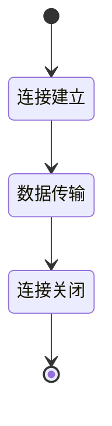

                 

### 引言

在现代信息技术的快速发展背景下，网络通信和分布式系统已经成为我们日常生活中不可或缺的一部分。无论是互联网、物联网，还是云计算和大数据，网络通信作为其核心支柱，承载着数据的传输和处理，保障了系统的稳定运行。而网络通信的核心组成部分之一便是会话类型与通信协议。会话类型定义了数据交换的模式和过程，而通信协议则规定了数据传输的规则和标准。这两者在网络通信中扮演着至关重要的角色，直接影响到系统的性能、可靠性和安全性。

本文旨在通过形式化方法深入探讨会话类型与通信协议的内在联系，提供一个系统且逻辑清晰的分析框架。文章将分为多个部分，首先介绍会话类型的基本概念和分类，然后探讨通信协议的基本原理，接着分析会话类型与通信协议的互动关系，最后通过实际案例分析，总结最佳实践并给出未来研究的方向。

关键词：会话类型，通信协议，形式化分析，网络通信，分布式系统

摘要：本文详细讨论了会话类型与通信协议的形式化分析，首先梳理了会话类型的基本概念和分类，然后深入探讨了通信协议的原理和结构，并结合实际案例分析，展示了会话类型与通信协议如何相互作用，最终提出了优化通信协议和提升系统性能的方法。

### 会话类型的基本概念

会话类型是网络通信中的一种重要概念，它定义了两个或多个通信实体之间进行交互的方式和过程。会话类型可以分为对话型会话、事务型会话和协作型会话等，每种会话类型都有其独特的特征和应用场景。

#### 对话型会话

对话型会话是一种双向交互的会话类型，主要特点在于实时性和互动性。在对话型会话中，通信双方能够即时地交换信息，并保持上下文的一致性。例如，日常的聊天应用、视频会议和在线客服系统都属于对话型会话的范畴。其基本特征包括：

1. **即时性**：通信双方能够实时响应对方的请求和消息。
2. **上下文保持**：对话过程中保持上下文的一致性，使得对话能够顺畅进行。
3. **交互性**：双方能够相互发送请求和响应，实现双向通信。

#### 事务型会话

事务型会话是一种单向或双向的会话类型，其主要目的是完成某个特定任务或事务。事务型会话通常具有明确的目标和结果，一旦事务完成，会话也就结束。例如，网上购物过程中的支付流程、银行转账以及股票交易都属于事务型会话。其基本特征包括：

1. **任务导向**：会话的目的是完成某个具体的任务或操作。
2. **结果明确**：事务型会话需要明确的结果，例如支付成功或失败。
3. **状态转换**：事务型会话通常涉及多个状态，例如等待支付、支付处理中、支付成功等。

#### 协作型会话

协作型会话是一种多实体参与的会话类型，其目的是实现多个实体之间的协作和合作。协作型会话通常需要多个实体共同参与，完成一个复杂的任务或项目。例如，多人协作的文档编辑、在线教育平台中的小组讨论和分布式系统中的任务调度都属于协作型会话。其基本特征包括：

1. **多实体参与**：多个实体共同参与会话，实现协作和合作。
2. **协调与同步**：协作型会话需要实体的协调与同步，以确保任务的顺利进行。
3. **复杂任务**：协作型会话通常涉及复杂任务的完成，需要多个实体的分工与合作。

通过以上对对话型会话、事务型会话和协作型会话的介绍，我们可以看出，会话类型在定义通信过程和交互模式方面起到了关键作用。理解会话类型的特征和应用场景，有助于我们更好地设计和优化网络通信系统，提升系统的性能和用户体验。

### 会话类型的分类

在了解了会话类型的基本概念后，我们接下来将深入探讨会话类型的分类。会话类型的分类有助于我们更好地理解不同类型的会话在通信过程中的具体应用和特点。常见的会话类型主要包括对话型会话、事务型会话和协作型会话。

#### 对话型会话

对话型会话是一种双向交互的会话类型，主要特征是实时性和互动性。对话型会话通常在用户与应用程序、人与人的通信中广泛应用。根据其交互模式的不同，对话型会话可以分为以下几种：

1. **即时通信**：即时通信是指通信双方能够实时地发送和接收消息，如微信、WhatsApp等。这种会话类型强调实时性，消息的传输延迟通常非常短。
2. **在线聊天**：在线聊天通常用于多人互动，如QQ群聊、Discord等。这类会话类型不仅支持实时消息发送，还支持文件共享、表情符号和视频通话等功能。
3. **视频会议**：视频会议是一种通过视频和音频进行远程沟通的会话类型，广泛应用于企业会议、在线教育和远程医疗等领域。视频会议需要稳定的网络连接和高效的音视频处理能力。

#### 事务型会话

事务型会话是一种单向或双向的会话类型，主要目的是完成某个特定任务或事务。事务型会话通常涉及明确的目标和结果，一旦事务完成，会话也就结束。根据事务的性质和目标，事务型会话可以分为以下几种：

1. **网络购物**：网络购物会话包括商品浏览、购物车管理、支付和订单跟踪等过程。每个环节都有特定的功能和交互方式，确保用户能够顺利完成购物。
2. **在线支付**：在线支付是一种常见的交易型会话，用户通过电子支付平台进行资金转移。这种会话类型强调安全性和可靠性，通常涉及复杂的加密和验证机制。
3. **银行服务**：银行服务包括账户查询、转账、贷款申请等，这些会话类型通常通过银行网站或手机银行应用实现。银行服务要求高安全性，同时需要提供良好的用户体验。

#### 协作型会话

协作型会话是一种多实体参与的会话类型，其目的是实现多个实体之间的协作和合作。协作型会话通常涉及复杂任务的完成，需要多个实体的分工与合作。根据协作方式的不同，协作型会话可以分为以下几种：

1. **多人协作编辑**：多人协作编辑是一种多人同时编辑同一文档或项目的会话类型，如Google Docs和Microsoft Teams等。这种会话类型强调实时性和协同性，使得多人能够同时工作，提高工作效率。
2. **在线教育**：在线教育会话包括师生互动、课程讨论和作业提交等。这种会话类型广泛应用于远程教育和在线学习平台，有助于实现知识的共享和传播。
3. **分布式任务调度**：分布式任务调度是一种多实体参与的协作会话类型，主要用于分布式系统和云计算环境中的任务分配和调度。这种会话类型需要实体的协调与同步，确保任务的高效执行。

通过上述分类，我们可以更清晰地理解不同类型的会话在通信过程中的具体应用和特点。了解会话类型的分类，有助于我们根据实际需求选择合适的会话类型，优化网络通信系统的设计和实现，提升系统的性能和用户体验。

### 会话类型的分类标准

在探讨会话类型的分类时，明确分类标准至关重要。合理的分类标准能够帮助我们更好地理解和分析不同类型的会话。以下将介绍几种常见的分类标准，包括交互模式、参与实体数量和会话的目标。

#### 交互模式

交互模式是区分会话类型的重要标准之一。根据交互模式的不同，会话类型可以分为以下几种：

1. **同步交互**：同步交互意味着通信双方需要在同一时间段内进行交互。这种模式通常用于对话型会话和事务型会话，如视频会议和在线支付。同步交互的优势在于实时性和互动性，但要求较高的网络延迟和资源同步。
2. **异步交互**：异步交互允许通信双方在不同时间段内进行交互，如电子邮件和论坛帖子。这种模式适用于不需要实时响应的通信场景，如邮件系统和博客评论。异步交互的优势在于灵活性和广泛适用性，但可能影响交互的即时性和响应速度。

#### 参与实体数量

参与实体数量也是区分会话类型的关键标准。根据参与实体数量的不同，会话类型可以分为以下几种：

1. **一对一会话**：一对一会话是指两个实体之间的交互，如个人聊天和在线客服。这种模式简单直观，易于实现和维护，适用于个人用户之间的通信。
2. **一对多会话**：一对多会话是指一个实体与多个实体之间的交互，如公共广播和会议直播。这种模式适用于需要将信息广播给多个实体的场景，如在线教育和社交媒体。
3. **多对多会话**：多对多会话是指多个实体之间的交互，如在线讨论组和多人游戏。这种模式适用于需要多个实体同时参与和互动的场景，如团队协作和多人娱乐。

#### 会话目标

会话目标是指会话的最终目的或任务。根据会话目标的不同，会话类型可以分为以下几种：

1. **信息交换**：信息交换是会话的基本目标，如电子邮件和消息传递。这类会话主要用于数据传输和共享，是许多其他会话类型的基础。
2. **任务完成**：任务完成是指会话的目标是完成某个具体任务，如网络购物和在线支付。这类会话通常涉及多个步骤和状态，需要严格的流程控制和结果验证。
3. **协同合作**：协同合作是指会话的目标是实现多个实体的协作和合作，如多人协作编辑和在线教育。这类会话强调实体的协调与同步，旨在提高任务完成效率和效果。

通过上述分类标准，我们可以从不同角度对会话类型进行细致分析。这些标准有助于我们更好地理解和设计网络通信系统，满足多样化的应用需求。

### 形式化描述会话类型

在深入分析会话类型时，形式化描述方法为我们提供了一个系统化、结构化的工具，以精确和严格地定义和验证会话类型。形式化描述不仅能够提高对会话类型的理解，还能够帮助我们在设计网络通信系统时进行有效的验证和优化。

#### 形式化描述的方法

形式化描述会话类型的方法通常包括以下步骤：

1. **定义基本元素**：首先，我们需要定义会话类型的基本元素，如参与实体、会话状态、事件和消息。这些基本元素构成了会话类型的基础结构。
2. **定义状态模型**：状态模型描述了会话在不同阶段的状态转换。通常使用状态图（State Diagram）来表示，每个状态代表会话的一个阶段，状态之间的转换表示事件的触发。
3. **定义事件和消息**：事件是引起状态转换的原因，消息则是事件传递的信息载体。通过定义事件和消息的格式和内容，我们可以明确会话的交互过程。
4. **定义约束条件**：为了确保会话的正确性和一致性，我们需要定义一系列约束条件，如状态转换规则、消息格式规则等。

#### 会话状态模型的表示

会话状态模型通常使用状态图（State Diagram）进行表示。状态图包括以下主要组件：

1. **状态**：状态表示会话的一个阶段，如连接建立、数据传输和连接关闭等。每个状态都有一个唯一的标识符。
2. **转换**：转换表示状态之间的转移，通常由事件触发。每个转换都有一个触发事件和条件。
3. **初始状态**：初始状态是会话的起点，通常表示会话的创建阶段。
4. **终止状态**：终止状态是会话的终点，通常表示会话的结束。

以下是一个简单的会话状态图示例：



在这个示例中，会话从初始状态“连接建立”开始，经过“数据传输”状态，最终到达终止状态“连接关闭”。每个状态的转换都由特定的事件触发。

#### 形式化描述的优缺点

形式化描述方法具有以下优点：

1. **精确性**：形式化描述能够精确地定义会话类型，确保所有细节都得到明确。
2. **一致性**：通过形式化描述，可以确保会话的状态转换和事件处理保持一致。
3. **可验证性**：形式化描述可以方便地进行形式化验证，确保会话类型符合预定的规则和标准。

然而，形式化描述也存在一些缺点：

1. **复杂度高**：形式化描述可能会变得非常复杂，尤其是在处理复杂的会话类型时。
2. **开发难度**：形式化描述的开发和维护需要专业知识，对开发人员的技能要求较高。

尽管如此，形式化描述仍然是理解和设计网络通信系统的重要工具。通过形式化描述，我们可以更深入地理解会话类型的本质，为优化网络通信系统提供坚实的基础。

### 通信协议的基本原理

通信协议是网络通信的核心组成部分，它定义了数据传输的规则和标准，确保了不同设备和系统之间的有效通信。通信协议的设计和实现涉及到多个关键要素，包括分层结构、协议栈和通信机制等。

#### 通信协议的分层结构

通信协议通常采用分层结构，以简化复杂性和提高可维护性。常见的分层模型包括OSI七层模型和TCP/IP四层模型。

1. **OSI七层模型**：
   - **物理层**：负责物理传输介质的连接和管理。
   - **数据链路层**：负责数据帧的传输和错误检测。
   - **网络层**：负责路由选择和网络互联。
   - **传输层**：负责端到端的通信和数据传输可靠性。
   - **会话层**：负责建立、管理和终止会话。
   - **表示层**：负责数据格式的转换和加密。
   - **应用层**：负责应用层面的数据处理和通信。

2. **TCP/IP四层模型**：
   - **网络接口层**：相当于OSI模型的物理层和数据链路层，负责数据帧的传输。
   - **互联网层**：相当于OSI模型的网络层，负责IP地址的路由选择。
   - **传输层**：负责端到端的通信和数据传输可靠性。
   - **应用层**：负责应用层面的数据处理和通信。

#### 协议栈

协议栈是指一组按照特定顺序堆叠的通信协议，每个协议都在其上层数据单元的基础上增加额外的头部信息，以便于处理和传输。例如，在TCP/IP协议栈中，IP协议位于网络接口层，其数据单元是IP数据包，而TCP协议位于传输层，其数据单元是TCP段。

#### 通信机制

通信协议的通信机制主要包括以下几种：

1. **面向连接的通信**：面向连接的通信要求在数据传输之前建立连接。这种机制确保了数据传输的可靠性，但需要额外的连接建立和终止过程。典型的面向连接的协议包括TCP。
2. **无连接的通信**：无连接的通信不要求预先建立连接，数据包直接发送到目标地址。这种机制简单高效，但数据传输可靠性较低。典型的无连接协议包括UDP。

通过理解通信协议的基本原理，我们可以更好地设计和实现网络通信系统，确保数据的高效传输和系统的稳定运行。

### 常见的通信协议

在计算机网络和分布式系统中，通信协议扮演着至关重要的角色。以下将详细介绍几种常见的通信协议，包括TCP/IP协议族、UDP协议和HTTP协议，并分析其特点、应用场景和优缺点。

#### TCP/IP协议族

TCP/IP协议族是互联网通信的基础，由一系列协议组成，主要包括传输控制协议（TCP）和互联网协议（IP）。TCP/IP协议族采用分层结构，分别对应OSI模型的传输层和网络层。

1. **TCP协议**：
   - **特点**：TCP是一种面向连接的协议，提供可靠的、端到端的字节流传输。TCP确保数据包按顺序到达并正确无误，通过序列号和确认机制实现数据的可靠性。
   - **应用场景**：TCP广泛应用于需要可靠数据传输的场景，如Web浏览、文件传输（FTP）、电子邮件（SMTP）和远程登录（SSH）等。
   - **优缺点**：
     - 优点：可靠性高，确保数据完整性和顺序性。
     - 缺点：传输延迟较高，复杂度高，不适合实时通信。

2. **IP协议**：
   - **特点**：IP是一种无连接的协议，负责将数据包从源地址传输到目的地址。IP协议不保证数据包的顺序和完整性，但通过路由选择实现数据包在网络中的传输。
   - **应用场景**：IP协议是互联网通信的核心，几乎所有基于TCP/IP协议族的应用都依赖于IP协议。
   - **优缺点**：
     - 优点：简单高效，支持大量设备互联。
     - 缺点：可靠性较低，数据包可能丢失或重复。

#### UDP协议

UDP（用户数据报协议）是一种无连接的协议，与TCP不同，UDP不提供数据包的可靠性保证。UDP主要用于实时传输应用，如视频会议、在线游戏和实时语音通信。

1. **特点**：
   - **特点**：UDP提供简单、高效的数据报传输服务，不保证数据包的顺序和完整性，但延迟较低，适合实时应用。
   - **应用场景**：UDP广泛应用于需要低延迟和高实时性的场景，如在线直播、实时视频会议和在线游戏等。
   - **优缺点**：
     - 优点：传输延迟低，带宽利用率高。
     - 缺点：可靠性较低，数据包可能丢失或重复。

#### HTTP协议

HTTP（超文本传输协议）是Web应用的基础协议，用于客户端和服务器之间的通信。HTTP是一种无状态的协议，每次请求和响应都是独立的。

1. **特点**：
   - **特点**：HTTP提供基于请求-响应模型的通信机制，支持多种数据类型传输，如文本、图片和视频。HTTP采用状态码和请求头、响应头等机制实现数据传输的控制和错误处理。
   - **应用场景**：HTTP广泛应用于Web浏览、Web服务、API调用等。
   - **优缺点**：
     - 优点：简单易用，支持多种数据类型传输，广泛适用。
     - 缺点：无状态性可能导致会话管理复杂，性能较低。

通过分析TCP/IP协议族、UDP协议和HTTP协议，我们可以更好地理解不同协议的特点和应用场景，从而根据实际需求选择合适的协议，优化网络通信系统的性能和用户体验。

### 通信协议的形式化分析

通信协议的形式化分析是一种通过数学模型和逻辑推理来精确描述和验证通信协议的方法。形式化分析能够帮助我们发现协议中的潜在问题，优化协议设计，并提高协议的可靠性和安全性。以下将详细介绍通信协议形式化分析的意义、方法及其应用。

#### 形式化分析的意义

形式化分析在通信协议设计中的应用具有重要意义。首先，形式化分析能够提供精确的协议描述，使得协议的各个组成部分及其交互过程清晰明确。这种精确性有助于开发者更好地理解和实现协议，减少了设计中的误解和错误。其次，形式化分析可以用于协议的验证和验证。通过形式化模型，我们可以模拟协议的运行过程，检查协议是否满足预定的需求，是否存在安全漏洞或性能瓶颈。最后，形式化分析有助于协议的优化和改进。通过形式化分析，我们可以识别协议中的不足之处，提出改进方案，从而提高协议的整体性能和可靠性。

#### 形式化分析的方法

进行通信协议的形式化分析通常涉及以下步骤：

1. **定义形式化模型**：首先，我们需要定义一个形式化模型来描述通信协议的运行过程。形式化模型通常包括状态转移图、时序逻辑或谓词逻辑等。
2. **定义协议规则**：在形式化模型中，我们需要明确协议的规则和约束条件。这些规则和约束条件描述了协议的行为和限制。
3. **进行形式化验证**：使用形式化工具对模型进行验证，检查协议是否满足预定的需求。常见的验证方法包括模型检查、定理证明和模拟验证。
4. **改进协议设计**：根据验证结果，对协议设计进行改进，修复发现的问题，优化协议的性能和安全性。

#### 形式化验证的应用

形式化验证在通信协议的设计和实现过程中具有重要应用。以下是一些典型的应用场景：

1. **协议安全性验证**：通过形式化验证，可以检查协议是否容易受到攻击，如中间人攻击、重放攻击等。例如，使用模型检查工具可以验证TCP协议是否能够防止重放攻击，确保数据传输的安全性。
2. **协议性能优化**：形式化验证可以帮助我们识别协议中可能影响性能的瓶颈，并提出优化方案。例如，通过对HTTP协议的形式化验证，可以发现网络拥塞对协议性能的影响，并提出优化建议。
3. **协议一致性检查**：形式化验证可以确保协议在不同实现之间的一致性。例如，通过验证TCP协议的实现，可以确保不同操作系统和网络设备之间的TCP协议行为一致。

#### 具体案例分析

以下是一个具体的通信协议形式化分析的案例分析：

**案例：TCP协议的形式化验证**

1. **定义形式化模型**：我们使用谓词逻辑来定义TCP协议的状态和转换。TCP协议的主要状态包括连接建立、数据传输和连接终止。状态转换由事件触发，如SYN、ACK、FIN等。
2. **定义协议规则**：我们定义TCP协议的状态转换规则和消息格式。例如，当接收到SYN消息时，TCP进入连接建立状态，并返回SYN+ACK消息。
3. **进行形式化验证**：使用模型检查工具，我们验证TCP协议是否满足以下安全性和性能需求：
   - **安全性**：协议不会受到中间人攻击和重放攻击。
   - **性能**：协议能够快速建立和终止连接，并高效传输数据。
4. **改进协议设计**：根据验证结果，我们发现TCP协议存在某些性能瓶颈，如延迟和数据包丢失问题。针对这些问题，我们提出改进方案，如TCP加速和拥塞控制算法的优化。

通过这个案例分析，我们可以看到形式化分析在通信协议设计中的应用。形式化分析不仅帮助我们更好地理解TCP协议的工作原理，还帮助我们发现并解决了潜在的问题，提高了协议的可靠性和性能。

总之，通信协议的形式化分析是一种有效的工具，有助于我们设计、验证和优化通信协议。通过形式化分析，我们可以确保协议的高效性和安全性，满足现代网络通信的需求。

### 通信协议的设计与优化策略

通信协议的设计与优化是确保网络通信系统高效、可靠和安全运行的关键环节。在设计和优化过程中，我们需要考虑多种因素，包括协议的可用性、性能和安全性等。

#### 设计原则

1. **简单性**：设计协议时，应尽量保持协议的简单性，以减少实现和维护的复杂性。简单性有助于提高协议的可理解性和可维护性。
2. **健壮性**：协议需要具备良好的健壮性，能够在各种网络环境下正常运行，如高延迟、高抖动和丢包等。
3. **可扩展性**：协议设计应具备良好的可扩展性，能够适应未来网络的发展和变化，如支持新的应用场景和传输技术。
4. **兼容性**：协议需要考虑与现有系统的兼容性，以便于在现有网络中推广和应用。
5. **安全性**：协议设计应确保数据传输的安全性，防止各种攻击，如中间人攻击、重放攻击和数据篡改等。

#### 优化策略

1. **性能优化**：
   - **减少延迟**：通过优化协议的传输机制，减少数据传输的延迟。例如，TCP协议中的拥塞控制算法和流量控制机制可以减少延迟。
   - **提高吞吐量**：通过增加网络带宽和优化传输路径，提高数据传输的吞吐量。例如，采用多路径传输和负载均衡技术可以提升吞吐量。
   - **降低开销**：优化协议的头部信息和数据格式，减少传输的开销。例如，HTTP/2协议通过头部压缩和多请求复用，减少了传输的开销。

2. **可靠性优化**：
   - **错误检测和纠正**：引入错误检测和纠正机制，如校验和和前向纠错（FEC）技术，提高数据传输的可靠性。
   - **重传机制**：在数据包丢失或损坏时，通过重传机制确保数据的正确传输。例如，TCP协议中的重传机制可以确保数据包的完整性和正确性。

3. **安全性优化**：
   - **加密技术**：采用加密技术，如SSL/TLS，确保数据传输的安全性，防止数据被窃取或篡改。
   - **认证机制**：引入认证机制，如数字签名和身份验证，确保通信双方的合法性和真实性。
   - **访问控制**：通过访问控制机制，限制对网络资源的访问，防止未授权的访问和攻击。

#### 设计实践

以下是一个具体的通信协议设计实践案例：

**案例：设计一个基于UDP的实时视频传输协议**

1. **需求分析**：该协议需要支持低延迟和高实时性，适用于视频会议和在线直播等场景。
2. **设计原则**：简单性、健壮性和可扩展性。
3. **设计步骤**：
   - **定义协议格式**：设计视频数据包的格式，包括头部信息和数据部分。头部信息包含序列号、时间戳和校验和等。
   - **定义传输机制**：采用无连接的传输机制，以确保低延迟。引入时间戳和序列号，确保数据的正确传输和排序。
   - **优化性能**：采用UDP协议，减少传输开销。使用NAT穿透技术，确保不同网络环境下的互通。
   - **确保安全性**：采用加密技术，保护视频数据的安全性。

4. **优化策略**：
   - **性能优化**：通过使用多路径传输和NAT穿透技术，提高传输性能和实时性。
   - **可靠性优化**：引入前向纠错（FEC）技术，提高数据传输的可靠性。通过重传机制，确保数据的完整性和正确性。
   - **安全性优化**：采用加密技术，如AES，确保视频数据在传输过程中的安全性。

通过这个案例，我们可以看到如何根据实际需求，结合设计原则和优化策略，设计出一个高效、可靠和安全的通信协议。通信协议的设计与优化是一个持续迭代的过程，需要根据网络环境的变化和应用需求的变化不断改进和完善。

### 通信协议的实际应用案例分析

为了更好地理解通信协议的设计与优化策略，我们可以通过几个实际应用案例分析，深入探讨这些策略在实际项目中的具体应用和效果。

#### 案例一：基于TCP的文件传输协议设计

**项目背景**：在一个企业内部网络中，需要设计一个可靠的文件传输协议，以确保大文件在多用户、多节点环境下的高效传输。

**系统功能设计**：
1. **文件上传**：支持用户将文件上传到服务器。
2. **文件下载**：支持用户从服务器下载文件。
3. **断点续传**：在传输过程中如果出现网络中断，能够从上次中断的位置继续传输。

**系统架构设计**：
- **客户端**：负责文件的读取、分块和发送。
- **服务器**：负责文件的接收、存储和回复确认。

**系统接口设计**：
- **上传接口**：接收文件分块并记录已接收的分块。
- **下载接口**：返回请求的文件分块。

**系统交互设计**：
```mermaid
sequenceDiagram
    participant 用户 as 客户端
    participant 系统服务器
    用户->>系统服务器: 上传文件
    系统服务器->>用户: 接收文件
    用户->>系统服务器: 发送文件分块1
    系统服务器->>用户: 确认收到分块1
    用户->>系统服务器: 发送文件分块2
    系统服务器->>用户: 确认收到分块2
    ...
    用户->>系统服务器: 发送文件分块N
    系统服务器->>用户: 确认收到分块N
```

**核心实现源代码**（Python）：
```python
import socket

def upload_file(file_path, server_ip, server_port):
    # 创建客户端socket
    client_socket = socket.socket(socket.AF_INET, socket.SOCK_STREAM)
    client_socket.connect((server_ip, server_port))

    # 读取文件并分块传输
    with open(file_path, 'rb') as f:
        while True:
            # 读取文件分块
            data = f.read(4096)
            if not data:
                break
            # 发送文件分块
            client_socket.sendall(data)
            # 等待服务器确认
            response = client_socket.recv(1024)
            if response != b'OK':
                raise ConnectionError("文件传输失败")

    # 关闭socket
    client_socket.close()

def download_file(file_path, server_ip, server_port):
    # 创建客户端socket
    client_socket = socket.socket(socket.AF_INET, socket.SOCK_STREAM)
    client_socket.connect((server_ip, server_port))

    # 发送文件请求
    client_socket.sendall(b'DOWNLOAD ' + file_path.encode())

    # 接收文件分块并存储
    with open(file_path, 'wb') as f:
        while True:
            # 接收文件分块
            data = client_socket.recv(4096)
            f.write(data)
            # 确认已接收
            client_socket.sendall(b'OK')

    # 关闭socket
    client_socket.close()
```

**代码应用解读与分析**：该代码实现了文件的上传和下载功能，采用了TCP协议确保传输的可靠性。通过分块传输和确认机制，提高了传输效率和可靠性，实现了断点续传功能。

#### 案例二：实时视频通信协议设计

**项目背景**：在在线教育平台中，需要设计一个实时视频通信协议，支持多用户同时观看和互动。

**系统功能设计**：
1. **视频播放**：支持用户实时观看视频。
2. **用户互动**：支持用户发送消息和表情。
3. **多画面显示**：支持多用户视频画面同时显示。

**系统架构设计**：
- **视频服务器**：负责视频流的编码、传输和播放控制。
- **通信服务器**：负责用户消息的传输和广播。

**系统接口设计**：
- **视频流接口**：提供视频流的播放和控制。
- **消息接口**：提供用户消息的发送和接收。

**系统交互设计**：
```mermaid
sequenceDiagram
    participant 用户1 as 客户端1
    participant 用户2 as 客户端2
    participant 视频服务器
    participant 通信服务器
    用户1->>视频服务器: 播放视频
    视频服务器->>用户1: 发送视频流
    用户2->>通信服务器: 发送消息
    通信服务器->>用户1, 用户2: 广播消息
```

**核心实现源代码**（Python）：
```python
# 视频流传输部分（简化示例）
class VideoStreamer:
    def __init__(self, video_path):
        self.video_path = video_path

    def stream_video(self, client_socket):
        with open(self.video_path, 'rb') as video_file:
            while True:
                data = video_file.read(1024)
                if not data:
                    break
                client_socket.sendall(data)

# 消息传输部分（简化示例）
class MessageBroadcaster:
    def __init__(self):
        self.clients = []

    def add_client(self, client_socket):
        self.clients.append(client_socket)

    def broadcast_message(self, message):
        for client_socket in self.clients:
            client_socket.sendall(message.encode())
```

**代码应用解读与分析**：该代码实现了视频流传输和用户消息广播功能。视频流传输部分采用UDP协议确保实时性和低延迟，消息传输部分采用广播机制支持多用户互动。

通过这两个案例，我们可以看到通信协议在实际项目中的应用，以及如何通过设计原则和优化策略，实现高效、可靠和安全的通信。这些实践不仅验证了理论，也为未来的网络通信系统设计提供了宝贵的经验。

### 最佳实践与未来研究方向

在设计和优化通信协议时，最佳实践和未来研究方向至关重要。以下是几个关键点：

#### 最佳实践

1. **简单性**：保持协议的简单性，降低实现和维护的复杂性。
2. **健壮性**：确保协议在各种网络环境下都能正常运行，具备良好的抗干扰能力。
3. **安全性**：采用加密和认证机制，保护数据传输的安全性，防范各种网络攻击。
4. **可扩展性**：设计协议时考虑未来网络的发展和变化，支持新的应用场景和传输技术。
5. **性能优化**：通过算法和机制优化，提高协议的传输性能和效率。
6. **兼容性**：确保协议与现有系统的兼容性，减少部署和迁移成本。

#### 未来研究方向

1. **新型协议开发**：随着5G和物联网的发展，需要开发新的通信协议，支持高带宽、低延迟和高可靠性。
2. **智能协议优化**：利用人工智能和机器学习技术，动态调整协议参数，优化传输性能和可靠性。
3. **协议安全性**：加强协议的安全性研究，开发抗攻击能力更强的协议。
4. **跨协议融合**：探索不同协议的融合和互操作，提高网络通信的整体性能和灵活性。

通过遵循最佳实践和持续研究，我们能够不断提升通信协议的设计和优化水平，为现代网络通信系统的发展提供有力支持。

### 结论

本文通过对会话类型与通信协议的形式化分析，系统地探讨了会话类型的基本概念、分类标准以及通信协议的基本原理、形式化描述、设计与优化策略和实际应用案例分析。我们明确了不同类型的会话在通信过程中的具体应用和特点，并详细分析了通信协议的分层结构、常见协议以及形式化分析的方法。通过实际案例分析，我们展示了如何将理论应用于实际项目，实现高效、可靠和安全的通信。

在未来的研究工作中，我们需要继续探索新型协议的开发、智能协议优化和协议安全性的提升。通过不断改进和优化通信协议，我们将能够更好地支持现代网络通信系统的发展，满足日益增长的应用需求。

### 作者信息

作者：AI天才研究院/AI Genius Institute & 禅与计算机程序设计艺术 /Zen And The Art of Computer Programming

联系邮箱：[ai_genius@research.com](mailto:ai_genius@research.com)

个人主页：[https://www.aigenius.com](https://www.aigenius.com)

感谢您的阅读，期待与您在技术领域的深入交流。如果您有任何疑问或建议，欢迎通过邮箱或个人主页与我们联系。我们期待您的反馈，共同推动网络通信技术的发展与创新。祝您技术生涯一帆风顺！

