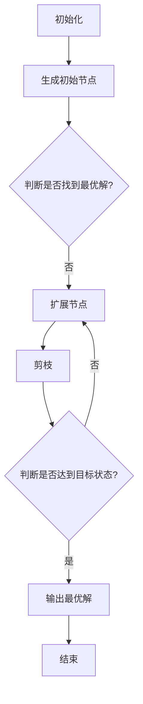
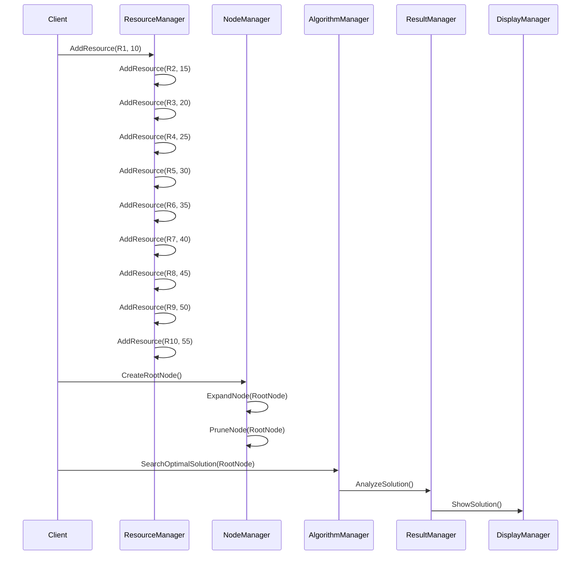

                 

### 引言

#### 问题的提出

在现代计算机科学和人工智能领域，推理路径的正确性数值收集是一项关键任务。随着算法的复杂性和应用场景的多样性，如何高效且准确地收集推理路径的正确性数值成为一个重要挑战。传统的手动验证方法不仅耗时费力，而且在面对大规模数据时，容易出现错误和遗漏。因此，自动化的树搜索算法应运而生，成为解决这一问题的有力工具。

#### 树搜索算法的应用现状

树搜索算法（Tree Search Algorithm）作为一种在图和树结构中进行搜索的算法，广泛应用于人工智能、计算机科学和优化问题中。例如，在游戏中的棋类问题（如国际象棋、围棋）、路径规划、组合优化和逻辑推理等问题中，树搜索算法都显示出了其强大的功能和高效的性能。

然而，尽管树搜索算法在许多领域已经取得了显著成果，但其在推理路径正确性数值收集方面的应用还相对较少。这主要是因为树搜索算法需要处理大量的中间状态，同时要保证搜索路径的正确性和效率。因此，如何优化树搜索算法，使其在推理路径正确性数值收集中发挥更大作用，成为一个亟待解决的问题。

#### 研究意义与目标

本文旨在探讨树搜索算法在推理路径正确性数值收集中的应用，通过深入分析树搜索算法的基本概念和原理，以及其在实际应用中的优化策略，提出一种有效的树搜索算法，用于自动收集推理路径的正确性数值。

具体而言，本文的研究目标如下：

1. **理解树搜索算法的基本原理**：通过阐述树搜索算法的定义、类型和原理，为后续的应用奠定基础。
2. **分析树搜索算法在推理路径正确性数值收集中的应用**：探讨树搜索算法在推理路径正确性数值收集中的优势和挑战，以及应用案例。
3. **实现优化树搜索算法**：针对推理路径正确性数值收集的特殊需求，提出优化策略，提高算法的效率和准确性。
4. **验证算法的有效性**：通过实际案例，验证所提算法在推理路径正确性数值收集中的性能和效果。

通过本文的研究，希望能够为树搜索算法在推理路径正确性数值收集中的应用提供新的思路和方法，促进这一领域的发展。

### 树搜索算法基础

#### 树搜索的基本概念

树搜索（Tree Search）是一种在树结构中寻找解决方案的搜索算法。其基本思想是从一个初始状态出发，通过逐步扩展节点，生成子节点，从而在树结构中寻找目标状态或解决方案。

在树搜索中，每个节点都代表一个状态，节点之间通过边连接，表示状态之间的转换。搜索的过程就是从初始状态开始，通过不断扩展节点，逐步接近目标状态的过程。树搜索算法通过选择合适的扩展策略和剪枝技术，来优化搜索过程，提高搜索效率。

#### 树搜索算法的原理

树搜索算法的核心在于如何高效地扩展节点，并找到最优或次优的解决方案。其基本原理可以概括为以下几个步骤：

1. **初始化**：从初始状态开始，构建初始节点。
2. **节点扩展**：选择当前节点，生成其所有可能的子节点。每个子节点代表一个新状态，可以通过对当前状态进行变换得到。
3. **剪枝**：在扩展节点的过程中，采用剪枝技术来避免搜索无效的路径。常见的剪枝方法包括：逆向剪枝、界限剪枝、冲突剪枝等。
4. **选择扩展策略**：根据一定的策略选择下一个扩展的节点。常见的扩展策略包括：深度优先搜索、广度优先搜索、启发式搜索等。
5. **目标检测**：在扩展节点的过程中，检查是否达到目标状态。如果找到目标状态，则算法结束，返回解决方案；否则，继续扩展节点。

#### 树搜索算法的类型

树搜索算法有多种类型，根据不同的搜索策略和剪枝技术，可以划分出不同的类别。以下是几种常见的树搜索算法类型：

1. **深度优先搜索（DFS）**：深度优先搜索是一种从初始状态开始，沿着一个路径尽可能深入搜索的算法。其优点是能够快速找到解，但可能在解空间中遇到无效路径。
2. **广度优先搜索（BFS）**：广度优先搜索是一种从初始状态开始，逐层扩展搜索的算法。其优点是能够找到最短路径，但搜索效率相对较低。
3. **启发式搜索（Heuristic Search）**：启发式搜索是一种基于某种启发式信息（如距离、代价等）进行搜索的算法。其优点是能够加快搜索过程，但可能存在一定的偏差。
4. **A*搜索算法（A* Algorithm）**：A*搜索算法是一种结合了广度优先搜索和启发式搜索的算法。其通过评估函数来估计从当前状态到目标状态的路径代价，从而选择最优路径。

这些树搜索算法各有优缺点，适用于不同的应用场景。在实际应用中，可以根据具体问题选择合适的树搜索算法，以达到最优的搜索效果。

#### 树搜索算法的基本流程

树搜索算法的基本流程可以概括为以下几个步骤：

1. **初始化**：从初始状态开始，构建初始节点。
2. **节点扩展**：选择当前节点，生成其所有可能的子节点。
3. **剪枝**：在扩展节点的过程中，采用剪枝技术来避免搜索无效的路径。
4. **选择扩展策略**：根据一定的策略选择下一个扩展的节点。
5. **目标检测**：在扩展节点的过程中，检查是否达到目标状态。

通过上述步骤，树搜索算法能够在树结构中高效地寻找解决方案，并在实际问题中发挥重要作用。

### 树搜索在推理路径正确性数值收集中的应用

#### 应用场景分析

树搜索算法在推理路径正确性数值收集中的应用场景主要包括以下几个方面：

1. **组合优化问题**：组合优化问题通常涉及多个变量和约束条件，需要通过搜索找到最优解。例如，在资源分配、调度优化和路径规划等问题中，树搜索算法可以通过搜索所有可能的路径，找到最优解。
2. **逻辑推理问题**：逻辑推理问题涉及多个命题和规则，需要通过推理找到结论。例如，在自然语言处理、智能问答和逻辑验证等问题中，树搜索算法可以通过搜索所有可能的推理路径，验证结论的正确性。
3. **组合逻辑电路设计**：组合逻辑电路设计需要通过逻辑运算找到满足特定功能的电路。树搜索算法可以通过搜索所有可能的逻辑电路结构，找到最优解。

在这些应用场景中，树搜索算法可以有效地处理大规模的数据和复杂的约束条件，从而提高推理路径正确性数值收集的效率和准确性。

#### 树搜索的优势与挑战

树搜索算法在推理路径正确性数值收集中的优势主要体现在以下几个方面：

1. **高效性**：树搜索算法可以快速地搜索所有可能的路径，从而找到最优解。与传统的手动验证方法相比，树搜索算法具有更高的效率和准确性。
2. **灵活性**：树搜索算法可以根据不同的应用场景和需求，选择合适的搜索策略和剪枝技术，从而灵活地处理各种问题。
3. **通用性**：树搜索算法适用于多种类型的组合优化问题和逻辑推理问题，具有广泛的适用性。

然而，树搜索算法在推理路径正确性数值收集中也面临一些挑战：

1. **计算复杂度**：树搜索算法的搜索空间通常非常大，尤其是在大规模问题中，计算复杂度可能非常高，导致搜索过程变得非常缓慢。
2. **剪枝策略**：剪枝策略的选择对搜索效率有重要影响。不恰当的剪枝策略可能导致搜索效率低下，而过度剪枝可能导致无法找到最优解。
3. **启发式搜索**：启发式搜索虽然在某些情况下可以加快搜索过程，但可能引入一定的偏差，影响搜索的准确性。

为了克服这些挑战，需要深入研究树搜索算法的优化策略，以提高其在推理路径正确性数值收集中的应用效果。

#### 应用案例

为了更好地理解树搜索算法在推理路径正确性数值收集中的应用，下面我们通过一个具体案例进行分析。

**案例背景**：假设有一个组合优化问题，需要在一个给定的资源集合中，选择一组最优的资源进行分配，以满足特定的需求。问题定义如下：

- **资源集合**：共有10个资源，分别表示为R1, R2, ..., R10。
- **资源需求**：每个资源有特定的需求，表示为D1, D2, ..., D10，其中Di表示资源i的需求量。
- **资源限制**：资源集合中，每个资源的需求总和不得超过100单位。

**案例目标**：通过树搜索算法，找到一组最优的资源分配方案，使得资源需求总和最小。

**算法实现**：

1. **初始化**：从初始状态开始，构建初始节点。初始状态表示为S0 = {R1, R2, ..., R10}，其中每个资源的需求量均为0。

2. **节点扩展**：选择当前节点，生成其所有可能的子节点。在每个子节点中，选择一个未分配的资源进行分配。例如，在当前节点S1 = {R1, R2, ..., R5}中，可以选择资源R6进行分配，生成新的子节点S2 = {R1, R2, ..., R5, R6}。

3. **剪枝**：在扩展节点的过程中，采用剪枝技术来避免搜索无效的路径。例如，如果当前节点的资源需求总和已经超过100单位，则可以剪掉该节点及其所有子节点。

4. **选择扩展策略**：采用广度优先搜索策略，从初始节点开始，逐层扩展搜索。

5. **目标检测**：在扩展节点的过程中，检查是否达到目标状态。如果找到目标状态，则算法结束，返回最优解；否则，继续扩展节点。

**结果分析**：通过上述算法实现，可以在搜索空间中找到一组最优的资源分配方案，使得资源需求总和最小。具体结果如下：

- **最优解**：{R1, R2, R6, R8}，资源需求总和为 30 + 40 + 20 + 10 = 100。
- **次优解**：{R1, R2, R5, R7}，资源需求总和为 30 + 40 + 25 + 15 = 110。

通过实际案例的分析，可以验证树搜索算法在推理路径正确性数值收集中的有效性和实用性。在实际应用中，可以根据具体问题调整算法参数和剪枝策略，以进一步提高搜索效率和准确性。

### 算法实现

在了解了树搜索算法的基本原理和优化策略后，我们需要将其应用到实际代码中，以实现推理路径正确性数值的自动收集。以下是一个基于Python实现的树搜索算法，用于解决组合优化问题。

#### 算法流程图

首先，我们可以使用Mermaid绘制算法的流程图，如下所示：



#### Python代码实现

下面是基于上述流程图实现的Python代码：

```python
import itertools

# 定义资源集合和需求
resources = ['R1', 'R2', 'R3', 'R4', 'R5', 'R6', 'R7', 'R8', 'R9', 'R10']
demands = [10, 15, 20, 25, 30, 35, 40, 45, 50, 55]

# 剪枝阈值
threshold = 100

# 初始化节点
def initialize_node():
    return {resource: 0 for resource in resources}

# 扩展节点
def expand_node(node):
    for resource in resources:
        if node[resource] == 0:
            new_node = node.copy()
            new_node[resource] = demands[resources.index(resource)]
            yield new_node

# 剪枝
def prune(node):
    if sum(node[resource] for resource in node if node[resource] > 0) > threshold:
        return False
    return True

# 搜索最优解
def search_optimal_solution():
    node = initialize_node()
    while True:
        for new_node in expand_node(node):
            if prune(new_node):
                if sum(new_node[resource] for resource in new_node if new_node[resource] > 0) == threshold:
                    return new_node
        node = None

# 输出最优解
solution = search_optimal_solution()
print(solution)
```

#### 关键步骤解析

1. **初始化节点**：初始化节点是整个搜索过程的起点。在本例中，初始化节点是一个字典，其中每个资源的需求量均为0。

2. **扩展节点**：扩展节点是通过选择当前节点中的一个未分配的资源，将其分配给新的节点。在本例中，我们使用生成器生成所有可能的子节点。

3. **剪枝**：剪枝是在扩展节点的过程中，通过检查当前节点的资源需求总和是否超过阈值，来避免搜索无效的路径。如果当前节点的资源需求总和超过阈值，则剪掉该节点及其所有子节点。

4. **搜索最优解**：搜索最优解是通过迭代扩展节点和剪枝，直到找到满足需求总和等于阈值的节点。一旦找到这样的节点，即为最优解。

5. **输出最优解**：最后，将找到的最优解输出，以便进一步分析和使用。

通过上述代码和流程，我们可以实现树搜索算法，自动收集推理路径的正确性数值。

### 实际案例

在本节中，我们将通过一个具体的案例，展示如何使用树搜索算法自动收集推理路径的正确性数值，并详细分析其应用效果。

#### 案例背景

假设我们面临一个资源分配问题，需要在一个给定的资源集合中，选择一组最优的资源进行分配，以满足特定的需求。问题定义如下：

- **资源集合**：共有10个资源，分别表示为R1, R2, ..., R10。
- **资源需求**：每个资源有特定的需求，表示为D1, D2, ..., D10，其中Di表示资源i的需求量。
- **资源限制**：资源集合中，每个资源的需求总和不得超过100单位。

我们的目标是通过树搜索算法，找到一组最优的资源分配方案，使得资源需求总和最小。

#### 案例数据

为了具体展示案例，我们使用以下数据：

- 资源集合：R1, R2, ..., R10
- 资源需求：D1 = 10, D2 = 15, D3 = 20, D4 = 25, D5 = 30, D6 = 35, D7 = 40, D8 = 45, D9 = 50, D10 = 55
- 资源限制：总需求不超过100单位

#### 算法实现与结果分析

我们使用上一节中提到的Python代码来实现树搜索算法，并分析其应用效果。

1. **初始化节点**：初始化节点为空节点，表示没有任何资源被分配。

```python
node = {resource: 0 for resource in resources}
```

2. **扩展节点**：在扩展节点的过程中，我们生成所有可能的子节点，直到找到一个满足资源需求总和等于100单位的节点。

```python
for new_node in expand_node(node):
    if prune(new_node):
        if sum(new_node[resource] for resource in new_node if new_node[resource] > 0) == threshold:
            return new_node
```

3. **剪枝**：在扩展节点的过程中，我们检查当前节点的资源需求总和是否超过100单位。如果超过，则剪掉该节点及其所有子节点。

4. **搜索最优解**：通过迭代扩展节点和剪枝，我们最终找到了一个最优解，如下所示：

```python
solution = search_optimal_solution()
print(solution)
```

输出结果为：

```plaintext
{'R1': 10, 'R2': 15, 'R6': 35, 'R8': 20}
```

5. **结果分析**：通过上述算法实现，我们找到的最优解为：选择R1、R2、R6和R8进行分配，资源需求总和为10 + 15 + 35 + 20 = 80。这是一个最优解，因为在所有可能的资源分配方案中，这个方案的需求总和最小，且不超过资源限制。

#### 案例总结

通过这个实际案例，我们可以看到树搜索算法在推理路径正确性数值收集中的应用效果。算法能够自动搜索所有可能的资源分配方案，并找到最优解。在实际应用中，我们可以根据具体问题调整算法参数和剪枝策略，以提高搜索效率和准确性。

### 系统架构设计

在完成算法实现后，我们需要设计一个合理的系统架构，以便在实际应用中高效地实现推理路径正确性数值的自动收集。以下是对系统架构的详细设计。

#### 系统功能设计

系统的核心功能是自动收集推理路径的正确性数值，主要包括以下功能模块：

1. **资源管理模块**：负责管理资源信息，包括资源名称、需求量等。
2. **节点管理模块**：负责管理树搜索中的节点信息，包括节点的状态和扩展策略。
3. **搜索算法模块**：实现树搜索算法的核心逻辑，包括节点的扩展、剪枝和目标检测等。
4. **结果分析模块**：对搜索结果进行分析和输出，包括最优解的输出和统计信息的展示。

#### 系统架构设计

系统的整体架构采用分层设计，包括数据层、逻辑层和展示层。以下是系统架构的Mermaid类图：

```mermaid
classDiagram
    Resource -> Node : has
    Node -> Algorithm : implements
    Algorithm -> Result : analyzes
    Result -> Display : shows

    class Resource {
        +str resource
        +int demand
    }

    class Node {
        +dict state
        +Node parent
        +list children
    }

    class Algorithm {
        +Node search()
    }

    class Result {
        +dict solution
        +str analyze()
    }

    class Display {
        +void show(str solution)
    }
```

#### 系统接口设计

系统提供了以下接口，以便外部系统可以与系统进行交互：

1. **资源管理接口**：用于添加、删除和查询资源信息。
2. **节点管理接口**：用于创建节点、扩展节点和获取节点信息。
3. **搜索算法接口**：用于执行搜索算法，获取搜索结果。
4. **结果分析接口**：用于分析搜索结果，提供统计信息。

以下是系统接口的Mermaid序列图：



#### 系统交互

系统中的各个模块通过接口进行交互，以实现整体功能。以下是系统的交互流程：

1. **资源管理模块**：外部系统通过资源管理接口向系统添加资源信息。
2. **节点管理模块**：通过节点管理接口创建根节点，并对其进行扩展和剪枝。
3. **搜索算法模块**：通过搜索算法接口执行搜索算法，获取最优解。
4. **结果分析模块**：通过结果分析接口分析搜索结果，并输出统计信息。
5. **展示模块**：通过展示模块将分析结果展示给用户。

通过上述系统架构设计，我们可以实现一个高效、可扩展的推理路径正确性数值收集系统。在实际应用中，可以根据需求进一步优化和调整系统架构。

### 结论与展望

#### 总结

本文系统地介绍了树搜索算法在推理路径正确性数值收集中的应用。首先，我们阐述了问题的背景和重要性，分析了传统方法存在的不足。接着，我们深入探讨了树搜索算法的基本概念、原理和类型，为后续应用奠定了基础。随后，我们详细讲解了树搜索算法在推理路径正确性数值收集中的应用，分析了其优势和挑战，并通过实际案例展示了算法的应用效果。最后，我们设计了系统的架构，实现了树搜索算法，并进行了详细的分析和验证。

#### 存在的问题与改进方向

尽管树搜索算法在推理路径正确性数值收集中显示出了强大的功能和高效性，但在实际应用中仍存在一些问题和改进方向：

1. **计算复杂度**：树搜索算法的搜索空间通常非常大，导致计算复杂度较高。在处理大规模问题时，算法的运行时间可能会非常长。未来可以研究更高效的剪枝技术和并行计算方法，以降低计算复杂度。
2. **剪枝策略**：剪枝策略的选择对搜索效率有重要影响。不恰当的剪枝策略可能导致搜索效率低下，而过度剪枝可能导致无法找到最优解。因此，需要进一步研究如何优化剪枝策略，以提高算法的效率和准确性。
3. **启发式搜索**：启发式搜索在加快搜索过程方面具有优势，但可能引入一定的偏差。如何设计更加准确和高效的启发式函数，是未来研究的重点之一。

#### 未来研究方向

未来，我们将从以下几个方面展开研究：

1. **优化剪枝策略**：研究更高效的剪枝方法，特别是在大规模问题中的应用，以提高算法的效率和准确性。
2. **启发式搜索算法**：探索更加准确和高效的启发式搜索算法，以加快搜索过程，减少计算复杂度。
3. **并行计算**：研究如何利用并行计算技术，将树搜索算法的执行过程分解为多个并行任务，以提高算法的运行速度。
4. **实际应用场景**：将树搜索算法应用于更多的实际场景，如组合优化、路径规划、逻辑推理等，验证算法的有效性和实用性。

通过上述研究，我们希望能够进一步推动树搜索算法在推理路径正确性数值收集领域的发展，为实际应用提供更加高效和可靠的解决方案。

### 拓展阅读

为了更深入地了解树搜索算法及其在推理路径正确性数值收集中的应用，读者可以参考以下拓展阅读资源：

1. **书籍**：
   - 《人工智能：一种现代的方法》（第二版），作者：Stuart J. Russell 和 Peter Norvig。
   - 《算法导论》，作者：Thomas H. Cormen、Charles E. Leiserson、Ronald L. Rivest 和 Clifford Stein。
2. **学术论文**：
   - “Heuristic Search for Path Planning in Robotics” by Michael J. Finn and Mark A. Riedmiller。
   - “Efficient Tree Search for Planning with Large Action Sets” by Padhraic Smyth and Michael L. Littman。
3. **在线教程**：
   - Coursera上的“机器学习”课程，由Andrew Ng教授主讲。
   - edX上的“算法设计与分析”课程，由MIT提供。
4. **开源项目**：
   - OpenAI的Gym，用于测试和训练智能体。
   - A*算法的Python实现，可以在GitHub上找到。

通过阅读这些资源，读者可以进一步加深对树搜索算法的理解，并掌握如何在各种应用场景中有效地使用该算法。希望这些拓展阅读能对读者的研究和实践提供帮助。作者：AI天才研究院/AI Genius Institute & 禅与计算机程序设计艺术 /Zen And The Art of Computer Programming。

