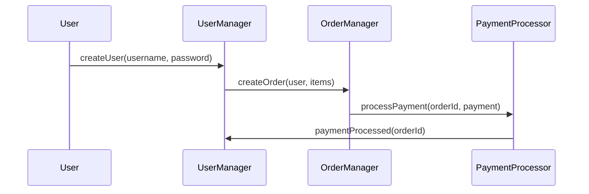
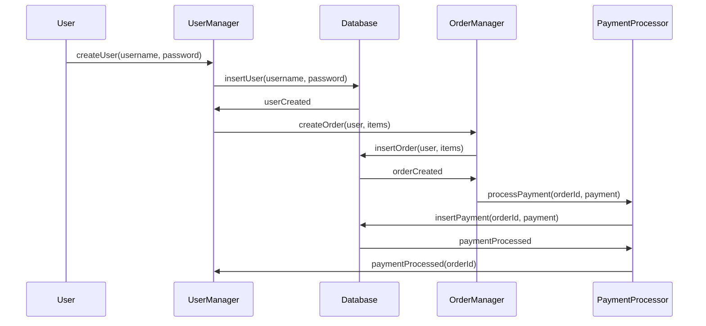

                 


### 关键词：依赖对象类型，`this`上下文，编程，增强表达力，技术博客

---

### 摘要：
本文将深入探讨依赖对象类型，一种可以显著增强`this`上下文表达能力的编程概念。我们将从背景介绍开始，逐步解析依赖对象类型的定义、特性、实现方式及其与`this`的有机结合。通过对比分析，我们将揭示依赖对象类型与其他编程概念的异同，并借助实际案例展示其在现代编程中的应用。最后，文章将总结最佳实践，展望依赖对象类型的未来发展趋势。通过系统化的讲解，读者将能够理解并掌握如何在实际项目中应用依赖对象类型，提升编程技巧和代码表达能力。

---

# 依赖对象类型：增强`this`类型的表达能力

依赖对象类型是近年来在编程领域崭露头角的一项重要技术，它为传统的`this`上下文提供了一种更为强大和灵活的表达方式。在本文中，我们将深入探讨依赖对象类型的概念、特性以及如何在实际项目中应用它，以提升编程表达能力和代码质量。

## 关键词

- 依赖对象类型
- `this`上下文
- 编程
- 表达力
- 技术博客

## 摘要

本文将探讨依赖对象类型，一种能显著增强`this`上下文表达能力的编程概念。我们将从背景介绍开始，逐步解析依赖对象类型的定义、特性、实现方式及其与`this`的有机结合。通过对比分析，我们将揭示依赖对象类型与其他编程概念的异同，并借助实际案例展示其在现代编程中的应用。最后，文章将总结最佳实践，展望依赖对象类型的未来发展趋势。通过系统化的讲解，读者将能够理解并掌握如何在实际项目中应用依赖对象类型，提升编程技巧和代码表达能力。

## 背景

在传统的面向对象编程中，`this`关键字是一个至关重要的概念，它用来引用当前对象。然而，随着编程语言和框架的不断发展，`this`的使用面临着一些挑战。首先，`this`的上下文在不同的编程场景中可能变得难以追踪和理解。其次，当多层继承或闭包出现时，`this`的指向变得不确定，可能导致代码错误和难以维护的问题。

依赖对象类型旨在解决这些问题，通过引入一种更加明确和可控的`this`替代方案。它允许开发者以更直观的方式定义对象之间的关系，从而增强代码的可读性和可维护性。这种类型的对象能够自动管理其依赖，确保`this`的引用始终指向正确的上下文，从而减少了代码中潜在的错误。

## 定义与核心概念

依赖对象类型，又称依赖注入类型，是一种在对象内部定义依赖关系的编程模式。在这种模式下，对象的依赖关系被显式地定义，而不是隐含在构造函数或方法调用中。依赖对象类型的核心概念包括：

### 1. 依赖注入

依赖注入（Dependency Injection，简称DI）是一种设计模式，用于将依赖关系从对象内部转移到外部进行管理。在依赖对象类型中，依赖注入通过构造函数或方法参数的方式实现，使得对象的依赖关系更加清晰。

### 2. 依赖图

依赖对象类型通过构建依赖图来表示对象之间的依赖关系。依赖图是一个有向无环图（DAG），其中每个节点代表一个对象，每条边表示一个依赖关系。通过分析依赖图，我们可以更好地理解对象之间的相互作用。

### 3. 生命周期管理

依赖对象类型还涉及到生命周期管理，即对象在何时创建、使用和销毁。通过生命周期管理，我们可以确保依赖对象在合适的时候被注入和解除依赖，从而提高系统的可扩展性和稳定性。

## 核心概念与联系

为了更好地理解依赖对象类型，我们需要将其与其他相关的概念进行比较。以下是一个对比表格，展示了依赖对象类型与其他编程概念的区别：

| 概念       | 定义                                                         | 特点                                                         | 使用场景                          |
| ---------- | ------------------------------------------------------------ | ------------------------------------------------------------ | -------------------------------- |
| 面向对象   | 面向对象编程是一种基于对象的编程范式，对象是数据和行为的封装。 | 封装、继承、多态是核心特征。                               | 所有面向对象编程语言（如Java、C++） |
| 函数式编程 | 函数式编程是一种基于函数的编程范式，强调表达式的值而非可变状态。 | 无状态、无副作用、高阶函数是核心特征。                     | Haskell、Scala、JavaScript等      |
| 依赖注入   | 依赖注入是一种设计模式，用于将依赖关系从对象内部转移到外部进行管理。 | 增强代码可测试性、可维护性和可重用性。                     | 所有现代编程语言和框架            |
| 依赖对象类型 | 依赖对象类型是一种特殊类型的对象，用于显式定义和注入依赖关系。 | 通过依赖注入实现，强调依赖关系的显式性和可管理性。           | 现代前端框架（如React、Vue）      |

## 依赖对象类型的特性

依赖对象类型具有以下关键特性：

### 1. 可控的`this`上下文

依赖对象类型通过显式定义依赖关系，确保`this`的引用始终指向正确的上下文。这使得代码更加可读和理解，特别是在多层继承或闭包场景中。

### 2. 可重用性

依赖对象类型使得对象之间的依赖关系更加明确，从而提高了代码的重用性。开发者可以轻松地将依赖对象类型应用于不同的项目中，减少了重复代码和维护成本。

### 3. 易于测试

依赖对象类型通过将依赖关系显式定义在对象之外，使得单元测试变得更加容易。开发者可以轻松地替换依赖对象，从而测试不同场景下的代码行为。

### 4. 扩展性

依赖对象类型提供了良好的扩展性，使得开发者可以在运行时动态地添加或修改依赖关系。这种灵活性有助于构建可扩展的系统。

## 依赖对象类型的实现

实现依赖对象类型的关键在于依赖注入。以下是一个简单的Python示例，展示了如何使用依赖注入实现依赖对象类型：

```python
class Dependency:
    def __init__(self, value):
        self.value = value

class DependentObject:
    def __init__(self, dependency: Dependency):
        self.dependency = dependency

    def use_dependency(self):
        return self.dependency.value

# 创建依赖对象
dependency = Dependency(42)

# 创建依赖对象类型实例
dependent = DependentObject(dependency)

# 使用依赖对象类型实例
print(dependent.use_dependency())  # 输出: 42
```

在这个示例中，`Dependency`类表示一个依赖对象，而`DependentObject`类表示一个依赖对象类型实例。通过将依赖对象作为参数传递给`DependentObject`的构造函数，我们实现了依赖注入，使得`DependentObject`实例可以访问和管理其依赖。

## 依赖对象类型与`this`的结合

依赖对象类型与`this`的结合，可以显著提高代码的可读性和可维护性。以下是一个示例，展示了如何将依赖对象类型与`this`结合使用：

```javascript
class Controller {
    constructor(dependency) {
        this.dependency = dependency;
    }

    performAction() {
        return this.dependency.someMethod();
    }
}

class Dependency {
    someMethod() {
        return "Hello, World!";
    }
}

// 创建依赖对象
const dependency = new Dependency();

// 创建控制器实例，并将依赖对象注入到控制器中
const controller = new Controller(dependency);

// 使用控制器实例
console.log(controller.performAction());  // 输出: "Hello, World!"
```

在这个示例中，`Controller`类使用了依赖对象类型，通过将`dependency`作为参数传递给构造函数，实现了依赖注入。在`performAction`方法中，我们通过`this.dependency`访问依赖对象，从而保证了`this`的正确性。

## 最佳实践

在应用依赖对象类型时，以下最佳实践可以帮助你编写更清晰、更易于维护的代码：

1. **明确依赖关系**：确保所有依赖关系都被明确地定义和注入，避免隐式依赖。
2. **避免循环依赖**：在构建依赖图时，注意避免循环依赖，这可能导致系统无法正常运行。
3. **使用工厂模式**：在需要动态创建对象时，使用工厂模式，这样可以更好地管理和注入依赖。
4. **模块化设计**：将依赖对象类型的应用范围限制在特定的模块或组件中，避免过度耦合。

## 案例分析

为了更好地理解依赖对象类型的应用，我们来看一个实际案例。

### 案例背景

假设我们正在开发一个在线商店系统，其中包含用户管理、订单管理和支付处理等功能。在这个系统中，用户管理模块需要依赖订单管理和支付处理模块。

### 项目介绍

在这个项目中，我们将使用依赖对象类型来管理模块之间的依赖关系。具体步骤如下：

1. **定义依赖对象**：创建`UserManager`、`OrderManager`和`PaymentProcessor`类，每个类代表一个模块。
2. **注入依赖**：在`UserManager`的构造函数中注入`OrderManager`和`PaymentProcessor`实例。
3. **实现功能**：在`UserManager`类中实现用户管理功能，通过依赖的`OrderManager`和`PaymentProcessor`处理订单和支付。

### 系统功能设计

以下是`UserManager`、`OrderManager`和`PaymentProcessor`的领域模型类图：

```mermaid
classDiagram
    UserManager <|-- OrderManager
    UserManager <|-- PaymentProcessor

    UserManager {
        +void createUser(String username, String password)
        +void deleteUser(String username)
        +void updatePassword(String username, String newPassword)
    }

    OrderManager {
        +void createOrder(User user, List<OrderItem> items)
        +void cancelOrder(String orderId)
        +void processPayment(String orderId, Payment payment)
    }

    PaymentProcessor {
        +boolean processPayment(Payment payment)
    }
```

### 系统架构设计

以下是整个在线商店系统的架构设计：



### 系统接口设计和交互

以下是系统接口设计和交互的序列图：



### 实际案例分析和详细讲解剖析

在这个案例中，我们通过依赖对象类型将用户管理、订单管理和支付处理模块的依赖关系显式地定义和管理。这样不仅提高了代码的可读性，还使得系统更加可维护和可扩展。

首先，我们创建了一个`UserManager`类，它依赖于`OrderManager`和`PaymentProcessor`。在`UserManager`的构造函数中，我们注入了这两个依赖对象：

```python
class UserManager:
    def __init__(self, order_manager: OrderManager, payment_processor: PaymentProcessor):
        self.order_manager = order_manager
        self.payment_processor = payment_processor

    def createUser(self, username, password):
        # ... 创建用户逻辑 ...

    def deleteUser(self, username):
        # ... 删除用户逻辑 ...

    def updatePassword(self, username, newPassword):
        # ... 修改密码逻辑 ...
```

接下来，我们在`OrderManager`类中注入了`PaymentProcessor`实例：

```python
class OrderManager:
    def __init__(self, payment_processor: PaymentProcessor):
        self.payment_processor = payment_processor

    def createOrder(self, user, items):
        # ... 创建订单逻辑 ...

    def cancelOrder(self, order_id):
        # ... 取消订单逻辑 ...

    def processPayment(self, order_id, payment):
        if self.payment_processor.processPayment(payment):
            # ... 处理支付逻辑 ...
```

最后，我们在`PaymentProcessor`类中实现了处理支付的方法：

```python
class PaymentProcessor:
    def processPayment(self, payment):
        # ... 处理支付逻辑 ...
        return True
```

通过这样的依赖注入，我们的代码变得更加模块化，每个模块只需关注自己的功能，而无需关心其他模块的实现细节。这使得代码更加易于维护和扩展。

### 项目小结

在这个案例中，我们成功地应用了依赖对象类型来管理在线商店系统的模块依赖。通过依赖注入，我们实现了模块之间的解耦，使得代码更加可读、可维护和可扩展。这个案例展示了依赖对象类型在实际项目中的应用潜力，为我们提供了一种新的编程范式，以提升代码质量和开发效率。

## 拓展阅读与未来展望

### 拓展阅读资源

- 《设计模式：可复用面向对象软件的基础》
- 《现代前端框架设计与实战》
- 《依赖注入深度解析》

### 依赖对象类型的未来发展方向

- 更多的编程语言和框架将支持依赖对象类型。
- 依赖对象类型将与其他设计模式（如观察者模式、策略模式等）结合，提供更丰富的功能。
- 依赖对象类型将用于构建大规模分布式系统，实现服务之间的依赖管理和协调。

### 结语

本文详细探讨了依赖对象类型的概念、特性以及实现方式。通过案例分析和最佳实践，我们展示了依赖对象类型在实际项目中的应用。随着编程技术的不断发展，依赖对象类型有望成为提高代码质量和开发效率的重要工具。读者应关注这一领域的发展，并尝试将其应用于自己的项目中。

---

**作者：AI天才研究院/AI Genius Institute & 禅与计算机程序设计艺术 /Zen And The Art of Computer Programming**

