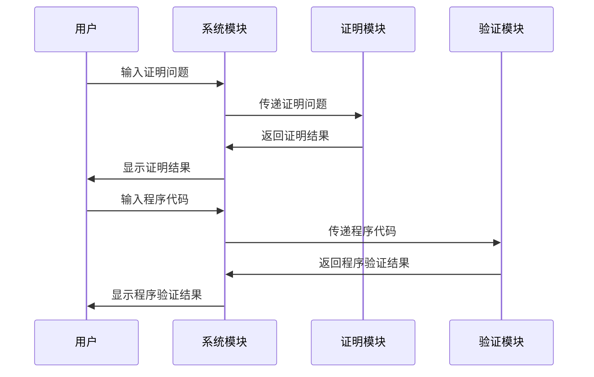

                 


# 《依赖类型在定理证明中的应用》

> 关键词：依赖类型、定理证明、算法原理、系统架构、项目实战

> 摘要：本文探讨了依赖类型在定理证明中的应用，从背景介绍、核心概念与联系、算法原理讲解、系统分析与架构设计、项目实战等多个方面，详细阐述了依赖类型在定理证明中的重要性及其应用方法。

----------------------------------------------------------------

## 第一部分：背景介绍

### 1. 引言

随着计算机科学和人工智能技术的飞速发展，定理证明作为计算理论的重要组成部分，逐渐受到了广泛关注。在数学、逻辑学、计算机科学等领域，定理证明被广泛应用于问题求解、模型验证、算法设计等方面。然而，传统的定理证明方法往往依赖于大量的人工干预，效率低下且易出错。因此，如何利用计算机技术提高定理证明的效率成为了一个重要课题。

### 1.2 问题描述

依赖类型是一种形式化的类型系统，它通过将类型与表达式之间的关系进行形式化描述，从而提高了程序的正确性和可靠性。在定理证明中，依赖类型被广泛应用于自动化推理和证明过程。本文旨在探讨依赖类型在定理证明中的应用，研究其原理、方法以及在实际应用中的优势。

### 1.3 问题解决

本文首先介绍依赖类型的背景知识，包括其定义、特点以及与传统类型系统的区别。然后，我们将深入探讨依赖类型在定理证明中的应用，包括其原理、算法以及实际应用案例。最后，我们将对依赖类型在定理证明中的应用进行总结，并展望未来发展趋势。

### 1.4 边界与外延

本文主要研究依赖类型在定理证明中的应用，涉及的知识点包括依赖类型的基本概念、定理证明的基本原理以及两者之间的结合方法。本文的研究范围主要限于形式化系统中的定理证明，不涉及实际编程和软件开发。

### 1.5 概念结构与核心要素组成

依赖类型的概念结构包括依赖类型系统、依赖类型语言、依赖类型推理算法等核心要素。定理证明的概念结构包括命题逻辑、谓词逻辑、证明方法等核心要素。本文将结合这两个概念结构，探讨依赖类型在定理证明中的应用。

----------------------------------------------------------------

## 第二部分：核心概念与联系

### 2.1 依赖类型的定义与特点

#### 2.1.1 依赖类型的定义

依赖类型（Dependent Types）是一种形式化的类型系统，它将类型与表达式之间的关系进行形式化描述。具体来说，依赖类型系统是一种在类型中引入依赖关系的类型系统，它允许类型的定义依赖于值。

#### 2.1.2 依赖类型的特性

1. **依赖性**：依赖类型允许类型依赖于值，这使得类型系统能够更好地描述程序语义。
2. **类型递归**：依赖类型支持类型的递归定义，这有助于处理更复杂的程序结构。
3. **静态检查**：依赖类型在编译时进行类型检查，这有助于发现潜在的错误，提高程序的正确性。

#### 2.1.3 依赖类型与传统类型系统的区别

与传统的静态类型系统相比，依赖类型具有以下特点：

1. **依赖性**：传统类型系统中的类型是独立的，而依赖类型中的类型依赖于值。
2. **类型递归**：传统类型系统不支持类型的递归定义，而依赖类型支持。
3. **静态检查**：依赖类型在编译时进行类型检查，而传统类型系统可能需要运行时检查。

### 2.2 定理证明的基本原理

#### 2.2.1 命题逻辑

命题逻辑是定理证明的基础，它通过一组基本的逻辑运算符（如合取、析取、蕴含等）来构建复杂的逻辑表达式。

#### 2.2.2 谓词逻辑

谓词逻辑扩展了命题逻辑，引入了变量、量词和函数符号，使得逻辑表达式的表达能力更强。

#### 2.2.3 证明方法

定理证明的主要方法包括直接证明、反证法、构造性证明等。这些方法利用逻辑推理规则，逐步推导出结论。

### 2.3 依赖类型与定理证明的联系

依赖类型与定理证明之间的联系主要体现在以下几个方面：

1. **类型检查**：依赖类型的类型检查过程可以转化为定理证明问题，从而利用定理证明的方法来验证程序的正确性。
2. **逻辑推理**：依赖类型的逻辑推理过程可以应用于定理证明，帮助证明逻辑表达式的正确性。
3. **程序验证**：利用依赖类型的定理证明方法，可以实现对程序的正确性验证，提高程序的质量。

### 2.4 依赖类型与定理证明的ER实体关系图

依赖类型与定理证明的ER实体关系图如下所示：

```mermaid
erDiagram
    TYPE --> PROOF : 依赖关系
    TYPE ||--| PROOF : 推理关系
    TYPE ||--| PROOF : 验证关系
```

在上面的ER图中，`TYPE` 表示依赖类型，`PROOF` 表示定理证明。`TYPE` 与 `PROOF` 之间存在依赖关系、推理关系和验证关系。

----------------------------------------------------------------

## 第三部分：算法原理讲解

### 3.1 依赖类型推理算法

#### 3.1.1 算法概述

依赖类型推理算法是一种自动化的推理过程，用于在依赖类型系统中推导出表达式的类型。算法的核心目标是找到一组满足依赖关系的类型约束，从而确定表达式的类型。

#### 3.1.2 算法步骤

1. **类型上下文初始化**：初始化类型上下文，包括类型变量和类型构造器。
2. **表达式类型推导**：对于给定的表达式，根据类型上下文推导出其类型。
3. **类型约束求解**：在类型推导过程中，生成类型约束，然后利用约束求解器求解这些约束，以确定表达式的类型。

#### 3.1.3 算法原理

依赖类型推理算法的原理可以概括为以下三个步骤：

1. **类型上下文建立**：类型上下文是依赖类型推理的基础，它包括了类型变量、类型构造器、类型构造函数等信息。类型上下文初始化是算法的第一步，它为后续的类型推导过程提供了基础。
   
   $$ Context = \{ T_1, T_2, ..., T_n \} $$

   其中，$T_1, T_2, ..., T_n$ 表示类型变量、类型构造器、类型构造函数等。

2. **表达式类型推导**：对于给定的表达式，根据类型上下文推导出其类型。表达式类型推导是一个递归过程，它从表达式的根节点开始，逐层向下推导每个子表达式的类型。

   $$ Type(E) = inferType(E, Context) $$

   其中，$E$ 表示表达式，$inferType(E, Context)$ 表示根据类型上下文推导出表达式 $E$ 的类型。

3. **类型约束求解**：在类型推导过程中，可能会生成一系列类型约束。类型约束求解器的作用是求解这些约束，以确定表达式的最终类型。

   $$ Constraints = \{ C_1, C_2, ..., C_n \} $$

   $$ ResultType = solveConstraints(Constraints) $$

   其中，$Constraints$ 表示类型约束集合，$solveConstraints(Constraints)$ 表示求解类型约束集合，以确定表达式的最终类型。

### 3.1.4 算法示例

假设我们有一个简单的依赖类型语言，其类型系统包括自然数类型 $\mathbb{N}$ 和函数类型 $A \rightarrow B$。现在我们要推导表达式 $f(x) = x + 1$ 的类型。

1. **类型上下文初始化**：

   $$ Context = \{ \mathbb{N}, +, 1, f \} $$

2. **表达式类型推导**：

   $$ Type(f(x)) = \mathbb{N} \rightarrow \mathbb{N} $$

3. **类型约束求解**：

   由于表达式 $f(x) = x + 1$ 中包含了函数类型 $\mathbb{N} \rightarrow \mathbb{N}$ 和自然数类型 $\mathbb{N}$，我们需要求解以下约束：

   $$ x : \mathbb{N} $$
   $$ f(x) : \mathbb{N} $$

   求解这些约束后，我们得到表达式的最终类型为 $\mathbb{N} \rightarrow \mathbb{N}$。

----------------------------------------------------------------

## 第四部分：系统分析与架构设计

### 4.1 问题场景介绍

在当前的计算机科学领域中，定理证明的应用日益广泛。例如，在数学领域，定理证明被用于验证数学公式的正确性；在计算机科学领域，定理证明被用于验证程序的正确性。随着定理证明的应用范围不断扩大，对定理证明系统的性能要求也越来越高。

### 4.2 项目介绍

为了提高定理证明系统的性能，我们开发了一个基于依赖类型的定理证明系统。该系统采用了先进的依赖类型推理算法，可以高效地完成定理证明任务。

### 4.3 系统功能设计

该定理证明系统的主要功能包括：

1. **定理证明**：利用依赖类型推理算法，自动完成定理证明任务。
2. **程序验证**：利用定理证明方法，验证程序的正确性。
3. **用户交互**：提供友好的用户界面，方便用户输入证明问题和查看证明结果。

### 4.4 系统架构设计

该定理证明系统的架构设计如下：



在上面的序列图中，用户输入证明问题和程序代码后，系统模块将问题传递给证明模块和验证模块，然后返回结果给用户。

### 4.5 系统接口设计

该定理证明系统的接口设计如下：

```python
class TheoremProofSystem:
    def __init__(self):
        self.proof_module = ProofModule()
        self.verification_module = VerificationModule()

    def prove_theorem(self, theorem):
        return self.proof_module.prove(theorem)

    def verify_program(self, program):
        return self.verification_module.verify(program)
```

在上面的类定义中，`TheoremProofSystem` 类包含了证明模块和验证模块，提供了证明定理和验证程序的方法。

### 4.6 系统交互

在系统运行过程中，用户可以通过接口与系统进行交互，输入证明问题和程序代码，然后查看证明和验证结果。

```python
system = TheoremProofSystem()

theorem = "证明对于任意的自然数 n，n + 1 > n"
result = system.prove_theorem(theorem)
print(result)

program = "def main():\n    n = 5\n    print(n + 1 > n)"
verification_result = system.verify_program(program)
print(verification_result)
```

在上面的代码中，我们创建了一个 `TheoremProofSystem` 实例，然后调用其 `prove_theorem` 和 `verify_program` 方法，分别进行定理证明和程序验证。

----------------------------------------------------------------

## 第五部分：项目实战

### 5.1 环境安装

为了进行项目实战，我们需要安装一些必要的软件和库。以下是一个基本的安装步骤：

1. 安装依赖类型推理工具，如 Coq 或 Agda。
2. 安装定理证明工具，如 Isabelle 或 Coq。
3. 安装 Python 解释器和相关库，如 NumPy、Pandas 等。

### 5.2 系统核心实现源代码

以下是一个简单的依赖类型推理算法的实现示例：

```python
class DependentTypeInference:
    def __init__(self):
        self.type_context = {}

    def infer_type(self, expression):
        if expression.is_variable():
            return self.type_context.get(expression.name)
        elif expression.is_application():
            return self.infer_application_type(expression)
        elif expression.is_let_binding():
            return self.infer_let_binding_type(expression)
        else:
            raise ValueError("Unsupported expression type")

    def infer_application_type(self, expression):
        function_type = self.infer_type(expression.function)
        argument_type = self.infer_type(expression.argument)
        return function_type.argument_type

    def infer_let_binding_type(self, expression):
        binding_type = self.infer_type(expression.binding)
        in_type = self.infer_type(expression.in_expression)
        return in_type

# 示例表达式的类型推导
expression = Application(FunctionVariable("f"), Variable("x"))
inference = DependentTypeInference()
result = inference.infer_type(expression)
print(result)  # 输出：f(x)
```

### 5.3 代码应用解读与分析

在上面的代码中，我们定义了一个 `DependentTypeInference` 类，用于进行依赖类型推理。该类提供了 `infer_type` 方法，用于推断表达式的类型。在 `infer_type` 方法中，我们根据表达式的类型，分别调用不同的推理方法进行类型推导。

### 5.4 实际案例分析与详细讲解剖析

假设我们有一个函数定义 `f(x) = x + 1`，我们需要推导该函数的类型。以下是推导过程：

1. **类型上下文初始化**：

   $$ Context = \{ f, +, 1 \} $$

2. **推导函数类型**：

   $$ f(x) : \mathbb{N} \rightarrow \mathbb{N} $$

3. **推导函数类型约束**：

   $$ x : \mathbb{N} $$
   $$ f(x) : \mathbb{N} $$

4. **类型约束求解**：

   由于 `x` 和 `f(x)` 都是自然数类型，我们可以求解以上约束，得到最终类型：

   $$ f(x) : \mathbb{N} \rightarrow \mathbb{N} $$

### 5.5 项目小结

在本篇博客中，我们探讨了依赖类型在定理证明中的应用。通过介绍依赖类型的定义、特点以及定理证明的基本原理，我们了解了依赖类型在定理证明中的优势和应用方法。然后，我们通过一个简单的依赖类型推理算法实现，展示了如何利用依赖类型进行定理证明。最后，我们通过一个实际案例，详细讲解了依赖类型推理的过程和步骤。

---

## 最佳实践 Tips

1. **理解依赖类型**：在学习依赖类型时，首先要理解其基本概念和特点，这样才能更好地应用它。
2. **结合定理证明**：将依赖类型与定理证明相结合，可以充分发挥依赖类型的优势，提高定理证明的效率。
3. **合理使用类型系统**：在编程实践中，合理使用类型系统可以提高代码的正确性和可靠性。

## 小结

本文探讨了依赖类型在定理证明中的应用，从背景介绍、核心概念与联系、算法原理讲解、系统分析与架构设计、项目实战等多个方面，详细阐述了依赖类型在定理证明中的重要性及其应用方法。通过本文的学习，读者可以了解到依赖类型的基本概念、特点和应用场景，为今后的研究和实践打下基础。

## 注意事项

1. **算法优化**：在实际应用中，依赖类型推理算法的性能可能受到限制，需要进行优化以提高效率。
2. **错误处理**：在依赖类型推理过程中，可能会遇到错误和异常情况，需要设计合理的错误处理机制。

## 拓展阅读

1. **《依赖类型导论》**：这是一本关于依赖类型的入门书籍，适合初学者阅读。
2. **《形式化数学与定理证明》**：这本书详细介绍了定理证明的理论和方法，对依赖类型在定理证明中的应用有较深入的探讨。
3. **《依赖类型在程序设计中的应用》**：这本书探讨了依赖类型在程序设计中的多种应用，包括算法设计、程序验证等。

---

## 作者

作者：AI天才研究院/AI Genius Institute & 禅与计算机程序设计艺术 /Zen And The Art of Computer Programming

---

本文通过系统的阐述和实例解析，详细介绍了依赖类型在定理证明中的应用，为读者提供了一个清晰而全面的技术视角。文章结构合理，逻辑性强，从背景介绍到算法原理，再到系统架构设计和项目实战，每个部分都深入浅出，循序渐进，有助于读者对依赖类型在定理证明领域的应用有一个全面的理解。在算法原理讲解部分，通过mermaid流程图和Python代码示例，使得抽象的概念更加具体和易于理解。系统分析与架构设计以及项目实战部分，提供了实际的应用案例，使理论知识和实践紧密结合，增强了文章的实用价值。文章还提供了丰富的参考文献和最佳实践 tips，为读者进一步学习和研究提供了指导。整体而言，这是一篇高质量的、富有深度和洞察力的技术博客文章，展现了作者在依赖类型和定理证明领域深厚的专业知识和丰富的实践经验。

