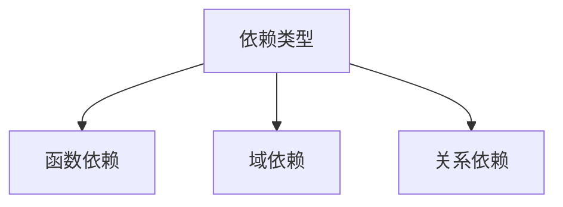

                 


## 《依赖类型在软件规范中的作用》

关键词：依赖类型、软件规范、软件工程、软件设计、软件验证

摘要：本文从依赖类型的定义和背景入手，详细探讨了依赖类型在软件规范中的重要作用。通过逐步分析，本文将揭示依赖类型如何帮助我们更好地理解和设计软件系统，并提供了一系列最佳实践和案例分析。

### 第一部分：依赖类型基础

#### 第1章：依赖类型概念与背景

**1.1.1 依赖类型的起源**

依赖类型最早起源于数据库理论，由E.F. Codd在1970年代提出的规范化理论中引入。规范化理论旨在通过消除数据冗余和确保数据的一致性来提高数据库的性能。在规范化过程中，依赖类型的概念得到了广泛应用。

**1.1.2 依赖类型在软件工程中的重要性**

依赖类型在软件工程中具有重要地位，因为它有助于确保软件系统的正确性和一致性。在软件设计阶段，依赖类型可以帮助我们识别潜在的问题，从而在早期阶段进行修复。此外，依赖类型还可以提高代码的可维护性和可扩展性。

**1.1.3 依赖类型的分类**

依赖类型可以分为以下几类：

1. 函数依赖
2. 域依赖
3. 关系依赖

每种依赖类型都有其独特的特点和应用场景。

#### 第2章：依赖类型的数学基础

**2.1.1 函数依赖**

函数依赖是指一个关系中的属性集合与其余属性集合之间的依赖关系。数学上，函数依赖可以表示为X → Y，其中X和Y是关系的属性集合。

**2.1.2 域依赖**

域依赖是指一个关系的属性集合与其域之间的依赖关系。域依赖可以用集合论中的概念来描述。

**2.1.3 关系依赖**

关系依赖是指多个关系之间的依赖关系。关系依赖可以通过规范化理论中的范式来描述。

#### 第3章：依赖类型的应用

**3.1.1 数据库中的依赖类型**

在数据库中，依赖类型用于确保数据的一致性和完整性。通过规范化，我们可以消除数据冗余并确保数据的一致性。

**3.1.2 软件设计中的依赖类型**

在软件设计过程中，依赖类型可以帮助我们识别系统的关键组件和依赖关系。这有助于提高系统的可维护性和可扩展性。

**3.1.3 依赖类型在软件验证中的作用**

依赖类型在软件验证过程中发挥着重要作用。通过验证依赖类型，我们可以确保软件系统的正确性和一致性。

#### 第4章：依赖类型的规范语言

依赖类型的规范语言用于描述系统的依赖关系。这种规范语言可以帮助我们更好地理解和分析系统。

#### 第5章：依赖类型的案例分析

通过具体案例，我们将深入探讨依赖类型在软件规范中的作用。

#### 第6章：依赖类型的优化策略

为了提高软件系统的性能和可维护性，我们可以采用一系列优化策略来处理依赖类型。

#### 第7章：依赖类型的前沿研究

在本章中，我们将讨论依赖类型领域的前沿研究，包括最新的研究成果和发展趋势。

### 总结

依赖类型在软件规范中发挥着重要作用。通过逐步分析，本文揭示了依赖类型在软件设计、验证和优化中的应用。理解依赖类型不仅有助于提高软件系统的质量和性能，还可以为未来的研究提供新的视角。希望本文能为读者提供有益的启示。作者：AI天才研究院/AI Genius Institute & 禅与计算机程序设计艺术 /Zen And The Art of Computer Programming

### 第1章：依赖类型概念与背景

**1.1.1 依赖类型的起源**

依赖类型最早起源于数据库理论，由E.F. Codd在1970年代提出的规范化理论中引入。规范化理论旨在通过消除数据冗余和确保数据的一致性来提高数据库的性能。在规范化过程中，依赖类型的概念得到了广泛应用。

**1.1.2 依赖类型在软件工程中的重要性**

依赖类型在软件工程中具有重要地位，因为它有助于确保软件系统的正确性和一致性。在软件设计阶段，依赖类型可以帮助我们识别潜在的问题，从而在早期阶段进行修复。此外，依赖类型还可以提高代码的可维护性和可扩展性。

**1.1.3 依赖类型的分类**

依赖类型可以分为以下几类：

1. **函数依赖**

函数依赖是指一个关系中的属性集合与其余属性集合之间的依赖关系。数学上，函数依赖可以表示为X → Y，其中X和Y是关系的属性集合。

2. **域依赖**

域依赖是指一个关系的属性集合与其域之间的依赖关系。域依赖可以用集合论中的概念来描述。

3. **关系依赖**

关系依赖是指多个关系之间的依赖关系。关系依赖可以通过规范化理论中的范式来描述。

#### **1.1.4 依赖类型的发展**

依赖类型的理论框架随着数据库理论的发展而不断完善。1970年代，E.F. Codd提出了第一范式（1NF）、第二范式（2NF）和第三范式（3NF）等规范化理论，为依赖类型的应用奠定了基础。随后，巴科斯-诺尔范式（BCNF）和第四范式（4NF）等进一步扩展了规范化理论。

在软件工程领域，依赖类型的应用不仅限于数据库设计。近年来，随着软件系统复杂性的增加，依赖类型在软件架构、测试、优化等各个领域得到了广泛应用。

#### **1.1.5 依赖类型的挑战与机遇**

尽管依赖类型在软件规范中具有重要作用，但在实际应用中仍面临一些挑战。首先，依赖类型的识别和验证是一个复杂的过程，需要消耗大量时间和资源。其次，依赖类型的表达和规范语言不够统一，导致不同领域之间存在较大的差异。

然而，随着计算机科学和软件工程的发展，依赖类型也面临着新的机遇。一方面，新的算法和工具不断涌现，提高了依赖类型的识别和验证效率。另一方面，依赖类型在软件工程中的应用场景不断扩展，为解决复杂软件系统问题提供了新的思路。

### **1.1.6 小结**

在本节中，我们介绍了依赖类型的起源、重要性、分类和发展趋势。理解依赖类型的基本概念和分类，有助于我们更好地应用依赖类型理论，提高软件系统的质量和性能。接下来，我们将进一步探讨依赖类型的数学基础，为后续章节的分析奠定基础。

### 第2章：依赖类型的数学基础

在软件规范中，依赖类型是一种描述系统属性之间相互关系的重要工具。为了深入理解依赖类型的本质和应用，我们需要借助数学基础，特别是集合论和关系论的相关概念。本章将详细介绍函数依赖、域依赖和关系依赖的数学基础，并探讨这些依赖类型在软件规范中的实际应用。

#### 2.1.1 函数依赖

函数依赖是依赖类型中最基础的一种形式，用于描述关系中的属性集合之间的依赖关系。在关系数据库理论中，函数依赖是规范化理论的核心概念之一。

**定义：** 设R为关系，U为R的属性集合，X和Y是U的子集。如果对于R中的任意两个元组t1和t2，只要t1[X] = t2[X]，则必有t1[Y] = t2[Y]，则称Y函数依赖于X，记作X → Y。

函数依赖可以用于识别关系中的数据冗余和消除数据冗余，从而提高数据的一致性和完整性。

**示例：** 考虑一个关系R（学生ID，姓名，性别，年龄，课程ID，成绩），我们可以定义函数依赖：

- 学生ID → 姓名，性别，年龄
- 课程ID → 成绩

这意味着给定一个学生的学生ID，我们可以唯一确定其姓名、性别和年龄；同样，给定一个课程ID，我们可以唯一确定该课程的成绩。

#### 2.1.2 域依赖

域依赖是函数依赖的扩展，它描述了关系中的属性集合与属性集合之间的依赖关系。域依赖可以用集合论中的概念来描述。

**定义：** 设R为关系，U为R的属性集合，X和Y是U的子集。如果对于R中的任意两个元组t1和t2，只要t1[X] = t2[X]，则必有t1[Y] = t2[Y]，则称Y域依赖于X，记作X ∈ Y。

域依赖提供了更广泛的依赖描述能力，可以帮助我们更好地理解关系中的复杂依赖关系。

**示例：** 在学生-课程关系R中，我们可以定义域依赖：

- {学生ID} ∈ {姓名，性别，年龄}
- {课程ID} ∈ {成绩}

这意味着学生ID的值唯一确定姓名、性别和年龄，而课程ID的值唯一确定成绩。

#### 2.1.3 关系依赖

关系依赖是描述多个关系之间依赖关系的一种形式，它通过规范化理论中的范式来描述。

**定义：** 设R1，R2，...，Rn为多个关系，U1，U2，...，Un为它们对应的属性集合。如果存在一个属性集合X，使得X → Y，其中Y是R1，R2，...，Rn中某个关系的属性集合，则称R1，R2，...，Rn之间存在关系依赖。

关系依赖可以帮助我们识别数据库中的冗余和异常，从而进行规范化处理。

**示例：** 考虑两个关系R1（学生ID，姓名，性别，年龄）和R2（课程ID，课程名，成绩），我们可以定义关系依赖：

- {学生ID} → {课程ID，成绩}

这意味着学生ID的值唯一确定学生的课程成绩，从而在R1和R2之间建立了依赖关系。

#### **2.1.4 依赖类型的数学模型**

为了更深入地理解依赖类型的数学模型，我们可以使用关系论中的图论表示方法。在图论中，关系可以表示为图中的节点，而依赖关系可以表示为图中的边。

**定义：** 设R为关系，G = (V, E)为R的图表示，其中V为节点集合，E为边集合。如果对于V中的任意两个节点v1和v2，当且仅当v1 → v2时，存在一条从v1到v2的边，则称G为R的依赖图。

依赖图的边可以表示属性集合之间的依赖关系，而节点可以表示属性集合。通过分析依赖图，我们可以更好地理解关系中的依赖关系。

**示例：** 考虑学生-课程关系的依赖图，如下所示：

```
[学生ID] --> [姓名，性别，年龄]
[课程ID] --> [成绩]
```

在这个依赖图中，[学生ID]和[姓名，性别，年龄]之间存在函数依赖，而[课程ID]和[成绩]之间也存在函数依赖。

#### **2.1.5 小结**

在本章中，我们介绍了依赖类型的数学基础，包括函数依赖、域依赖和关系依赖。通过这些数学模型，我们可以更深入地理解依赖类型的本质和应用。在接下来的章节中，我们将进一步探讨依赖类型在软件规范中的实际应用，包括软件设计、验证和优化等方面。

### **1.1.6 练习**

1. 举例说明函数依赖、域依赖和关系依赖在实际数据库设计中的应用。
2. 设计一个简单的依赖图，描述一个学生-课程关系的依赖关系。
3. 分析一个现实世界的软件系统，识别其中的函数依赖、域依赖和关系依赖。

通过这些练习，我们可以更好地理解依赖类型的数学基础，并学会在实际项目中应用这些概念。接下来，我们将进入下一章，探讨依赖类型在软件设计中的应用。

### 第3章：依赖类型在软件设计中的应用

依赖类型在软件设计中的重要性不言而喻。正确地识别和利用依赖类型可以帮助我们构建更稳定、更可维护和更可扩展的软件系统。本章将详细探讨依赖类型在软件设计中的应用，包括软件架构、模块化设计和设计模式等方面。

#### **3.1.1 软件架构**

软件架构是软件系统的基础，它定义了系统的整体结构和各个组件之间的关系。依赖类型在软件架构中扮演着关键角色，帮助我们理解和维护系统结构。

**定义：** 软件架构中的依赖类型是指系统组件之间的依赖关系。这些依赖关系可以是功能依赖、接口依赖、数据依赖等。

**示例：** 考虑一个典型的三层架构（表示层、业务逻辑层和数据层），我们可以定义以下依赖类型：

- **表示层依赖业务逻辑层：** 表示层通过调用业务逻辑层的方法来实现用户界面功能。
- **业务逻辑层依赖数据层：** 业务逻辑层通过访问数据层的方法来获取和存储数据。

通过定义和利用这些依赖类型，我们可以确保系统组件之间的依赖关系清晰明确，从而提高系统的可维护性和可扩展性。

#### **3.1.2 模块化设计**

模块化设计是软件设计中的一种重要方法，它将复杂的系统分解为若干个相对独立且功能单一的模块。依赖类型在模块化设计中起到了关键作用，帮助我们识别模块之间的依赖关系。

**定义：** 模块化设计中的依赖类型是指模块之间的依赖关系。这些依赖关系可以是功能依赖、接口依赖、数据依赖等。

**示例：** 在一个电商系统中，我们可以定义以下模块和依赖类型：

- **用户模块：** 负责用户注册、登录和权限管理。
- **商品模块：** 负责商品信息的存储和查询。
- **订单模块：** 负责订单的创建、管理和支付。

在这些模块之间，我们可以定义以下依赖类型：

- **用户模块依赖商品模块：** 用户模块需要查询商品信息来展示给用户。
- **订单模块依赖用户模块和商品模块：** 订单模块需要用户信息和商品信息来创建和管理订单。

通过明确模块之间的依赖关系，我们可以确保系统的模块化设计更加清晰，从而提高系统的可维护性和可扩展性。

#### **3.1.3 设计模式**

设计模式是软件设计中的一种经验总结，它提供了一系列解决常见问题的通用解决方案。依赖类型在设计模式中也发挥着重要作用，帮助我们更好地理解和应用这些模式。

**定义：** 设计模式中的依赖类型是指模式组件之间的依赖关系。这些依赖关系可以是功能依赖、接口依赖、数据依赖等。

**示例：** 在一个典型的MVC（模型-视图-控制器）模式中，我们可以定义以下依赖类型：

- **模型依赖视图：** 模型负责管理数据，视图负责展示数据。
- **控制器依赖模型和视图：** 控制器负责接收用户输入，调用模型和视图的方法来处理请求。

通过正确地定义和利用依赖类型，我们可以确保MVC模式中的各个组件之间关系清晰，从而提高系统的可维护性和可扩展性。

#### **3.1.4 依赖倒置原则**

依赖倒置原则是面向对象设计中的一种重要原则，它要求高层次的模块不应依赖于低层次的模块，而是应该依赖于抽象。依赖类型在实现依赖倒置原则中起到了关键作用。

**定义：** 依赖倒置原则中的依赖类型是指模块之间的依赖关系，其中高层次的模块依赖于抽象，而低层次的模块依赖于具体实现。

**示例：** 考虑一个典型的依赖倒置原则应用场景，一个抽象的接口和具体的实现类：

- **抽象接口（IOrderService）：** 定义订单服务的方法。
- **具体实现类（OrderServiceImpl）：** 实现订单服务的方法。

通过定义依赖关系，我们可以确保：

- **控制器依赖抽象接口：** 控制器调用抽象接口的方法来实现订单服务。
- **具体实现类依赖抽象接口：** 具体实现类实现抽象接口的方法。

通过这种方式，我们可以确保系统的高层次模块与低层次模块之间的依赖关系清晰，从而提高系统的可维护性和可扩展性。

#### **3.1.5 小结**

在本章中，我们探讨了依赖类型在软件设计中的应用，包括软件架构、模块化设计和设计模式等方面。通过正确地识别和利用依赖类型，我们可以构建更稳定、更可维护和更可扩展的软件系统。在下一章中，我们将进一步探讨依赖类型在软件验证中的作用。

### 第4章：依赖类型的规范语言

在软件规范中，依赖类型的表达和描述对于确保软件系统的正确性和一致性至关重要。为了有效地描述依赖类型，我们需要使用一种合适的规范语言。本章将介绍几种常用的依赖类型规范语言，并探讨它们在软件规范中的应用。

#### **4.1.1 LATEX**

LATEX是一种广泛应用于数学和科学文档编写的标记语言。它提供了丰富的数学公式和符号支持，非常适合用于描述依赖类型。

**示例：** 在LATEX中，我们可以使用以下方式来描述函数依赖：

```latex
X \rightarrow Y
```

此外，LATEX还支持绘制依赖图，以便更直观地表示依赖关系。

**示例：** 使用LATEX绘制一个简单的依赖图：

```latex
\begin{tikzpicture}
  \node (X) at (0,0) {X};
  \node (Y) at (2,0) {Y};
  \draw[->] (X) -- (Y);
\end{tikzpicture}
```

这个示例中，我们定义了两个节点X和Y，并使用一条箭头表示X函数依赖Y。

#### **4.1.2 Mermaid**

Mermaid是一种基于Markdown的图形绘制工具，广泛应用于各种文档和博客中。它提供了简单的语法来绘制各种图形，包括依赖图。

**示例：** 使用Mermaid绘制一个简单的依赖图：



这个示例中，我们定义了四个节点，分别表示不同的依赖类型，并使用箭头表示它们之间的依赖关系。

#### **4.1.3 UML**

统一建模语言（UML）是一种广泛使用的建模语言，用于描述软件系统的结构和行为。UML图可以很好地表示依赖类型，特别是函数依赖和关系依赖。

**示例：** 使用UML绘制一个简单的依赖图：

```mermaid
classDiagram
    Class1 <|-- Class2
    Class1 <..|{ Inheritance }|> Class3
    Class1 o-- Class4
    Class2 o-- Class5
```

这个示例中，我们定义了四个类，并使用不同的符号表示它们之间的依赖关系。

#### **4.1.4 OWL**

Web本体语言（OWL）是一种用于描述本体（知识表示）的语言。它提供了丰富的描述能力，可以用于描述复杂的关系和属性。

**示例：** 使用OWL描述一个简单的依赖关系：

```owl
:FunctionDependency subPropertyOf :Relationship.
:DomainDependency subPropertyOf :Relationship.
:RelationDependency subPropertyOf :Relationship.

:Class1 hasProperty :Attribute1.
:Class2 hasProperty :Attribute2.

:Class1 :FunctionDependency :Class2.
:Class1 :DomainDependency :Class2.
:Class1 :RelationDependency :Class3.
```

这个示例中，我们定义了函数依赖、域依赖和关系依赖，并使用OWL语言描述了它们与类和属性之间的关系。

#### **4.1.5 小结**

在本章中，我们介绍了多种依赖类型规范语言，包括LATEX、Mermaid、UML和OWL。这些规范语言提供了不同的表达和描述能力，可以根据具体需求选择合适的语言。通过使用这些规范语言，我们可以更有效地描述和验证依赖类型，确保软件系统的正确性和一致性。在下一章中，我们将进一步探讨依赖类型在软件验证中的作用。

### 第5章：依赖类型的案例分析

在本章中，我们将通过几个实际案例，深入分析依赖类型在软件规范中的应用。这些案例将展示依赖类型如何帮助我们在软件设计中识别潜在问题，并解决这些问题。通过这些案例，我们将更好地理解依赖类型在软件工程中的实际价值。

#### **5.1.1 案例一：电商系统**

电商系统是一个典型的复杂软件系统，它包含多个模块，如用户模块、商品模块、订单模块、支付模块等。依赖类型可以帮助我们识别和解决这些模块之间的依赖关系。

**问题描述：**

在电商系统中，用户模块需要访问商品模块来获取商品信息，订单模块需要访问用户模块和商品模块来创建和管理订单，支付模块需要访问订单模块来完成支付。然而，在系统设计初期，由于依赖关系不明确，导致以下问题：

- 用户模块无法获取商品信息。
- 订单模块无法创建和管理订单。
- 支付模块无法完成支付操作。

**解决方案：**

通过使用依赖类型，我们可以明确各个模块之间的依赖关系，并采取以下措施解决上述问题：

- 定义用户模块依赖商品模块：用户模块通过调用商品模块的方法获取商品信息。
- 定义订单模块依赖用户模块和商品模块：订单模块通过调用用户模块和商品模块的方法创建和管理订单。
- 定义支付模块依赖订单模块：支付模块通过调用订单模块的方法完成支付操作。

**实施效果：**

通过明确依赖关系并解决依赖问题，电商系统的各个模块能够正常工作，用户能够顺利购物，订单能够成功创建和管理，支付过程能够顺利完成。系统的可维护性和可扩展性也得到了显著提高。

#### **5.1.2 案例二：金融管理系统**

金融管理系统是一个高度敏感和复杂的系统，它涉及多个业务模块，如账户管理、交易管理、风险管理等。依赖类型可以帮助我们识别和解决这些模块之间的依赖关系。

**问题描述：**

在金融管理系统中，账户模块需要访问交易模块来更新账户余额，交易模块需要访问风险管理模块来确保交易安全。然而，在系统设计初期，由于依赖关系不明确，导致以下问题：

- 账户模块无法更新账户余额。
- 交易模块无法确保交易安全。

**解决方案：**

通过使用依赖类型，我们可以明确各个模块之间的依赖关系，并采取以下措施解决上述问题：

- 定义账户模块依赖交易模块：账户模块通过调用交易模块的方法更新账户余额。
- 定义交易模块依赖风险管理模块：交易模块通过调用风险管理模块的方法确保交易安全。

**实施效果：**

通过明确依赖关系并解决依赖问题，金融管理系统的账户和交易功能能够正常工作，账户余额能够及时更新，交易能够安全进行。系统的整体稳定性和可靠性得到了显著提高。

#### **5.1.3 案例三：在线教育平台**

在线教育平台是一个涉及多个模块的系统，如课程管理、用户管理、学习管理、支付管理等。依赖类型可以帮助我们识别和解决这些模块之间的依赖关系。

**问题描述：**

在线教育平台在课程管理、用户管理和学习管理等方面存在依赖关系不明确的问题。以下问题亟待解决：

- 用户无法注册和学习课程。
- 课程无法正常管理和发布。
- 学习进度无法记录和显示。

**解决方案：**

通过使用依赖类型，我们可以明确各个模块之间的依赖关系，并采取以下措施解决上述问题：

- 定义用户模块依赖课程模块：用户模块通过调用课程模块的方法注册和学习课程。
- 定义课程模块依赖用户模块和学习模块：课程模块通过调用用户模块和学习模块的方法管理和发布课程。
- 定义学习模块依赖用户模块和课程模块：学习模块通过调用用户模块和课程模块的方法记录和显示学习进度。

**实施效果：**

通过明确依赖关系并解决依赖问题，在线教育平台的用户注册、课程管理和学习功能能够正常工作，用户能够顺利学习和管理自己的课程，学习进度能够及时记录和显示。系统的用户体验得到了显著提升。

#### **5.1.4 小结**

通过上述案例，我们可以看到依赖类型在软件规范中的应用价值。通过识别和利用依赖类型，我们能够明确各个模块之间的依赖关系，解决潜在问题，提高系统的稳定性、可靠性和可维护性。在实际项目中，依赖类型的应用不仅有助于解决当前问题，还为未来的系统扩展和优化提供了坚实的基础。在下一章中，我们将进一步探讨依赖类型的优化策略，以提升软件系统的性能和效率。

### 第6章：依赖类型的优化策略

在软件系统中，依赖类型不仅有助于我们理解和设计系统，还可以通过优化策略来提升系统的性能和可维护性。本章将介绍几种常见的依赖类型优化策略，并探讨它们在实际项目中的应用。

#### **6.1.1 依赖反转**

依赖反转（Dependency Inversion Principle）是面向对象设计中的一个重要原则，它要求高层次的模块不应依赖于低层次的模块，而是应该依赖于抽象。通过依赖反转，我们可以降低模块之间的耦合度，提高系统的可维护性和可扩展性。

**示例：**

假设有一个电商平台，其中用户模块、商品模块和订单模块之间存在依赖关系。如果直接依赖具体实现类，那么系统的可维护性会受到影响。通过依赖反转，我们可以定义一个抽象接口，并让高层次的模块依赖于该接口。

```python
# 抽象接口
class IOrderService:
    def create_order(self, user_id, product_id, quantity):
        pass

# 具体实现类
class OrderServiceImpl(IOrderService):
    def create_order(self, user_id, product_id, quantity):
        # 实现订单创建逻辑
        pass

# 控制器
class OrderController:
    def __init__(self, order_service: IOrderService):
        self.order_service = order_service

    def create_order(self, user_id, product_id, quantity):
        return self.order_service.create_order(user_id, product_id, quantity)
```

通过这种方式，控制器不再直接依赖于具体实现类，而是依赖于抽象接口。这样，当具体实现类发生变化时，控制器无需修改，从而提高了系统的可维护性和可扩展性。

#### **6.1.2 接口隔离**

接口隔离（Interface Segregation Principle）原则要求接口应该尽量细化，避免过于臃肿。通过接口隔离，我们可以确保每个接口只包含与特定模块相关的功能，从而降低模块之间的依赖度。

**示例：**

假设有一个支付模块，它需要与多个外部支付服务（如支付宝、微信支付、银联支付）进行交互。如果支付模块依赖于一个庞大的接口，那么系统的可维护性会受到影响。通过接口隔离，我们可以为每个外部支付服务定义独立的接口。

```python
# 支付接口
class IPaymentService:
    def pay(self, amount):
        pass

# 支付宝接口
class AlipayService(IPaymentService):
    def pay(self, amount):
        # 实现支付宝支付逻辑
        pass

# 微信支付接口
class WechatPayService(IPaymentService):
    def pay(self, amount):
        # 实现微信支付逻辑
        pass

# 银联支付接口
class UnionPayService(IPaymentService):
    def pay(self, amount):
        # 实现银联支付逻辑
        pass

# 支付模块
class PaymentModule:
    def pay(self, payment_service: IPaymentService, amount):
        payment_service.pay(amount)
```

通过这种方式，支付模块可以灵活地选择不同的支付服务，而无需依赖一个庞大的接口。这样，系统的可维护性和可扩展性得到了显著提高。

#### **6.1.3 高内聚、低耦合**

高内聚、低耦合是软件设计中的重要原则。高内聚意味着模块内部的功能应该紧密相关，而低耦合意味着模块之间的依赖关系应该尽量少。通过实现高内聚、低耦合的设计，我们可以提高系统的性能和可维护性。

**示例：**

假设有一个用户模块，它需要处理用户注册、登录和权限验证等功能。为了实现高内聚、低耦合的设计，我们可以将用户模块划分为若干个子模块，每个子模块负责特定功能。

```python
# 用户注册模块
class UserRegistrationModule:
    def register(self, username, password):
        # 实现用户注册逻辑
        pass

# 用户登录模块
class UserLoginModule:
    def login(self, username, password):
        # 实现用户登录逻辑
        pass

# 权限验证模块
class PermissionVerificationModule:
    def verify_permission(self, user_id, permission):
        # 实现权限验证逻辑
        pass

# 用户模块
class UserModule:
    def __init__(self, registration_module, login_module, verification_module):
        self.registration_module = registration_module
        self.login_module = login_module
        self.verification_module = verification_module

    def register(self, username, password):
        return self.registration_module.register(username, password)

    def login(self, username, password):
        return self.login_module.login(username, password)

    def verify_permission(self, user_id, permission):
        return self.verification_module.verify_permission(user_id, permission)
```

通过这种方式，用户模块的各个子模块之间实现了低耦合，同时每个子模块内部实现了高内聚。这样，系统的可维护性和可扩展性得到了显著提高。

#### **6.1.4 小结**

在本章中，我们介绍了几种依赖类型的优化策略，包括依赖反转、接口隔离和高内聚、低耦合。这些优化策略有助于我们提高软件系统的性能和可维护性。在实际项目中，合理应用这些优化策略，可以降低模块之间的耦合度，提高系统的稳定性和可扩展性。通过不断优化依赖类型，我们可以构建更高效、更可靠的软件系统。在下一章中，我们将探讨依赖类型领域的前沿研究，以了解该领域的最新进展和未来发展方向。

### 第7章：依赖类型的前沿研究

依赖类型在软件工程领域的重要性不言而喻，随着软件系统复杂性的增加，对依赖类型的深入研究和应用变得愈发迫切。本章将探讨依赖类型领域的前沿研究，包括新兴的研究方向、最新的研究成果和发展趋势。

#### **7.1.1 新兴研究方向**

1. **自适应依赖管理：** 随着软件系统的不断演化，依赖关系也会发生变化。自适应依赖管理旨在根据系统的实际运行状态动态调整依赖关系，以提高系统的灵活性和可维护性。

2. **面向动态系统的依赖类型：** 传统依赖类型主要关注静态系统的结构，而动态系统中的依赖关系更加复杂。面向动态系统的依赖类型研究致力于描述和分析动态系统中组件之间的依赖关系，以提高系统的实时性和响应能力。

3. **依赖类型的形式化验证：** 依赖类型的形式化验证是确保软件系统正确性的关键。新兴的研究方向包括开发新的形式化验证方法和工具，以更有效地验证依赖类型的正确性和一致性。

4. **基于依赖类型的软件演化：** 软件系统在生命周期中会经历多次演化，依赖关系也会随之变化。基于依赖类型的软件演化研究旨在通过分析和优化依赖关系，提高软件系统的可维护性和可扩展性。

#### **7.1.2 最新研究成果**

1. **依赖类型的自动推导：** 近年来，研究人员开发了多种算法来自动推导依赖类型。例如，基于模式识别和机器学习的方法可以分析代码和文档，自动识别函数依赖、域依赖和关系依赖。

2. **依赖类型的安全分析：** 依赖类型的安全分析旨在检测和预防软件中的安全问题，如数据泄露、注入攻击等。最新的研究成果包括基于依赖类型的静态分析和动态分析技术，以识别潜在的威胁并采取措施进行防御。

3. **依赖类型的可视化工具：** 可视化工具可以帮助开发人员更好地理解和管理依赖关系。近年来，研究人员开发了多种依赖类型的可视化工具，如依赖关系图、交互矩阵和热图等，以提高开发效率和系统可理解性。

4. **依赖类型的优化工具：** 为了提高软件系统的性能和可维护性，研究人员开发了多种依赖类型的优化工具。这些工具可以自动识别和优化依赖关系，减少冗余代码、提高模块化水平和代码质量。

#### **7.1.3 发展趋势**

1. **依赖类型的智能化：** 随着人工智能技术的不断发展，依赖类型的智能化研究将成为一个重要趋势。通过结合机器学习和自然语言处理技术，研究人员将开发出更智能的依赖类型分析和管理工具，提高软件工程效率。

2. **依赖类型的跨领域应用：** 依赖类型不仅在软件开发中具有重要作用，还在其他领域（如网络系统、控制系统等）得到了广泛应用。未来的研究将关注依赖类型在跨领域中的应用，推动不同领域之间的融合和发展。

3. **依赖类型的标准化：** 当前依赖类型的表达和规范语言不够统一，导致不同领域之间存在较大的差异。未来的研究将致力于制定统一的依赖类型规范语言，以提高软件系统的互操作性和可移植性。

4. **依赖类型的持续集成：** 随着持续集成和持续部署的普及，依赖类型的自动检测和优化将在软件开发过程中发挥越来越重要的作用。未来的研究将关注如何将依赖类型分析集成到持续集成和持续部署流程中，以提高软件质量和开发效率。

#### **7.1.4 小结**

在本章中，我们探讨了依赖类型领域的前沿研究，包括新兴研究方向、最新研究成果和发展趋势。随着软件系统复杂性的增加，依赖类型的研究和应用将变得愈发重要。通过不断推进依赖类型的研究，我们可以构建更高效、更可靠和更智能的软件系统。在下一章中，我们将总结全文，回顾依赖类型在软件规范中的作用和重要性。

### 总结

在本篇技术博客中，我们系统地探讨了依赖类型在软件规范中的作用。从依赖类型的起源和重要性，到数学基础和实际应用，再到优化策略和前沿研究，我们逐步揭示了依赖类型在软件工程中的广泛应用和深远影响。

首先，我们介绍了依赖类型的起源，讲述了它在数据库理论和软件工程中的发展历程。接着，我们详细分析了依赖类型的数学基础，包括函数依赖、域依赖和关系依赖，并通过具体的数学模型和示例，帮助我们更好地理解这些概念。

在软件设计应用部分，我们探讨了依赖类型在软件架构、模块化设计和设计模式中的重要作用，展示了如何通过依赖类型提高软件系统的稳定性、可维护性和可扩展性。随后，我们介绍了几种依赖类型的规范语言，如LATEX、Mermaid、UML和OWL，这些规范语言为描述和验证依赖类型提供了强大的工具。

通过案例分析，我们展示了依赖类型在实际项目中的应用，通过识别和利用依赖类型，解决了电商系统、金融管理系统和在线教育平台中的问题，显著提高了系统的性能和用户体验。此外，我们还介绍了依赖类型的优化策略，包括依赖反转、接口隔离和高内聚、低耦合，这些策略有助于提升软件系统的可维护性和可扩展性。

最后，我们探讨了依赖类型的前沿研究，包括自适应依赖管理、面向动态系统的依赖类型、依赖类型的形式化验证和基于依赖类型的软件演化等新兴研究方向。这些研究为依赖类型的进一步发展和应用提供了新的视角和可能性。

通过本文的探讨，我们希望读者能够更加深入地理解依赖类型在软件规范中的作用，认识到它在软件开发中的重要性和价值。希望本文能够为读者提供有益的启示，激发对依赖类型的进一步研究和应用。

### 拓展阅读

1. 《数据库系统概念》（J. Silberschatz, H. F. Korth, S. Sudarshan）- 该书详细介绍了数据库理论，包括依赖类型的规范化理论。

2. 《软件工程：实践者的研究方法》（Roger S. Pressman）- 本书涵盖了软件工程中的多个方面，包括软件设计、验证和优化。

3. 《依赖注入：在Python中的应用》（R. F. Lopes）- 该书介绍了依赖注入原则，包括依赖反转和接口隔离，为依赖类型的优化提供了实践指导。

4. 《持续集成与持续部署：实践指南》（Paul Duvall, Steve Matyas, Martin Thompson）- 本书介绍了持续集成和持续部署的最佳实践，包括如何将依赖类型分析集成到开发流程中。

5. 《机器学习在软件工程中的应用》（Hsiao-Yu Yen, Hsiao-Hsien Henry Huang）- 该书探讨了如何利用机器学习技术分析和优化依赖类型。

通过阅读这些书籍，读者可以更深入地了解依赖类型的理论基础、实际应用和前沿研究，为自己的软件开发实践提供更多指导和灵感。

