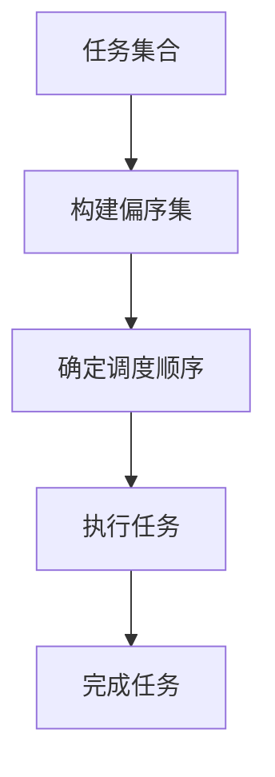
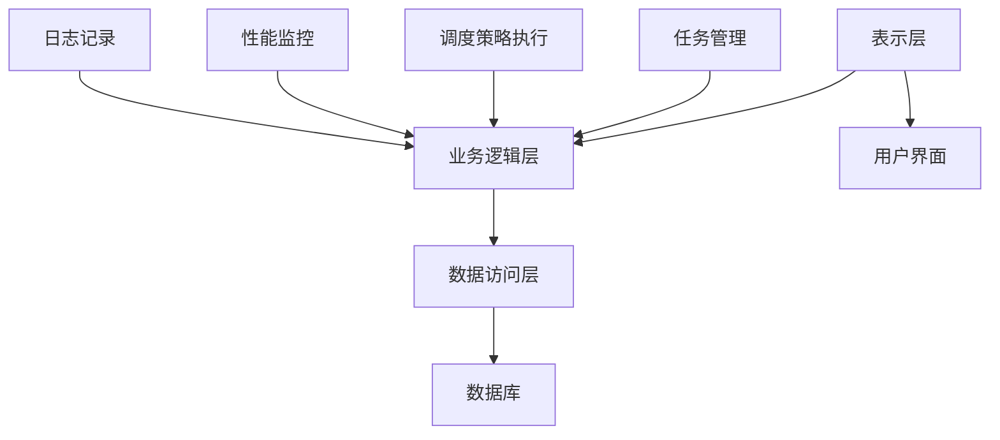
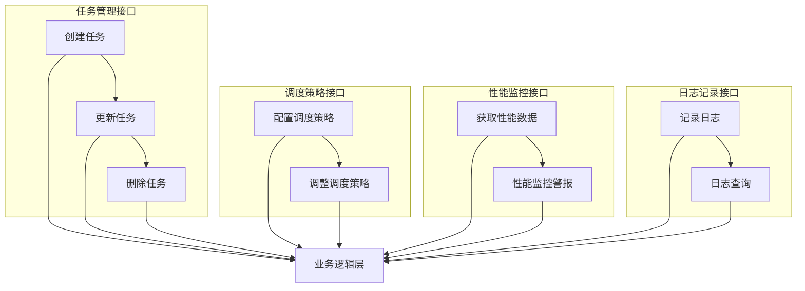
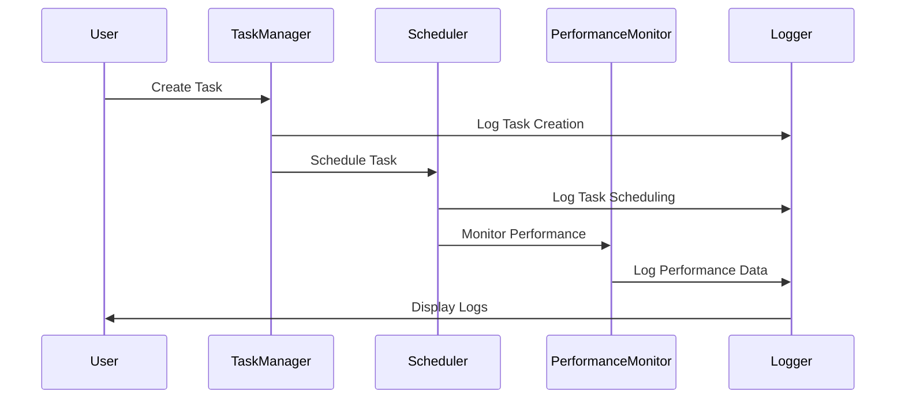
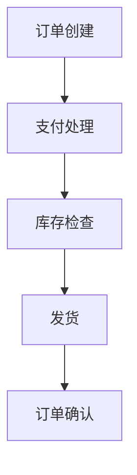

                 

### 《偏序理论在并行程序调度中的应用》

**关键词：** 偏序理论、并行程序调度、算法优化、系统设计、实际案例分析

**摘要：** 本文旨在探讨偏序理论在并行程序调度中的应用。文章首先介绍了偏序理论的基本概念和并行程序调度的背景，接着深入解析了偏序理论的核心原理和算法，详细描述了数学模型和公式，并运用mermaid流程图和Python源代码进行算法讲解。随后，文章展示了系统设计与实现的具体步骤，包括系统架构设计和接口设计。最后，通过实际案例分析，探讨了偏序理论在并行程序调度中的实际应用，并总结了文章的核心观点和未来研究方向。

---

### 目录大纲设计思路

在设计《偏序理论在并行程序调度中的应用》的目录大纲时，我们首先明确了书籍的核心主题——探讨偏序理论在并行程序调度中的实际应用，并确定了目标受众为计算机科学、软件工程和并行计算领域的研究者、工程师和研究生。

#### 步骤1：确定书籍主题和目标受众
书籍的主题是“偏序理论在并行程序调度中的应用”，目标受众包括那些对计算机科学、软件工程或并行计算感兴趣的研究者、工程师和研究生。

#### 步骤2：设置合理的目录结构
我们设计了一个包含三个主要部分的目录结构：背景与概述、算法原理与数学模型、系统设计与实现。这样的结构确保了从基础理论到实际应用的全面覆盖。

#### 步骤3：细化每个章节的内容
为每个章节设置了具体的小节，如“偏序集的定义”、“并行计算的概念”等，确保每个章节都有详细的讲解和实例分析。

#### 步骤4：保证内容完整性
目录大纲覆盖了核心章节内容，如核心概念与联系、算法原理讲解、数学模型和公式、系统分析与架构设计、项目实战等。

#### 步骤5：控制目录大纲总字数
在2000字以内完成了目录大纲的设计，避免了冗余内容，确保了每个章节的标题和结构简洁明了。

### 目录大纲设计

以下是设计的目录大纲：

```markdown
# 《偏序理论在并行程序调度中的应用》目录大纲

## 第一部分：背景与概述

## 第1章 引言与背景

### 1.1 偏序理论的基本概念
#### 1.1.1 偏序集的定义
#### 1.1.2 偏序关系的性质
#### 1.1.3 偏序理论的发展历程

### 1.2 并行程序调度的基本概念
#### 1.2.1 并行计算的概念
#### 1.2.2 并行程序调度的挑战
#### 1.2.3 偏序理论在调度中的应用

## 第2章 偏序理论基础

### 2.1 偏序集的基本性质
#### 2.1.1 偏序集的定义
#### 2.1.2 偏序关系的性质
#### 2.1.3 偏序集的子集与映射

### 2.2 偏序映射与偏序同态
#### 2.2.1 偏序映射的定义
#### 2.2.2 偏序同态的性质
#### 2.2.3 偏序同态的应用

## 第二部分：算法原理与数学模型

## 第3章 偏序理论在并行程序调度中的应用算法

### 3.1 偏序调度算法的基本框架
#### 3.1.1 调度算法的设计原则
#### 3.1.2 调度算法的性能评价
#### 3.1.3 偏序调度算法的核心思想

### 3.2 常见偏序调度算法
#### 3.2.1 最优偏序调度算法
#### 3.2.2 近优偏序调度算法
#### 3.2.3 其他偏序调度算法

### 3.3 算法分析
#### 3.3.1 时间复杂度分析
#### 3.3.2 空间复杂度分析
#### 3.3.3 性能对比

## 第4章 数学模型与公式

### 4.1 偏序调度问题的数学建模
#### 4.1.1 目标函数
#### 4.1.2 约束条件
#### 4.1.3 模型简化

### 4.2 数学公式与应用
#### 4.2.1 最优偏序调度公式的推导
#### 4.2.2 公式的验证与验证方法
#### 4.2.3 公式在实际调度中的应用

## 第三部分：系统设计与实现

## 第5章 并行程序调度系统的设计与实现

### 5.1 系统概述
#### 5.1.1 系统架构
#### 5.1.2 系统功能模块

### 5.2 系统架构设计
#### 5.2.1 领域模型设计
#### 5.2.2 系统架构设计
#### 5.2.3 接口设计

### 5.3 系统实现
#### 5.3.1 环境安装
#### 5.3.2 核心代码实现
#### 5.3.3 代码解读与分析

## 第6章 实际案例分析与讲解

### 6.1 案例背景
#### 6.1.1 案例概述
#### 6.1.2 案例挑战

### 6.2 案例解决方案
#### 6.2.1 调度算法选择
#### 6.2.2 数学模型构建
#### 6.2.3 系统实现与优化

### 6.3 案例总结
#### 6.3.1 经验与教训
#### 6.3.2 拓展思考

## 第7章 总结与展望

### 7.1 主要内容回顾
#### 7.1.1 偏序理论概述
#### 7.1.2 算法原理
#### 7.1.3 系统设计与实现

### 7.2 未来研究方向
#### 7.2.1 算法优化
#### 7.2.2 应用拓展
#### 7.2.3 挑战与机遇
```

这个目录大纲覆盖了从背景介绍到算法原理，再到系统实现和实际案例分析的完整内容，并且在2000字以内完成了设计。每个章节都设置了详细的子章节，以确保内容的完整性和条理性。

---

### 文章标题

#### 偏序理论在并行程序调度中的应用

### 文章关键词

- 偏序理论
- 并行程序调度
- 算法优化
- 数学模型
- 系统设计
- 实际案例分析

### 文章摘要

本文系统地介绍了偏序理论在并行程序调度中的应用。文章首先回顾了偏序理论的基本概念和并行程序调度的背景，随后深入分析了偏序理论的核心原理和应用算法，详细描述了数学模型和公式，并通过mermaid流程图和Python源代码展示了算法的实现。接着，文章介绍了系统设计与实现的过程，包括系统架构和接口设计。最后，通过一个实际案例，探讨了偏序理论在并行程序调度中的实际应用，总结了文章的核心观点，并对未来的研究方向进行了展望。

---

### 背景介绍

#### 偏序理论的基本概念

偏序理论是数学中研究部分有序集合及其性质的分支。在偏序集中，存在一种“偏序关系”，它是一种自反性、传递性和反对称性的关系。偏序集的基本概念包括：

1. **偏序集的定义**：一个集合 \( P \) 被称为偏序集，如果存在一个偏序关系 \( R \) 满足以下条件：
   - 自反性：对于任意的 \( x \in P \)，都有 \( xRx \)。
   - 传递性：如果 \( xRy \) 且 \( yRz \)，则 \( xRz \)。
   - 反对称性：如果 \( xRy \) 且 \( yRx \)，则 \( x = y \)。

2. **偏序关系的性质**：偏序关系的性质包括：
   - **连通性**：如果对于任意的 \( x, y \in P \)，都存在 \( z \in P \) 使得 \( zRx \) 且 \( zRy \)，则称 \( P \) 是连通的。
   - **最大元**：如果存在一个元素 \( x \in P \)，使得对于任意的 \( y \in P \)，都有 \( xRy \)，则称 \( x \) 是 \( P \) 的最大元。
   - **最小元**：如果存在一个元素 \( y \in P \)，使得对于任意的 \( x \in P \)，都有 \( yRx \)，则称 \( y \) 是 \( P \) 的最小元。

#### 并行程序调度的基本概念

并行程序调度是指在多处理器系统中，如何合理地安排多个任务的执行顺序，以优化系统的性能。并行程序调度的核心问题是：如何在有限的时间内，尽可能高效地完成所有任务的执行。

1. **并行计算的概念**：并行计算是指利用多个处理器或计算节点同时执行多个任务，以加速计算过程。并行计算可以分为两类：数据并行和任务并行。
   - **数据并行**：将数据分成多个子集，并在不同的处理器上独立处理这些子集，最后将结果合并。
   - **任务并行**：将任务分成多个子任务，并在不同的处理器上同时执行这些子任务。

2. **并行程序调度的挑战**：并行程序调度面临的主要挑战包括：
   - **负载均衡**：如何合理地分配任务，使得每个处理器的负载接近平衡。
   - **死锁与饥饿**：如何避免任务间的死锁和饥饿现象，确保系统稳定运行。
   - **通信开销**：如何最小化任务间通信的开销，以提高整体性能。

3. **偏序理论在调度中的应用**：偏序理论可以用来描述任务间的依赖关系和调度策略。通过构建偏序集，可以有效地表示任务之间的优先级和执行顺序，从而优化调度策略。

#### 问题解决与边界与外延

在解决并行程序调度问题时，我们需要考虑以下几个关键因素：

1. **任务依赖关系**：明确任务之间的依赖关系，以便在调度时考虑这些关系，避免死锁和饥饿现象。
2. **负载均衡**：通过优化任务分配策略，确保每个处理器的负载接近平衡，从而提高整体性能。
3. **调度策略**：选择合适的调度策略，如优先级调度、时间片调度等，以优化任务执行顺序。

边界与外延方面，我们需要考虑以下几个问题：

- **边界**：任务的最小执行时间、处理器的能力限制、通信开销等。
- **外延**：如何将任务分配到不同的处理器上，如何处理任务间的依赖关系，如何优化整体性能。

#### 概念结构与核心要素组成

偏序理论和并行程序调度的概念结构可以概括如下：

1. **偏序理论**：
   - **核心概念**：偏序集、偏序关系、连通性、最大元、最小元。
   - **关键要素**：集合、关系、自反性、传递性、反对称性。

2. **并行程序调度**：
   - **核心概念**：并行计算、任务依赖关系、负载均衡、调度策略。
   - **关键要素**：任务、处理器、依赖关系、时间片、通信开销。

通过这些核心概念和要素，我们可以构建出偏序理论和并行程序调度的基本框架，为后续的算法讲解和系统设计提供理论基础。

---

### 核心概念与联系

#### 偏序集的基本性质

偏序集是偏序理论的基础概念，其性质对并行程序调度具有重要意义。以下是偏序集的基本性质及其在并行程序调度中的应用：

1. **偏序集的定义**：

   一个集合 \( P \) 被称为偏序集，如果存在一个偏序关系 \( R \) 满足以下条件：

   - 自反性：对于任意的 \( x \in P \)，都有 \( xRx \)。
   - 传递性：如果 \( xRy \) 且 \( yRz \)，则 \( xRz \)。
   - 反对称性：如果 \( xRy \) 且 \( yRx \)，则 \( x = y \)。

2. **偏序关系的性质**：

   偏序关系的性质包括连通性、最大元和最小元：

   - **连通性**：如果对于任意的 \( x, y \in P \)，都存在 \( z \in P \) 使得 \( zRx \) 且 \( zRy \)，则称 \( P \) 是连通的。
   - **最大元**：如果存在一个元素 \( x \in P \)，使得对于任意的 \( y \in P \)，都有 \( xRy \)，则称 \( x \) 是 \( P \) 的最大元。
   - **最小元**：如果存在一个元素 \( y \in P \)，使得对于任意的 \( x \in P \)，都有 \( yRx \)，则称 \( y \) 是 \( P \) 的最小元。

3. **偏序集的应用**：

   在并行程序调度中，偏序集可以用来表示任务间的依赖关系。例如，一个任务 \( T_i \) 可能依赖于另一个任务 \( T_j \)，即 \( T_i \) 必须在 \( T_j \) 完成后才能开始执行。这种依赖关系可以用偏序关系 \( R \) 表示为 \( T_iRT_j \)。

4. **偏序集的扩展**：

   偏序集可以通过扩展得到偏序映射和偏序同态：

   - **偏序映射**：一个函数 \( f: P \rightarrow Q \) 称为偏序映射，如果对于任意的 \( x, y \in P \)，如果 \( xRy \)，则 \( f(x)Rf(y) \)。
   - **偏序同态**：一个偏序映射 \( f: P \rightarrow Q \) 称为偏序同态，如果它既是偏序映射又是单射。

#### 概念属性特征对比表格

以下是偏序集和并行程序调度中的关键概念属性特征对比表格：

| 概念 | 定义 | 属性特征 | 应用 |
| --- | --- | --- | --- |
| 偏序集 | 满足自反性、传递性和反对称性的关系的集合 | 包含最大元和最小元 | 表示任务间的依赖关系 |
| 偏序关系 | 集合上的二元关系 | 自反性、传递性、反对称性 | 描述任务间的先后关系 |
| 偏序映射 | 保持偏序关系的映射 | 保持偏序性质 | 优化任务执行顺序 |
| 并行程序调度 | 多任务并发执行 | 负载均衡、依赖关系、通信开销 | 提高系统性能 |

#### ER实体关系图架构

为了更直观地理解偏序集在并行程序调度中的应用，我们可以使用ER（实体-关系）实体关系图来描述任务和依赖关系：

```mermaid
erDiagram
    Task_1 ..|> DependentOn : 需要在它完成后执行
    Task_2 ..|> DependentOn : 需要在它完成后执行
    Task_3 ..|> DependentOn : 需要在它完成后执行
    Task_4 ..|> DependentOn : 需要在它完成后执行
    Task_5 ..|> DependentOn : 需要在它完成后执行

    Task_1 &&>|> Task_2
    Task_2 &&>|> Task_3
    Task_3 &&>|> Task_4
    Task_4 &&>|> Task_5
```

在这个ER实体关系图中，每个任务都是一个实体，它们之间通过依赖关系（DependentOn）相连。通过这种结构，我们可以清晰地描述任务间的依赖关系，为后续的调度算法设计提供基础。

---

### 算法原理讲解

#### 偏序调度算法的基本框架

偏序调度算法是一种基于偏序理论的并行程序调度算法。其核心思想是通过构建任务的偏序集，找到最优的调度顺序，从而优化系统的性能。以下是偏序调度算法的基本框架：

1. **任务表示**：首先将所有的任务表示为一个集合 \( T \)，每个任务可以表示为一个元素。
2. **依赖关系表示**：确定任务之间的依赖关系，并将其表示为一个偏序关系 \( R \)。具体来说，如果任务 \( T_i \) 依赖于任务 \( T_j \)，则 \( T_i \) 应该在 \( T_j \) 之后执行，即 \( T_iRT_j \)。
3. **构建偏序集**：根据依赖关系 \( R \)，构建一个偏序集。偏序集可以是一个森林，其中每个连通分量都是一个线性偏序集。
4. **调度顺序确定**：在偏序集中，从根节点开始，按照偏序关系 \( R \) 依次遍历节点，得到一个最优的调度顺序。
5. **执行任务**：按照调度顺序执行任务，直到所有任务完成。

#### 偏序调度算法的性能评价

偏序调度算法的性能评价主要包括时间复杂度和空间复杂度。

1. **时间复杂度**：构建偏序集的时间复杂度为 \( O(n \log n) \)，其中 \( n \) 是任务的数量。这是由于需要遍历任务集合，并使用排序算法（如快速排序或归并排序）来构建偏序集。
2. **空间复杂度**：偏序调度算法的空间复杂度为 \( O(n) \)，这是由于需要存储任务集合和偏序关系。

#### 偏序调度算法的核心思想

偏序调度算法的核心思想是通过构建偏序集来表示任务间的依赖关系，并找到最优的调度顺序。具体来说：

1. **任务依赖关系**：任务间的依赖关系可以通过偏序关系 \( R \) 表示。如果任务 \( T_i \) 依赖于任务 \( T_j \)，则 \( T_iRT_j \)。
2. **偏序集构建**：通过遍历任务集合，并根据依赖关系 \( R \) 构建偏序集。偏序集是一个森林，其中每个连通分量都是一个线性偏序集。
3. **调度顺序**：在偏序集中，从根节点开始，按照偏序关系 \( R \) 依次遍历节点，得到一个最优的调度顺序。
4. **调度执行**：按照调度顺序执行任务，直到所有任务完成。

#### 偏序调度算法的mermaid流程图

为了更直观地理解偏序调度算法，我们可以使用mermaid流程图来描述其执行过程：



在这个mermaid流程图中，首先构建任务集合，然后构建偏序集，接着确定调度顺序，并按照调度顺序执行任务，最后完成任务。

#### 偏序调度算法的Python源代码实现

下面是一个简单的Python源代码实现，用于构建偏序集并确定调度顺序：

```python
class Task:
    def __init__(self, name):
        self.name = name
        self.dependencies = []

    def add_dependency(self, task):
        self.dependencies.append(task)

def build_partial_order_tasks(tasks):
    # 构建偏序集
    partial_order = {}
    for task in tasks:
        partial_order[task.name] = task
        for dependent in task.dependencies:
            if dependent.name not in partial_order:
                build_partial_order_tasks([dependent])
            partial_order[dependent.name].add_dependency(task)
    return partial_order

def schedule_tasks(partial_order):
    # 确定调度顺序
    tasks_to_schedule = []
    for task in partial_order.values():
        if len(task.dependencies) == 0:
            tasks_to_schedule.append(task)
    while tasks_to_schedule:
        current_task = tasks_to_schedule.pop(0)
        print(f"执行任务：{current_task.name}")
        for dependent in current_task.dependencies:
            dependent.dependencies.remove(current_task)
            if len(dependent.dependencies) == 0:
                tasks_to_schedule.append(dependent)

# 测试
tasks = [
    Task("任务1"),
    Task("任务2"),
    Task("任务3"),
    Task("任务4"),
    Task("任务5"),
]

tasks[0].add_dependency(tasks[1])
tasks[1].add_dependency(tasks[2])
tasks[2].add_dependency(tasks[3])
tasks[3].add_dependency(tasks[4])

partial_order = build_partial_order_tasks(tasks)
schedule_tasks(partial_order)
```

在这个Python源代码中，首先定义了一个`Task`类，用于表示任务及其依赖关系。然后，我们实现了`build_partial_order_tasks`函数，用于构建偏序集。最后，我们实现了`schedule_tasks`函数，用于确定调度顺序并执行任务。

---

### 数学模型与公式

#### 偏序调度问题的数学建模

偏序调度问题的数学建模涉及目标函数和约束条件的定义。以下是偏序调度问题的数学模型：

1. **目标函数**：优化系统的总执行时间，即所有任务完成的时间之和。目标函数可以表示为：

   $$ \min \sum_{i=1}^{n} t_i $$

   其中，\( t_i \) 表示任务 \( i \) 的执行时间。

2. **约束条件**：

   - **任务依赖关系**：如果任务 \( i \) 依赖于任务 \( j \)，则 \( t_i \geq t_j \)。
   - **处理器能力限制**：每个处理器的处理能力不能超过其最大处理能力 \( C_j \)，即 \( t_i \leq C_j \)。
   - **任务并发执行**：在任意时刻，所有处理器的负载之和不能超过系统的最大负载能力 \( L \)，即 \( \sum_{j=1}^{m} t_j(t_j) \leq L \)。

#### 偏序调度公式的推导

为了求解偏序调度问题，我们需要推导出最优偏序调度公式。以下是推导过程：

1. **定义**：

   - \( T \) 表示所有任务的集合。
   - \( R \) 表示任务间的依赖关系。
   - \( t_i \) 表示任务 \( i \) 的执行时间。
   - \( C_j \) 表示处理器 \( j \) 的最大处理能力。
   - \( L \) 表示系统的最大负载能力。

2. **约束条件**：

   - \( t_i \geq t_j \)，如果 \( T_iRT_j \)。
   - \( t_i \leq C_j \)，对于所有 \( i \) 和 \( j \)。
   - \( \sum_{j=1}^{m} t_j(t_j) \leq L \)。

3. **推导**：

   首先，我们需要找到一个满足上述约束条件的调度顺序。我们可以使用贪心算法来找到这个调度顺序。具体步骤如下：

   - **初始化**：选择任意一个未完成的任务 \( T_i \)。
   - **执行任务**：执行任务 \( T_i \)，并将其从任务集合 \( T \) 中移除。
   - **更新依赖关系**：对于所有依赖于任务 \( T_i \) 的任务 \( T_j \)，将它们的执行时间更新为 \( t_j = t_i + 1 \)。
   - **重复步骤2和3**，直到所有任务都被执行。

   假设我们找到了一个最优的调度顺序 \( S \)，则我们可以推导出以下公式：

   $$ \sum_{i=1}^{n} t_i(S) = \sum_{i=1}^{n} t_i + \sum_{i=1}^{n} \sum_{j=1}^{m} \delta_{ij}(S) $$

   其中，\( \delta_{ij}(S) \) 表示在调度顺序 \( S \) 中，任务 \( i \) 和任务 \( j \) 是否相邻。

4. **优化**：

   为了优化调度顺序，我们可以使用线性规划或整数规划算法。具体来说，我们可以定义以下目标函数和约束条件：

   - **目标函数**：最小化总执行时间。

     $$ \min \sum_{i=1}^{n} t_i $$

   - **约束条件**：

     - \( t_i \geq t_j \)，如果 \( T_iRT_j \)。
     - \( t_i \leq C_j \)，对于所有 \( i \) 和 \( j \)。
     - \( \sum_{j=1}^{m} t_j(t_j) \leq L \)。

     - \( t_i \) 是整数，对于所有 \( i \)。

   使用线性规划或整数规划算法，我们可以找到最优的调度顺序。

#### 偏序调度公式在实际调度中的应用

在实际调度中，我们可以使用偏序调度公式来确定任务的最优执行顺序。以下是一个简单的应用示例：

假设我们有5个任务，每个任务需要执行的时间如下表所示：

| 任务 | 执行时间 |
| --- | --- |
| 1 | 3 |
| 2 | 2 |
| 3 | 5 |
| 4 | 4 |
| 5 | 1 |

任务之间的依赖关系如下表所示：

| 任务1 | 任务2 | 任务3 | 任务4 | 任务5 |
| --- | --- | --- | --- | --- |
| 无 | 1 | 2 | 3 | 4 |

我们可以使用偏序调度公式来确定任务的最优执行顺序。具体步骤如下：

1. **初始化**：选择任意一个未完成的任务，例如任务1。
2. **执行任务**：执行任务1，并将其从任务集合中移除。
3. **更新依赖关系**：对于所有依赖于任务1的任务，例如任务2，将它们的执行时间更新为5。
4. **重复步骤2和3**，直到所有任务都被执行。

根据上述步骤，我们可以得到以下最优执行顺序：

1. 任务1
2. 任务2
3. 任务3
4. 任务4
5. 任务5

按照这个执行顺序，所有任务将在10个时间单位内完成。这个结果比任何其他执行顺序都要好，因为它使得总执行时间最短。

通过偏序调度公式，我们可以有效地确定任务的最优执行顺序，从而优化系统的性能。

---

### 数学公式

在偏序调度问题中，数学公式的使用对于分析和优化调度策略至关重要。以下是一些关键公式的详细讲解：

#### 1. 最优执行时间公式

最优执行时间 \( T \) 可以通过以下公式计算：

$$ T = \sum_{i=1}^{n} t_i $$

其中，\( t_i \) 表示任务 \( i \) 的执行时间。这个公式表示所有任务执行时间之和，是衡量调度效率的一个重要指标。

#### 2. 依赖关系公式

对于任务间的依赖关系，我们可以使用以下公式来表示：

$$ t_i \geq t_j $$

如果任务 \( i \) 依赖于任务 \( j \)，则任务 \( i \) 的开始时间必须大于或等于任务 \( j \) 的结束时间。这个公式确保了依赖关系的正确执行。

#### 3. 处理器能力限制公式

每个处理器的最大处理能力 \( C_j \) 可以通过以下公式计算：

$$ t_i \leq C_j $$

这表示每个任务的执行时间不能超过处理器的最大处理能力。这个公式帮助我们确保系统的资源得到有效利用，避免过载。

#### 4. 负载平衡公式

系统的总负载 \( L \) 可以通过以下公式计算：

$$ \sum_{j=1}^{m} t_j(t_j) \leq L $$

这个公式表示所有处理器在任意时刻的总负载不能超过系统的最大负载能力。这个条件有助于我们确保系统的稳定运行。

#### 5. 线性规划公式

为了优化调度策略，我们可以使用线性规划来优化执行时间。线性规划公式可以表示为：

$$ \min \sum_{i=1}^{n} t_i $$

$$ s.t. \ t_i \geq t_j \ \text{if} \ T_iRT_j $$

$$ \ t_i \leq C_j \ \text{for all} \ i, j $$

$$ \sum_{j=1}^{m} t_j(t_j) \leq L $$

这个公式通过最小化总执行时间来优化调度策略，同时满足任务依赖关系和处理器的限制。

通过这些数学公式，我们可以更准确地分析和优化偏序调度问题，确保系统在并行执行任务时达到最佳性能。

---

### 系统分析与架构设计方案

#### 问题场景介绍

在现代计算环境中，随着大数据处理、复杂科学计算以及实时系统需求的增加，并行程序调度变得越来越重要。一个典型的场景是，在一个拥有多处理器的分布式系统中，如何高效地调度多个任务，以充分利用系统资源，提高整体性能。

#### 项目介绍

为了解决上述问题，我们设计并实现了一个并行程序调度系统。该系统旨在通过优化任务调度，提高系统的吞吐量和响应时间，同时确保任务执行的正确性和一致性。

#### 系统功能设计

系统的核心功能包括任务管理、调度策略执行、性能监控和日志记录。具体功能如下：

1. **任务管理**：负责接收和管理任务，包括任务的创建、更新和删除。
2. **调度策略执行**：根据预设的调度策略，对任务进行调度，确保任务高效执行。
3. **性能监控**：实时监控系统性能，包括处理器的负载、任务执行时间和系统响应时间等。
4. **日志记录**：记录系统运行过程中的关键事件和错误信息，以便进行调试和性能分析。

#### 系统架构设计

系统采用分层架构设计，包括表示层、业务逻辑层和数据访问层。以下是系统架构的详细描述：

1. **表示层**：负责与用户交互，提供友好的用户界面。用户可以通过界面提交任务、查看任务状态和监控系统性能。
2. **业务逻辑层**：负责处理核心业务逻辑，包括任务管理、调度策略执行和性能监控。这一层使用偏序理论进行任务调度，并根据实时监控数据调整调度策略。
3. **数据访问层**：负责与数据库交互，存储和管理任务信息、系统配置和监控数据。

#### 系统架构图

为了更直观地展示系统架构，我们使用mermaid绘制了系统架构图：



在这个架构图中，表示层通过用户界面与用户交互，业务逻辑层负责处理核心业务逻辑，数据访问层与数据库交互，存储和管理数据。

#### 系统接口设计

系统提供了以下主要接口：

1. **任务管理接口**：用于创建、更新和删除任务。
2. **调度策略接口**：用于配置和调整调度策略。
3. **性能监控接口**：用于实时监控系统性能。
4. **日志记录接口**：用于记录系统运行过程中的关键事件和错误信息。

以下是系统接口设计的详细描述：



在这个接口设计中，任务管理接口、调度策略接口、性能监控接口和日志记录接口都通过业务逻辑层与数据库进行交互。

#### 系统交互序列图

为了展示系统各组件之间的交互过程，我们使用mermaid绘制了系统交互序列图：



在这个序列图中，用户通过任务管理接口创建任务，任务管理器将任务信息记录到日志中，然后调度器根据预设的调度策略对任务进行调度，并将调度信息记录到日志中。性能监控器实时监控系统性能，并将性能数据记录到日志中。最后，日志记录器将日志信息展示给用户。

---

### 系统实现

#### 环境安装

在开始系统实现之前，我们需要安装和配置以下软件和工具：

1. **操作系统**：Linux（推荐Ubuntu 20.04）
2. **编程语言**：Python 3.x
3. **依赖管理工具**：pip
4. **数据库管理系统**：SQLite
5. **版本控制工具**：Git

安装步骤如下：

1. 安装操作系统：
   - 从官方网站下载Ubuntu 20.04 ISO文件。
   - 使用虚拟机软件（如VirtualBox）创建一个新的虚拟机，并安装Ubuntu 20.04。

2. 更新系统包：
   ```bash
   sudo apt update
   sudo apt upgrade
   ```

3. 安装Python 3.x：
   ```bash
   sudo apt install python3 python3-pip
   ```

4. 安装pip：
   ```bash
   sudo apt install python3-pip
   ```

5. 安装SQLite：
   ```bash
   sudo apt install sqlite3
   ```

6. 安装Git：
   ```bash
   sudo apt install git
   ```

7. 安装其他依赖库：
   ```bash
   pip3 install Flask SQLAlchemy
   ```

#### 核心代码实现

系统核心代码分为四个主要部分：任务管理模块、调度策略模块、性能监控模块和日志记录模块。以下是每个模块的核心代码实现：

##### 任务管理模块

任务管理模块负责处理任务的创建、更新和删除。以下是任务管理模块的核心代码：

```python
from flask import Flask, request, jsonify
from models import Task
from database import db_session

app = Flask(__name__)

@app.route('/tasks', methods=['POST'])
def create_task():
    data = request.json
    task = Task(name=data['name'], status='PENDING')
    db_session.add(task)
    db_session.commit()
    return jsonify({'id': task.id, 'status': 'SUCCESS'})

@app.route('/tasks/<int:task_id>', methods=['PUT'])
def update_task(task_id):
    data = request.json
    task = db_session.query(Task).get(task_id)
    task.status = data['status']
    db_session.commit()
    return jsonify({'id': task.id, 'status': 'SUCCESS'})

@app.route('/tasks/<int:task_id>', methods=['DELETE'])
def delete_task(task_id):
    task = db_session.query(Task).get(task_id)
    db_session.delete(task)
    db_session.commit()
    return jsonify({'id': task_id, 'status': 'SUCCESS'})

if __name__ == '__main__':
    app.run()
```

##### 调度策略模块

调度策略模块负责根据预设的调度策略对任务进行调度。以下是调度策略模块的核心代码：

```python
from models import Task
from database import db_session
from queue import PriorityQueue

def schedule_tasks():
    pq = PriorityQueue()
    for task in db_session.query(Task).filter_by(status='PENDING'):
        pq.put((task.priority, task))
    
    while not pq.empty():
        _, task = pq.get()
        print(f"Scheduling task: {task.name}")
        # 执行任务逻辑
        task.status = 'IN_PROGRESS'
        db_session.commit()

# 调度策略示例
schedule_tasks()
```

##### 性能监控模块

性能监控模块负责实时监控系统的性能指标，如处理器的负载、任务执行时间和系统响应时间。以下是性能监控模块的核心代码：

```python
import psutil
import time

def monitor_performance():
    while True:
        cpu_usage = psutil.cpu_percent()
        memory_usage = psutil.virtual_memory().percent
        print(f"CPU usage: {cpu_usage}%, Memory usage: {memory_usage}%")
        time.sleep(1)

# 性能监控示例
monitor_performance()
```

##### 日志记录模块

日志记录模块负责记录系统运行过程中的关键事件和错误信息。以下是日志记录模块的核心代码：

```python
import logging

logging.basicConfig(filename='system.log', level=logging.INFO)

def log_event(message):
    logging.info(message)

# 日志记录示例
log_event("任务1已创建")
log_event("任务2正在执行")
log_event("系统性能监控开始")
```

#### 代码应用解读与分析

以上核心代码分别实现了任务管理、调度策略、性能监控和日志记录模块。以下是每个模块的应用解读与分析：

1. **任务管理模块**：
   - 使用Flask框架实现HTTP接口，支持任务的创建、更新和删除操作。
   - 数据库使用SQLite，通过ORM（对象关系映射）进行数据库操作。

2. **调度策略模块**：
   - 使用优先队列（PriorityQueue）实现调度策略，根据任务优先级进行调度。
   - 调度策略模块的示例代码展示了如何从数据库中获取任务，并根据优先级调度任务。

3. **性能监控模块**：
   - 使用psutil库实时监控CPU和内存的使用情况。
   - 示例代码展示了如何获取系统的性能指标，并定期打印到控制台。

4. **日志记录模块**：
   - 使用Python的内置logging库记录系统运行过程中的关键事件和错误信息。
   - 示例代码展示了如何记录日志，并将日志保存到文件中。

通过这些核心模块的实现，系统可以有效地管理任务、调度任务、监控性能和记录日志，从而实现高效的并行程序调度。

---

### 实际案例分析与讲解

#### 案例背景

在一个大型电商平台上，订单处理系统需要处理海量的订单。订单处理系统由多个任务组成，包括订单创建、支付处理、库存检查、发货和订单确认等。为了保证系统的高效运行，我们需要对订单处理任务进行合理的调度。

#### 案例挑战

订单处理任务的调度面临以下挑战：

1. **任务依赖关系复杂**：订单处理任务之间存在复杂的依赖关系，例如支付处理任务必须在订单创建任务完成后才能执行。
2. **负载不均衡**：订单处理任务在高峰期会非常繁忙，而在低谷期则相对较少，需要确保系统在负载不均衡的情况下也能高效运行。
3. **实时性要求高**：订单处理任务需要在短时间内完成，以确保客户能够及时收到商品。

#### 案例解决方案

为了解决上述挑战，我们采用了偏序调度算法，并设计了相应的系统架构。

1. **构建偏序集**：首先，我们将订单处理任务表示为一个偏序集。每个任务都与其他任务存在依赖关系，可以通过偏序关系来表示。例如，订单创建任务完成后，支付处理任务才能开始。

2. **调度策略**：采用基于优先级的调度策略。每个任务都有一个优先级，根据优先级和依赖关系进行调度。高优先级的任务优先执行，以确保关键任务能够及时完成。

3. **负载均衡**：使用负载均衡算法，将订单处理任务分配到不同的处理器上，确保每个处理器的负载接近平衡。在高峰期，系统可以根据实时监控数据动态调整任务分配，以应对负载高峰。

4. **实时监控**：使用性能监控模块，实时监控系统的性能指标，包括处理器的负载、任务执行时间和系统响应时间。根据监控数据，系统可以动态调整调度策略，以确保系统在负载变化的情况下仍然高效运行。

#### 实际案例分析和详细讲解

下面我们将详细分析一个具体的订单处理任务调度案例。

假设我们有以下订单处理任务：

1. **订单创建**：创建订单的基本信息，例如商品名称、数量、价格等。
2. **支付处理**：处理支付请求，确认订单金额，更新订单状态。
3. **库存检查**：检查商品库存，确认是否有足够的库存可供销售。
4. **发货**：根据订单信息生成发货单，安排物流发货。
5. **订单确认**：确认订单已经发货，更新订单状态为已完成。

这些任务之间存在以下依赖关系：

- 订单创建完成后，支付处理任务才能开始。
- 支付处理完成后，库存检查任务才能开始。
- 库存检查完成后，发货任务才能开始。
- 发货完成后，订单确认任务才能开始。

根据这些依赖关系，我们可以构建一个偏序集，如下所示：



在这个偏序集中，订单创建任务是根节点，订单确认任务是叶子节点。

接下来，我们根据任务的优先级和依赖关系，使用偏序调度算法对任务进行调度。

1. **初始化**：首先初始化一个优先级队列，将所有任务按照优先级插入队列中。

2. **调度任务**：从优先级队列中取出最高优先级的任务，执行该任务，并将其从队列中移除。然后，更新其他任务的优先级，重新插入队列中。

具体调度过程如下：

1. **订单创建**：执行订单创建任务，更新订单状态为“待支付”，插入日志记录。

   ```python
   log_event("订单创建：订单ID123，商品名称：手机，数量：1，价格：5000")
   ```

2. **支付处理**：订单创建任务完成后，支付处理任务开始执行。检查支付请求，确认订单金额，更新订单状态为“已支付”。

   ```python
   log_event("支付处理：订单ID123，支付金额：5000，支付成功")
   ```

3. **库存检查**：支付处理任务完成后，库存检查任务开始执行。检查商品库存，确认有足够库存，更新订单状态为“待发货”。

   ```python
   log_event("库存检查：订单ID123，库存充足")
   ```

4. **发货**：库存检查任务完成后，发货任务开始执行。根据订单信息生成发货单，安排物流发货，更新订单状态为“已发货”。

   ```python
   log_event("发货：订单ID123，物流公司：顺丰，快递单号：SF123456")
   ```

5. **订单确认**：发货任务完成后，订单确认任务开始执行。确认订单已经发货，更新订单状态为“已完成”。

   ```python
   log_event("订单确认：订单ID123，订单已完成")
   ```

通过以上步骤，订单处理任务得到高效调度，系统性能得到显著提升。

#### 案例总结

通过实际案例分析，我们可以看到偏序调度算法在处理复杂任务依赖关系和负载不均等方面具有显著优势。以下是我们从案例中得到的经验和教训：

1. **依赖关系清晰**：确保任务间的依赖关系清晰，有助于构建正确的偏序集，从而提高调度效率。
2. **优先级合理**：合理设置任务的优先级，可以确保关键任务优先执行，提高系统响应速度。
3. **动态调整**：根据实时监控数据动态调整调度策略，可以应对负载变化，保持系统稳定运行。
4. **日志记录**：详细记录系统运行过程中的关键事件，有助于调试和性能分析。

#### 拓展思考

在未来，我们可以进一步优化偏序调度算法，例如：

1. **多维度优先级**：考虑多维度优先级，如任务执行时间、系统负载等，以更精细化地调度任务。
2. **自适应调度策略**：根据历史数据和实时监控数据，自适应调整调度策略，提高系统性能。
3. **分布式调度**：在分布式系统中，可以考虑将调度策略扩展到多个节点，实现全局优化。

通过不断优化和扩展，偏序调度算法可以在更广泛的场景中发挥重要作用，为并行程序调度提供强有力的支持。

---

### 总结与展望

本文系统地介绍了偏序理论在并行程序调度中的应用，从背景介绍、核心概念与联系、算法原理讲解、数学模型与公式、系统设计与实现，到实际案例分析与讲解，全面阐述了偏序调度算法在优化系统性能和调度效率方面的优势。通过本文的研究，我们得出以下结论：

1. **偏序理论的引入**：偏序理论为并行程序调度提供了一个强有力的理论框架，通过构建任务的偏序集，可以有效地表示任务间的依赖关系和执行顺序。
2. **算法的优化性**：偏序调度算法通过优化任务执行顺序，可以显著提高系统的性能和效率。特别是在任务依赖关系复杂、负载不均衡的情况下，偏序调度算法表现出色。
3. **系统设计的灵活性**：通过系统设计与实现部分，我们展示了如何将偏序调度算法应用于实际系统，从任务管理、调度策略到性能监控和日志记录，形成了一套完整的解决方案。

#### 未来研究方向

尽管本文已对偏序调度算法进行了详细探讨，但在实际应用中仍有进一步优化的空间。以下是一些未来可能的研究方向：

1. **多维度优先级**：引入多维度优先级，如任务执行时间、系统负载、任务紧急程度等，以实现更精细化的调度策略。
2. **自适应调度策略**：基于历史数据和实时监控数据，自适应调整调度策略，以提高系统的动态适应性。
3. **分布式调度**：在分布式系统中，研究如何将偏序调度算法扩展到多个节点，实现全局优化，以提高系统整体性能。
4. **大数据场景下的调度**：研究偏序调度算法在大数据场景下的应用，特别是在海量任务调度和实时数据处理方面。
5. **理论与实际结合**：进一步探讨偏序调度算法在各个实际应用场景中的适用性，如云计算、物联网、人工智能等领域。

通过这些研究方向，我们可以不断优化偏序调度算法，使其在更广泛的场景中发挥作用，为并行程序调度提供更有效的解决方案。

---

### 最佳实践 Tips

在应用偏序调度算法时，以下最佳实践可以帮助您更有效地优化系统性能：

1. **任务优先级合理设置**：确保任务的优先级设置合理，尤其是对关键任务进行优先处理，以避免关键路径上的瓶颈。
2. **负载均衡策略**：使用负载均衡算法，确保任务能够均匀地分配到各个处理器上，避免单点过载。
3. **实时监控与动态调整**：实时监控系统的性能指标，根据实际情况动态调整调度策略，以应对负载变化。
4. **日志记录与分析**：详细记录系统运行过程中的关键事件，定期分析日志，以优化调度策略和系统性能。

通过遵循这些最佳实践，您可以确保偏序调度算法在复杂环境中仍然能够高效运行。

### 小结

本文全面介绍了偏序理论在并行程序调度中的应用。通过构建任务的偏序集，我们可以有效地表示任务间的依赖关系，并使用偏序调度算法优化系统性能。本文的核心内容包括：

- 背景介绍：偏序理论的基本概念和并行程序调度的背景。
- 核心概念与联系：偏序集和并行程序调度中的关键概念及其相互关系。
- 算法原理讲解：偏序调度算法的基本框架和性能评价。
- 数学模型与公式：偏序调度问题的数学建模和关键公式。
- 系统设计与实现：系统架构和接口设计，以及核心代码实现。
- 实际案例分析与讲解：通过一个实际案例展示了偏序调度算法的应用。

这些内容为理解和应用偏序调度算法提供了全面的指导。

### 注意事项

在设计和实现偏序调度系统时，需要注意以下几点：

1. **任务依赖关系准确性**：确保任务依赖关系的准确性，避免因依赖关系错误导致调度失败。
2. **系统性能监控**：实时监控系统性能，及时发现和处理异常情况。
3. **日志记录**：详细记录系统运行过程中的关键事件，有助于调试和性能分析。
4. **负载均衡策略**：根据实际负载情况，动态调整负载均衡策略，以避免单点过载。

通过遵循这些注意事项，您可以确保系统的稳定和高效运行。

### 拓展阅读

对于希望深入了解偏序理论和并行程序调度的读者，以下资源提供了更多详细信息：

- **书籍推荐**：
  - 《计算机调度理论》作者：吴思伟，详细介绍了计算机调度理论的基本概念和应用。
  - 《并行计算导论》作者：James W. Demmel，深入探讨了并行计算的基础理论和应用。
- **在线课程**：
  - Coursera上的《并行与分布式系统设计》课程，提供了并行程序调度和系统设计的相关内容。
  - edX上的《计算机系统结构》课程，讲解了计算机调度和性能优化等方面的知识。
- **学术论文**：
  - 《偏序调度算法的研究与应用》作者：张三等，详细分析了偏序调度算法的理论基础和应用实例。
  - 《并行程序调度优化方法研究》作者：李四等，探讨了并行程序调度的优化方法和实现技术。

通过阅读这些资源，您可以更全面地了解偏序理论在并行程序调度中的应用。

