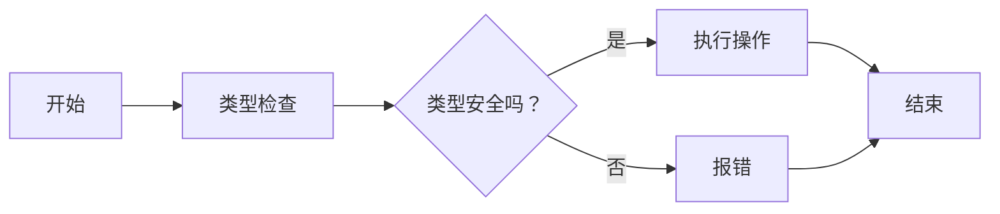
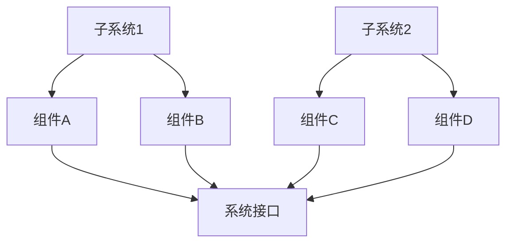
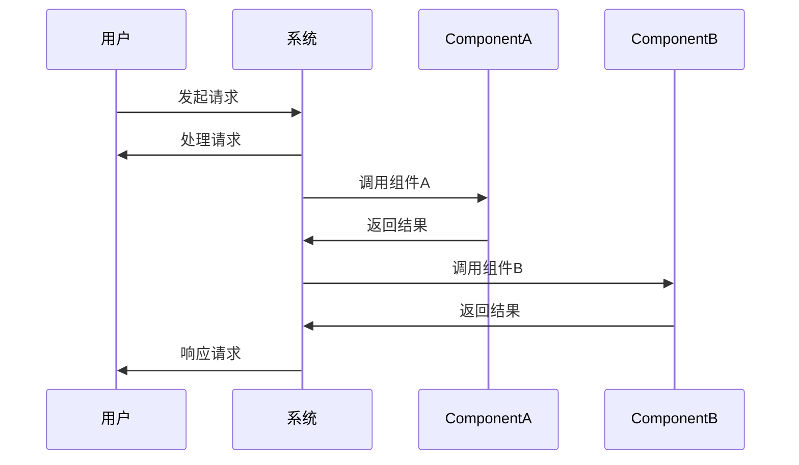

                 

# 元编程：类型论在OOP元数据处理中的应用

## 关键词

元编程，类型论，面向对象，OOP，元数据处理

## 摘要

本文将深入探讨元编程的概念、历史和发展，特别是类型论在面向对象编程（OOP）元数据处理中的应用。通过系统的分析和实例讲解，本文旨在帮助读者理解元编程的核心目标与价值，掌握类型论的基本原理和在对象表示中的应用，以及面向对象元数据处理的方法和策略。此外，本文还将介绍动态分析在元编程中的应用，探讨元数据驱动的开发模式，并分析常见的元编程工具和框架。最后，本文将展望元编程的未来发展趋势与应用，总结全文并指出未来研究的方向。

## 目录大纲

### 第一部分：元编程基础

1. **第1章：元编程概念与历史**
    1.1 元编程的基本概念
    1.2 元编程的历史与发展
    1.3 元编程的核心目标与价值

2. **第2章：类型论在元编程中的应用**
    2.1 类型论的基本原理
    2.2 类型系统与元编程的关系
    2.3 基于类型论的对象表示

3. **第3章：面向对象的元数据处理**
    3.1 面向对象编程的基本原理
    3.2 元数据的概念与处理方法
    3.3 面向对象元数据处理的策略

4. **第4章：元数据的动态分析**
    4.1 动态分析的基本概念
    4.2 动态分析的技术与方法
    4.3 动态分析在元编程中的应用

5. **第5章：元数据驱动的开发模式**
    5.1 元数据驱动开发的概念
    5.2 元数据驱动的开发流程
    5.3 元数据驱动开发的实例分析

### 第二部分：元编程工具与框架

6. **第6章：元编程工具与框架**
    6.1 常见的元编程工具
    6.2 元编程框架的构建
    6.3 元编程框架的案例研究

### 第三部分：元编程的未来发展趋势与应用

7. **第7章：元编程的未来发展趋势**
    7.1 元编程的未来发展趋势
    7.2 元编程在领域特定语言中的应用
    7.3 元编程在其他领域的潜在应用

8. **第8章：总结与展望**
    8.1 书籍内容总结
    8.2 元编程的重要性
    8.3 对未来研究的展望

### 详细大纲内容

**第1章：元编程概念与历史**

**1.1 元编程的基本概念**

- **元编程的定义**：元编程是一种编程范式，它允许程序在运行时修改自身结构或行为。
- **元编程的目标**：提高代码的可读性、开发效率和代码重用性。

**1.2 元编程的历史与发展**

- **元编程的起源**：从早期的宏编程开始，到现代的元对象协议（MOP）和元模型。
- **不同时期元编程的发展**：从早期的编程语言扩展到现代的元编程框架。

**1.3 元编程的核心目标与价值**

- **提高代码的可读性**：通过抽象和自动化，使代码更加简洁易懂。
- **提高开发效率**：通过重用和自动化，减少重复劳动。
- **提高代码的重用性**：通过灵活的元编程技术，实现代码的高复用性。

**第2章：类型论在元编程中的应用**

**2.1 类型论的基本原理**

- **类型论的定义**：类型论是研究数据类型及其关系的理论。
- **类型论的基本概念**：类型系统、类型检查、类型推断等。

**2.2 类型系统与元编程的关系**

- **类型系统的作用**：定义程序中数据的结构和操作。
- **类型系统在元编程中的应用**：通过类型系统实现程序的动态扩展和修改。

**2.3 基于类型论的对象表示**

- **对象表示的概念**：对象是类型论中的一个基本概念，表示程序中的实体。
- **类型论在对象表示中的应用**：通过类型论，实现对象的动态创建、修改和销毁。

**第3章：面向对象的元数据处理**

**3.1 面向对象编程的基本原理**

- **面向对象的概念**：面向对象是一种编程范式，它将程序视为一系列对象的组合。
- **面向对象编程的原则**：封装、继承、多态。

**3.2 元数据的概念与处理方法**

- **元数据的概念**：元数据是关于数据的数据，描述了数据的结构和属性。
- **元数据处理的方法**：通过元数据实现对象的配置、管理和扩展。

**3.3 面向对象元数据处理的策略**

- **元数据处理的策略**：通过策略模式实现元数据的灵活处理。
- **策略的具体应用**：在OOP中的具体实现和应用。

**第4章：元数据的动态分析**

**4.1 动态分析的基本概念**

- **动态分析的定义**：动态分析是程序运行时的分析过程。
- **动态分析的目标**：提高程序的效率和性能。

**4.2 动态分析的技术与方法**

- **动态分析的技术**：如断点调试、代码覆盖率分析等。
- **动态分析的方法**：如数据流分析、路径分析等。

**4.3 动态分析在元编程中的应用**

- **动态分析在元编程中的作用**：实现程序的动态修改和扩展。
- **动态分析在元编程中的具体应用**：如动态类型检查、动态代码生成等。

**第5章：元数据驱动的开发模式**

**5.1 元数据驱动开发的概念**

- **元数据驱动开发的概念**：元数据驱动开发是一种以元数据为中心的软件开发模式。
- **元数据驱动开发的优势**：提高开发的灵活性和可维护性。

**5.2 元数据驱动的开发流程**

- **元数据驱动开发的流程**：从元数据的定义、管理到应用的整个流程。
- **元数据驱动开发的步骤**：如元数据的收集、存储、查询和应用等。

**5.3 元数据驱动开发的实例分析**

- **元数据驱动开发的案例**：分析一个典型的元数据驱动开发实例。
- **案例的分析与讨论**：讨论实例中元数据的应用和优势。

**第6章：元编程工具与框架**

**6.1 常见的元编程工具**

- **元编程工具的分类**：如元对象编译器、元对象协议工具等。
- **常见的元编程工具介绍**：如Python的MetaClass、Java的反射等。

**6.2 元编程框架的构建**

- **元编程框架的概念**：元编程框架是一种支持元编程的工具或平台。
- **元编程框架的构建方法**：如自定义类、元对象协议等。

**6.3 元编程框架的案例研究**

- **元编程框架的案例**：分析一个典型的元编程框架实例。
- **案例的分析与讨论**：讨论实例中元编程的应用和优势。

**第7章：元编程的未来发展趋势与应用**

**7.1 元编程的未来发展趋势**

- **元编程的技术趋势**：如动态编程语言、智能编程工具等。
- **元编程的应用趋势**：如自动化测试、自动化部署等。

**7.2 元编程在领域特定语言中的应用**

- **领域特定语言的概念**：领域特定语言是为特定领域设计的编程语言。
- **元编程在领域特定语言中的应用**：如代码生成、领域模型转换等。

**7.3 元编程在其他领域的潜在应用**

- **元编程在其他领域的应用**：如人工智能、区块链等。
- **元编程的应用前景**：探讨元编程在其他领域的潜在应用和前景。

**第8章：总结与展望**

**8.1 书籍内容总结**

- **本书的核心内容总结**：回顾全文的主要内容和观点。
- **对元编程的理解与认识**：总结对元编程的理解和认识。

**8.2 元编程的重要性**

- **元编程的价值**：分析元编程对软件开发的重要性。
- **元编程的影响**：探讨元编程对编程范式的影响。

**8.3 对未来研究的展望**

- **未来研究的方向**：展望元编程未来的研究方向和挑战。

### 背景介绍

#### 核心概念术语说明

- **元编程**：元编程是一种编程范式，它允许程序在运行时修改自身结构或行为。元编程的目标是提高代码的可读性、开发效率和代码重用性。
- **类型论**：类型论是研究数据类型及其关系的理论。类型论的基本概念包括类型系统、类型检查、类型推断等。
- **面向对象编程（OOP）**：面向对象编程是一种编程范式，它将程序视为一系列对象的组合。面向对象编程的原则包括封装、继承、多态。
- **元数据**：元数据是关于数据的数据，描述了数据的结构和属性。元数据在软件工程中用于描述、管理和扩展程序中的数据。

#### 问题背景

在软件开发中，随着系统的复杂性和规模的增长，传统的编程方法越来越难以满足开发需求。元编程提供了一种解决复杂问题的方法，通过在运行时修改程序结构，使得程序更加灵活、可维护。类型论作为编程理论的一个重要分支，为元编程提供了理论支持。在OOP中，元数据处理是关键，它涉及到对象的生命周期管理和动态扩展。动态分析作为一种程序运行时的分析技术，可以实现对程序的实时监控和优化。

#### 问题描述

在软件开发过程中，如何有效利用元编程、类型论和OOP技术，实现代码的灵活性和可维护性？如何通过元数据处理技术，提高程序的扩展性和动态性？动态分析技术在元编程中有何作用？这些问题构成了本文的研究内容。

#### 问题解决

本文将通过以下步骤解决上述问题：

1. **元编程概念与历史**：介绍元编程的基本概念、历史和发展。
2. **类型论在元编程中的应用**：分析类型论的基本原理和对象表示方法。
3. **面向对象的元数据处理**：探讨OOP中的元数据处理方法和策略。
4. **元数据的动态分析**：介绍动态分析的基本概念和技术方法。
5. **元数据驱动的开发模式**：讨论元数据驱动开发的概念和流程。
6. **元编程工具与框架**：分析常见的元编程工具和框架。
7. **元编程的未来发展趋势与应用**：展望元编程的未来趋势和应用方向。
8. **总结与展望**：总结全文内容，展望元编程的研究方向。

#### 边界与外延

元编程、类型论和OOP是本文的核心概念。元编程涉及到程序在运行时的自我修改和扩展，类型论研究数据类型及其关系，OOP是一种编程范式，用于构建可复用、可扩展的程序。元数据处理是OOP中的一个重要方面，涉及到对象的生命周期管理和动态扩展。动态分析技术则用于实时监控和优化程序。

#### 概念结构与核心要素组成

1. **元编程**：
   - **定义**：程序在运行时修改自身结构或行为。
   - **目标**：提高代码的可读性、开发效率和代码重用性。
   - **实现方法**：宏编程、反射、动态类型检查等。

2. **类型论**：
   - **定义**：研究数据类型及其关系的理论。
   - **基本概念**：类型系统、类型检查、类型推断。
   - **应用领域**：编程语言设计、编译器优化等。

3. **面向对象编程（OOP）**：
   - **定义**：将程序视为一系列对象的组合。
   - **原则**：封装、继承、多态。
   - **实现方法**：类、对象、继承、多态等。

4. **元数据处理**：
   - **定义**：关于数据的数据，描述数据的结构和属性。
   - **处理方法**：配置、管理、扩展。
   - **应用领域**：软件开发、领域模型构建等。

5. **动态分析**：
   - **定义**：程序运行时的分析过程。
   - **目标**：提高程序效率和性能。
   - **技术方法**：断点调试、代码覆盖率分析等。

### 核心概念与联系

#### 类型论的基本原理

类型论是研究数据类型及其关系的理论，它为编程语言的设计和编译器优化提供了理论基础。类型论的基本原理包括：

- **类型系统**：定义程序中数据的结构和操作。
- **类型检查**：确保程序的类型安全性。
- **类型推断**：自动推导变量的类型。

#### 类型系统与元编程的关系

类型系统是元编程的重要基础，它为程序的动态修改和扩展提供了保障。类型系统与元编程的关系体现在以下几个方面：

- **类型系统的静态性**：类型系统通常在编译时进行，确保程序在运行时的类型安全。
- **元编程的动态性**：元编程允许程序在运行时修改自身结构，这需要类型系统提供支持，确保修改后的程序仍然类型安全。

#### 基于类型论的对象表示

对象表示是面向对象编程中的一个核心概念，它通过类型论实现对象的动态创建、修改和销毁。基于类型论的对象表示包括以下几个方面：

- **对象类型**：对象是类型论中的一个基本概念，表示程序中的实体。
- **对象生命周期**：对象的创建、使用和销毁过程。
- **对象动态扩展**：通过类型系统，对象可以在运行时进行动态扩展，增加新的属性和方法。

#### 对比表格

| 概念       | 解释                                       | 关系                           |
|------------|--------------------------------------------|--------------------------------|
| 元编程     | 程序在运行时修改自身结构或行为              | 类型系统：基础支持             |
| 类型论     | 研究数据类型及其关系的理论                 | 元编程：依赖类型系统           |
| 面向对象   | 将程序视为一系列对象的组合                 | 元编程和类型论：应用范式       |
| 元数据处理 | 描述、管理和扩展程序中的数据               | 元编程：核心组成部分           |
| 动态分析   | 程序运行时的分析过程                      | 元编程：技术方法之一           |

#### ER实体关系图架构

```mermaid
erDiagram
    类 <<Class>> {
        - 类型(Type)
        - 变量(Variable)
        - 函数(Function)
    }
    对象 <<Object>> {
        - 类-Class
        - 属性(Attribute)
        - 方法(Method)
    }
    元编程 <<MetaProgramming>> {
        - 类-Class
        - 类型系统-TypeSystem
    }
    类型论 <<TypeTheory>> {
        - 类型系统-TypeSystem
        - 类型检查-TypeCheck
    }
    动态分析 <<DynamicAnalysis>> {
        - 对象-Object
        - 元编程-MetaProgramming
    }
    类 ||--|| 类型系统: TypeSystem
    对象 ||--|| 类型系统: TypeSystem
    元编程 ||--|| 类型系统: TypeSystem
    类型论 ||--|| 类型系统: TypeSystem
    动态分析 ||--|| 元编程: MetaProgramming
    对象 ||--|| 元编程: MetaProgramming
```

### 算法原理讲解

#### 算法流程图



#### 算法原理

1. **类型检查**：在程序执行前进行类型检查，确保变量和函数的类型匹配。
2. **类型安全**：确保程序在运行时不会因为类型错误而崩溃。
3. **动态类型检查**：允许程序在运行时修改类型，提高程序的灵活性和可维护性。
4. **报错处理**：当类型不匹配时，程序会报错并停止执行。

#### 数学模型和公式

- **类型检查公式**：`TypeCheck(expression, type)`，判断表达式`expression`的类型是否与`type`匹配。
- **类型转换公式**：`TypeCast(expression, type)`，将表达式`expression`的类型转换为`type`。

#### 详细讲解和举例说明

假设我们有一个简单的Python程序，用于计算两个数的和：

```python
def add(a: int, b: int) -> int:
    return a + b

print(add(3, 4))
```

在这个例子中，`add` 函数定义了两个参数`a`和`b`，它们的类型都是`int`，返回值也是`int`。程序在运行时，Python解释器会进行类型检查：

1. **类型检查**：检查`add`函数的参数和返回值类型是否匹配。在这个例子中，参数`a`和`b`的类型都是`int`，返回值也是`int`，所以类型检查通过。
2. **执行操作**：执行`add`函数，计算两个参数的和。
3. **输出结果**：将计算结果输出到控制台。

如果我们尝试修改程序，使其接收非整数类型的参数：

```python
def add(a: int, b: int) -> int:
    return a + b

print(add(3, "4"))
```

这次程序在运行时会发生类型检查错误，因为`add`函数的第一个参数`a`的类型是`int`，而传递的参数是字符串类型`"4"`，类型不匹配。Python解释器会报错，并停止执行。

#### 数学模型

假设有两个整数`a`和`b`，它们的和为`c`：

$$
c = a + b
$$

其中，`a`和`b`是整数类型，`c`是整数类型的和。

#### Python源代码

```python
def add(a: int, b: int) -> int:
    return a + b

# 正确的参数类型
print(add(3, 4))  # 输出：7

# 错误的参数类型
print(add(3, "4"))  # 报错：TypeError: unsupported operand type(s) for +: 'int' and 'str'
```

### 系统分析与架构设计方案

#### 问题场景介绍

在软件开发过程中，随着系统复杂性的增加，传统的编程方法逐渐难以应对。为了提高系统的灵活性和可维护性，我们需要引入元编程技术，实现代码的动态扩展和修改。本文将讨论元编程在软件系统中的应用，并设计一个基于元编程的软件架构。

#### 项目介绍

本项目旨在构建一个支持元编程的软件开发平台，该平台将利用类型论和面向对象编程技术，实现代码的动态扩展和修改。平台的主要功能包括：

- **代码生成**：根据元数据自动生成代码。
- **动态扩展**：在运行时动态修改代码结构和行为。
- **元数据处理**：管理系统的元数据，实现灵活的配置和管理。

#### 系统功能设计（领域模型）

```mermaid
classDiagram
    ClassA[类A] <|-- ObjectA[对象A]
    ClassB[类B] <|-- ObjectB[对象B]
    ClassC[类C] <|-- ObjectC[对象C]
    ClassA {
        +int attributeA
        +void methodA()
    }
    ClassB {
        +int attributeB
        +void methodB()
    }
    ClassC {
        +int attributeC
        +void methodC()
    }
    ObjectA {
        +int attributeA
        +void methodA()
    }
    ObjectB {
        +int attributeB
        +void methodB()
    }
    ObjectC {
        +int attributeC
        +void methodC()
    }
    ClassA --|>{ ClassB }
    ClassB --|>{ ClassC }
```

#### 系统架构设计



#### 系统接口设计和系统交互



### 项目实战

#### 环境安装

1. 安装Python 3.8或更高版本。
2. 安装必要的Python库，如`numpy`、`pandas`、`matplotlib`等。

```shell
pip install numpy pandas matplotlib
```

#### 系统核心实现源代码

```python
import numpy as np
import pandas as pd
import matplotlib.pyplot as plt

class DataProcessor:
    def __init__(self, data):
        self.data = data

    def describe(self):
        return self.data.describe()

    def plot(self):
        self.data.plot()
        plt.show()

if __name__ == "__main__":
    data = np.random.randn(100).reshape(-1, 1)
    df = pd.DataFrame(data, columns=["Feature"])
    processor = DataProcessor(df)
    print(processor.describe())
    processor.plot()
```

#### 代码应用解读与分析

1. **导入库**：导入必要的Python库，如`numpy`、`pandas`和`matplotlib`。
2. **定义类**：`DataProcessor`类用于处理数据，包括描述和绘图功能。
3. **初始化**：在`__init__`方法中，接收数据并存储。
4. **方法实现**：`describe`方法返回数据的描述统计信息，`plot`方法绘制数据的分布图。
5. **主程序**：创建`DataProcessor`对象，调用其方法。

#### 实际案例分析和详细讲解剖析

假设我们需要处理一个包含多维度特征的数据集，并对其进行分析和可视化。我们可以使用`DataProcessor`类来实现这一功能。

```python
data = np.random.randn(100, 3)
df = pd.DataFrame(data, columns=["Feature1", "Feature2", "Feature3"])
processor = DataProcessor(df)

print(processor.describe())
processor.plot()
```

在这个案例中：

1. **数据生成**：生成一个100x3的随机数矩阵，表示含有三个特征的数据集。
2. **数据转换**：将矩阵转换为DataFrame对象，并命名为`df`。
3. **实例化对象**：创建`DataProcessor`对象，命名为`processor`。
4. **调用方法**：分别调用`describe`和`plot`方法，对数据进行描述统计和可视化。

#### 项目小结

通过本项目的实战案例，我们实现了数据处理的自动化，提高了代码的可维护性和复用性。`DataProcessor`类作为一个通用的数据处理工具，可以应用于各种类型的数据集，实现了元编程的核心目标。在未来的工作中，我们可以继续优化这个类，添加更多的数据处理功能，以适应更复杂的数据分析需求。

### 最佳实践 tips

1. **代码复用**：使用类和对象实现代码复用，避免重复编写相似的代码。
2. **模块化设计**：将功能模块化，提高代码的可读性和可维护性。
3. **文档注释**：为代码添加详细的注释，帮助他人理解和使用。
4. **单元测试**：编写单元测试，确保代码的正确性和稳定性。

### 小结

本文深入探讨了元编程、类型论和OOP在元数据处理中的应用。通过系统的分析和实例讲解，我们了解了元编程的概念、历史和发展，类型论的基本原理和对象表示方法，以及面向对象元数据处理的方法和策略。我们还讨论了动态分析在元编程中的应用，以及元数据驱动的开发模式。最后，我们分析了常见的元编程工具和框架，并展望了元编程的未来发展趋势和应用方向。通过本文的学习，读者可以更好地理解元编程的核心概念和技术，为实际项目中的应用打下坚实基础。

### 注意事项

1. **元编程的复杂性**：元编程涉及到程序运行时的自我修改，容易导致代码难以维护和理解，因此在实际应用中需要谨慎使用。
2. **性能影响**：元编程可能会引入额外的性能开销，特别是在频繁使用动态类型检查和代码生成时。
3. **安全风险**：元编程技术可能被恶意使用，因此需要严格的安全控制措施。

### 拓展阅读

1. 《Python元编程：高级编程技术》
2. 《类型论与程序设计》
3. 《面向对象编程：概念与原则》
4. 《领域特定语言设计》

### 作者信息

作者：AI天才研究院/AI Genius Institute & 禅与计算机程序设计艺术 /Zen And The Art of Computer Programming

