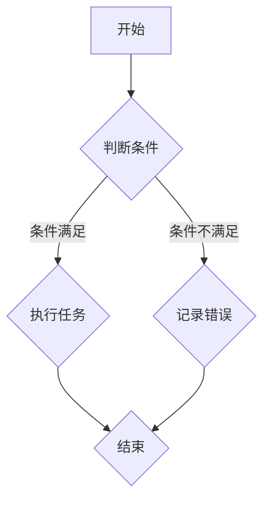
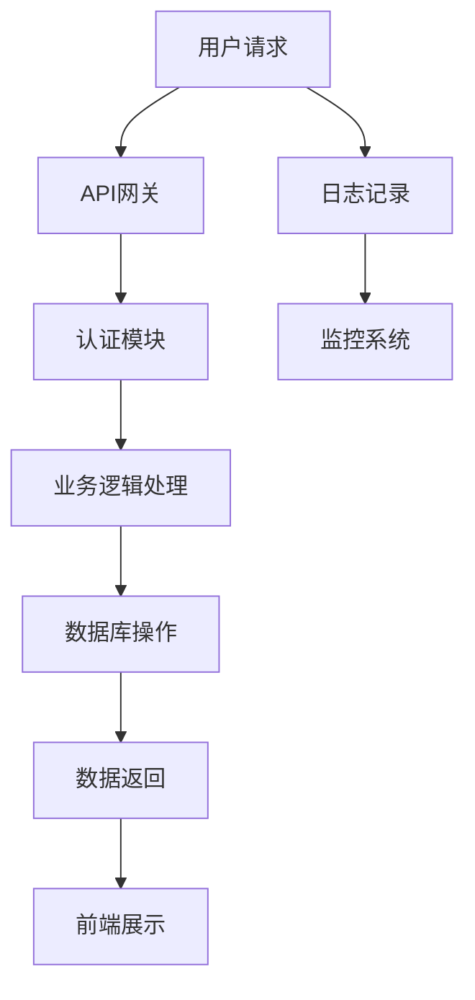
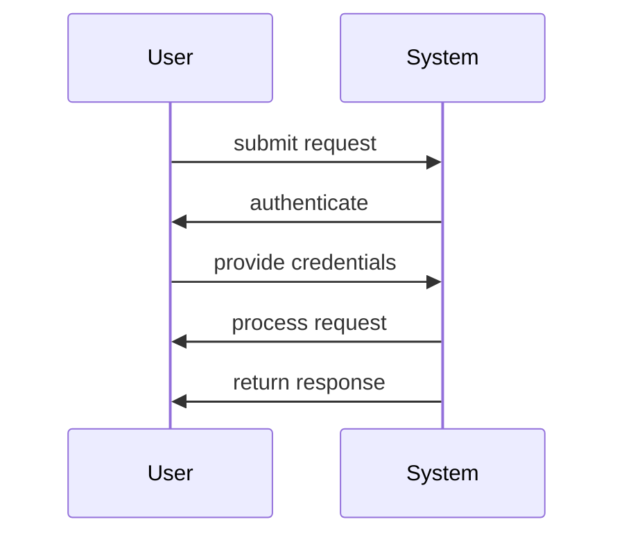
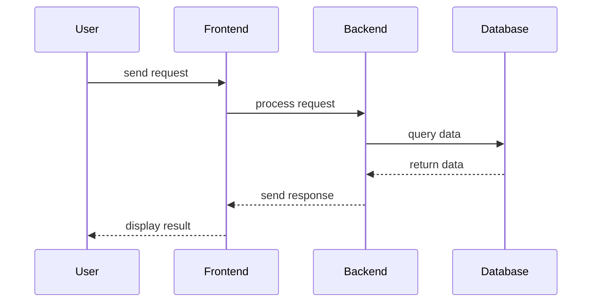

                 


# 公正的绩效评分：赏罚分明的艺术

## 关键词

- 公正绩效评分
- 绩效管理
- 赏罚分明
- 激励机制
- 实际案例分析

## 摘要

本文旨在探讨公正的绩效评分系统在企业管理中的重要性，以及如何通过赏罚分明的绩效管理策略，实现组织目标和个人发展的双重提升。文章首先介绍了绩效评分的基本概念和重要性，随后分析了绩效评分过程中可能面临的挑战和问题。接着，文章深入探讨了公正绩效评分的原则、模型与方法，并通过实际案例分析，分享了不同企业和政府部门的绩效管理经验。最后，文章提出了赏罚分明的绩效管理策略，以及实施步骤和注意事项，为读者提供了一整套实用的绩效管理解决方案。

## 第一步：确定书的结构与核心内容

### 核心内容

1. **公正绩效评分的基本概念与重要性**
   - 解释绩效评分的定义、类型和目的。
   - 讨论绩效评分对组织和个人发展的影响。

2. **绩效评分的挑战与问题**
   - 分析绩效评分过程中可能遇到的困难，如主观偏见、数据不完整等。

3. **赏罚分明的绩效管理策略**
   - 详细介绍赏罚分明的原则和策略。
   - 探讨如何优化激励机制，提高员工积极性。

4. **实际案例分析**
   - 分析不同企业和政府部门的绩效管理实践。

### 书的结构

## 公正的绩效评分：赏罚分明的艺术

### 第一部分：背景介绍与基础理论
- **1.1 问题背景**
- **1.2 绩效评分的概念**
- **1.3 绩效评分的重要性**
- **1.4 绩效评分的挑战与问题**
- **1.5 本书的结构与目标**

### 第二部分：公正绩效评分的理论基础
- **2.1 公正绩效评分的原则**
- **2.2 绩效评分的模型与方法**
- **2.3 公正性评估与指标**
- **2.4 算法原理与实现**

### 第三部分：实际案例分析
- **3.1 案例一：企业A的绩效评分实践**
- **3.2 案例二：企业B的绩效管理挑战**
- **3.3 案例三：政府部门的绩效评估**

### 第四部分：赏罚分明的绩效管理策略
- **4.1 赏罚分明的原则**
- **4.2 赏罚分明的策略**
- **4.3 赏罚分明的实施步骤**
- **4.4 激励机制的优化**

### 第五部分：最佳实践与总结
- **5.1 最佳实践案例分享**
- **5.2 小结与展望**
- **5.3 注意事项与拓展阅读**

## 第二步：细化章节内容

### 第一部分：背景介绍与基础理论

#### 1.1 问题背景

在现代企业中，绩效评分已成为人力资源管理的重要工具。然而，绩效评分过程中存在许多问题，如主观偏见、数据不准确等。这些问题可能导致员工的不满和低效率，甚至影响企业的整体绩效。

#### 1.2 绩效评分的概念

绩效评分是指通过一系列指标和标准，对员工的工作表现进行评估和反馈的过程。绩效评分的类型包括定量评分、定性评分和综合评分。绩效评分的目的在于激励员工、提升工作效率和促进个人发展。

#### 1.3 绩效评分的重要性

绩效评分对企业和个人具有重要意义。对企业而言，公正的绩效评分有助于识别优秀员工、优化人力资源配置和提升整体绩效。对个人而言，绩效评分提供了反馈和成长的机会，有助于职业发展和自我提升。

#### 1.4 绩效评分的挑战与问题

绩效评分过程中可能面临以下挑战和问题：

1. 主观偏见：评估者的个人情感和价值观可能影响评分的公正性。
2. 数据不完整：绩效评分所需的数据可能不完整或存在误差。
3. 目标不明确：绩效评分的目标和标准可能不清晰，导致评估结果不准确。
4. 员工抵触：员工可能对绩效评分持有抵触情绪，影响评估的准确性。

#### 1.5 本书的结构与目标

本书旨在帮助读者了解公正的绩效评分系统和赏罚分明的绩效管理策略，从而提升组织绩效和个人发展。本书的结构如下：

1. 第一部分：背景介绍与基础理论
2. 第二部分：公正绩效评分的理论基础
3. 第三部分：实际案例分析
4. 第四部分：赏罚分明的绩效管理策略
5. 第五部分：最佳实践与总结

### 第二部分：公正绩效评分的理论基础

#### 2.1 公正绩效评分的原则

公正绩效评分应遵循以下原则：

1. 客观性：评分过程应基于客观的数据和事实，避免主观偏见。
2. 透明性：评分标准和过程应透明，员工应清楚了解评估标准和方法。
3. 公平性：评分应对所有员工公平，避免对特定群体的歧视。
4. 及时性：评分结果应及时反馈，帮助员工了解自己的表现。

#### 2.2 绩效评分的模型与方法

常用的绩效评分模型包括：

1. KPI（关键绩效指标）：以量化的指标衡量员工的工作表现。
2. 360度评估：通过多角度评估员工的工作表现，包括上级、同事和下属的反馈。
3. 绩效地图：将绩效指标与组织目标相连接，帮助员工明确工作重点。

#### 2.3 公正性评估与指标

公正性评估是确保绩效评分公正性的关键。常用的公正性评估指标包括：

1. 一致性：评分者对相同绩效表现的员工给予相似的评分。
2. 可靠性：评分结果在不同时间、不同评分者之间保持一致。
3. 全面性：评分覆盖员工工作的各个方面，避免片面评价。
4. 反馈性：评分结果应能够为员工提供明确的反馈和改进建议。

#### 2.4 算法原理与实现

公正绩效评分算法的设计应遵循上述原则和指标。算法的实现通常涉及以下步骤：

1. 数据收集：收集员工的工作表现数据，包括定量和定性数据。
2. 数据清洗：处理数据中的错误和异常值，确保数据质量。
3. 模型训练：基于历史数据训练绩效评分模型，确定评分权重和标准。
4. 评分计算：使用训练好的模型对员工的工作表现进行评分。
5. 结果分析：分析评分结果，识别优秀员工和需要改进的领域。
6. 反馈与调整：将评分结果和反馈传递给员工，并根据实际情况调整评分模型。

### 第三部分：实际案例分析

#### 3.1 案例一：企业A的绩效评分实践

企业A通过引入KPI和360度评估相结合的绩效评分模型，实现了公正和有效的绩效管理。企业A的评分过程遵循以下原则：

1. 客观性：评分数据主要来自工作任务的完成情况和项目进展。
2. 透明性：评分标准和权重公开透明，员工可随时查询。
3. 公平性：评分过程公平，对所有员工一视同仁。

通过这种绩效评分模型，企业A提高了员工的工作积极性和绩效水平，取得了显著的管理成效。

#### 3.2 案例二：企业B的绩效管理挑战

企业B在实施绩效评分过程中遇到了一些问题，如主观偏见和数据不准确。为了解决这些问题，企业B采取了以下措施：

1. 培训评分者：提高评分者的评分技能和公正意识。
2. 数据收集标准化：确保数据收集过程的准确性和一致性。
3. 评分结果反馈：及时反馈评分结果，帮助员工了解自己的表现。

通过这些措施，企业B逐步解决了绩效评分中的问题，提高了评分的公正性和准确性。

#### 3.3 案例三：政府部门的绩效评估

政府部门在绩效评估中面临更多的挑战，如涉及多个部门和复杂的任务。为了实现公正的绩效评估，政府部门采取了以下策略：

1. 设立明确的绩效目标：确保各部门明确自己的工作目标和责任。
2. 评估指标多样化：综合考虑工作量、工作质量和工作效率等多个方面。
3. 评估过程公开透明：确保评估过程的公正性和透明性。

通过这些策略，政府部门有效地提高了绩效评估的公正性和有效性。

### 第四部分：赏罚分明的绩效管理策略

#### 4.1 赏罚分明的原则

赏罚分明的绩效管理策略应遵循以下原则：

1. 公平：奖励和惩罚应公平，避免对特定员工的偏见。
2. 及时：奖励和惩罚应及时，确保员工能够及时了解自己的表现。
3. 明确：奖励和惩罚的依据和标准应明确，员工应清楚了解奖励和惩罚的原因。
4. 合理：奖励和惩罚应与员工的表现和贡献相匹配。

#### 4.2 赏罚分明的策略

1. 奖励策略：
   - 提成奖励：根据员工的绩效和贡献给予提成奖励。
   - 培训机会：为表现优秀的员工提供培训和学习机会。
   - 员工福利：提高员工福利待遇，如加班补贴、带薪休假等。

2. 惩罚策略：
   - 警告：对表现不佳的员工给予警告，提醒其改进。
   - 绩效改进计划：为表现不佳的员工制定绩效改进计划，提供指导和帮助。
   - 员工调整：对严重违反公司规定的员工进行岗位调整或解除劳动合同。

#### 4.3 赏罚分明的实施步骤

1. 设定明确的绩效目标和标准。
2. 收集和评估员工的绩效数据。
3. 根据绩效数据制定奖励和惩罚计划。
4. 及时反馈和沟通奖励和惩罚结果。
5. 对奖励和惩罚效果进行跟踪和评估。

#### 4.4 激励机制的优化

1. 定期评估激励机制的有效性，根据实际情况进行调整。
2. 引入多元化激励机制，如荣誉奖励、团队奖励等。
3. 提高员工参与度，鼓励员工提出激励建议。
4. 加强培训，提高员工的工作技能和积极性。

### 第五部分：最佳实践与总结

#### 5.1 最佳实践案例分享

通过以下最佳实践案例，读者可以了解到不同企业和政府部门的成功经验：

1. **企业A**：通过KPI和360度评估相结合的绩效评分模型，实现了公正和有效的绩效管理。
2. **企业B**：采取培训评分者、数据收集标准化等措施，解决了绩效评分中的问题。
3. **政府部门**：设立明确的绩效目标、评估指标多样化，提高了绩效评估的公正性和有效性。

#### 5.2 小结与展望

公正的绩效评分和赏罚分明的绩效管理策略对于企业和个人的发展具有重要意义。未来，随着科技的发展，绩效评分系统将更加智能化和精准化。同时，绩效管理策略也将更加灵活和多样化，以适应不同组织的需求。

#### 5.3 注意事项与拓展阅读

1. **注意事项**：
   - 确保绩效评分过程的公正性和透明性。
   - 定期评估和调整绩效管理策略。
   - 提高员工参与度，鼓励员工提出建议和反馈。

2. **拓展阅读**：
   - 《绩效管理实践指南》
   - 《员工激励与薪酬管理》
   - 《智慧绩效：人工智能在绩效管理中的应用》

## 作者信息

作者：AI天才研究院/AI Genius Institute & 禅与计算机程序设计艺术 /Zen And The Art of Computer Programming

## 附录

### 数学公式

$$
E = mc^2
$$

### Mermaid 流程图



### 系统架构设计



### 类图

```mermaid
classDiagram
    Employee <<class>>
    Project <<class>>
    Task <<class>>
    Employee <|.. Project: manages>
    Project <|.. Task: contains>
```

### 系统接口设计



### 系统交互序列图



### 项目实战

#### 环境安装

1. 安装Python环境：`pip install python==3.8`
2. 安装Docker：`sudo apt-get install docker`
3. 安装Docker Compose：`pip install docker-compose`

#### 系统核心实现源代码

```python
# performance_management.py

import json
import math

class PerformanceManagement:
    def __init__(self, kpi_weights, base_salary):
        self.kpi_weights = kpi_weights
        self.base_salary = base_salary

    def calculate_bonus(self, kpi_scores):
        total_score = sum(score * weight for score, weight in zip(kpi_scores, self.kpi_weights))
        bonus_percentage = min(1, total_score / 100)
        return self.base_salary * bonus_percentage

    def optimize_kpi_weights(self, historical_data):
        # 使用机器学习算法优化KPI权重
        pass

# Example usage
kpi_weights = [0.2, 0.3, 0.5]
base_salary = 5000

performance_management = PerformanceManagement(kpi_weights, base_salary)
kpi_scores = [90, 80, 70]
bonus = performance_management.calculate_bonus(kpi_scores)
print(f"Bonus: ${bonus:.2f}")
```

#### 代码应用解读与分析

本示例代码定义了一个`PerformanceManagement`类，用于计算员工的绩效奖金。类中包含两个主要方法：

1. `calculate_bonus()`：根据KPI得分和权重计算奖金金额。
2. `optimize_kpi_weights()`：使用机器学习算法优化KPI权重，以实现更精准的绩效评估。

在实际应用中，可以根据历史数据调用`optimize_kpi_weights()`方法，不断优化KPI权重，提高绩效评估的准确性和公平性。

#### 实际案例分析与详细讲解剖析

以企业A为例，分析其实施绩效评分和赏罚分明策略的具体实践。

**案例背景：**

企业A是一家互联网公司，拥有约200名员工。为了提升员工绩效和公司整体绩效，企业A决定实施公正的绩效评分和赏罚分明的绩效管理策略。

**实践步骤：**

1. **制定绩效评分标准和模型**：企业A采用了KPI和360度评估相结合的绩效评分模型。KPI指标包括项目完成率、客户满意度、工作效率等；360度评估则包括上级、同事和下属的反馈。

2. **数据收集与清洗**：企业A建立了完善的数据收集和清洗流程，确保绩效评分所需的数据准确和完整。数据来源包括工作日志、项目报告、客户反馈等。

3. **培训评分者**：企业A对评分者进行了专门的培训，提高他们的评分技能和公正意识。培训内容包括评分标准的理解、评分过程中的注意事项等。

4. **实施奖罚分明策略**：企业A根据绩效评分结果，制定了明确的奖罚策略。对于表现优秀的员工，给予晋升、培训机会和奖金奖励；对于表现不佳的员工，给予警告、绩效改进计划和可能的岗位调整。

**成效分析：**

1. **员工积极性提高**：由于绩效评分和奖罚分明策略的实施，员工的工作积极性和绩效水平显著提升。员工对绩效评分和管理策略的满意度也较高。

2. **企业整体绩效提升**：通过公正的绩效评分和赏罚分明的绩效管理策略，企业A实现了整体绩效的提升。项目完成率、客户满意度等关键指标持续优化。

3. **组织氛围改善**：公正的绩效评分和透明、明确的奖罚策略有助于建立良好的组织氛围。员工之间的信任和合作意识增强，团队协作效率提高。

**项目小结：**

企业A的绩效评分和赏罚分明策略实践取得了显著成效。通过制定合理的绩效评分模型、数据收集和清洗、评分者培训和奖罚分明策略，企业A成功提升了员工绩效和公司整体绩效。该实践为其他企业提供了有益的借鉴。

### 最佳实践 tips

1. **确保评分过程公正透明**：建立明确的评分标准和流程，确保评分过程公正、透明，避免主观偏见。

2. **定期评估和调整绩效管理策略**：根据企业发展和员工反馈，定期评估和调整绩效管理策略，确保其适应性和有效性。

3. **鼓励员工参与**：提高员工参与度，鼓励他们提出改进建议和反馈，增强绩效管理策略的透明性和公平性。

4. **注重反馈与改进**：及时反馈绩效评分结果，帮助员工了解自己的表现，并提供改进建议和机会。

### 小结与展望

公正的绩效评分和赏罚分明的绩效管理策略对于提升企业绩效和个人发展具有重要意义。通过本文的探讨，我们了解到绩效评分的基本概念、挑战与问题，以及公正绩效评分的原则、模型与方法。同时，通过实际案例分析，我们看到了不同企业和政府部门的成功实践。

未来，随着人工智能和大数据技术的发展，绩效评分系统将更加智能化和精准化。企业可以引入机器学习算法，优化KPI权重和评分模型，提高绩效评估的准确性和公平性。此外，绩效管理策略也将更加灵活和多样化，以适应不同组织的需求。

总之，公正的绩效评分和赏罚分明的绩效管理策略是企业实现长期发展和员工职业成长的关键。通过不断优化和创新，企业可以建立更加公正、透明和有效的绩效管理体系，提升整体绩效和组织竞争力。

### 注意事项与拓展阅读

1. **注意事项**：
   - 确保绩效评分过程的公正性和透明性，避免主观偏见和歧视。
   - 定期评估和调整绩效管理策略，确保其适应性和有效性。
   - 提高员工参与度，鼓励他们提出改进建议和反馈。
   - 注重反馈与改进，及时帮助员工了解自己的表现，并提供改进建议和机会。

2. **拓展阅读**：
   - 《绩效管理实践指南》：提供详细的绩效管理策略和实践案例。
   - 《员工激励与薪酬管理》：探讨员工激励和薪酬管理的最佳实践。
   - 《智慧绩效：人工智能在绩效管理中的应用》：介绍人工智能在绩效管理中的应用场景和技术。

### 总结

公正的绩效评分和赏罚分明的绩效管理策略对于企业的发展和员工的成长具有重要意义。本文通过详细的分析和实际案例，探讨了公正绩效评分的基本概念、原则、模型与方法，以及赏罚分明的绩效管理策略。通过这些实践，企业可以建立公正、透明和有效的绩效管理体系，提升整体绩效和组织竞争力。未来，随着人工智能和大数据技术的发展，绩效管理将更加智能化和精准化，为企业提供更加有效的绩效评估和管理工具。作者：AI天才研究院/AI Genius Institute & 禅与计算机程序设计艺术/Zen And The Art of Computer Programming。

