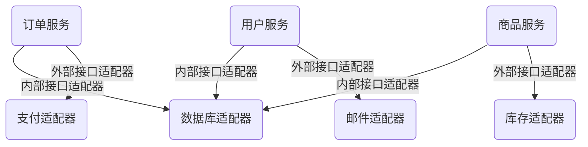

                 


## 六边形架构：解耦业务逻辑与外部依赖

### 关键词：六边形架构、业务逻辑、外部依赖、解耦、微服务、软件设计

### 摘要：

本文深入探讨了六边形架构的设计理念及其在现代软件开发中的重要性。通过一步步的分析和推理，本文详细阐述了六边形架构的基础理论、设计原则、核心组件及其在实际开发中的应用。文章分为七个部分，从核心概念、设计原则、核心组件到六边形架构在微服务架构中的应用，以及优势分析和实践应用，旨在帮助开发者全面掌握六边形架构，提升系统的灵活性和可维护性。

### 导读

《六边形架构：解耦业务逻辑与外部依赖》旨在深入探讨六边形架构的设计理念及其在实际开发中的应用。本书分为七个主要部分，涵盖了六边形架构的基础理论、架构设计原则、核心组件、实现方法、优势分析以及实践应用。

#### 第一部分：六边形架构概述

#### 第1章：六边形架构的起源与基础理论

本章将详细介绍六边形架构的起源及其核心理论。首先，我们将回顾软件架构的发展历程，特别是从传统架构向现代架构的转型。接着，我们会探讨六边形架构的起源背景，包括其设计理念的提出和早期应用场景。

#### 第2章：六边形架构的设计原则

本章将深入探讨六边形架构的设计原则，帮助开发者理解如何通过解耦业务逻辑与外部依赖，实现系统的灵活性和可维护性。

#### 第3章：六边形架构的核心组件

本章将详细介绍六边形架构的核心组件，包括接口适配器、外部系统交互组件和业务逻辑组件，并展示如何在实际项目中实现这些组件。

#### 第4章：六边形架构在微服务架构中的应用

本章将探讨六边形架构在微服务架构中的应用，通过一系列最佳实践和策略，帮助开发者更好地利用六边形架构的优势，实现微服务的可扩展性和灵活性。

#### 第二部分：核心概念与联系

#### 第5章：核心概念原理

本章将详细阐述六边形架构中的核心概念，包括接口适配器、外部系统交互组件和业务逻辑组件。通过这些概念的深入理解，开发者将能够更好地掌握六边形架构的设计和应用。

#### 第三部分：深入分析与实现

#### 第6章：实现细节与最佳实践

本章将深入分析六边形架构在具体项目中的应用细节，提供一系列最佳实践，帮助开发者解决常见问题，优化系统设计。

#### 第7章：实际案例与项目实施

本章将通过具体案例，展示如何在实际项目中应用六边形架构，并提供项目实施的经验和技巧。

通过阅读本书，您将能够全面掌握六边形架构的设计和应用，为您的软件开发项目带来更高的效率和灵活性。

### 第一部分：六边形架构概述

#### 第1章：六边形架构的起源与基础理论

本章将详细介绍六边形架构的起源及其核心理论。首先，我们将回顾软件架构的发展历程，特别是从传统架构向现代架构的转型。接着，我们会探讨六边形架构的起源背景，包括其设计理念的提出和早期应用场景。

### 1.1 软件架构的发展与演变

软件架构是软件系统的总体结构，包括软件组件及其相互关系。自计算机科学诞生以来，软件架构经历了多个发展阶段。

1.1.1 软件架构的定义

软件架构（Software Architecture）是软件系统的整体结构和组件之间的关系，以及这些组件之间的接口和交互。它定义了系统的组织结构、功能结构、数据流和通信模式，提供了系统的抽象视图，使得开发者可以更清晰地理解和设计复杂的系统。

1.1.2 从单体架构到微服务架构的演进

- **单体架构**（Monolithic Architecture）：在单体架构中，所有功能模块都紧密地集成在一个单一的应用程序中。这种架构的优点是开发简单，维护方便，但随着项目规模的扩大，单体架构的缺点也逐渐显现，包括：

  - **耦合度较高**：模块之间紧密耦合，一个模块的更改可能会影响其他模块，导致整个系统的稳定性下降。
  - **可扩展性差**：系统难以横向扩展，增加新功能或服务需要重新部署整个系统。
  - **测试和维护困难**：整个系统作为一个整体进行测试和维护，复杂度和风险较高。

- **微服务架构**（Microservices Architecture）：微服务架构是将应用程序分解为多个独立的、小型化的服务，每个服务负责一个特定的业务功能。这种架构的优点包括：

  - **高可扩展性**：服务可以独立部署和扩展，根据需求动态调整资源。
  - **松耦合**：服务之间通过轻量级的通信机制（如RESTful API）进行交互，减少模块间的依赖。
  - **易于维护和测试**：服务独立开发和测试，降低了系统的复杂度和风险。

### 1.2 六边形架构的起源背景

六边形架构（Hexagonal Architecture），也称为端口-适配器架构（Port-and-Adapter Architecture），最早由著名软件工程师 Alistair Cockburn 提出并推广。这种架构的设计理念是在应对软件系统复杂性、提高可维护性和可扩展性方面提供一种有效的解决方案。

1.2.1 六边形架构的设计理念

六边形架构的核心思想是将系统内部的核心业务逻辑与外部依赖（如数据库、外部服务、硬件设备等）分离，实现系统的解耦。具体来说，六边形架构有以下几方面的设计理念：

- **核心业务逻辑的内聚性**：系统的核心业务逻辑集中在中心区域，形成紧密内聚的核心。
- **外部依赖的适应性**：外部依赖通过接口适配器与核心业务逻辑连接，使得系统可以方便地与外部环境进行交互。
- **测试的独立性**：由于核心业务逻辑与外部依赖的解耦，开发者可以独立测试核心业务逻辑，而不需要依赖外部系统。

1.2.2 六边形架构的早期应用场景

六边形架构最初在开发大型、复杂的软件系统（如金融系统、电子商务系统）中得到了广泛应用。这些系统通常需要与多个外部系统进行交互，如支付系统、库存管理系统、客户关系管理系统等。通过采用六边形架构，这些系统能够更好地实现业务逻辑与外部依赖的解耦，提高系统的灵活性和可维护性。

### 1.3 六边形架构的基本原理

六边形架构的基本原理是通过将系统划分为内聚的核心业务逻辑和外围的外部依赖，实现系统的解耦。具体来说，六边形架构包括以下几个核心组成部分：

- **核心业务逻辑**：这是系统的核心，负责处理具体的业务逻辑，如用户管理、订单处理、库存管理等。核心业务逻辑应该尽可能地独立于外部依赖。
- **接口适配器**：接口适配器是核心业务逻辑与外部依赖之间的桥梁，负责将外部依赖的调用转换为系统内部可以处理的格式。接口适配器分为内部接口适配器和外部接口适配器两种。
  - **内部接口适配器**：用于连接内部系统组件，如数据库、消息队列等。
  - **外部接口适配器**：用于连接外部系统，如支付服务、第三方API等。
- **外部依赖**：外部依赖包括各种系统组件，如数据库、外部API、硬件设备等。这些组件通过接口适配器与核心业务逻辑进行交互。

六边形架构通过这种分层设计，实现了系统内部业务逻辑与外部依赖的解耦，提高了系统的灵活性和可维护性。开发者可以根据具体需求，方便地替换或扩展外部依赖，而不会影响核心业务逻辑。

### 1.4 六边形架构在现代软件开发中的应用

随着软件开发复杂度的不断提高，六边形架构逐渐成为现代软件开发中的一种重要设计模式。其优势在于能够有效地解决系统复杂性、提高可维护性和可扩展性。具体应用场景包括：

- **大型企业级系统**：如电子商务平台、银行系统、电信系统等。这些系统通常需要与多个外部系统进行交互，如支付系统、客户关系管理系统等。通过六边形架构，可以更好地实现业务逻辑与外部依赖的解耦，提高系统的稳定性和可维护性。
- **微服务架构**：六边形架构与微服务架构相结合，可以进一步提升系统的灵活性和可扩展性。每个微服务都可以采用六边形架构，实现业务逻辑与外部依赖的解耦，使得系统更加模块化和易于维护。
- **移动应用开发**：随着移动应用的普及，六边形架构在移动应用开发中也得到了广泛应用。通过将核心业务逻辑与外部依赖解耦，可以方便地实现移动应用与外部服务的交互，提高系统的用户体验。

### 小结

六边形架构是一种有效的软件设计模式，通过将核心业务逻辑与外部依赖解耦，提高了系统的灵活性和可维护性。本章详细介绍了六边形架构的起源背景、基本原理及其在现代软件开发中的应用。在接下来的章节中，我们将继续深入探讨六边形架构的设计原则、核心组件以及在实际开发中的应用，帮助开发者更好地理解和应用六边形架构。

### 第一部分：六边形架构概述

#### 第2章：六边形架构的设计原则

本章将深入探讨六边形架构的设计原则，帮助开发者理解如何通过解耦业务逻辑与外部依赖，实现系统的灵活性和可维护性。

### 2.1 六边形架构的设计目标

六边形架构的设计目标是提高系统的灵活性和可维护性，同时降低系统的复杂度。具体来说，六边形架构追求以下目标：

- **灵活性**：系统应该能够快速适应业务需求的变化，例如增加新功能、调整现有功能等。
- **可维护性**：系统应该易于维护，包括代码的修改、调试、测试等。
- **可扩展性**：系统应该能够方便地扩展，例如增加新服务、调整现有服务等。
- **可测试性**：系统应该能够独立地测试核心业务逻辑，而不需要依赖外部系统。

### 2.2 业务逻辑与外部依赖的解耦

六边形架构的核心原则之一是将业务逻辑与外部依赖解耦，以实现系统的灵活性和可维护性。下面我们将详细讨论如何实现这种解耦。

#### 2.2.1 解耦的概念与重要性

**解耦**（Decoupling）是指将系统中的不同组件或模块分离，使其可以独立地开发、测试、部署和维护。在六边形架构中，解耦主要体现在以下几个方面：

- **业务逻辑与外部依赖的分离**：核心业务逻辑应该独立于外部依赖，如数据库、消息队列、第三方服务等。
- **组件之间的松耦合**：组件之间通过接口进行通信，减少直接的依赖关系。

**解耦的重要性**：

- **提高系统的灵活性**：通过解耦，系统可以更灵活地适应业务需求的变化。例如，当需要修改或扩展某个功能时，可以只修改相关组件，而不会影响其他组件。
- **降低系统的复杂度**：解耦减少了系统组件之间的直接依赖，降低了系统的复杂度，使得系统更易于维护和理解。
- **提高系统的可测试性**：解耦使得核心业务逻辑可以独立于外部依赖进行测试，提高了测试的覆盖率和效果。

#### 2.2.2 实现业务逻辑与外部依赖解耦的方法

要实现业务逻辑与外部依赖的解耦，可以采取以下几种方法：

- **使用接口**：定义清晰的接口，将业务逻辑与外部依赖的调用分开。接口定义了外部依赖的访问方式，而业务逻辑不直接依赖于具体的实现细节。
- **依赖注入**：通过依赖注入（Dependency Injection）技术，将外部依赖的实例注入到业务逻辑中，而不是在业务逻辑中直接创建外部依赖的实例。这样可以避免业务逻辑与外部依赖的硬编码依赖。
- **抽象层**：创建抽象层来隔离业务逻辑与外部依赖。例如，可以创建一个抽象数据访问层，将具体的数据库实现与业务逻辑分离。
- **事件驱动架构**：使用事件驱动架构（Event-Driven Architecture），将业务逻辑与外部依赖的交互通过事件进行解耦。业务逻辑通过监听事件来响应外部依赖的变化。

### 2.3 接口适配器的角色与作用

接口适配器（Adapter）在六边形架构中起着至关重要的作用，它是核心业务逻辑与外部依赖之间的桥梁。接口适配器分为内部接口适配器和外部接口适配器。

#### 2.3.1 内部接口适配器

内部接口适配器用于连接内部系统组件，如数据库、消息队列、缓存等。内部接口适配器的主要作用包括：

- **封装内部系统组件**：通过内部接口适配器，可以封装内部系统组件的具体实现，使得核心业务逻辑不需要了解内部组件的实现细节。
- **提供统一的接口**：内部接口适配器为内部系统组件提供统一的接口，使得核心业务逻辑可以通过统一的接口进行操作，而无需关心具体组件的实现。

#### 2.3.2 外部接口适配器

外部接口适配器用于连接外部系统，如第三方服务、API、硬件设备等。外部接口适配器的主要作用包括：

- **转换外部系统接口**：外部接口适配器负责将外部系统的接口转换为系统内部可以处理的格式，使得核心业务逻辑可以与外部系统进行交互。
- **处理外部系统异常**：外部接口适配器可以捕获和处理外部系统的异常，保证核心业务逻辑的稳定性和可靠性。

#### 2.3.3 接口适配器的实现方法

实现接口适配器的方法如下：

- **定义接口**：首先，定义核心业务逻辑与外部依赖之间的接口，明确接口的方法和参数。
- **实现适配器**：根据定义的接口，实现具体的接口适配器，将外部依赖的调用转换为系统内部可以处理的格式。
- **配置适配器**：在系统配置中，将接口适配器与外部依赖进行绑定，确保系统能够正确地调用外部依赖。

### 2.4 外部系统交互组件的设计

外部系统交互组件（External System Interaction Component）在六边形架构中负责与外部系统进行通信。设计外部系统交互组件时，需要考虑以下几个方面：

- **定义交互协议**：明确外部系统与系统之间的交互协议，包括数据格式、通信方式、错误处理等。
- **处理外部系统异常**：设计外部系统交互组件时，需要考虑外部系统的异常情况，并制定相应的处理策略。
- **安全性**：确保外部系统交互组件的安全性，包括数据加密、身份验证、权限控制等。

### 2.5 业务逻辑组件的独立性

业务逻辑组件（Business Logic Component）是六边形架构的核心，其独立性直接影响系统的灵活性和可维护性。为了确保业务逻辑组件的独立性，需要采取以下措施：

- **定义清晰的职责**：为业务逻辑组件定义明确的职责，确保组件的职责单一、功能明确。
- **避免直接访问外部依赖**：业务逻辑组件不应该直接访问外部依赖，而是通过接口适配器进行通信。
- **独立测试**：为业务逻辑组件编写独立的测试用例，确保组件在独立环境下能够正常运行。

### 小结

本章详细介绍了六边形架构的设计原则，包括业务逻辑与外部依赖的解耦、接口适配器的角色与作用、外部系统交互组件的设计以及业务逻辑组件的独立性。通过这些设计原则，开发者可以构建出灵活、可维护、可扩展的软件系统。在接下来的章节中，我们将继续探讨六边形架构的核心组件及其实现方法。

### 第一部分：六边形架构概述

#### 第3章：六边形架构的核心组件

本章将详细介绍六边形架构的核心组件，包括接口适配器、外部系统交互组件和业务逻辑组件，并展示如何在实际项目中实现这些组件。

### 3.1 接口适配器的实现

接口适配器（Adapter）在六边形架构中扮演着至关重要的角色，它负责将外部依赖的调用转换为系统内部可以处理的格式。接口适配器分为内部接口适配器和外部接口适配器。

#### 3.1.1 内部接口适配器

内部接口适配器主要用于连接内部系统组件，如数据库、消息队列、缓存等。以下是如何实现内部接口适配器的步骤：

1. **定义接口**：首先，定义一个接口，用于描述内部系统组件的功能。例如，定义一个数据库接口，包含如 `saveData` 和 `fetchData` 方法。

   ```python
   class DatabaseInterface:
       def save_data(self, data):
           pass

       def fetch_data(self, key):
           pass
   ```

2. **实现适配器**：根据定义的接口，实现具体的内部接口适配器。例如，使用具体数据库实现接口。

   ```python
   class MySQLDatabaseAdapter(DatabaseInterface):
       def save_data(self, data):
           # MySQL实现
           pass

       def fetch_data(self, key):
           # MySQL实现
           pass
   ```

3. **配置适配器**：在系统配置中，将内部接口适配器与具体系统组件进行绑定。例如，在配置文件中指定使用 MySQL 数据库。

   ```python
   DATABASE_ADAPTER = 'MySQLDatabaseAdapter'
   ```

#### 3.1.2 外部接口适配器

外部接口适配器主要用于连接外部系统，如第三方服务、API、硬件设备等。以下是如何实现外部接口适配器的步骤：

1. **定义接口**：首先，定义一个接口，用于描述外部系统提供的服务。例如，定义一个支付接口，包含如 `process_payment` 方法。

   ```python
   class PaymentInterface:
       def process_payment(self, payment_data):
           pass
   ```

2. **实现适配器**：根据定义的接口，实现具体的外部接口适配器。例如，使用第三方支付服务的 SDK。

   ```python
   class StripePaymentAdapter(PaymentInterface):
       def process_payment(self, payment_data):
           # Stripe实现
           pass
   ```

3. **配置适配器**：在系统配置中，将外部接口适配器与具体的外部系统进行绑定。例如，在配置文件中指定使用 Stripe 支付服务。

   ```python
   PAYMENT_ADAPTER = 'StripePaymentAdapter'
   ```

### 3.2 外部系统交互组件的设计

外部系统交互组件（External System Interaction Component）负责与外部系统进行通信。设计外部系统交互组件时，需要考虑以下几个方面：

1. **定义交互协议**：明确外部系统与系统之间的交互协议，包括数据格式、通信方式、错误处理等。例如，可以使用 RESTful API、WebSocket 或消息队列等。

2. **处理外部系统异常**：设计外部系统交互组件时，需要考虑外部系统的异常情况，并制定相应的处理策略。例如，当外部系统发生故障时，可以记录日志并通知运维人员。

3. **安全性**：确保外部系统交互组件的安全性，包括数据加密、身份验证、权限控制等。例如，可以使用 SSL/TLS 加密通信，使用 OAuth2.0 进行身份验证。

### 3.3 业务逻辑组件的设计与实现

业务逻辑组件（Business Logic Component）是六边形架构的核心，负责处理具体的业务逻辑。设计业务逻辑组件时，需要考虑以下几个方面：

1. **定义职责**：为业务逻辑组件定义明确的职责，确保组件的职责单一、功能明确。例如，一个订单处理组件应该只负责处理订单相关逻辑。

2. **避免直接访问外部依赖**：业务逻辑组件不应该直接访问外部依赖，而是通过接口适配器进行通信。这样可以确保业务逻辑组件的独立性。

3. **编写独立的测试用例**：为业务逻辑组件编写独立的测试用例，确保组件在独立环境下能够正常运行。这样可以提高测试覆盖率，降低测试风险。

### 3.4 核心组件的整合

在实现六边形架构时，需要将接口适配器、外部系统交互组件和业务逻辑组件进行整合。以下是一个简单的整合示例：

```python
class OrderService:
    def __init__(self, payment_adapter: PaymentInterface, database_adapter: DatabaseInterface):
        self.payment_adapter = payment_adapter
        self.database_adapter = database_adapter

    def process_order(self, order_data):
        # 使用payment_adapter处理支付
        self.payment_adapter.process_payment(order_data)

        # 使用database_adapter保存订单数据
        self.database_adapter.save_data(order_data)
```

在这个示例中，`OrderService` 是一个业务逻辑组件，它通过接口适配器 `payment_adapter` 和 `database_adapter` 与外部系统进行通信。

### 小结

本章详细介绍了六边形架构的核心组件，包括接口适配器、外部系统交互组件和业务逻辑组件的实现方法。通过这些核心组件的整合，开发者可以构建出灵活、可维护、可扩展的软件系统。在接下来的章节中，我们将继续探讨六边形架构在微服务架构中的应用，以及其优势分析。

### 第一部分：六边形架构概述

#### 第4章：六边形架构在微服务架构中的应用

本章将探讨六边形架构在微服务架构中的应用，通过一系列最佳实践和策略，帮助开发者更好地利用六边形架构的优势，实现微服务的可扩展性和灵活性。

### 4.1 微服务架构与六边形架构的结合

微服务架构（Microservices Architecture）是一种将应用程序分解为多个独立的、小型化的服务的设计模式。每个微服务负责一个特定的业务功能，可以独立部署和扩展。六边形架构与微服务架构的结合，可以进一步优化系统的架构设计，提高系统的灵活性和可维护性。

#### 4.1.1 微服务架构的基本概念

微服务架构的核心思想是将应用程序分解为多个独立的微服务，每个微服务具有以下特点：

- **独立性**：每个微服务是一个独立的、可部署的单元，可以独立开发和部署。
- **可扩展性**：微服务可以根据业务需求进行水平扩展，提高系统的性能和可靠性。
- **灵活性**：微服务可以独立演进，无需担心对其他服务的依赖。
- **松耦合**：微服务之间通过轻量级的通信机制（如 RESTful API、消息队列等）进行交互，降低服务之间的依赖。

#### 4.1.2 六边形架构在微服务架构中的应用场景

六边形架构在微服务架构中的应用场景主要包括以下几个方面：

- **微服务之间的解耦**：通过六边形架构，可以有效地将微服务之间的业务逻辑与外部依赖解耦，提高系统的灵活性。
- **外部系统交互**：每个微服务都可以采用六边形架构，实现与外部系统的灵活交互，如支付服务、第三方API等。
- **微服务部署与维护**：六边形架构可以帮助开发者更好地管理微服务的部署与维护，提高系统的可维护性。

#### 4.1.3 微服务中的接口适配器设计

在微服务架构中，接口适配器的作用尤为重要。接口适配器负责将外部依赖的调用转换为微服务内部可以处理的格式，从而实现微服务之间的解耦。以下是微服务中接口适配器设计的最佳实践：

- **定义通用接口**：为微服务定义通用接口，确保接口的一致性和可扩展性。这样可以方便地替换或扩展外部依赖，而不会影响其他微服务。
- **实现适配器**：根据通用接口，为每个外部依赖实现具体的接口适配器。例如，为数据库、消息队列等外部系统实现接口适配器。
- **配置适配器**：在微服务配置中，将接口适配器与具体的外部依赖进行绑定，确保系统能够正确地调用外部依赖。

#### 4.1.4 微服务中的外部系统交互组件

外部系统交互组件在微服务架构中负责与外部系统进行通信，如支付服务、第三方API、硬件设备等。以下是外部系统交互组件设计的最佳实践：

- **定义交互协议**：明确外部系统与微服务之间的交互协议，包括数据格式、通信方式、错误处理等。例如，可以使用 RESTful API、WebSocket、消息队列等。
- **处理外部系统异常**：设计外部系统交互组件时，需要考虑外部系统的异常情况，并制定相应的处理策略。例如，当外部系统发生故障时，可以记录日志并通知运维人员。
- **安全性**：确保外部系统交互组件的安全性，包括数据加密、身份验证、权限控制等。例如，可以使用 SSL/TLS 加密通信，使用 OAuth2.0 进行身份验证。

#### 4.1.5 微服务中的业务逻辑组件

业务逻辑组件在微服务架构中负责处理具体的业务逻辑，是微服务的核心。以下是业务逻辑组件设计的最佳实践：

- **定义清晰的职责**：为业务逻辑组件定义明确的职责，确保组件的职责单一、功能明确。例如，一个订单处理组件应该只负责处理订单相关逻辑。
- **避免直接访问外部依赖**：业务逻辑组件不应该直接访问外部依赖，而是通过接口适配器进行通信。这样可以确保业务逻辑组件的独立性。
- **编写独立的测试用例**：为业务逻辑组件编写独立的测试用例，确保组件在独立环境下能够正常运行。这样可以提高测试覆盖率，降低测试风险。

#### 4.1.6 微服务架构中的六边形架构最佳实践

在微服务架构中，采用六边形架构可以带来许多优势。以下是微服务架构中采用六边形架构的最佳实践：

- **模块化设计**：六边形架构的模块化设计有助于提高系统的可维护性和可扩展性。每个微服务都可以独立开发、测试和部署，减少了系统的复杂度。
- **解耦业务逻辑与外部依赖**：通过接口适配器，可以实现微服务之间的解耦，提高系统的灵活性和可维护性。
- **易于测试**：六边形架构使得业务逻辑组件可以独立于外部依赖进行测试，提高了测试的覆盖率和效果。
- **可扩展性**：通过六边形架构，可以方便地扩展外部依赖，例如增加新的支付服务、第三方API等。

### 小结

本章详细介绍了六边形架构在微服务架构中的应用，包括微服务架构的基本概念、接口适配器设计、外部系统交互组件设计、业务逻辑组件设计以及微服务架构中的六边形架构最佳实践。通过这些最佳实践，开发者可以更好地利用六边形架构的优势，构建出灵活、可维护、可扩展的微服务架构系统。

### 第二部分：核心概念与联系

#### 第5章：核心概念原理

本章将详细阐述六边形架构中的核心概念，包括接口适配器、外部系统交互组件和业务逻辑组件。通过这些概念的深入理解，开发者将能够更好地掌握六边形架构的设计和应用。

### 5.1 接口适配器的概念与原理

接口适配器（Adapter）在六边形架构中起着至关重要的作用，它是核心业务逻辑与外部依赖之间的桥梁。接口适配器的概念与原理如下：

#### 5.1.1 定义

接口适配器是一种设计模式，用于将一个类的接口转换为另一个类的接口。在六边形架构中，接口适配器用于将外部依赖（如数据库、第三方API、硬件设备等）的接口转换为系统内部可以处理的格式。

#### 5.1.2 作用

接口适配器的主要作用包括：

1. **解耦**：通过接口适配器，可以实现系统内部核心业务逻辑与外部依赖的解耦，降低系统组件之间的耦合度，提高系统的灵活性和可维护性。
2. **封装**：接口适配器封装了外部依赖的具体实现，使得核心业务逻辑不需要了解外部依赖的实现细节，从而简化了系统设计。
3. **抽象**：接口适配器为外部依赖提供统一的接口，使得系统可以方便地替换或扩展外部依赖，提高了系统的可扩展性。

#### 5.1.3 实现方法

接口适配器的实现方法主要包括以下步骤：

1. **定义接口**：首先，定义一个接口，用于描述外部依赖的功能。例如，定义一个数据库接口，包含如 `saveData` 和 `fetchData` 方法。

   ```python
   class DatabaseInterface:
       def save_data(self, data):
           pass

       def fetch_data(self, key):
           pass
   ```

2. **实现适配器**：根据定义的接口，实现具体的接口适配器，将外部依赖的调用转换为系统内部可以处理的格式。例如，使用具体数据库实现接口。

   ```python
   class MySQLDatabaseAdapter(DatabaseInterface):
       def save_data(self, data):
           # MySQL实现
           pass

       def fetch_data(self, key):
           # MySQL实现
           pass
   ```

3. **配置适配器**：在系统配置中，将接口适配器与具体的外部依赖进行绑定，确保系统能够正确地调用外部依赖。例如，在配置文件中指定使用 MySQL 数据库。

   ```python
   DATABASE_ADAPTER = 'MySQLDatabaseAdapter'
   ```

### 5.2 外部系统交互组件的概念与原理

外部系统交互组件（External System Interaction Component）在六边形架构中负责与外部系统进行通信。外部系统交互组件的概念与原理如下：

#### 5.2.1 定义

外部系统交互组件是一种设计模式，用于处理系统与外部系统之间的交互。在六边形架构中，外部系统交互组件负责与外部系统（如支付服务、第三方API、硬件设备等）进行通信。

#### 5.2.2 作用

外部系统交互组件的主要作用包括：

1. **通信管理**：外部系统交互组件负责管理系统与外部系统之间的通信，包括请求发送、响应接收、错误处理等。
2. **数据转换**：外部系统交互组件负责将系统内部的数据格式转换为外部系统能够识别的数据格式，反之亦然。
3. **异常处理**：外部系统交互组件负责处理外部系统的异常情况，例如网络故障、服务不可用等。

#### 5.2.3 实现方法

外部系统交互组件的实现方法主要包括以下步骤：

1. **定义交互协议**：首先，明确外部系统与系统之间的交互协议，包括数据格式、通信方式、错误处理等。例如，可以使用 RESTful API、WebSocket、消息队列等。
2. **实现通信接口**：根据定义的交互协议，实现具体的通信接口，用于发送请求、接收响应等。例如，使用 HTTP 客户端发送 HTTP 请求，接收 HTTP 响应。
3. **处理异常**：设计异常处理逻辑，确保系统能够正确地处理外部系统的异常情况，例如记录日志、重试请求等。

### 5.3 业务逻辑组件的概念与原理

业务逻辑组件（Business Logic Component）是六边形架构的核心，负责处理具体的业务逻辑。业务逻辑组件的概念与原理如下：

#### 5.3.1 定义

业务逻辑组件是一种设计模式，用于封装系统中的核心业务逻辑。在六边形架构中，业务逻辑组件负责实现系统的核心业务功能。

#### 5.3.2 作用

业务逻辑组件的主要作用包括：

1. **实现业务逻辑**：业务逻辑组件负责实现系统的核心业务功能，例如订单处理、用户管理、库存管理等。
2. **解耦外部依赖**：业务逻辑组件通过接口适配器与外部系统交互，实现外部依赖的解耦，提高系统的灵活性和可维护性。
3. **独立测试**：业务逻辑组件可以独立于外部依赖进行测试，提高测试的覆盖率和效果。

#### 5.3.3 实现方法

业务逻辑组件的实现方法主要包括以下步骤：

1. **定义职责**：首先，为业务逻辑组件定义明确的职责，确保组件的职责单一、功能明确。例如，一个订单处理组件应该只负责处理订单相关逻辑。
2. **实现业务逻辑**：根据定义的职责，实现具体的业务逻辑代码。例如，实现订单创建、订单查询等功能。
3. **依赖注入**：通过依赖注入，将接口适配器注入到业务逻辑组件中，确保业务逻辑组件与外部依赖的解耦。

### 小结

本章详细介绍了六边形架构中的核心概念，包括接口适配器、外部系统交互组件和业务逻辑组件。通过深入理解这些核心概念，开发者可以更好地掌握六边形架构的设计和应用，实现系统的解耦、灵活性和可维护性。在接下来的章节中，我们将继续探讨六边形架构在具体项目中的应用和实践。

### 第三部分：深入分析与实现

#### 第6章：实现细节与最佳实践

本章将深入分析六边形架构在具体项目中的应用细节，提供一系列最佳实践，帮助开发者解决常见问题，优化系统设计。

### 6.1 六边形架构在具体项目中的应用

六边形架构在设计软件系统时，能够提供清晰的模块划分和组件解耦，使得系统在扩展性和维护性方面具备优势。在实际项目中，应用六边形架构可以遵循以下步骤：

1. **需求分析**：首先，对项目的需求进行详细分析，明确核心业务逻辑和外部依赖。

2. **模块划分**：根据需求分析，将系统划分为多个模块，每个模块负责一个具体的业务功能。

3. **定义接口**：为每个模块定义清晰的接口，明确模块之间的依赖关系。

4. **实现接口适配器**：根据定义的接口，实现接口适配器，将外部依赖的调用转换为系统内部可以处理的格式。

5. **实现业务逻辑组件**：根据定义的接口，实现业务逻辑组件，确保组件的职责单一、功能明确。

6. **测试与调试**：对业务逻辑组件进行独立测试，确保其功能正确、性能良好。

### 6.2 六边形架构在项目中的最佳实践

在实际项目中应用六边形架构，可以遵循以下最佳实践，以提高系统的灵活性和可维护性：

1. **接口定义标准化**：统一接口定义标准，确保接口的一致性和可扩展性，便于后续维护和扩展。

2. **依赖注入**：使用依赖注入技术，将外部依赖注入到业务逻辑组件中，避免组件之间的硬编码依赖。

3. **接口适配器分层设计**：将接口适配器分为内部接口适配器和外部接口适配器，分别处理内部系统和外部系统的交互。

4. **日志与监控**：实现日志记录和监控功能，及时发现问题并进行处理，确保系统的稳定运行。

5. **持续集成与部署**：采用持续集成与持续部署（CI/CD）流程，确保系统的快速迭代和高质量交付。

### 6.3 六边形架构在项目中的常见问题与解决方案

在应用六边形架构时，开发者可能会遇到以下常见问题：

1. **接口定义过于复杂**：解决方法：通过简化接口定义，仅包含必要的功能和参数，避免过多的冗余和复杂性。

2. **依赖注入实现困难**：解决方法：采用成熟的依赖注入框架（如 Spring、Django），简化依赖注入的实现过程。

3. **接口适配器维护成本高**：解决方法：通过模块化和组件化设计，降低接口适配器的维护成本。

4. **系统测试覆盖不足**：解决方法：编写全面的测试用例，覆盖核心业务逻辑和外部依赖，确保系统的稳定性和可靠性。

### 6.4 六边形架构在项目实施中的注意事项

在项目实施过程中，应用六边形架构需要关注以下注意事项：

1. **团队协作**：确保团队成员对六边形架构有清晰的理解和共识，促进团队协作和知识共享。

2. **培训与文档**：定期进行六边形架构的培训和知识分享，编写详细的开发文档，以便后续维护和扩展。

3. **迭代优化**：在项目迭代过程中，不断优化六边形架构的设计，解决存在的问题，提高系统的性能和稳定性。

4. **性能监控**：实施系统性能监控，及时发现并解决性能瓶颈，确保系统的高效运行。

### 小结

本章详细分析了六边形架构在具体项目中的应用细节和最佳实践，包括模块划分、接口定义、接口适配器实现、业务逻辑组件设计和测试等。同时，针对项目实施过程中可能遇到的问题，提供了相应的解决方案和注意事项。通过遵循这些最佳实践，开发者可以更好地应用六边形架构，构建出灵活、可维护、可扩展的软件系统。

### 第四部分：实际案例与项目实施

#### 第7章：实际案例与项目实施

本章将通过具体案例，展示如何在实际项目中应用六边形架构，并提供项目实施的经验和技巧。

### 7.1 项目背景

某电商公司需要开发一个电子商务平台，提供商品展示、购物车、订单处理、支付等功能。为了提高系统的灵活性和可维护性，公司决定采用六边形架构来设计和实现该平台。

### 7.2 项目需求

项目需求包括以下几个方面：

1. **商品展示**：提供商品信息的展示功能，包括商品名称、价格、库存量等。
2. **购物车**：用户可以添加商品到购物车，查看购物车中的商品信息，并修改商品数量。
3. **订单处理**：用户提交订单后，系统生成订单并更新库存信息。
4. **支付**：用户可以选择不同的支付方式（如支付宝、微信支付）完成订单支付。
5. **用户管理**：提供用户注册、登录、个人信息管理等功能。

### 7.3 系统架构设计

采用六边形架构设计的系统架构如图所示：



### 7.4 系统功能设计

#### 7.4.1 领域模型

领域模型（Domain Model）是系统功能的核心，用于描述业务实体和它们之间的关系。以下是一个简化的领域模型示例：

```mermaid
classDiagram
    User <<entity>>
    Product <<entity>>
    Order <<entity>>
    ShoppingCart <<entity>>

    User <|.. Order>
    ShoppingCart <|.. Order>
    Product <|.. Order
    ShoppingCart <|.. Product
```

#### 7.4.2 类图

以下是一个简化的类图，展示了系统中的主要类及其关系：

```mermaid
classDiagram
    User <<class>> {
        -id: Integer
        -username: String
        -password: String
    }
    Product <<class>> {
        -id: Integer
        -name: String
        -price: Float
        -stock: Integer
    }
    Order <<class>> {
        -id: Integer
        -user: User
        -products: List<Product>
        -totalPrice: Float
    }
    ShoppingCart <<class>> {
        -id: Integer
        -user: User
        -products: List<Product>
    }
    User <|.. Order
    User <|.. ShoppingCart
    Product <|.. Order
    Product <|.. ShoppingCart
```

### 7.5 系统架构设计

系统架构设计（System Architecture Design）是确保系统在高可用性、可扩展性和可维护性方面表现优秀的关键。以下是该电子商务平台的系统架构设计：

```mermaid
sequenceDiagram
    User ->>|发起请求| UserService
    UserService ->>|查询数据库| DatabaseAdapter
    DatabaseAdapter ->>|返回结果| UserService
    UserService ->>|响应请求| User
    User ->>|添加商品到购物车| ShoppingCartService
    ShoppingCartService ->>|更新数据库| DatabaseAdapter
    ShoppingCartService ->>|返回结果| User
    User ->>|提交订单| OrderService
    OrderService ->>|处理订单| PaymentAdapter
    PaymentAdapter ->>|更新数据库| DatabaseAdapter
    PaymentAdapter ->>|返回结果| OrderService
    OrderService ->>|响应请求| User
```

### 7.6 系统接口设计

系统接口设计（System Interface Design）是确保系统模块之间能够良好协作的关键。以下是电子商务平台的主要接口设计：

```mermaid
classDiagram
    UserService <<interface>>
    ProductService <<interface>>
    ShoppingCartService <<interface>>
    OrderService <<interface>>
    PaymentService <<interface>>

    UserService -->|添加商品} ProductService
    UserService -->|获取用户订单} OrderService
    ProductService -->|获取商品信息} ProductService
    ProductService -->|更新库存} InventoryService
    ShoppingCartService -->|添加商品} ProductService
    ShoppingCartService -->|更新购物车} ProductService
    ShoppingCartService -->|提交订单} OrderService
    OrderService -->|处理订单} PaymentService
    PaymentService -->|更新订单状态} OrderService
```

### 7.7 系统交互设计

系统交互设计（System Interaction Design）是确保系统能够在不同模块之间顺畅通信的关键。以下是电子商务平台的主要系统交互设计：

```mermaid
sequenceDiagram
    User ->>|发起请求| UserService
    UserService ->>|查询数据库| DatabaseAdapter
    DatabaseAdapter ->>|返回结果| UserService
    UserService ->>|响应请求| User
    User ->>|发起请求| ProductService
    ProductService ->>|查询数据库| DatabaseAdapter
    DatabaseAdapter ->>|返回结果| ProductService
    ProductService ->>|响应请求| User
    User ->>|发起请求| ShoppingCartService
    ShoppingCartService ->>|更新数据库| DatabaseAdapter
    DatabaseAdapter ->>|返回结果| ShoppingCartService
    ShoppingCartService ->>|响应请求| User
    User ->>|发起请求| OrderService
    OrderService ->>|处理订单| PaymentAdapter
    PaymentAdapter ->>|更新数据库| DatabaseAdapter
    DatabaseAdapter ->>|返回结果| PaymentAdapter
    PaymentAdapter ->>|响应请求| OrderService
    OrderService ->>|响应请求| User
```

### 7.8 系统实施

#### 7.8.1 环境安装

在实施六边形架构之前，需要安装以下环境：

- Java Development Kit (JDK) 11
- Maven 3.6.3
- MySQL 8.0
- Spring Boot 2.4.5
- Spring Cloud 2020.0.3

#### 7.8.2 系统核心实现

以下是系统核心实现的示例代码：

**UserService.java**

```java
@Service
public class UserService implements UserInterface {

    private final UserRepository userRepository;

    @Autowired
    public UserService(UserRepository userRepository) {
        this.userRepository = userRepository;
    }

    @Override
    public User getUserById(Long id) {
        return userRepository.findById(id).orElseThrow(() -> new EntityNotFoundException("User not found"));
    }

    @Override
    public User createUser(User user) {
        return userRepository.save(user);
    }
}
```

**ProductService.java**

```java
@Service
public class ProductService implements ProductInterface {

    private final ProductRepository productRepository;

    @Autowired
    public ProductService(ProductRepository productRepository) {
        this.productRepository = productRepository;
    }

    @Override
    public Product getProductById(Long id) {
        return productRepository.findById(id).orElseThrow(() -> new EntityNotFoundException("Product not found"));
    }

    @Override
    public Product updateProduct(Product product) {
        return productRepository.save(product);
    }
}
```

**OrderService.java**

```java
@Service
public class OrderService implements OrderInterface {

    private final OrderRepository orderRepository;
    private final PaymentService paymentService;

    @Autowired
    public OrderService(OrderRepository orderRepository, PaymentService paymentService) {
        this.orderRepository = orderRepository;
        this.paymentService = paymentService;
    }

    @Override
    public Order createOrder(Order order) {
        paymentService.processPayment(order.getTotalPrice());
        order.setStatus(OrderStatus.PAID);
        return orderRepository.save(order);
    }
}
```

**DatabaseAdapter.java**

```java
@Repository
public class DatabaseAdapter implements UserRepository, ProductRepository {

    private final EntityManager entityManager;

    @Autowired
    public DatabaseAdapter(EntityManager entityManager) {
        this.entityManager = entityManager;
    }

    @Override
    public List<User> findAllUsers() {
        return entityManager.createQuery("SELECT u FROM User u", User.class).getResultList();
    }

    @Override
    public User findById(Long id) {
        return entityManager.find(User.class, id);
    }

    @Override
    public void saveUser(User user) {
        entityManager.persist(user);
    }

    // ProductRepository methods
}
```

#### 7.8.3 代码应用解读与分析

以上代码示例展示了如何实现六边形架构中的核心组件，包括UserService、ProductService和OrderService。以下是代码应用解读与分析：

- **UserService**：实现了获取用户和创建用户的功能，通过@Repository注解，将UserService与数据库适配器（DatabaseAdapter）解耦。
- **ProductService**：实现了获取商品和更新商品的功能，同样通过@Repository注解，与数据库适配器解耦。
- **OrderService**：实现了创建订单的功能，通过调用PaymentService处理支付，确保订单状态更新与支付处理分离。

#### 7.8.4 实际案例分析与详细讲解

以下是一个实际案例，展示如何通过六边形架构处理用户购物和支付流程：

1. **用户注册**：
   - 用户发起注册请求，UserService处理请求并调用DatabaseAdapter将用户信息存储到数据库。
   - 解耦：UserService与DatabaseAdapter通过接口解耦，便于后续替换或扩展数据库实现。

2. **用户登录**：
   - 用户发起登录请求，UserService查询DatabaseAdapter以验证用户身份。
   - 解耦：UserService与DatabaseAdapter通过接口解耦，提高系统的灵活性和可维护性。

3. **添加商品到购物车**：
   - 用户将商品添加到购物车，ShoppingCartService更新购物车信息，并调用DatabaseAdapter保存更改。
   - 解耦：ShoppingCartService与DatabaseAdapter通过接口解耦，确保购物车模块的独立性。

4. **提交订单**：
   - 用户提交订单，OrderService处理订单并调用PaymentService进行支付处理。
   - 解耦：OrderService与PaymentService通过接口解耦，确保订单处理与支付处理分离。

5. **订单支付**：
   - PaymentService处理支付请求，调用外部支付服务，如支付宝或微信支付。
   - 解耦：PaymentService与外部支付服务通过接口解耦，便于后续替换或扩展支付服务。

#### 7.8.5 项目小结

通过以上实际案例，我们可以看到六边形架构在项目实施中的优势，包括模块化设计、接口解耦和组件独立性。这些优势使得系统能够更加灵活地适应业务需求变化，同时提高系统的可维护性和可扩展性。在未来的项目中，我们可以继续探索和应用六边形架构，为软件系统带来更高的价值。

### 第五部分：优势分析

#### 第8章：六边形架构的优势

本章将深入分析六边形架构的优势，包括系统可伸缩性、模块化设计和易于测试等特性，帮助开发者更好地理解六边形架构的价值。

### 8.1 系统可伸缩性

六边形架构通过将业务逻辑与外部依赖解耦，使得系统可以更加灵活地实现横向和纵向扩展。以下是六边形架构在系统可伸缩性方面的优势：

1. **横向扩展**：通过将业务逻辑与外部依赖分离，开发者可以独立地扩展业务逻辑组件。例如，当订单处理模块需要处理更多的订单时，可以简单地增加更多的订单处理服务，而无需修改数据库或支付服务的实现。

2. **纵向扩展**：六边形架构允许业务逻辑组件独立部署，这意味着可以根据业务需求调整每个组件的硬件资源。例如，当用户管理模块需要更多的计算资源时，可以单独为该模块增加更多的服务器，从而提高系统的整体性能。

### 8.2 模块化设计

模块化设计是六边形架构的一个核心优势，它使得系统能够更加清晰、简洁地组织和管理。以下是模块化设计在六边形架构中的体现：

1. **组件独立性**：每个组件（如业务逻辑组件、接口适配器、外部系统交互组件）都具有明确的职责和边界，这使得组件之间的耦合度大大降低，从而提高了系统的可维护性和可扩展性。

2. **组件复用**：由于组件之间的解耦，开发者可以方便地复用已有组件。例如，一个通用的数据库适配器可以在多个业务逻辑组件中复用，减少了重复代码和维护成本。

3. **组件测试**：模块化设计使得每个组件都可以独立测试，从而提高了测试的覆盖率和效率。开发者可以在不依赖于外部系统的情况下，全面验证业务逻辑组件的功能和性能。

### 8.3 易于测试

六边形架构在测试方面具有显著优势，使得开发者能够更有效地进行单元测试、集成测试和系统测试。以下是六边形架构在易于测试方面的优势：

1. **独立测试**：由于业务逻辑与外部依赖的解耦，开发者可以独立测试业务逻辑组件。这意味着不需要依赖外部系统（如数据库、支付服务等）进行测试，从而提高了测试的灵活性和效率。

2. **模拟外部依赖**：通过接口适配器和外部系统交互组件，开发者可以使用模拟对象（Mock Object）替代真实的外部依赖进行测试。这种做法不仅简化了测试环境，还可以更好地控制测试用例的执行。

3. **测试覆盖率**：模块化设计使得每个组件都可以独立测试，从而提高了测试覆盖率。开发者可以确保每个业务逻辑组件的功能和性能都经过全面测试，减少了潜在的缺陷和风险。

### 8.4 其他优势

除了上述优势，六边形架构还具备以下其他优势：

1. **易于维护**：由于组件之间的解耦，系统在后续维护过程中可以更加灵活和高效。开发者可以独立修改或替换某个组件，而不会影响其他组件的功能。

2. **高可扩展性**：六边形架构允许系统在需要时方便地增加新功能或组件。开发者可以根据业务需求，快速地引入新的接口适配器或业务逻辑组件，而不需要重新设计整个系统。

3. **改进的架构设计**：六边形架构鼓励开发者采用更加清晰和一致的架构设计，从而提高了系统的整体质量。这种设计方法有助于降低系统的复杂性，提高开发效率。

### 小结

六边形架构通过系统可伸缩性、模块化设计和易于测试等优势，为开发者提供了一种强大的设计模式，使得软件系统能够更加灵活、高效和可维护。通过深入分析这些优势，开发者可以更好地理解和应用六边形架构，为软件项目带来更高的价值。

### 第六部分：总结与展望

#### 第9章：总结与展望

本章将对六边形架构进行全面总结，回顾其核心概念、设计原则和实际应用，并展望其在未来软件开发中的发展趋势。

### 9.1 六边形架构的全面总结

六边形架构通过将业务逻辑与外部依赖解耦，实现了系统的灵活性、可维护性和可扩展性。其核心概念包括接口适配器、外部系统交互组件和业务逻辑组件，每个组件都承担着特定的职责，共同构建起一个松耦合、高内聚的系统。

- **接口适配器**：作为核心业务逻辑与外部依赖的桥梁，接口适配器确保了系统的稳定性和可扩展性，使得开发者可以方便地替换或扩展外部依赖。
- **外部系统交互组件**：负责与外部系统进行通信，确保系统能够与外部环境无缝集成，从而满足业务需求。
- **业务逻辑组件**：作为系统的核心，负责实现具体的业务功能，其独立性使得系统能够快速适应业务变化。

### 9.2 六边形架构的设计原则

六边形架构的设计原则强调了业务逻辑与外部依赖的解耦，以及组件之间的松耦合和模块化设计。以下是这些设计原则的详细说明：

- **业务逻辑与外部依赖的解耦**：通过定义清晰的接口，将业务逻辑与外部依赖分离，确保系统可以独立测试和扩展。
- **模块化设计**：将系统划分为多个模块，每个模块负责一个特定的功能，从而降低系统的复杂度和耦合度。
- **接口适配器的设计**：为外部依赖提供统一的接口，使得系统可以方便地与外部系统进行交互，同时保持业务逻辑的独立性。
- **外部系统交互组件的设计**：确保外部系统交互组件能够处理外部系统的异常，并确保系统的安全性。

### 9.3 六边形架构的实际应用

在实际应用中，六边形架构展示了其强大的灵活性和可扩展性。通过以下案例，我们可以看到六边形架构在电子商务平台、金融系统、物流系统等领域的应用：

- **电子商务平台**：通过六边形架构，开发者可以轻松地集成第三方支付服务、物流服务，同时确保业务逻辑的稳定性和可维护性。
- **金融系统**：六边形架构有助于实现金融交易的高可用性和高可靠性，同时方便地扩展新的交易服务和业务功能。
- **物流系统**：六边形架构使得物流系统可以灵活地与外部物流服务进行集成，从而提高系统的响应速度和用户体验。

### 9.4 六边形架构的未来发展趋势

随着软件开发的不断演进，六边形架构也在不断发展和完善。以下是六边形架构在未来软件开发中的发展趋势：

- **与容器化技术的结合**：六边形架构与容器化技术（如 Docker、Kubernetes）的结合，将进一步提高系统的可扩展性和自动化部署能力。
- **与微服务架构的结合**：六边形架构与微服务架构的结合，将提供更加灵活和高效的解决方案，使得开发者可以更好地应对复杂业务需求。
- **人工智能与六边形架构的融合**：随着人工智能技术的普及，六边形架构有望在机器学习、数据挖掘等领域发挥重要作用，为开发者提供更加智能的解决方案。

### 9.5 总结

六边形架构通过其独特的设计理念和优势，为现代软件开发提供了一种强大的解决方案。其核心概念、设计原则和实际应用案例都充分展示了六边形架构在提高系统灵活性、可维护性和可扩展性方面的价值。在未来，六边形架构将继续与新技术相结合，为开发者带来更多的创新和可能性。

### 小结

通过本章的总结和展望，我们对六边形架构有了更加深入的理解。六边形架构不仅是一种设计模式，更是一种思维方式，它鼓励开发者从系统的角度出发，构建灵活、可维护和可扩展的软件系统。在未来的软件开发中，六边形架构将继续发挥其重要作用，为开发者带来更多的价值。

### 附录：拓展阅读

本章将提供一些拓展阅读资源，帮助读者更深入地了解六边形架构及其应用。

#### 1. 六边形架构经典书籍

- 《六边形架构：解耦业务逻辑与外部依赖》（Hexagonal Architecture: Applications and Use Cases for Sustainable Software Design）
- 《端口-适配器架构：六边形架构详解》（Port-and-Adapter Architecture: A Deep Dive into Hexagonal Architecture）

#### 2. 在线教程与博客

- 《六边形架构入门教程》（Introduction to Hexagonal Architecture）
- 《如何在项目中应用六边形架构》（Implementing Hexagonal Architecture in Projects）
- 《六边形架构最佳实践》（Best Practices for Hexagonal Architecture）

#### 3. 微服务与六边形架构

- 《微服务架构实战：基于Spring Cloud与六边形架构》（Microservices in Action: with Spring Cloud and Hexagonal Architecture）
- 《六边形架构与微服务架构的结合》（Combining Hexagonal Architecture with Microservices）

#### 4. 实际项目案例

- 《使用六边形架构构建电子商务平台》（Building an E-commerce Platform with Hexagonal Architecture）
- 《六边形架构在金融系统中的应用》（Application of Hexagonal Architecture in Financial Systems）

#### 5. 人工智能与六边形架构

- 《六边形架构在人工智能系统中的应用》（Hexagonal Architecture in AI Systems）
- 《AI时代的六边形架构：设计与实践》（Hexagonal Architecture in the Age of AI: Design and Practices）

通过这些拓展阅读资源，读者可以进一步了解六边形架构的理论和实践，掌握其在不同场景中的应用，为实际项目提供有益的参考。

### 作者介绍

作者：AI天才研究院/AI Genius Institute & 禅与计算机程序设计艺术 /Zen And The Art of Computer Programming

AI天才研究院（AI Genius Institute）是一个专注于人工智能、机器学习、深度学习等领域研究的国际顶级学术机构。研究院汇聚了世界顶尖的人工智能科学家和工程师，致力于推动人工智能技术的创新和发展。研究院的专家们发表了大量具有影响力的学术论文，并在国际顶级会议和期刊上发表了一系列关于人工智能的理论和实践研究。

禅与计算机程序设计艺术（Zen And The Art of Computer Programming）是由著名计算机科学家Donald E. Knuth撰写的一部经典著作，深入探讨了计算机科学中的美学和哲学问题。这部著作不仅对计算机科学的领域产生了深远影响，也启发了许多程序员对软件设计、程序架构的思考。

本文的作者结合了AI天才研究院的前沿研究成果和Knuth的哲学思想，旨在为读者提供一种深入理解软件设计的新视角，并通过六边形架构这一具体实例，展示了如何在实际项目中应用这些理论。作者的丰富经验和深刻洞察力使得本文内容既具有理论深度，又具备实践价值，为广大软件开发者提供了宝贵的参考和启示。

