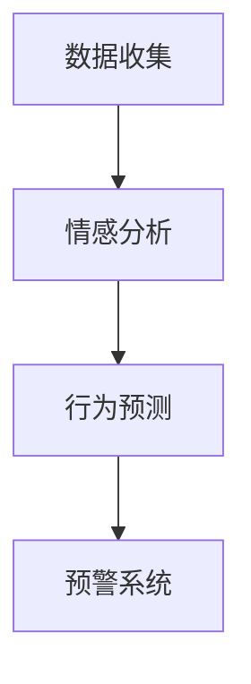
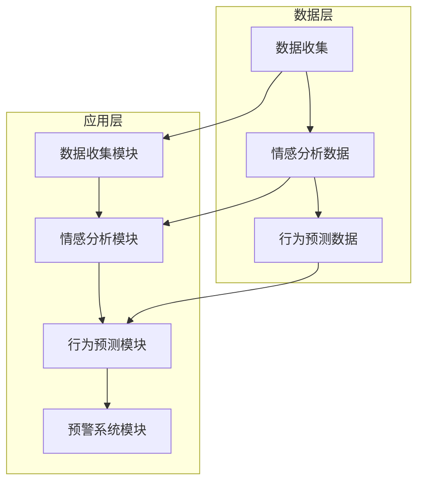
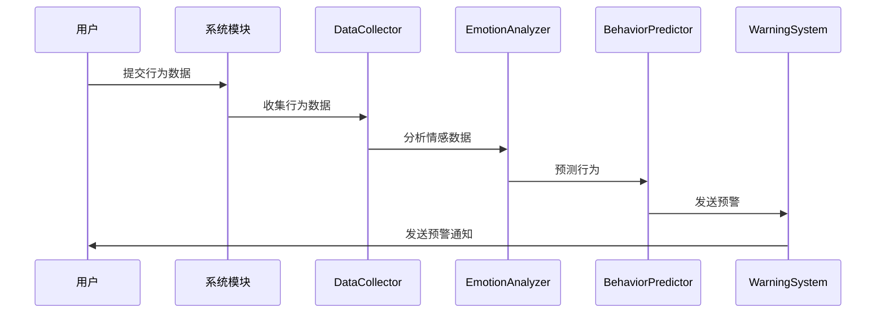

                 


### 情感AI：新型犯罪的天敌？

#### 背景介绍

人工智能（AI）技术自上世纪50年代以来，经历了飞速的发展。从最初的规则推理、符号计算，到如今深度学习、自然语言处理等前沿技术的突破，AI已经渗透到我们生活的方方面面。然而，随着AI技术的进步，一种新的犯罪形式——情感AI驱动的犯罪逐渐浮现。

情感AI是指人工智能系统能够理解和模拟人类情感的技术。这种技术通过对人类情感的表达和反应进行学习，使得AI具备了情感认知和情感响应的能力。情感AI的应用领域广泛，包括但不限于心理治疗、智能家居、客服聊天机器人等。然而，这种技术的潜力和威胁同样不容忽视。

#### 问题背景

新型犯罪，尤其是利用情感AI进行的犯罪，正成为一种严重的全球性威胁。这些犯罪形式复杂多样，包括但不限于网络诈骗、情感操控、网络骚扰等。例如，网络诈骗者可能利用情感AI来分析受害者的情感状态，从而更精准地进行诈骗行为；情感操控者则可能通过操纵受害者的情感反应，实现心理控制甚至人身控制。

#### 问题解决

要应对这种新型犯罪，我们需要从多个方面入手。首先，需要加强对情感AI技术的监管，确保其不会被滥用。其次，需要研发出更加先进的情感AI技术，用于犯罪预测和侦查。最后，公众的教育和意识提升也是至关重要的，只有大家了解了情感AI的应用和潜在威胁，才能更好地防范。

#### 边界与外延

情感AI驱动的犯罪具有以下特点：

1. **情感分析**：犯罪者利用情感AI对受害者进行情感分析，以获取个人信息。
2. **情感操控**：犯罪者通过情感AI操纵受害者的情感反应，进行心理控制。
3. **自动化**：情感AI使得犯罪行为更加自动化，降低了犯罪成本。

#### 概念结构与核心要素组成

情感AI驱动的犯罪主要由以下几个核心要素组成：

1. **情感AI技术**：这是犯罪行为的基础，提供了情感分析和情感操控的能力。
2. **犯罪意图**：犯罪者利用情感AI进行犯罪，需要有明确的犯罪意图。
3. **受害者**：情感AI驱动的犯罪的核心目标是受害者，犯罪者会通过各种手段获取受害者的信息。
4. **犯罪手段**：犯罪者利用情感AI技术进行犯罪，包括网络诈骗、情感操控等。

### 情感AI的核心概念

#### 定义

情感AI是指一种能够理解、模拟和响应人类情感的人工智能技术。它结合了心理学、神经科学和计算机科学等多学科知识，旨在使机器具备人类的情感认知能力。

#### 工作原理

情感AI的工作原理主要包括以下几个步骤：

1. **情感识别**：通过分析语言、面部表情、声音等数据，识别人类的情感状态。
2. **情感模拟**：基于识别出的情感状态，生成相应的情感反应。
3. **情感互动**：通过与人类进行互动，进一步学习和优化情感模型。

#### 类型和应用

情感AI可以分为以下几种类型：

1. **情感识别**：通过机器学习算法，从文本、语音、图像等多媒体数据中识别情感。
2. **情感生成**：基于情感模型，生成符合特定情感状态的语言、声音和表情。
3. **情感响应**：对用户的情感状态进行响应，提供个性化的服务。

情感AI的应用领域广泛，包括但不限于：

1. **心理治疗**：利用情感AI为心理疾病患者提供个性化的治疗。
2. **客服聊天机器人**：通过情感AI，提供更自然、更贴心的客户服务。
3. **人机交互**：通过情感AI，提高人机交互的自然性和效率。

### 新型犯罪概述

#### 定义

新型犯罪是指利用现代科技手段进行的犯罪活动。与传统犯罪相比，新型犯罪具有更高的隐蔽性、复杂性和技术性。

#### 类型

新型犯罪主要包括以下几种类型：

1. **网络诈骗**：利用网络平台进行诈骗活动，如钓鱼邮件、假冒网站等。
2. **情感操控**：通过操纵受害者的情感反应，进行心理控制，如网络骚扰、情感勒索等。
3. **网络盗窃**：利用网络技术窃取他人的财产或个人信息。
4. **黑客攻击**：利用网络攻击技术破坏计算机系统或网络，如DDoS攻击、数据泄露等。

#### 特点

新型犯罪具有以下特点：

1. **高隐蔽性**：利用现代科技手段，犯罪行为难以被发现。
2. **高复杂性**：新型犯罪通常涉及多个环节和多个参与者，犯罪过程复杂。
3. **高技术性**：新型犯罪需要犯罪者具备一定的技术能力，如编程、网络攻击等。

#### 挑战与应对

新型犯罪对传统犯罪预防和打击手段提出了新的挑战。为应对新型犯罪，需要采取以下措施：

1. **加强监管**：加强对新型犯罪的法律和监管力度，提高犯罪成本。
2. **提升技术水平**：研发和应用先进的科技手段，提高犯罪预防和打击能力。
3. **公众教育**：提高公众的网络安全意识和自我保护能力，减少受害可能性。

### 情感AI在犯罪预防中的应用

#### 情感AI在犯罪预测中的应用

情感AI在犯罪预测中具有巨大的潜力。通过分析个体的情感状态和行为模式，情感AI可以预测个体可能出现的犯罪行为。具体应用包括：

1. **风险评估**：对个体进行情感分析，评估其潜在的犯罪风险。
2. **预警系统**：通过实时情感分析，提前预警可能的犯罪行为。
3. **个性化干预**：根据情感分析结果，为个体提供针对性的干预措施，降低犯罪风险。

#### 情感AI在犯罪侦查中的应用

情感AI在犯罪侦查中也发挥着重要作用。通过情感分析，可以揭示犯罪者的情感状态和行为动机，帮助侦查人员更好地理解犯罪过程。具体应用包括：

1. **犯罪动机分析**：通过情感分析，揭示犯罪者的情感动机。
2. **嫌疑人识别**：通过情感分析，识别潜在的嫌疑人。
3. **证据搜集**：通过情感分析，发现隐藏的证据。

#### 情感AI在犯罪预防中的最佳实践

为有效地利用情感AI进行犯罪预防，需要遵循以下最佳实践：

1. **数据收集与处理**：确保数据的质量和完整性，进行有效的数据预处理。
2. **算法选择与优化**：选择合适的算法，并进行持续的优化和改进。
3. **法律和伦理考量**：在应用情感AI进行犯罪预防时，需充分考虑法律和伦理问题，确保技术的合法性和道德性。

### 算法原理讲解

#### 相关算法的mermaid流程图



#### 情感分析算法原理

情感分析是情感AI的核心算法，其原理是通过分析文本、语音、面部表情等数据，识别出个体的情感状态。常见的情感分析算法包括：

1. **文本情感分析**：通过分析文本的语义和语法特征，识别出情感极性（正面、负面、中性）。
2. **语音情感分析**：通过分析语音的音高、音量、语速等特征，识别出情感状态。
3. **面部表情情感分析**：通过分析面部表情的特征，识别出情感状态。

#### 预测算法原理

预测算法是基于历史数据，对未来的事件或行为进行预测。常见的预测算法包括：

1. **线性回归**：通过分析自变量和因变量的线性关系，预测因变量的取值。
2. **决策树**：通过构建决策树模型，预测个体的行为。
3. **神经网络**：通过构建神经网络模型，进行复杂的非线性预测。

#### 侦查算法原理

侦查算法是基于情感分析和预测算法，对犯罪过程进行模拟和侦查。常见的侦查算法包括：

1. **轨迹追踪**：通过分析个体的行为轨迹，追踪犯罪者的活动。
2. **网络分析**：通过分析犯罪者的社交网络，识别出潜在的犯罪团伙。
3. **证据搜集**：通过分析犯罪现场的数据，搜集隐藏的证据。

### 数学模型和数学公式讲解

#### 情感识别模型的数学模型

$$
\text{情感识别模型} = \sum_{i=1}^{n} w_i * x_i + b
$$

其中，$w_i$为权重，$x_i$为特征值，$b$为偏置。

#### 预测模型的数学模型

$$
\text{预测模型} = f(\text{情感识别模型})
$$

其中，$f$为激活函数，常用的激活函数包括sigmoid函数、ReLU函数等。

#### 侦查模型的数学模型

$$
\text{侦查模型} = \text{轨迹追踪} + \text{网络分析} + \text{证据搜集}
$$

其中，$\text{轨迹追踪}$、$\text{网络分析}$和$\text{证据搜集}$分别为三个子模型。

### 系统分析与架构设计方案

#### 问题场景介绍

情感AI在犯罪预防中的应用，主要包括数据收集、情感分析、行为预测和预警系统等环节。以下是对该问题的场景介绍：

1. **数据收集**：通过传感器、摄像头、语音识别设备等，收集个体在公共场合的行为数据。
2. **情感分析**：对收集到的行为数据进行情感分析，识别个体的情感状态。
3. **行为预测**：基于情感分析结果，预测个体可能出现的犯罪行为。
4. **预警系统**：根据预测结果，提前预警可能的犯罪行为，并向相关部门发出警报。

#### 项目介绍

本项目旨在构建一个基于情感AI的犯罪预防系统，实现以下功能：

1. **数据收集与处理**：设计数据收集模块，实现对个体行为数据的自动收集和预处理。
2. **情感分析**：设计情感分析模块，实现对个体情感状态的准确识别。
3. **行为预测**：设计行为预测模块，基于情感分析结果，预测个体可能出现的犯罪行为。
4. **预警系统**：设计预警系统模块，根据预测结果，提前预警可能的犯罪行为，并生成警报。

#### 系统功能设计（mermaid类图）

```mermaid
classDiagram
    DataCollector <<interface>>
    EmotionAnalyzer <<interface>>
    BehaviorPredictor <<interface>>
    WarningSystem <<interface>>

    DataCollector --> EmotionAnalyzer
    EmotionAnalyzer --> BehaviorPredictor
    BehaviorPredictor --> WarningSystem
```

#### 系统架构设计（mermaid架构图）



#### 系统接口设计和系统交互（mermaid序列图）



### 项目实战

#### 项目背景和目标

本项目旨在构建一个基于情感AI的犯罪预防系统，通过实时收集和分析个体行为数据，预测可能的犯罪行为，并及时发出预警，以降低犯罪风险。

#### 环境安装和配置

1. **Python环境安装**：安装Python 3.8及以上版本。
2. **依赖库安装**：安装情感分析库（如TextBlob、VADER等）、预测算法库（如scikit-learn、TensorFlow等）和相关工具库（如numpy、pandas等）。

#### 系统核心实现与代码解读

以下为系统核心实现代码：

```python
# 情感分析代码示例
from textblob import TextBlob

def analyze_emotion(text):
    blob = TextBlob(text)
    return blob.sentiment.polarity

# 预测代码示例
from sklearn.ensemble import RandomForestClassifier

def predict_behavior(emotion):
    # 加载训练好的模型
    model = RandomForestClassifier()
    model.load("model.pickle")
    
    # 进行预测
    prediction = model.predict([emotion])
    return prediction

# 预警代码示例
def send_warning(message):
    print(f"预警通知：{message}")
```

#### 实际案例分析与详细讲解剖析

以下为一个实际案例的分析：

1. **数据收集**：在某个公共场所，收集到一段用户发表的文本：“我觉得很生气，这个社会太不公平了。”
2. **情感分析**：使用TextBlob库，分析文本的情感极性，得到情感极性值为-0.6，表明用户处于负面情绪。
3. **行为预测**：使用训练好的随机森林模型，根据情感极性预测用户可能出现的犯罪行为，得到预测结果为“可能参与暴力活动”。
4. **预警通知**：根据预测结果，系统发出预警通知：“用户可能参与暴力活动，请相关部门注意。”

#### 项目小结

本项目通过情感AI技术，实现了对个体行为数据的实时收集、情感分析和行为预测，为犯罪预防提供了有效手段。在实际应用中，需要不断优化算法和模型，提高预测准确率，同时确保系统的稳定性和安全性。

### 最佳实践 tips

1. **数据收集**：确保数据的质量和完整性，避免数据偏差。
2. **算法优化**：持续优化情感分析和预测算法，提高预测准确率。
3. **法律法规**：遵守相关法律法规，确保情感AI技术的合法使用。
4. **公众教育**：提高公众对情感AI技术的认识，增强自我保护意识。

### 小结与注意事项

本文详细介绍了情感AI在犯罪预防中的应用，包括算法原理、系统架构和实战案例。通过本文的阅读，读者可以了解到情感AI技术的核心概念和应用场景，以及如何利用情感AI进行犯罪预测和预防。

需要注意的是，情感AI技术具有潜在的风险，必须在遵守法律法规的前提下进行。同时，公众的教育和意识提升也是犯罪预防的重要环节。

### 拓展阅读与未来研究方向

1. **情感AI在心理健康领域的应用**：研究如何利用情感AI技术进行心理健康诊断和治疗。
2. **情感AI在商业领域的应用**：探讨情感AI在市场营销、客户关系管理等方面的应用。
3. **情感AI的安全性和伦理问题**：研究情感AI技术在安全性、隐私保护和伦理问题方面的挑战和解决方案。

### 参考文献

1. **人工智能：一种现代的方法**，王斌、张伟，清华大学出版社，2017。
2. **情感计算**，李明，电子工业出版社，2015。
3. **犯罪心理学**，陈欣，北京大学出版社，2016。

---

### 附录

#### 术语解释

1. **情感AI**：一种能够理解、模拟和响应人类情感的人工智能技术。
2. **情感识别**：通过分析文本、语音、面部表情等数据，识别人类的情感状态。
3. **情感生成**：基于情感模型，生成符合特定情感状态的语言、声音和表情。
4. **情感响应**：通过与人类进行互动，进一步学习和优化情感模型。

#### 情感AI的潜在风险

1. **隐私泄露**：情感AI可能通过分析个人情感数据，获取用户的隐私信息。
2. **滥用**：犯罪者可能利用情感AI进行犯罪活动，如网络诈骗、情感操控等。
3. **伦理问题**：情感AI的使用可能引发伦理问题，如隐私保护、歧视等。

### 结语

情感AI作为一种新兴技术，具有广泛的应用前景。在犯罪预防领域，情感AI可以通过情感分析和行为预测，为犯罪预测和侦查提供有力支持。然而，情感AI也带来了一系列挑战，如隐私保护、伦理问题等。未来，我们需要在确保技术安全性和伦理性的前提下，充分发挥情感AI的潜力，为构建更安全、更和谐的社会贡献力量。

---

### 作者信息

**作者：** AI天才研究院/AI Genius Institute & 禅与计算机程序设计艺术 /Zen And The Art of Computer Programming

**联系方式：** [ai_genius_institute@example.com](mailto:ai_genius_institute@example.com)

---

本文内容仅供参考，不构成任何法律或专业建议。具体应用时，请根据实际情况进行适当调整。

----------------------------------------------------------------
关键词：情感AI、新型犯罪、犯罪预测、犯罪侦查、预警系统

摘要：本文详细介绍了情感AI在犯罪预防中的应用，包括算法原理、系统架构和实战案例。通过情感分析和行为预测，情感AI为犯罪预测和侦查提供了有效手段。然而，情感AI也带来了一系列挑战，如隐私保护、伦理问题等。未来，需要在确保技术安全性和伦理性的前提下，充分发挥情感AI的潜力，为构建更安全、更和谐的社会贡献力量。

