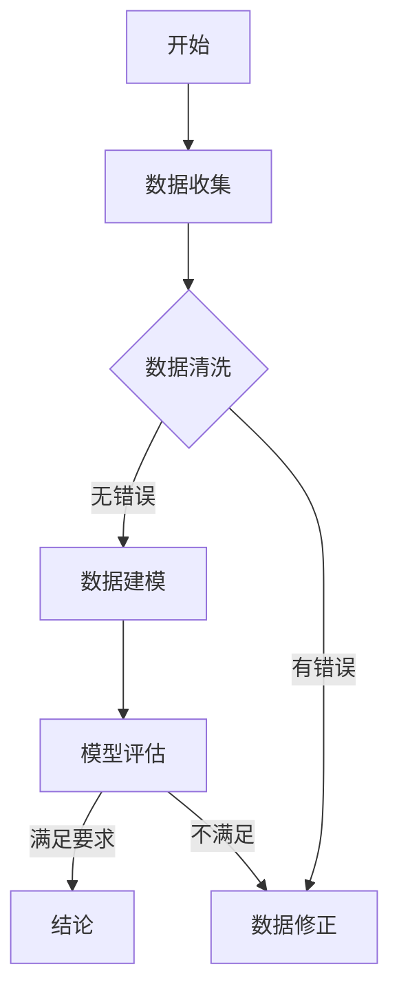

                 

### 步骤1：书名理解

书名《具有欲望的AI对人口分布的影响》传达了以下几个核心概念：

1. **AI的欲望属性**：这指的是人工智能不仅仅是一个计算工具，它可能拥有某种形式的目标和偏好，类似于人类的欲望。这种欲望可能是自我驱动的，也可能是外部因素激发的。

2. **人口分布**：人口分布是指人口在不同地理区域、经济和社会条件下的分布情况。这涉及到迁移、城市化、人口密度等多个方面。

3. **影响**：书名暗示了AI的欲望属性将对人口分布产生某种形式的影响，可能是正面的，也可能是负面的。

综合以上几个方面，本书可能会探讨以下几个核心问题：

- AI如何被设计成具有欲望属性？
- 这些欲望如何影响人类的行为和决策？
- AI欲望对人口分布的具体影响是什么？
- 这些影响背后的机制是什么？
- 我们如何应对和缓解这些影响？

### 步骤2：确定大纲核心章节

根据书名的理解，我们确定以下核心章节：

#### 引言

- **问题背景**：介绍AI和人口分布的基本概念、现状及其重要性。
- **研究目的**：阐述本书的研究目标和研究方法。

#### 第一章：AI技术的基本概念与欲望属性

- **AI技术的基本概念**：介绍AI的历史、发展、核心组成部分和应用领域。
- **欲望属性**：讨论AI是否可能拥有欲望，以及这些欲望是如何影响其行为的。

#### 第二章：人口分布的现状与变化

- **人口分布的现状**：分析当前人口分布的趋势、特点和挑战。
- **人口分布的变化**：探讨人口分布的未来变化趋势及其影响因素。

#### 第三章：AI对人口分布的影响

- **AI的影响**：分析AI技术如何影响人口迁移、城市化等人口分布现象。
- **案例分析**：通过具体案例说明AI对人口分布的实际影响。

#### 第四章：AI影响人口分布的机制分析

- **欲望驱动的行为**：探讨AI欲望如何驱动其行为，及其对人口分布的影响。
- **机制模型**：建立和分析AI影响人口分布的机制模型。

#### 第五章：未来人口分布的预测

- **预测方法**：介绍预测人口分布的方法和技术。
- **预测结果**：展示基于AI欲望假设的未来人口分布预测。

#### 第六章：政策建议与应对措施

- **政策建议**：根据分析结果，提出应对AI对人口分布影响的政策建议。
- **应对措施**：讨论实施这些政策建议的具体措施。

#### 第七章：总结与展望

- **总结**：回顾本书的主要发现和结论。
- **展望**：讨论未来研究的方向和可能的创新点。

### 步骤3：细化每个章节

在每个章节中，我们将进一步细化内容，确保每个章节都有至少两个子章节。以下是详细的大纲结构：

#### 引言

- **1.1 问题背景**
  - **1.1.1 人口分布的基本概念**
  - **1.1.2 人口分布的现状与挑战**
- **1.2 AI技术的基本概念**
  - **1.2.1 AI技术的发展历程**
  - **1.2.2 AI技术的核心组成**
  - **1.2.3 AI的欲望属性探讨**
- **1.3 研究意义与目的**
  - **1.3.1 人口分布研究的重要性**
  - **1.3.2 AI技术在人口分布研究中的应用前景**
  - **1.3.3 研究的总体思路与方法**

#### 第一章：AI技术的基本概念与欲望属性

- **2.1 AI技术的基本概念**
  - **2.1.1 AI技术的发展历程**
  - **2.1.2 AI技术的核心组成**
  - **2.1.3 AI的欲望属性探讨**
- **2.2 AI欲望属性的实现与影响**
  - **2.2.1 欲望属性的定义与实现**
  - **2.2.2 欲望属性对AI行为的驱动作用**

#### 第二章：人口分布的现状与变化

- **3.1 人口分布的现状**
  - **3.1.1 当前人口分布的趋势**
  - **3.1.2 人口分布的特点**
- **3.2 人口分布的变化**
  - **3.2.1 预测未来人口分布变化**
  - **3.2.2 影响人口分布变化的因素**

#### 第三章：AI对人口分布的影响

- **4.1 AI对人口迁移的影响**
  - **4.1.1 AI技术与人口迁移的关系**
  - **4.1.2 案例分析**
- **4.2 AI对城市化进程的影响**
  - **4.2.1 AI与城市发展的互动**
  - **4.2.2 案例分析**

#### 第四章：AI影响人口分布的机制分析

- **5.1 欲望驱动的AI行为**
  - **5.1.1 欲望属性在AI中的实现**
  - **5.1.2 欲望驱动行为的模型分析**
- **5.2 AI与人口分布的交互机制**
  - **5.2.1 交互模型构建**
  - **5.2.2 影响机制分析**

#### 第五章：未来人口分布的预测

- **6.1 预测方法**
  - **6.1.1 时间序列分析**
  - **6.1.2 机器学习预测模型**
- **6.2 预测结果与分析**
  - **6.2.1 人口迁移预测结果**
  - **6.2.2 人口密度预测结果**

#### 第六章：政策建议与应对措施

- **7.1 政策建议**
  - **7.1.1 应对AI影响的人口分布策略**
  - **7.1.2 政策实施的挑战与解决方案**
- **7.2 应对措施**
  - **7.2.1 技术措施**
  - **7.2.2 政策措施**

#### 第七章：总结与展望

- **8.1 总结**
  - **8.1.1 主要发现与结论**
  - **8.1.2 研究局限与未来方向**
- **8.2 展望**
  - **8.2.1 未来研究的可能性**
  - **8.2.2 AI与人口分布研究的前景**

### 步骤4：应用mermaid和LaTeX

在相关章节中，我们将使用mermaid绘制流程图、类图和序列图，使用LaTeX展示数学模型和公式。例如：

#### mermaid流程图示例：

#### LaTeX公式示例：

$$
    E = mc^2
$$

$$
    y = mx + b
$$

### 步骤5：保持简洁和格式规范

我们将确保文章内容简洁明了，遵循markdown格式规范，保持层级清晰。文章末尾将附上作者信息，并包含完整的内容和必要的小结、注意事项和拓展阅读建议。

---

现在，我们有了详细的目录大纲，下一步将开始撰写文章，逐步填充每个章节的内容，确保文章的逻辑性、专业性和可读性。让我们开始深入探讨AI的欲望属性及其对人口分布的深远影响。

