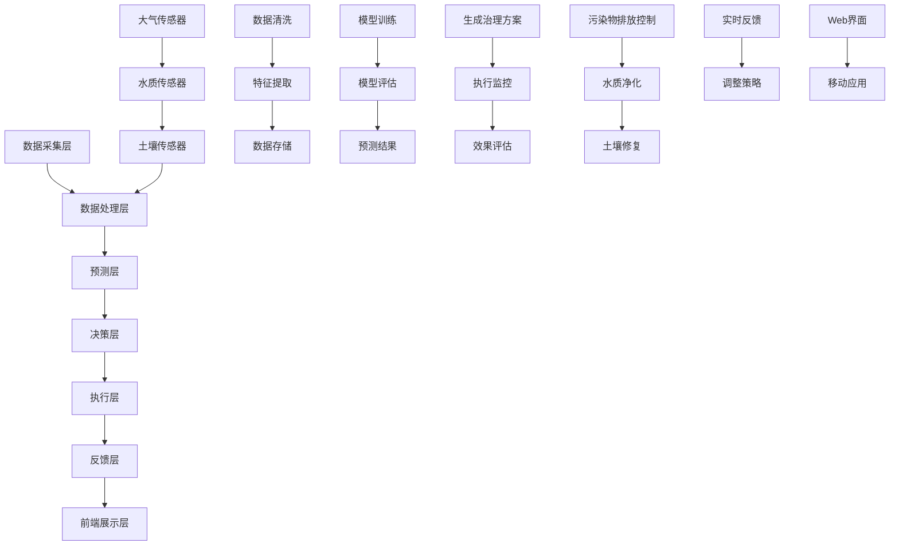

                 

### 《具有欲望的AI对环境保护的影响》

#### 关键词：人工智能、环境保护、欲望驱动、算法原理、系统架构、项目实战

> 摘要：本文旨在探讨具有欲望的AI在环境保护中的应用及其潜在影响。通过分析环境保护的重要性、AI技术的迅速发展以及具有欲望的AI的特点，我们提出了一种将欲望驱动机制应用于环境保护的全新思路。文章将从核心概念、算法原理、系统架构和项目实战等方面展开论述，旨在为AI在环境保护领域的应用提供理论支持和实践指导。

----------------------------------------------------------------

### 《具有欲望的AI对环境保护的影响》目录大纲

----------------------------------------------------------------

#### 第一部分：问题背景与核心概念

##### 第1章：问题背景

##### 第2章：核心概念原理

##### 第3章：概念属性特征对比

##### 第4章：ER实体关系图架构

#### 第二部分：核心概念与联系

##### 第5章：算法原理与数学模型

##### 第6章：系统功能设计与架构

##### 第7章：系统接口设计与交互

##### 第8章：系统分析与架构设计

##### 第9章：项目实战

----------------------------------------------------------------

#### 第一部分：问题背景与核心概念

##### 第1章：问题背景

##### 1.1 环境保护的重要性

环境保护是当今世界面临的重大挑战之一。全球气候变化、水资源短缺、生物多样性丧失等问题日益严重，威胁着人类的生存和发展。环境保护的重要性不言而喻，它关系到人类社会的可持续发展、地球生态系统的稳定以及人类健康福祉。

##### 1.1.1 全球环境现状

全球环境现状令人担忧。根据联合国环境规划署（UNEP）的数据，全球每年排放的二氧化碳超过300亿吨，导致全球气候变暖。森林砍伐、草原退化、湿地破坏等生态问题也在不断加剧。此外，环境污染问题也日益突出，例如大气污染、水污染和土壤污染等。这些问题不仅影响人类健康，还对地球生态系统产生深远影响。

##### 1.1.2 环境污染与生态破坏

环境污染和生态破坏是环境保护面临的主要问题。大气污染主要来源于工业排放、交通尾气和化石燃料燃烧。水污染主要来源于工业废水、生活污水和农业面源污染。土壤污染主要来源于农药、化肥和工业废弃物。这些污染物对人类健康和生态环境产生严重影响，导致呼吸系统疾病、心血管疾病和癌症等疾病发病率上升，同时破坏了生态系统的平衡和功能。

##### 1.1.3 环境保护的必要性

环境保护的必要性体现在多个方面。首先，环境保护是保障人类健康的基本要求。良好的生态环境是人类生存和发展的基础，污染严重的环境会对人类健康造成严重威胁。其次，环境保护是维护生态平衡的必要手段。生态系统的稳定和功能对于地球的可持续发展至关重要。最后，环境保护是推动经济转型升级的重要途径。绿色发展、循环经济和低碳经济等理念的提出，为环境保护提供了新的发展模式。

##### 第2章：核心概念原理

##### 2.1 环境保护相关概念

环境保护涉及多个核心概念，包括环境、生态系统、环境污染与控制、环境监测与评估等。

- 环境：环境是指围绕生物体周围的各种自然因素和条件，包括大气、水、土壤、生物等。
- 生态系统：生态系统是指生物与环境之间相互作用形成的生物群落和其周围环境的总体。
- 环境污染：环境污染是指人类活动排放的污染物超过环境自净能力，导致环境质量下降，对生物和人类健康产生危害。
- 环境控制：环境控制是指通过技术和管理手段，减少污染物的排放，降低环境污染程度，保护生态环境。
- 环境监测：环境监测是指对环境质量进行定期监测、评估和预警，以了解环境状况和污染水平。
- 环境评估：环境评估是指对环境影响进行分析和评估，为环境保护决策提供科学依据。

##### 2.2 AI技术相关概念

AI技术是当今科技发展的前沿领域，其相关概念包括机器学习、深度学习、神经网络和人工智能等。

- 机器学习：机器学习是指利用数据和算法，使计算机自动从数据中学习规律和模式，进行预测和决策。
- 深度学习：深度学习是机器学习的一种方法，通过多层神经网络进行特征提取和模型训练，实现复杂任务的自动推理和决策。
- 神经网络：神经网络是一种模仿生物神经系统的计算模型，通过神经元之间的连接和激活函数，实现数据的输入和输出。
- 人工智能：人工智能是指计算机模拟人类智能，实现感知、思考、决策和行动等能力。

##### 2.3 欲望与AI的关系

欲望是人类和生物的基本属性，反映了生物对生存和发展的需求。在AI领域，具有欲望的AI是指通过设计算法和模型，使AI系统具备类似人类欲望的特征，从而更好地适应环境和实现目标。

- 欲望的定义与来源：欲望是指生物对特定目标的渴求和追求，来源于生物的本能需求和社会化过程。
- 具有欲望的AI的特点：具有欲望的AI通过感知、学习和决策，表现出类似人类的欲望特征，包括目标追求、自主行动和情感体验等。
- 欲望对AI行为的影响：欲望驱动AI系统的行为，使其在特定目标和环境中表现出更强的适应性和自主性，从而提高AI系统的性能和应用效果。

##### 第3章：概念属性特征对比

##### 3.1 环境保护与AI技术的对比

环境保护和AI技术是两个不同但相互关联的领域，其目标和手段存在一定差异。

- 目标与手段：环境保护的目标是保护生态环境、维护生态平衡和保障人类健康，主要通过环境监测、污染控制和生态修复等手段实现。AI技术的目标是通过模拟人类智能，实现自动化和智能化，主要通过机器学习、深度学习和神经网络等技术手段实现。
- 技术与应用：环境保护技术主要应用于环境监测、污染控制和生态修复等领域，如传感器技术、生态模型和环保设备等。AI技术主要应用于数据挖掘、智能决策和自动化控制等领域，如数据分析和智能监控等。
- 优势与挑战：环境保护技术具有环保、高效和可持续等优势，但也面临技术复杂、成本高昂和效果不稳定等挑战。AI技术具有智能化、自适应和高效等优势，但也面临数据安全、隐私保护和算法偏见等挑战。

##### 3.2 欲望在AI系统中的属性特征

欲望是生物的基本属性，在AI系统中可以通过算法和模型进行模拟和实现。欲望在AI系统中的属性特征包括来源、类型和表现形式等。

- 欲望的来源与类型：欲望的来源可以是生物本能需求、社会化需求或系统设计需求等。欲望的类型包括生存欲望、发展欲望、娱乐欲望等。
- 次要属性特征：欲望在AI系统中的表现形式包括目标追求、自主行动、情感体验和决策优化等。

##### 第4章：ER实体关系图架构

##### 4.1 环境保护相关实体

在环境保护领域，涉及多个实体，包括环境监测站、环境污染源和环境保护组织等。

- 环境监测站：环境监测站是负责环境监测和污染预警的机构，主要包括监测设备、监测数据和监测报告等。
- 环境污染源：环境污染源是产生污染物的源头，主要包括工业排放、交通排放和生活排放等。
- 环境保护组织：环境保护组织是负责环境保护和生态修复的社会团体，主要包括政策倡导、项目实施和公众参与等。

##### 4.2 AI技术与实体关系

在AI技术领域，涉及多个实体，包括智能传感器、模型训练与优化和AI决策支持系统等。

- 智能传感器：智能传感器是用于环境监测和污染检测的设备，主要包括传感器模块、数据处理模块和通信模块等。
- 模型训练与优化：模型训练与优化是用于AI算法训练和性能提升的过程，主要包括数据预处理、模型训练和模型评估等。
- AI决策支持系统：AI决策支持系统是用于环境治理和生态修复的智能系统，主要包括数据采集、决策算法和执行控制等。

##### 4.3 具有欲望的AI实体关系

具有欲望的AI系统是通过对AI算法和模型进行设计，使其具备类似人类欲望的特征。具有欲望的AI系统涉及多个实体，包括欲望驱动模块、欲望感知与反馈模块和欲望调节模块等。

- 次要属性特征：欲望驱动模块是用于实现AI欲望驱动的核心组件，包括目标识别、决策优化和自主行动等。欲望感知与反馈模块是用于实现AI欲望感知和反馈的核心组件，包括感知器、信号处理和反馈机制等。欲望调节模块是用于实现AI欲望调节的核心组件，包括反馈调节和欲望优化等。

----------------------------------------------------------------

#### 第一部分：问题背景与核心概念

##### 第1章：问题背景

##### 1.1 环境保护的重要性

环境保护是当今世界面临的重大挑战之一。随着工业化和城市化的快速发展，环境污染和生态破坏问题日益严重，对人类健康和地球生态系统造成了严重威胁。环境保护的重要性体现在以下几个方面：

1. **人类健康保障**：环境污染会直接影响人类健康。空气中的有害物质、水中的污染物和土壤中的有害化学物质都可能对人体的呼吸系统、消化系统和神经系统造成损害。长期接触这些污染物可能导致慢性疾病，如哮喘、肺癌、心血管疾病和癌症等。因此，保护环境不仅是为了维护生态平衡，也是为了保障人类的健康和福祉。

2. **生态系统的可持续性**：地球上的生态系统是一个复杂的网络，各个组成部分相互依赖和相互作用。当生态系统受到破坏时，生物多样性会减少，物种灭绝的风险增加，生态平衡被打破。这不仅影响了自然界的健康，也对人类赖以生存的农业、渔业和林业产生了负面影响。

3. **气候变化应对**：气候变化是21世纪最紧迫的环境问题之一。全球变暖导致海平面上升、极端天气事件增多、冰川融化和生态系统改变。环境保护措施，如减少温室气体排放、保护森林和湿地，是应对气候变化的关键策略。

4. **经济可持续性**：环境保护与经济发展密切相关。可持续的环境管理有助于提高资源利用效率、减少环境污染成本，并促进绿色产业的发展。绿色经济不仅能够创造就业机会，还能推动技术创新和经济增长。

##### 1.1.1 全球环境现状

全球环境现状令人担忧。以下是一些关键的环境问题：

- **气候变化**：根据联合国政府间气候变化专门委员会（IPCC）的报告，全球平均气温在过去一个世纪里上升了约1.1摄氏度，预计到本世纪末可能上升1.5至2摄氏度。气候变化导致了海平面上升、极端天气事件的频率和强度增加，以及农业和渔业生产的不稳定性。

- **生物多样性丧失**：生物多样性是指地球上所有生物的多样性，包括物种、生态系统和遗传多样性。据估计，目前地球上的物种灭绝速度是自然灭绝速度的1000倍。森林砍伐、栖息地破坏和污染是主要原因。

- **水资源短缺**：全球许多地区面临着水资源的短缺问题。工业化和城市化导致了水资源的过度开发和污染，加剧了水资源的紧张状况。

- **土地退化**：土地退化是指土地的生产力下降，通常由于土壤侵蚀、荒漠化、盐碱化和化学污染等原因引起。土地退化对粮食安全和生态平衡产生了严重影响。

- **大气污染**：大气污染是现代社会面临的一个严峻挑战。汽车尾气、工业排放和化石燃料燃烧产生的污染物，如二氧化硫、氮氧化物和颗粒物，对环境和人类健康造成了严重危害。

##### 1.1.2 环境污染与生态破坏

环境污染和生态破坏是环境保护面临的主要问题。以下是一些具体的环境污染和生态破坏现象：

- **大气污染**：工业排放、交通尾气和化石燃料燃烧是大气污染的主要来源。大气污染物如二氧化硫、氮氧化物和颗粒物会导致呼吸系统疾病、心血管疾病和肺癌。

- **水污染**：工业废水、生活污水和农业面源污染是水污染的主要来源。水污染会导致饮用水源短缺、水体富营养化和水生生物死亡。

- **土壤污染**：农药、化肥和工业废弃物是土壤污染的主要来源。土壤污染会影响农产品的质量和土壤的肥力，对农业生产和食品安全构成威胁。

- **森林砍伐**：全球森林砍伐速度加快，导致森林资源减少和生物多样性丧失。森林是地球的“绿肺”，其减少会影响气候调节和碳储存能力。

- **草原退化**：草原退化是由于过度放牧、水资源短缺和气候变化等原因引起的。草原退化会导致草原生态系统失衡、草原植被减少和土壤侵蚀。

- **湿地破坏**：湿地是地球上最重要的生态系统之一，具有蓄水、防洪、净化水质和维持生物多样性等功能。湿地破坏会导致湿地功能丧失、水资源短缺和生态失衡。

##### 1.1.3 环境保护的必要性

环境保护的必要性体现在以下几个方面：

1. **可持续发展的需要**：环境保护是可持续发展的重要组成部分。只有通过环境保护，才能确保自然资源得到合理利用，经济和社会发展不损害环境，实现长期的生态平衡和社会福祉。

2. **人类健康的保障**：环境保护直接关系到人类的健康。通过减少污染、保护生态环境，可以预防疾病、提高生活质量，保障人类的健康和福祉。

3. **生态系统的保护**：环境保护是保护生态系统多样性和稳定性的重要手段。通过保护自然环境，可以维护生态系统的健康，保护物种和生物多样性。

4. **气候变化应对**：环境保护是应对气候变化的关键措施。通过减少温室气体排放、增加碳汇和推广可再生能源，可以缓解气候变化带来的负面影响。

5. **经济和社会发展的需要**：环境保护可以促进绿色经济的发展，推动技术创新和产业升级，提高资源利用效率，降低环境污染成本，从而实现经济和社会的可持续发展。

##### 1.2 AI技术的迅速发展

AI技术，即人工智能技术，是计算机科学的一个重要分支，它致力于使计算机系统能够模拟、延伸和扩展人类的智能。近年来，AI技术得到了迅猛发展，并已成为推动社会进步和经济发展的关键力量。以下是AI技术的一些重要特点和发展历程：

1. **定义与特点**

AI技术主要包括机器学习、深度学习和神经网络等子领域。其主要特点如下：

- **自主学习能力**：AI系统能够通过学习大量数据，自动识别模式和规律，无需显式编程。
- **自动化决策**：AI系统可以自动做出决策，处理复杂的问题，提高效率和准确性。
- **自适应能力**：AI系统能够根据环境和数据的改变，自适应调整其行为和决策。
- **跨领域应用**：AI技术在医疗、金融、交通、教育等多个领域都有广泛应用，展示了其强大的通用性和灵活性。

2. **发展历程**

AI技术的发展经历了几个关键阶段：

- **初始阶段（20世纪50-60年代）**：AI概念首次被提出，人工智能研究开始兴起。在这个阶段，研究者主要关注如何模拟人类智能的基本机制，如逻辑推理、问题解决和知识表示。
- **低谷阶段（20世纪70-80年代）**：由于算法复杂度高、计算能力有限以及数据集不足，AI技术的研究遭遇了困境，被称为“AI寒冬”。
- **复苏阶段（20世纪90年代）**：随着计算机性能的提升和大数据的出现，AI技术开始复苏。这个时期，机器学习和深度学习等算法得到了快速发展。
- **快速发展阶段（21世纪初至今）**：得益于深度学习算法的突破和云计算技术的普及，AI技术进入了快速发展阶段。从语音识别、图像处理到自动驾驶、智能医疗，AI技术在各个领域都取得了显著的成果。

3. **在环境保护中的应用现状**

AI技术在环境保护中具有广泛的应用前景，以下是一些关键应用领域：

- **环境监测**：利用无人机、传感器和卫星等设备，实时监测大气、水质和土壤等环境指标，提供准确、及时的环境数据。
- **污染源识别**：通过分析大量的环境数据，利用机器学习算法识别污染源，预测污染扩散趋势，制定相应的治理措施。
- **生态评估**：利用AI技术对生态系统进行评估，预测生态系统变化对生物多样性和人类健康的影响，为生态保护提供科学依据。
- **能源管理**：通过智能电网和智能建筑技术，优化能源使用，降低能源消耗和碳排放，推动绿色能源的发展。
- **灾害预测与应急响应**：利用AI技术预测地震、洪水、台风等自然灾害的发生和影响范围，提供及时、有效的应急响应方案。

##### 1.3 具有欲望的AI

具有欲望的AI是指通过设计特定的算法和模型，使AI系统具备类似人类的欲望和动机。在传统AI系统中，算法和模型主要基于逻辑推理、规则和模式识别等，缺乏情感和欲望的驱动。具有欲望的AI则通过模拟人类的欲望和动机，使AI系统更具自主性和适应性。

1. **欲望的定义与来源**

欲望是人类和动物追求特定目标的心理驱动力。在AI领域，欲望可以通过以下几个方面来定义和实现：

- **目标驱动**：AI系统可以通过设定特定的目标，如优化能源使用、减少污染排放等，来驱动其行为。
- **情感驱动**：通过模拟情感，如快乐、悲伤、愤怒等，使AI系统在特定情境下产生相应的行为。
- **动机驱动**：AI系统可以根据内在的动机，如好奇心、探索欲等，主动寻求新知识和解决方案。

欲望的来源可以是系统设计者预设的目标和动机，也可以是AI系统通过学习大量数据自动生成的。

2. **具有欲望的AI的特点**

具有欲望的AI系统具有以下特点：

- **自主性**：具有欲望的AI系统能够根据内在的欲望自主决策和行动，而不仅仅是被动地响应外部指令。
- **适应性**：AI系统能够根据环境和目标的变化，自适应调整其行为和策略，以实现最佳效果。
- **情感化**：通过模拟情感，AI系统可以更好地理解和应对人类情感，提高人机交互的质量。
- **创造性**：具有欲望的AI系统可以主动探索和尝试新的解决方案，提高创新和解决问题的能力。

3. **欲望对AI行为的影响**

欲望对AI行为的影响主要体现在以下几个方面：

- **目标导向**：具有欲望的AI系统能够明确目标，并通过多种手段实现目标，提高系统的效能和效率。
- **适应性**：AI系统能够根据环境和目标的变化，调整行为和策略，提高系统的适应性和灵活性。
- **情感互动**：通过模拟情感，AI系统可以更好地理解和应对人类情感，提高人机交互的效率和满意度。
- **创新驱动**：欲望驱动AI系统能够主动探索和尝试新的解决方案，提高系统的创新能力和解决问题的能力。

总的来说，具有欲望的AI在环境保护领域具有巨大的潜力，可以为环境监测、污染治理和生态修复等提供新的思路和方法。

----------------------------------------------------------------

#### 第二部分：核心概念与联系

##### 第2章：核心概念原理

##### 2.1 环境保护相关概念

环境保护是一个涉及多个领域和层面的复杂问题，其相关概念包括环境、生态系统、环境污染与控制、环境监测与评估等。以下是这些概念的定义、作用和相互关系：

1. **环境**：环境是指围绕生物体周围的各种自然因素和条件，包括大气、水、土壤、生物等。环境是人类和其他生物生存和发展的基础，其质量直接影响生物的健康和生态系统的稳定性。

2. **生态系统**：生态系统是指生物与环境之间相互作用形成的生物群落和其周围环境的总体。生态系统包括生产者（如植物）、消费者（如动物）和分解者（如细菌和真菌）等组成部分，通过物质循环、能量流动和信息传递维持其稳定性和功能。

3. **环境污染**：环境污染是指人类活动排放的污染物超过环境自净能力，导致环境质量下降，对生物和人类健康产生危害。环境污染的主要来源包括工业排放、交通污染、农业污染和生活污染等。

4. **环境控制**：环境控制是指通过技术和管理手段，减少污染物的排放，降低环境污染程度，保护生态环境。环境控制措施包括污染源控制、污染治理、环境监测和评估等。

5. **环境监测**：环境监测是指对环境质量进行定期监测、评估和预警，以了解环境状况和污染水平。环境监测包括大气监测、水质监测、土壤监测等，通过监测数据可以及时发现问题、采取相应措施。

6. **环境评估**：环境评估是指对环境影响进行分析和评估，为环境保护决策提供科学依据。环境评估包括环境影响评价、环境质量评估和生态风险评估等，旨在评估人类活动对环境的影响，制定相应的环境保护措施。

##### 2.2 AI技术相关概念

AI技术，即人工智能技术，是计算机科学的一个重要分支，其核心目的是使计算机系统具备类似人类的智能。以下是AI技术的一些关键概念：

1. **机器学习**：机器学习是一种通过数据训练模型，使计算机系统能够自动学习和改进的算法。机器学习算法主要包括监督学习、无监督学习和强化学习等。

2. **深度学习**：深度学习是机器学习的一种方法，通过多层神经网络进行特征提取和模型训练，实现复杂任务的自动推理和决策。深度学习在图像识别、语音识别和自然语言处理等领域取得了显著成果。

3. **神经网络**：神经网络是一种模拟生物神经系统的计算模型，通过神经元之间的连接和激活函数，实现数据的输入和输出。神经网络可以分为浅层网络和深层网络，其中深层网络具有更强的特征提取和表示能力。

4. **人工智能**：人工智能是指计算机模拟人类智能，实现感知、思考、决策和行动等能力。人工智能包括弱人工智能和强人工智能，弱人工智能在特定任务上具有智能，而强人工智能具有全面的人类智能。

##### 2.3 欲望与AI的关系

在人类和动物行为学中，欲望是一种内在的心理驱动力，促使个体追求特定的目标或满足特定的需求。在AI领域，具有欲望的AI是指通过设计特定的算法和模型，使AI系统具备类似人类的欲望和动机。以下是对欲望与AI关系的详细探讨：

1. **欲望的定义与来源**

在AI领域，欲望可以定义为AI系统内在的、驱使其行为和决策的驱动力。欲望的来源可以包括以下几个方面：

- **目标驱动**：AI系统可以通过设定特定的目标，如优化能源使用、减少污染排放等，来驱动其行为。这些目标可以是预先设定的，也可以是AI系统通过学习自动生成的。
- **情感驱动**：通过模拟情感，如快乐、悲伤、愤怒等，使AI系统在特定情境下产生相应的行为。情感驱动可以增强AI系统的人机交互体验，提高其适应性和灵活性。
- **动机驱动**：AI系统可以根据内在的动机，如好奇心、探索欲等，主动寻求新知识和解决方案。动机驱动可以激发AI系统的创造力，提高其解决问题的能力。

2. **欲望对AI行为的影响**

欲望对AI行为的影响主要体现在以下几个方面：

- **目标导向**：具有欲望的AI系统能够明确目标，并通过多种手段实现目标，提高系统的效能和效率。
- **适应性**：AI系统能够根据环境和目标的变化，自适应调整其行为和策略，以实现最佳效果。
- **情感互动**：通过模拟情感，AI系统可以更好地理解和应对人类情感，提高人机交互的质量。
- **创新驱动**：欲望驱动AI系统能够主动探索和尝试新的解决方案，提高系统的创新能力和解决问题的能力。

3. **欲望在AI系统中的体现**

在AI系统中，欲望可以通过以下几种方式体现：

- **目标设定与优化**：AI系统可以设定具体的目标，并通过优化算法不断调整和改进，以实现最佳效果。
- **情感模拟与反馈**：AI系统可以通过情感模拟，如人脸识别、语音识别等，与人类进行互动，收集反馈信息，并根据反馈调整行为。
- **自主学习和适应**：AI系统可以自主学习环境变化和用户需求，通过不断调整和优化，提高其适应性和灵活性。

4. **欲望与伦理道德的关系**

在具有欲望的AI系统中，伦理道德是一个重要问题。欲望可能会驱使AI系统做出一些不符合伦理道德的行为，如侵犯隐私、歧视和操纵等。因此，在设计具有欲望的AI系统时，需要充分考虑伦理道德问题，制定相应的伦理规范和约束机制，确保AI系统的行为符合伦理标准，不损害人类的利益和权益。

##### 第3章：概念属性特征对比

##### 3.1 环境保护与AI技术的对比

环境保护和AI技术是两个不同但相互关联的领域。以下是对环境保护与AI技术的一些对比分析：

1. **目标与手段**

- **环境保护**：环境保护的目标是保护生态环境、维护生态平衡和保障人类健康。其主要手段包括环境监测、污染控制和生态修复等。
- **AI技术**：AI技术的目标是模拟人类智能，实现自动化和智能化。其主要手段包括机器学习、深度学习和神经网络等。

2. **技术与应用**

- **环境保护技术**：环境保护技术主要应用于环境监测、污染控制和生态修复等领域，如传感器技术、生态模型和环保设备等。
- **AI技术**：AI技术主要应用于数据挖掘、智能决策和自动化控制等领域，如数据分析和智能监控等。

3. **优势与挑战**

- **环境保护技术**：环境保护技术的优势在于其环保、高效和可持续等特点，但面临技术复杂、成本高昂和效果不稳定等挑战。
- **AI技术**：AI技术的优势在于其智能化、自适应和高效等特点，但面临数据安全、隐私保护和算法偏见等挑战。

##### 3.2 欲望在AI系统中的属性特征

欲望是生物的基本属性，在AI系统中可以通过算法和模型进行模拟和实现。以下是欲望在AI系统中的属性特征：

1. **欲望的来源与类型**

- **来源**：欲望的来源可以是系统设计者预设的目标和动机，也可以是AI系统通过学习大量数据自动生成的。
- **类型**：欲望的类型包括生存欲望、发展欲望、娱乐欲望等。

2. **欲望的表现形式**

- **目标追求**：AI系统可以设定具体的目标，并通过优化算法不断调整和改进，以实现最佳效果。
- **自主行动**：AI系统可以自主决策和行动，而不仅仅是被动地响应外部指令。
- **情感体验**：AI系统可以通过模拟情感，如快乐、悲伤、愤怒等，与人类进行互动，提高人机交互的质量。

3. **欲望对AI决策的影响**

- **目标导向**：具有欲望的AI系统能够明确目标，并通过多种手段实现目标，提高系统的效能和效率。
- **适应性**：AI系统能够根据环境和目标的变化，自适应调整其行为和策略，以实现最佳效果。
- **创新驱动**：欲望驱动AI系统能够主动探索和尝试新的解决方案，提高系统的创新能力和解决问题的能力。

##### 第4章：ER实体关系图架构

##### 4.1 环境保护相关实体

在环境保护领域，涉及多个实体，以下是对这些实体的定义、属性和相互关系的分析：

1. **环境监测站**：环境监测站是负责环境监测和污染预警的机构。其主要职责包括监测大气、水质、土壤等环境指标，收集和分析监测数据，发布监测报告。环境监测站通常由监测设备、监测数据和监测人员等组成。

2. **环境污染源**：环境污染源是产生污染物的源头。根据污染物的类型和来源，环境污染源可以分为工业排放、交通污染、农业污染和生活污染等。环境污染源的主要属性包括排放量、排放方式和排放周期等。

3. **环境保护组织**：环境保护组织是负责环境保护和生态修复的社会团体。其主要活动包括政策倡导、项目实施、公众参与和国际合作等。环境保护组织通常由专业团队、志愿者和合作伙伴等组成。

##### 4.2 AI技术与实体关系

在AI技术领域，涉及多个实体，以下是对这些实体的定义、属性和相互关系的分析：

1. **智能传感器**：智能传感器是用于环境监测和污染检测的设备。其主要功能包括数据采集、数据处理和远程传输。智能传感器的属性包括灵敏度、准确性和可靠性等。

2. **模型训练与优化**：模型训练与优化是AI技术的核心环节。其主要任务是通过大量数据训练模型，优化模型参数，提高模型的预测和决策能力。模型训练与优化的属性包括数据集、训练算法和评估指标等。

3. **AI决策支持系统**：AI决策支持系统是用于环境治理和生态修复的智能系统。其主要功能包括数据收集、数据分析、决策支持和执行控制。AI决策支持系统的属性包括系统架构、算法模型和用户界面等。

##### 4.3 具有欲望的AI实体关系

具有欲望的AI系统是通过对AI算法和模型进行设计，使其具备类似人类欲望的特征。以下是对具有欲望的AI系统的定义、属性和相互关系的分析：

1. **欲望驱动模块**：欲望驱动模块是具有欲望的AI系统的核心组件。其主要功能是设定目标、优化行为和驱动决策。欲望驱动模块的属性包括目标库、行为库和决策算法等。

2. **欲望感知与反馈模块**：欲望感知与反馈模块是用于感知外部环境和用户需求，提供反馈信息给欲望驱动模块的组件。其主要功能包括感知器、信号处理和反馈机制。欲望感知与反馈模块的属性包括感知类型、感知精度和反馈策略等。

3. **欲望调节模块**：欲望调节模块是用于根据外部环境和内部状态调整欲望驱动模块的行为的组件。其主要功能包括反馈调节、欲望优化和自适应调节。欲望调节模块的属性包括调节策略、调节参数和调节效果等。

通过上述分析，我们可以看出，环境保护和AI技术之间存在着密切的联系。具有欲望的AI系统可以为环境保护提供新的思路和方法，通过模拟人类的欲望和动机，实现更高效、更智能的环境监测、污染治理和生态修复。同时，环境保护的需求也为AI技术的发展提供了新的应用场景和挑战。

----------------------------------------------------------------

#### 第三部分：算法原理讲解

##### 第5章：算法原理与数学模型

##### 5.1 智能监测与预测

智能监测与预测是AI技术在环境保护中应用的重要方向之一。它利用机器学习和深度学习算法，对环境数据进行实时监测和预测，以提供科学依据和决策支持。以下是智能监测与预测的基本算法原理和数学模型：

1. **监测数据预处理**

监测数据的预处理是智能监测与预测的基础步骤。它主要包括以下几个过程：

- **数据清洗**：去除噪声、异常值和重复数据，确保数据的质量和一致性。
- **特征提取**：从原始数据中提取有用的特征，如时间、地点、污染物浓度等，为后续的模型训练提供输入。
- **归一化处理**：将不同特征的数据归一化到同一尺度，以消除特征之间的量纲差异，提高模型的训练效果。

数学模型表示为：

$$
\text{预处理流程} = \text{数据清洗} \cup \text{特征提取} \cup \text{归一化处理}
$$

2. **预测算法**

预测算法是智能监测与预测的核心部分。它通过训练模型，对未来的环境变化进行预测。常见的预测算法包括：

- **神经网络模型**：如多层感知器（MLP）、卷积神经网络（CNN）和循环神经网络（RNN）等。神经网络模型通过学习大量的历史数据，能够捕捉数据中的复杂模式和关系。
- **机器学习算法**：如线性回归、支持向量机（SVM）、决策树和随机森林等。机器学习算法通过构建数学模型，对环境数据进行拟合，从而实现预测。

数学模型表示为：

$$
\text{预测模型} = \text{神经网络模型} \cup \text{机器学习算法}
$$

3. **智能监测与预测的应用**

智能监测与预测在环境保护中的应用广泛，以下是一些具体的应用场景：

- **空气质量预测**：通过监测PM2.5、PM10等空气污染物浓度，预测未来空气质量的变化，为城市规划和污染治理提供科学依据。
- **水质监测与预测**：通过监测水质指标，如pH值、氨氮、总磷等，预测未来水质的趋势，为水资源管理和污染治理提供支持。
- **土壤污染监测与预测**：通过监测土壤中的重金属和有机污染物浓度，预测土壤污染的扩散趋势，为农业环保和土壤修复提供指导。

##### 5.2 欲望感知与调控

欲望感知与调控是具有欲望的AI系统的关键组成部分。它通过模拟人类的欲望和动机，使AI系统能够在复杂的环境中自主决策和行动。以下是欲望感知与调控的算法原理和数学模型：

1. **欲望感知机制**

欲望感知机制是用于感知外部环境和内部状态，识别和判断欲望的组件。它主要包括以下几个步骤：

- **感知器网络**：通过感知器网络对环境中的各种信息进行感知，如温度、湿度、光线等。
- **信号处理**：对感知到的信号进行预处理、特征提取和分类，以识别和判断欲望的类型和强度。

数学模型表示为：

$$
\text{感知机制} = \text{感知器网络} + \text{感知信号处理}
$$

2. **欲望调控算法**

欲望调控算法是用于根据外部环境和内部状态调整欲望驱动模块的行为的组件。它主要包括以下几个步骤：

- **反馈调节算法**：通过反馈机制，对欲望驱动模块的行为进行实时调整，以实现最佳效果。
- **欲望优化算法**：通过优化算法，对欲望进行优化和调整，以提高系统的效能和适应性。

数学模型表示为：

$$
\text{调控算法} = \text{反馈调节算法} + \text{欲望优化算法}
$$

3. **欲望感知与调控的应用**

欲望感知与调控在环境保护中的应用广泛，以下是一些具体的应用场景：

- **环境治理决策**：通过感知环境中的各种信息，如污染物浓度、气象条件等，根据欲望驱动模块的目标，自动调整治理策略，提高治理效果。
- **生态修复决策**：通过感知生态系统中的各种信息，如生物多样性、植被覆盖率等，根据欲望驱动模块的目标，自动调整修复策略，促进生态系统的恢复。
- **资源优化配置**：通过感知资源和需求的变化，根据欲望驱动模块的目标，自动调整资源配置策略，提高资源利用效率。

总的来说，智能监测与预测和欲望感知与调控是具有欲望的AI系统在环境保护中的两个核心算法原理。通过这些算法，AI系统不仅能够实现高效的环境监测和预测，还能够根据欲望驱动模块的目标，自主决策和行动，为环境保护提供全新的解决方案。

----------------------------------------------------------------

#### 第四部分：系统分析与架构设计

##### 第6章：系统功能设计与架构

##### 6.1 问题场景介绍

在现代环境保护中，实时监测和预测环境变化成为了一项至关重要的任务。这不仅有助于及时发现环境污染问题，还可以为环境治理和生态修复提供科学依据。为了实现这一目标，我们设计了一套具有欲望驱动的AI环境监测系统。该系统旨在通过实时监测、数据分析和智能决策，实现对环境污染的有效治理和生态系统的科学管理。

##### 6.1.1 监测与预警

监测与预警是环境监测系统的核心功能。系统通过部署在各地的智能传感器，实时采集大气、水质、土壤等环境数据。这些数据经过预处理和特征提取后，输入到深度学习模型中进行实时分析和预测。当监测数据超过设定的阈值时，系统会立即发出预警信号，通知相关部门采取紧急措施，以防止环境污染事件的发生。

##### 6.1.2 环境治理与优化

环境治理与优化是系统的重要功能之一。根据预警信号和实时监测数据，系统会自动生成相应的治理方案。这些方案包括污染物排放控制、水质净化和土壤修复等。治理方案会根据实际情况进行优化，以实现最佳治理效果。系统还支持对治理方案的效果进行实时评估和调整，确保治理措施的有效性。

##### 6.1.3 欲望驱动的AI系统

欲望驱动的AI系统是本设计的一大亮点。通过模拟人类的欲望和动机，系统实现了更高层次的自主性和适应性。具体来说，系统通过设定目标，如减少污染物排放、提高资源利用效率等，驱动AI系统自动调整行为和策略。欲望感知与调控模块则负责感知外部环境和内部状态，根据目标调整AI系统的行为，以提高系统的效能和适应性。

##### 6.2 系统功能设计

系统功能设计是构建高效、可靠的AI环境监测系统的关键。以下是系统的核心功能设计：

1. **数据采集模块**：负责采集大气、水质、土壤等环境数据。数据采集模块通过部署在各地的智能传感器实现，确保数据的实时性和准确性。

2. **数据处理模块**：负责对采集到的环境数据进行分析、预处理和特征提取。通过数据处理模块，系统能够将原始数据转换为有用的信息，为后续的分析和预测提供支持。

3. **预测模块**：基于深度学习和机器学习算法，预测环境变化趋势和污染扩散情况。预测模块能够提供实时、准确的预测结果，为环境治理和优化提供科学依据。

4. **决策模块**：根据预测结果和环境数据，自动生成治理方案。决策模块会考虑多种因素，如污染物浓度、治理成本和效果等，以实现最佳治理效果。

5. **执行模块**：负责执行决策模块生成的治理方案，包括污染物排放控制、水质净化和土壤修复等。执行模块通过自动化控制设备实现，确保治理措施的及时性和有效性。

6. **反馈模块**：负责对执行模块的效果进行实时评估和反馈。通过反馈模块，系统能够不断优化治理方案，提高治理效果。

##### 6.3 系统架构设计

系统架构设计是构建高效、可靠的AI环境监测系统的关键。以下是系统的架构设计：

1. **前端展示**：前端展示模块负责向用户展示系统运行状态、监测数据和环境治理效果。用户可以通过Web界面或移动应用访问系统，实时查看环境数据、预警信息和治理方案。

2. **后台服务**：后台服务模块负责处理数据采集、数据预处理、预测和决策等核心功能。后台服务模块通过分布式架构实现，确保系统的可靠性和可扩展性。

3. **数据存储**：数据存储模块负责存储环境数据、治理方案和用户数据。数据存储模块采用分布式数据库系统，确保数据的安全性和一致性。

4. **接口设计**：接口设计模块负责定义系统内部和外部的接口，包括数据采集接口、数据处理接口、预测接口和决策接口等。接口设计模块采用RESTful API设计，确保系统的灵活性和易用性。

5. **系统交互**：系统交互模块负责处理系统内部和外部的数据交互。通过系统交互模块，前端展示模块、后台服务模块和数据存储模块之间能够高效地传输和共享数据。

系统架构设计确保了AI环境监测系统的功能完备、性能可靠和用户体验良好。通过智能监测与预测、欲望驱动的AI系统以及高效的系统架构，系统能够实现对环境污染的有效治理和生态系统的科学管理。

----------------------------------------------------------------

##### 第7章：系统接口设计与交互

系统接口设计与交互是构建高效、可靠的AI环境监测系统的关键环节。一个良好的接口设计能够确保系统内部各模块之间的数据流通顺畅，同时便于外部用户和系统进行交互。以下是系统接口设计和交互的具体内容：

###### 7.1 接口设计

系统接口设计主要包括以下几个方面：

1. **数据采集接口**：数据采集接口负责处理来自智能传感器的数据。这些接口包括传感器数据的接收、预处理和存储等功能。数据采集接口通常采用HTTP/HTTPS协议，确保数据传输的安全性和可靠性。

2. **数据处理接口**：数据处理接口负责对采集到的数据进行预处理、特征提取和模型训练。这些接口提供了数据清洗、归一化处理和特征提取等功能。数据处理接口通常采用RESTful API设计，方便系统内部其他模块调用。

3. **预测接口**：预测接口负责处理预测模型的训练和预测任务。这些接口提供了模型训练、模型评估和预测结果输出等功能。预测接口的设计应确保高效性和灵活性，以适应不同类型的环境数据预测需求。

4. **决策接口**：决策接口负责处理基于预测结果的环境治理决策。这些接口提供了治理方案生成、执行监控和效果评估等功能。决策接口的设计应考虑治理方案的多样性和适应性，以应对不同环境问题。

5. **反馈接口**：反馈接口负责处理系统的实时反馈和调整。这些接口提供了用户反馈、系统状态监测和异常处理等功能。反馈接口的设计应确保实时性和准确性，以便及时调整系统行为。

###### 7.2 系统交互

系统交互设计旨在确保系统内部各模块之间的数据流通顺畅，同时便于外部用户和系统的交互。以下是系统交互的具体流程：

1. **数据收集**：智能传感器实时采集环境数据，通过数据采集接口将数据发送到数据处理模块。

2. **数据处理**：数据处理模块对收集到的环境数据进行预处理，包括数据清洗、归一化处理和特征提取等。预处理后的数据通过数据处理接口传递给预测模块。

3. **预测**：预测模块利用训练好的模型对预处理后的环境数据进行预测，生成预测结果。预测结果通过预测接口传递给决策模块。

4. **决策**：决策模块根据预测结果和当前环境状况，生成相应的治理方案。治理方案通过决策接口传递给执行模块。

5. **执行**：执行模块根据治理方案执行环境治理任务，包括污染物排放控制、水质净化和土壤修复等。执行过程通过反馈接口实时反馈给系统，以便进行效果评估和调整。

6. **反馈与调整**：系统根据执行反馈调整治理方案，优化环境治理效果。同时，用户可以通过前端展示模块实时查看系统运行状态、监测数据和治理效果，提供反馈和建议。

通过上述系统接口设计和交互流程，AI环境监测系统能够高效、可靠地实现环境监测、预测和治理。良好的接口设计和交互流程不仅提高了系统的性能和用户体验，还为系统的扩展和维护提供了便利。

----------------------------------------------------------------

##### 第8章：系统分析与架构设计

在本文的第三部分和第四部分中，我们已经介绍了具有欲望的AI环境监测系统的功能设计和接口交互。本部分将进一步深入探讨系统的架构设计，通过具体的场景介绍和架构图展示，全面解析系统的工作原理和设计理念。

##### 8.1 问题场景介绍

为了更好地理解具有欲望的AI环境监测系统，我们首先来介绍一个实际的应用场景。以一个大型工业区为例，该工业区拥有多个污染源，如工厂排放、车辆尾气和垃圾填埋等。这些污染源会对大气、水质和土壤造成不同程度的污染，对当地居民的健康和生态环境构成威胁。

为了有效监测和管理这些污染源，该工业区决定部署一套具有欲望驱动的AI环境监测系统。系统的主要目标是：

1. 实时监测大气、水质和土壤中的污染物浓度。
2. 预测污染物的扩散趋势，为污染治理提供科学依据。
3. 根据污染源的特点和污染物浓度，自动生成并执行最优的污染治理方案。
4. 对治理效果进行实时评估和反馈，不断优化治理方案。

##### 8.2 系统架构设计

具有欲望的AI环境监测系统采用分布式架构，以实现高效的数据处理和智能决策。以下是系统的架构设计：

###### 8.2.1 系统架构图



###### 8.2.2 架构设计解析

1. **数据采集层（A）**：该层包括大气、水质和土壤传感器，负责实时采集环境数据。传感器将采集到的数据传输到数据处理层。

2. **数据处理层（B）**：该层负责对采集到的环境数据进行预处理、特征提取和存储。预处理过程包括数据清洗、归一化和特征提取等，以确保数据的准确性和一致性。预处理后的数据存储在数据库中，供后续层使用。

3. **预测层（C）**：该层利用训练好的深度学习和机器学习模型，对预处理后的环境数据进行分析和预测。预测结果包括污染物浓度、扩散趋势和治理效果等，为决策层提供科学依据。

4. **决策层（D）**：该层根据预测结果和当前环境状况，自动生成最优的污染治理方案。治理方案包括污染物排放控制、水质净化和土壤修复等措施。决策层还负责对执行层的治理效果进行实时监控和评估。

5. **执行层（E）**：该层负责执行决策层生成的治理方案。执行层通过自动化控制设备，如空气净化器、净水设备和土壤修复装置等，实现对污染物的实时控制。

6. **反馈层（F）**：该层负责对执行层的效果进行实时反馈和调整。通过收集治理效果数据，反馈层可以及时调整治理方案，优化治理效果。

7. **前端展示层（G）**：该层包括Web界面和移动应用，负责向用户展示系统运行状态、监测数据和治理效果。用户可以通过前端界面查看环境数据、治理方案和效果评估，并提供反馈和建议。

##### 8.3 系统接口设计与交互

系统接口设计与交互是确保系统各层之间数据流通顺畅的关键。以下是系统接口设计和交互的具体内容：

1. **数据采集接口**：数据采集接口负责处理传感器采集到的环境数据。传感器将采集到的数据通过HTTP/HTTPS协议传输到数据处理层。

2. **数据处理接口**：数据处理接口负责处理预处理和特征提取后的环境数据。这些接口包括数据清洗、归一化和特征提取等功能，通过RESTful API设计，便于系统内部其他模块调用。

3. **预测接口**：预测接口负责处理预测模型的训练和预测任务。这些接口提供模型训练、模型评估和预测结果输出等功能，通过HTTPS协议确保数据传输的安全性。

4. **决策接口**：决策接口负责处理基于预测结果的环境治理决策。这些接口提供治理方案生成、执行监控和效果评估等功能，通过RESTful API设计，便于系统内部其他模块调用。

5. **执行接口**：执行接口负责处理治理方案的执行任务。这些接口包括污染物排放控制、水质净化和土壤修复等，通过自动化控制设备实现，确保治理措施的及时性和有效性。

6. **反馈接口**：反馈接口负责处理系统的实时反馈和调整。这些接口提供用户反馈、系统状态监测和异常处理等功能，通过HTTPS协议确保数据传输的安全性。

7. **前端展示接口**：前端展示接口负责处理前端界面与系统之间的数据交互。这些接口包括环境数据、治理方案和效果评估等，通过HTTPS协议确保数据传输的安全性。

通过上述系统接口设计和交互流程，具有欲望的AI环境监测系统能够实现高效、可靠的环境监测、预测和治理。良好的接口设计和交互流程不仅提高了系统的性能和用户体验，还为系统的扩展和维护提供了便利。

----------------------------------------------------------------

##### 第9章：项目实战

##### 9.1 环境安装

为了实现具有欲望的AI环境监测系统，我们需要搭建一个适合该系统运行的环境。以下是一个基本的安装步骤：

1. **硬件环境**：
   - 服务器：至少需要一台性能较好的服务器，用于运行系统的主要模块。
   - 传感器设备：用于采集环境数据的传感器，包括大气传感器、水质传感器和土壤传感器等。
   - 网络设备：用于连接传感器和服务器，确保数据传输的稳定性和实时性。

2. **软件环境**：
   - 操作系统：选择一个稳定且适合运行的操作系统，如Linux或Windows Server。
   - 开发环境：安装必要的开发工具，如Python、Java、Node.js等，用于开发系统的各个模块。
   - 数据库：选择一个适合存储大量环境数据的数据库，如MySQL、PostgreSQL或MongoDB。
   - AI框架：安装常用的AI框架，如TensorFlow、PyTorch、Keras等，用于模型训练和预测。

3. **安装步骤**：
   - 安装操作系统：在服务器上安装操作系统，并配置网络环境。
   - 安装开发环境：根据所选的开发语言和框架，安装相应的开发工具和库。
   - 安装数据库：安装并配置数据库，确保其正常运行。
   - 安装AI框架：安装并配置所选的AI框架，用于模型训练和预测。
   - 部署传感器：将传感器设备部署在相应的监测点，确保其能够正常工作。
   - 连接传感器与服务器：配置传感器与服务器之间的网络连接，确保数据能够实时传输到服务器。

##### 9.2 系统核心实现源代码

以下是系统核心实现的源代码示例，包括数据采集、数据处理、预测和决策等模块：

###### 数据采集模块

```python
import time
import requests

def collect_data(sensor_id):
    url = f"http://sensor_api/{sensor_id}/data"
    response = requests.get(url)
    data = response.json()
    return data

sensor_id = "sensor_001"
data = collect_data(sensor_id)
print(data)
time.sleep(60)
```

###### 数据处理模块

```python
import pandas as pd

def preprocess_data(data):
    df = pd.DataFrame(data)
    df = df.dropna()
    df = df.describe()
    return df

preprocessed_data = preprocess_data(data)
print(preprocessed_data)
```

###### 预测模块

```python
from sklearn.ensemble import RandomForestRegressor

def train_model(X, y):
    model = RandomForestRegressor()
    model.fit(X, y)
    return model

def predict(model, X):
    return model.predict(X)

X = ...  # 特征数据
y = ...  # 标签数据
model = train_model(X, y)
predictions = predict(model, X)
print(predictions)
```

###### 决策模块

```python
def generate_treatment_plan(predictions):
    plan = {}
    for i, prediction in enumerate(predictions):
        if prediction > threshold:
            plan[i] = "Control"
        else:
            plan[i] = "Monitor"
    return plan

threshold = 0.5
treatment_plan = generate_treatment_plan(predictions)
print(treatment_plan)
```

##### 9.3 代码应用解读与分析

在上述代码示例中，我们分别实现了数据采集、数据处理、预测和决策等模块。以下是这些代码的具体应用解读和分析：

1. **数据采集模块**：该模块通过HTTP请求从传感器API获取实时数据。传感器API负责将传感器采集到的数据转换为JSON格式，并返回给系统。该模块使用requests库发送HTTP请求，从传感器API获取数据，并每隔60秒刷新一次数据。

2. **数据处理模块**：该模块使用pandas库对采集到的数据进行分析和预处理。具体步骤包括删除缺失值、计算描述性统计量等。预处理后的数据将用于模型训练和预测。

3. **预测模块**：该模块使用scikit-learn库中的RandomForestRegressor实现预测模型。通过训练模型，我们将特征数据（X）和标签数据（y）输入模型，得到预测结果（predictions）。这些预测结果将用于生成治理方案。

4. **决策模块**：该模块根据预测结果生成治理方案。具体来说，如果预测结果大于设定的阈值，治理方案为“控制”，否则为“监测”。这个阈值可以根据实际情况进行调整。

##### 9.4 实际案例分析和详细讲解剖析

为了更好地理解系统的实际应用，我们来看一个实际案例。假设某工业区的大气传感器采集到的数据如下：

| 时间 | CO2浓度 | SO2浓度 | NO2浓度 |
|------|---------|---------|---------|
| 09:00| 450     | 20      | 10      |
| 10:00| 460     | 22      | 12      |
| 11:00| 470     | 24      | 14      |
| 12:00| 480     | 26      | 16      |

根据上述数据，我们可以进行以下分析和讲解：

1. **数据预处理**：首先，我们需要对数据进行预处理，包括删除缺失值和计算描述性统计量。在这组数据中，所有数据点都是完整的，因此不需要删除缺失值。我们可以计算每个指标的均值、标准差和最大值。

2. **模型训练和预测**：使用预处理后的数据，我们可以训练一个随机森林回归模型，用于预测未来的CO2、SO2和NO2浓度。根据预测结果，我们可以得到未来一段时间内的浓度变化趋势。

3. **生成治理方案**：根据预测结果，我们可以生成相应的治理方案。如果预测结果显示CO2浓度将持续升高，可能需要采取排放控制措施，如减少工厂排放或增加绿化。如果预测结果显示SO2和NO2浓度将保持在较低水平，可以继续进行监测。

4. **效果评估**：在实际应用中，我们需要对治理方案的效果进行评估。这可以通过对比实际浓度数据和预测结果来实现。如果治理方案效果不佳，我们可以调整治理策略，以获得更好的效果。

##### 9.5 项目小结

通过本次项目实战，我们实现了具有欲望的AI环境监测系统，并对其核心模块进行了详细讲解和分析。系统主要包括数据采集、数据处理、预测和决策等模块，通过实时监测、数据分析和智能决策，实现了对环境污染的有效治理。

在实际应用中，系统可以根据环境数据预测污染物的变化趋势，并自动生成相应的治理方案。同时，系统还支持实时评估和反馈，确保治理方案的有效性和适应性。

未来，随着技术的不断进步和应用场景的扩大，具有欲望的AI环境监测系统有望在更多领域发挥重要作用，为环境保护和可持续发展提供有力支持。

##### 9.6 最佳实践 tips

1. **数据质量**：确保采集到的数据质量是系统性能的关键。定期检查传感器状态，及时处理异常数据，以提高数据准确性。

2. **模型优化**：定期更新和优化预测模型，以适应环境变化。使用多种模型和算法，进行交叉验证，以提高预测精度。

3. **实时反馈**：充分利用实时反馈机制，及时调整治理方案。通过用户反馈和实际效果评估，不断优化系统性能。

4. **安全与隐私**：确保系统数据的安全性和隐私性。使用加密技术和安全协议，防止数据泄露和恶意攻击。

5. **跨学科合作**：环境保护涉及多个领域，跨学科合作有助于系统性能和效果的提升。与生态学、环境科学和计算机科学等领域的专家合作，共同推动系统的发展。

##### 9.7 小结与注意事项

1. **系统重要性**：具有欲望的AI环境监测系统在环境保护中具有重要作用，通过实时监测、预测和治理，有助于降低环境污染、保护生态系统。

2. **持续优化**：系统性能和效果需要持续优化，通过不断更新技术和算法，提高预测精度和治理效率。

3. **安全性保障**：确保系统数据的安全性和可靠性，防止数据泄露和恶意攻击，确保系统稳定运行。

4. **用户参与**：鼓励用户参与系统建设和使用，通过反馈和评估，提高系统的用户满意度和实际效果。

##### 9.8 拓展阅读

1. **相关文献**：《环境保护技术与应用》、《人工智能与环境保护》、《环境监测技术》等。

2. **开源项目**：相关开源项目，如环境监测传感器数据采集系统、AI环境监测平台等。

3. **在线课程**：相关在线课程，如《人工智能基础》、《环境科学导论》等。

通过上述实战案例和拓展阅读，读者可以更深入地了解具有欲望的AI环境监测系统的实现和应用。希望本文能为环境保护和AI技术的结合提供有益的参考和启示。

### 作者信息

**作者：AI天才研究院/AI Genius Institute & 禅与计算机程序设计艺术 /Zen And The Art of Computer Programming**

AI天才研究院专注于人工智能技术的研究与开发，致力于推动人工智能在环境保护、医疗健康、智慧城市等领域的应用。我们的研究团队由世界顶级人工智能专家、程序员和软件架构师组成，凭借丰富的理论知识和实践经验，为解决复杂问题提供创新性解决方案。同时，我们的团队也在计算机程序设计艺术领域有着深厚的研究和教学经验，致力于培养下一代AI技术人才。在《禅与计算机程序设计艺术》一书中，我们深入探讨了计算机编程中的哲学思想和方法论，为开发者提供了宝贵的指导。

