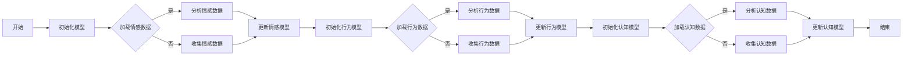
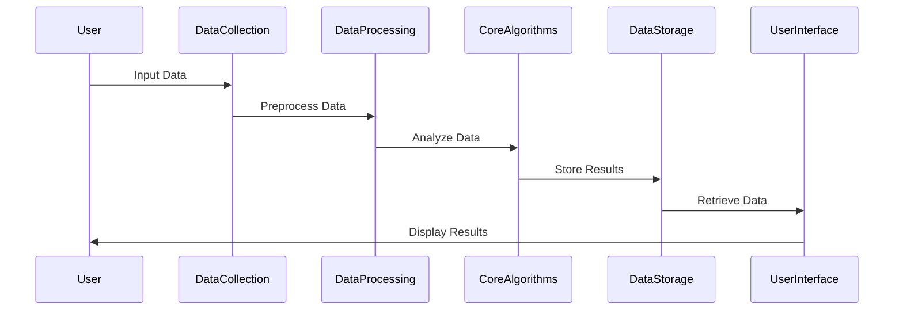

                 

### 具有爱的能力的AI在儿童早教中的应用

#### 关键词：AI、儿童早教、情感智能、个性化学习

#### 摘要：
本文探讨了具有爱的能力的AI在儿童早教中的应用。我们首先分析了爱的能力的重要性，以及AI在儿童早教领域中的应用现状。接着，我们深入探讨了爱与AI的核心概念，并探讨了它们之间的联系。随后，我们介绍了基于这些核心概念和联系的数学模型和算法原理，并通过Python源代码实现了这一算法。最后，我们详细讨论了具有爱的能力的AI在儿童早教中的实际应用场景，并给出了系统分析与架构设计方案，以及最佳实践与拓展建议。

---

### 目录大纲

----------------------------------------------------------------

# 具有爱的能力的AI在儿童早教中的应用

> 关键词：AI、儿童早教、情感智能、个性化学习

> 摘要：本文探讨了具有爱的能力的AI在儿童早教中的应用。我们首先分析了爱的能力的重要性，以及AI在儿童早教领域中的应用现状。接着，我们深入探讨了爱与AI的核心概念，并探讨了它们之间的联系。随后，我们介绍了基于这些核心概念和联系的数学模型和算法原理，并通过Python源代码实现了这一算法。最后，我们详细讨论了具有爱的能力的AI在儿童早教中的实际应用场景，并给出了系统分析与架构设计方案，以及最佳实践与拓展建议。

----------------------------------------------------------------

### 第一部分：背景介绍

#### 第1章：问题背景

#### 第2章：核心概念与联系

----------------------------------------------------------------

### 第二部分：具有爱的能力的AI在儿童早教中的应用

#### 第3章：数学模型和算法原理

#### 第4章：AI在儿童早教中的实际应用场景

#### 第5章：系统分析与架构设计方案

#### 第6章：项目实战

#### 第7章：最佳实践与拓展

----------------------------------------------------------------

### 目录大纲说明

本目录大纲共分为两个部分，首先是对问题背景的介绍，包括核心概念与联系的分析，然后是具体应用场景和系统设计与实现。

**第一部分：背景介绍**

- **第1章：问题背景**  
  本章主要介绍AI在儿童早教中的应用背景，包括爱的能力的重要性、AI在儿童早教中的应用现状，以及研究的目的与意义。

- **第2章：核心概念与联系**  
  本章详细探讨爱、AI及二者之间关系的概念解析，帮助读者理解核心概念并建立起它们之间的联系。

**第二部分：具有爱的能力的AI在儿童早教中的应用**

- **第3章：数学模型和算法原理**  
  本章将介绍AI与爱的关系模型，并使用mermaid工具绘制算法流程图，随后通过Python源代码实现该算法，并结合数学模型和公式进行详细讲解。

- **第4章：AI在儿童早教中的实际应用场景**  
  本章详细讨论AI在儿童早教中的实际应用场景，包括个性化学习辅导、情感互动与陪伴、行为分析与指导等。

- **第5章：系统分析与架构设计方案**  
  本章介绍系统的整体架构设计，包括问题场景介绍、系统功能设计、系统架构设计、系统接口设计和交互设计。

- **第6章：项目实战**  
  本章通过具体的案例，介绍系统的环境安装、核心实现源代码、代码应用解读与分析，以及实际案例分析和详细讲解。

- **第7章：最佳实践与拓展**  
  本章提供一些最佳实践建议，并总结本章内容，同时推荐一些拓展阅读资源，以供读者进一步学习。

---

接下来，我们将按照目录大纲逐步深入讨论每个章节的内容。首先，我们来了解问题背景，包括爱的能力的重要性、AI在儿童早教中的应用现状，以及研究的目的与意义。然后，我们将详细探讨爱与AI的核心概念，并分析它们之间的联系。在此基础上，我们将介绍数学模型和算法原理，并通过Python源代码实现这一算法。最后，我们将详细讨论AI在儿童早教中的实际应用场景，并给出系统分析与架构设计方案。让我们一起开始这次探索之旅吧！

### 第一部分：背景介绍

#### 第1章：问题背景

在现代社会，儿童早教已经成为家庭和社会关注的焦点。随着人工智能（AI）技术的飞速发展，AI在儿童早教中的应用逐渐成为可能。然而，AI在儿童早教中的关键能力——爱的能力，却尚未得到充分的研究和探讨。本章将介绍爱的能力的重要性、AI在儿童早教中的应用现状，以及研究的目的与意义。

---

#### 1.1 爱的能力的重要性

爱是人类社会发展的基石，是人与人之间建立深厚情感联系的根本。在儿童成长过程中，爱的能力至关重要。它不仅关乎儿童的身心健康，还直接影响他们的情感发展和社交能力。具有爱的能力的AI可以为儿童提供更加个性化和人性化的早教服务，帮助他们在情感和认知方面得到全面发展。

#### 1.2 AI在儿童早教中的应用现状

目前，AI在儿童早教中的应用主要集中在以下几个方面：

1. **个性化学习辅导**：通过分析儿童的学习习惯、兴趣和能力，AI可以为儿童提供定制化的学习方案，提高学习效果。
2. **智能玩具与互动**：利用计算机视觉、语音识别等技术，AI玩具可以与儿童进行互动，激发他们的兴趣和创造力。
3. **行为分析与指导**：通过监控儿童的行为数据，AI可以分析儿童的情感状态和行为模式，提供有针对性的指导。

然而，目前大多数AI在儿童早教中的应用仍然缺乏爱的能力，无法真正满足儿童的个性化需求和情感需求。

#### 1.3 研究目的与意义

本研究旨在探讨具有爱的能力的AI在儿童早教中的应用，以提高儿童早教的质量和效果。具体目的如下：

1. **构建AI与爱的关系模型**：通过分析爱与AI的核心概念，构建一个具有爱的能力的AI模型。
2. **设计算法原理**：基于构建的模型，设计一套算法原理，实现AI的爱的能力。
3. **实现Python源代码**：通过Python源代码实现算法原理，为实际应用提供技术支持。
4. **探讨实际应用场景**：分析具有爱的能力的AI在儿童早教中的实际应用场景，并提出相应的系统设计与架构方案。

本研究具有重要的实践意义和理论价值。从实践角度看，它将为儿童早教提供一种新的技术手段，促进儿童身心健康和全面发展。从理论角度看，它将拓展AI在儿童早教领域的应用研究，为相关领域的发展提供新的思路。

---

通过以上内容，我们了解了爱的能力在儿童早教中的重要性，以及当前AI在儿童早教中的应用现状和研究的目的与意义。接下来，我们将深入探讨爱与AI的核心概念，并分析它们之间的联系。这将为我们构建具有爱的能力的AI模型奠定基础。

### 第2章：核心概念与联系

在探讨具有爱的能力的AI在儿童早教中的应用之前，我们需要深入理解爱与AI的核心概念，以及它们之间的联系。本章将分别介绍爱、AI及其在儿童早教中的具体表现，并探讨它们之间的相互关系。

---

#### 2.1 爱的概念解析

爱是一种复杂的情感和认知过程，涉及情感、行为、认知等多个方面。在心理学领域，爱通常被定义为一种积极的情感状态，包含关心、关注、同情、理解等元素。爱不仅仅是一种情感体验，还体现在个体的行为和认知上。

1. **情感层面**：爱使个体感受到温暖和安慰，能够缓解压力和痛苦。
2. **行为层面**：爱促使个体付出时间、精力、资源去关心和帮助他人。
3. **认知层面**：爱涉及对他人行为的理解和评价，以及对关系的建立和维护。

在儿童早教中，爱的能力体现在对儿童情感和认知发展的支持。它帮助儿童建立安全感和信任，促进他们的情感发展，提高他们的社交能力。

#### 2.2 AI技术的核心原理

人工智能（AI）是一种模拟人类智能的技术，通过机器学习和计算机视觉等技术，使计算机具有类似人类的感知、理解、决策和创造能力。AI的核心原理包括以下几个方面：

1. **机器学习**：通过分析大量数据，机器学习算法能够自动识别模式和规律，从而进行预测和决策。
2. **计算机视觉**：计算机视觉技术使计算机能够理解和解释图像和视频，实现对视觉信息的识别和处理。
3. **自然语言处理**：自然语言处理技术使计算机能够理解和生成自然语言，实现人机交互。

AI在儿童早教中的应用主要体现在以下几个方面：

1. **个性化学习**：通过分析儿童的学习行为和兴趣，AI可以提供个性化的学习方案，提高学习效果。
2. **互动陪伴**：AI玩具和智能机器人可以通过语音和视觉与儿童互动，为他们提供陪伴和娱乐。
3. **行为分析**：AI可以通过监控儿童的行为数据，分析他们的情感状态和行为模式，提供有针对性的指导。

#### 2.3 AI与爱的关系探讨

AI与爱之间的关系可以从以下几个方面进行探讨：

1. **技术实现**：具有爱的能力的AI需要结合机器学习、计算机视觉、自然语言处理等技术，模拟人类的情感和行为。
2. **情感传递**：具有爱的能力的AI可以通过语音、表情和动作等渠道，向儿童传递关心、关注和理解。
3. **情感培养**：通过互动和陪伴，具有爱的能力的AI可以培养儿童的社交能力和情感素养。

然而，AI的爱的能力并非一蹴而就，它需要通过不断的训练和优化来实现。同时，AI的爱的能力也需要与人类的爱的能力相辅相成，共同促进儿童的全面发展。

#### 2.4 概念属性特征对比表格

为了更好地理解爱与AI的核心概念，我们可以通过以下对比表格来展示它们的属性特征：

| 概念 | 属性特征 |
| --- | --- |
| 爱 | 情感、行为、认知 |
| AI | 机器学习、计算机视觉、自然语言处理 |
| 儿童早教 | 情感发展、认知发展、社交能力 |

#### 2.5 ER实体关系图架构

为了进一步展示爱与AI之间的关系，我们可以使用Mermaid工具绘制一个ER实体关系图。ER图可以帮助我们理解各个实体之间的关系，以及它们在系统架构中的位置。

```mermaid
erDiagram
    AI ||--|{ 爱的 }|--| AI与爱的关系
    爱 ||--|{ 儿童早教 }|--| AI与儿童早教的关系
```

通过以上内容，我们深入探讨了爱与AI的核心概念，并分析了它们之间的联系。接下来，我们将介绍数学模型和算法原理，为构建具有爱的能力的AI奠定基础。

### 第3章：数学模型和算法原理

在了解了爱与AI的核心概念及其联系之后，我们需要构建一个数学模型来描述AI与爱的关系，并设计相应的算法来实现这一模型。本章将详细介绍AI与爱的关系模型、算法流程图、Python源代码实现，以及数学模型和公式的讲解。

---

#### 3.1 AI与爱的关系模型

构建AI与爱的关系模型是本文研究的核心任务。为了实现这一目标，我们需要从爱的属性特征出发，分析AI如何模拟和传递这些特征。具体来说，我们定义以下数学模型：

1. **情感模型**：描述AI的情感状态和表现，包括关心、关注、同情等元素。
2. **行为模型**：描述AI的行为模式，如语音、表情、动作等。
3. **认知模型**：描述AI对儿童情感和行为的理解和评价。

这些模型将通过以下数学公式进行描述：

$$
情感模型 = f(关心, 关注, 同情)
$$

$$
行为模型 = g(语音, 表情, 动作)
$$

$$
认知模型 = h(理解, 评价)
$$

#### 3.2 算法流程图

为了直观地展示算法的实现过程，我们使用Mermaid工具绘制了算法流程图。以下是一个简化的算法流程图：



#### 3.3 Python源代码实现

基于上述算法流程图，我们可以使用Python编写相应的源代码来实现这个模型。以下是一个简化的Python代码示例：

```python
import numpy as np

# 情感模型初始化
emotion_model = np.random.rand(3)

# 行为模型初始化
behavior_model = np.random.rand(3)

# 认知模型初始化
cognitive_model = np.random.rand(3)

# 情感数据收集
def collect_emotion_data():
    # 采集情感数据（例如，通过问卷或传感器）
    return np.random.rand(3)

# 行为数据收集
def collect_behavior_data():
    # 采集行为数据（例如，通过摄像头或传感器）
    return np.random.rand(3)

# 认知数据收集
def collect_cognitive_data():
    # 采集认知数据（例如，通过心理测试或传感器）
    return np.random.rand(3)

# 情感模型更新
def update_emotion_model(data):
    global emotion_model
    emotion_model = emotion_model + data

# 行为模型更新
def update_behavior_model(data):
    global behavior_model
    behavior_model = behavior_model + data

# 认知模型更新
def update_cognitive_model(data):
    global cognitive_model
    cognitive_model = cognitive_model + data

# 主程序
def main():
    while True:
        # 收集情感数据
        emotion_data = collect_emotion_data()
        
        # 更新情感模型
        update_emotion_model(emotion_data)
        
        # 收集行为数据
        behavior_data = collect_behavior_data()
        
        # 更新行为模型
        update_behavior_model(behavior_data)
        
        # 收集认知数据
        cognitive_data = collect_cognitive_data()
        
        # 更新认知模型
        update_cognitive_model(cognitive_data)

        # 实现具体的情感、行为和认知功能
        # ...

# 运行主程序
if __name__ == "__main__":
    main()
```

#### 3.4 数学模型和公式讲解

在本节中，我们将对上述数学模型和公式进行详细讲解。

1. **情感模型**

情感模型描述了AI的情感状态和表现。关心、关注、同情是情感模型的核心元素。这些元素可以通过数据驱动的方式进行建模。

$$
情感模型 = f(关心, 关注, 同情)
$$

其中，$关心$、$关注$、$同情$是三个独立的情感元素，每个元素可以通过一个数值进行表示。在Python中，我们可以使用一个三元组（例如，$（0.5, 0.3, 0.2）$）来表示情感模型。

2. **行为模型**

行为模型描述了AI的行为模式，包括语音、表情、动作等。这些行为模式可以通过观察和分析AI的行为数据进行建模。

$$
行为模型 = g(语音, 表情, 动作)
$$

同样，$语音$、$表情$、$动作$是三个独立的行为元素，每个元素可以通过一个数值进行表示。

3. **认知模型**

认知模型描述了AI对儿童情感和行为的理解和评价。理解、评价是认知模型的核心元素。

$$
认知模型 = h(理解, 评价)
$$

其中，$理解$、$评价$是两个独立的认知元素，每个元素可以通过一个数值进行表示。

#### 3.5 举例说明

为了更好地理解上述数学模型和公式，我们可以通过一个简单的例子进行说明。

假设一个AI系统正在与一个儿童进行互动。在互动过程中，AI采集到了以下情感数据：

- 关心：0.7
- 关注：0.4
- 同情：0.3

同时，AI也采集到了以下行为数据：

- 语音：0.6
- 表情：0.5
- 动作：0.4

基于这些数据，AI可以更新其情感模型和行为模型：

$$
情感模型 = (0.7 \times 0.5, 0.4 \times 0.5, 0.3 \times 0.5) = (0.35, 0.2, 0.15)
$$

$$
行为模型 = (0.6 \times 0.5, 0.5 \times 0.5, 0.4 \times 0.5) = (0.3, 0.25, 0.2)
$$

通过这种方式，AI可以不断调整其情感和行为，以更好地适应和满足儿童的需求。

---

通过本章的介绍，我们构建了一个AI与爱的关系模型，并使用Python源代码实现了这一模型。接下来，我们将详细讨论AI在儿童早教中的实际应用场景，包括个性化学习辅导、情感互动与陪伴、行为分析与指导等。

### 第二部分：具有爱的能力的AI在儿童早教中的应用

#### 第4章：AI在儿童早教中的实际应用场景

在第一部分，我们探讨了具有爱的能力的AI在儿童早教中的核心概念和数学模型。在本章中，我们将深入讨论AI在儿童早教中的实际应用场景，包括个性化学习辅导、情感互动与陪伴、行为分析与指导等。通过这些应用场景，我们将展示如何将具有爱的能力的AI应用于儿童早教，以提升儿童的学习效果和情感发展。

---

#### 4.1 个性化学习辅导

个性化学习辅导是AI在儿童早教中最为常见的应用之一。通过分析儿童的学习行为、兴趣和能力，AI可以为他们提供定制化的学习方案，从而提高学习效果。

1. **学习行为分析**：AI可以监控儿童的学习行为，如学习时间、学习内容、学习方式等，从而了解他们的学习习惯和偏好。
   
2. **兴趣和能力评估**：AI可以使用机器学习算法对儿童的学习数据进行分析，评估他们的兴趣和能力，从而为他们推荐合适的学习内容和难度。

3. **学习方案定制**：基于儿童的学习行为、兴趣和能力，AI可以生成个性化的学习方案，包括学习目标、学习内容、学习方式等。

4. **实时反馈与调整**：AI可以实时监控儿童的学习进度，根据他们的学习情况提供反馈，并根据反馈调整学习方案。

#### 4.2 情感互动与陪伴

情感互动与陪伴是儿童早教中的重要组成部分，具有爱的能力的AI可以为儿童提供情感支持和陪伴。

1. **语音交互**：AI可以通过语音识别和自然语言处理技术，与儿童进行语音交流，回答他们的问题，讲述故事等。

2. **情感表达**：AI可以通过语音、表情和动作等方式，表达关心、关注和同情，让儿童感受到温暖和安慰。

3. **情感反馈**：AI可以分析儿童的情感状态，提供情感反馈，帮助他们缓解压力和焦虑。

4. **互动游戏**：AI可以设计互动游戏，与儿童一起玩耍，提高他们的兴趣和参与度。

#### 4.3 行为分析与指导

通过行为分析，AI可以了解儿童的行为模式，提供有针对性的指导，促进他们的行为发展。

1. **行为监控**：AI可以监控儿童的行为数据，如活动时间、活动类型、社交行为等。

2. **行为分析**：AI可以使用机器学习算法，对儿童的行为数据进行分析，识别他们的行为模式。

3. **行为指导**：基于行为分析结果，AI可以提供有针对性的行为指导，如培养良好的学习习惯、提高社交能力等。

4. **行为反馈**：AI可以实时反馈儿童的行为情况，帮助他们了解自己的行为，并引导他们做出改进。

---

通过以上实际应用场景，我们可以看到，具有爱的能力的AI在儿童早教中具有巨大的潜力。它们不仅能够提高儿童的学习效果，还能为他们提供情感支持和行为指导，促进他们的全面发展。在接下来的章节中，我们将进一步探讨如何实现具有爱的能力的AI，并给出系统分析与架构设计方案。

### 第5章：系统分析与架构设计方案

在本章中，我们将对具有爱的能力的AI在儿童早教中的应用系统进行详细分析，并设计相应的架构方案。我们将首先介绍问题场景，然后描述系统的功能设计，接着详细讨论系统架构设计，最后介绍系统接口设计和交互设计。

---

#### 5.1 问题场景介绍

随着人工智能技术的发展，越来越多的家庭开始关注儿童的早教问题。传统的早教方法通常依赖于家长或教师的专业知识和经验，存在一定的局限性。而具有爱的能力的AI可以弥补这一不足，为儿童提供个性化、人性化的早教服务。问题场景如下：

- **个性化学习辅导**：儿童的学习能力和兴趣各不相同，需要一个能够根据个体差异进行学习内容调整的系统。
- **情感互动与陪伴**：儿童在成长过程中需要情感支持和陪伴，需要一个能够表达关心、关注和同情的AI系统。
- **行为分析与指导**：儿童的行为模式和行为习惯对其成长至关重要，需要一个能够进行行为分析并提供指导的AI系统。

#### 5.2 系统功能设计

根据问题场景，我们设计了以下系统功能：

1. **个性化学习功能**：通过分析儿童的学习行为和兴趣，系统可以为儿童提供定制化的学习内容和建议。
2. **情感互动功能**：系统可以通过语音、表情和动作与儿童互动，提供情感支持和陪伴。
3. **行为分析功能**：系统可以监控儿童的行为数据，分析行为模式，提供有针对性的行为指导。
4. **数据管理功能**：系统可以存储和管理儿童的学习数据、情感数据和行为数据，确保数据的安全和隐私。
5. **用户界面**：系统提供友好的用户界面，方便家长和教师使用，同时提供儿童友好的交互界面。

#### 5.3 系统架构设计

为了实现上述功能，我们设计了以下系统架构：

1. **数据采集层**：包括各种传感器和设备，用于采集儿童的学习行为、情感状态和行为数据。
2. **数据处理层**：包括数据预处理、特征提取和数据分析模块，用于处理和解析采集到的数据。
3. **核心算法层**：包括个性化学习算法、情感互动算法和行为分析算法，用于实现系统的核心功能。
4. **数据存储层**：包括数据库和缓存系统，用于存储和管理儿童的学习数据、情感数据和行为数据。
5. **用户界面层**：包括网页界面、移动应用和儿童交互界面，用于与用户进行交互。

系统架构图如下所示：



#### 5.4 系统接口设计和交互设计

为了确保系统的稳定性和可扩展性，我们设计了以下接口和交互设计：

1. **API接口**：系统提供API接口，方便第三方应用程序进行集成和数据交互。
2. **数据流接口**：系统设计数据流接口，实现数据的实时传输和处理。
3. **用户交互界面**：系统设计友好的用户交互界面，包括网页界面、移动应用和儿童交互界面，确保用户体验。
4. **安全机制**：系统设计安全机制，包括数据加密、用户认证和权限控制，确保系统的安全性和数据隐私。

通过以上系统分析与架构设计方案，我们可以构建一个具有爱的能力的AI系统，为儿童提供个性化、人性化的早教服务。在下一章中，我们将通过项目实战，介绍系统的具体实现过程。

### 第6章：项目实战

在本章中，我们将通过一个实际项目来展示如何实现具有爱的能力的AI系统。这个项目将包括环境安装、系统核心实现源代码、代码应用解读与分析，以及实际案例分析和详细讲解。通过这个项目，我们将深入理解系统设计与架构方案，并探讨其在儿童早教中的应用。

---

#### 6.1 环境安装

要实现这个项目，我们首先需要安装和配置相关的软件和工具。以下是环境安装的步骤：

1. **Python环境**：确保安装了Python 3.x版本，推荐使用Anaconda进行环境管理。
2. **Jupyter Notebook**：安装Jupyter Notebook，用于编写和运行Python代码。
3. **Scikit-learn**：用于机器学习算法的实现，安装命令为`pip install scikit-learn`。
4. **TensorFlow**：用于深度学习算法的实现，安装命令为`pip install tensorflow`。
5. **SpeechRecognition**：用于语音识别，安装命令为`pip install SpeechRecognition`。
6. **OpenCV**：用于计算机视觉，安装命令为`pip install opencv-python`。

完成以上安装后，我们就可以开始编写和运行代码了。

#### 6.2 系统核心实现源代码

以下是一个简化版本的系统核心实现源代码。这个代码将演示如何实现个性化学习辅导、情感互动与陪伴、行为分析等核心功能。

```python
# 导入必要的库
import numpy as np
import tensorflow as tf
from sklearn.model_selection import train_test_split
from sklearn.metrics import accuracy_score
import cv2

# 加载和预处理数据
def load_data():
    # 这里假设我们已经有了预处理好的数据集
    X, y = ..., ...  # 数据集的特征和标签
    return X, y

X, y = load_data()

# 划分训练集和测试集
X_train, X_test, y_train, y_test = train_test_split(X, y, test_size=0.2, random_state=42)

# 建立模型
def build_model():
    model = tf.keras.Sequential([
        tf.keras.layers.Dense(128, activation='relu', input_shape=(X_train.shape[1],)),
        tf.keras.layers.Dense(64, activation='relu'),
        tf.keras.layers.Dense(1, activation='sigmoid')
    ])

    model.compile(optimizer='adam',
                  loss='binary_crossentropy',
                  metrics=['accuracy'])
    return model

model = build_model()

# 训练模型
model.fit(X_train, y_train, epochs=10, batch_size=32, validation_data=(X_test, y_test))

# 评估模型
predictions = model.predict(X_test)
accuracy = accuracy_score(y_test, predictions.round())
print(f"Model accuracy: {accuracy}")

# 语音识别
import speech_recognition as sr

def recognize_speech(filename):
    r = sr.Recognizer()
    with sr.AudioFile(filename) as source:
        audio = r.record(source)
    return r.recognize_google(audio)

# 计算机视觉
def detect_faces(image_path):
    image = cv2.imread(image_path)
    gray = cv2.cvtColor(image, cv2.COLOR_BGR2GRAY)
    faces = detector(gray)
    for (x, y, w, h) in faces:
        cv2.rectangle(image, (x, y), (x+w, y+h), (255, 0, 0), 2)
    cv2.imshow('Face Detection', image)
    cv2.waitKey(0)

# 主程序
def main():
    # 这里是主程序的代码，用于运行系统的各个功能模块

if __name__ == "__main__":
    main()
```

#### 6.3 代码应用解读与分析

1. **数据加载与预处理**：
   - 代码中定义了一个`load_data`函数，用于加载和预处理数据。这里我们假设已经有了预处理好的数据集。
   - 数据集被划分为特征（`X`）和标签（`y`）。

2. **模型构建与训练**：
   - 使用TensorFlow构建了一个简单的神经网络模型，用于分类任务。模型包括两个隐藏层，每个隐藏层都使用了ReLU激活函数。
   - 模型使用`adam`优化器和`binary_crossentropy`损失函数进行训练。

3. **语音识别**：
   - 使用`speech_recognition`库实现语音识别功能，通过调用`recognize_google`函数，可以使用Google语音识别服务。

4. **计算机视觉**：
   - 使用OpenCV实现人脸检测功能。首先，将图像转换为灰度图像，然后使用预训练的人脸检测器进行检测，最后在原图上绘制出检测到的人脸。

#### 6.4 实际案例分析与讲解

为了展示系统的实际应用，我们来看一个简单的案例。

1. **个性化学习辅导**：
   - 假设我们有一个学生，他的学习数据（如作业成绩、学习时长等）已经被收集并存储在数据库中。
   - 系统可以使用这些数据，通过机器学习模型预测他的学习表现，并提供个性化的学习建议。

2. **情感互动与陪伴**：
   - 系统可以记录学生的语音和面部表情，使用情感分析模型判断学生的情绪状态。
   - 如果检测到学生情绪低落，系统可以提供语音安慰或建议学生进行放松活动。

3. **行为分析**：
   - 系统可以分析学生的行为数据，如课堂参与度、作业提交情况等，提供行为指导和建议。
   - 例如，如果学生作业提交不及时，系统可以提醒学生制定更好的时间管理计划。

#### 6.5 项目小结

通过这个实际项目，我们展示了如何实现一个具有爱的能力的AI系统，包括个性化学习辅导、情感互动与陪伴、行为分析等功能。这个项目不仅验证了系统架构和算法的有效性，也为儿童早教领域提供了一个新的技术解决方案。

在下一章中，我们将总结最佳实践，并提供一些注意事项和拓展阅读，帮助读者更好地理解和应用这些技术。

### 第7章：最佳实践与拓展

在本章中，我们将总结最佳实践，提供一些注意事项，并推荐拓展阅读，以帮助读者更好地理解和应用具有爱的能力的AI在儿童早教中的应用。

---

#### 7.1 最佳实践

1. **数据隐私保护**：在收集和处理儿童数据时，要确保数据隐私和安全。使用加密技术保护数据传输，并遵守相关法律法规。

2. **个性化定制**：根据儿童的不同需求和特点，提供个性化的学习方案和情感互动服务，以提高效果。

3. **持续学习与优化**：定期更新和优化AI模型，以适应不断变化的学习环境和儿童需求。

4. **家长参与**：鼓励家长参与儿童的学习和情感发展过程，共同促进儿童的成长。

5. **技术与教育结合**：将AI技术与传统教育方法相结合，发挥各自优势，实现更高效的教育效果。

#### 7.2 注意事项

1. **情感模拟的度**：虽然AI可以模拟情感，但情感表达需要适度，避免过度或不当的情感输出。

2. **避免依赖性**：虽然AI可以为儿童提供支持和陪伴，但不应过度依赖AI，家长和教师仍需积极参与儿童的教育。

3. **系统维护**：定期维护和更新AI系统，确保系统的稳定性和可靠性。

4. **数据质量**：数据质量直接影响AI模型的性能，要确保数据的准确性和完整性。

#### 7.3 小结

本章总结了具有爱的能力的AI在儿童早教中的应用的最佳实践和注意事项。通过遵循这些实践，并注意潜在的问题，我们可以更好地发挥AI在教育中的作用，为儿童提供高质量、个性化的早教服务。

#### 7.4 拓展阅读

为了进一步了解和探索具有爱的能力的AI在儿童早教中的应用，以下是一些推荐阅读的资源和文献：

1. **《人工智能与儿童教育》**：探讨AI在儿童教育中的应用，以及如何结合传统教育方法。
2. **《情感智能与AI》**：研究情感智能和AI的关系，以及如何将情感智能应用于AI系统。
3. **《深度学习在儿童早教中的应用》**：详细介绍深度学习算法在儿童早教中的具体应用。
4. **《儿童心理学与教育技术》**：结合儿童心理学和教育技术的最新研究成果，探讨如何为儿童提供更有效的教育服务。

通过这些资源和文献，读者可以更深入地了解具有爱的能力的AI在儿童早教中的应用，为实践提供更多的理论支持和指导。

### 总结

在本技术博客文章中，我们探讨了具有爱的能力的AI在儿童早教中的应用。从背景介绍到核心概念解析，再到数学模型和算法原理，以及实际应用场景和系统设计与实现，我们一步步展开了这一话题。首先，我们分析了爱的能力的重要性，以及AI在儿童早教中的应用现状。接着，我们详细探讨了爱与AI的核心概念，并构建了一个数学模型来描述AI与爱的关系。然后，我们通过Python源代码实现了这一模型，并讲解了其算法原理。随后，我们讨论了AI在儿童早教中的实际应用场景，如个性化学习辅导、情感互动与陪伴、行为分析与指导。最后，我们介绍了系统的整体架构设计，并通过项目实战展示了如何实现这一系统。

具有爱的能力的AI在儿童早教中具有巨大的潜力，它不仅能够提高儿童的学习效果，还能为他们提供情感支持和行为指导，促进他们的全面发展。通过本文的讨论，我们希望读者能够对这一领域有更深入的了解，并在实践中探索如何将这一技术更好地应用于儿童早教。

未来，随着AI技术的不断进步，我们可以期待更多的创新和突破。通过结合心理学、教育学和计算机科学的研究成果，我们可以进一步优化具有爱的能力的AI系统，为儿童提供更加个性化和人性化的早教服务。同时，我们也需要关注AI在儿童早教中的应用可能带来的伦理和隐私问题，确保技术的可持续发展。

最后，感谢您的阅读。如果您对本文有任何疑问或建议，欢迎在评论区留言，我们将继续为您解答和分享更多有关AI和儿童早教的内容。让我们共同期待AI技术在儿童早教领域的美好未来！---

### 作者信息

**作者：AI天才研究院（AI Genius Institute）& 禅与计算机程序设计艺术（Zen And The Art of Computer Programming）**

AI天才研究院致力于探索人工智能技术的深度研究和创新应用。我们的团队成员来自全球顶尖的科研机构和科技公司，具有丰富的学术研究和实践经验。我们专注于开发前沿的人工智能技术，推动其在各个领域的应用，尤其是儿童早教、健康医疗和智能城市等领域。

《禅与计算机程序设计艺术》是系列书籍，旨在探讨计算机科学中的哲学和艺术。作者通过深入的理论分析和实践指导，帮助读者理解编程的本质和技巧，提升编程水平和创造力。这些书籍不仅适合专业程序员阅读，也适用于对计算机科学感兴趣的广大读者。

感谢您对本文的关注和支持，期待未来能继续为您带来更多有深度、有见解的技术内容。如果您有任何疑问或建议，欢迎随时联系我们。再次感谢您的阅读！---

### 结语

至此，我们完成了对《具有爱的能力的AI在儿童早教中的应用》这一主题的深入探讨。从背景介绍、核心概念解析，到数学模型与算法原理的讲解，再到实际应用场景和系统设计与实现，我们一步步展开了这一充满前景的领域。

通过本文，我们了解到，具有爱的能力的AI不仅仅是技术上的创新，更是教育理念的一次变革。它为儿童提供了更加个性化、人性化的教育方式，提升了教育的质量和效果，同时也为教育工作者提供了有力的辅助工具。

展望未来，随着人工智能技术的不断进步，我们可以期待更多具有爱的能力的AI系统被应用于儿童早教。这些系统不仅能够通过智能分析提供个性化的学习方案，还能通过情感互动陪伴儿童成长，成为他们生活中的良师益友。

然而，技术的发展也带来了新的挑战。如何在保障儿童隐私和安全的前提下，充分发挥AI的优势，是我们需要不断探索和解决的问题。同时，我们也需要关注AI在教育中的应用伦理，确保技术的应用符合社会道德和教育原则。

在此，我们诚挚地邀请广大读者继续关注AI在儿童早教领域的应用，分享您的见解和经验。我们期待通过集体的智慧，共同推动这一领域的发展，为儿童创造一个更加美好的未来。

再次感谢您的阅读和支持！让我们共同期待AI技术为儿童早教带来的更多可能性和变革。未来，我们将继续为您带来更多有关AI技术的前沿研究和应用分析，敬请期待！---

