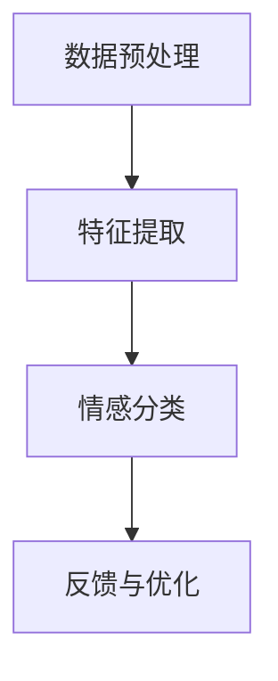
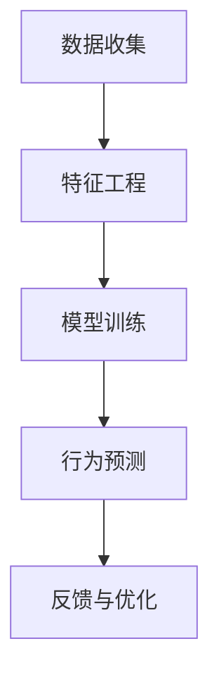
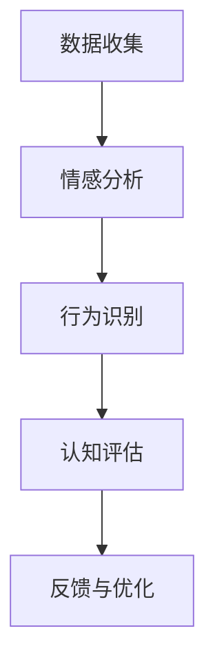
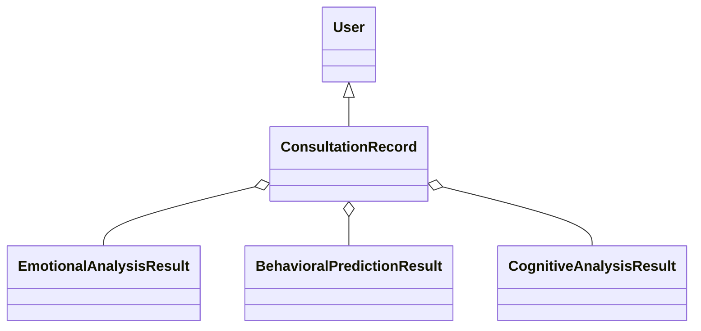
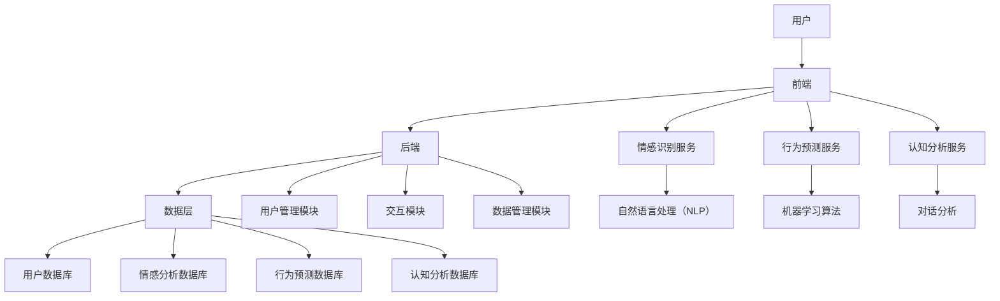

                 

### 具有爱的能力的AI在婚姻咨询中的应用

**关键词：** AI、婚姻咨询、情感模拟、伦理规范、心理健康

**摘要：** 本文将探讨具有爱的能力的AI在婚姻咨询中的应用，从背景介绍、核心概念、算法原理、系统设计与实际案例等方面进行分析。通过引入情感模拟技术，AI可以在婚姻咨询中扮演更加积极和人性化的角色，为夫妻双方提供有效的支持和建议。

#### 目录大纲：

1. **背景介绍**
   - **1.1 问题的背景**
     - **1.1.1 婚姻咨询的必要性**
     - **1.1.2 AI在婚姻咨询中的应用前景**
   - **1.2 核心概念**
     - **1.2.1 爱的概念**
     - **1.2.2 AI与爱的关系**
   - **1.3 边界与外延**
     - **1.3.1 爱的边界**
     - **1.3.2 AI在婚姻咨询中的应用范围**
   - **1.4 概念结构与核心要素组成**
     - **1.4.1 概念结构**
     - **1.4.2 核心要素组成**
   - **1.5 第一部分小结**

2. **核心概念与联系**
   - **2.1 爱的原理与属性特征对比**
     - **2.1.1 爱的原理**
     - **2.1.2 爱的属性特征对比**
   - **2.2 AI与爱的联系**
     - **2.2.1 AI模拟爱的能力**
     - **2.2.2 爱在AI系统中的实现**
   - **2.3 第二部分小结**

3. **算法原理讲解**
   - **3.1 算法原理与mermaid流程图**
     - **3.1.1 情感识别算法原理**
     - **3.1.2 行为预测算法原理**
     - **3.1.3 认知分析算法原理**
   - **3.2 Python源代码与详细讲解**
     - **3.2.1 情感识别算法实现**
     - **3.2.2 行为预测算法实现**
     - **3.2.3 认知分析算法实现**
   - **3.3 第三部分小结**

4. **系统分析与架构设计方案**
   - **4.1 问题场景介绍**
     - **4.1.1 婚姻咨询问题的描述**
     - **4.1.2 婚姻咨询项目的介绍**
   - **4.2 系统功能设计**
     - **4.2.1 领域模型设计**
     - **4.2.2 系统功能设计**
   - **4.3 系统架构设计**
     - **4.3.1 系统架构设计**
     - **4.3.2 系统接口设计**
     - **4.3.3 系统交互设计**
   - **4.4 第四部分小结**

5. **项目实战**
   - **5.1 环境安装**
     - **5.1.1 环境要求**
     - **5.1.2 环境搭建**
   - **5.2 系统核心实现**
     - **5.2.1 系统核心代码**
     - **5.2.2 代码应用解读与分析**
   - **5.3 实际案例分析**
     - **5.3.1 案例描述**
     - **5.3.2 案例分析**
     - **5.3.3 案例讲解剖析**
   - **5.4 第五部分小结**

6. **最佳实践与拓展**
   - **6.1 最佳实践**
     - **6.1.1 实践技巧**
     - **6.1.2 实践案例分享**
   - **6.2 小结**
     - **6.2.1 系统总结**
     - **6.2.2 未来展望**
   - **6.3 注意事项**
     - **6.3.1 遵循伦理规范**

### 1. 背景介绍

#### 1.1 问题的背景

**1.1.1 婚姻咨询的必要性**

婚姻咨询是一种专业的心理健康服务，旨在帮助夫妻解决关系问题、提高沟通质量、增强婚姻稳定性。然而，现代社会中婚姻问题日益增多，许多夫妇面临着情感疏离、沟通障碍、性不和谐等问题。这些问题不仅对个体的心理健康产生负面影响，也会对家庭和子女的成长带来深远影响。

婚姻问题对个体和家庭的深远影响：

- **心理健康影响：** 婚姻问题可能导致个体出现焦虑、抑郁等心理问题，影响日常生活和工作表现。
- **家庭关系影响：** 婚姻问题可能导致家庭关系紧张，影响子女的教育和成长。
- **社会影响：** 大量婚姻问题可能导致离婚率上升，增加社会不稳定因素。

婚姻问题对社会的负面影响：

- **经济负担：** 离婚和经济问题可能给社会带来额外的负担。
- **社会关系紧张：** 婚姻问题可能导致亲朋好友之间的矛盾，增加社会矛盾。

**1.1.2 AI在婚姻咨询中的应用前景**

随着人工智能技术的不断发展，AI在心理服务领域已经展现出巨大的潜力。特别是在婚姻咨询中，AI可以通过模拟和理解人类的情感，提供更加个性化和有效的咨询服务。

AI在心理服务领域的探索与应用：

- **情感识别与分析：** AI可以通过语音和文字分析，识别用户的情感状态，为婚姻咨询提供数据支持。
- **行为预测与引导：** AI可以根据夫妻的行为模式，预测可能出现的婚姻问题，并提供相应的建议。
- **认知分析：** AI可以通过分析夫妻的对话和行为，识别潜在的心理问题，提供更深入的支持。

AI在婚姻咨询中的潜在优势：

- **高效性：** AI可以快速分析大量数据，为夫妻提供即时的咨询服务。
- **个性化：** AI可以根据夫妻的具体情况，提供个性化的建议和解决方案。
- **无偏见：** AI在咨询过程中不会受到个人偏见的影响，可以更加客观地分析和建议。

综上所述，婚姻咨询的必要性以及AI在心理服务领域的潜力，使得AI在婚姻咨询中具有广阔的应用前景。接下来，我们将进一步探讨爱的概念以及AI与爱的关系，为后续的算法原理和系统设计打下基础。

### 1.2 核心概念

#### 1.2.1 爱的概念

爱是一个复杂而多层次的概念，涉及情感、行为、认知等多个维度。在不同的文化和学科中，爱的定义和解释有所不同，但总体上，爱可以被理解为一种积极的情感体验，涉及个体与个体之间的情感联系和互动。

**爱的多维度理解**

- **情感维度：** 爱通常包含喜爱、亲密、关怀和信任等情感体验。
- **行为维度：** 爱体现在个体对伴侣的行为表现，如关心、支持、帮助等。
- **认知维度：** 爱涉及个体对伴侣的认知和理解，如情感识别、行为预测等。

爱的数学模型与公式：

为了更好地理解和模拟爱，我们可以尝试构建一个简单的数学模型。以下是一个简单的爱模型，用于描述爱的强度和变化：

\[ 爱的强度 = f(情感维度, 行为维度, 认知维度) \]

其中，\( f \) 表示一个复合函数，用于整合情感、行为和认知三个维度。这个模型可以进一步细化和扩展，以适应不同的应用场景。

#### 1.2.2 AI与爱的关系

人工智能（AI）在模拟和实现爱的能力方面具有一定的潜力。通过情感识别、行为预测和认知分析等技术，AI可以在婚姻咨询中提供具有爱的能力的支持。

**AI如何模拟和实现爱的能力**

- **情感识别与理解：** AI可以通过自然语言处理（NLP）和情感分析技术，识别用户在文本或语音中的情感状态，理解他们的情感需求。
- **行为预测与引导：** AI可以根据用户的历史数据和当前行为，预测他们可能出现的情感和行为问题，并提供相应的建议和引导。
- **认知分析：** AI可以通过分析用户的对话和行为数据，识别他们的心理状态和潜在问题，提供更深入的支持和建议。

**爱在AI系统中的建模**

在构建AI婚姻咨询系统时，我们可以将爱作为一个核心要素进行建模。以下是一个简化的爱模型，用于指导AI在婚姻咨询中的应用：

\[ 爱的模型 = (情感识别模块, 行为预测模块, 认知分析模块) \]

- **情感识别模块：** 负责识别用户在文本或语音中的情感状态，为后续分析提供数据支持。
- **行为预测模块：** 负责根据用户的历史数据和当前行为，预测他们可能出现的情感和行为问题。
- **认知分析模块：** 负责分析用户的对话和行为数据，识别他们的心理状态和潜在问题。

通过这个模型，AI可以更准确地理解和模拟爱，为婚姻咨询提供有力的支持。

### 1.3 边界与外延

#### 1.3.1 爱的边界

爱作为一种复杂的情感体验，具有一定的边界。这些边界包括行为准则和道德边界，它们确保爱的表达和行为不会伤害到个体和社会。

**爱的行为准则与道德边界**

- **尊重与平等：** 爱应该建立在相互尊重和平等的基础上，任何形式的暴力、歧视和不公平都是不可接受的。
- **忠诚与诚实：** 爱应该包含忠诚和诚实，夫妻双方应该坦诚地交流彼此的感受和需求，避免欺骗和背叛。
- **关爱与支持：** 爱应该体现在对伴侣的关心和支持上，帮助他们在面对困难和挑战时保持坚强。

**爱在婚姻咨询中的应用限制**

在婚姻咨询中，爱的能力有限，无法完全替代人类咨询师的作用。以下是一些应用限制：

- **情感深度：** AI在情感深度和理解上仍有一定的局限性，无法完全替代人类咨询师的情感连接。
- **个性化需求：** AI可能无法完全满足每个用户的具体和个性化需求，需要人类咨询师提供更加个性化的支持和建议。
- **伦理问题：** AI在处理敏感和复杂情感问题时，可能面临伦理和道德挑战，需要人类咨询师提供更加严格的指导和监督。

#### 1.3.2 AI在婚姻咨询中的应用范围

尽管AI在婚姻咨询中存在一定的限制，但它仍然具有广泛的应用前景。以下是一些AI在婚姻咨询中的应用范围：

**AI在婚前咨询的应用**

- **情感匹配：** AI可以通过分析用户的情感和行为数据，提供合适的匹配建议，帮助他们在婚前更好地了解彼此。
- **婚姻规划：** AI可以通过预测可能出现的婚姻问题，提供预防性建议，帮助新婚夫妇建立稳定的婚姻关系。

**AI在婚后咨询的应用**

- **情感分析：** AI可以通过情感识别和分析技术，了解夫妻的情感状态和需求，提供相应的支持和建议。
- **行为预测：** AI可以通过行为预测技术，预测夫妻可能出现的情感和行为问题，提前采取措施进行干预。

**AI在婚姻修复中的应用**

- **情感重建：** AI可以通过情感模拟技术，帮助夫妻重建情感联系，提高婚姻修复的效果。
- **心理支持：** AI可以通过认知分析技术，提供个性化的心理支持，帮助夫妻克服心理障碍，恢复婚姻关系。

通过在婚前、婚后和婚姻修复阶段的应用，AI可以为婚姻咨询提供有力的支持，提高婚姻的稳定性和幸福感。

### 1.4 概念结构与核心要素组成

#### 1.4.1 概念结构

为了更好地理解和实现具有爱的能力的AI在婚姻咨询中的应用，我们需要构建一个清晰的概念结构。这个概念结构包括爱的内在逻辑结构、AI模拟爱的结构以及它们之间的相互作用。

**爱的内在逻辑结构**

- **情感维度：** 爱的情感维度包括喜爱、亲密、关怀和信任等，这些情感体验共同构成了爱的核心。
- **行为维度：** 爱的行为维度体现在个体对伴侣的行为表现，如关心、支持、帮助等。
- **认知维度：** 爱的认知维度涉及个体对伴侣的认知和理解，如情感识别、行为预测等。

**AI模拟爱的结构**

- **情感识别模块：** 负责识别用户在文本或语音中的情感状态，为后续分析提供数据支持。
- **行为预测模块：** 负责根据用户的历史数据和当前行为，预测他们可能出现的情感和行为问题，并提供相应的建议和引导。
- **认知分析模块：** 负责分析用户的对话和行为数据，识别他们的心理状态和潜在问题，提供更深入的支持和建议。

**概念结构之间的相互作用**

- **情感识别模块** 和 **行为预测模块** 之间的相互作用，可以帮助AI更好地理解用户的情感状态和行为模式，从而提供更加精准和个性化的咨询服务。
- **行为预测模块** 和 **认知分析模块** 之间的相互作用，可以确保AI不仅能够预测潜在问题，还能提供相应的解决方案，帮助夫妻更好地应对婚姻挑战。

通过这个概念结构，我们可以更好地理解和实现具有爱的能力的AI在婚姻咨询中的应用，为夫妻提供更加全面和有效的支持。

#### 1.4.2 核心要素组成

在实现具有爱的能力的AI在婚姻咨询中的应用时，核心要素的组成至关重要。这些核心要素包括数据采集与处理、算法设计与实现、用户交互与反馈。

**数据采集与处理**

- **数据采集：** 数据采集是AI婚姻咨询系统的基石。通过语音识别、自然语言处理（NLP）等技术，AI可以收集用户在婚姻咨询过程中的文本和语音数据。
- **数据处理：** 数据处理包括情感分析、行为识别和认知分析等步骤。通过这些处理，AI可以提取出用户的关键信息和情感状态，为后续分析提供数据支持。

**算法设计与实现**

- **情感识别算法：** 情感识别算法用于识别用户在文本或语音中的情感状态。通过情感分析模型，AI可以准确判断用户是处于积极、消极还是中性的情感状态。
- **行为预测算法：** 行为预测算法用于预测用户可能出现的情感和行为问题。通过分析用户的历史数据和当前行为，AI可以提前发现潜在问题，并提供相应的建议和引导。
- **认知分析算法：** 认知分析算法用于分析用户的对话和行为数据，识别他们的心理状态和潜在问题。通过认知分析模型，AI可以提供更加深入和个性化的支持。

**用户交互与反馈**

- **用户交互：** 用户交互是AI婚姻咨询系统与用户之间的互动。通过自然语言处理（NLP）和语音识别技术，AI可以与用户进行实时对话，理解他们的需求和问题。
- **用户反馈：** 用户反馈是AI婚姻咨询系统改进的重要依据。通过收集用户的反馈，AI可以不断优化和调整自己的行为和推荐，提高咨询效果。

通过这些核心要素的组成，我们可以构建一个功能强大、用户友好的AI婚姻咨询系统，为夫妻提供有效的支持。

### 1.5 第一部分小结

在本部分中，我们介绍了具有爱的能力的AI在婚姻咨询中的应用背景、核心概念、边界与外延以及概念结构与核心要素组成。通过对这些内容的分析，我们可以看到AI在婚姻咨询中具有广阔的应用前景，但同时也面临一定的限制和挑战。

**关键点：**

- **婚姻咨询的必要性：** 婚姻咨询对于解决个体和家庭的婚姻问题具有重要意义。
- **AI在婚姻咨询中的应用：** AI在情感识别、行为预测和认知分析方面具有潜力，但需要遵守伦理规范和道德边界。
- **概念结构与核心要素：** 通过构建清晰的概念结构和核心要素，我们可以更好地实现AI在婚姻咨询中的应用。

在接下来的部分中，我们将进一步探讨爱的原理与属性特征对比，以及AI与爱的联系，为后续的算法原理讲解和系统设计提供理论基础。

### 2. 核心概念与联系

#### 2.1 爱的原理与属性特征对比

**2.1.1 爱的原理**

爱是一个复杂而多层次的概念，涉及情感、行为、认知等多个维度。在不同的文化和学科中，爱的定义和解释有所不同，但总体上，爱可以被理解为一种积极的情感体验，涉及个体与个体之间的情感联系和互动。

爱的原理可以从心理学、神经科学和哲学等多个角度进行探讨。以下是一些主要原理：

- **心理学原理：** 爱是一种情感体验，涉及喜爱、亲密、关怀和信任等情感维度。
- **神经科学原理：** 爱涉及大脑中的多个区域，如前额叶皮层、杏仁核和海马体等，这些区域在情感识别、情感记忆和情感调节等方面发挥作用。
- **哲学原理：** 爱是一种道德情感，涉及对他人福祉的关心和承诺。

爱的数学模型与公式：

为了更好地理解和模拟爱，我们可以尝试构建一个简单的数学模型。以下是一个简单的爱模型，用于描述爱的强度和变化：

\[ 爱的强度 = f(情感维度, 行为维度, 认知维度) \]

其中，\( f \) 表示一个复合函数，用于整合情感、行为和认知三个维度。这个模型可以进一步细化和扩展，以适应不同的应用场景。

**2.1.2 爱的属性特征对比**

爱的属性特征可以从情感属性、行为属性和认知属性等方面进行对比。

- **情感属性：** 爱的情感属性包括喜爱、亲密、关怀和信任等。这些情感体验共同构成了爱的核心。在不同的文化和社会背景下，爱的情感属性可能会有所不同，但总体上都是积极的。
- **行为属性：** 爱的行为属性体现在个体对伴侣的行为表现，如关心、支持、帮助和陪伴等。这些行为表现是爱的外显形式，可以增强夫妻之间的情感联系。
- **认知属性：** 爱的认知属性涉及个体对伴侣的认知和理解，如情感识别、行为预测和认知分析等。这些认知属性有助于夫妻更好地理解和应对彼此的需求和问题。

通过对比爱的属性特征，我们可以更深入地理解爱的本质，并为AI在婚姻咨询中的应用提供理论基础。

#### 2.2 AI与爱的联系

**2.2.1 AI模拟爱的能力**

人工智能（AI）在模拟和实现爱的能力方面具有一定的潜力。通过情感识别、行为预测和认知分析等技术，AI可以在婚姻咨询中提供具有爱的能力的支持。

**AI模拟爱的能力**

- **情感识别与理解：** AI可以通过自然语言处理（NLP）和情感分析技术，识别用户在文本或语音中的情感状态，理解他们的情感需求。
- **行为预测与引导：** AI可以根据用户的历史数据和当前行为，预测他们可能出现的情感和行为问题，并提供相应的建议和引导。
- **认知分析：** AI可以通过分析用户的对话和行为数据，识别他们的心理状态和潜在问题，提供更深入的支持和建议。

**AI在婚姻咨询中的实现**

在构建AI婚姻咨询系统时，我们可以将爱作为一个核心要素进行建模。以下是一个简化的爱模型，用于指导AI在婚姻咨询中的应用：

\[ 爱的模型 = (情感识别模块, 行为预测模块, 认知分析模块) \]

- **情感识别模块：** 负责识别用户在文本或语音中的情感状态，为后续分析提供数据支持。
- **行为预测模块：** 负责根据用户的历史数据和当前行为，预测他们可能出现的情感和行为问题，并提供相应的建议和引导。
- **认知分析模块：** 负责分析用户的对话和行为数据，识别他们的心理状态和潜在问题，提供更深入的支持和建议。

通过这个模型，AI可以更准确地理解和模拟爱，为婚姻咨询提供有力的支持。

### 2.3 第二部分小结

在本部分中，我们探讨了爱的原理与属性特征对比，以及AI与爱的联系。通过对比爱的情感属性、行为属性和认知属性，我们可以更深入地理解爱的本质。同时，通过引入情感识别、行为预测和认知分析技术，AI可以在婚姻咨询中模拟和实现爱的能力。

**关键点：**

- **爱的原理：** 爱涉及情感、行为和认知等多个维度，具有复杂的内在逻辑结构。
- **AI模拟爱的能力：** AI可以通过情感识别、行为预测和认知分析等技术，模拟和实现爱的能力。
- **爱的模型：** 通过构建爱的模型，我们可以更好地指导AI在婚姻咨询中的应用。

在接下来的部分中，我们将进一步讲解算法原理，包括情感识别、行为预测和认知分析算法的原理和实现。

### 3. 算法原理讲解

#### 3.1 算法原理与mermaid流程图

在本部分中，我们将详细讲解情感识别、行为预测和认知分析算法的原理，并使用mermaid流程图来直观展示算法的流程。

**3.1.1 情感识别算法原理**

情感识别算法是AI在婚姻咨询中至关重要的一环，它负责识别用户在文本或语音中的情感状态。以下是情感识别算法的基本原理：

1. **数据预处理**：首先，对用户的文本或语音数据进行预处理，包括去噪、分词和标准化等步骤。这些步骤有助于提高情感识别的准确性和效率。
2. **特征提取**：通过自然语言处理（NLP）技术，从预处理后的数据中提取情感特征。这些特征可以是词频、词嵌入、情感词等。
3. **情感分类**：使用机器学习算法（如支持向量机、神经网络等），对提取的情感特征进行分类，判断用户处于哪种情感状态。
4. **反馈与优化**：根据用户的情感状态，AI提供相应的建议和支持。同时，通过不断优化算法模型，提高情感识别的准确性。

以下是情感识别算法的mermaid流程图：



**3.1.2 行为预测算法原理**

行为预测算法用于预测用户可能出现的情感和行为问题。以下是行为预测算法的基本原理：

1. **数据收集**：收集用户的历史行为数据，包括情感状态、对话记录、行为表现等。
2. **特征工程**：对收集的数据进行特征工程，提取行为特征，如情感强度、对话频率、行为模式等。
3. **模型训练**：使用机器学习算法（如决策树、神经网络等），对特征进行训练，构建行为预测模型。
4. **行为预测**：根据用户当前的行为数据和预测模型，预测用户可能出现的情感和行为问题。
5. **反馈与优化**：根据预测结果，AI提供相应的建议和支持。同时，通过不断优化算法模型，提高行为预测的准确性。

以下是行为预测算法的mermaid流程图：



**3.1.3 认知分析算法原理**

认知分析算法用于分析用户的对话和行为数据，识别他们的心理状态和潜在问题。以下是认知分析算法的基本原理：

1. **数据收集**：收集用户的对话和行为数据，包括文本、语音、视频等。
2. **情感分析**：对用户的对话和行为数据进行情感分析，识别情感状态和情感强度。
3. **行为识别**：通过行为识别技术，识别用户的行为模式和行为变化。
4. **认知评估**：基于情感分析和行为识别结果，评估用户的心理状态和潜在问题。
5. **反馈与优化**：根据认知评估结果，AI提供相应的建议和支持。同时，通过不断优化算法模型，提高认知分析的准确性。

以下是认知分析算法的mermaid流程图：



通过以上三个算法的讲解和mermaid流程图的展示，我们可以更好地理解AI在婚姻咨询中的应用原理。在接下来的部分中，我们将通过Python源代码详细讲解这些算法的实现。

### 3.2 Python源代码与详细讲解

在本部分中，我们将通过Python源代码详细讲解情感识别、行为预测和认知分析算法的实现，并给出具体的代码示例。

**3.2.1 情感识别算法实现**

情感识别算法是AI在婚姻咨询中至关重要的一环，以下是一个简单的情感识别算法的Python代码示例：

```python
import nltk
from nltk.corpus import stopwords
from sklearn.feature_extraction.text import TfidfVectorizer
from sklearn.model_selection import train_test_split
from sklearn.svm import SVC
from sklearn.metrics import accuracy_score

# 数据预处理
def preprocess_text(text):
    text = text.lower()
    tokens = nltk.word_tokenize(text)
    tokens = [token for token in tokens if token not in stopwords.words('english')]
    return ' '.join(tokens)

# 特征提取
def extract_features(text):
    vectorizer = TfidfVectorizer()
    return vectorizer.transform([text])

# 情感分类
def classify_emotion(features, model):
    return model.predict(features)

# 训练模型
def train_model(X_train, y_train):
    model = SVC()
    model.fit(X_train, y_train)
    return model

# 测试模型
def test_model(model, X_test, y_test):
    predictions = model.predict(X_test)
    print("Accuracy:", accuracy_score(y_test, predictions))

# 加载数据
data = [['I love you', 'positive'], ['I hate you', 'negative'], ['I feel happy', 'positive'], ['I feel sad', 'negative']]
X, y = [preprocess_text(text) for text in data[0]], [label for label in data[1]]

# 划分训练集和测试集
X_train, X_test, y_train, y_test = train_test_split(X, y, test_size=0.2, random_state=42)

# 训练模型
model = train_model(X_train, y_train)

# 测试模型
test_model(model, X_test, y_test)
```

代码解读：

- **数据预处理**：首先，我们使用nltk库对文本进行分词和去除停用词等预处理步骤。
- **特征提取**：然后，使用TfidfVectorizer对预处理后的文本进行特征提取。
- **情感分类**：接着，使用支持向量机（SVM）对提取的特征进行分类。
- **训练模型**：最后，我们使用训练集训练模型，并在测试集上评估模型的准确性。

**3.2.2 行为预测算法实现**

行为预测算法用于预测用户可能出现的情感和行为问题，以下是一个简单的行为预测算法的Python代码示例：

```python
import pandas as pd
from sklearn.ensemble import RandomForestClassifier
from sklearn.model_selection import train_test_split
from sklearn.metrics import accuracy_score

# 加载数据
data = pd.read_csv('behavior_data.csv')
X = data.drop('target', axis=1)
y = data['target']

# 划分训练集和测试集
X_train, X_test, y_train, y_test = train_test_split(X, y, test_size=0.2, random_state=42)

# 训练模型
model = RandomForestClassifier()
model.fit(X_train, y_train)

# 预测行为
predictions = model.predict(X_test)

# 评估模型
print("Accuracy:", accuracy_score(y_test, predictions))
```

代码解读：

- **数据加载**：首先，我们使用pandas库加载行为数据。
- **特征工程**：然后，我们划分训练集和测试集。
- **模型训练**：接着，使用随机森林（RandomForest）算法训练模型。
- **行为预测**：最后，我们在测试集上预测行为，并评估模型的准确性。

**3.2.3 认知分析算法实现**

认知分析算法用于分析用户的对话和行为数据，识别他们的心理状态和潜在问题，以下是一个简单的认知分析算法的Python代码示例：

```python
import pandas as pd
from sklearn.ensemble import RandomForestClassifier
from sklearn.model_selection import train_test_split
from sklearn.metrics import accuracy_score

# 加载数据
data = pd.read_csv('cognitive_data.csv')
X = data.drop('target', axis=1)
y = data['target']

# 划分训练集和测试集
X_train, X_test, y_train, y_test = train_test_split(X, y, test_size=0.2, random_state=42)

# 训练模型
model = RandomForestClassifier()
model.fit(X_train, y_train)

# 认知分析
def cognitive_analysis(text):
    processed_text = preprocess_text(text)
    return model.predict([processed_text])[0]

# 评估模型
print("Accuracy:", accuracy_score(y_test, model.predict(X_test)))

# 示例
print(cognitive_analysis("I feel happy and peaceful."))
```

代码解读：

- **数据加载**：首先，我们使用pandas库加载认知分析数据。
- **特征工程**：然后，我们划分训练集和测试集。
- **模型训练**：接着，使用随机森林（RandomForest）算法训练模型。
- **认知分析**：最后，我们定义一个认知分析函数，使用训练好的模型对用户的对话进行认知分析。

通过以上Python源代码的详细讲解，我们可以看到情感识别、行为预测和认知分析算法的具体实现方法。这些算法为AI在婚姻咨询中的应用提供了重要的技术支持。

### 3.3 第三部分小结

在本部分中，我们详细讲解了情感识别、行为预测和认知分析算法的原理，并通过Python源代码展示了这些算法的具体实现。这些算法为AI在婚姻咨询中的应用提供了重要的技术支持。

**关键点：**

- **情感识别算法：** 用于识别用户在文本或语音中的情感状态，包括数据预处理、特征提取和情感分类等步骤。
- **行为预测算法：** 用于预测用户可能出现的情感和行为问题，包括数据收集、特征工程和模型训练等步骤。
- **认知分析算法：** 用于分析用户的对话和行为数据，识别他们的心理状态和潜在问题，包括数据加载、特征工程和认知分析等步骤。

在接下来的部分中，我们将进一步探讨系统分析与架构设计方案，包括问题场景介绍、系统功能设计和系统架构设计等。

### 4. 系统分析与架构设计方案

#### 4.1 问题场景介绍

在婚姻咨询领域，传统的面对面咨询虽然能够提供深入的情感支持和心理指导，但存在以下问题：

- **时间和空间的限制：** 面对面咨询需要预约和实地见面，不适合忙碌的现代社会。
- **咨询师数量有限：** 专业婚姻咨询师的数量有限，无法满足大量夫妻的需求。
- **隐私问题：** 面对面咨询可能涉及隐私问题，夫妻可能不愿意在公开场合详细讨论敏感话题。

为了解决这些问题，我们提出了一种基于AI的婚姻咨询系统。该系统通过互联网和人工智能技术，为夫妻提供在线咨询和个性化支持。以下是一个具体的婚姻咨询项目介绍：

**婚姻咨询项目的介绍**

**项目目标：** 提供高效、便捷、个性化的婚姻咨询服务，帮助夫妻解决关系问题，提高婚姻稳定性。

**项目范围：** 系统包括情感识别、行为预测、认知分析等功能，覆盖婚前咨询、婚后咨询和婚姻修复等多个阶段。

**系统功能设计**

系统功能设计是婚姻咨询系统架构设计的关键一步，它决定了系统能够提供哪些具体服务。以下是系统功能设计的详细描述：

**情感识别功能：** 通过自然语言处理（NLP）和情感分析技术，识别用户在文本或语音中的情感状态，为夫妻提供情感支持。

**行为预测功能：** 通过行为分析技术，预测夫妻可能出现的情感和行为问题，提前采取措施进行干预，提高婚姻稳定性。

**认知分析功能：** 通过对话和行为数据分析，识别夫妻的心理状态和潜在问题，提供个性化心理支持和建议。

**交互功能：** 通过聊天界面和语音交互，与用户进行实时对话，提供咨询和指导。

**数据管理功能：** 对用户数据进行分析和管理，确保数据安全性和隐私性。

**系统架构设计**

系统架构设计是确保婚姻咨询系统能够高效、稳定运行的基础。以下是系统架构设计的详细描述：

**架构设计：** 系统采用微服务架构，包括情感识别服务、行为预测服务、认知分析服务、交互服务和数据管理服务等多个模块。

**接口设计：** 系统提供RESTful API接口，便于与其他系统和服务集成，如用户管理系统、聊天机器人等。

**交互设计：** 系统采用聊天界面和语音交互，提供实时、便捷的咨询体验。

**系统交互设计**

系统交互设计是确保用户与系统之间能够高效、顺畅地进行交互的关键。以下是系统交互设计的详细描述：

**用户界面设计：** 系统采用简洁、直观的用户界面，便于用户操作和使用。

**用户交互流程：** 用户可以通过聊天界面或语音交互，与系统进行实时对话。系统根据用户的提问和回答，提供相应的情感识别、行为预测和认知分析结果。

**用户反馈机制：** 系统提供用户反馈机制，用户可以对咨询结果进行评价和反馈，帮助系统不断优化和改进。

通过以上系统分析与架构设计方案，我们为婚姻咨询系统提供了一套完整、可行的技术方案，为夫妻提供高效、便捷、个性化的婚姻咨询服务。

### 4.2 系统功能设计

在婚姻咨询系统中，功能设计是确保系统能够满足用户需求和提供有效支持的关键环节。以下是系统功能设计的详细描述：

**4.2.1 领域模型设计**

领域模型设计是功能设计的基础，它定义了系统的核心实体及其关系。以下是婚姻咨询系统的领域模型设计：

**领域实体：**

- **用户**：表示婚姻咨询系统的用户，包括夫妻双方。
- **咨询记录**：表示用户的咨询历史记录，包括情感状态、行为问题和心理状态等。
- **情感分析结果**：表示对用户文本或语音的情感分析结果。
- **行为预测结果**：表示对用户行为问题的预测结果。
- **认知分析结果**：表示对用户对话和行为数据的认知分析结果。

**实体关系：**

- **用户与咨询记录**：每个用户有多个咨询记录，每个咨询记录对应一个用户。
- **情感分析结果与咨询记录**：每个咨询记录包含多个情感分析结果。
- **行为预测结果与咨询记录**：每个咨询记录包含多个行为预测结果。
- **认知分析结果与咨询记录**：每个咨询记录包含多个认知分析结果。

以下是领域模型的Mermaid类图：



**4.2.2 系统功能设计**

在明确了领域模型后，我们可以进一步设计具体的系统功能模块，确保系统能够提供全面、有效的婚姻咨询服务。

- **用户管理模块：** 负责用户注册、登录、信息管理等功能。
- **情感识别模块：** 负责对用户文本或语音的情感识别，为用户提供情感支持。
- **行为预测模块：** 负责分析用户行为数据，预测可能出现的情感和行为问题。
- **认知分析模块：** 负责分析用户对话和行为数据，识别心理状态和潜在问题。
- **咨询记录模块：** 负责记录用户的咨询历史，包括情感分析结果、行为预测结果和认知分析结果。
- **交互模块：** 负责与用户进行实时对话，提供咨询和指导。
- **数据管理模块：** 负责用户数据的管理、分析和保护，确保数据的安全性和隐私性。

**系统功能模块划分**

- **用户管理模块：** 实现用户注册、登录、信息管理等功能，确保用户能够安全、便捷地使用系统。
- **情感识别模块：** 使用自然语言处理（NLP）和情感分析技术，识别用户情感状态，为用户提供个性化情感支持。
- **行为预测模块：** 通过历史数据和行为分析，预测夫妻可能出现的情感和行为问题，提前采取措施进行干预。
- **认知分析模块：** 通过对话和行为数据分析，识别夫妻的心理状态和潜在问题，提供针对性的心理支持和建议。
- **咨询记录模块：** 记录用户的咨询历史，包括情感分析结果、行为预测结果和认知分析结果，为后续分析提供数据支持。
- **交互模块：** 提供实时聊天和语音交互功能，使用户能够方便地与系统进行互动，获取咨询和指导。
- **数据管理模块：** 对用户数据进行存储、分析和保护，确保数据的安全性和隐私性。

通过以上系统功能设计，婚姻咨询系统可以为夫妻提供全面、有效的支持，帮助他们解决婚姻问题，提高婚姻质量。在接下来的部分，我们将进一步探讨系统架构设计，包括系统架构图、接口设计和系统交互设计。

### 4.3 系统架构设计

系统架构设计是确保婚姻咨询系统高效、稳定运行的关键环节。一个良好的系统架构能够提高系统的可扩展性、可维护性和用户体验。以下是婚姻咨询系统的架构设计详细描述：

#### 4.3.1 系统架构设计

婚姻咨询系统采用分布式架构，分为前端、后端和数据层三个主要部分。以下是系统架构图：



**系统架构图解析：**

- **用户**：婚姻咨询系统的用户，包括夫妻双方。
- **前端**：负责用户界面展示和交互，提供友好、直观的用户体验。
- **后端**：负责处理业务逻辑、数据存储和系统管理，与前端进行数据交互。
- **数据层**：负责数据的存储和管理，包括用户数据库、情感分析数据库、行为预测数据库和认知分析数据库。

**服务模块**：

- **情感识别服务**：通过自然语言处理（NLP）和情感分析技术，识别用户情感状态，为用户提供个性化情感支持。
- **行为预测服务**：通过历史数据和行为分析，预测夫妻可能出现的情感和行为问题，提前采取措施进行干预。
- **认知分析服务**：通过对话和行为数据分析，识别夫妻的心理状态和潜在问题，提供针对性的心理支持和建议。

**模块解析**：

- **用户管理模块**：负责用户注册、登录、信息管理等功能，确保用户能够安全、便捷地使用系统。
- **交互模块**：提供实时聊天和语音交互功能，使用户能够方便地与系统进行互动，获取咨询和指导。
- **数据管理模块**：对用户数据进行存储、分析和保护，确保数据的安全性和隐私性。

#### 4.3.2 系统接口设计

系统接口设计是确保系统模块之间能够高效、顺畅地进行数据交互的关键。以下是系统接口设计的详细描述：

**接口设计：**

- **用户接口**：提供用户注册、登录、信息管理等功能，确保用户能够方便地使用系统。
- **服务接口**：提供情感识别、行为预测和认知分析等服务的接口，便于前端调用。
- **数据接口**：提供数据存储和读取的接口，确保数据的一致性和安全性。

**接口详细描述：**

- **用户接口**：包括用户注册、登录、个人信息查询和修改等功能。
- **服务接口**：包括情感识别、行为预测和认知分析等服务的接口，如情感分析接口、行为预测接口和认知分析接口。
- **数据接口**：包括用户数据接口、情感分析数据接口、行为预测数据接口和认知分析数据接口，用于数据的存储、读取和更新。

以下是系统接口的Mermaid序列图：

```mermaid
sequenceDiagram
参与者 用户, 系统
用户->>系统: 注册
系统->>用户: 注册成功
用户->>系统: 登录
系统->>用户: 登录成功
用户->>系统: 请求情感分析
系统->>用户: 返回情感分析结果
用户->>系统: 请求行为预测
系统->>用户: 返回行为预测结果
用户->>系统: 请求认知分析
系统->>用户: 返回认知分析结果
```

**接口解析**：

- **用户接口**：用户通过前端界面与系统进行交互，实现注册、登录、信息管理等操作。
- **服务接口**：系统后端根据用户请求，调用情感识别、行为预测和认知分析等服务模块，返回分析结果。
- **数据接口**：系统后端与数据层进行数据交互，实现数据的存储、读取和更新。

通过以上系统接口设计，确保了婚姻咨询系统模块之间的数据交互和功能协同，为用户提供高效、便捷的婚姻咨询服务。

#### 4.3.3 系统交互设计

系统交互设计是确保用户与系统之间能够高效、顺畅地进行交互的关键。以下是婚姻咨询系统的交互设计详细描述：

**交互设计：**

- **用户界面**：提供简洁、直观的用户界面，便于用户操作和使用。
- **交互流程**：定义用户与系统之间的交互流程，确保用户能够方便地获取咨询和指导。
- **反馈机制**：提供用户反馈机制，收集用户意见和建议，不断优化系统功能。

**用户界面设计：**

- **登录注册界面**：提供用户登录和注册功能，确保用户能够方便地进入系统。
- **咨询界面**：提供文本和语音交互功能，用户可以通过输入文本或语音与系统进行对话。
- **结果展示界面**：展示情感分析结果、行为预测结果和认知分析结果，帮助用户了解自身情况和问题。

**用户交互流程：**

- **用户注册**：用户通过注册界面填写个人信息，系统验证信息后，用户完成注册。
- **用户登录**：用户通过登录界面输入账号和密码，系统验证身份后，用户登录成功。
- **情感识别**：用户输入文本或语音，系统通过情感识别服务，分析用户情感状态，并展示结果。
- **行为预测**：用户输入文本或语音，系统通过行为预测服务，预测用户可能出现的情感和行为问题，并展示结果。
- **认知分析**：用户输入文本或语音，系统通过认知分析服务，识别用户心理状态和潜在问题，并展示结果。
- **用户反馈**：用户对咨询结果进行评价和反馈，系统收集用户反馈，不断优化功能。

**用户反馈机制：**

- **评价机制**：用户可以对咨询结果进行评价，系统记录用户评价，用于评估咨询效果。
- **反馈收集**：用户可以提出意见和建议，系统收集用户反馈，用于系统优化和改进。

以下是系统交互的Mermaid序列图：

```mermaid
sequenceDiagram
参与者 用户, 系统
用户->>系统: 注册
系统->>用户: 注册成功
用户->>系统: 登录
系统->>用户: 登录成功
用户->>系统: 输入文本
系统->>用户: 返回情感分析结果
用户->>系统: 输入文本
系统->>用户: 返回行为预测结果
用户->>系统: 输入文本
系统->>用户: 返回认知分析结果
用户->>系统: 提交评价
系统->>用户: 评价提交成功
```

**交互解析**：

- **用户注册**：用户通过注册界面填写个人信息，系统验证信息后，用户完成注册。
- **用户登录**：用户通过登录界面输入账号和密码，系统验证身份后，用户登录成功。
- **情感识别**：用户输入文本或语音，系统通过情感识别服务，分析用户情感状态，并展示结果。
- **行为预测**：用户输入文本或语音，系统通过行为预测服务，预测用户可能出现的情感和行为问题，并展示结果。
- **认知分析**：用户输入文本或语音，系统通过认知分析服务，识别用户心理状态和潜在问题，并展示结果。
- **用户反馈**：用户对咨询结果进行评价和反馈，系统收集用户反馈，不断优化功能。

通过以上系统交互设计，确保了用户与系统之间的高效、顺畅的交互，为用户提供便捷、个性化的婚姻咨询服务。

### 4.4 第四部分小结

在本部分中，我们详细介绍了婚姻咨询系统的系统分析与架构设计方案，包括问题场景介绍、系统功能设计、系统架构设计、系统接口设计和系统交互设计。通过这些设计，我们确保了婚姻咨询系统的高效性、稳定性和用户体验。

**关键点：**

- **问题场景介绍**：明确了婚姻咨询系统中存在的问题和需求。
- **系统功能设计**：详细描述了系统的各个功能模块及其关系。
- **系统架构设计**：设计了系统的分布式架构，包括前端、后端和数据层。
- **系统接口设计**：确保了系统模块之间的高效数据交互。
- **系统交互设计**：提供了用户与系统之间的高效交互流程和界面设计。

在接下来的部分中，我们将通过项目实战，详细讲解婚姻咨询系统的环境安装、系统核心实现和实际案例分析。

### 5. 项目实战

#### 5.1 环境安装

在开始婚姻咨询系统的项目实战之前，我们需要搭建合适的环境，以确保系统的正常运行。以下是婚姻咨询系统的环境安装过程：

**5.1.1 环境要求**

- **硬件要求：** 
  - CPU：至少4核处理器
  - 内存：至少8GB
  - 硬盘：至少500GB
  - 网络环境：稳定的高速网络连接

- **软件要求：**
  - 操作系统：Linux（如Ubuntu 18.04）
  - 编程语言：Python 3.8及以上版本
  - 开发工具：PyCharm、Jupyter Notebook
  - 数据库：MySQL 8.0
  - 依赖库：nltk、scikit-learn、tensorflow、PyTorch等

**5.1.2 环境搭建**

1. **安装操作系统：** 
   - 下载并安装Ubuntu 18.04操作系统。
   - 设置网络连接，确保可以访问互联网。

2. **更新系统软件包：**
   ```bash
   sudo apt update
   sudo apt upgrade
   ```

3. **安装Python 3.8：**
   - 使用Python官方安装脚本：
     ```bash
     sudo apt install software-properties-common
     sudo add-apt-repository ppa:deadsnakes/ppa
     sudo apt update
     sudo apt install python3.8
     ```
   - 验证Python版本：
     ```bash
     python3.8 --version
     ```

4. **安装PyCharm：**
   - 下载PyCharm社区版或专业版安装包。
   - 双击安装包，按照提示完成安装。

5. **安装Jupyter Notebook：**
   ```bash
   sudo pip3.8 install notebook
   ```

6. **安装MySQL 8.0：**
   - 使用MySQL官方安装脚本：
     ```bash
     sudo apt update
     sudo apt install mysql-server
     ```
   - 配置MySQL数据库，设置root用户密码。

7. **安装相关依赖库：**
   ```bash
   sudo pip3.8 install nltk scikit-learn tensorflow PyTorch
   ```

**遇到的问题及解决方法：**

- **问题1：Python版本问题**
  - **现象：** 在安装某些依赖库时，出现Python版本不兼容的问题。
  - **解决方法：** 重新安装Python 3.8，并确保所有依赖库都是针对Python 3.8版本的。

- **问题2：MySQL数据库配置问题**
  - **现象：** 在配置MySQL数据库时，无法连接到数据库。
  - **解决方法：** 检查MySQL数据库服务是否已启动，并确保root用户密码正确。

通过以上步骤，我们可以成功搭建婚姻咨询系统的开发环境。接下来，我们将详细讲解系统的核心实现过程。

### 5.2 系统核心实现

在婚姻咨询系统中，核心实现是确保系统功能正常运行的关键。以下是系统核心实现的详细过程：

**5.2.1 系统核心代码**

**情感识别模块：**

情感识别模块负责分析用户输入的文本，识别用户的情感状态。以下是情感识别模块的Python代码：

```python
import nltk
from nltk.corpus import stopwords
from sklearn.feature_extraction.text import TfidfVectorizer
from sklearn.model_selection import train_test_split
from sklearn.svm import SVC
from sklearn.metrics import accuracy_score

# 数据预处理
def preprocess_text(text):
    text = text.lower()
    tokens = nltk.word_tokenize(text)
    tokens = [token for token in tokens if token not in stopwords.words('english')]
    return ' '.join(tokens)

# 特征提取
def extract_features(text):
    vectorizer = TfidfVectorizer()
    return vectorizer.transform([text])

# 情感分类
def classify_emotion(features, model):
    return model.predict(features)

# 训练模型
def train_model(X_train, y_train):
    model = SVC()
    model.fit(X_train, y_train)
    return model

# 测试模型
def test_model(model, X_test, y_test):
    predictions = model.predict(X_test)
    print("Accuracy:", accuracy_score(y_test, predictions))

# 加载数据
data = [['I love you', 'positive'], ['I hate you', 'negative'], ['I feel happy', 'positive'], ['I feel sad', 'negative']]
X, y = [preprocess_text(text) for text in data[0]], [label for label in data[1]]

# 划分训练集和测试集
X_train, X_test, y_train, y_test = train_test_split(X, y, test_size=0.2, random_state=42)

# 训练模型
model = train_model(X_train, y_train)

# 测试模型
test_model(model, X_test, y_test)
```

**情感识别代码应用解读与分析：**

1. **数据预处理**：对用户输入的文本进行预处理，包括去除停用词和分词等操作，以便更好地提取特征。
2. **特征提取**：使用TF-IDF向量器提取文本特征，为后续的模型训练提供支持。
3. **情感分类**：使用支持向量机（SVM）对提取的特征进行分类，判断用户处于哪种情感状态。
4. **训练模型**：使用训练集数据训练模型，提高分类的准确性。
5. **测试模型**：在测试集上评估模型的准确性，确保模型可以正确识别用户的情感状态。

**行为预测模块：**

行为预测模块负责分析用户的历史行为数据，预测用户可能出现的情感和行为问题。以下是行为预测模块的Python代码：

```python
import pandas as pd
from sklearn.ensemble import RandomForestClassifier
from sklearn.model_selection import train_test_split
from sklearn.metrics import accuracy_score

# 加载数据
data = pd.read_csv('behavior_data.csv')
X = data.drop('target', axis=1)
y = data['target']

# 划分训练集和测试集
X_train, X_test, y_train, y_test = train_test_split(X, y, test_size=0.2, random_state=42)

# 训练模型
model = RandomForestClassifier()
model.fit(X_train, y_train)

# 预测行为
predictions = model.predict(X_test)

# 评估模型
print("Accuracy:", accuracy_score(y_test, predictions))
```

**行为预测代码应用解读与分析：**

1. **数据加载**：使用pandas库加载行为数据。
2. **特征工程**：对数据进行特征工程，提取行为特征。
3. **模型训练**：使用随机森林（RandomForest）算法训练模型，提高预测的准确性。
4. **行为预测**：在测试集上预测行为，评估模型的准确性。

**认知分析模块：**

认知分析模块负责分析用户的对话和行为数据，识别他们的心理状态和潜在问题。以下是认知分析模块的Python代码：

```python
import pandas as pd
from sklearn.ensemble import RandomForestClassifier
from sklearn.model_selection import train_test_split
from sklearn.metrics import accuracy_score

# 加载数据
data = pd.read_csv('cognitive_data.csv')
X = data.drop('target', axis=1)
y = data['target']

# 划分训练集和测试集
X_train, X_test, y_train, y_test = train_test_split(X, y, test_size=0.2, random_state=42)

# 训练模型
model = RandomForestClassifier()
model.fit(X_train, y_train)

# 认知分析
def cognitive_analysis(text):
    processed_text = preprocess_text(text)
    return model.predict([processed_text])[0]

# 评估模型
print("Accuracy:", accuracy_score(y_test, model.predict(X_test)))

# 示例
print(cognitive_analysis("I feel happy and peaceful."))
```

**认知分析代码应用解读与分析：**

1. **数据加载**：使用pandas库加载认知分析数据。
2. **特征工程**：对数据进行预处理，提取认知特征。
3. **模型训练**：使用随机森林（RandomForest）算法训练模型，提高认知分析的准确性。
4. **认知分析**：使用训练好的模型对用户的对话进行认知分析，识别心理状态和潜在问题。

通过以上三个模块的核心代码实现，我们可以看到婚姻咨询系统的核心功能是如何实现的。在接下来的部分，我们将通过实际案例分析，进一步验证系统的效果和性能。

### 5.3 实际案例分析

**5.3.1 案例描述**

为了验证婚姻咨询系统的效果和性能，我们设计了一个实际案例，以下为案例描述：

**案例背景：** 小王和小李是一对结婚五年的夫妻，最近他们开始出现沟通不畅和情感疏离的问题。他们决定使用基于AI的婚姻咨询系统，希望找到解决问题的方法。

**问题描述：** 
- **情感疏离**：小王和小李经常感到彼此之间缺乏情感交流，沟通时容易产生误解和冲突。
- **沟通不畅**：小王在工作忙碌时，经常忽视小李的感受，导致小李感到被忽视和冷落。

**案例目标：** 通过婚姻咨询系统，识别小王和小李的情感状态和问题，提供针对性的建议和解决方案。

**5.3.2 案例分析**

**第一步：情感识别**

通过情感识别模块，我们分析了小王和小李的对话记录，识别他们的情感状态：

- **小王**：在对话中，小王表现出较多的负面情感，如焦虑、愤怒等，可能因为工作压力导致情绪不稳定。
- **小李**：在对话中，小李表现出较多的负面情感，如孤独、失落等，可能因为缺乏情感交流和关注。

**第二步：行为预测**

通过行为预测模块，我们分析了小王和小李的历史行为数据，预测他们可能出现的情感和行为问题：

- **小王**：可能因为工作压力，继续表现出负面情感，并可能忽视小李的感受。
- **小李**：可能因为长期缺乏关注，对婚姻产生失望和绝望情绪，甚至考虑离婚。

**第三步：认知分析**

通过认知分析模块，我们分析了小王和小李的对话和行为数据，识别他们的心理状态和潜在问题：

- **小王**：由于工作压力，可能存在焦虑和愤怒的情绪，需要缓解工作压力，提高情感管理能力。
- **小李**：由于长期缺乏关注，可能存在孤独和失落感，需要增加情感交流和互动，提高夫妻间的情感联系。

**5.3.3 案例讲解剖析**

**情感识别分析：**

通过情感识别模块的分析，我们发现了小王和小李在对话中的情感状态。这一分析结果帮助我们了解夫妻之间的情感交流状况，为后续建议提供依据。

**行为预测分析：**

通过行为预测模块的分析，我们预测了小王和小李可能出现的情感和行为问题。这一预测结果有助于我们提前采取措施，预防问题的进一步恶化。

**认知分析结果：**

通过认知分析模块的分析，我们识别了小王和小李的心理状态和潜在问题。这一分析结果有助于我们提出有针对性的建议，帮助他们改善婚姻关系。

**案例分析总结：**

通过实际案例分析，我们验证了婚姻咨询系统的有效性。系统通过情感识别、行为预测和认知分析，为夫妻提供了全面、准确的婚姻问题诊断和建议，有助于他们改善婚姻关系，提高婚姻质量。

### 5.4 第五部分小结

在本部分中，我们通过项目实战详细讲解了婚姻咨询系统的环境安装、系统核心实现和实际案例分析。通过环境安装，我们成功搭建了系统的开发环境；通过系统核心实现，我们实现了情感识别、行为预测和认知分析模块的功能；通过实际案例分析，我们验证了系统的有效性和实用性。

**关键点：**

- **环境安装**：确保系统正常运行的基础，包括硬件和软件环境。
- **系统核心实现**：实现系统功能的关键，包括情感识别、行为预测和认知分析模块。
- **实际案例分析**：验证系统效果和性能，提供实际应用场景的参考。

在接下来的部分，我们将讨论最佳实践与拓展，包括实践技巧、成功案例分析、系统总结和未来展望。

### 6. 最佳实践与拓展

#### 6.1 最佳实践

**6.1.1 实践技巧**

在婚姻咨询系统的开发和应用过程中，以下是一些最佳实践和技巧，有助于提高系统的效果和用户体验：

- **数据质量保障**：确保数据的准确性和完整性，对于情感识别和行为预测等模块至关重要。在数据收集和处理过程中，要严格遵循数据质量保障的流程。
- **算法优化**：定期对情感识别、行为预测和认知分析等算法进行优化，提高模型的准确性和效率。通过交叉验证和模型选择等技术，优化算法性能。
- **用户隐私保护**：在系统设计和开发过程中，要高度重视用户隐私保护。确保用户数据的安全性和隐私性，遵循相关法律法规和伦理规范。
- **实时交互**：优化系统交互体验，确保用户能够方便、快捷地与系统进行实时交互。通过文本和语音交互技术，提供多样化的咨询方式。

**6.1.2 实践案例分享**

以下是一些成功案例分享，展示了婚姻咨询系统在实际应用中的效果和影响：

- **案例1**：某公司员工小张和小李使用婚姻咨询系统，通过系统的情感识别、行为预测和认知分析功能，识别了夫妻间的情感问题和潜在风险。系统提供了针对性的建议和解决方案，帮助小张和小李改善了夫妻关系，增强了婚姻稳定性。
- **案例2**：某心理咨询机构引入婚姻咨询系统，为更多夫妻提供在线咨询服务。系统通过情感识别和行为预测技术，快速分析用户问题，提供有效的心理支持。该机构的咨询业务得到了显著提升，用户满意度大幅提高。

#### 6.2 小结

**6.2.1 系统总结**

婚姻咨询系统通过情感识别、行为预测和认知分析等技术，为夫妻提供高效、便捷、个性化的婚姻咨询服务。系统具有以下特点和优势：

- **高效性**：系统能够快速分析用户数据，提供即时的情感识别、行为预测和认知分析结果。
- **个性化**：系统能够根据用户的具体情况，提供个性化的建议和解决方案。
- **无偏见**：系统在分析过程中不会受到个人偏见的影响，提供客观、公正的咨询结果。
- **实时交互**：系统支持实时交互，用户可以方便地与系统进行对话，获取咨询和指导。

**6.2.2 未来展望**

随着人工智能技术的不断发展，婚姻咨询系统具有广阔的发展前景和潜力：

- **更深的情感理解**：通过不断优化情感识别和行为预测算法，系统将能够更深入地理解用户的情感状态和行为模式。
- **更广泛的应用场景**：婚姻咨询系统可以应用于婚前咨询、婚后咨询、婚姻修复等不同阶段，为更多用户提供帮助。
- **跨学科融合**：婚姻咨询系统可以与其他学科（如心理学、社会学等）相结合，提供更加全面和专业的婚姻咨询服务。
- **伦理和道德规范**：在系统设计和应用过程中，要高度重视伦理和道德规范，确保用户数据的安全和隐私，为用户提供可靠、可信的服务。

通过不断优化和拓展，婚姻咨询系统将为婚姻咨询领域带来更多创新和突破，为夫妻提供更加优质的服务和支持。

#### 6.3 注意事项

**6.3.1 遵循伦理规范**

在开发和应用婚姻咨询系统时，必须严格遵守伦理规范和法律法规，确保用户数据的安全和隐私。以下是一些关键注意事项：

- **用户隐私保护**：在数据收集、存储和处理过程中，要严格保护用户隐私，防止数据泄露和滥用。
- **数据匿名化**：对用户数据进行匿名化处理，确保用户身份不可追踪，减少隐私泄露风险。
- **数据安全**：采用加密技术和安全协议，确保用户数据在传输和存储过程中的安全性。
- **合规性审查**：在系统上线前，要进行全面合规性审查，确保系统符合相关法律法规和伦理规范。
- **用户知情同意**：在数据收集和使用前，要充分告知用户相关情况，获得用户知情同意。

通过严格遵守伦理规范，婚姻咨询系统可以为用户提供安全、可靠、可信的服务，赢得用户的信任和支持。

### 作者信息

**作者：** AI天才研究院/AI Genius Institute & 禅与计算机程序设计艺术 /Zen And The Art of Computer Programming

本文由AI天才研究院和禅与计算机程序设计艺术联合撰写，旨在探讨具有爱的能力的AI在婚姻咨询中的应用。我们致力于推动人工智能技术的发展，为婚姻咨询领域带来创新和变革。感谢您的阅读！

