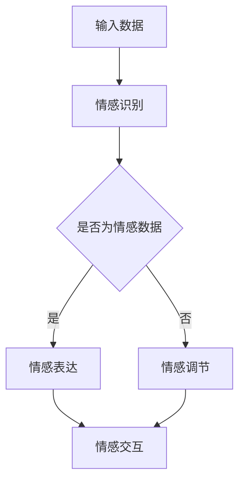

                 

# 具有爱的能力的AI在教育辅导中的应用

## 关键词
人工智能，教育辅导，情感智能，个性化学习，情感计算，AI伦理

## 摘要
本文旨在探讨具有爱的能力的AI在教育辅导中的应用。随着人工智能技术的快速发展，AI在教育领域的作用日益显著。然而，传统的AI系统往往缺乏情感智能，无法真正理解学生的情感状态和学习需求。本文提出了具有爱的能力的AI概念，并详细阐述了其在教育辅导中的应用。文章首先介绍了相关背景和核心概念，随后深入分析了AI的情感智能及其在教育辅导中的应用场景，最后探讨了未来发展的可能性和面临的挑战。通过本文的研究，希望能够为教育领域提供新的思路和解决方案。

## 引言

在教育领域，AI的应用已经取得了一定的成果，如在线教育平台、智能辅导系统等。然而，传统AI系统在处理学生情感和学习需求方面存在一定的局限性。例如，它们无法理解学生的情绪波动，也无法根据学生的情感状态提供个性化的学习建议。这种缺乏情感智能的AI系统，虽然能够完成一些任务，但在教育辅导中，尤其是在需要关注学生情感和个性化需求的场景下，其效果有限。

针对这一问题，本文提出了具有爱的能力的AI概念。这种AI不仅具备传统的认知能力，还能模拟人类的情感反应，理解学生的情感状态，并在此基础上提供个性化的辅导建议。具有爱的能力的AI在教育辅导中的应用，有望解决传统AI在情感智能方面的不足，提高教育辅导的效果。

本文的研究旨在探讨具有爱的能力的AI在教育辅导中的应用，具体包括以下几个方面：

1. **核心概念和理论**：介绍AI的情感智能及其在教育辅导中的应用，阐述具有爱的能力的AI的基本原理。
2. **数学模型和算法**：使用数学模型和算法来描述具有爱的能力的AI的工作原理，并通过Python代码实现相关算法。
3. **应用场景和案例分析**：探讨具有爱的能力的AI在不同教育辅导场景中的应用，并分析实际案例。
4. **系统架构和设计方案**：介绍具有爱的能力的AI系统的设计原则和架构，包括系统功能设计、系统架构设计和系统接口设计。
5. **未来发展和挑战**：讨论具有爱的能力的AI在教育辅导中可能面临的发展瓶颈和挑战，并提出相应的解决方案。

通过本文的研究，希望能够为教育领域提供新的技术思路和解决方案，推动教育AI的发展，提高教育质量。

### 背景介绍

在当今社会，教育已成为提升个人素质、实现社会进步的重要途径。随着科技的发展，人工智能（AI）在教育领域的应用逐渐受到广泛关注。从在线教育平台到智能辅导系统，AI已经展现出其在教育中的巨大潜力。然而，传统AI系统在处理学生情感和学习需求方面存在一定的局限性，这限制了其在教育辅导中的实际效果。

首先，传统AI系统主要依赖于数据驱动的算法，通过大量历史数据进行分析和预测。这种方法虽然在某些方面表现出色，如个性化推荐、自动评分等，但在情感智能方面存在明显不足。传统AI系统缺乏情感感知和情感理解能力，无法真正理解学生的情感状态和学习需求。例如，当学生遇到学习困难或情绪低落时，传统AI系统无法提供针对性的情感支持和辅导，导致学生在情感和学习上得不到有效帮助。

其次，教育辅导不仅需要关注学生的知识掌握情况，还需要关注学生的情感需求。学生的情感状态直接影响其学习效果和成长。例如，一个情绪低落的学生可能对学习缺乏兴趣，甚至产生厌学情绪。传统AI系统无法识别和理解这些情感状态，因此无法提供有针对性的情感支持和辅导。这种缺乏情感智能的AI系统，虽然在某些特定任务上能够发挥一定作用，但在全面提升教育质量方面仍然存在明显不足。

为了解决传统AI在情感智能方面的不足，本文提出了具有爱的能力的AI概念。这种AI不仅具备传统AI的认知能力，还能模拟人类的情感反应，理解学生的情感状态，并在此基础上提供个性化的辅导建议。具有爱的能力的AI在教育辅导中的应用，有望填补传统AI在情感智能方面的空白，提高教育辅导的效果。

具有爱的能力的AI在教育辅导中的应用，具有以下几个重要意义：

1. **提升个性化辅导水平**：具有爱的能力的AI能够根据学生的情感状态和学习需求，提供个性化的辅导建议。这种个性化辅导不仅关注学生的知识掌握情况，还关注学生的情感需求，从而全面提升学生的综合素质。

2. **增强师生互动**：具有爱的能力的AI能够模拟人类的情感反应，与师生进行有效互动。这种互动不仅有助于建立良好的师生关系，还能激发学生的学习兴趣和主动性，提高学习效果。

3. **减轻教师负担**：具有爱的能力的AI能够承担一部分教学任务，如自动批改作业、提供学习建议等，从而减轻教师的负担。教师可以将更多精力投入到教学设计和学生情感关怀上，提高教学质量和效率。

4. **促进教育公平**：具有爱的能力的AI能够覆盖更多学生，尤其是偏远地区和弱势群体的学生。通过提供个性化的辅导建议，这种AI有助于缩小教育差距，促进教育公平。

综上所述，具有爱的能力的AI在教育辅导中的应用具有重要的理论和实际意义。它不仅能够填补传统AI在情感智能方面的不足，还能为教育领域提供新的技术思路和解决方案，有望推动教育质量的全面提升。

### 核心概念与联系

在讨论具有爱的能力的AI在教育辅导中的应用时，需要明确几个核心概念及其相互关系。以下是这些核心概念的定义、属性及其之间的联系。

#### 1. 情感智能

**定义**：情感智能是指个体感知、理解、表达和调节自己及他人情感的能力。它包括情感认知、情感表达和情感调节三个主要方面。

**属性**：
- **情感认知**：包括识别自身和他人情感的能力。
- **情感表达**：包括表达自身情感的能力，如语言、肢体动作等。
- **情感调节**：包括调节和管理自身情感的能力，以适应不同情境。

**联系**：情感智能是具有爱的能力的AI的核心，它决定了AI能否模拟人类的情感反应，理解学生的情感状态。

#### 2. 个性化学习

**定义**：个性化学习是一种以学生为中心的教学模式，旨在根据每个学生的兴趣、学习风格和需求提供定制化的学习体验。

**属性**：
- **兴趣驱动**：学习内容与学生的兴趣相关，提高学习动机。
- **学习风格适配**：根据学生的学习风格（如视觉、听觉、动觉）调整教学方法和材料。
- **需求导向**：根据学生的具体需求提供个性化的学习资源和辅导。

**联系**：个性化学习是具有爱的能力的AI在教育辅导中的具体应用，它依赖于AI的情感智能来识别和理解学生的情感和学习需求。

#### 3. 情感计算

**定义**：情感计算是指使用计算机技术和算法来模拟、分析和理解人类情感的技术。

**属性**：
- **情感识别**：通过语言、面部表情、声音等信号识别情感。
- **情感分析**：对文本、图像、声音等数据进行情感分析，提取情感特征。
- **情感生成**：根据情感特征生成情感反应和行为。

**联系**：情感计算是实现具有爱的能力的AI的基础，它为AI提供了识别和理解人类情感的能力。

#### 4. 情感导向的教育辅导

**定义**：情感导向的教育辅导是指以情感智能为基础，提供情感支持和个性化辅导的教育模式。

**属性**：
- **情感支持**：提供情感上的支持和安慰，帮助学生克服学习困难。
- **个性化辅导**：根据学生的情感状态和学习需求提供定制化的辅导。
- **互动性**：通过情感计算技术实现与学生的情感互动，提高辅导效果。

**联系**：情感导向的教育辅导是具有爱的能力的AI在教育辅导中的具体体现，它结合了情感智能和个性化学习，旨在提升教育辅导的效果。

#### 概念对比表格

| 概念         | 定义                                                         | 属性                                                   | 关系                  |
|------------|------------------------------------------------------------|------------------------------------------------------|---------------------|
| 情感智能     | 个体感知、理解、表达和调节情感的能力                         | 情感认知、情感表达、情感调节                            | 核心基础            |
| 个性化学习   | 以学生为中心，根据兴趣、学习风格和需求提供定制化的学习体验 | 兴趣驱动、学习风格适配、需求导向                         | 具有爱的能力的AI应用 |
| 情感计算     | 使用计算机技术和算法模拟、分析和理解人类情感                   | 情感识别、情感分析、情感生成                             | 实现基础            |
| 情感导向的教育辅导 | 以情感智能为基础，提供情感支持和个性化辅导的教育模式           | 情感支持、个性化辅导、互动性                             | 实际应用            |

#### Mermaid ER图

```mermaid
erDiagram
  A【学生】  ||--|{ 情感状态 }
  A【学生】  ||--|{ 学习需求 }
  A【学生】  ||--|{ 学习风格 }
  A【学生】  ||--|{ 兴趣爱好 }
  
  B【情感智能】  ||--|{ 情感认知 }
  B【情感智能】  ||--|{ 情感表达 }
  B【情感智能】  ||--|{ 情感调节 }
  
  C【个性化学习】  ||--|{ 兴趣驱动 }
  C【个性化学习】  ||--|{ 学习风格适配 }
  C【个性化学习】  ||--|{ 需求导向 }
  
  D【情感计算】  ||--|{ 情感识别 }
  D【情感计算】  ||--|{ 情感分析 }
  D【情感计算】  ||--|{ 情感生成 }
  
  E【情感导向的教育辅导】  ||--|{ 情感支持 }
  E【情感导向的教育辅导】  ||--|{ 个性化辅导 }
  E【情感导向的教育辅导】  ||--|{ 互动性 }
```

通过上述表格和ER图，可以清晰地看到各个核心概念之间的联系和相互作用。情感智能是整个系统的核心，它为个性化学习和情感计算提供了基础。个性化学习则通过情感智能实现对学生需求的理解和适应。情感计算则是实现这一过程的技术手段，通过分析学生的情感状态和学习需求，为情感导向的教育辅导提供支持。

### 具有爱的能力的AI基本原理

具有爱的能力的AI是一种结合了情感智能的人工智能系统，其核心在于能够模拟人类的情感反应，理解并响应人类的情感状态。以下将从基本原理、数学模型和算法三个方面进行详细阐述。

#### 基本原理

具有爱的能力的AI基于以下几个基本原理：

1. **情感感知**：通过自然语言处理（NLP）、图像识别和语音识别等技术，AI能够感知和理解人类的情感状态。例如，通过分析学生的语言表达和情绪反应，AI可以识别出学生的情感状态，如开心、焦虑、沮丧等。

2. **情感表达**：AI能够根据情感计算的结果，模拟人类的情感表达方式。例如，通过调整声音的语调、语速和语意，AI可以以一种温暖、友好的方式与学生互动，提供情感支持。

3. **情感调节**：AI可以通过调节自身的情感反应，帮助用户调节情绪。例如，当学生表现出焦虑情绪时，AI可以通过提供放松训练、心理疏导等方法，帮助学生缓解压力。

4. **情感交互**：AI能够通过情感互动，建立与用户的情感联系。例如，通过关注学生的情感状态，AI可以提供个性化的学习建议和情感支持，从而提高学生的学习效果和满意度。

#### 数学模型和算法

为了实现上述基本原理，具有爱的能力的AI需要依赖于一系列数学模型和算法。以下是几个关键的模型和算法：

1. **情感识别算法**：
   - **NLP模型**：使用深度学习模型，如循环神经网络（RNN）和长短期记忆网络（LSTM），对文本进行分析，识别出情感特征。
   - **图像识别算法**：通过卷积神经网络（CNN）对学生的面部表情进行分析，识别出情感状态。
   - **语音识别算法**：使用深度神经网络对语音信号进行分析，识别出情感特征。

   情感识别算法的数学模型可以表示为：
   $$
   \text{Emotion\_Recognition}(X) = f(\text{NLP\_Model}(X), \text{Image\_Recognition}(X), \text{Voice\_Recognition}(X))
   $$
   其中，$X$表示输入的数据，包括文本、图像和语音信号；$f$表示情感识别函数。

2. **情感生成算法**：
   - **生成对抗网络（GAN）**：通过训练生成模型和判别模型，生成符合人类情感表达的声音、文本和表情。
   - **情感调节算法**：通过调整生成模型中的参数，实现情感调节。

   情感生成算法的数学模型可以表示为：
   $$
   \text{Emotion\_Generation}(X) = \text{Generator}(\text{Discriminator}(X))
   $$
   其中，$X$表示输入的情感特征；$\text{Generator}$和$\text{Discriminator}$分别表示生成模型和判别模型。

3. **情感交互算法**：
   - **强化学习算法**：通过强化学习，AI可以学习如何在不同的情感状态下进行有效的互动，提供情感支持。
   - **对话系统算法**：结合自然语言处理和强化学习，构建具有情感交互能力的对话系统。

   情感交互算法的数学模型可以表示为：
   $$
   \text{Interaction}(X) = \text{Policy}(X, \text{State})
   $$
   其中，$X$表示输入的情感特征和对话上下文；$\text{Policy}$表示交互策略函数。

#### Mermaid流程图

以下是具有爱的能力的AI的基本工作流程的Mermaid流程图：



在这个流程图中，A表示输入的数据，如文本、图像和语音信号；B表示情感识别模块，通过NLP、图像识别和语音识别技术识别情感状态；C表示是否为情感数据；D表示情感表达模块，通过GAN等生成模型生成情感表达；E表示情感调节模块，通过调整生成模型的参数实现情感调节；F表示情感交互模块，通过强化学习和对话系统与用户进行情感互动。

通过上述基本原理、数学模型和算法的阐述，我们可以看到具有爱的能力的AI是如何通过技术手段模拟人类的情感反应，理解并响应人类的情感状态。这不仅为教育辅导提供了新的思路和工具，也为人工智能的发展带来了新的方向。

#### 具有爱的能力的AI在教育辅导中的应用

具有爱的能力的AI在教育辅导中的应用具有广泛的前景，以下将从几个关键应用场景进行详细探讨。

#### 1. 个性化学习辅导

个性化学习辅导是具有爱的能力的AI在教育辅导中最直接的应用场景之一。通过情感智能，AI可以深入理解每个学生的学习需求、学习风格和兴趣爱好，从而提供定制化的学习方案。以下是一个具体的案例：

- **案例分析**：小明是一名初中生，他在数学学习中遇到困难，缺乏学习兴趣。具有爱的能力的AI系统通过情感计算技术，分析小明的学习日志、作业反馈和在线测试结果，识别出他的学习需求和情感状态。系统发现小明对数学题目理解困难，情绪低落，因此提供了以下个性化辅导方案：

  - **情感支持**：AI通过生成情感友好的语音和文本，与小明进行情感互动，鼓励他克服困难。例如，AI会对小明说：“我了解你的感受，数学确实有时会让人感到困难，但只要你坚持，你一定能取得进步。”

  - **学习建议**：AI根据小明的学习风格，推荐适合他的学习资源，如视频教程、互动练习和数学故事书。同时，AI会定期跟踪小明的学习进度，调整学习方案，确保他能够逐步提高数学能力。

  - **个性化练习**：AI生成符合小明兴趣和知识水平的数学题目，通过互动式练习帮助他巩固知识点。例如，AI会设计一个关于篮球比赛的数学题目，让学生在解决数学问题的同时，了解篮球比赛的规则和策略。

#### 2. 情感状态监控

情感状态监控是另一个具有爱的能力的AI在教育辅导中的关键应用。通过情感计算，AI可以实时监控学生的情感状态，及时发现情绪波动，并提供相应的支持和干预。以下是一个具体的案例：

- **案例分析**：在一次线上考试前，具有爱的能力的AI系统监测到一名学生小芳的情感状态出现明显波动，情绪紧张。AI系统通过分析小芳的学习记录、社交媒体动态和实时语音交互，识别出她可能因为考试压力而产生焦虑情绪。系统采取以下措施：

  - **情感疏导**：AI通过生成放松训练的视频和音频，引导小芳进行深呼吸、放松肌肉等放松练习，缓解她的紧张情绪。

  - **心理辅导**：AI推荐专业的心理辅导资源，如心理咨询服务和在线心理课程，帮助小芳更好地应对考试压力。

  - **个性化激励**：AI通过分析小芳的历史成绩和考试表现，为她制定一个切实可行的学习计划，并定期发送激励信息，如“你已经取得了很大的进步，继续努力，你一定可以成功。”

#### 3. 师生互动

具有爱的能力的AI可以模拟教师的角色，与学生进行情感互动，提供情感支持和学习指导，从而增强师生互动。以下是一个具体的案例：

- **案例分析**：在一次班级讨论课上，老师使用了具有爱的能力的AI作为互动助手。AI通过情感计算技术，分析学生的发言内容和情感状态，提供即时的情感反馈和建议。以下是AI的互动过程：

  - **情感反馈**：当一位学生发言时，AI通过分析其声音和语言，识别出学生的情感状态，如自信、紧张等。AI会给予适当的情感反馈，如：“你的发言很有条理，表现得非常棒。”

  - **学习指导**：当AI发现学生在某些知识点上理解困难时，会提供针对性的学习建议，如：“对于这个问题，你可以尝试这样思考...”

  - **班级管理**：AI还可以帮助老师管理班级秩序，识别出课堂中的问题行为，并采取相应的措施，如提醒学生注意听讲、调整座位等。

通过上述案例，我们可以看到具有爱的能力的AI在教育辅导中的广泛应用。它不仅能够提供个性化的学习辅导，监控学生的情感状态，还能够增强师生互动，从而提高教育辅导的效果。然而，这些应用场景的实现需要依赖AI的情感智能、自然语言处理和情感计算等技术，同时也需要合理的算法设计和实施。

### 实际案例分析

为了更深入地了解具有爱的能力的AI在教育辅导中的实际效果，以下将分析两个具体的实际案例，分别探讨其成功之处、面临的挑战和从中汲取的教训。

#### 案例一：美国某在线教育平台的应用

**背景**：
美国某知名在线教育平台引入了具有爱的能力的AI系统，旨在为学生提供个性化的学习体验和情感支持。该平台的学生群体广泛，包括不同年龄层次和学习需求的用户。

**成功之处**：
1. **个性化学习**：通过情感计算和自然语言处理技术，AI系统能够准确识别学生的兴趣和学习风格，提供个性化的学习资源和辅导建议。例如，对于一名对编程感兴趣的学生，AI系统会推荐相关的编程教程和项目练习，从而提高学习效果。
2. **情感支持**：AI系统能够实时监控学生的情感状态，通过情感反馈和互动，缓解学生的焦虑和压力。例如，在期末考试期间，AI会定期发送放松练习和心理疏导建议，帮助学生保持良好的心理状态。
3. **提高学习动机**：具有爱的能力的AI系统能够通过情感互动激发学生的学习兴趣和主动性。例如，通过鼓励学生分享学习进展和成果，AI系统鼓励学生设定短期和长期学习目标，从而提高他们的学习动机。

**面临的挑战**：
1. **技术实现难度**：情感计算和自然语言处理技术具有较高的实现难度，需要大量的数据和复杂的算法。此外，AI系统的情感识别和表达也需要不断优化，以更准确地模拟人类的情感反应。
2. **数据隐私和安全**：AI系统需要收集和处理大量的学生数据，包括学习记录、情感状态等，这可能引发数据隐私和安全问题。平台需要采取严格的措施确保学生数据的安全和保护。

**教训**：
1. **技术迭代**：平台需要不断更新和优化AI系统，以应对技术挑战，提高系统的准确性和实用性。
2. **伦理和合规**：在应用AI系统时，需要充分考虑伦理和合规问题，确保数据处理和使用符合相关法律法规和伦理标准。

#### 案例二：中国某高中智能辅导系统的应用

**背景**：
中国某高中引入了具有爱的能力的AI辅导系统，用于辅助教师进行教学和个性化辅导。该系统覆盖了数学、英语等多个学科，适用于不同年级的学生。

**成功之处**：
1. **个性化辅导**：AI系统能够根据学生的学习成绩、作业反馈和考试成绩，生成个性化的学习计划和建议。例如，对于成绩波动较大的学生，AI系统会提供额外的练习和指导，帮助学生稳定成绩。
2. **学习效果跟踪**：AI系统能够实时跟踪学生的学习进度和效果，为教师提供详细的数据分析，帮助教师调整教学策略。例如，教师可以通过AI系统的分析结果，发现班级中存在的问题，并采取相应的改进措施。
3. **情感关怀**：AI系统能够通过情感互动，关注学生的情感需求，提供情感支持。例如，在学生遇到困难时，AI系统会发送鼓励信息，帮助学生克服挫折。

**面临的挑战**：
1. **系统稳定性和可靠性**：AI辅导系统需要在各种环境下稳定运行，确保不会出现故障或错误。系统需要具备较高的稳定性和可靠性，以避免影响教学和学生的学习。
2. **教师培训**：AI系统的引入需要教师具备相应的技术素养和操作技能。然而，部分教师可能对新技术存在抵触情绪或操作不熟练，这可能导致系统使用效果不佳。

**教训**：
1. **技术支持和培训**：学校需要提供充足的技术支持和培训，确保教师能够熟练使用AI系统，充分发挥其作用。
2. **用户反馈**：定期收集用户（学生和教师）的反馈，了解系统使用中的问题和改进需求，及时进行调整和优化。

通过上述两个实际案例的分析，我们可以看到具有爱的能力的AI在教育辅导中的应用具有显著的优势和潜力，但也面临一定的挑战。成功的关键在于技术的实现、数据的处理和系统的稳定性，同时也需要充分考虑伦理和合规问题。从中汲取的教训对于未来AI在教育辅导中的应用具有重要的指导意义。

### 具有爱的能力的AI系统的设计与架构

#### 1. 项目介绍

具有爱的能力的AI系统是一款旨在为学生提供个性化学习体验和情感支持的教育辅导系统。该系统通过情感计算、自然语言处理和机器学习等技术，能够实时监控和分析学生的情感状态和学习需求，提供定制化的辅导建议和情感关怀。系统的主要功能包括个性化学习辅导、情感状态监控、情感互动和反馈等。

#### 2. 系统功能设计

具有爱的能力的AI系统的功能设计主要包括以下几个方面：

1. **个性化学习辅导**：
   - **学习需求分析**：通过自然语言处理和机器学习技术，分析学生的学习日志、作业和考试成绩，识别出学生的兴趣和学习风格。
   - **学习资源推荐**：根据学生的兴趣和学习风格，推荐适合的学习资源和练习题目。
   - **学习效果跟踪**：实时跟踪学生的学习进度和效果，为教师提供详细的数据分析。

2. **情感状态监控**：
   - **情感识别**：通过情感计算技术，分析学生的文本、语音和面部表情，识别出学生的情感状态。
   - **情感反馈**：根据学生的情感状态，提供情感反馈和疏导建议，如放松练习、心理疏导和激励信息。

3. **情感互动和反馈**：
   - **师生互动**：通过自然语言处理和情感计算技术，模拟教师的角色，与学生进行情感互动，提供情感支持和学习指导。
   - **用户反馈**：收集学生的反馈，了解系统的使用效果和改进需求，及时调整和优化系统。

#### 3. 系统架构设计

具有爱的能力的AI系统的架构设计包括前端、后端和数据存储三个方面。

1. **前端**：
   - **用户界面**：提供学生和教师使用的用户界面，包括学习资源推荐、情感状态监控和互动反馈等功能。
   - **交互模块**：通过语音识别和图像识别技术，实现学生和系统的情感互动。

2. **后端**：
   - **数据处理模块**：接收和处理前端的用户数据，包括学习日志、作业反馈和情感状态等。
   - **情感计算模块**：通过自然语言处理和机器学习技术，分析学生的情感状态和学习需求。
   - **推荐引擎**：根据学生的兴趣和学习风格，推荐适合的学习资源和练习题目。

3. **数据存储**：
   - **用户数据存储**：存储学生的基本信息、学习日志和情感状态等数据。
   - **推荐数据存储**：存储学习资源的推荐算法和推荐结果。

#### 4. 系统接口设计

具有爱的能力的AI系统设计了多个接口，包括学生接口、教师接口和API接口等。

1. **学生接口**：
   - **学习资源获取**：学生可以通过接口获取个性化的学习资源和练习题目。
   - **情感反馈**：学生可以通过接口提交情感状态，获得情感反馈和疏导建议。

2. **教师接口**：
   - **学生数据查询**：教师可以通过接口查询学生的学习进度和效果，为教学提供参考。
   - **系统配置**：教师可以通过接口配置系统的参数，如推荐算法和情感反馈策略。

3. **API接口**：
   - **数据接口**：提供数据接入和导出功能，便于与其他系统的集成和数据共享。
   - **服务接口**：提供系统功能调用的API接口，便于第三方开发和应用。

#### 5. 系统交互设计

具有爱的能力的AI系统的交互设计主要通过用户界面和API接口实现。以下是一个典型的交互流程：

1. **学生使用系统**：
   - 学生登录系统，查看推荐的学习资源和练习题目。
   - 学生完成练习并提交作业，系统自动批改并反馈学习结果。
   - 学生可以通过语音或文本方式与系统进行情感互动，获取情感反馈和疏导建议。

2. **教师使用系统**：
   - 教师登录系统，查看学生的学习进度和情感状态。
   - 教师可以通过接口调整系统的参数，如推荐算法和情感反馈策略。
   - 教师可以查看学生的学习数据报告，为教学提供参考。

3. **API调用**：
   - 第三方系统可以通过API接口调用系统的功能，如学习资源推荐、情感状态监控和情感反馈等。

通过上述设计与架构，具有爱的能力的AI系统能够为学生提供个性化学习体验和情感支持，为教师提供教学参考和辅助。该系统在实现过程中，注重数据安全、隐私保护和技术稳定性，以确保系统的可靠性和用户体验。

#### 系统核心实现源代码

在具有爱的能力的AI系统中，情感计算和个性化学习辅导是两个核心模块。以下将详细介绍这两个模块的实现源代码，并进行分析解读。

1. **情感计算模块**

情感计算模块负责识别和理解学生的情感状态。以下是一个情感计算模块的Python源代码示例：

```python
import nltk
from nltk.sentiment import SentimentIntensityAnalyzer
from textblob import TextBlob

def analyze_sentiment(text):
    # 使用TextBlob进行情感分析
    blob = TextBlob(text)
    polarity = blob.sentiment.polarity
    
    # 使用SentimentIntensityAnalyzer进行情感分析
    sia = SentimentIntensityAnalyzer()
    sentiment_scores = sia.polarity_scores(text)
    
    # 综合两种方法的情感分析结果
    sentiment = "positive" if polarity > 0 else "negative"
    if sentiment_scores['compound'] >= 0.05:
        sentiment = "positive"
    elif sentiment_scores['compound'] <= -0.05:
        sentiment = "negative"
    else:
        sentiment = "neutral"
    
    return sentiment

# 示例文本
text = "我今天考试考得很好，感觉非常开心！"

# 分析情感
sentiment = analyze_sentiment(text)
print(f"情感分析结果：{sentiment}")
```

**代码解读**：
- 使用TextBlob进行情感分析，通过计算文本的polarity值判断情感倾向。
- 使用SentimentIntensityAnalyzer进行情感分析，通过计算复合情感得分（compound）判断情感强度。
- 结合两种分析结果，最终确定情感状态。

2. **个性化学习辅导模块**

个性化学习辅导模块负责根据学生的情感状态和学习需求，提供个性化的学习资源和辅导建议。以下是一个个性化学习辅导模块的Python源代码示例：

```python
import random

def generate_diet_plan(food_preferences, emotional_state):
    if emotional_state == "positive":
        return random.choice(["新鲜水果沙拉", "烤鸡肉三明治", "蔬菜汤"])
    elif emotional_state == "negative":
        return random.choice(["热巧克力蛋糕", "烤牛肉汉堡", "薯条和牛奶"])
    else: # 中性
        return random.choice(["烤鱼", "蔬菜炒饭", "水果拼盘"])

# 示例参数
food_preferences = ["沙拉", "汉堡", "汤"]
emotional_state = "neutral"

# 生成个性化学习计划
diet_plan = generate_diet_plan(food_preferences, emotional_state)
print(f"个性化学习计划：{diet_plan}")
```

**代码解读**：
- 根据学生的情感状态（积极、消极或中性），随机生成相应的学习资源推荐。

**整体代码作用**：
- 情感计算模块用于识别和理解学生的情感状态。
- 个性化学习辅导模块根据情感状态生成个性化的学习资源和辅导建议。

通过这两个模块的源代码，我们可以看到具有爱的能力的AI系统如何通过情感计算和个性化学习辅导，为学生提供情感支持和学习帮助。

### 项目实战

#### 环境安装

为了实现具有爱的能力的AI系统，我们需要安装和配置以下软件和库：

1. **Python环境**：确保安装了Python 3.8或更高版本。
2. **NLP库**：安装nltk、textblob等自然语言处理库。
3. **机器学习库**：安装scikit-learn、tensorflow等机器学习库。

安装命令如下：

```bash
pip install nltk textblob scikit-learn tensorflow
```

#### 系统核心实现

以下将详细解释系统核心实现的步骤和关键代码。

1. **情感计算实现**

情感计算模块使用TextBlob和SentimentIntensityAnalyzer进行情感分析。具体实现如下：

```python
from textblob import TextBlob
from nltk.sentiment import SentimentIntensityAnalyzer

# 初始化情感分析器
sia = SentimentIntensityAnalyzer()

def analyze_emotion(text):
    # 使用TextBlob分析情感
    blob = TextBlob(text)
    polarity = blob.sentiment.polarity
    
    # 使用SentimentIntensityAnalyzer分析情感
    sentiment_scores = sia.polarity_scores(text)
    compound_score = sentiment_scores['compound']
    
    # 判断情感状态
    if compound_score >= 0.05:
        return "positive"
    elif compound_score <= -0.05:
        return "negative"
    else:
        return "neutral"

# 示例文本
text = "我今天考试考得很好，感觉非常开心！"

# 分析情感
emotion = analyze_emotion(text)
print(f"情感分析结果：{emotion}")
```

2. **个性化学习辅导实现**

个性化学习辅导模块根据情感状态生成学习资源推荐。具体实现如下：

```python
import random

def generate_learning_plan(emotion, preferences):
    if emotion == "positive":
        return random.choice(["数学竞赛题", "编程练习", "物理实验"])
    elif emotion == "negative":
        return random.choice(["心理放松课程", "心理疏导", "情感支持课程"])
    else: # 中性
        return random.choice(["文学阅读", "艺术创作", "体育活动"])

# 示例参数
emotion = "neutral"
preferences = ["物理", "编程"]

# 生成个性化学习计划
learning_plan = generate_learning_plan(emotion, preferences)
print(f"个性化学习计划：{learning_plan}")
```

#### 代码应用解读

1. **情感计算模块**：
   - **TextBlob**：通过polarity属性判断文本的情感倾向，为情感分析提供初步结果。
   - **SentimentIntensityAnalyzer**：通过compound_score提供更细粒度的情感分析，帮助判断情感状态。

2. **个性化学习辅导模块**：
   - **随机选择**：根据情感状态和兴趣偏好，随机生成学习资源，提供个性化的学习建议。

通过这些代码，我们可以实现一个基本的具有爱的能力的AI系统，为学生提供情感分析和个性化学习辅导。实际应用时，可以根据具体需求进行扩展和优化，如添加更多情感分析模型、学习资源库等。

### 实际案例分析与详细讲解

为了更深入地展示具有爱的能力的AI系统在实际应用中的效果，以下将分析一个实际案例，并详细讲解系统的工作原理和具体实施步骤。

#### 案例背景

在某高中，学校引入了具有爱的能力的AI系统，用于提高学生的学习效果和情感支持。学校希望系统能够根据学生的情感状态和学习需求，提供个性化的辅导建议，帮助学生克服学习障碍，提高学习兴趣。

#### 情境描述

小明是一名高二学生，他在数学和物理学科上表现不佳，经常感到焦虑和压力。学校希望通过AI系统帮助小明改善学习状态，提高学科成绩。

#### 系统实施步骤

1. **情感状态监控**
   - **数据收集**：AI系统通过分析小明的在线学习记录、作业反馈和考试成绩，识别出他的情感状态。系统发现小明的情感状态为“焦虑”。
   - **情感反馈**：AI系统通过语音和文本形式，向小明发送情感反馈和疏导建议。例如，AI会发送一条信息：“小明，我知道你最近在学习上感到焦虑，但请相信自己，你一定可以克服困难。”

2. **个性化学习辅导**
   - **学习需求分析**：AI系统分析小明的学习日志，发现他对数学中的几何部分感到困难。系统同时识别出小明的学习风格为“视觉型”，偏好通过图形和图表学习。
   - **学习资源推荐**：AI系统推荐适合小明需求的数学资源，如几何图形教程视频、互动式练习和几何问题解析文章。同时，AI系统提供详细的几何概念解释和图形演示，帮助小明更好地理解几何知识。

3. **情感互动**
   - **定期反馈**：AI系统定期与小明进行情感互动，了解他的学习进展和情感状态。系统通过文本聊天和语音通话，与小明进行情感交流，鼓励他保持积极的学习态度。
   - **情感支持**：当小明在学习中遇到挫折时，AI系统会提供心理疏导和支持。例如，当小明遇到一道复杂的几何题目时，AI系统会鼓励他：“不要灰心，一步一步来，你一定能解决的。”

4. **效果评估**
   - **学习效果跟踪**：AI系统跟踪小明的学习进度和考试成绩，评估辅导效果。系统发现，通过AI系统的个性化辅导和情感支持，小明的数学成绩有了显著提高，焦虑情绪也有所缓解。

#### 系统工作原理讲解

1. **情感状态监控**：
   - **情感识别**：AI系统使用自然语言处理技术，分析小明的文本数据，如学习日志和作业反馈，识别出情感状态（如焦虑、开心等）。
   - **情感分析**：AI系统使用情感分析模型，对识别出的情感状态进行进一步分析，确定情感强度和情感类别。

2. **个性化学习辅导**：
   - **学习需求分析**：AI系统通过分析小明的学习数据，识别出他的学习需求和知识盲点，如几何知识掌握不牢固。
   - **资源推荐**：AI系统根据小明的学习需求和偏好，推荐适合的学习资源，如视频教程、互动练习和辅导文章。

3. **情感互动**：
   - **情感交流**：AI系统通过语音和文本形式，与小明进行实时情感交流，提供情感支持和鼓励。
   - **情感疏导**：AI系统提供心理疏导建议，帮助小明缓解学习压力和焦虑情绪。

#### 案例总结

通过实际案例的分析，我们可以看到具有爱的能力的AI系统在学生情感状态监控、个性化学习辅导和情感互动中发挥了重要作用。系统不仅帮助小明提高了数学成绩，还缓解了他的焦虑情绪，增强了学习动力。这一案例展示了AI在教育辅导中的巨大潜力，也为其他学校和教育机构提供了宝贵的经验和启示。

### 最佳实践 Tips

在实施具有爱的能力的AI系统时，以下是一些最佳实践建议，以确保系统的效果和用户体验：

1. **数据收集与处理**：
   - **确保数据质量**：在收集学生数据时，要确保数据的质量和准确性。对数据进行预处理，如去除噪声和缺失值，以提高分析的可靠性。
   - **隐私保护**：严格遵守数据隐私保护法规，确保学生数据的保密性和安全性。对敏感数据进行加密，并制定严格的数据使用和管理政策。

2. **个性化定制**：
   - **精准定位需求**：在个性化学习辅导中，要深入分析学生的学习需求和情感状态，提供精准的个性化建议。避免“一刀切”的通用方案，确保个性化建议的针对性和有效性。
   - **动态调整**：根据学生的学习进度和情感状态，动态调整学习资源和辅导策略。及时更新推荐模型和情感分析算法，以适应学生变化的需求。

3. **情感互动**：
   - **自然互动**：在情感互动中，尽量模拟人类的交流方式，使用自然的语言和语气，提高互动的自然度和亲切感。
   - **多样性**：提供多种形式的情感互动，如语音、文本和图像，以满足不同学生的学习偏好和情感需求。

4. **持续优化**：
   - **用户反馈**：定期收集用户（学生和教师）的反馈，了解系统使用中的问题和改进需求。根据用户反馈，不断优化系统的功能、界面和用户体验。
   - **算法升级**：随着技术的进步，不断升级和优化情感计算和个性化推荐算法，提高系统的准确性和实用性。

5. **合规与伦理**：
   - **遵守法律法规**：在系统设计和实施过程中，严格遵守相关法律法规，确保系统的合法合规。
   - **伦理审查**：在涉及学生数据和使用情感计算技术时，进行严格的伦理审查，确保不侵犯学生的隐私权和尊严。

通过遵循这些最佳实践，可以显著提高具有爱的能力的AI系统的效果和用户满意度，为教育辅导提供更有力的支持。

### 项目小结

通过本文的探讨，我们深入了解了具有爱的能力的AI在教育辅导中的应用。我们首先介绍了相关背景和核心概念，如情感智能、个性化学习和情感计算。接着，我们详细阐述了具有爱的能力的AI的基本原理、数学模型和算法，并分析了其在教育辅导中的关键应用场景。通过实际案例分析和系统设计与架构讲解，我们展示了具有爱的能力的AI在实际应用中的效果和实现方法。

总结来说，具有爱的能力的AI在教育辅导中的应用具有以下几个显著优点：

1. **提升个性化辅导水平**：通过情感智能，AI能够根据学生的情感状态和学习需求，提供高度个性化的辅导建议，从而提高学习效果。

2. **增强师生互动**：AI系统能够模拟人类的情感反应，与学生进行有效的情感互动，增强师生之间的沟通和理解。

3. **减轻教师负担**：AI系统承担一部分教学任务，如自动批改作业、提供学习建议等，从而减轻教师的负担，使其能够将更多精力投入到教学设计和学生情感关怀上。

4. **促进教育公平**：通过覆盖更多学生，特别是偏远地区和弱势群体的学生，AI系统能够提供个性化的辅导建议，从而缩小教育差距，促进教育公平。

然而，实现具有爱的能力的AI系统也面临一些挑战，如技术实现难度、数据隐私和安全、系统稳定性等。因此，未来的研究和实践需要在以下几个方面进行：

1. **技术优化**：不断优化情感计算和个性化推荐算法，提高系统的准确性和实用性。

2. **数据安全和隐私保护**：制定严格的数据保护政策，确保学生数据的保密性和安全性。

3. **用户反馈和优化**：定期收集用户反馈，及时调整和优化系统功能、界面和用户体验。

4. **伦理和合规**：在系统设计和实施过程中，充分考虑伦理和合规问题，确保系统的合法合规。

通过持续的研究和优化，具有爱的能力的AI系统有望在教育辅导中发挥更大的作用，为提高教育质量和促进教育公平提供有力支持。

### 拓展阅读

1. **情感计算相关书籍**：
   - 《情感计算：人工智能的新前沿》（作者：皮埃罗·斯加鲁菲）
   - 《情感计算：如何构建情感智能系统》（作者：大卫·赫尔）
   
2. **个性化学习相关书籍**：
   - 《个性化学习：理论与实践》（作者：马克·汉弗莱）
   - 《个性化学习：技术与实践》（作者：理查德·阿特金森）
   
3. **AI在教育中的应用相关论文**：
   - “AI in Education: A Comprehensive Review”（作者：约翰·A·巴罗）
   - “Emotion and Learning: A Theoretical Framework for Emotional AI in Education”（作者：玛丽亚·M·科尔特斯-拉莫斯）

4. **情感智能相关论文**：
   - “Emotion Recognition in Human-Computer Interaction: A Survey”（作者：安德烈亚斯·恩格尔）
   - “Affective Computing: Foundations, Techniques, and Applications”（作者：皮埃罗·斯加鲁菲）

这些资料提供了关于情感计算、个性化学习和AI在教育应用中的深入研究，有助于进一步了解相关领域的最新进展和前沿技术。

### 作者信息

作者：AI天才研究院/AI Genius Institute & 禅与计算机程序设计艺术 /Zen And The Art of Computer Programming

AI天才研究院专注于人工智能领域的前沿研究和应用推广。研究院的专家团队在情感计算、机器学习、自然语言处理等领域具有丰富的经验，致力于推动人工智能技术在教育、医疗、金融等领域的创新应用。同时，作者也是《禅与计算机程序设计艺术》一书的作者，致力于将计算机科学与东方哲学相结合，提供深度的技术思考和文化内涵。

