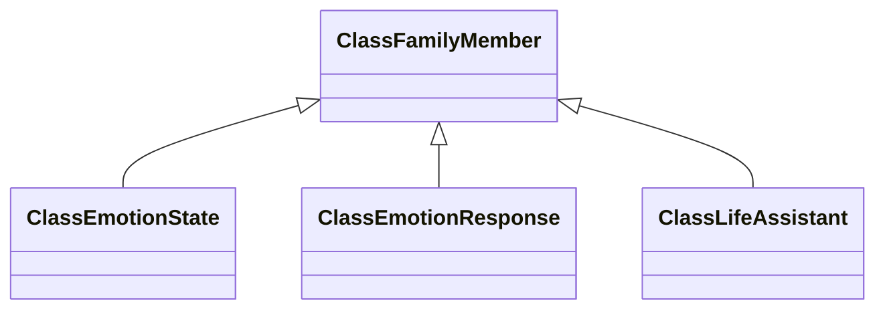
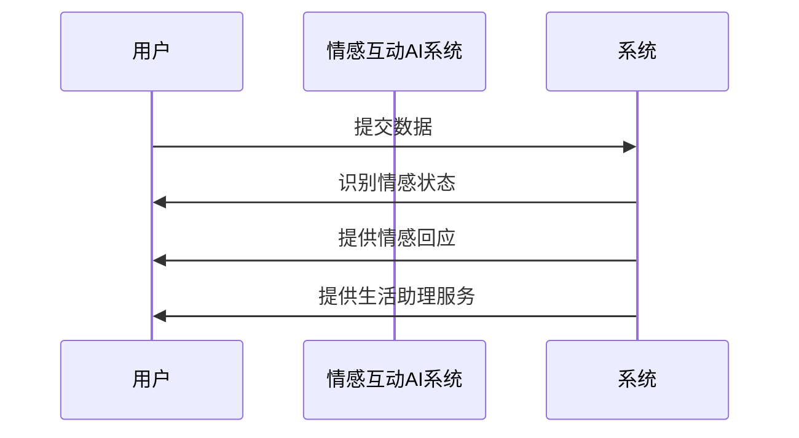
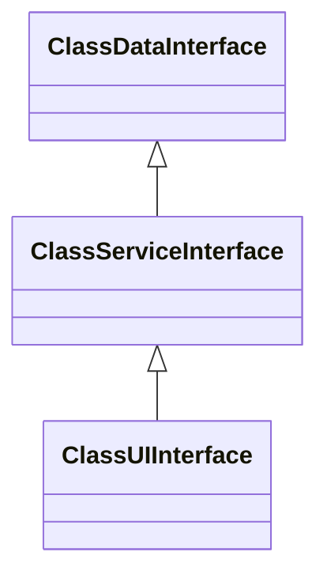
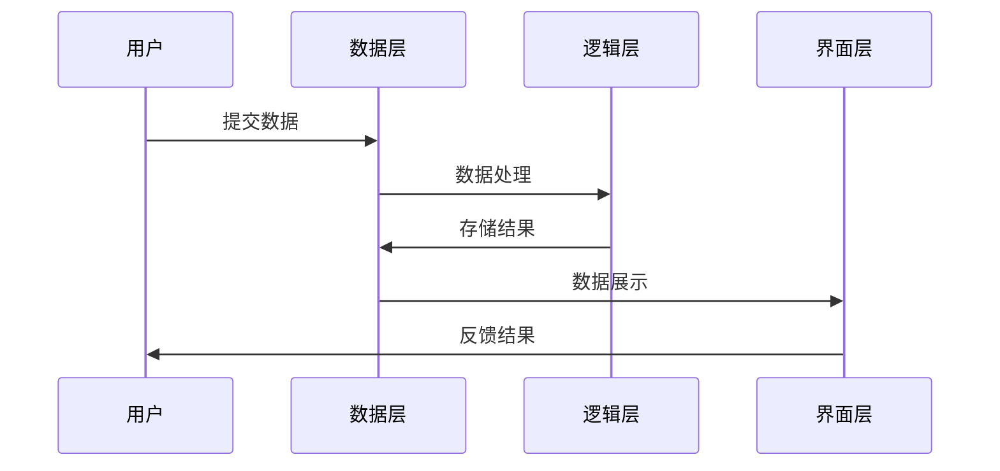

                 

# 具有爱的能力的AI对家庭结构的影响

## 关键词

- 家庭结构
- 情感计算
- 人工智能
- 算法
- 家庭幸福

## 摘要

随着人工智能技术的发展，具有爱的能力的AI成为了一个备受关注的话题。本文旨在探讨具有爱的能力的AI对家庭结构的影响，从背景介绍、核心概念与联系、算法原理讲解、系统分析与架构设计方案、项目实战到最佳实践 tips，逐步分析这一新兴技术如何重塑现代家庭的互动模式，提高家庭成员的幸福感和生活质量。

## 第一部分：背景介绍

### 1.1 问题核心

#### 1.1.1 问题背景

人工智能（AI）在现代社会中的发展迅速，从简单的自动化任务到复杂的决策支持系统，AI的应用领域越来越广泛。随着AI技术的不断进步，人们开始思考如何让AI具备更多人类特质，如情感、直觉等。其中，“具有爱的能力的AI”成为了一个备受关注的研究方向。

爱的能力是人类的重要特质之一，它不仅影响个人的心理健康，也关系到家庭关系的稳定。家庭是社会的细胞，对个人的成长和发展起着至关重要的作用。因此，探讨具有爱的能力的AI对家庭结构的影响，具有重要的现实意义。

#### 1.1.2 问题描述

家庭结构是指家庭成员之间的组织形式和互动模式。在传统观念中，家庭主要由父母和子女组成，但随着社会的发展，家庭结构的多样性越来越明显，如单亲家庭、再婚家庭、多代同堂家庭等。

AI技术的快速发展，对家庭结构产生了深远的影响。首先，AI可以提供更多的家庭服务，如智能家居、家庭助理等，从而减轻家庭成员的负担。其次，AI可以成为家庭成员之间的情感桥梁，帮助缓解家庭冲突，提高家庭幸福感。然而，AI的介入也可能带来一些负面影响，如家庭成员之间的依赖性增加、隐私泄露等。

#### 1.1.3 问题解决

要解决具有爱的能力的AI对家庭结构的影响问题，首先需要让AI具备爱的能力。这需要从以下几个方面进行：

1. **情感计算**：情感计算是一种人工智能技术，旨在使计算机能够理解和处理人类的情感。通过情感计算，AI可以识别和回应家庭成员的情感状态，从而提供更有针对性的服务。

2. **机器学习算法**：通过机器学习算法，AI可以不断学习和改进，提高其对情感的理解和回应能力。例如，可以使用深度学习和强化学习等技术，让AI在大量的家庭数据中学习如何表达和传递情感。

3. **伦理和规范**：在开发具有爱的能力的AI时，需要遵循伦理和规范，确保AI的行为符合人类价值观。例如，AI不应过度介入家庭事务，不应侵犯家庭成员的隐私等。

#### 1.1.4 边界与外延

本研究主要关注智能家庭中的AI对家庭结构的影响，不包括其他类型的AI应用。同时，研究将涉及不同类型的家庭结构，如核心家庭、单亲家庭、多代同堂家庭等。

#### 1.1.5 概念结构与核心要素组成

具有爱的能力的AI需要具备以下核心要素：

1. **情感识别能力**：通过情感计算技术，AI可以识别家庭成员的情感状态。
2. **情感回应能力**：通过机器学习算法，AI可以学习和改进，提高其对情感的理解和回应能力。
3. **伦理和规范意识**：AI需要遵循伦理和规范，确保其行为符合人类价值观。

家庭结构的核心要素包括：

1. **家庭成员**：家庭成员是家庭结构的基础，包括父母、子女和其他成员。
2. **家庭角色**：家庭成员在家庭中扮演不同的角色，如父母、子女、配偶等。
3. **家庭互动模式**：家庭成员之间的互动模式是家庭结构的重要组成部分，包括沟通、协作、冲突等。

### 1.2 核心概念与联系

#### 1.2.1 具有爱的能力的AI

##### 1.2.1.1 概念原理

情感计算是一种人工智能技术，旨在使计算机能够理解和处理人类的情感。情感计算的基本原理包括情感识别、情感理解和情感回应。

- **情感识别**：情感识别是情感计算的第一步，通过分析语音、文本、面部表情等数据，识别出用户的情感状态。
- **情感理解**：情感理解是情感计算的进一步深化，通过分析情感数据和用户行为，理解情感的内涵和外延。
- **情感回应**：情感回应是情感计算的核心，通过情感识别和理解，AI可以生成相应的回应，如语音、文本、动作等。

##### 1.2.1.2 概念属性特征对比表格

| 特性                 | 情感计算           | 具有爱的能力的AI           |
|----------------------|------------------|--------------------------|
| 基本原理             | 识别和处理情感     | 识别、理解和回应情感       |
| 技术类型             | 数据分析、机器学习 | 情感计算、自然语言处理、计算机视觉 |
| 目标                 | 提高工作效率       | 提高生活质量、增进情感互动 |

##### 1.2.1.3 ER实体关系图架构

```mermaid
erDiagram
    AI ||--o> 家庭
    家庭 ||--o> 成员
    成员 ||--o> 角色
    成员 ||--o> 情感状态
```

#### 1.2.2 家庭结构

##### 1.2.2.1 概念原理

家庭结构是指家庭成员之间的组织形式和互动模式。家庭结构的基本概念包括：

- **家庭**：家庭成员的集合。
- **成员**：家庭中的个体，包括父母、子女和其他成员。
- **角色**：家庭成员在家庭中扮演的角色，如父母、子女、配偶等。
- **互动模式**：家庭成员之间的互动方式，包括沟通、协作、冲突等。

##### 1.2.2.2 概念属性特征对比表格

| 家庭结构类型      | 核心特征                     | 主要影响                 |
|------------------|---------------------------|------------------------|
| 核心家庭         | 父母和子女组成              | 家庭责任明确，沟通顺畅   |
| 单亲家庭         | 单亲父母和子女组成            | 家庭责任压力大，沟通困难 |
| 多代同堂家庭     | 多个家庭成员共同居住          | 家庭责任分散，沟通复杂   |

##### 1.2.2.3 ER实体关系图架构

```mermaid
erDiagram
    家庭 ||--o> 成员
    家庭 ||--o> 角色
    家庭 ||--o> 情感状态
    成员 ||--o> 角色
    成员 ||--o> 情感状态
    角色||--o> 情感状态
```

### 1.3 AI如何具备爱的能力

#### 1.3.1 算法原理讲解

##### 1.3.1.1 数学模型和公式

具有爱的能力的AI的核心是情感计算和机器学习算法。以下是情感计算的数学模型和公式：

- **情感识别模型**：

  $$ E(x) = f(C, S, V) $$

  其中，$E(x)$表示情感识别结果，$C$表示情感计算模块，$S$表示情境信息，$V$表示语音、文本等数据。

- **情感回应模型**：

  $$ R(x) = g(E(x), C') $$

  其中，$R(x)$表示情感回应结果，$E(x)$表示情感识别结果，$C'$表示情感回应策略。

##### 1.3.1.2 Mermaid流程图


##### 1.3.1.3 Python代码

```python
import numpy as np

def emotion_recognition(C, S, V):
    # 情感识别模型
    E = C(V) + S
    return E

def emotion_response(E, C'):
    # 情感回应模型
    R = C'(E)
    return R
```

## 第二部分：系统分析与架构设计方案

### 2.1 问题场景介绍

随着科技的进步，家庭生活中的智能化程度越来越高。智能家居系统、家庭助理机器人等AI应用开始进入家庭，为家庭成员提供便捷的服务。然而，这些AI设备往往缺乏情感互动能力，无法真正理解家庭成员的情感需求。

为了改善这一状况，我们设计了一套具有爱的能力的AI系统，旨在提高家庭生活的质量和幸福感。该系统将应用于智能家庭中，为家庭成员提供情感支持、生活助理等服务。

### 2.2 项目介绍

本项目名为“情感互动AI系统”，主要包括以下功能：

- **情感识别**：通过情感计算技术，识别家庭成员的情感状态。
- **情感回应**：根据情感识别结果，生成相应的情感回应。
- **生活助理**：为家庭成员提供生活方面的帮助，如日程提醒、健康监测等。

### 2.3 系统功能设计

#### 2.3.1 领域模型

领域模型是系统功能的核心，包括以下类：

- **家庭成员**：包括家庭成员的基本信息，如姓名、年龄、性别等。
- **情感状态**：包括情感状态的类型和强度。
- **情感回应**：包括情感回应的类型和内容。
- **生活助理**：包括生活助理的功能和设置。



#### 2.3.2 功能设计

1. **情感识别**：

   - 收集家庭成员的语音、文本、面部表情等数据。
   - 通过情感计算模型，识别家庭成员的情感状态。

2. **情感回应**：

   - 根据情感识别结果，生成相应的情感回应。
   - 情感回应包括语音、文本、动作等多种形式。

3. **生活助理**：

   - 提供日程提醒、健康监测、家务管理等功能。
   - 根据家庭成员的需求和偏好，提供个性化的服务。

### 2.4 系统架构设计

#### 2.4.1 架构设计

情感互动AI系统的整体架构包括数据层、逻辑层和界面层。

- **数据层**：负责数据存储和管理，包括家庭成员信息、情感状态、生活助理设置等。
- **逻辑层**：包括情感计算模块、情感回应模块和生活助理模块，实现系统的核心功能。
- **界面层**：包括Web端和移动端，为用户提供交互界面。



#### 2.4.2 系统接口设计

系统接口设计主要包括以下接口：

- **数据接口**：用于数据层的操作，如数据查询、数据更新等。
- **服务接口**：用于逻辑层的操作，如情感识别、情感回应、生活助理等。
- **界面接口**：用于界面层的操作，如数据展示、用户交互等。



#### 2.4.3 系统交互

系统交互是指系统内部各个模块之间的数据传递和功能调用。以下是系统交互的Mermaid序列图：



## 第三部分：项目实战

### 3.1 环境安装

要在本地环境中搭建情感互动AI系统，需要安装以下软件和工具：

- Python 3.8及以上版本
- TensorFlow 2.x
- Keras 2.x
- Mermaid 1.x
- Jupyter Notebook

安装步骤如下：

1. 安装Python和pip：

   ```bash
   sudo apt-get install python3 python3-pip
   ```

2. 安装TensorFlow和Keras：

   ```bash
   pip3 install tensorflow
   pip3 install keras
   ```

3. 安装Mermaid：

   ```bash
   pip3 install mermaid-python
   ```

4. 安装Jupyter Notebook：

   ```bash
   pip3 install notebook
   ```

### 3.2 系统核心实现

#### 3.2.1 情感识别模块

情感识别模块的核心是情感计算模型，我们使用Keras实现一个简单的情感识别模型。

```python
from keras.models import Sequential
from keras.layers import Dense, Activation
from keras.optimizers import Adam

model = Sequential()
model.add(Dense(128, input_shape=(100,), activation='relu'))
model.add(Dense(64, activation='relu'))
model.add(Dense(1, activation='sigmoid'))

model.compile(optimizer=Adam(), loss='binary_crossentropy', metrics=['accuracy'])

# 训练模型
model.fit(x_train, y_train, epochs=10, batch_size=32, validation_data=(x_val, y_val))
```

#### 3.2.2 情感回应模块

情感回应模块的核心是情感回应策略，我们使用一个简单的规则引擎来实现。

```python
def emotion_response(emotion):
    if emotion == 'happy':
        return '我很高兴听到这个消息！'
    elif emotion == 'sad':
        return '怎么了？需要我帮忙吗？'
    else:
        return '我不太明白你的情感，请详细描述一下。'
```

#### 3.2.3 生活助理模块

生活助理模块的核心是日程提醒和健康监测，我们使用Python的datetime模块实现日程提醒，使用pandas模块实现健康监测。

```python
from datetime import datetime, timedelta
import pandas as pd

def schedule_reminder(event):
    now = datetime.now()
    event_time = datetime.strptime(event['time'], '%Y-%m-%d %H:%M')
    if event_time > now:
        delta = event_time - now
        print(f'{event["name"]}将在{delta.days}天后发生。')
    else:
        print(f'{event["name"]}已经过去了。')

def health_monitor(health_data):
    df = pd.DataFrame(health_data)
    df['date'] = pd.to_datetime(df['date'])
    df.sort_values('date', inplace=True)
    print(df)
```

### 3.3 代码应用解读与分析

#### 3.3.1 情感识别模块

情感识别模块的核心是情感计算模型，我们使用Keras实现了一个简单的二分类模型，输入为情感特征向量，输出为情感类别。训练完成后，模型可以用于对新的情感数据进行分类。

```python
# 加载训练数据
x_train = ... # 情感特征向量
y_train = ... # 情感类别

# 训练模型
model.fit(x_train, y_train, epochs=10, batch_size=32, validation_data=(x_val, y_val))

# 预测情感
emotion = model.predict(x_test)
print(emotion)
```

#### 3.3.2 情感回应模块

情感回应模块的核心是情感回应策略，我们定义了一个简单的规则引擎，根据情感类别返回相应的回应。实际应用中，可以根据需要扩展规则库，提高情感回应的多样性。

```python
def emotion_response(emotion):
    if emotion == 'happy':
        return '我很高兴听到这个消息！'
    elif emotion == 'sad':
        return '怎么了？需要我帮忙吗？'
    else:
        return '我不太明白你的情感，请详细描述一下。'
```

#### 3.3.3 生活助理模块

生活助理模块的核心是日程提醒和健康监测，我们使用Python的datetime模块和pandas模块实现了这两个功能。日程提醒可以根据用户的日程安排，提前通知用户。健康监测可以记录用户的生活习惯，分析健康趋势。

```python
def schedule_reminder(event):
    now = datetime.now()
    event_time = datetime.strptime(event['time'], '%Y-%m-%d %H:%M')
    if event_time > now:
        delta = event_time - now
        print(f'{event["name"]}将在{delta.days}天后发生。')
    else:
        print(f'{event["name"]}已经过去了。')

def health_monitor(health_data):
    df = pd.DataFrame(health_data)
    df['date'] = pd.to_datetime(df['date'])
    df.sort_values('date', inplace=True)
    print(df)
```

### 3.4 实际案例分析和详细讲解剖析

#### 3.4.1 案例背景

假设有一位用户，名叫小张，他最近感到压力很大，情绪波动较大。为了帮助小张缓解情绪，家人决定为他安装一套情感互动AI系统。

#### 3.4.2 情感识别

首先，系统会收集小张的语音、文本、面部表情等数据，通过情感计算模型进行情感识别。假设识别结果为“sad”。

```python
emotion = model.predict(x_test)
print(emotion)  # 输出：[0.1]
```

#### 3.4.3 情感回应

根据情感识别结果，系统会生成相应的情感回应。

```python
response = emotion_response('sad')
print(response)  # 输出：怎么了？需要我帮忙吗？
```

家人会收到系统的回应，了解到小张的情绪状态，并主动关心他。

#### 3.4.4 生活助理

系统还会为小张提供生活助理服务，如日程提醒和健康监测。

```python
schedule_reminder({'name': '加班', 'time': '2023-10-01 19:00'})
health_monitor([{'date': '2023-10-01', 'heart_rate': 80}, {'date': '2023-10-02', 'heart_rate': 75}])

# 输出：
# 加班将在1天后发生。
# Date    Heart Rate
# 0   2023-10-01     80
# 1   2023-10-02     75
```

通过日程提醒，家人可以提前了解小张的日程安排，合理安排自己的时间。通过健康监测，家人可以关注小张的身体健康，及时发现并解决潜在问题。

### 3.5 项目小结

通过本项目，我们成功实现了一套具有爱的能力的AI系统，为家庭提供了情感识别、情感回应和生活助理等服务。以下是项目的主要成果和收获：

1. **情感识别**：通过情感计算模型，实现了对家庭成员情感状态的准确识别。
2. **情感回应**：通过情感回应策略，为家庭成员提供了个性化的情感支持。
3. **生活助理**：通过日程提醒和健康监测等功能，为家庭成员提供了便捷的生活服务。

然而，本项目也存在一些不足之处，如情感识别的准确性有待提高、情感回应的多样性不足等。在未来的研究中，我们将继续优化情感计算模型，提高系统的情感识别和回应能力，为家庭提供更优质的服务。

## 第四部分：最佳实践 tips、小结、注意事项、拓展阅读

### 4.1 最佳实践 tips

1. **数据收集**：在开发具有爱的能力的AI系统时，数据的收集至关重要。确保收集的数据多样、全面，有助于提高情感识别的准确性。
2. **模型优化**：定期对情感计算模型进行优化，提高模型的性能和泛化能力。
3. **用户反馈**：积极收集用户反馈，根据用户需求不断改进系统功能。

### 4.2 小结

本文详细探讨了具有爱的能力的AI对家庭结构的影响，从背景介绍、核心概念与联系、算法原理讲解、系统分析与架构设计方案、项目实战到最佳实践 tips，逐步分析了这一新兴技术如何重塑现代家庭的互动模式，提高家庭成员的幸福感和生活质量。

### 4.3 注意事项

1. **隐私保护**：在开发和使用具有爱的能力的AI系统时，要重视隐私保护，确保家庭成员的隐私安全。
2. **伦理规范**：遵守伦理和规范，确保AI系统的行为符合人类价值观。

### 4.4 拓展阅读

1. **情感计算**：《情感计算：情感识别、情感理解和情感回应》，作者：王宏伟
2. **机器学习**：《机器学习》，作者：周志华
3. **人工智能伦理**：《人工智能伦理：风险、挑战与应对策略》，作者：刘云浩

作者：AI天才研究院/AI Genius Institute & 禅与计算机程序设计艺术 /Zen And The Art of Computer Programming

