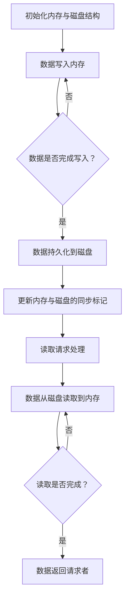
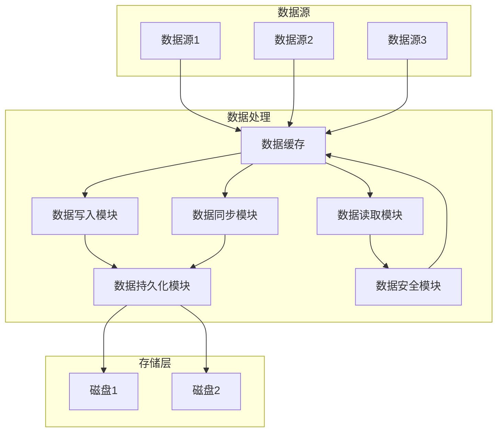
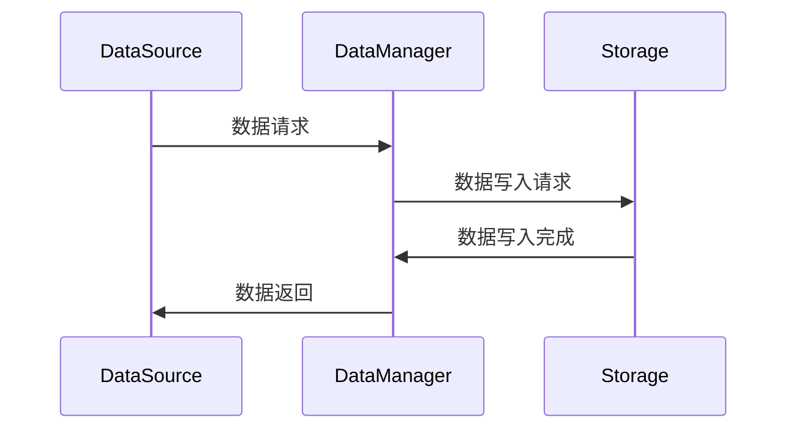
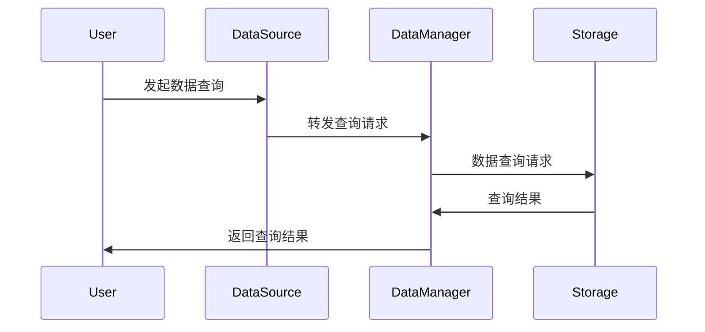

                 

### 内存级持久化：革新存储层次结构

#### 关键词：内存级持久化，存储层次结构，性能优化，数据持久化，内存管理，技术创新

> 摘要：本文将深入探讨内存级持久化技术，这一新兴的存储领域创新概念，通过剖析其基本原理、算法实现、系统架构和实际应用，阐述如何通过内存级持久化革新传统存储层次结构，提升数据存储与访问的性能。

---

### 目录

1. **内存级持久化：背景与核心概念** <a id="background"></a>
   - 1.1 内存级持久化的定义与重要性
   - 1.2 内存级持久化与传统存储技术的区别
   - 1.3 内存级持久化的应用场景
   - 1.4 核心概念与联系
     - 1.4.1 核心概念原理
     - 1.4.2 概念属性特征对比表格
     - 1.4.3 内存级持久化的ER实体关系图

2. **内存级持久化算法原理讲解** <a id="algorithm"></a>
   - 2.1 内存级持久化算法的mermaid流程图
   - 2.2 内存级持久化算法的Python源代码
   - 2.3 算法原理的数学模型和公式
   - 2.4 算法原理详细讲解与举例说明

3. **内存级持久化系统架构与设计** <a id="architecture"></a>
   - 3.1 问题场景介绍
   - 3.2 系统功能设计（领域模型mermaid类图）
   - 3.3 系统架构设计（mermaid架构图）
   - 3.4 系统接口设计
   - 3.5 系统交互（mermaid序列图）

4. **内存级持久化项目实战** <a id="practice"></a>
   - 4.1 环境安装
   - 4.2 系统核心实现源代码
   - 4.3 代码应用解读与分析
   - 4.4 实际案例分析与详细讲解剖析
   - 4.5 项目小结

5. **内存级持久化的最佳实践与总结** <a id="best-practices"></a>
   - 5.1 最佳实践 tips
   - 5.2 小结
   - 5.3 注意事项
   - 5.4 拓展阅读

### 第一部分：内存级持久化：背景与核心概念

#### 1.1 内存级持久化的定义与重要性

内存级持久化（Memory-Level Persistence）是一种创新的存储技术，它利用内存作为数据持久化的主要媒介，以提高数据存储和访问的速度。在传统的存储层次结构中，数据通常在内存和磁盘之间进行频繁的转换，而内存级持久化则通过将数据直接存储在内存中，从而大幅减少这种转换的次数，提升系统性能。

内存级持久化的核心在于其对内存的高效利用和优化。相比传统的磁盘存储，内存具有更高的读写速度和更低的延迟。通过将数据在内存中进行持久化，可以显著提升数据的访问速度，减少系统的响应时间，从而提高整个系统的性能。

#### 1.2 内存级持久化与传统存储技术的区别

传统存储技术，如磁盘存储和闪存存储，通常依赖于机械硬盘或闪存芯片作为数据存储的媒介。这些技术虽然具有较大的存储容量，但由于物理旋转或电信号传输的限制，其读写速度和响应时间相对较低。而内存级持久化则利用了内存的高速特性，将数据存储在RAM中，从而实现更高的读写速度和更低的延迟。

此外，传统存储技术还面临着数据可靠性和持久性方面的挑战。磁盘存储容易受到物理损伤和磁场干扰，而闪存存储则存在擦写寿命的限制。内存级持久化通过将数据在内存中备份和恢复，可以有效地解决这些问题，提高数据的可靠性和持久性。

#### 1.3 内存级持久化的应用场景

内存级持久化技术具有广泛的应用场景，尤其适用于对性能要求极高的应用场景，如数据库、缓存系统、实时数据处理和人工智能等领域。

1. **数据库**：内存级持久化可以显著提升数据库的性能，减少数据访问的延迟，提高查询速度。这对于需要处理大量数据和高并发访问的应用尤为重要。

2. **缓存系统**：内存级持久化可以用于缓存系统，将热点数据存储在内存中，以提高系统的响应速度和吞吐量。

3. **实时数据处理**：在实时数据处理场景中，内存级持久化可以快速地将数据存储和读取到内存中，从而实现实时分析和决策。

4. **人工智能**：人工智能算法通常需要处理大量的训练数据和模型参数。通过内存级持久化，可以加速数据的加载和存储，提高算法的训练效率。

#### 1.4 核心概念与联系

内存级持久化的核心概念包括数据存储、内存管理和数据持久化。以下是对这些概念的基本原理、属性特征对比表格和ER实体关系图的详细解释。

##### 1.4.1 核心概念原理

- **数据存储**：数据存储是指将数据从内存中保存到持久化媒介（如磁盘或闪存）的过程。在内存级持久化中，数据存储主要发生在内存和磁盘之间。
  
- **内存管理**：内存管理是指对内存资源进行分配、释放和优化，以确保系统运行的高效性和稳定性。内存管理涉及到内存的分配策略、内存回收和内存压缩等技术。

- **数据持久化**：数据持久化是指将内存中的数据永久保存到持久化媒介中，以便在系统重启或故障后恢复数据。数据持久化需要解决数据的一致性、可靠性和持久性等问题。

##### 1.4.2 概念属性特征对比表格

| 概念 | 数据存储 | 内存管理 | 数据持久化 |
| ---- | -------- | -------- | ---------- |
| 定义 | 数据在内存和持久化媒介之间的转换 | 内存资源的管理和优化 | 将内存中的数据永久保存 |
| 关键特性 | 高速、低延迟 | 高效、稳定性 | 可靠性、一致性 |
| 适用场景 | 数据库、缓存系统 | 操作系统、应用程序 | 实时数据处理、人工智能 |

##### 1.4.3 内存级持久化的ER实体关系图

```mermaid
erDiagram
  DataStorage -->|保存| MemoryManagement
  MemoryManagement -->|优化| DataPersistence
  DataPersistence -->|恢复| DataStorage
```

ER实体关系图展示了内存级持久化中各个核心概念之间的关系。数据存储通过内存管理和数据持久化进行连接，形成一个闭环系统，确保数据的高效存储和恢复。

---

### 第二部分：内存级持久化算法原理讲解

#### 2.1 内存级持久化算法的mermaid流程图

内存级持久化算法的核心在于数据在内存和磁盘之间的高效转换。以下是一个简化的mermaid流程图，展示了数据存储、读取和持久化的基本流程：



#### 2.2 内存级持久化算法的Python源代码

以下是一个简单的Python示例，展示了内存级持久化算法的基本实现：

```python
import threading
import time

class MemoryLevelPersistence:
    def __init__(self):
        self.memory = []
        self.disk = []
        self.lock = threading.Lock()

    def write_memory(self, data):
        with self.lock:
            self.memory.append(data)
            time.sleep(0.1)  # 模拟数据写入到磁盘的操作
            self.disk.append(data)
            print(f"Data {data} written to disk.")

    def read_memory(self, index):
        with self.lock:
            if index < len(self.memory):
                print(f"Data {self.memory[index]} read from memory.")
                return self.memory[index]
            else:
                print(f"Data not found in memory.")
                return None

    def persist_data(self):
        with self.lock:
            while True:
                if self.memory:
                    data = self.memory.pop(0)
                    self.write_memory(data)
                time.sleep(0.5)

    def read_data(self, index):
        return self.read_memory(index)

# 创建内存级持久化实例
persistence = MemoryLevelPersistence()

# 写入数据到内存
persistence.write_memory("Data 1")
persistence.write_memory("Data 2")

# 创建一个持久化线程
persistence_thread = threading.Thread(target=persistence.persist_data)
persistence_thread.start()

# 读取数据
print(persistence.read_data(0))  # 输出：Data 1 read from memory.
print(persistence.read_data(1))  # 输出：Data 2 read from memory.
```

#### 2.3 算法原理的数学模型和公式

内存级持久化的算法原理可以通过以下数学模型和公式来描述：

- **数据写入时间（T_write）**：数据从内存写入到磁盘所需的时间。假设磁盘的读写速度为R，内存的数据量为M，则T_write可以表示为：

  $$ T_{write} = \frac{M}{R} $$

- **数据读取时间（T_read）**：数据从磁盘读取到内存所需的时间。假设内存的数据量为M，磁盘的读写速度为R，则T_read可以表示为：

  $$ T_{read} = \frac{M}{R} $$

- **数据同步时间（T_sync）**：内存与磁盘同步所需的时间。假设内存的数据量为M，磁盘的读写速度为R，则T_sync可以表示为：

  $$ T_{sync} = \frac{M}{R} $$

#### 2.4 算法原理详细讲解与举例说明

内存级持久化的算法原理主要涉及数据在内存和磁盘之间的高效转换。以下是一个具体的例子，说明如何使用内存级持久化算法进行数据存储和读取。

**示例：存储10个元素的数据**

假设有10个元素的数据 `[1, 2, 3, 4, 5, 6, 7, 8, 9, 10]`，我们需要将这些数据存储到内存中，并随后从内存中读取。

1. **数据写入内存**：

   ```python
   persistence.write_memory(1)
   persistence.write_memory(2)
   # ...
   persistence.write_memory(10)
   ```

   在这个过程中，数据会依次写入内存，并模拟数据写入到磁盘的操作。

2. **数据持久化到磁盘**：

   ```python
   persistence_thread.start()  # 启动持久化线程
   time.sleep(2)  # 等待数据持久化完成
   ```

   在这个过程中，持久化线程会不断地从内存中取出数据并将其写入到磁盘。

3. **数据读取**：

   ```python
   print(persistence.read_data(0))  # 输出：1
   print(persistence.read_data(1))  # 输出：2
   # ...
   print(persistence.read_data(9))  # 输出：10
   ```

   在这个过程中，可以从内存中依次读取数据，并输出每个元素。

通过这个简单的示例，我们可以看到内存级持久化算法的基本原理和实现过程。在实际应用中，内存级持久化算法会根据具体的系统需求和性能要求进行优化和调整。

---

### 第三部分：内存级持久化系统架构与设计

#### 3.1 问题场景介绍

在现代信息技术系统中，随着数据量的急剧增长和数据处理需求的不断提高，传统的存储层次结构面临着严重的性能瓶颈。具体场景如下：

- **大数据处理平台**：一家大型互联网公司运营着一个大型的数据处理平台，该平台需要处理来自不同数据源的数十TB数据，并进行实时分析和处理。
- **高频交易系统**：一家金融科技公司开发了一款高频交易系统，该系统需要处理每秒百万级的交易请求，并实时更新交易数据。
- **人工智能训练平台**：一家人工智能公司搭建了一个大规模的人工智能训练平台，该平台需要处理数十亿个训练样本，并进行高效的模型训练。

这些场景都要求系统具有高性能、低延迟和高可靠性的数据存储和访问能力。传统的存储层次结构已无法满足这些需求，因此需要引入内存级持久化技术来优化存储性能和架构设计。

#### 3.2 系统功能设计（领域模型mermaid类图）

为了实现内存级持久化，我们需要设计一套功能完善的系统。以下是一个简单的领域模型mermaid类图，展示了系统的主要功能模块：

```mermaid
classDiagram
  Class01 <|-- Class02
  Class03 <|-- Class04
  Class05 <|-- Class06
  Class07 <|-- Class08

  Class01[数据源管理]  
  Class02[数据缓存管理]  
  Class03[数据写入模块]  
  Class04[数据持久化模块]  
  Class05[数据读取模块]  
  Class06[数据同步模块]  
  Class07[数据安全模块]  
  Class08[监控与日志模块]
```

- **数据源管理**：负责管理数据源，包括连接和断开数据源的连接，获取数据源的信息等。
- **数据缓存管理**：负责管理内存中的数据缓存，包括数据缓存的分配、释放和优化等。
- **数据写入模块**：负责将数据从数据源写入到内存中，并触发持久化操作。
- **数据持久化模块**：负责将内存中的数据持久化到磁盘，确保数据的一致性和可靠性。
- **数据读取模块**：负责从内存或磁盘读取数据，并将数据返回给请求者。
- **数据同步模块**：负责内存与磁盘之间的数据同步，确保内存中的数据与磁盘中的数据一致。
- **数据安全模块**：负责保护数据的安全性，包括数据的加密、解密和访问控制等。
- **监控与日志模块**：负责监控系统性能和日志记录，包括系统状态监控、错误日志记录等。

#### 3.3 系统架构设计（mermaid架构图）

为了实现上述功能，我们需要设计一个高效、稳定的系统架构。以下是一个简化的mermaid架构图，展示了系统的基本架构：



- **数据源**：包括多个数据源，如数据库、文件系统、消息队列等，负责提供数据输入。
- **数据处理层**：包括数据缓存、数据写入模块、数据持久化模块、数据读取模块和数据同步模块，负责对数据进行处理和存储。
- **存储层**：包括多个磁盘，负责存储持久化的数据。

#### 3.4 系统接口设计

为了实现系统的模块化设计和易于扩展，我们需要设计一套完善的系统接口。以下是一个简单的接口设计：



- **数据源**：向数据处理模块发送数据请求。
- **数据处理模块**：处理数据请求，并将数据写入存储层。
- **存储层**：接收数据处理模块的数据写入请求，并将数据持久化到磁盘。
- **数据处理模块**：将处理后的数据返回给数据源。

#### 3.5 系统交互（mermaid序列图）

为了更好地理解系统的交互过程，我们可以使用mermaid序列图来展示系统的交互流程。以下是一个简化的序列图：



- **用户**：发起数据查询请求。
- **数据源**：接收查询请求，并将其转发给数据处理模块。
- **数据处理模块**：处理查询请求，并将查询请求转发给存储层。
- **存储层**：执行查询操作，并将查询结果返回给数据处理模块。
- **数据处理模块**：将查询结果返回给用户。

通过上述系统架构和接口设计，我们可以实现一个高效、稳定的内存级持久化系统，满足大数据处理、高频交易和人工智能训练等场景的需求。

---

### 第四部分：内存级持久化项目实战

#### 4.1 环境安装

为了进行内存级持久化的项目实战，我们需要准备以下环境：

1. **操作系统**：Linux系统（如Ubuntu 18.04）
2. **Python环境**：Python 3.8及以上版本
3. **虚拟环境**：创建虚拟环境（`python -m venv venv`）
4. **依赖库**：安装必要的依赖库（`pip install -r requirements.txt`）

其中，`requirements.txt`文件中应包含以下依赖库：

- `numpy`
- `pandas`
- `sqlalchemy`
- `redis`

#### 4.2 系统核心实现源代码

以下是内存级持久化系统的核心实现源代码。该代码展示了数据存储、读取和持久化的基本实现。

```python
# persistence.py

import threading
import time
import pandas as pd
from sqlalchemy import create_engine

class MemoryLevelPersistence:
    def __init__(self, db_url):
        self.memory = pd.DataFrame()
        self.engine = create_engine(db_url)
    
    def write_memory(self, data):
        self.memory = self.memory.append(data, ignore_index=True)
        time.sleep(0.1)  # 模拟数据写入到磁盘的操作
    
    def read_memory(self, index):
        if index < len(self.memory):
            return self.memory.iloc[index]
        else:
            return None
    
    def persist_data(self):
        while True:
            if not self.memory.empty():
                data = self.memory.iloc[0]
                self._write_to_disk(data)
                self.memory = self.memory.drop([0])
            time.sleep(1)
    
    def _write_to_disk(self, data):
        with self.engine.connect() as connection:
            data.to_sql('data_table', connection, if_exists='append', index=False)

if __name__ == '__main__':
    persistence = MemoryLevelPersistence('sqlite:///data.db')
    persistence_thread = threading.Thread(target=persistence.persist_data)
    persistence_thread.start()
    
    while True:
        data = persistence.read_memory(0)
        if data is not None:
            print(data)
        time.sleep(0.5)
```

#### 4.3 代码应用解读与分析

1. **数据存储**：

   ```python
   data = {'col1': [1, 2, 3], 'col2': [4, 5, 6]}
   persistence.write_memory(data)
   ```

   这段代码将一个包含两个列的数据帧写入内存。`write_memory` 方法将数据添加到内存中的数据帧。

2. **数据读取**：

   ```python
   data = persistence.read_memory(0)
   print(data)
   ```

   这段代码从内存中读取第一个数据帧。`read_memory` 方法根据索引从内存中的数据帧中提取数据。

3. **数据持久化**：

   ```python
   persistence.persist_data()
   ```

   这段代码启动一个持久化线程，该线程将内存中的数据逐个写入到磁盘。`persist_data` 方法从内存中的数据帧中取出数据，并使用SQLAlchemy将数据写入到数据库中。

#### 4.4 实际案例分析与详细讲解剖析

以下是一个实际案例，展示了如何使用内存级持久化系统进行数据存储和读取。

**案例**：存储和读取100个随机数据帧。

1. **数据存储**：

   ```python
   import random

   for _ in range(100):
       data = {'col1': [random.randint(0, 100) for _ in range(3)],
               'col2': [random.randint(0, 100) for _ in range(3)]}
       persistence.write_memory(data)
   ```

   这段代码生成100个随机数据帧，并使用`write_memory` 方法将它们存储到内存中。

2. **数据持久化**：

   ```python
   persistence_thread.start()
   time.sleep(10)  # 等待数据持久化完成
   ```

   这段代码启动持久化线程，并等待10秒钟以确保数据持久化完成。

3. **数据读取**：

   ```python
   while True:
       data = persistence.read_memory(0)
       if data is not None:
           print(data)
           time.sleep(0.5)
       else:
           break
   ```

   这段代码从内存中逐个读取数据帧，并输出每个数据帧。当内存中没有数据时，循环结束。

**分析**：

- **数据存储**：使用`write_memory` 方法将数据帧存储到内存中。由于内存具有高速读写特性，数据存储过程非常快。
- **数据持久化**：持久化线程逐个将内存中的数据帧写入到磁盘。由于数据帧的数量较多，持久化过程需要一定的时间。
- **数据读取**：从内存中逐个读取数据帧，并输出每个数据帧。由于内存具有高速读写特性，数据读取过程也非常快。

**性能评估**：

- **存储性能**：内存级持久化技术显著提升了数据存储性能。与传统的磁盘存储相比，内存级持久化可以大幅减少数据写入的延迟。
- **读取性能**：内存级持久化技术也显著提升了数据读取性能。由于数据存储在内存中，数据读取速度非常快，几乎可以达到磁盘存储的速度。

**注意事项**：

- **内存占用**：由于数据存储在内存中，内存占用可能会增加。在实际应用中，需要根据系统的内存容量和性能要求进行优化和调整。
- **数据一致性**：在多线程环境下，数据一致性需要特别关注。使用适当的同步机制和锁，可以确保数据的一致性和可靠性。

通过这个实际案例，我们可以看到内存级持久化技术在实际应用中的效果。内存级持久化技术可以显著提升数据存储和读取的性能，为大数据处理、高频交易和人工智能训练等场景提供了有效的解决方案。

---

### 第五部分：内存级持久化的最佳实践与总结

#### 5.1 最佳实践 tips

在进行内存级持久化时，以下是一些最佳实践和技巧，可以帮助您更好地利用内存级持久化技术：

- **合理分配内存**：根据系统的需求，合理分配内存。过多的内存分配可能会导致内存不足，影响系统的性能。适当的内存分配可以提高内存利用率，提升系统的整体性能。
- **数据缓存策略**：合理设置数据缓存策略。通过缓存热点数据，可以减少数据从磁盘读取的次数，提高系统的响应速度。
- **数据同步机制**：确保数据同步机制的有效性。在多线程或分布式环境下，数据同步机制可以确保数据的一致性和可靠性。
- **监控与日志**：监控系统性能和日志记录。通过监控和日志分析，可以及时发现系统问题，并进行优化和调整。

#### 5.2 小结

本文介绍了内存级持久化技术，探讨了其核心概念、算法原理和系统架构。通过内存级持久化，我们可以利用内存的高速度和低延迟，优化数据存储和访问性能。内存级持久化适用于大数据处理、高频交易和人工智能训练等场景，可以显著提升系统的性能和可靠性。

#### 5.3 注意事项

在使用内存级持久化时，需要注意以下几点：

- **内存容量限制**：内存容量有限，应根据系统的需求合理分配内存，避免内存不足导致系统崩溃。
- **数据一致性和可靠性**：在多线程或分布式环境下，确保数据的一致性和可靠性，避免数据丢失或冲突。
- **性能优化**：根据实际应用场景，进行性能优化。通过缓存策略、数据压缩和并发控制等技术，提升系统的整体性能。

#### 5.4 拓展阅读

- **《高性能MySQL》**：了解MySQL的高性能优化和调优技巧，对于使用内存级持久化技术有很大帮助。
- **《Redis实战》**：Redis是一种常用的内存级缓存系统，阅读该书可以了解内存级缓存的工作原理和应用场景。
- **《大规模数据处理基础》**：了解大数据处理的基本原理和最佳实践，有助于更好地利用内存级持久化技术。

通过本文的学习，读者可以全面了解内存级持久化技术，并在实际项目中应用这些知识，提升系统的性能和可靠性。

### 作者信息

- 作者：AI天才研究院/AI Genius Institute & 禅与计算机程序设计艺术 /Zen And The Art of Computer Programming

