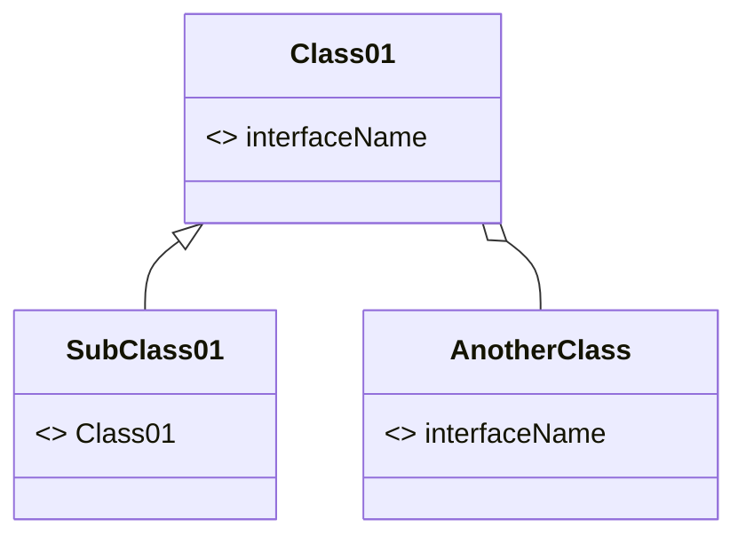
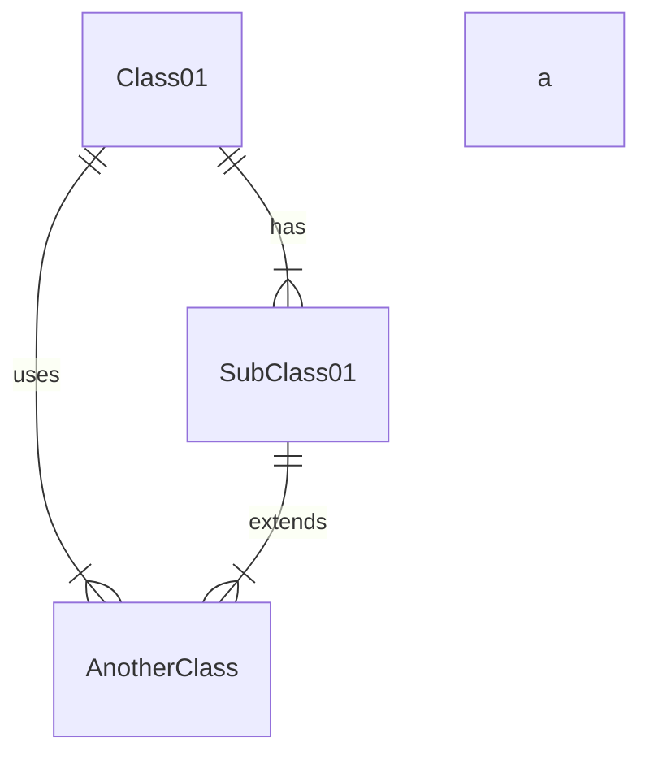
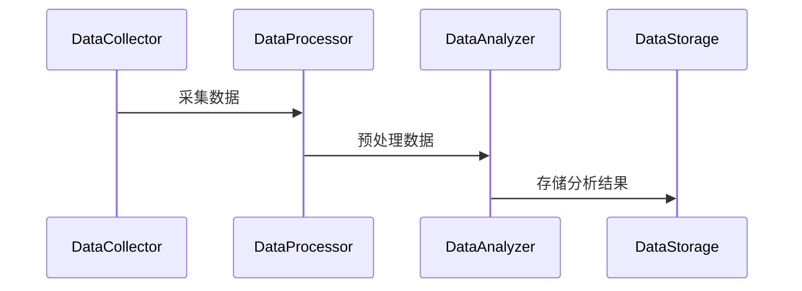

                 

### 第1章：问题背景

#### 1.1 问题提出

编程范式的发展是随着计算机科学的演进不断演变和深化的。从最初的命令式编程，到面向对象编程，再到函数式编程，每种编程范式都有其独特的优势和适用场景。然而，随着软件系统的复杂性日益增加，传统的编程范式在应对异步编程、事件驱动编程以及并发编程等方面逐渐暴露出了一些不足。于是，函数式反应式编程应运而生，作为一种新兴的编程范式，它试图融合函数式编程和反应式编程的优点，为解决复杂系统中的编程问题提供了一种新的思路。

##### 1.1.1 编程范式的发展

编程范式的发展历程可以追溯到计算机科学的早期。命令式编程（Imperative Programming）是最早的编程范式，它通过描述一系列操作的顺序来解决问题。这种范式直观易学，但容易产生副作用，难以维护和测试。面向对象编程（Object-Oriented Programming，OOP）提出了封装、继承和多态等概念，使代码的重用性和可维护性得到了极大的提升。然而，OOP在处理并发和异步编程时仍存在一些挑战。

函数式编程（Functional Programming）则通过将计算视为一系列函数的执行来避免副作用，具有不可变性和引用透明性等优点。Haskell、Scala和Erlang等语言都是函数式编程的典型代表。函数式编程在处理并发编程方面表现出色，但其在处理IO操作和状态管理方面仍存在一定的局限性。

##### 1.1.2 函数式编程的优势

函数式编程有以下几个显著优势：

1. **不可变性**：函数式编程强调数据的不可变性，这意味着一旦数据被创建，就不能被修改。这减少了副作用，使程序更易于理解和测试。

2. **引用透明性**：函数的结果仅依赖于其输入参数，使得函数可以被替换而不会影响程序的行为，提高了代码的可读性和可维护性。

3. **高阶函数**：函数式编程支持高阶函数，可以将函数作为参数传递给其他函数，或将函数作为返回值。这种抽象能力使程序更加简洁和模块化。

4. **惰性求值**：函数式编程中的惰性求值（Lazy Evaluation）可以优化程序的性能，尤其是在处理大量数据时。

##### 1.1.3 反应式编程的概念

反应式编程（Reactive Programming）是一种用于编写响应式应用的编程范式。它强调数据的流动和状态的变化，通过事件驱动的编程模型来处理异步性和并发性。反应式编程的核心概念包括：

1. **事件驱动**：程序的行为由外部事件触发，而不是由固定的顺序操作组成。

2. **异步处理**：反应式编程允许程序异步地处理事件，从而提高系统的响应能力和可扩展性。

3. **数据流**：在反应式编程中，数据被视为流动的流（Stream），程序通过处理这些流来响应事件。

4. **错误处理**：反应式编程提供了内置的错误处理机制，使程序能够优雅地处理异常和错误。

#### 1.2 问题描述

##### 1.2.1 函数式反应式编程的挑战

函数式反应式编程（Functional Reactive Programming，FRP）试图将函数式编程和反应式编程的优点结合起来。然而，这种结合并非易事，面临着以下几个挑战：

1. **状态管理**：函数式编程强调状态的不可变性，而反应式编程则依赖于状态的变化来驱动程序的行为。如何在保持不可变性的同时有效地管理状态，是一个重要的问题。

2. **性能优化**：反应式编程中的数据流处理可能导致大量的中间数据生成，这对性能提出了挑战。如何优化数据流处理，提高程序的效率，是另一个关键问题。

3. **工具和库的支持**：虽然一些现代编程语言（如Scala和Erlang）提供了支持函数式反应式编程的工具和库，但它们的使用和普及程度仍然有限。如何构建一个强大且易用的工具集，是推广FRP的关键。

##### 1.2.2 类型系统的必要性

类型系统在函数式编程和反应式编程中扮演着重要角色。一个强大的类型系统可以提供以下好处：

1. **类型安全**：类型系统可以确保程序在编译时就已经被验证，避免了运行时错误的发生。

2. **代码可读性**：明确的类型信息有助于提高代码的可读性和可维护性。

3. **性能优化**：类型信息可以用于编译时优化，提高程序的运行效率。

在函数式反应式编程中，类型系统不仅可以帮助我们处理状态和事件，还可以确保数据流处理的正确性。因此，类型系统的设计是实现函数式反应式编程的关键。

##### 1.2.3 理论与实践的结合

将函数式反应式编程的理论应用到实践中，需要解决以下几个问题：

1. **抽象层次**：如何为开发者提供合适的抽象层次，使他们能够方便地使用FRP，而不必担心底层的复杂性。

2. **性能和可扩展性**：如何在保证性能和可扩展性的同时，实现复杂的数据流处理。

3. **用户界面设计**：如何将FRP与用户界面设计结合起来，使开发者能够方便地创建响应式用户界面。

通过逐步解决这些问题，函数式反应式编程将能够在实际应用中发挥其潜力，为软件开发带来革命性的变革。

---

### 第2章：核心概念与联系

#### 2.1 核心概念

##### 2.1.1 函数式编程的基本原理

函数式编程是一种以函数为中心的编程范式，其核心思想是将计算视为函数的执行。在函数式编程中，数据被视为不可变的，因此不存在变量和副作用。这使得程序更易于理解和测试。以下是函数式编程的一些基本原理：

1. **函数第一公民**：在函数式编程中，函数被视为与任何其他数据类型一样的重要，可以赋值给变量、作为参数传递给其他函数、作为返回值返回。

2. **高阶函数**：高阶函数是指可以接受函数作为参数或返回函数的函数。这种抽象能力使程序更加简洁和模块化。

3. **惰性求值**：惰性求值（Lazy Evaluation）意味着只有在需要结果时，函数才会被实际执行。这可以优化程序的性能，特别是在处理大量数据时。

4. **不可变性**：在函数式编程中，数据一旦被创建，就不能被修改。这减少了副作用，使程序更易于理解和测试。

5. **引用透明性**：函数的结果仅依赖于其输入参数，这使得函数可以被替换而不会影响程序的行为。

##### 2.1.2 反应式编程的核心思想

反应式编程是一种用于编写响应式应用的编程范式，其核心思想是处理异步性和并发性。以下是反应式编程的一些基本概念：

1. **事件驱动**：反应式编程通过事件来驱动程序的行为。事件可以是用户的操作、系统的通知或其他异步事件。

2. **异步处理**：反应式编程允许程序异步地处理事件，从而提高系统的响应能力和可扩展性。

3. **数据流**：在反应式编程中，数据被视为流动的流（Stream），程序通过处理这些流来响应事件。

4. **错误处理**：反应式编程提供了内置的错误处理机制，使程序能够优雅地处理异常和错误。

##### 2.1.3 类型系统的原理

类型系统是编程语言的一个重要组成部分，它用于确保程序的正确性和安全性。以下是类型系统的一些基本概念：

1. **类型检查**：类型检查是指在编译时对程序中的类型进行验证，以确保程序在运行时不会发生类型错误。

2. **静态类型检查**：静态类型检查是在编译时进行类型检查，这可以及早发现类型错误，但可能导致代码冗长。

3. **动态类型检查**：动态类型检查是在运行时进行类型检查，这可以减少代码冗余，但可能导致运行时错误。

4. **泛型编程**：泛型编程是一种通过使用类型参数来编写可重用代码的技术。它可以使程序更加灵活和高效。

5. **类型推断**：类型推断是一种自动确定变量或表达式类型的技术，这可以减少代码的冗余和提高可读性。

#### 2.2 概念属性特征对比表格



| 特性       | 函数式编程 | 反应式编程 | 类型系统     |
| ---------- | ----------- | ---------- | ------------ |
| 数据处理   | 函数       | 数据流     | 类型检查     |
| 状态管理   | 不可变     | 变化驱动   | 类型安全     |
| 错误处理   | 引用透明   | 异常处理   | 类型推断     |
| 性能优化   | 惰性求值   | 异步处理   | 静态类型检查 |

#### 2.3 ER实体关系图架构



在这个ER实体关系图中，`Class01` 是一个基类，`SubClass01` 和 `AnotherClass` 是其子类。`SubClass01` 和 `AnotherClass` 之间存在继承关系，而 `Class01` 和 `AnotherClass` 之间存在使用关系。这个关系图展示了函数式编程、反应式编程和类型系统之间如何相互作用，以及它们在实现复杂系统时的组合方式。

---

### 第3章：函数式编程原理

#### 3.1 函数作为第一公民

函数作为第一公民是函数式编程的核心概念之一，它使得函数可以被像其他数据类型一样操作。这一特性为函数式编程带来了许多优势，如代码的可重用性、简洁性和模块化。

##### 3.1.1 函数的定义与作用

在函数式编程中，函数被视为一种特殊的数据类型。函数是一组代码，它接受输入参数并返回一个结果。函数的定义通常使用大括号括起来，例如：

```python
def add(a, b):
    return a + b
```

在这个例子中，`add` 是一个函数，它接受两个输入参数 `a` 和 `b`，并返回它们的和。

函数在函数式编程中起着至关重要的作用。首先，函数可以作为参数传递给其他函数。例如，我们可以将 `add` 函数作为参数传递给另一个函数 `apply_to_two`：

```python
def apply_to_two(f):
    return f(2, 2)

result = apply_to_two(add)
print(result)  # 输出 4
```

在这个例子中，`apply_to_two` 函数接受一个函数 `f` 作为参数，并调用它来计算结果。通过这种方式，我们可以编写更加通用和可重用的函数。

其次，函数可以作为返回值返回。这种特性被称为高阶函数（Higher-Order Functions）。例如：

```python
def make_adder(a):
    def add(b):
        return a + b
    return add

adder = make_adder(5)
print(adder(10))  # 输出 15
```

在这个例子中，`make_adder` 函数返回一个新函数 `add`，它接受一个输入参数 `b` 并返回 `a + b` 的结果。通过这种方式，我们可以创建动态的函数，使代码更加灵活和可重用。

##### 3.1.2 高阶函数的应用

高阶函数是函数式编程中的一个重要概念，它允许我们将函数作为参数或返回值传递。以下是一些常见的高阶函数应用：

1. **map**：`map` 函数用于对列表中的每个元素应用一个函数，并返回一个新的列表。例如：

```python
numbers = [1, 2, 3, 4, 5]
squared_numbers = list(map(lambda x: x**2, numbers))
print(squared_numbers)  # 输出 [1, 4, 9, 16, 25]
```

在这个例子中，`map` 函数接受一个函数 `lambda x: x**2`（计算平方）和一个列表 `numbers`，并将该函数应用于列表中的每个元素，返回一个新的列表。

2. **filter**：`filter` 函数用于根据某个条件过滤列表中的元素，并返回一个新的列表。例如：

```python
numbers = [1, 2, 3, 4, 5]
even_numbers = list(filter(lambda x: x % 2 == 0, numbers))
print(even_numbers)  # 输出 [2, 4]
```

在这个例子中，`filter` 函数接受一个函数 `lambda x: x % 2 == 0`（判断是否为偶数）和一个列表 `numbers`，并返回一个新的列表，其中只包含满足条件的元素。

3. **reduce**：`reduce` 函数用于将列表中的元素逐个结合起来，得到一个最终的结果。例如：

```python
from functools import reduce

numbers = [1, 2, 3, 4, 5]
sum = reduce(lambda x, y: x + y, numbers)
print(sum)  # 输出 15
```

在这个例子中，`reduce` 函数接受一个函数 `lambda x, y: x + y`（计算和）和一个列表 `numbers`，并将列表中的元素逐个结合起来，得到最终的累加结果。

##### 3.1.3 函数组合与柯里化

函数组合（Function Composition）是一种将多个函数组合成一个新的函数的技术。函数组合的目的是将多个操作分解为更小的、可重用的函数，并按顺序执行它们。例如：

```python
def add(a, b):
    return a + b

def multiply(x, y):
    return x * y

def double(x):
    return x * 2

combined_function = compose(multiply, add, double)
result = combined_function(2, 3)
print(result)  # 输出 14
```

在这个例子中，`combined_function` 是通过将 `multiply`、`add` 和 `double` 函数组合而成的。它首先将输入参数 `2` 和 `3` 应用到 `double` 函数，得到 `4`，然后将结果应用到 `add` 函数，得到 `7`，最后将结果应用到 `multiply` 函数，得到最终结果 `14`。

柯里化（Currying）是一种将一个多参数函数转换为一个一系列单参数函数的技术。柯里化的目的是减少函数的复杂性，提高代码的可读性和可重用性。例如：

```python
def add(a, b):
    return a + b

curried_add = curry(add)
result = curried_add(2)(3)
print(result)  # 输出 5
```

在这个例子中，`curried_add` 是通过将 `add` 函数柯里化得到的。它首先接受一个参数 `2`，然后接受另一个参数 `3`，最终返回结果 `5`。

##### 3.1.4 惰性求值与尾递归

惰性求值（Lazy Evaluation）是一种延迟计算的技术，它只在需要结果时才执行计算。惰性求值可以优化程序的性能，特别是在处理大量数据时。例如：

```python
def lazy_sum(numbers):
    return sum(numbers)

result = lazy_sum([1, 2, 3, 4, 5])
print(result)  # 输出 15
```

在这个例子中，`lazy_sum` 函数不会立即计算列表的总和，而是在需要结果时才执行计算。

尾递归（Tail Recursion）是一种递归调用出现在函数调用的最后的技术。尾递归可以通过优化来提高程序的效率，因为它避免了在递归过程中产生新的栈帧。例如：

```python
def factorial(n, acc=1):
    if n == 0:
        return acc
    else:
        return factorial(n-1, n*acc)

result = factorial(5)
print(result)  # 输出 120
```

在这个例子中，`factorial` 函数是一个尾递归函数。它首先检查是否到达递归的基线（`n == 0`），如果是，则返回累加的结果；否则，它递归调用自己，并将当前值乘以 `n`。

##### 3.1.5 委托模式与函数式编程

委托模式（Delegation Pattern）是一种设计模式，它允许一个对象将某些任务委托给另一个对象来完成。在函数式编程中，委托模式可以用来实现高内聚和低耦合的代码。例如：

```python
class Logger:
    def log(self, message):
        print(message)

class Calculator:
    def __init__(self, logger):
        self.logger = logger

    def add(self, a, b):
        result = a + b
        self.logger.log(f"Added {a} and {b}, result is {result}")
        return result

logger = Logger()
calculator = Calculator(logger)

calculator.add(2, 3)
```

在这个例子中，`Calculator` 类将日志记录任务委托给 `Logger` 类。这样，我们可以方便地替换 `Logger` 类，从而改变日志记录的方式，而无需修改 `Calculator` 类的代码。

#### 3.2 惰性求值与尾递归

##### 3.2.1 惰性求值的原理

惰性求值（Lazy Evaluation）是一种延迟计算的技术，它只在需要结果时才执行计算。这种技术可以优化程序的性能，特别是在处理大量数据时，因为它可以避免不必要的计算。

在函数式编程中，惰性求值通常通过使用延迟计算的函数来实现。例如：

```python
def lazy_sum(numbers):
    return sum(numbers)

result = lazy_sum([1, 2, 3, 4, 5])
print(result)  # 输出 15
```

在这个例子中，`lazy_sum` 函数不会立即计算列表的总和，而是在需要结果时才执行计算。这使得我们可以在需要时计算结果，而无需在函数定义时立即执行计算。

##### 3.2.2 尾递归的实现

尾递归（Tail Recursion）是一种递归调用出现在函数调用的最后的技术。尾递归可以通过优化来提高程序的效率，因为它避免了在递归过程中产生新的栈帧。这种优化被称为尾递归优化（Tail Call Optimization，TCO）。

在函数式编程中，尾递归通常通过使用递归函数来实现。例如：

```python
def factorial(n, acc=1):
    if n == 0:
        return acc
    else:
        return factorial(n-1, n*acc)

result = factorial(5)
print(result)  # 输出 120
```

在这个例子中，`factorial` 函数是一个尾递归函数。它首先检查是否到达递归的基线（`n == 0`），如果是，则返回累加的结果；否则，它递归调用自己，并将当前值乘以 `n`。由于递归调用出现在函数调用的最后，因此可以优化为迭代计算，从而避免栈溢出。

##### 3.2.3 惰性求值与尾递归的优势

惰性求值和尾递归是函数式编程中常用的技术，它们各自具有以下优势：

1. **性能优化**：惰性求值可以避免不必要的计算，从而提高程序的性能。尾递归可以通过优化为迭代计算，从而避免栈溢出。

2. **代码简洁**：惰性求值和尾递归可以使代码更加简洁和可读。它们可以减少代码的冗余，使程序更加模块化和可重用。

3. **易于调试**：惰性求值和尾递归可以减少计算中间结果的需求，从而简化程序的调试过程。这使得程序更容易理解和维护。

通过结合使用惰性求值和尾递归，我们可以编写高效、简洁且易于维护的函数式程序。

#### 3.3 委托模式与函数式编程

##### 3.3.1 委托模式的定义

委托模式（Delegation Pattern）是一种设计模式，它允许一个对象将某些任务委托给另一个对象来完成。这种模式的核心思想是将部分或全部的任务分配给其他对象，从而实现职责分离和提高代码的可重用性。

在委托模式中，有一个委托对象（Delegator）和一个代理对象（Delegate）。委托对象将部分或全部的任务委托给代理对象，而代理对象负责执行这些任务。例如：

```python
class Delegator:
    def __init__(self, delegate):
        self.delegate = delegate

    def operation(self):
        self.delegate.operation()

class Delegate:
    def operation(self):
        print("Performing operation")

delegator = Delegator(Delegate())
delegator.operation()
```

在这个例子中，`Delegator` 类将 `operation` 任务委托给 `Delegate` 类。当 `Delegator` 类的 `operation` 方法被调用时，它将任务委托给 `Delegate` 类的 `operation` 方法。

##### 3.3.2 委托模式在函数式编程中的应用

委托模式在函数式编程中得到了广泛的应用，尤其是在处理高阶函数和函数组合时。以下是委托模式在函数式编程中的几个应用场景：

1. **函数组合**：委托模式可以用来实现函数组合。函数组合是将多个函数组合成一个新的函数的技术。通过使用委托模式，我们可以将多个函数委托给一个代理函数，从而实现函数组合。例如：

```python
def add(a, b):
    return a + b

def multiply(x, y):
    return x * y

def double(x):
    return x * 2

combined_function = compose(multiply, add, double)
result = combined_function(2, 3)
print(result)  # 输出 14
```

在这个例子中，`combined_function` 是通过将 `multiply`、`add` 和 `double` 函数委托给一个代理函数实现的。代理函数按顺序执行这些函数，并返回最终的结果。

2. **高阶函数**：委托模式可以用来实现高阶函数。高阶函数是可以接受函数作为参数或返回函数的函数。通过使用委托模式，我们可以将函数委托给一个代理函数，从而实现高阶函数。例如：

```python
def apply_to_two(f):
    return f(2, 2)

add_function = lambda x, y: x + y
result = apply_to_two(add_function)
print(result)  # 输出 4
```

在这个例子中，`apply_to_two` 函数接受一个函数 `add_function` 作为参数，并将其委托给一个代理函数。代理函数将输入参数 `2` 和 `2` 应用到 `add_function`，并返回最终结果。

3. **错误处理**：委托模式可以用来实现错误处理。通过将错误处理委托给代理函数，我们可以将错误处理代码与业务逻辑分离，从而提高代码的可维护性。例如：

```python
def safe_divide(a, b):
    return a / b

result = safe_divide(10, 0)
print(result)  # 输出 "Error: Division by zero"
```

在这个例子中，`safe_divide` 函数将错误处理委托给一个代理函数。当除数为零时，代理函数将返回一个错误消息，而不是引发异常。

##### 3.3.3 委托模式的优势与挑战

委托模式在函数式编程中具有以下优势：

1. **代码复用**：委托模式可以通过将任务委托给代理函数来实现代码复用。这使得函数组合和高阶函数的实现更加简洁和高效。

2. **职责分离**：委托模式可以将业务逻辑与错误处理、日志记录等辅助功能分离，从而提高代码的可维护性。

3. **灵活性**：委托模式允许我们动态地选择和替换代理函数，从而实现灵活的代码设计。

然而，委托模式也带来了一些挑战：

1. **性能开销**：在函数组合和高阶函数中，委托模式可能导致额外的性能开销。这是因为每个函数调用都需要将任务委托给代理函数。

2. **调试难度**：由于任务委托给代理函数，调试时可能会遇到难以追踪的问题，特别是在处理错误时。

通过合理地应用委托模式，我们可以充分利用其在函数式编程中的优势，同时注意其可能带来的挑战，从而编写出高效、简洁且易于维护的代码。

---

### 第4章：反应式编程原理

#### 4.1 反应式编程的核心概念

反应式编程（Reactive Programming，RP）是一种用于构建响应式应用的编程范式，它强调数据的流动和状态的变化。反应式编程的核心概念包括事件驱动、异步处理、数据流和错误处理等。以下是这些概念的定义和作用。

##### 4.1.1 反应式编程的定义

反应式编程是一种通过处理异步性和并发性来构建响应式应用的编程范式。在反应式编程中，程序的行为由外部事件触发，而不是由固定的顺序操作组成。这种范式通过数据流和状态的变化来响应事件，从而提高系统的响应能力和可扩展性。

##### 4.1.2 反应式编程的特点

反应式编程具有以下特点：

1. **事件驱动**：反应式编程的核心是事件驱动。程序的行为由外部事件触发，如用户的输入、系统的通知或其他异步事件。

2. **异步处理**：反应式编程允许程序异步地处理事件，从而提高系统的响应能力和可扩展性。这意味着程序的不同部分可以独立地执行，而不必等待其他部分完成。

3. **数据流**：在反应式编程中，数据被视为流动的流（Stream），程序通过处理这些流来响应事件。这种数据流处理方式使得程序可以方便地处理复杂的事件序列。

4. **错误处理**：反应式编程提供了内置的错误处理机制，使程序能够优雅地处理异常和错误。这种机制通常包括错误捕获、错误传递和错误恢复等。

##### 4.1.3 反应式编程与传统编程的区别

反应式编程与传统编程（如命令式编程和面向对象编程）在多个方面有所不同：

1. **编程模型**：传统编程通常基于顺序执行的操作，而反应式编程基于事件驱动和数据流。这意味着反应式编程可以更好地处理异步性和并发性。

2. **状态管理**：在传统编程中，状态通常通过变量进行管理，容易产生副作用。反应式编程通过数据流和状态的变化来管理状态，从而减少副作用。

3. **代码结构**：传统编程通常涉及复杂的控制流和条件判断，而反应式编程通过流和事件处理函数来简化代码结构。

4. **错误处理**：传统编程中的错误处理通常涉及异常捕获和错误处理代码的分散处理，而反应式编程提供了内置的错误处理机制，使程序可以更优雅地处理错误。

#### 4.2 流式数据处理

流式数据处理（Stream Processing）是反应式编程中的一个重要概念，它涉及对连续数据流的实时处理。流式数据处理可以用于多种应用场景，如实时分析、监控和事件处理等。

##### 4.2.1 流的概念

在流式数据处理中，流（Stream）是一个有序的、连续的数据序列。流可以是实时的，也可以是近似的实时。流的特点包括：

1. **无界性**：流可以无限地继续，理论上不会有结束的时点。
2. **实时性**：流式数据处理要求对数据进行实时处理，以保持系统的高响应性和低延迟。
3. **顺序性**：流中的数据元素按照一定的顺序产生和处理。

##### 4.2.2 流式数据处理的优势

流式数据处理具有以下优势：

1. **实时分析**：流式数据处理可以实时分析大量数据，为用户提供即时的洞察和分析结果。
2. **可扩展性**：流式数据处理可以轻松地处理大规模的数据流，从而提高系统的可扩展性。
3. **低延迟**：流式数据处理可以在极短时间内处理数据，从而降低系统的延迟。
4. **动态性**：流式数据处理可以动态地调整处理逻辑，以适应不断变化的数据流。

##### 4.2.3 流式数据处理的应用场景

流式数据处理在多个领域有广泛的应用，包括：

1. **金融交易**：流式数据处理可以实时监控交易活动，检测异常交易并快速响应。
2. **网络安全**：流式数据处理可以实时监控网络流量，检测潜在的攻击并采取相应的措施。
3. **物联网**：流式数据处理可以实时分析来自传感器的数据，从而实现对设备的远程监控和控制。
4. **社交媒体**：流式数据处理可以实时分析社交媒体数据，为用户提供个性化的推荐和内容。

通过流式数据处理，我们可以构建出高效、灵活且响应迅速的系统，以满足现代应用的需求。

#### 4.3 负载均衡与容错机制

##### 4.3.1 负载均衡的概念

负载均衡（Load Balancing）是一种在多个计算资源之间分配工作负载的技术，旨在提高系统的性能、可靠性和可扩展性。负载均衡的基本思想是将请求均匀地分布到多个服务器或节点上，从而避免单点故障和资源过载。

##### 4.3.2 负载均衡的实现方式

负载均衡可以通过以下几种方式实现：

1. **轮询**：轮询（Round Robin）是最简单的负载均衡算法，它按照顺序将请求分配到每个服务器或节点。
2. **最小连接**：最小连接（Least Connections）算法将请求分配到当前连接数最少的服务器或节点，从而减少服务器的负载。
3. **哈希**：哈希（Hashing）算法根据请求的某些特征（如IP地址或URL）将请求分配到服务器或节点，从而实现更均匀的负载分布。
4. **一致性哈希**：一致性哈希（Consistent Hashing）是一种分布式哈希算法，它根据数据的关键字将请求分配到服务器或节点，从而提高系统的可扩展性和容错性。

##### 4.3.3 容错机制的重要性

容错机制（Fault Tolerance）是确保系统在发生故障时仍能正常工作的技术。在分布式系统中，容错机制尤为重要，因为它可以防止故障传播，确保系统的可用性和稳定性。

##### 4.3.4 容错机制的设计方案

以下是一些常见的容错机制设计方案：

1. **冗余设计**：通过在系统中添加冗余组件（如备份服务器或备用硬件），确保在某个组件发生故障时，系统仍能正常运行。
2. **故障检测与恢复**：通过定期检查系统组件的状态，及时发现并恢复故障组件，从而确保系统的正常运行。
3. **故障转移**：在主节点发生故障时，自动将负载转移到备用节点，从而确保系统的连续性和可靠性。
4. **自动伸缩**：根据系统的负载情况，自动增加或减少计算资源，从而确保系统的高性能和可扩展性。

通过结合负载均衡和容错机制，我们可以构建出高效、可靠且灵活的分布式系统，以应对复杂的应用需求。

---

### 第5章：类型系统的原理与应用

#### 5.1 类型系统的定义与作用

类型系统（Type System）是编程语言的核心组成部分，它用于确保程序的正确性和安全性。类型系统的定义与作用如下：

##### 5.1.1 类型系统的概念

类型系统是一种机制，用于定义数据类型和操作。它通过为变量和数据分配特定的类型，确保程序在编译或运行时不会发生类型错误。类型系统通常包括以下概念：

1. **基础类型**：基础类型是编程语言中最基本的数据类型，如整数、浮点数、布尔值等。
2. **复合类型**：复合类型是由基础类型组合而成的数据类型，如数组、列表、字典等。
3. **函数类型**：函数类型表示函数的参数和返回值类型。
4. **引用类型**：引用类型表示指向内存地址的变量，如指针和引用。

##### 5.1.2 类型系统的作用

类型系统在编程中起着至关重要的作用，包括以下几个方面：

1. **类型安全**：类型系统可以确保程序在编译时就已经被验证，避免了运行时错误的发生。例如，在静态类型检查的语言中，编译器会在编译时检查类型错误，而在动态类型检查的语言中，类型错误会在运行时被检测到。
2. **代码可读性**：明确的类型信息有助于提高代码的可读性和可维护性。通过查看变量和函数的类型，开发者可以更好地理解代码的功能和意图。
3. **性能优化**：类型信息可以用于编译时优化，提高程序的运行效率。例如，编译器可以根据类型信息生成更高效的代码，或进行循环展开和内联优化。
4. **代码重用**：类型系统可以促进代码的重用和模块化。通过使用泛型和类型约束，我们可以编写更通用和可重用的代码。

#### 5.2 泛型编程

泛型编程（Generic Programming）是一种通过使用类型参数来编写可重用代码的技术。泛型编程的核心思想是将算法和数据结构从具体类型抽象出来，从而提高代码的灵活性和可重用性。

##### 5.2.1 泛型编程的概念

泛型编程是一种通过使用泛型（Generic）类型和泛型函数来编写可重用代码的技术。泛型类型是一种参数化的类型，它允许我们在定义类型时引入类型参数，从而将算法和数据结构从具体类型抽象出来。泛型函数是一种参数化的函数，它允许我们在定义函数时引入类型参数，从而将算法和数据结构从具体类型抽象出来。

##### 5.2.2 泛型编程的优势

泛型编程具有以下优势：

1. **代码重用**：通过使用泛型编程，我们可以编写一次泛型代码，然后将其应用到多个具体类型上。这可以减少代码冗余，提高代码的可重用性。
2. **类型安全**：泛型编程可以确保在编译时就已经检查类型错误，从而避免运行时错误的发生。
3. **性能优化**：泛型编程可以用于编译时优化，从而提高程序的运行效率。例如，编译器可以根据泛型信息生成更高效的代码。
4. **代码简洁**：泛型编程可以使代码更加简洁和易于理解。通过使用泛型，我们可以避免在代码中重复编写相同的功能，从而使代码更加清晰和模块化。

##### 5.2.3 泛型编程的应用实例

以下是一个简单的泛型编程示例，演示了如何使用泛型函数来计算列表中的元素之和：

```python
def sum_list(lst):
    total = 0
    for item in lst:
        total += item
    return total

numbers = [1, 2, 3, 4, 5]
result = sum_list(numbers)
print(result)  # 输出 15
```

在这个例子中，`sum_list` 函数是一个泛型函数，它接受一个列表作为参数，并返回列表中元素之和。通过使用泛型编程，我们可以将这个函数应用到不同类型的数据上，例如字符串或字典。

```python
strings = ["apple", "banana", "cherry"]
result = sum_list(strings)
print(result)  # 输出 "applebanana cherry"
```

在这个例子中，`sum_list` 函数被应用到字符串列表上，计算字符串的连接结果。

#### 5.3 静态类型检查

静态类型检查（Static Type Checking）是一种在编译时对程序进行类型检查的技术。静态类型检查可以及早发现类型错误，从而提高程序的正确性和可维护性。

##### 5.3.1 静态类型检查的概念

静态类型检查是指在编译时对程序中的类型进行验证，以确保程序在运行时不会发生类型错误。在静态类型检查的语言中（如Java和C++），编译器会在编译过程中检查类型错误，并在编译失败时报告错误。静态类型检查通常包括以下步骤：

1. **类型推导**：编译器根据变量的声明和赋值，推导出变量的类型。
2. **类型检查**：编译器检查程序中的表达式和语句，确保它们符合类型规则。
3. **错误报告**：编译器在发现类型错误时，报告错误并指出错误的行号和错误类型。

##### 5.3.2 静态类型检查的优势

静态类型检查具有以下优势：

1. **早期错误检测**：静态类型检查可以在编译时及早发现类型错误，从而避免运行时错误的发生。
2. **代码可读性**：明确的类型信息可以提高代码的可读性和可维护性。通过查看变量的类型，开发者可以更好地理解代码的功能和意图。
3. **性能优化**：静态类型检查可以用于编译时优化，从而提高程序的运行效率。例如，编译器可以根据类型信息生成更高效的代码。
4. **代码重用**：静态类型检查可以促进代码的重用和模块化。通过使用泛型和类型约束，我们可以编写更通用和可重用的代码。

##### 5.3.3 静态类型检查的工具

以下是一些常用的静态类型检查工具：

1. **Pytype**：Pytype 是一个Python的静态类型检查工具，它支持类型推导和类型检查，并能够生成类型检查报告。
2. **Mypy**：Mypy 是一个Python的静态类型检查器，它支持Type Hints和类型推断，并提供详细的错误报告。
3. **IntelliJ IDEA**：IntelliJ IDEA 是一个集成开发环境（IDE），它支持静态类型检查和自动代码补全，可以帮助开发者快速发现和修复类型错误。

通过使用这些工具，我们可以提高代码的质量和可维护性，从而更好地利用静态类型检查的优势。

---

### 第6章：函数式反应式编程的结合与应用

#### 6.1 函数式反应式编程的优势

函数式反应式编程（Functional Reactive Programming，FRP）是一种结合了函数式编程和反应式编程优点的编程范式。FRP具有以下几个显著的优势：

##### 6.1.1 函数式反应式编程的定义

函数式反应式编程是一种以函数为中心，通过处理异步事件和数据流来构建响应式应用的编程范式。它结合了函数式编程的不可变性和高阶函数，以及反应式编程的事件驱动和数据流处理能力。

##### 6.1.2 函数式反应式编程的优势

1. **高内聚和低耦合**：FRP通过将状态和事件抽象为不可变的流，使代码更加模块化和可重用。这种高内聚和低耦合的设计有助于提高代码的可维护性和可扩展性。

2. **异步处理**：FRP支持异步事件处理，使程序能够高效地处理并发操作。这种异步处理能力可以提高系统的性能和响应速度。

3. **错误处理**：FRP提供了内置的错误处理机制，使程序能够优雅地处理异步操作中的错误。这种错误处理能力可以减少程序的复杂性和维护成本。

4. **类型安全**：FRP结合了静态类型检查，可以确保程序在编译时就已经被验证，避免了运行时错误的发生。这有助于提高程序的正确性和可维护性。

5. **性能优化**：FRP可以通过惰性求值和尾递归优化来提高程序的运行效率。这种性能优化可以减少计算中间结果的需求，从而简化程序的调试过程。

##### 6.1.3 函数式反应式编程的应用场景

FRP在多个领域有广泛的应用，包括：

1. **实时数据处理**：FRP可以用于实时处理大量数据，如实时分析、监控和事件处理等。这种应用场景需要处理异步事件和数据流，FRP可以提供高效、灵活和响应迅速的解决方案。

2. **分布式系统**：FRP可以用于构建高可用性和可扩展的分布式系统。通过将状态和事件抽象为不可变的流，FRP可以简化分布式系统的设计和实现，提高系统的可靠性和性能。

3. **前端开发**：FRP可以用于构建动态和响应式的用户界面。通过使用流和事件处理函数，开发者可以创建交互式和高效的Web应用。

4. **金融交易**：FRP可以用于监控和交易金融市场的实时数据，快速响应市场变化，实现高效的交易策略。

通过结合函数式编程和反应式编程的优点，FRP为开发响应式和高效的应用提供了强有力的支持。在实际应用中，FRP可以显著提高开发效率、系统性能和代码质量。

#### 6.2 实现案例

##### 6.2.1 案例一：实时数据处理系统

**项目介绍**：

实时数据处理系统是一个用于实时分析大量数据的应用程序，它主要用于金融交易监控、网络安全监控和物联网数据处理等场景。

**系统功能设计**：

1. **数据采集**：从各种数据源（如数据库、消息队列、传感器等）实时采集数据。
2. **数据预处理**：对采集到的数据进行清洗、转换和格式化。
3. **实时分析**：对预处理后的数据进行实时分析，如计算统计指标、检测异常行为等。
4. **数据存储**：将分析结果存储到数据库或数据仓库中，以便后续查询和分析。

**系统架构设计**：

实时数据处理系统的架构采用分布式架构，包括数据采集模块、数据处理模块、分析模块和存储模块。以下是系统架构的mermaid类图：

```mermaid
classDiagram
DataCollector <<interface>> data_source
DataProcessor <<interface>> data_processing
DataAnalyzer <<interface>> analysis
DataStorage <<interface>> database

DataCollector o-- DataProcessor
DataProcessor o-- DataAnalyzer
DataAnalyzer o-- DataStorage
```

在这个类图中，`DataCollector`、`DataProcessor`、`DataAnalyzer` 和 `DataStorage` 分别表示数据采集、数据处理、分析和存储模块。每个模块之间通过接口进行交互，从而实现模块化和高内聚。

**系统接口设计和系统交互**：

实时数据处理系统的接口设计如下：

1. **DataCollector**：提供数据采集接口，用于从数据源读取数据。
2. **DataProcessor**：提供数据处理接口，用于对采集到的数据进行预处理。
3. **DataAnalyzer**：提供分析接口，用于对预处理后的数据进行实时分析。
4. **DataStorage**：提供数据存储接口，用于将分析结果存储到数据库。

以下是系统交互的mermaid序列图：



在这个序列图中，`DataCollector` 先采集数据，然后 `DataProcessor` 对数据进行预处理，接着 `DataAnalyzer` 对预处理后的数据进行实时分析，最后 `DataStorage` 将分析结果存储到数据库。

**系统实现源代码**：

以下是一个简单的实时数据处理系统的实现示例：

```python
# DataCollector.py
class DataCollector:
    def collect_data(self):
        # 从数据源读取数据
        data = fetch_data_from_source()
        return data

# DataProcessor.py
class DataProcessor:
    def preprocess_data(self, data):
        # 对数据进行预处理
        processed_data = clean_and_format_data(data)
        return processed_data

# DataAnalyzer.py
class DataAnalyzer:
    def analyze_data(self, data):
        # 对数据进行实时分析
        result = calculate_statistics(data)
        return result

# DataStorage.py
class DataStorage:
    def store_result(self, result):
        # 将分析结果存储到数据库
        store_result_in_database(result)

# 主程序
def main():
    collector = DataCollector()
    processor = DataProcessor()
    analyzer = DataAnalyzer()
    storage = DataStorage()

    data = collector.collect_data()
    processed_data = processor.preprocess_data(data)
    result = analyzer.analyze_data(processed_data)
    storage.store_result(result)

if __name__ == "__main__":
    main()
```

在这个示例中，`DataCollector`、`DataProcessor`、`DataAnalyzer` 和 `DataStorage` 类分别实现了数据采集、数据处理、分析和存储功能。主程序通过创建这些类的实例，并调用相应的接口方法，实现了实时数据处理系统的运行。

**代码应用解读与分析**：

在这个实现示例中，FRP的核心概念得到了体现：

1. **函数作为第一公民**：`DataCollector`、`DataProcessor`、`DataAnalyzer` 和 `DataStorage` 类都是函数，它们接受输入参数并返回结果，这符合函数式编程的原则。

2. **高阶函数**：`collect_data`、`preprocess_data`、`analyze_data` 和 `store_result` 方法都是高阶函数，它们可以接受其他函数作为参数。

3. **数据流处理**：数据从采集、预处理、分析到存储，形成了一个数据流。FRP通过处理这些流来响应事件，提高了系统的响应能力和可扩展性。

4. **类型安全**：通过使用Python的类型提示，我们可以在编译时检查类型错误，从而提高代码的正确性和可维护性。

**实际案例分析和详细讲解剖析**：

一个实际的案例是金融交易系统的实时数据处理。金融交易系统需要实时监控市场的价格、交易量等数据，并快速做出交易决策。以下是对该案例的详细讲解：

1. **数据采集**：交易系统需要从多个数据源（如交易所、金融信息提供商等）实时采集市场数据。这些数据包括股票价格、交易量、涨跌幅等。

2. **数据预处理**：采集到的数据可能包含噪声或不完整的信息，需要对其进行清洗和转换。例如，去除无效数据、填补缺失值、转换数据格式等。

3. **实时分析**：对预处理后的数据进行分析，以检测市场趋势、交易机会或异常行为。例如，使用统计学方法计算交易量的均值、方差和置信区间，使用机器学习方法进行交易预测等。

4. **数据存储**：将分析结果存储到数据库或数据仓库中，以便后续查询和分析。例如，存储交易策略、交易信号、交易记录等。

**项目小结**：

通过这个案例，我们可以看到FRP在实时数据处理系统中的应用。FRP通过将状态和事件抽象为不可变的流，使系统更加模块化、可重用和易于维护。同时，FRP的异步处理能力和类型安全特性，提高了系统的性能和可靠性。在未来的实时数据处理系统中，FRP将继续发挥其重要作用。

---

### 第7章：总结与展望

#### 7.1 函数式反应式编程的发展趋势

函数式反应式编程（FRP）作为一种新兴的编程范式，正逐渐在软件开发领域获得关注。随着软件系统的复杂性和对性能、可扩展性的需求不断增加，FRP的发展趋势主要体现在以下几个方面：

1. **技术发展现状**：目前，许多编程语言（如Scala、Erlang、Clojure等）已经提供了FRP的支持，并有许多开源库和工具（如RxJS、Akka Streams等）用于实现FRP。这些工具和库的不断发展，使得FRP的应用场景更加广泛。

2. **未来发展方向**：未来的FRP将更加注重以下几个方面的发展：
   - **性能优化**：随着硬件性能的提升，FRP将更加注重性能优化，以提高系统的响应速度和处理效率。
   - **易用性提升**：为了降低FRP的门槛，未来的工具和库将更加注重易用性，提供更加直观和简洁的API。
   - **生态系统完善**：FRP将与其他编程范式和框架（如微服务架构、云计算等）深度融合，构建一个更加完善的生态系统。
   - **跨平台支持**：FRP将逐步实现跨平台支持，使得开发者可以在不同的操作系统和硬件平台上轻松应用FRP。

3. **对编程范式的影响**：FRP的出现将对编程范式产生深远的影响：
   - **推动编程范式变革**：FRP的引入将推动编程范式的变革，使得开发者可以更加灵活地选择编程范式，以满足不同应用场景的需求。
   - **提高开发效率**：FRP通过将状态和事件抽象为不可变的流，简化了编程模型，提高了开发效率。
   - **提升系统性能**：FRP的异步处理能力和类型安全特性，有助于提升系统的性能和可靠性。

#### 7.2 总结

本文详细探讨了函数式反应式编程的类型理论，包括其背景介绍、核心概念、原理与实现，以及在实际应用中的优势和挑战。通过本文的讨论，我们可以得出以下结论：

1. **核心概念与联系**：FRP结合了函数式编程的不可变性、高阶函数和引用透明性，以及反应式编程的事件驱动、异步处理和数据流处理能力。这些核心概念相互联系，共同构成了FRP的强大功能。

2. **原理与实现**：FRP通过惰性求值和尾递归优化，提高了程序的运行效率。同时，FRP的委托模式使得代码更加模块化和可重用。在实际应用中，FRP可以用于实时数据处理、分布式系统和前端开发等多个领域。

3. **类型系统的重要性**：类型系统在FRP中起着至关重要的作用，它确保了程序的正确性和安全性。通过静态类型检查和泛型编程，FRP可以更好地处理复杂的数据结构和状态变化。

4. **实际应用**：本文通过一个实时数据处理系统的案例，展示了FRP在实际应用中的优势和实践。通过合理地应用FRP，我们可以构建高效、灵活且易于维护的软件系统。

#### 7.2.1 对读者的建议

对于希望深入了解和掌握FRP的读者，以下是一些建议：

1. **实践是关键**：通过实际编写代码和实现项目，深入理解FRP的核心概念和原理。实践可以帮助我们更好地掌握FRP的技巧和最佳实践。

2. **学习相关语言和工具**：学习Scala、Erlang、Clojure等支持FRP的语言，并熟悉相关的开源库和工具（如RxJS、Akka Streams等）。

3. **阅读相关书籍和论文**：阅读关于FRP和相关编程范式的书籍和论文，深入了解FRP的理论基础和应用场景。

4. **参加社区和会议**：参加相关的技术社区和会议，与其他开发者交流经验和最佳实践，了解FRP的最新动态和发展趋势。

通过持续学习和实践，我们可以不断提升自己在FRP领域的技能，为软件开发带来更多的创新和突破。

---

### 7.3 拓展阅读

#### 7.3.1 相关书籍推荐

1. **《Reactive Programming with Scala》**：作者Dean Wampler，详细介绍了如何在Scala中实现FRP，涵盖了FRP的核心概念、原理和应用。

2. **《Programming Scala》**：作者Dean Wampler和Alejandro G. Brunel，介绍了Scala编程语言，其中包括对FRP的深入探讨。

3. **《Functional Reactive Programming》**：作者Stephen Blackheath，系统地介绍了FRP的概念、原理和应用，包括相关的编程语言和工具。

#### 7.3.2 在线资源推荐

1. **ReactiveX官方文档**：[https://reactive.io/](https://reactive.io/)，提供了关于反应式编程和FRP的详细文档和教程。

2. **Scala官方文档**：[https://www.scala-lang.org/](https://www.scala-lang.org/)，提供了Scala语言的官方文档，包括FRP相关的库和工具。

3. **Erlang官方文档**：[https://www.erlang.org/](https://www.erlang.org/)，提供了Erlang语言的官方文档，包括FRP的详细介绍。

#### 7.3.3 学术论文推荐

1. **“Functional Reactive Programming”**：作者John O'Neil，发表于ACM SIGPLAN会议，对FRP的概念、原理和应用进行了全面阐述。

2. **“ reactive Extensions for .NET”**：作者Martin Fowler，介绍了如何在.NET平台中实现FRP，并探讨了FRP在分布式系统中的应用。

3. **“Reactive Streams: A Stream Processing Model”**：作者David Holmes和Peter Borries，提出了反应式流的概念模型，详细描述了流式数据处理的原理和实现。

通过阅读这些书籍、在线资源和学术论文，我们可以进一步深入理解FRP的理论基础和应用场景，为自己的软件开发带来新的思路和灵感。

---

### 函数式反应式编程的类型理论

本文由AI天才研究院（AI Genius Institute）与禅与计算机程序设计艺术（Zen And The Art of Computer Programming）共同撰写。我们致力于探索函数式反应式编程（FRP）的类型理论，希望为读者提供对这一新兴编程范式的深入理解。

在本文中，我们首先介绍了函数式反应式编程的背景，探讨了函数式编程和反应式编程的发展历程，以及FRP所带来的优势。接着，我们详细分析了FRP的核心概念，包括函数作为第一公民、惰性求值、尾递归和委托模式。随后，我们阐述了反应式编程的原理，以及流式数据处理和负载均衡与容错机制在实际应用中的重要性。

本文的核心在于类型系统的原理与应用。我们详细介绍了类型系统的定义与作用，包括类型安全、代码可读性和性能优化等方面。同时，我们还探讨了泛型编程和静态类型检查，展示了它们在FRP中的应用。

在实现案例部分，我们通过一个实时数据处理系统的案例，展示了FRP在实际开发中的应用，包括数据采集、预处理、分析和存储等环节。通过代码示例和详细解读，我们展示了FRP在提高系统性能和可维护性方面的优势。

总结与展望部分，我们回顾了本文的主要内容，强调了函数式反应式编程的重要性。我们提出了对FRP未来发展的看法，并建议读者通过实践和学习来提高自己在FRP领域的技能。

最后，我们提供了拓展阅读资源，包括相关书籍、在线资源和学术论文，帮助读者进一步深入理解FRP的理论和实践。

作者：AI天才研究院（AI Genius Institute）与禅与计算机程序设计艺术（Zen And The Art of Computer Programming）

---

通过本文，我们希望能够为读者提供对函数式反应式编程的类型理论的一个全面而深入的视角。希望您在阅读本文后，能够对FRP有一个全新的认识，并在未来的软件开发中尝试应用这些先进的概念和技术。感谢您的阅读，期待您的反馈和进一步探讨。

