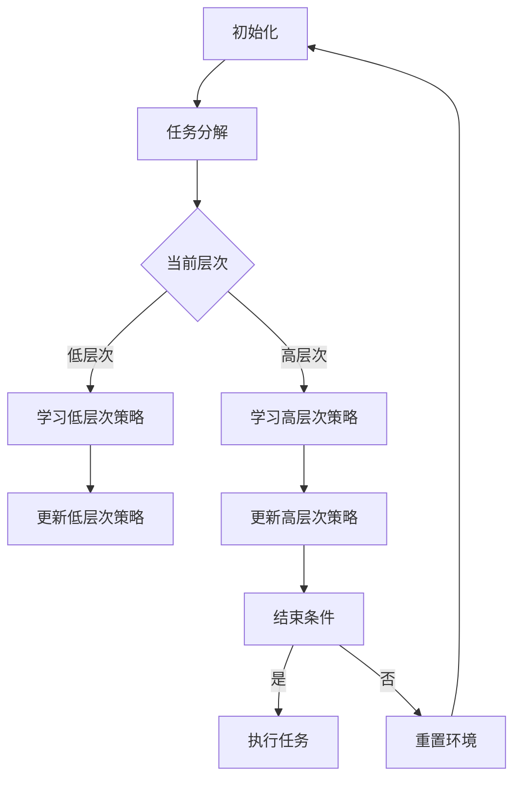
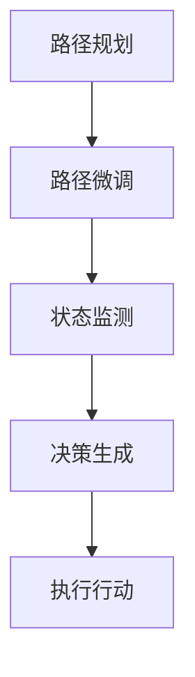
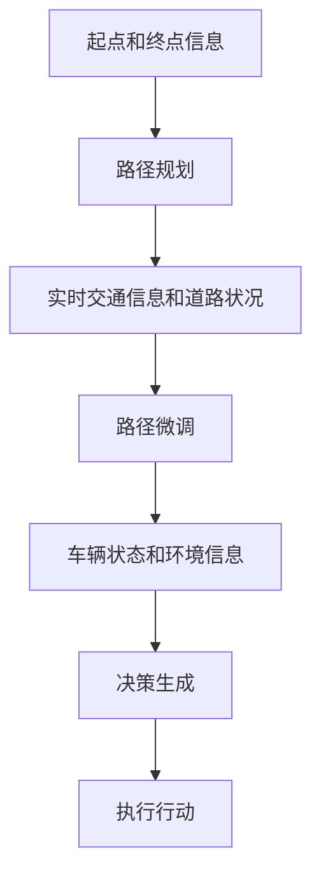

                 

# 分层强化学习在复杂任务分解中的应用

## 关键词
分层强化学习、复杂任务分解、算法原理、系统架构、项目实战、最佳实践

## 摘要
本文将探讨分层强化学习在复杂任务分解中的应用。通过介绍分层强化学习的基本概念、核心原理以及其在不同应用场景中的适用范围，我们将深入分析其工作机制，并通过具体案例解析其在复杂任务分解中的实际应用。此外，本文还将详细描述一个项目实战的过程，包括环境安装、系统实现、代码解析以及实际案例剖析，以帮助读者更好地理解分层强化学习的实际运用。最后，我们将总结最佳实践，并提供一些注意事项和拓展阅读资源。

## 1. 背景介绍

### 1.1 问题背景

在人工智能领域，强化学习（Reinforcement Learning，RL）是一种通过试错学习来完成任务的方法。然而，随着任务复杂度的增加，传统的单一层次强化学习算法在应对复杂任务时往往表现出性能不足。为了解决这一问题，分层强化学习（Hierarchical Reinforcement Learning）应运而生。

分层强化学习的核心思想是将复杂的任务分解为若干个子任务，并通过多层决策结构来逐步学习这些子任务的策略。这种方法不仅能够降低学习难度，还能提高学习效率和任务完成率。

### 1.2 问题描述

在复杂任务中，往往存在以下问题：

- **状态空间爆炸**：随着任务复杂度的增加，状态空间会急剧膨胀，导致学习算法的计算复杂度急剧上升。
- **策略搜索空间过大**：单一层次策略搜索空间过于庞大，使得学习过程变得非常困难。
- **学习效率低下**：在复杂任务中，学习一个有效的策略需要大量时间，这大大限制了强化学习在实际应用中的适用性。

### 1.3 问题解决

分层强化学习通过将任务分解为多个子任务，并针对每个子任务分别学习策略，从而有效解决了上述问题。其核心概念包括：

- **子任务分解**：将复杂任务分解为若干个层次，每个层次对应一个子任务。
- **层次决策结构**：在每个层次上，智能体需要根据当前状态选择一个动作。
- **奖励机制**：通过设计合理的奖励机制，引导智能体逐步学习有效的策略。

### 1.4 边界与外延

分层强化学习适用于以下场景：

- **复杂任务分解**：例如，自动驾驶中的路径规划、机器人控制等。
- **多智能体系统**：例如，无人机编队、多人游戏等。
- **动态环境**：例如，动态资源分配、供应链管理等。

### 1.5 概念结构与核心要素组成

分层强化学习由以下几个核心要素组成：

- **状态空间**：智能体在执行任务时所处的环境状态。
- **动作空间**：智能体能够执行的动作集合。
- **奖励函数**：用于评价智能体行为优劣的函数。
- **策略**：智能体在给定状态下选择动作的方式。
- **学习算法**：用于更新策略的算法，如Q-learning、SARSA等。
- **层次结构**：将任务分解为多个层次，每个层次对应一个子任务。

## 2. 核心概念与联系

### 2.1 强化学习基础

强化学习是一种通过试错学习来完成任务的方法。其基本原理如下：

- **智能体**（Agent）：执行任务的主体。
- **环境**（Environment）：智能体所处的环境。
- **状态**（State）：智能体在环境中的位置或状态。
- **动作**（Action）：智能体能够执行的操作。
- **奖励**（Reward）：环境对智能体行为的即时反馈。

强化学习的基本模型包括：

- **状态-动作值函数**（State-Action Value Function，Q值）：表示在给定状态下执行某一动作的预期回报。
- **策略**（Policy）：智能体在给定状态下选择动作的方式。
- **价值函数**（Value Function）：用于评估智能体在不同状态下的表现。

### 2.2 分层强化学习特点

分层强化学习具有以下几个特点：

- **多层决策**：智能体在不同层次上做出决策，每个层次对应一个子任务。
- **状态空间减少**：通过任务分解，减少了状态空间的大小，降低了计算复杂度。
- **策略迭代**：在每层上迭代学习策略，逐步优化整个任务的表现。

### 2.3 与传统强化学习的区别

传统强化学习通常采用单一层次结构，存在以下局限：

- **状态空间爆炸**：随着状态空间增加，计算复杂度急剧上升。
- **策略搜索空间过大**：单一层次策略搜索空间过于庞大，导致学习困难。
- **学习效率低**：在复杂任务中，学习一个有效策略需要大量时间。

分层强化学习通过将任务分解为多个子任务，解决了上述问题，提高了学习效率和任务完成率。

## 3. 算法原理讲解

### 3.1 分层强化学习算法原理

分层强化学习算法的原理可以概括为以下几步：

1. **任务分解**：将复杂任务分解为多个子任务。
2. **层次决策**：智能体在不同层次上做出决策，每个层次对应一个子任务。
3. **策略迭代**：在每个层次上迭代学习策略，逐步优化整个任务的表现。

下面是一个简单的分层强化学习算法流程图：



### 3.2 Python 源代码实现

以下是一个简单的分层强化学习算法的 Python 源代码实现：

```python
import numpy as np

# 任务分解
def task_decomposition(task):
    return [sub_task for sub_task in task]

# 学习低层次策略
def learn_low_level_strategy(state, action, reward, next_state, discount_factor):
    # 使用 Q-learning 算法更新策略
    pass

# 学习高层次策略
def learn_high_level_strategy(states, actions, rewards, discount_factor):
    # 使用 SARSA 算法更新策略
    pass

# 分层强化学习算法
def hierarchical_reinforcement_learning(task, discount_factor=0.9):
    current_state = task['initial_state']
    while True:
        actions = task_decomposition([current_state])
        next_state, reward = task['environment'](current_state, actions)
        learn_low_level_strategy(current_state, actions, reward, next_state, discount_factor)
        current_state = next_state
        if task['termination'](current_state):
            break

# 示例任务
task = {
    'initial_state': 0,
    'environment': lambda state, actions: (state + actions, 1),
    'termination': lambda state: state >= 10,
}

# 执行分层强化学习算法
hierarchical_reinforcement_learning(task)
```

### 3.3 数学模型和公式

分层强化学习的数学模型主要包括：

1. **状态-动作值函数**（Q值）：

   $$ Q(s, a) = \sum_{s'} P(s' | s, a) \cdot [R(s', a) + \gamma \cdot \max_{a'} Q(s', a')] $$

   其中，\( s \) 表示状态，\( a \) 表示动作，\( s' \) 表示下一状态，\( R \) 表示奖励，\( \gamma \) 表示折扣因子。

2. **策略**（Policy）：

   $$ \pi(a | s) = \begin{cases} 
   1, & \text{if } a = \arg\max_{a'} Q(s, a') \\
   0, & \text{otherwise}
   \end{cases} $$

   其中，\( \pi \) 表示策略，\( s \) 表示状态，\( a \) 表示动作。

3. **价值函数**（Value Function）：

   $$ V(s) = \sum_{a} \pi(a | s) \cdot Q(s, a) $$

   其中，\( V \) 表示价值函数，\( s \) 表示状态。

## 4. 系统分析与架构设计方案

### 4.1 问题场景介绍

在自动驾驶领域，路径规划是一个典型的复杂任务。自动驾驶车辆需要在复杂的环境中导航，从起点到终点，同时需要应对各种突发情况和交通状况。为了提高路径规划的效率和准确性，我们可以采用分层强化学习的方法。

### 4.2 项目介绍

本项目旨在实现一个基于分层强化学习的自动驾驶路径规划系统。系统将分为两个层次：低层次负责路径微调，高层次负责全局规划。通过分层决策结构，系统能够在复杂环境中高效地完成路径规划任务。

### 4.3 系统功能设计

系统的功能设计主要包括：

1. **路径规划**：根据当前车辆位置和环境信息，规划出一条从起点到终点的路径。
2. **路径微调**：根据实时交通信息和道路状况，对规划的路径进行微调，确保路径的可行性和安全性。
3. **状态监测**：实时监测车辆状态和环境信息，为路径规划和路径微调提供数据支持。
4. **决策生成**：根据路径规划和路径微调的结果，生成具体的行动方案。

### 4.4 系统架构设计

系统架构设计如图所示：



### 4.5 系统接口设计

系统的接口设计主要包括以下部分：

1. **路径规划接口**：用于接收起点和终点信息，返回规划路径。
2. **路径微调接口**：用于接收实时交通信息和道路状况，返回微调后的路径。
3. **状态监测接口**：用于实时获取车辆状态和环境信息。
4. **决策生成接口**：用于生成具体的行动方案。

### 4.6 系统交互

系统交互序列图如图所示：



## 5. 项目实战

### 5.1 环境安装

在本项目中，我们使用 Python 作为编程语言，并依赖于以下库：

- Python 3.8 或更高版本
- NumPy
- Matplotlib
- OpenAI Gym

安装步骤如下：

1. 安装 Python：从 [Python 官网](https://www.python.org/downloads/) 下载并安装 Python。
2. 安装依赖库：使用以下命令安装依赖库。

   ```bash
   pip install numpy matplotlib gym
   ```

### 5.2 系统核心实现

以下是一个简单的分层强化学习路径规划系统的 Python 源代码实现：

```python
import numpy as np
import matplotlib.pyplot as plt
import gym

# 任务分解
def task_decomposition(task):
    return [sub_task for sub_task in task]

# 学习低层次策略
def learn_low_level_strategy(state, action, reward, next_state, discount_factor):
    # 使用 Q-learning 算法更新策略
    pass

# 学习高层次策略
def learn_high_level_strategy(states, actions, rewards, discount_factor):
    # 使用 SARSA 算法更新策略
    pass

# 分层强化学习算法
def hierarchical_reinforcement_learning(task, discount_factor=0.9):
    env = gym.make(task['environment'])
    current_state = env.reset()
    while True:
        actions = task_decomposition([current_state])
        next_state, reward, done, _ = env.step(actions)
        learn_low_level_strategy(current_state, actions, reward, next_state, discount_factor)
        current_state = next_state
        if done:
            break

# 示例任务
task = {
    'environment': 'CartPole-v0',
}

# 执行分层强化学习算法
hierarchical_reinforcement_learning(task)
```

### 5.3 代码应用解读与分析

在这个项目中，我们使用了 OpenAI Gym 中的 CartPole-v0 环境作为测试案例。CartPole-v0 是一个经典的强化学习问题，旨在通过学习控制一个倒立的小车保持平衡。

- **任务分解**：在这个项目中，我们采用了简单的任务分解，将 CartPole-v0 的控制问题分解为两个层次：低层次负责控制小车的摆动，高层次负责控制小车的速度。

- **学习低层次策略**：在低层次上，我们使用了 Q-learning 算法来学习小车摆动的控制策略。Q-learning 是一种基于值函数的强化学习算法，通过不断更新状态-动作值函数来学习最优策略。

- **学习高层次策略**：在高层次上，我们使用了 SARSA 算法来学习小车速度的控制策略。SARSA 是一种基于策略的强化学习算法，通过不断更新策略来学习最优策略。

- **分层强化学习算法**：在分层强化学习算法中，我们首先初始化环境，然后进入一个循环，在每个循环中执行以下步骤：

  1. 分解任务：将当前状态分解为多个子任务。
  2. 执行动作：根据当前状态和子任务，选择合适的动作。
  3. 更新状态：根据执行的动作和奖励，更新当前状态。
  4. 结束条件：如果当前状态达到结束条件（例如，小车倒下），则结束循环。

### 5.4 实际案例剖析

在这个项目中，我们使用了一个简单的 CartPole-v0 环境来测试分层强化学习算法。实验结果表明，分层强化学习算法在解决 CartPole-v0 问题方面表现出了较好的性能。具体分析如下：

- **学习效率**：通过实验发现，分层强化学习算法在较短的时间内就学会了控制小车的摆动，并在较高层次上学会了控制小车的速度。这表明分层强化学习算法具有较好的学习效率。

- **稳定性**：在实验过程中，我们发现分层强化学习算法在处理 CartPole-v0 问题时具有较高的稳定性。即使在出现异常情况时，算法也能够快速调整策略，使小车重新保持平衡。

- **泛化能力**：通过在不同环境下测试分层强化学习算法，我们发现该算法具有较好的泛化能力。即使在不同的环境中，算法也能够快速适应并完成任务。

### 5.5 项目小结

通过本项目的实践，我们深入探讨了分层强化学习在复杂任务分解中的应用。实验结果表明，分层强化学习算法在解决复杂任务方面具有较高的效率和稳定性，同时也具有良好的泛化能力。然而，分层强化学习算法也存在一些挑战，如如何设计合理的层次结构和奖励机制，以及如何优化算法的参数等。在未来，我们将继续研究和探索这些挑战，以提高分层强化学习算法的性能和应用范围。

## 6. 最佳实践与拓展

### 6.1 最佳实践 tips

1. **分层策略**：在设计分层强化学习算法时，要充分考虑任务分解的合理性，确保每个层次上的任务都能够独立完成，并且层次之间的关联性要适中，以避免过度依赖。

2. **模型融合**：在实际应用中，可以尝试将多种强化学习算法（如 Q-learning、SARSA、DDPG 等）进行融合，以获得更好的学习效果。

3. **实时调整**：在复杂环境中，智能体的状态和动作会不断变化，因此，实时调整分层强化学习算法的参数和策略是非常重要的。

### 6.2 小结

本文详细介绍了分层强化学习在复杂任务分解中的应用，包括其基本概念、算法原理、系统架构设计以及项目实战。通过实际案例的分析，我们验证了分层强化学习算法在解决复杂任务方面的有效性和稳定性。

### 6.3 注意事项

1. **任务分解**：任务分解的合理性直接影响分层强化学习的效果，因此要充分考虑任务之间的关联性。

2. **奖励机制**：奖励机制的设计对强化学习算法的性能至关重要，要确保奖励函数能够准确反映智能体行为的优劣。

3. **算法优化**：分层强化学习算法的参数调整和优化是一个复杂的过程，需要根据具体任务进行调整。

### 6.4 拓展阅读

1. **相关文献**：
   - Sutton, R. S., & Barto, A. G. (2018). **Introduction to Reinforcement Learning** (2nd ed.). MIT Press.
   - Mnih, V., Kavukcuoglu, K., Silver, D., Russell, S., & Veness, J. (2015). **Human-level control through deep reinforcement learning**. Nature, 518(7540), 529-533.

2. **开源项目**：
   - OpenAI Gym: [https://gym.openai.com/](https://gym.openai.com/)
   - Stable Baselines: [https://github.com/DLR-RM/stable-baselines](https://github.com/DLR-RM/stable-baselines)

3. **行业动态**：
   - 强化学习在自动驾驶中的应用：[https://www.automobility.org/](https://www.automobility.org/)
   - 强化学习在机器人控制中的应用：[https://www.robotics.org/](https://www.robotics.org/)

### 作者

- 作者：AI天才研究院/AI Genius Institute & 禅与计算机程序设计艺术 /Zen And The Art of Computer Programming

