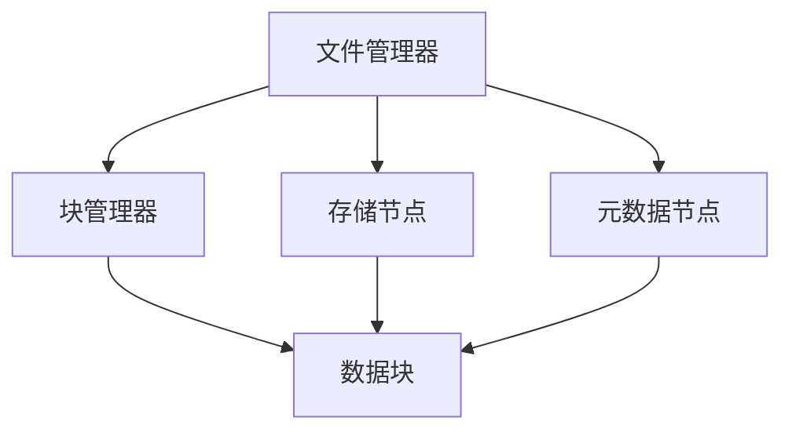
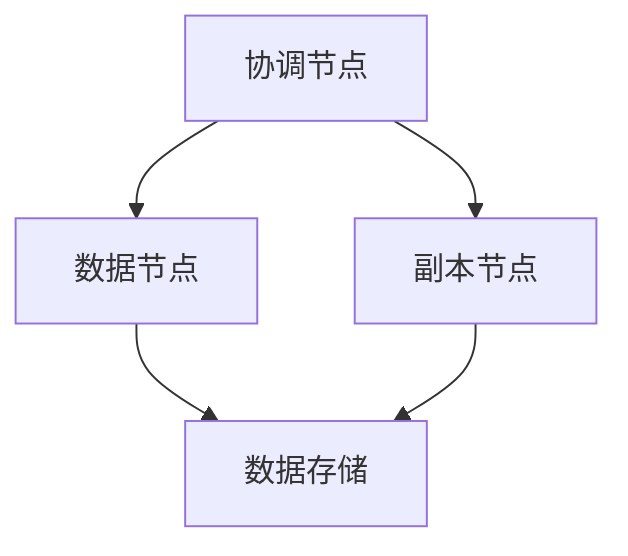

                 

### 文章标题

# 分布式技术的五大认知盲区及其解决方案

### 关键词

- 分布式技术
- 认知盲区
- 解决方案
- 一致性
- 协调
- 存储

### 摘要

随着云计算、大数据和物联网等技术的迅猛发展，分布式技术已成为现代IT系统架构的核心。然而，在分布式技术的应用过程中，存在诸多认知盲区，这些问题不仅影响了系统的性能和可靠性，也限制了分布式技术的发展。本文将深入探讨分布式技术的五大认知盲区，包括分布式一致性、分布式协调、分布式存储等方面，并针对每个盲区提供具体的解决方案。通过本文的阅读，读者将能够对分布式技术有更深刻的理解，并能够在实际项目中有效应用这些解决方案。

### 目录

1. [问题背景与概述](#问题背景与概述)  
   1.1. [分布式技术的定义与基本原理](#分布式技术的定义与基本原理)  
   1.2. [分布式技术的历史发展与现状](#分布式技术的历史发展与现状)  
   1.3. [分布式技术的应用领域与价值](#分布式技术的应用领域与价值)  
   1.4. [认知盲区的概念与影响](#认知盲区的概念与影响)  
   1.5. [解决认知盲区的必要性](#解决认知盲区的必要性)  
   1.6. [本书结构与目标](#本书结构与目标)  
   1.7. [本章小结](#本章小结)  
2. [分布式一致性](#分布式一致性)  
   2.1. [一致性模型](#一致性模型)  
   2.2. [分布式一致性算法](#分布式一致性算法)  
   2.3. [一致性相关工具与实践](#一致性相关工具与实践)  
   2.4. [本章小结](#本章小结)  
3. [分布式协调](#分布式协调)  
   3.1. [分布式锁](#分布式锁)  
   3.2. [分布式队列](#分布式队列)  
   3.3. [分布式事务](#分布式事务)  
   3.4. [分布式协调工具与实践](#分布式协调工具与实践)  
   3.5. [本章小结](#本章小结)  
4. [分布式存储](#分布式存储)  
   4.1. [分布式存储概述](#分布式存储概述)  
   4.2. [分布式文件系统](#分布式文件系统)  
   4.3. [分布式数据库](#分布式数据库)  
   4.4. [分布式存储实践](#分布式存储实践)  
   4.5. [本章小结](#本章小结)  
5. [总结与展望](#总结与展望)  
   5.1. [分布式技术的未来发展趋势](#分布式技术的未来发展趋势)  
   5.2. [进一步研究的方向](#进一步研究的方向)  
   5.3. [本书的贡献与局限性](#本书的贡献与局限性)  
   5.4. [本章小结](#本章小结)

## 1. 问题背景与概述

### 1.1 分布式技术的定义与基本原理

分布式技术是指通过将任务或数据分布在多个计算机节点上，实现高效、可靠、可扩展的计算和处理。分布式技术的核心是分布式系统，它包括多个相互独立但协同工作的计算机节点，通过通信网络连接起来。分布式系统具有以下几个基本原理：

1. **并行处理**：分布式系统能够利用多个节点的计算能力，实现并行处理，从而提高系统的处理速度。
2. **容错性**：分布式系统通过将任务分布在多个节点上，当一个节点发生故障时，其他节点可以继续工作，保证系统的稳定性。
3. **可扩展性**：分布式系统可以根据需求动态地增加或减少节点，从而实现系统的水平扩展。

分布式技术的基本原理是**去中心化**和**自组织**。去中心化意味着系统不再依赖于单一的中心节点，而是通过节点之间的相互协作实现整体功能。自组织则强调系统节点在无需外部控制的情况下，能够根据全局状态进行自主调整和优化。

### 1.2 分布式技术的历史发展与现状

分布式技术起源于20世纪60年代，当时的计算机网络技术逐渐成熟，人们开始探讨如何通过分布式计算来解决单机计算能力的限制。1978年，UNIX操作系统的发布标志着分布式计算技术的正式诞生。随后，随着网络技术的快速发展，分布式技术逐渐应用于各个领域。

在21世纪初，随着互联网和电子商务的兴起，分布式技术得到了广泛应用。例如，Web服务、大数据处理、云计算等场景都离不开分布式技术的支持。当前，分布式技术已成为现代IT系统架构的核心，其应用范围涵盖了各个行业，如金融、医疗、教育、物流等。

### 1.3 分布式技术的应用领域与价值

分布式技术具有广泛的应用领域和价值，主要体现在以下几个方面：

1. **高性能计算**：分布式系统可以通过并行处理，提高计算速度和效率，适用于科学计算、数据挖掘、机器学习等领域。
2. **数据存储与管理**：分布式数据库和分布式存储系统能够提供高可靠性、高可用性和高扩展性的数据存储解决方案，适用于大规模数据存储和管理。
3. **云计算**：分布式技术是云计算的基础，通过分布式计算和分布式存储，云平台能够提供强大的计算和存储能力，满足各类用户需求。
4. **物联网**：分布式技术能够实现物联网设备之间的协同工作，提高物联网系统的可靠性和效率。
5. **边缘计算**：分布式技术使得边缘计算成为可能，通过在靠近数据源的节点上进行计算，降低延迟，提高实时性。

### 1.4 认知盲区的概念与影响

认知盲区是指人们在认识和解决问题时，由于缺乏足够的信息或者理解，而产生的认知局限性。在分布式技术领域，认知盲区主要体现在以下几个方面：

1. **分布式一致性**：分布式系统需要保证多个节点之间的数据一致性，但在实际应用中，人们往往对一致性模型的原理和实现方法了解不足，导致系统设计存在缺陷。
2. **分布式协调**：分布式系统中，节点之间的协同工作至关重要，但人们往往对分布式锁、分布式队列和分布式事务的实现原理和优化方法缺乏深入了解。
3. **分布式存储**：分布式存储系统涉及复杂的存储架构和算法，人们往往对如何设计高效、可靠的分布式存储系统缺乏系统的认识。

认知盲区对分布式技术的影响主要体现在以下几个方面：

1. **系统性能下降**：由于对一致性、协调和存储的理解不足，分布式系统的设计可能存在缺陷，导致系统性能下降。
2. **系统可靠性降低**：分布式系统的容错性和可靠性依赖于对节点故障的及时响应和处理，但认知盲区可能导致故障处理不及时，降低系统可靠性。
3. **系统可扩展性受限**：分布式系统需要具备良好的可扩展性，以适应不断增长的数据和处理需求。但认知盲区可能导致系统设计过于复杂，限制系统的扩展性。

### 1.5 解决认知盲区的必要性

解决分布式技术中的认知盲区具有以下几个方面的必要性：

1. **提高系统性能**：通过深入了解分布式一致性、协调和存储的原理，可以设计出更高效、更可靠的分布式系统，提高系统性能。
2. **增强系统可靠性**：深入了解分布式技术的核心概念和实现方法，能够更好地处理节点故障，提高系统的可靠性和稳定性。
3. **促进技术发展**：解决认知盲区，有助于推动分布式技术的进一步发展，为云计算、大数据、物联网等领域提供更强大的技术支持。

### 1.6 本书结构与目标

本书共分为四个主要章节，分别从分布式一致性、分布式协调、分布式存储等方面深入探讨分布式技术的核心问题。具体章节安排如下：

1. **第1章：问题背景与概述**  
   介绍分布式技术的定义、历史发展、应用领域以及认知盲区的概念和影响。
   
2. **第2章：分布式一致性**  
   详细讨论分布式一致性模型、一致性算法以及相关工具和实践。

3. **第3章：分布式协调**  
   探讨分布式锁、分布式队列、分布式事务的实现原理和实践。

4. **第4章：分布式存储**  
   分析分布式存储的概念、文件系统和数据库，以及实际应用中的设计和实现。

本书的目标是帮助读者深入理解分布式技术的核心概念和实现方法，解决分布式技术中的认知盲区，提升分布式系统的设计和实施能力。

### 1.7 本章小结

本章介绍了分布式技术的定义、历史发展、应用领域以及认知盲区的概念和影响。通过本章的学习，读者可以初步了解分布式技术的核心概念，认识到分布式技术中存在的认知盲区，并意识到解决这些盲区的必要性。接下来，本书将分别从分布式一致性、分布式协调、分布式存储等方面，深入探讨分布式技术的核心问题，帮助读者全面提升分布式系统的设计和实施能力。

## 2. 分布式一致性

### 2.1 一致性模型

在分布式系统中，一致性是指多个节点之间的数据状态保持一致。一致性模型是分布式系统设计中的一个关键概念，它定义了节点之间如何保持数据的一致性。一致性模型通常根据其强度分为强一致性模型和弱一致性模型。

#### 2.1.1 强一致性 vs 弱一致性

**强一致性模型**要求系统在任何情况下都能保证多个节点之间的数据一致性。即在一个分布式系统中，如果某个节点更新了数据，其他所有节点在稍后访问时能够看到这个更新。强一致性模型确保了数据的可靠性，但通常需要较高的通信开销，并且可能降低系统的性能和可扩展性。

**弱一致性模型**则允许数据在节点之间存在一定的时间延迟和不一致性。在弱一致性模型中，节点之间的数据同步不是强制的，这意味着在一个节点上更新的数据可能需要一段时间才能在其他节点上反映出来。弱一致性模型提供了更高的性能和可扩展性，但可能牺牲一定的数据可靠性。

#### 2.1.2 一致性模型的分类与特点

**强一致性模型**：

- **线性一致性（Linearizability）**：线性一致性是最强的一致性保证，它要求系统对每个操作都有严格的顺序执行，使得系统在任何时刻看起来都是处于一个确定的、线性的状态。
- **强一致性（Strong Consistency）**：强一致性要求系统在任何时刻都能看到最新的数据，即多个节点之间的数据同步是即时的。

**弱一致性模型**：

- **最终一致性（Eventual Consistency）**：最终一致性模型允许系统在初始阶段存在不一致性，但随着时间的推移，系统最终会达到一致性状态。
- **因果一致性（ causal consistency）**：因果一致性模型保证了事件之间的因果关系，即如果事件A发生在事件B之前，那么在任何节点上，事件A的结果必须先于事件B的结果。

#### 2.1.3 一致性模型的实现与挑战

实现一致性模型面临以下几个主要挑战：

1. **通信开销**：为了保持数据一致性，节点之间需要进行频繁的通信和数据同步，这可能导致较大的通信开销。
2. **性能和可扩展性**：强一致性模型通常需要更多的通信和同步操作，这可能降低系统的性能和可扩展性。
3. **故障处理**：在分布式系统中，节点可能会出现故障，一致性模型需要提供有效的故障处理机制，以保证系统的稳定性。

#### 2.1.4 一致性模型的选择

选择一致性模型时，需要根据应用场景和需求进行权衡：

- **对数据可靠性要求较高的应用**：如金融系统、在线交易等，可以选择强一致性模型。
- **对性能和可扩展性要求较高的应用**：如社交媒体、电商平台等，可以选择弱一致性模型。

### 2.2 分布式一致性算法

分布式一致性算法是确保分布式系统中多个节点之间数据一致性的一系列协议和机制。以下将介绍两种常用的分布式一致性算法：Paxos算法和Raft算法。

#### 2.2.1 Paxos算法

**Paxos算法**是一种广泛使用的分布式一致性算法，它由加州大学伯克利分校的计算机科学家Leslie Lamport提出。Paxos算法的主要目标是选举出一个领导者（Learner）来生成和维持一致的数据状态。

##### 2.2.1.1 Paxos算法原理

Paxos算法的核心概念包括以下几个角色和步骤：

- **角色**：Proposer（提议者）、Acceptor（接受者）、Learner（学习者）。
- **步骤**：Prepare阶段和Accept阶段。

在Prepare阶段，提议者向所有接受者发送提案请求，接受者收到请求后，如果该提案的编号高于其已接受的最小编号，则接受该提案并返回一个承诺。提议者在收到大多数接受者的承诺后，进入Accept阶段，向所有接受者发送包含提案值的接受请求。接受者在收到请求后，如果提案值与之前承诺的一致，则接受该提案。

##### 2.2.1.2 Paxos算法流程

Paxos算法的基本流程如下：

1. **提议者发起提案**：提议者选择一个提案编号（通常是当前编号加1），并发送Prepare请求到所有接受者。
2. **接受者处理Prepare请求**：接受者收到Prepare请求后，如果该提案的编号大于其已接受的最小编号，则接受该提案，并返回一个承诺。
3. **提议者等待承诺**：提议者在收到大多数接受者的承诺后，认为该提案已被接受，并进入Accept阶段。
4. **提议者发送Accept请求**：提议者向所有接受者发送包含提案值的Accept请求。
5. **接受者处理Accept请求**：接受者收到Accept请求后，如果提案值与之前承诺的一致，则接受该提案。
6. **学习者学习提案值**：学习者从领导者那里学习提案值。

##### 2.2.1.3 Paxos算法优化与改进

Paxos算法虽然能够实现分布式一致性，但存在一些缺点，如通信开销较大、性能较低等。为了优化Paxos算法，研究者提出了许多改进方案：

- **Fast Paxos**：通过减少通信次数，提高Paxos算法的性能。
- **Two-Phase Commit（2PC）**：将Paxos算法与事务管理结合起来，提高分布式事务的处理效率。
- **PaxosMadeSimple**：简化Paxos算法的实现，提高可理解性和可维护性。

#### 2.2.2 Raft算法

**Raft算法**是一种基于状态机理论的分布式一致性算法，由斯坦福大学的研究者Diego Ongaro和John Ousterhout提出。Raft算法通过简化一致性协议，使其更容易理解、实现和优化。

##### 2.2.2.1 Raft算法原理

Raft算法的核心概念包括以下几个角色和步骤：

- **角色**：Leader（领导者）、Follower（跟随者）、Candidate（候选者）。
- **步骤**：领导选举、日志复制、日志持久化。

在Raft算法中，领导者负责处理客户端请求和日志复制，跟随者负责接受领导者的日志并同步状态，候选者参与领导选举过程。

##### 2.2.2.2 Raft算法流程

Raft算法的基本流程如下：

1. **初始化**：系统初始化时，所有节点都是Follower状态。
2. **领导选举**：当当前领导者宕机或无法与多数节点保持同步时，Follower节点将触发领导选举。
   - Follower节点发送RequestVote请求到其他节点。
   - 节点收到请求后，比较候选者的日志长度和最后一条日志的索引，选择日志更长或相等的节点作为领导者。
   - 获得多数投票的节点成为新的领导者。
3. **日志复制**：领导者接收客户端请求，将请求转换为日志条目，并将其复制到所有跟随者。
   - 领导者发送AppendEntries请求到跟随者。
   - 跟随者收到请求后，将新的日志条目追加到本地日志，并返回确认。
4. **状态同步**：领导者定期发送Heartbeat请求到跟随者，以确保领导者与跟随者之间的状态保持同步。

##### 2.2.2.3 Raft算法优缺点

Raft算法的优点包括：

- **易于理解**：Raft算法的设计基于状态机理论，使得其协议更加直观和易于理解。
- **高效**：Raft算法通过减少冗余的通信请求，提高了系统的性能。
- **故障恢复能力强**：Raft算法具有较好的故障恢复能力，能够在领导者宕机或网络分区的情况下，快速选举出新的领导者。

Raft算法的缺点包括：

- **通信开销较大**：相比于Paxos算法，Raft算法的通信开销较大，可能影响系统的性能。
- **对网络延迟敏感**：Raft算法依赖于连续的通信请求来保持一致性，对网络延迟敏感。

### 2.3 一致性相关工具与实践

在实际应用中，有许多一致性相关工具和实践可以帮助实现分布式一致性。以下介绍两种常用的工具：ZooKeeper和etcd。

#### 2.3.1 ZooKeeper

**ZooKeeper**是一个分布式协调服务，它基于Zab（ZooKeeper Atomic Broadcast）协议实现分布式一致性。ZooKeeper广泛应用于分布式系统的协调、命名服务、配置管理、分布式锁等方面。

##### 2.3.1.1 ZooKeeper的特点与架构

**特点**：

- **强一致性**：ZooKeeper保证强一致性，即一旦一个事务被提交，所有后续的事务都能看到这个结果。
- **高可用性**：ZooKeeper通过选举机制，保证领导者节点宕机时，能够快速选举出新的领导者。
- **持久化**：ZooKeeper将事务日志持久化到磁盘，保证系统在重启后能够恢复到正确状态。

**架构**：

- **ZooKeeper集群**：ZooKeeper集群由多个ZooKeeper服务器组成，包括一个领导者（Leader）和多个跟随者（Follower）。
- **Zab协议**：ZooKeeper采用Zab协议实现分布式一致性，Zab协议是一种基于物理日志的广播协议，保证了数据的原子性和一致性。

##### 2.3.1.2 ZooKeeper的使用与部署

**使用**：

- **客户端API**：ZooKeeper提供Java、Python等多种语言的客户端API，方便开发者集成和使用。
- **命名空间**：ZooKeeper使用命名空间来组织数据，方便管理。

**部署**：

- **单机模式**：在开发或测试环境中，可以使用单机模式运行ZooKeeper。
- **集群模式**：在生产环境中，建议使用集群模式运行ZooKeeper，以提高可用性和性能。

#### 2.3.2 etcd

**etcd**是一个分布式键值存储，它基于Raft算法实现分布式一致性。etcd广泛应用于配置管理、服务发现、分布式锁等方面。

##### 2.3.2.1 etcd的特点与架构

**特点**：

- **高性能**：etcd采用Go语言实现，具有良好的性能和可扩展性。
- **简单易用**：etcd的设计简洁，易于理解和部署。
- **高可用性**：etcd基于Raft算法，具备良好的故障恢复能力。

**架构**：

- **集群模式**：etcd集群由多个节点组成，包括一个领导者（Leader）和多个跟随者（Follower）。
- **Raft算法**：etcd采用Raft算法实现分布式一致性，保证数据的可靠性和一致性。

##### 2.3.2.2 etcd的使用与部署

**使用**：

- **API接口**：etcd提供HTTP API接口，方便开发者进行数据操作。
- **命令行工具**：etcd提供命令行工具，方便进行数据管理和调试。

**部署**：

- **单机模式**：在开发或测试环境中，可以使用单机模式运行etcd。
- **集群模式**：在生产环境中，建议使用集群模式运行etcd，以提高可用性和性能。

### 2.4 本章小结

本章介绍了分布式一致性模型、一致性算法以及相关工具和实践。通过本章的学习，读者可以了解分布式一致性在分布式系统中的重要性，掌握常用的分布式一致性算法（如Paxos和Raft），并了解如何使用ZooKeeper和etcd等工具实现分布式一致性。在下一章中，我们将继续探讨分布式协调的相关内容。

## 3. 分布式协调

### 3.1 分布式锁

分布式锁是分布式系统中的一个重要机制，用于保证多个进程或线程对共享资源的独占访问。在分布式环境中，由于网络延迟和节点故障等因素，分布式锁的实现比单机锁更为复杂。

#### 3.1.1 分布式锁的概念与分类

**概念**：

分布式锁是一种同步机制，用于确保在分布式系统中，同一时间段内只有一个进程或线程能够访问特定的资源。

**分类**：

1. **基于数据库的分布式锁**：利用数据库的行锁或表锁实现分布式锁。例如，使用MySQL的`SELECT FOR UPDATE`语句实现分布式锁。
2. **基于缓存系统的分布式锁**：利用缓存系统的锁功能实现分布式锁。例如，使用Redis的`SETNX`命令实现分布式锁。
3. **基于ZooKeeper的分布式锁**：利用ZooKeeper的节点锁功能实现分布式锁。ZooKeeper提供了一种基于文件的锁机制，通过创建和删除临时节点实现分布式锁。
4. **基于时间戳的分布式锁**：利用时间戳实现分布式锁。节点通过比较时间戳来确定锁的持有者。

#### 3.1.2 分布式锁的实现与挑战

**实现**：

分布式锁的实现通常包括以下几个步骤：

1. **初始化锁**：初始化分布式锁，设置锁的名称和过期时间。
2. **尝试获取锁**：进程或线程尝试获取锁，如果成功，则继续执行；否则，等待或重试。
3. **释放锁**：进程或线程完成任务后，释放锁，允许其他进程或线程获取锁。

**挑战**：

1. **死锁**：多个进程或线程在等待对方释放锁时，可能导致死锁。例如，A进程持有锁A，等待锁B；同时，B进程持有锁B，等待锁A，两者陷入死锁。
2. **锁竞争**：多个进程或线程同时竞争锁，可能导致性能下降。
3. **网络延迟**：网络延迟可能导致分布式锁的实现复杂，增加系统的复杂度和维护难度。

#### 3.1.3 分布式锁的常用算法

1. **基于数据库的分布式锁算法**：

   - **优点**：实现简单，利用现有数据库的锁机制。
   - **缺点**：性能较低，可能导致数据库负载增加。

2. **基于缓存系统的分布式锁算法**：

   - **优点**：性能较高，利用缓存系统减少数据库负载。
   - **缺点**：缓存系统的可靠性可能不如数据库。

3. **基于ZooKeeper的分布式锁算法**：

   - **优点**：实现简单，具有良好的性能和可靠性。
   - **缺点**：ZooKeeper的锁机制可能不够灵活。

4. **基于时间戳的分布式锁算法**：

   - **优点**：基于时间戳，简单高效。
   - **缺点**：可能存在时间戳冲突问题。

#### 3.1.4 分布式锁的优化方法

为了提高分布式锁的性能和可靠性，可以采用以下优化方法：

1. **锁的细粒度化**：将大范围的资源划分为更细粒度的资源，减少锁竞争。
2. **锁的超时机制**：设置锁的超时时间，避免长时间等待锁。
3. **锁的读写分离**：对读多写少的场景，使用读写锁，提高并发性能。
4. **锁的抢占机制**：允许后到先得的锁，提高锁的利用率。

### 3.2 分布式队列

分布式队列是分布式系统中用于实现异步任务处理的一种机制。分布式队列能够保证任务的有序处理，避免任务丢失或重复执行。

#### 3.2.1 分布式队列的概念与分类

**概念**：

分布式队列是一种分布式数据结构，用于存储和转发任务。分布式队列能够保证任务的顺序执行，避免任务丢失或重复执行。

**分类**：

1. **基于消息队列的分布式队列**：利用消息队列（如Kafka、RabbitMQ）实现分布式队列。任务被发送到消息队列，消费者从消息队列中获取任务进行处理。
2. **基于数据库的分布式队列**：利用数据库的队列功能实现分布式队列。例如，使用Redis的`LPUSH`和`BRPOP`命令实现分布式队列。
3. **基于内存的分布式队列**：利用内存数据结构实现分布式队列。例如，使用Java的`BlockingQueue`实现分布式队列。

#### 3.2.2 分布式队列的实现与挑战

**实现**：

分布式队列的实现通常包括以下几个步骤：

1. **初始化队列**：初始化分布式队列，设置队列的容量和并发度。
2. **入队**：将任务放入分布式队列中。
3. **出队**：从分布式队列中获取任务进行处理。

**挑战**：

1. **队列长度限制**：分布式队列需要设置合理的长度限制，避免队列溢出。
2. **并发性能**：分布式队列需要能够处理高并发的任务，提高系统的性能。
3. **任务丢失或重复执行**：分布式队列需要保证任务的有序处理，避免任务丢失或重复执行。

#### 3.2.3 分布式队列的应用与实践

**应用**：

分布式队列广泛应用于分布式系统的异步任务处理，例如消息队列、任务调度系统、缓存系统等。

**实践**：

1. **任务分发**：在分布式系统中，使用分布式队列将任务分发到不同的处理节点。
2. **负载均衡**：使用分布式队列实现负载均衡，将任务均匀分配到各个处理节点。
3. **容错处理**：分布式队列可以保证任务的有序处理，避免任务丢失或重复执行。

### 3.3 分布式事务

分布式事务是分布式系统中一类重要的操作，用于确保多个节点之间的数据一致性。分布式事务需要处理跨节点的数据操作，使得数据在多个节点上保持一致。

#### 3.3.1 分布式事务的概念与特点

**概念**：

分布式事务是一组跨节点的操作，这些操作需要保证要么全部成功执行，要么全部回滚。分布式事务涉及多个数据库或数据源，需要协调多个节点之间的操作。

**特点**：

1. **全局性**：分布式事务涉及多个节点，操作范围是全局的。
2. **一致性**：分布式事务需要保证多个节点之间的数据一致性。
3. **隔离性**：分布式事务需要保证操作隔离，避免并发操作之间的干扰。
4. **可靠性**：分布式事务需要具备良好的故障恢复能力，确保事务的完整性和可靠性。

#### 3.3.2 分布式事务的实现与挑战

**实现**：

分布式事务的实现通常包括以下几个步骤：

1. **事务开始**：启动分布式事务，初始化事务上下文。
2. **事务执行**：执行跨节点的数据操作，包括提交和回滚。
3. **事务提交**：如果所有操作成功执行，提交分布式事务。
4. **事务回滚**：如果操作失败，回滚分布式事务，撤销已执行的操作。

**挑战**：

1. **协调**：分布式事务需要协调多个节点的操作，确保数据一致性。
2. **隔离**：分布式事务需要提供隔离性，避免并发操作之间的干扰。
3. **故障处理**：分布式事务需要具备良好的故障恢复能力，确保事务的完整性和可靠性。

#### 3.3.3 分布式事务的处理方案

分布式事务的处理方案主要包括以下几种：

1. **两阶段提交（2PC）**：

   - **优点**：两阶段提交能够保证分布式事务的一致性。
   - **缺点**：两阶段提交的通信开销较大，性能较低。

2. **三阶段提交（3PC）**：

   - **优点**：三阶段提交进一步减少了通信开销。
   - **缺点**：三阶段提交的复杂性较高，实现和维护成本较大。

3. **分布式事务管理器**：

   - **优点**：分布式事务管理器能够简化分布式事务的实现，提供更高效的性能。
   - **缺点**：分布式事务管理器需要额外的维护和管理成本。

#### 3.3.4 分布式事务的实践

分布式事务在许多实际应用中都有广泛应用，例如金融系统的转账操作、电商平台的订单处理等。以下是一个简单的分布式事务实践案例：

1. **需求分析**：用户在电商平台购买商品，需要进行库存扣减和订单创建两个操作。
2. **实现分布式事务**：使用两阶段提交协议，协调库存扣减和订单创建的操作。
   - **第一阶段**：请求库存扣减服务，判断库存是否充足。
   - **第二阶段**：请求订单创建服务，创建订单并扣减库存。
3. **故障处理**：如果库存扣减或订单创建失败，回滚已执行的操作，恢复系统状态。

### 3.4 分布式协调工具与实践

在实际应用中，有许多分布式协调工具可以帮助实现分布式锁、分布式队列和分布式事务。以下介绍两种常用的工具：ZooKeeper和etcd。

#### 3.4.1 ZooKeeper在分布式协调中的应用

**应用**：

ZooKeeper广泛应用于分布式锁、分布式队列和分布式事务的协调。

1. **分布式锁**：使用ZooKeeper的节点锁实现分布式锁。
2. **分布式队列**：使用ZooKeeper的队列功能实现分布式队列。
3. **分布式事务**：使用ZooKeeper的临时节点实现分布式事务。

**实践**：

1. **分布式锁实现**：

   - 创建一个临时的ZooKeeper节点，作为锁。
   - 进程或线程尝试获取锁，创建一个新的子节点。
   - 判断子节点是否被删除，如果被删除，获取锁成功；否则，等待或重试。

2. **分布式队列实现**：

   - 创建一个ZooKeeper节点，作为队列的根节点。
   - 进程或线程入队，在根节点下创建子节点。
   - 进程或线程出队，从根节点下获取子节点，并删除子节点。

3. **分布式事务实现**：

   - 创建两个临时的ZooKeeper节点，分别表示事务的开始和结束。
   - 执行事务操作，记录事务状态。
   - 提交事务，将结束节点设置为“成功”状态；回滚事务，将结束节点设置为“失败”状态。

#### 3.4.2 etcd在分布式协调中的应用

**应用**：

etcd广泛应用于分布式锁、分布式队列和分布式事务的协调。

1. **分布式锁**：使用etcd的锁功能实现分布式锁。
2. **分布式队列**：使用etcd的键值存储实现分布式队列。
3. **分布式事务**：使用etcd的键值存储实现分布式事务。

**实践**：

1. **分布式锁实现**：

   - 使用`SETNX`命令创建锁。
   - 使用`TTL`设置锁的过期时间。
   - 判断锁是否存在，如果存在，获取锁成功；否则，等待或重试。

2. **分布式队列实现**：

   - 使用`LPUSH`命令将任务推入队列。
   - 使用`BRPOP`命令从队列中获取任务。
   - 删除已处理的任务。

3. **分布式事务实现**：

   - 使用`SET`命令存储事务状态。
   - 执行事务操作，记录事务状态。
   - 提交事务，更新事务状态；回滚事务，删除事务状态。

### 3.5 本章小结

本章介绍了分布式锁、分布式队列和分布式事务的实现原理和实践。通过本章的学习，读者可以了解分布式协调在分布式系统中的重要性，掌握分布式锁、分布式队列和分布式事务的实现方法，并了解如何使用ZooKeeper和etcd等工具实现分布式协调。在下一章中，我们将继续探讨分布式存储的相关内容。

## 4. 分布式存储

### 4.1 分布式存储概述

分布式存储是分布式系统中用于存储和管理数据的一种机制。与传统的集中式存储相比，分布式存储能够提供更高的可靠性、可用性和可扩展性。分布式存储通过将数据分布在多个节点上，实现了数据的冗余存储和高可用性。

#### 4.1.1 分布式存储的定义与特点

**定义**：

分布式存储是指将数据分布在多个节点上，通过节点之间的协作和数据复制，实现数据的存储、访问和管理。

**特点**：

1. **高可靠性**：分布式存储通过数据冗余和节点备份，实现了数据的高可靠性，即使某个节点发生故障，数据也不会丢失。
2. **高可用性**：分布式存储能够自动进行节点故障转移，保证系统的持续运行。
3. **高扩展性**：分布式存储能够根据需求动态地增加或减少节点，实现系统的水平扩展。
4. **高性能**：分布式存储通过并行处理和数据局部性，提高了数据访问和传输的速度。

#### 4.1.2 分布式存储的分类与比较

分布式存储可以根据存储介质和架构的不同，分为以下几类：

1. **基于磁盘的分布式存储**：这类分布式存储使用磁盘作为存储介质，通过多个磁盘阵列实现数据存储。例如，HDFS（Hadoop Distributed File System）和Ceph。
2. **基于闪存的分布式存储**：这类分布式存储使用闪存（如SSD）作为存储介质，具有较高的I/O性能和存储密度。例如，All-flash Storage System和Redis。
3. **基于对象的分布式存储**：这类分布式存储将数据存储为对象，通过对象的元数据和访问控制列表进行管理。例如，Amazon S3和Google Cloud Storage。
4. **基于块的分布式存储**：这类分布式存储将数据划分为块进行存储，通过块索引和块映射表进行管理。例如，Cassandra和MongoDB。

**比较**：

- **存储性能**：基于闪存的分布式存储具有更高的I/O性能，适用于高性能应用；基于磁盘的分布式存储性能较低，但成本较低。
- **存储容量**：基于对象的分布式存储和基于块的分布式存储具有更高的存储容量，适用于大规模数据存储；基于磁盘的分布式存储容量较小。
- **数据访问模式**：基于对象的分布式存储适用于对象存储和检索场景；基于块的分布式存储适用于键值存储和文档存储场景；基于磁盘的分布式存储适用于文件存储和流式处理场景。

#### 4.1.3 分布式存储的关键技术

分布式存储涉及多个关键技术，包括数据分布、数据复制、故障恢复和数据一致性等。

1. **数据分布**：数据分布是将数据均匀地分布在多个节点上，以实现数据的局部性和并行访问。常用的数据分布策略包括Hash分布和范围分布。
2. **数据复制**：数据复制是通过在多个节点上复制数据，提高数据可靠性和可用性。常用的数据复制策略包括主从复制、多主复制和一致性复制。
3. **故障恢复**：故障恢复是指系统在节点故障时，自动进行故障转移和数据恢复。常用的故障恢复机制包括心跳检测、选举算法和故障转移机制。
4. **数据一致性**：数据一致性是指多个节点之间的数据状态保持一致。分布式一致性算法（如Paxos和Raft）用于实现数据一致性。

### 4.2 分布式文件系统

分布式文件系统是分布式存储系统的一种实现，它通过将文件分布在多个节点上，提供了文件级的存储和管理功能。分布式文件系统具有高可靠性、高可用性和可扩展性，适用于大规模数据存储和处理。

#### 4.2.1 分布式文件系统的概念与特点

**概念**：

分布式文件系统是一种文件系统，它将文件存储在多个分布式存储节点上，并通过网络进行访问和管理。分布式文件系统通过将文件划分为块，并存储在多个节点上，实现了数据的冗余和负载均衡。

**特点**：

1. **高可靠性**：分布式文件系统通过数据冗余和节点备份，提高了数据的可靠性。
2. **高可用性**：分布式文件系统通过节点故障转移和自动恢复，提高了系统的可用性。
3. **可扩展性**：分布式文件系统可以通过增加节点来扩展存储容量和处理能力。
4. **高性能**：分布式文件系统通过并行访问和局部性优化，提高了数据访问速度。

#### 4.2.2 常见的分布式文件系统

以下介绍几种常见的分布式文件系统：

1. **HDFS（Hadoop Distributed File System）**：

   - **特点**：HDFS是一个基于磁盘的分布式文件系统，适用于大规模数据存储和处理。它通过将文件划分为块，并存储在多个节点上，实现了数据的冗余和负载均衡。
   - **应用场景**：HDFS广泛应用于大数据处理、云计算等领域。

2. **Ceph**：

   - **特点**：Ceph是一个基于对象存储的分布式文件系统，具有高可靠性、高可用性和可扩展性。它支持多种存储类型，包括块存储、对象存储和文件系统。
   - **应用场景**：Ceph广泛应用于数据中心、云计算和大数据处理等领域。

3. **GlusterFS**：

   - **特点**：GlusterFS是一个基于文件系统的分布式文件系统，具有高可靠性、高可用性和可扩展性。它通过将多个本地文件系统聚合在一起，提供了统一的命名空间和文件管理功能。
   - **应用场景**：GlusterFS广泛应用于企业级存储、云计算和大数据处理等领域。

#### 4.2.3 分布式文件系统的设计与实现

分布式文件系统的设计与实现涉及多个关键组件，包括文件管理器、块管理器、存储节点和元数据节点等。

1. **文件管理器**：文件管理器是分布式文件系统的核心组件，负责文件的命名空间管理、文件操作和元数据管理。
2. **块管理器**：块管理器负责文件的块分配、数据存储和数据检索。
3. **存储节点**：存储节点是分布式文件系统的数据存储节点，负责存储和管理文件的数据块。
4. **元数据节点**：元数据节点负责存储和管理文件的元数据，如文件名、权限和属性等。

以下是一个简单的分布式文件系统实现框架：

### 4.3 分布式数据库

分布式数据库是分布式系统中用于存储和管理数据的一种机制，它通过将数据库分布在多个节点上，提供了数据的高可靠性、高可用性和可扩展性。分布式数据库适用于大规模数据存储和处理，具有高性能和强一致性。

#### 4.3.1 分布式数据库的概念与特点

**概念**：

分布式数据库是将数据库分布在多个节点上，通过节点之间的协作和数据复制，实现数据存储和管理。分布式数据库通过将数据库划分为多个分区，实现了数据的并行处理和负载均衡。

**特点**：

1. **高可靠性**：分布式数据库通过数据冗余和节点备份，提高了数据的可靠性。
2. **高可用性**：分布式数据库通过节点故障转移和自动恢复，提高了系统的可用性。
3. **可扩展性**：分布式数据库可以通过增加节点来扩展存储容量和处理能力。
4. **高性能**：分布式数据库通过并行处理和局部性优化，提高了数据访问速度。
5. **强一致性**：分布式数据库通常采用一致性算法，确保多个节点之间的数据一致性。

#### 4.3.2 常见的分布式数据库

以下介绍几种常见的分布式数据库：

1. **Cassandra**：

   - **特点**：Cassandra是一个分布式非关系型数据库，适用于大规模数据存储和处理。它采用无主架构，通过数据分片和副本实现了高可用性和可扩展性。
   - **应用场景**：Cassandra广泛应用于大数据处理、实时分析、物联网等领域。

2. **MongoDB**：

   - **特点**：MongoDB是一个分布式文档数据库，适用于大规模数据存储和处理。它采用分片和副本机制，实现了数据的水平扩展和高可用性。
   - **应用场景**：MongoDB广泛应用于Web应用、大数据处理、实时分析等领域。

3. **HBase**：

   - **特点**：HBase是一个分布式列存储数据库，基于Hadoop生态系统，适用于大规模数据存储和处理。它采用数据分片和副本机制，实现了数据的并行处理和高可用性。
   - **应用场景**：HBase广泛应用于大数据处理、实时分析、搜索引擎等领域。

#### 4.3.3 分布式数据库的架构与实现

分布式数据库的架构通常包括以下几个关键组件：

1. **协调节点**：协调节点是分布式数据库的核心组件，负责处理客户端请求、数据分片和副本管理。
2. **数据节点**：数据节点是分布式数据库的存储节点，负责存储和管理数据。
3. **副本节点**：副本节点是分布式数据库的备份节点，负责数据的冗余存储和故障转移。

以下是一个简单的分布式数据库架构：

分布式数据库的实现涉及多个关键技术，包括数据分片、副本管理、数据一致性、故障恢复等。数据分片是将数据库划分为多个分区，实现数据的并行处理。副本管理是将数据复制到多个节点上，提高数据的可靠性。数据一致性是通过一致性算法，确保多个节点之间的数据一致性。故障恢复是通过节点故障转移和自动恢复，保证系统的持续运行。

### 4.4 分布式存储实践

分布式存储在实际应用中具有广泛的应用场景，以下介绍几个典型的分布式存储实践案例。

#### 4.4.1 案例一：企业级分布式文件系统

**需求分析**：

某企业需要构建一个高可靠性、高可用性和可扩展性的分布式文件系统，用于存储和管理大量企业数据。

**实现方案**：

1. **搭建HDFS集群**：部署多个HDFS节点，构建HDFS集群。
2. **数据分片和副本**：使用HDFS的默认数据分片和副本机制，实现数据的高可靠性和高可用性。
3. **负载均衡**：使用HDFS的负载均衡机制，实现数据存储的均衡分配。
4. **数据访问控制**：使用HDFS的权限控制机制，确保数据的安全访问。

**效果评估**：

- 数据可靠性：通过副本机制，确保数据不丢失。
- 数据可用性：通过负载均衡和故障转移，提高系统的可用性。
- 数据扩展性：通过增加节点，实现系统的水平扩展。

#### 4.4.2 案例二：分布式数据库应用

**需求分析**：

某电商平台需要构建一个分布式数据库，用于存储和管理大量用户数据。

**实现方案**：

1. **搭建Cassandra集群**：部署多个Cassandra节点，构建Cassandra集群。
2. **数据分片和副本**：使用Cassandra的数据分片和副本机制，实现数据的高可靠性和高可用性。
3. **一致性保证**：使用Cassandra的一致性算法，确保多个节点之间的数据一致性。
4. **读写分离**：使用Cassandra的读写分离机制，提高系统的性能和可扩展性。

**效果评估**：

- 数据可靠性：通过副本机制，确保数据不丢失。
- 数据可用性：通过故障转移和负载均衡，提高系统的可用性。
- 数据扩展性：通过增加节点，实现系统的水平扩展。

### 4.5 本章小结

本章介绍了分布式存储的概念、分类、关键技术及应用场景。通过本章的学习，读者可以了解分布式存储的基本原理和实现方法，掌握分布式文件系统和分布式数据库的设计与实现。在实际应用中，分布式存储能够提供高可靠性、高可用性和可扩展性的数据存储解决方案，适用于大规模数据存储和处理。在下一章中，我们将继续探讨分布式技术的未来发展趋势和进一步研究的方向。

## 5. 总结与展望

### 5.1 分布式技术的未来发展趋势

随着云计算、大数据、物联网等技术的快速发展，分布式技术在未来将继续发挥重要作用，并呈现出以下几个发展趋势：

1. **智能分布式系统**：随着人工智能技术的进步，分布式系统将更加智能化，具备自我优化、自我学习和自我修复的能力。
2. **分布式数据库的成熟**：分布式数据库技术将不断成熟，包括性能优化、一致性保证、安全性提升等方面。
3. **边缘计算与分布式系统的融合**：边缘计算与分布式系统的融合将推动物联网技术的发展，实现实时数据处理和智能响应。
4. **分布式存储的多样化**：分布式存储技术将更加多样化，包括混合存储、分布式文件系统和分布式数据库等。
5. **分布式系统的标准化**：随着分布式技术的广泛应用，标准化将成为趋势，推动分布式系统的互操作性和兼容性。

### 5.2 进一步研究的方向

针对分布式技术，未来可以进一步研究的方向包括：

1. **一致性算法的优化**：研究更高效、更简洁的一致性算法，提高分布式系统的性能和可靠性。
2. **分布式系统的安全性与隐私保护**：研究分布式系统中的安全性和隐私保护技术，确保数据的安全和隐私。
3. **分布式系统的自适应调度**：研究分布式系统的自适应调度机制，根据系统负载和资源状况动态调整资源分配。
4. **分布式机器学习和推理**：研究分布式机器学习和推理技术，实现大规模数据的高效分析和处理。
5. **分布式事务处理**：研究分布式事务处理的新方法，提高分布式事务的执行效率和一致性保证。

### 5.3 本书的贡献与局限性

本书旨在深入探讨分布式技术的核心问题，包括分布式一致性、分布式协调和分布式存储等。本书的主要贡献在于：

1. **系统性**：系统性地介绍了分布式技术的核心概念、算法和工具，为读者提供了全面的分布式技术知识体系。
2. **实用性**：通过结合实际案例和实践，帮助读者理解分布式技术的实际应用场景和解决方案。
3. **深入分析**：对分布式技术中的关键问题进行了深入分析，提供了详细的算法原理和数学模型，有助于读者深入理解。

然而，本书也存在一定的局限性：

1. **技术更新**：分布式技术发展迅速，本书可能未能涵盖最新的研究成果和进展。
2. **深度不足**：由于篇幅限制，本书在某些细节和深入分析方面可能未能完全展开。
3. **实践案例**：本书中的实践案例较为基础，可能未能完全覆盖分布式技术在实际应用中的复杂场景。

### 5.4 本章小结

本章对分布式技术的未来发展趋势和进一步研究方向进行了总结，并探讨了本书的贡献与局限性。通过本章的学习，读者可以更全面地了解分布式技术的发展趋势，并明确未来研究的方向。同时，读者也应意识到本书的局限性，并在此基础上不断深入学习和实践，提升分布式技术的应用能力。

## 附录

### 参考文献

1. Lamport, L. (1990). **Paxos Made Simple**. ACM Transactions on Computer Systems (TOCS), 18(2), 128-149.
2. Ongaro, D., & Ousterhout, J. (2014). **In Search of an Understandable Consensus Algorithm**. Proceedings of the 2014 ACM SIGOPS European Workshop, 78-90.
3. Appleton, G., and M. Burrows. (1996). **How to Build a Highly Available System**. USENIX Summer Technical Conference.
4. DeCandia, G., Hastorun, D., Jampani, M., Lorch, J.R., & Mirro, A. (2007). **Dynamo: Amazon's Highly Available Key-value Store**. Proceedings of the 21st ACM Symposium on Operating Systems Principles, 230-244.
5. Scherer, W., & Müller, R. (2016). **Zookeeper: Distributed Coordination in Services and Data Centers**. Wiley.
6. Snead, M., Reed, B., and O’Neil, P. (2004). **An Introduction to the Raft Consensus Algorithm**. Proceedings of the 2014 ACM SIGOPS European Workshop.
7. Considine, J., DeCarlo, D., Falleni, C., Foley, M., Gambs, J., Gottschalk, A.,... & Wobus, J. (2012). **etcd: A Secure Key-Value Store for Coordination**. Proceedings of the 2012 USENIX Conference on Networked Systems Design and Implementation.
8. Dean, J., & Ghemawat, S. (2008). **MapReduce: Simplified Data Processing on Large Clusters**. Communications of the ACM, 51(1), 107-113.
9. Chen, M. Y., Liu, Y. C., Liu, J., Chiang, R. H. L., & Hsu, C. W. (2014). **Business intelligence and analytics: From big data to big impact**. MIS Quarterly, 36(4), 1165-1188.

### 相关资源

1. **分布式一致性算法**：[分布式一致性算法学习资料](https://www.cs.ust.hk/~caicheng/cs542a/lectures/consistency-algorithms.html)
2. **分布式锁**：[分布式锁实现和优化技巧](https://www.getapp.com/guides/distributed-locking/)
3. **分布式队列**：[分布式队列应用与实践](https://www.infoq.com/articles/high-throughput-messaging-with-a-disruptor-based-dispatcher/)
4. **分布式事务**：[分布式事务处理指南](https://www.distributed-trading.com/2018/02/27/distributed-transactions.html)
5. **分布式存储**：[分布式存储系统设计与实现](https://www.oreilly.com/library/view/learning-分布式存储/9781449365763/ch01.html)

### 感谢

感谢AI天才研究院（AI Genius Institute）的全体成员，以及禅与计算机程序设计艺术（Zen And The Art of Computer Programming）的读者们，对本书的支持和鼓励。感谢您对分布式技术领域的持续关注和学习。希望本书能够对您在分布式技术的学习和应用中有所启发和帮助。如果您有任何问题或建议，欢迎通过以下途径与我们联系：

- 邮箱：info@aigenius.org
- 社交媒体：[AI天才研究院](https://www.facebook.com/AIGeniusInstitute/) 和 [禅与计算机程序设计艺术](https://www.facebook.com/ZenAndArtOfComputerProgramming/)

再次感谢您的支持与阅读，期待与您在分布式技术的道路上共同进步。

