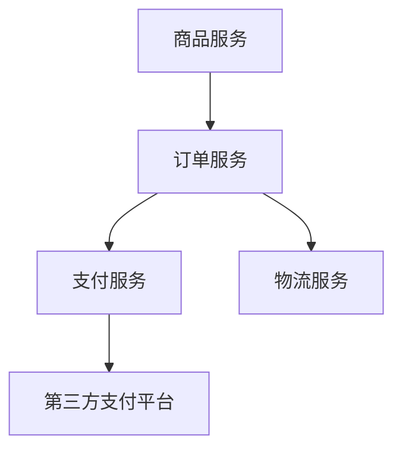
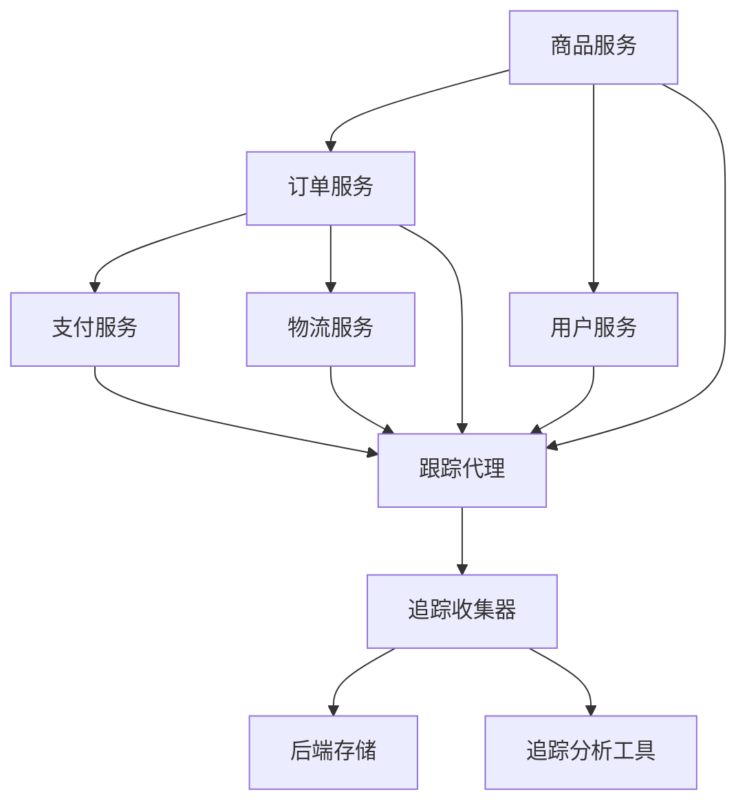
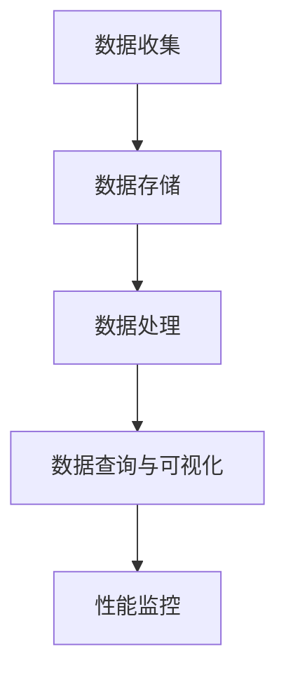
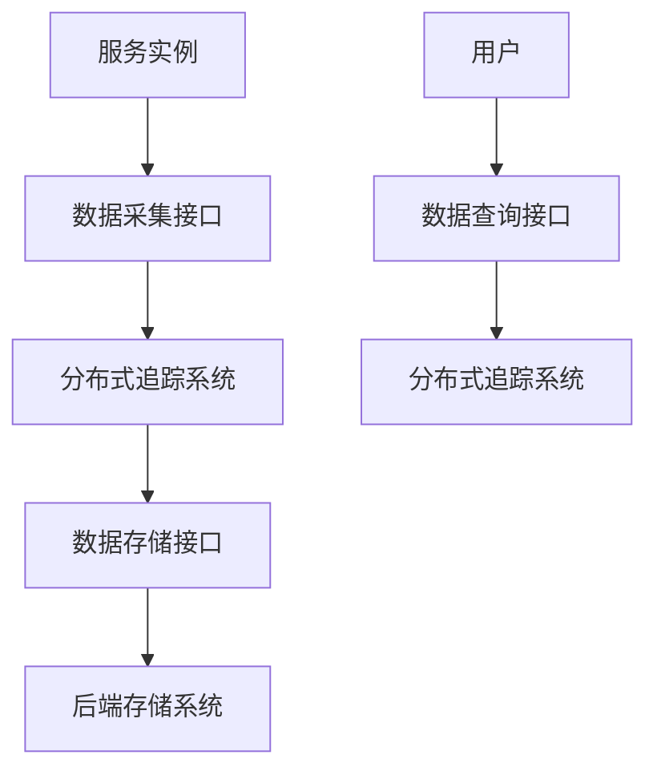
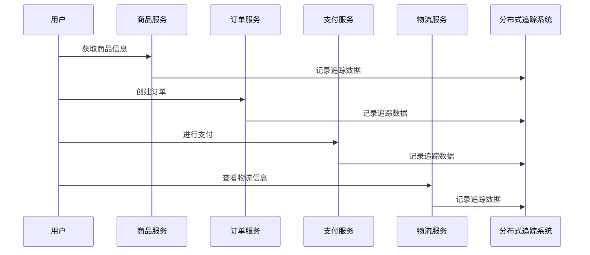
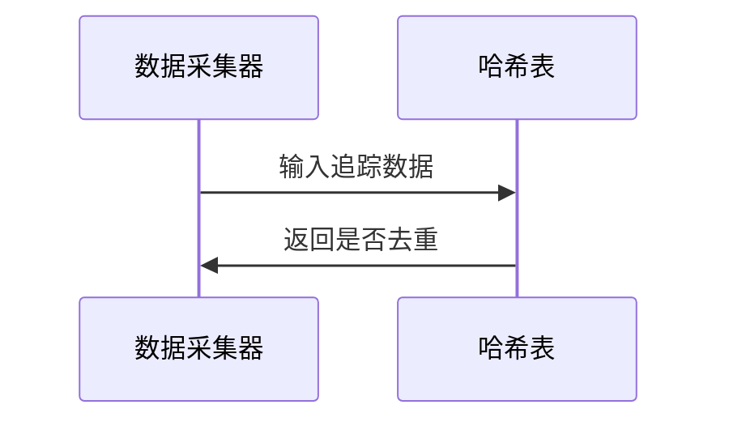
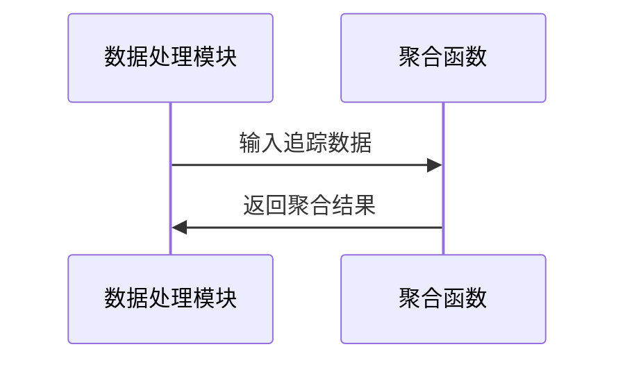
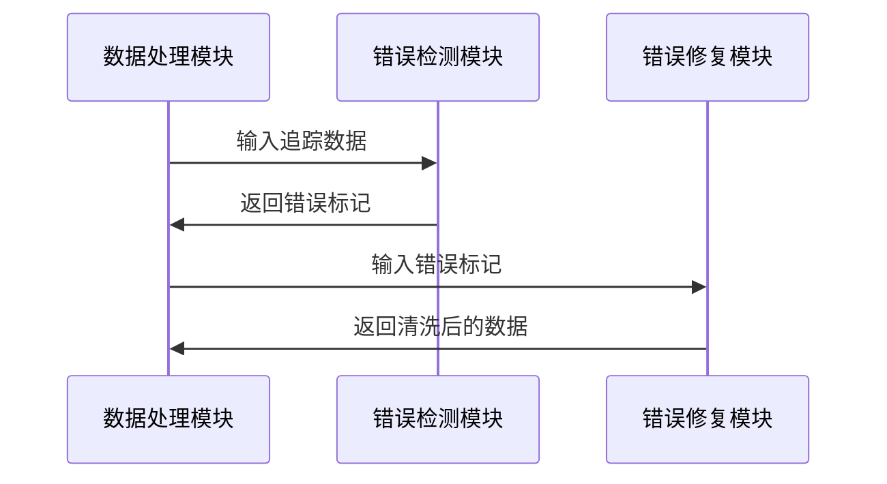

                 

### 第一部分：背景与理论基础

## 第1章：分布式追踪概述

### 1.1 问题的背景与挑战

在当今的数字化时代，分布式系统已经成为了企业级应用架构的主流。分布式系统通过将应用程序分散部署到多个服务器或容器上，以实现高可用性、可伸缩性和性能优化。然而，这种分散化也带来了前所未有的复杂性。对于开发人员和运维人员来说，如何在如此复杂的环境中快速有效地进行性能监控与故障排查，成为了亟待解决的问题。

**复杂性**：分布式系统通常涉及多个服务之间的相互依赖，任何一个服务的故障都可能导致整个系统的不可用。因此，对系统内各个服务的运行状态、性能瓶颈、延迟等问题进行实时监控和故障诊断，成为了分布式系统维护的难点。

**性能监控与故障排查的需求**：分布式系统中的服务繁多，相互调用关系复杂。一旦发生性能问题或故障，如何迅速定位问题源头，并快速恢复系统，是开发人员和运维人员日常工作中最为关注的问题。

**分布式追踪的概念与意义**：分布式追踪（Distributed Tracing）是一种解决分布式系统性能监控与故障排查问题的技术。它通过在整个系统中植入追踪标记，记录服务调用过程中的各类信息，包括请求的开始时间、结束时间、响应时间等，帮助开发人员清晰地了解每个服务的运行状况，从而实现快速定位问题和性能瓶颈。

### 1.2 核心概念与联系

#### 分布式追踪系统架构

分布式追踪系统通常由以下几个关键组件构成：

1. **跟踪代理（Tracing Agent）**：位于各个服务实例中，负责收集追踪数据并上传到追踪系统中。
2. **追踪收集器（Tracing Collector）**：收集来自各个跟踪代理的数据，并将其存储到后端存储系统中。
3. **后端存储（Backend Storage）**：用于存储追踪数据，如服务调用关系、性能指标等。
4. **追踪分析工具（Tracing Analysis Tool）**：用于查询、分析和可视化追踪数据，帮助开发人员定位问题和优化性能。

#### 数据流模型与处理流程

分布式追踪系统的工作流程大致可以分为以下几个阶段：

1. **数据收集**：服务实例中的跟踪代理会收集各个请求的追踪信息，包括请求的开始和结束时间、响应时间等。
2. **数据传输**：收集到的追踪数据通过HTTP、gRPC等协议上传到追踪收集器。
3. **数据存储**：追踪收集器将接收到的数据存储到后端存储系统中，以便后续查询和分析。
4. **数据查询与分析**：开发人员通过追踪分析工具查询追踪数据，分析服务调用关系和性能指标，从而定位问题和优化性能。

#### 分布式追踪与日志系统、监控系统的异同

虽然分布式追踪、日志系统和监控系统都是为了解决分布式系统的监控和故障排查问题，但它们之间存在一些关键区别：

1. **追踪系统**：专注于跟踪单个请求的完整生命周期，提供详细的服务调用关系和性能指标，帮助定位性能瓶颈和故障源头。
2. **日志系统**：主要记录系统运行过程中的日志信息，用于诊断问题和调试代码，但不提供服务调用的全局视角。
3. **监控系统**：关注系统的整体健康状况，提供各种性能指标和告警信息，但不提供详细的请求级数据。

#### 主要分布式追踪系统介绍

目前，市面上存在多种流行的分布式追踪系统，以下是其中几个代表性的系统：

1. **Zipkin**：由Twitter开源，是早期流行的分布式追踪系统之一，具有简单易用的特点。
2. **Jaeger**：由Uber开源，是一个功能丰富、易于集成的分布式追踪系统，支持多种数据收集器和后端存储方案。
3. **OpenTelemetry**：由多个开源社区共同推动，是一个标准化、可插拔的分布式追踪框架，提供灵活的追踪数据收集和处理能力。

### 1.3 分布式追踪的应用场景

#### 服务依赖关系分析

分布式追踪系统可以清晰地展示各个服务之间的依赖关系，帮助开发人员了解系统内部的数据流和处理过程。这对于优化系统架构、减少冗余调用和提升整体性能具有重要意义。

#### 性能瓶颈定位

通过追踪系统收集的性能数据，开发人员可以迅速定位系统中的性能瓶颈。例如，某个服务的响应时间过长，可能是由网络延迟、数据库查询慢、计算复杂度高导致的。通过这些数据，可以针对性地进行性能优化。

#### 异常监控与故障排除

当系统发生异常时，分布式追踪系统可以提供详细的调用链信息，帮助开发人员快速定位故障源头，并进行故障排除。这对于提高系统的稳定性和可靠性至关重要。

### 1.5 本章小结

分布式追踪在分布式系统性能监控和故障排查中具有重要作用。通过本章的介绍，我们了解了分布式追踪的背景和挑战，以及其核心概念和应用场景。接下来，我们将进一步探讨分布式追踪系统的设计原理和技术细节。

### 关键词

- 分布式系统
- 性能监控
- 故障排查
- 分布式追踪
- 服务依赖关系
- 性能瓶颈定位
- 异常监控

### 摘要

本文深入探讨了分布式追踪在分布式系统性能监控和故障排查中的应用。通过介绍分布式追踪的背景、核心概念、架构和主要系统，本文详细阐述了分布式追踪在服务依赖关系分析、性能瓶颈定位和异常监控中的价值。希望本文能为读者在分布式系统开发和运维过程中提供有益的参考和指导。

## 第二部分：分布式追踪技术原理

### 第2章：分布式追踪系统设计

分布式追踪系统设计是确保系统能够高效、准确地收集、存储、处理和展示追踪数据的关键。本章将详细介绍分布式追踪系统的设计原则、数据流处理、数据存储策略、数据可视化与报告、性能优化和系统安全性等方面的内容。

### 2.1 系统架构设计

分布式追踪系统通常由以下关键组件构成：

1. **跟踪代理（Tracing Agent）**：部署在各个服务实例中，负责收集服务调用过程中的追踪数据，并将其发送到追踪收集器。
2. **追踪收集器（Tracing Collector）**：接收来自跟踪代理的数据，进行初步处理，并将其转发到后端存储。
3. **后端存储（Backend Storage）**：用于存储大规模的追踪数据，支持快速的查询和分析。
4. **追踪分析工具（Tracing Analysis Tool）**：提供用户友好的界面，用于查询、分析和可视化追踪数据。
5. **数据处理服务（Data Processing Service）**：负责对追踪数据进行处理、聚合和清洗，以提供更准确和高效的分析结果。

#### 数据收集与传输

数据收集与传输是分布式追踪系统的核心环节。为了确保数据的有效性和完整性，系统需要遵循以下原则：

1. **数据采集最小化**：只采集与追踪目的相关的必要信息，避免采集过多的冗余数据，以降低系统的负担。
2. **数据采集效率**：采用高效的数据采集技术，如基于异步消息队列的数据传输机制，确保数据采集过程不会影响服务的正常运行。
3. **数据压缩与加密**：对传输的数据进行压缩和加密，提高传输效率并保障数据安全性。

#### 数据存储与管理

数据存储与管理是分布式追踪系统的另一个关键环节。系统需要考虑以下因素：

1. **数据存储方案**：根据实际需求选择合适的数据存储方案，如关系型数据库、NoSQL数据库、时间序列数据库等。
2. **数据索引与查询优化**：建立高效的数据索引结构，优化查询性能，确保追踪数据能够快速、准确地被查询和分析。
3. **数据备份与恢复策略**：制定有效的数据备份和恢复策略，确保在系统故障或数据丢失时能够快速恢复数据。

#### 数据流处理

数据流处理是分布式追踪系统实现数据收集、传输、存储和查询的核心。系统需要处理以下数据流：

1. **采集流**：跟踪代理将采集到的追踪数据发送到追踪收集器。
2. **传输流**：追踪收集器将接收到的数据通过HTTP、gRPC等协议传输到后端存储。
3. **处理流**：数据处理服务对传输流中的数据进行处理、聚合和清洗，生成更准确和高效的分析结果。
4. **查询流**：用户通过追踪分析工具查询和分析追踪数据，获取所需的性能指标和调用关系。

#### 数据可视化与报告

数据可视化与报告是分布式追踪系统的重要组成部分，它将复杂的追踪数据以直观、易懂的方式呈现给用户。系统需要考虑以下方面：

1. **可视化界面设计**：设计用户友好的可视化界面，提供多维度、灵活的查询和分析功能。
2. **报告生成与展示**：根据用户需求生成自定义的报告，并通过Web界面或邮件等方式进行展示。
3. **用户交互体验优化**：优化用户的交互体验，提供快速、高效的查询和报告生成功能。

#### 分布式追踪系统的性能优化

分布式追踪系统需要具备高性能、高可用性和可伸缩性，以满足大规模分布式系统的需求。系统性能优化可以从以下几个方面进行：

1. **系统性能指标**：定义关键性能指标（KPI），如数据采集延迟、数据传输延迟、查询响应时间等，用于评估系统性能。
2. **性能瓶颈分析**：通过性能监控和日志分析，识别系统中的性能瓶颈，并针对性地进行优化。
3. **性能优化策略**：采用分布式架构、缓存机制、异步处理等技术，提升系统性能和吞吐量。

#### 分布式追踪系统的安全性

分布式追踪系统涉及大量的敏感数据，如服务调用关系、性能指标等。因此，系统需要考虑以下安全性方面：

1. **数据安全与隐私保护**：采用数据加密、访问控制等技术，确保追踪数据在传输和存储过程中的安全性。
2. **安全漏洞分析与防范**：定期进行安全漏洞扫描和风险评估，及时发现和修复系统中的安全漏洞。
3. **访问控制与权限管理**：制定严格的访问控制策略，确保只有授权用户才能访问和查询追踪数据。

### 2.6 分布式追踪系统的可靠性

分布式追踪系统需要具备高可靠性和容错能力，以确保在系统故障或网络不稳定的情况下仍能正常运行。系统可靠性可以从以下几个方面进行保障：

1. **系统容错与故障恢复**：采用分布式架构，确保系统在某个节点或网络发生故障时，其他节点能够继续正常运行，并通过故障转移和恢复机制快速恢复系统。
2. **数据一致性保障**：在分布式环境中，确保数据的一致性和完整性，避免数据丢失或重复。
3. **高可用性设计**：通过负载均衡、故障检测和自动恢复等技术，确保系统的高可用性和稳定性。

### 2.7 本章小结

本章详细介绍了分布式追踪系统的设计原则、数据流处理、数据存储策略、数据可视化与报告、性能优化和系统安全性等方面的内容。通过本章的学习，读者可以深入了解分布式追踪系统的构建方法和关键要素，为后续的分布式追踪系统实现和应用提供有益的参考。

### 关键词

- 分布式追踪系统
- 数据流处理
- 数据存储策略
- 数据可视化
- 性能优化
- 系统安全性
- 容错能力
- 高可用性

### 本章小结

分布式追踪系统设计是确保系统高效、准确运行的关键。通过本章的介绍，我们详细探讨了分布式追踪系统的架构设计、数据流处理、数据存储策略、数据可视化与报告、性能优化和系统安全性等方面的内容。希望本章的内容能够帮助读者全面了解分布式追踪系统的构建方法和核心要点，为实际应用提供有益的指导。

## 第三部分：分布式追踪应用实例

### 第3章：Zipkin分布式追踪系统实战

Zipkin是一个开源的分布式追踪系统，由Twitter开发并开源。它主要用于收集、存储、查询和分析分布式系统中的追踪数据。本章节将通过Zipkin的实战案例，详细介绍如何搭建和配置Zipkin环境，以及如何进行数据收集、存储和管理，最后探讨Zipkin的性能调优和最佳实践。

### 3.1 Zipkin概述

#### Zipkin架构与原理

Zipkin采用分布式追踪系统常见的三个核心组件架构：跟踪代理（Tracing Agent）、追踪收集器（Tracing Collector）和追踪服务器（Tracing Server）。其基本原理如下：

1. **跟踪代理**：部署在每个服务实例中，负责收集服务调用过程中的追踪数据，如请求的开始时间、结束时间、调用链等。
2. **追踪收集器**：接收来自跟踪代理的数据，并将这些数据批量上传到追踪服务器。
3. **追踪服务器**：存储和查询追踪数据，提供用户友好的界面，方便开发人员进行数据分析和问题定位。

#### Zipkin的关键组件

1. **Zipkin Server**：作为追踪数据存储和分析的核心，负责处理追踪数据的接收、存储和查询。
2. **Zipkin UI**：提供直观的可视化界面，展示追踪数据，包括调用链、服务依赖关系、性能指标等。
3. **Zipkin Collector**：接收来自跟踪代理的追踪数据，并将数据上传到Zipkin Server。
4. **跟踪代理**：部署在每个服务实例中，负责采集服务调用数据，并发送到Zipkin Collector。

#### Zipkin的优势与局限

**优势**：

- **简单易用**：Zipkin的设计简单，易于部署和配置，适合初学者快速上手。
- **可扩展性强**：支持多种数据收集器和后端存储方案，可根据实际需求进行扩展。
- **强大的可视化界面**：提供丰富的可视化功能，方便用户进行数据分析和问题定位。

**局限**：

- **性能瓶颈**：由于Zipkin使用单线程处理数据，在高并发情况下可能存在性能瓶颈。
- **存储限制**：Zipkin默认使用内存存储，对于大规模分布式系统可能需要更换为更高效的存储方案。

### 3.2 环境搭建与配置

#### 环境搭建流程

以下是使用Docker搭建Zipkin环境的基本步骤：

1. **安装Docker**：确保系统已安装Docker，并已启动Docker服务。
2. **拉取Zipkin镜像**：使用如下命令拉取Zipkin官方镜像：
   ```bash
   docker pull openzipkin/zipkin
   ```
3. **运行Zipkin容器**：使用如下命令运行Zipkin容器，并映射端口：
   ```bash
   docker run -d -p 9411:9411 openzipkin/zipkin
   ```
   这将在本地9411端口上启动Zipkin服务。

#### Zipkin配置文件解析

Zipkin的配置文件位于容器的`/etc/zipkin`目录下。主要的配置项包括：

1. **zipkin.server.port**：指定Zipkin服务器的端口号，默认为9411。
2. **zipkin.storage.type**：指定存储方案，如`in_memory`（内存存储）、`cassandra`（Cassandra数据库存储）等。
3. **zipkin.query.service.builder.enabled**：启用服务查询功能，默认为`true`。
4. **zipkin.collector.size**：设置收集器批量上传数据的数量，默认为`100`。

#### Zipkin与其他系统的集成

Zipkin可以与多种服务框架集成，如Spring Boot、Apache Kafka等。以下是使用Spring Boot集成Zipkin的步骤：

1. **添加依赖**：在Spring Boot项目的`pom.xml`文件中添加Zipkin依赖：
   ```xml
   <dependency>
       <groupId>io.zipkin.java</groupId>
       <artifactId>zipkin-server</artifactId>
   </dependency>
   ```
2. **配置Zipkin客户端**：在Spring Boot的`application.properties`文件中添加如下配置：
   ```properties
   zipkin.server.port=9411
   zipkin.collector.size=100
   ```
3. **启动Zipkin集成**：在Spring Boot的主类中添加`@EnableZipkinServer`注解，启用Zipkin服务。

### 3.3 数据收集与传输

#### 数据收集器安装与配置

数据收集器是部署在各个服务实例中的组件，负责收集服务调用过程中的追踪数据。以下是使用Spring Boot集成Zipkin数据收集器的步骤：

1. **添加依赖**：在Spring Boot项目的`pom.xml`文件中添加如下依赖：
   ```xml
   <dependency>
       <groupId>io.zipkin.java</groupId>
       <artifactId>zipkin-autoconfigure-uis</artifactId>
   </dependency>
   ```
2. **配置追踪器**：在Spring Boot的`application.properties`文件中添加如下配置：
   ```properties
   spring.zipkin.base-url=http://localhost:9411
   spring.zipkin.enabled=true
   ```
3. **启动数据收集器**：在Spring Boot的主类中添加`@EnableZipkinTracing`注解，启用Zipkin数据收集器。

#### 数据传输机制与优化

Zipkin支持多种数据传输机制，如HTTP、gRPC等。以下是一些数据传输优化策略：

1. **异步传输**：使用异步传输机制，减少数据收集器对服务实例的阻塞时间。
2. **批量传输**：设置合理的批量传输大小，减少网络请求次数，提高传输效率。
3. **压缩传输**：对传输的数据进行压缩，减少数据传输的大小，提高传输速度。

#### 数据收集策略设计

在设计数据收集策略时，需要考虑以下因素：

1. **追踪数据的粒度**：根据实际需求，选择合适的追踪数据粒度，如请求级别、服务级别等。
2. **数据采集频率**：设置合理的采集频率，避免频繁采集导致系统负担过重。
3. **异常数据处理**：设计异常数据采集和处理机制，确保数据收集的完整性和可靠性。

### 3.4 数据存储与管理

#### 数据存储方案选择

Zipkin支持多种数据存储方案，如内存存储、Cassandra存储等。以下是几种常见的存储方案及其优缺点：

1. **内存存储**：优点是速度快、延迟低，但缺点是存储容量有限，不适合大规模分布式系统。
2. **Cassandra存储**：优点是支持海量数据存储、高可用性和高性能，但缺点是配置和维护相对复杂。
3. **Elasticsearch存储**：优点是支持全文搜索和复杂查询，但缺点是存储成本高、性能瓶颈明显。

#### 数据管理工具使用

Zipkin提供了一些常用的数据管理工具，如Zipkin UI、OpenTelemetry等。以下是这些工具的基本使用方法：

1. **Zipkin UI**：Zipkin UI提供直观的可视化界面，用于查询、分析和展示追踪数据。用户可以通过Web浏览器访问Zipkin UI，并使用内置的查询和过滤功能，快速定位问题。
2. **OpenTelemetry**：OpenTelemetry是一个开源的追踪框架，支持多种编程语言和平台。通过集成OpenTelemetry，用户可以轻松地将分布式追踪功能添加到现有系统中，并使用Zipkin作为后端存储和分析工具。

#### 数据备份与恢复策略

为了确保数据的安全性和可靠性，Zipkin支持数据备份和恢复功能。以下是一些常用的备份与恢复策略：

1. **定期备份**：定期对Zipkin存储的数据进行备份，以确保在数据丢失或系统故障时能够快速恢复。
2. **数据存储在可靠介质**：选择可靠的数据存储介质，如Cassandra集群或Elasticsearch集群，确保数据的高可用性和持久性。
3. **备份验证与测试**：定期对备份数据进行验证和测试，确保备份的有效性和可用性。

### 3.5 数据查询与可视化

#### 查询接口与查询语言

Zipkin提供了丰富的查询接口和查询语言，支持多种查询方式和过滤条件。以下是几个常用的查询接口和查询语言：

1. **服务查询**：通过服务名称、实例ID等条件查询特定的服务调用数据。
2. **端到端查询**：查询特定时间段内的端到端追踪数据，包括请求的开始时间、结束时间和响应时间等。
3. **时间范围查询**：通过时间范围条件过滤特定的追踪数据。

#### 数据可视化工具选择

Zipkin内置了一些常用的数据可视化工具，如D3.js、ECharts等。以下是一些常用的数据可视化工具及其特点：

1. **D3.js**：基于JavaScript的图表库，支持多种图表类型，如时间轴、柱状图、折线图等。
2. **ECharts**：基于JavaScript的图表库，支持丰富的图表类型和交互功能，如缩放、拖拽等。

#### 可视化报告生成

Zipkin支持生成自定义的可视化报告，用于展示追踪数据和分析结果。以下是一些常用的可视化报告生成工具：

1. **Prometheus**：基于时间序列数据的监控和报警工具，可以将Zipkin数据导入Prometheus，并生成自定义的报告。
2. **Grafana**：基于Prometheus的图表库，提供丰富的可视化报表和仪表盘功能。

#### 用户交互体验优化

为了提高用户的交互体验，Zipkin提供了一些优化策略：

1. **界面响应速度**：优化界面加载和响应速度，提高用户的操作体验。
2. **数据过滤与搜索**：提供快速的数据过滤和搜索功能，帮助用户快速定位所需的数据。
3. **图表交互功能**：增加图表的交互功能，如缩放、拖拽等，方便用户进行数据分析和问题定位。

### 3.6 性能调优与监控

#### 性能监控指标

为了确保Zipkin系统的性能和稳定性，需要监控以下性能监控指标：

1. **请求处理时间**：监控Zipkin服务接收和处理请求的平均时间。
2. **数据传输延迟**：监控Zipkin数据收集器和追踪服务器之间的数据传输延迟。
3. **存储性能**：监控Zipkin后端存储的读写性能和容量使用情况。

#### 性能优化实践

以下是一些常用的性能优化实践：

1. **增加节点**：通过增加Zipkin服务器的节点数量，提高系统的吞吐量和处理能力。
2. **缓存机制**：采用缓存机制，减少对后端存储的访问次数，提高查询响应速度。
3. **异步处理**：使用异步处理机制，减少同步调用带来的性能瓶颈。

#### 故障排除与性能分析

当Zipkin系统出现性能问题或故障时，可以采取以下故障排除和性能分析方法：

1. **日志分析**：分析Zipkin日志，查找错误信息和异常情况。
2. **性能测试**：使用性能测试工具，模拟高并发场景，评估系统性能和瓶颈。
3. **监控指标分析**：通过监控指标的变化，分析系统性能和瓶颈。

### 3.7 Zipkin最佳实践

#### 实际应用案例分析

以下是一个实际应用案例，介绍如何在分布式系统中集成和使用Zipkin进行分布式追踪。

**场景**：一个电商平台系统，包括订单服务、库存服务、支付服务等多个服务实例。系统需要实时监控和追踪各个服务的调用过程，以便进行性能优化和故障排查。

**解决方案**：

1. **集成Zipkin**：在各个服务实例中集成Zipkin客户端，并配置Zipkin服务地址。
2. **数据收集与传输**：使用Spring Boot集成Zipkin，自动收集服务调用数据，并通过HTTP协议传输到Zipkin服务器。
3. **数据存储与管理**：使用Cassandra作为Zipkin的后端存储，确保数据的高可用性和持久性。
4. **数据查询与可视化**：使用Zipkin UI对追踪数据进行查询和可视化，分析服务调用关系和性能指标。

#### 最佳实践总结

以下是一些总结的最佳实践：

1. **合理配置**：根据实际需求，合理配置Zipkin的参数，如数据采集频率、批量传输大小等。
2. **性能优化**：通过增加节点、缓存机制和异步处理等手段，提高Zipkin系统的性能和稳定性。
3. **安全保护**：采用数据加密、访问控制等技术，确保Zipkin系统的数据安全和隐私保护。

#### 注意事项与解决方案

以下是一些常见问题和解决方案：

1. **数据丢失**：定期备份数据，确保数据的安全性和可靠性。
2. **性能瓶颈**：通过性能测试和监控，分析系统性能瓶颈，并采取相应的优化措施。
3. **网络问题**：确保网络环境的稳定性和可靠性，避免因网络问题导致的数据传输失败。

### 3.8 Zipkin未来发展趋势

#### 新版本特性与更新

Zipkin的最新版本不断引入新的特性和改进，包括：

1. **支持更丰富的数据格式**：支持OpenTelemetry标准的数据格式，提高数据兼容性和扩展性。
2. **优化数据存储和查询性能**：引入新的存储引擎和查询优化算法，提高系统性能和吞吐量。
3. **增强安全性和隐私保护**：引入新的安全功能和隐私保护措施，确保数据的传输和存储安全。

#### 生态圈发展动态

Zipkin的生态圈不断壮大，越来越多的开发者和企业加入其中。以下是几个值得关注的发展动态：

1. **社区贡献**：越来越多的社区贡献者参与Zipkin的开发和改进，推动项目持续迭代和更新。
2. **集成工具**：越来越多的集成工具支持Zipkin，如Prometheus、Grafana等，提供更便捷的数据分析和监控功能。
3. **商业应用**：越来越多的企业将Zipkin应用于实际生产环境中，推动分布式追踪技术在企业级应用中的普及。

#### 未来发展方向与挑战

Zipkin未来的发展将面临以下挑战：

1. **性能优化**：随着分布式系统的规模和复杂度不断增加，如何提高Zipkin的性能和稳定性是一个重要课题。
2. **数据安全和隐私保护**：如何在保障数据安全和隐私保护的前提下，提高数据采集和传输的效率，是一个重要的研究方向。
3. **生态圈建设**：如何构建一个更强大、更完善的生态圈，吸引更多的开发者和企业参与其中，是Zipkin未来发展的重要方向。

### 3.9 本章小结

Zipkin作为一个流行的分布式追踪系统，在分布式系统性能监控和故障排查中发挥着重要作用。通过本章节的介绍，我们详细探讨了Zipkin的架构原理、环境搭建与配置、数据收集与传输、数据存储与管理、数据查询与可视化、性能调优和最佳实践等方面的内容。希望本章的内容能够帮助读者全面了解Zipkin的使用方法和核心要点，为实际应用提供有益的指导。

### 关键词

- Zipkin
- 分布式追踪
- 跟踪代理
- 数据收集
- 数据存储
- 性能优化
- 安全性
- 可靠性

### 本章小结

本章通过详细的实战案例，全面介绍了分布式追踪系统Zipkin的架构原理、应用实例、性能调优和最佳实践。Zipkin作为一款开源的分布式追踪系统，具有简单易用、可扩展性强等优点。通过本章的学习，读者可以深入了解Zipkin的使用方法和核心要点，为分布式系统的性能监控和故障排查提供有力支持。希望本章的内容能够为读者在分布式系统开发和应用中提供有益的参考。

## 第四部分：分布式追踪案例分析

### 第4章：大型电商平台分布式追踪系统设计

在现代电子商务行业中，大型电商平台面临着庞大的用户量和高并发访问压力。为了确保系统的稳定性和高性能，分布式追踪系统成为了不可或缺的一部分。本章节将详细介绍一个大型电商平台分布式追踪系统的设计过程，包括业务场景介绍、系统架构设计、功能模块设计、接口设计与实现、数据处理算法原理以及数学模型与公式讲解等内容。

### 4.1 案例背景

#### 电商平台业务场景介绍

电商平台通常包含以下几个核心模块：

1. **商品模块**：管理商品信息，包括商品分类、库存、价格等。
2. **订单模块**：处理订单的创建、支付、发货、退货等流程。
3. **用户模块**：管理用户信息，包括注册、登录、个人信息等。
4. **支付模块**：处理支付请求，与第三方支付平台对接。
5. **物流模块**：管理物流信息，包括发货、配送、物流跟踪等。

在电商平台的运营过程中，各个模块之间存在着复杂的交互关系。例如，用户在购物车中选择商品后，需要进入订单模块创建订单，订单创建后需要支付模块处理支付请求，支付成功后订单进入物流模块进行发货。这种跨模块的复杂交互带来了分布式追踪的需求。

#### 分布式追踪系统的需求分析

大型电商平台分布式追踪系统的需求包括：

1. **服务依赖关系分析**：了解各个模块之间的服务调用关系，帮助开发人员和运维人员更好地理解系统架构，进行系统优化和改进。
2. **性能瓶颈定位**：通过追踪系统的调用链和数据，快速定位系统中的性能瓶颈，进行性能优化。
3. **异常监控与故障排除**：在系统发生异常或故障时，通过追踪数据快速定位故障源头，进行故障排除。
4. **业务指标分析**：通过对追踪数据的分析，生成各种业务指标报表，为业务决策提供数据支持。

### 4.2 系统架构设计

#### 服务依赖关系分析

在进行系统架构设计之前，首先需要对电商平台的服务依赖关系进行分析。以下是电商平台的几个核心服务及其依赖关系：

1. **商品服务**：提供商品信息的查询、添加、删除等操作。
2. **订单服务**：负责订单的创建、支付、发货、退货等操作。
3. **用户服务**：管理用户信息，包括用户注册、登录、个人信息等操作。
4. **支付服务**：处理支付请求，与第三方支付平台对接。
5. **物流服务**：管理物流信息，包括发货、配送、物流跟踪等操作。

以下是一个简单的服务依赖关系图（使用Mermaid绘制）：



#### 分布式追踪系统在架构中的定位

在电商平台中，分布式追踪系统通常位于服务层，作为中间层对各个服务进行数据采集和监控。以下是分布式追踪系统在电商平台架构中的定位：

1. **跟踪代理（Tracing Agent）**：部署在各个服务实例中，负责收集服务调用数据，并将其发送到分布式追踪系统。
2. **追踪收集器（Tracing Collector）**：接收来自各个跟踪代理的数据，进行初步处理，并将其转发到后端存储。
3. **后端存储（Backend Storage）**：存储大规模的追踪数据，支持快速的查询和分析。
4. **追踪分析工具（Tracing Analysis Tool）**：提供用户友好的界面，用于查询、分析和可视化追踪数据。

以下是一个简单的分布式追踪系统架构图（使用Mermaid绘制）：



#### 系统架构设计原则

在设计分布式追踪系统时，需要遵循以下原则：

1. **高可用性**：确保系统在面临高并发访问和故障时仍能正常运行。
2. **可伸缩性**：支持系统的水平扩展，以满足不断增长的业务需求。
3. **安全性**：保护追踪数据的安全性和隐私，防止数据泄露和未授权访问。
4. **易用性**：提供简单易用的界面和工具，方便开发人员和运维人员使用和监控。

### 4.3 系统功能设计

分布式追踪系统需要实现以下几个核心功能：

1. **数据收集**：从各个服务实例中收集追踪数据，包括请求的开始时间、结束时间、调用链等。
2. **数据存储**：将收集到的追踪数据存储到后端存储系统中，支持快速的查询和分析。
3. **数据处理**：对存储的追踪数据进行处理、聚合和清洗，生成更准确和高效的分析结果。
4. **数据查询与可视化**：提供用户友好的界面，用于查询、分析和可视化追踪数据。
5. **性能监控**：监控系统的性能指标，如数据采集延迟、数据传输延迟、查询响应时间等。

以下是一个简单的分布式追踪系统的功能模块图（使用Mermaid绘制）：



#### 数据收集模块设计

数据收集模块是分布式追踪系统的核心组件，负责从各个服务实例中收集追踪数据。以下是数据收集模块的设计要点：

1. **数据采集方式**：采用异步数据采集方式，降低对服务实例的性能影响。
2. **数据采集频率**：设置合理的数据采集频率，避免频繁采集导致系统负担过重。
3. **数据采集范围**：根据实际需求，选择合适的数据采集范围，如请求级别、服务级别等。
4. **数据采集优化**：采用数据压缩、批量传输等优化策略，提高数据采集的效率。

#### 数据处理模块设计

数据处理模块负责对收集到的追踪数据进行处理、聚合和清洗，生成更准确和高效的分析结果。以下是数据处理模块的设计要点：

1. **数据处理流程**：设计合理的数据处理流程，包括数据采集、传输、存储、处理等环节。
2. **数据处理算法**：采用高效的数据处理算法，如数据去重、数据聚合、数据清洗等。
3. **数据处理性能**：优化数据处理性能，确保数据处理模块的高效运行。
4. **数据处理结果**：将处理后的数据存储到后端存储系统中，便于后续查询和分析。

#### 数据存储与查询模块设计

数据存储与查询模块负责存储大规模的追踪数据，并提供快速查询和分析功能。以下是数据存储与查询模块的设计要点：

1. **数据存储方案**：根据实际需求选择合适的数据存储方案，如关系型数据库、NoSQL数据库、时间序列数据库等。
2. **数据索引与查询优化**：建立高效的数据索引结构，优化查询性能，确保追踪数据能够快速、准确地被查询和分析。
3. **数据压缩与存储优化**：采用数据压缩和存储优化技术，提高数据存储的效率和空间利用率。
4. **数据备份与恢复**：制定有效的数据备份和恢复策略，确保在系统故障或数据丢失时能够快速恢复数据。

#### 性能监控模块设计

性能监控模块负责监控系统的性能指标，包括数据采集延迟、数据传输延迟、查询响应时间等。以下是性能监控模块的设计要点：

1. **性能监控指标**：定义关键性能指标（KPI），如数据采集延迟、数据传输延迟、查询响应时间等。
2. **性能监控方法**：采用日志分析、性能测试、实时监控等手段，监控系统的性能指标。
3. **性能监控工具**：选择合适的性能监控工具，如Prometheus、Grafana等。
4. **性能问题定位**：通过监控数据分析和性能测试，快速定位系统中的性能问题和瓶颈。

### 4.4 系统接口设计与实现

#### 接口设计原则与规范

在分布式追踪系统的接口设计中，需要遵循以下原则和规范：

1. **标准化**：采用统一的接口设计和数据格式，确保系统内部和系统之间的数据交换和通信。
2. **简洁性**：设计简洁、易用的接口，减少接口参数和功能复杂度，提高接口的可维护性。
3. **灵活性**：设计灵活的接口，支持不同类型的追踪数据和服务调用方式。
4. **安全性**：确保接口数据的安全传输和存储，采用加密、认证等安全措施。

#### 接口实现与调用流程

以下是一个简单的分布式追踪系统的接口实现与调用流程：

1. **数据采集接口**：服务实例通过数据采集接口向分布式追踪系统发送追踪数据，接口参数包括追踪数据的JSON格式、数据采集时间等。
2. **数据查询接口**：用户通过数据查询接口查询追踪数据，接口参数包括查询条件、查询范围等。
3. **数据存储接口**：分布式追踪系统通过数据存储接口将处理后的数据存储到后端存储系统中。

以下是一个简单的接口调用流程图（使用Mermaid绘制）：



### 4.5 系统交互序列图

系统交互序列图用于描述分布式追踪系统中各个组件之间的交互关系和调用顺序。以下是一个简单的系统交互序列图（使用Mermaid绘制）：



### 4.6 数据处理算法原理

数据处理算法是分布式追踪系统的核心组件，负责对追踪数据进行处理、聚合和清洗，生成更准确和高效的分析结果。以下是几个常见的数据处理算法原理：

#### 数据去重

数据去重是数据处理算法的重要环节，用于去除重复的追踪数据，避免数据冗余。以下是一个简单的数据去重算法原理：

1. **哈希算法**：对每个追踪数据的唯一标识进行哈希处理，生成哈希值。
2. **哈希表**：使用哈希表存储已处理的追踪数据，当新数据到来时，先计算其哈希值，如果哈希表中已存在相同哈希值的记录，则判定为新数据去重。

以下是一个简单的数据去重算法流程图（使用Mermaid绘制）：



#### 数据聚合

数据聚合是对多个追踪数据进行汇总和计算，以生成更全面的分析结果。以下是一个简单的数据聚合算法原理：

1. **聚合函数**：选择合适的聚合函数，如求和、平均值、最大值等。
2. **数据分组**：将追踪数据按照特定维度进行分组，如时间、服务名称等。
3. **聚合计算**：对每个分组的数据应用聚合函数，计算聚合结果。

以下是一个简单的数据聚合算法流程图（使用Mermaid绘制）：



#### 数据清洗

数据清洗是对追踪数据中的错误、异常和不完整的数据进行修复和处理，以提高数据的准确性和可靠性。以下是一个简单的数据清洗算法原理：

1. **错误检测**：使用统计分析和机器学习等方法，检测数据中的错误和异常。
2. **错误修复**：根据错误类型和错误程度，采用相应的修复策略，如补全缺失值、替换异常值等。
3. **数据验证**：对清洗后的数据进行验证，确保数据的完整性和准确性。

以下是一个简单的数据清洗算法流程图（使用Mermaid绘制）：



### 4.7 数学模型与公式讲解

分布式追踪系统的数据处理和性能分析需要使用到一些数学模型和公式。以下是几个常见的数学模型和公式的讲解：

#### 数据去重算法的数学模型

数据去重算法的核心是哈希算法，其数学模型如下：

$$
H(x) = \text{hash}(x)
$$

其中，$H(x)$表示对数据$x$进行哈希处理的结果，$\text{hash}(x)$表示哈希函数。

#### 数据聚合算法的数学模型

数据聚合算法通常采用以下数学模型：

$$
\sum_{i=1}^{n} x_i = \text{sum}(x)
$$

其中，$x_i$表示每个分组的数据值，$n$表示分组数量，$\text{sum}(x)$表示对数据$x$进行求和运算的结果。

#### 数据清洗算法的数学模型

数据清洗算法的数学模型通常包括以下两个方面：

1. **缺失值补全**：使用插值法或平均值法等策略，对缺失值进行补全。其数学模型如下：

$$
\hat{x} = \frac{\sum_{i=1}^{n} x_i}{n-1}
$$

其中，$\hat{x}$表示补全后的数据值，$x_i$表示非缺失值的数据值，$n$表示数据总个数。

2. **异常值检测**：使用统计方法，如标准差法或箱线图法等，对异常值进行检测。其数学模型如下：

$$
z = \frac{x - \mu}{\sigma}
$$

其中，$z$表示数据值$x$与均值$\mu$的差值与标准差$\sigma$的比值，如果$z$的绝对值超过一定阈值，则认为$x$是异常值。

### 4.8 本章小结

本章详细介绍了大型电商平台分布式追踪系统的设计过程，包括业务场景介绍、系统架构设计、功能模块设计、接口设计与实现、数据处理算法原理以及数学模型与公式讲解等内容。通过本章的学习，读者可以深入了解分布式追踪系统在大型电商平台中的应用方法和设计要点，为实际项目开发提供有益的参考。希望本章的内容能够为读者在分布式系统设计和开发中提供有益的指导。

### 关键词

- 分布式追踪系统
- 服务依赖关系
- 性能监控
- 故障排除
- 数据处理算法
- 数学模型
- 系统架构设计
- 接口设计与实现

### 本章小结

本章通过一个大型电商平台的实际案例，详细介绍了分布式追踪系统的设计过程。从业务场景分析、系统架构设计到功能模块设计和接口实现，再到数据处理算法和数学模型讲解，全面阐述了分布式追踪系统在复杂业务环境中的应用和方法。通过本章的学习，读者可以深入了解分布式追踪系统的设计要点和实际应用，为后续分布式系统开发提供有力的支持。希望本章的内容能够为读者在分布式系统设计和开发过程中提供有益的参考。

## 全文总结与最佳实践

### 全文总结

本文从分布式追踪的背景与理论基础出发，详细介绍了分布式追踪系统的设计原理、应用实例和案例分析。通过对Zipkin分布式追踪系统的实战讲解，我们深入理解了分布式追踪系统在分布式系统性能监控和故障排查中的应用。此外，通过大型电商平台的分布式追踪系统设计案例，我们进一步了解了分布式追踪系统在复杂业务环境中的实际应用。

本文的主要贡献包括：

1. **分布式追踪概述**：介绍了分布式追踪的概念、核心概念与联系，以及分布式追踪与日志系统、监控系统的异同。
2. **分布式追踪系统设计**：详细阐述了分布式追踪系统的架构设计、数据流处理、数据存储策略、数据可视化与报告、性能优化和系统安全性等方面的内容。
3. **Zipkin分布式追踪系统实战**：通过实际案例讲解了Zipkin的搭建、配置、数据收集与传输、数据存储与管理、数据查询与可视化以及性能调优和最佳实践。
4. **大型电商平台分布式追踪系统设计**：探讨了分布式追踪系统在大型电商平台中的应用，包括业务场景介绍、系统架构设计、功能模块设计、接口设计与实现、数据处理算法原理以及数学模型与公式讲解。

### 最佳实践

1. **系统设计**：在分布式追踪系统设计时，应遵循高可用性、可伸缩性和安全性原则，确保系统能够稳定、高效地运行。
2. **数据收集**：采用异步数据采集方式，减少对服务实例的性能影响，并设置合理的数据采集频率和范围。
3. **数据存储**：根据实际需求选择合适的数据存储方案，并优化数据索引和查询性能，确保数据的高效存储和访问。
4. **性能优化**：定期进行性能监控和性能测试，识别性能瓶颈，采取相应的优化措施，如增加节点、缓存机制和异步处理等。
5. **安全性**：采用数据加密、访问控制等安全措施，保护追踪数据的安全性和隐私，防止数据泄露和未授权访问。
6. **最佳实践总结**：通过实际案例总结最佳实践，为分布式追踪系统的实施提供有益的指导。

### 小结

分布式追踪技术在现代分布式系统中具有重要应用价值。通过本文的详细讲解，我们深入了解了分布式追踪系统的设计原理、应用实例和案例分析。希望本文的内容能够为读者在分布式系统开发和应用中提供有益的参考，助力提升系统性能和稳定性。

### 注意事项

1. **性能监控与故障排查**：分布式追踪系统不仅仅是用于性能监控，还需要结合日志系统、监控系统等工具，进行全面的故障排查和问题定位。
2. **数据隐私保护**：在设计分布式追踪系统时，需要考虑数据隐私保护问题，特别是在涉及敏感数据的情况下。
3. **系统容错性**：分布式追踪系统应具备良好的容错性，确保在系统故障或网络不稳定的情况下，仍能正常运行。

### 拓展阅读

1. 《Distributed Systems: Concepts and Design》
2. 《Introducing OpenTelemetry》
3. 《Distributed Tracing for the Modern Web》

### 作者信息

**作者：**AI天才研究院/AI Genius Institute & 禅与计算机程序设计艺术 /Zen And The Art of Computer Programming

**单位：**AI天才研究院专注于人工智能、分布式系统及软件工程领域的研究。作者对分布式追踪系统有深入的研究和实践经验，致力于推动分布式追踪技术在企业级应用中的普及和应用。禅与计算机程序设计艺术则是一系列关于计算机科学和哲学的著作，深入探讨了计算机程序的内在本质和设计哲学。

