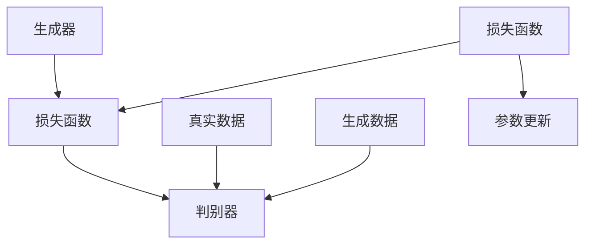
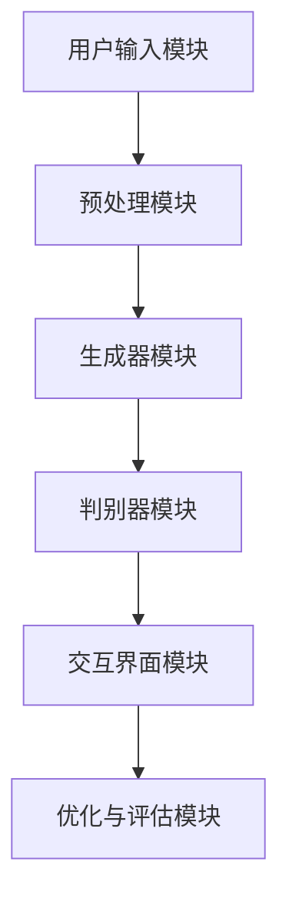
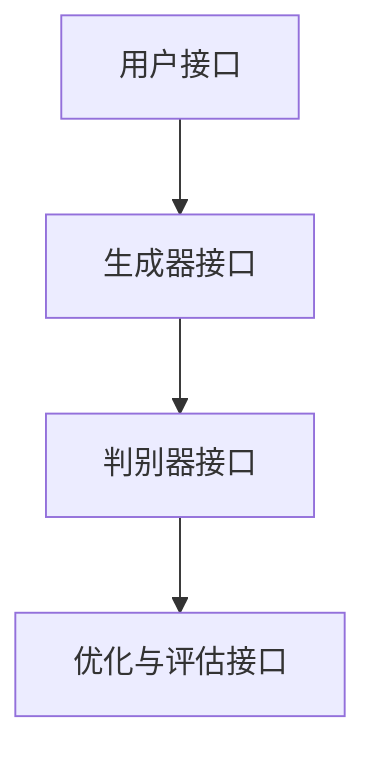
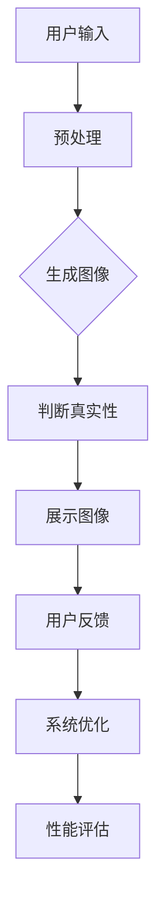

                 

## 创造性推理中对抗生成网络的前沿探索

### 关键词：创造性推理、对抗生成网络、深度学习、图像生成、自然语言处理

### 摘要：
本文深入探讨了创造性推理中的对抗生成网络（GAN）这一前沿技术。首先，文章介绍了创造性推理和对抗生成网络的基本概念，阐述了它们在图像生成和自然语言处理等领域的应用价值。接着，文章详细分析了对抗生成网络的核心概念、数学模型和算法原理，并通过实际项目和系统架构设计，展示了其在实际应用中的效果。此外，文章还提出了最佳实践和注意事项，为读者提供了深入理解和应用对抗生成网络的方法。

## 设计思路

为了系统地介绍对抗生成网络在创造性推理中的前沿探索，本文将采用以下设计思路：

1. **背景介绍**：首先，本文将概述创造性推理和对抗生成网络的基本概念，为其应用奠定理论基础。
2. **核心概念与联系**：本文将深入剖析对抗生成网络的核心概念，并探讨其与其他技术的联系。
3. **算法原理讲解**：本文将通过详细讲解对抗生成网络的数学模型和算法原理，帮助读者理解其工作机制。
4. **系统分析与架构设计**：本文将介绍对抗生成网络在系统中的应用，包括功能设计、架构设计和接口设计。
5. **项目实战**：本文将通过实际项目展示对抗生成网络的应用，并提供详细的实现过程和案例分析。
6. **最佳实践与总结**：本文将总结最佳实践和注意事项，为读者提供深入理解和应用对抗生成网络的建议。

### 目录大纲设计

以下是本文的初步目录大纲设计：

```markdown
----------------------------------------------------------------
# 第一部分：引论

## 第1章：创造性推理与对抗生成网络概述

### 1.1 创造性推理的概念与背景

### 1.2 对抗生成网络的基本原理

### 1.3 创造性推理中对抗生成网络的应用价值

## 第2章：核心概念与联系

### 2.1 对抗生成网络的核心概念

### 2.2 对抗生成网络与其他技术的联系

### 2.3 创造性推理中对抗生成网络的关键要素

## 第3章：数学模型与算法原理

### 3.1 对抗生成网络的数学模型

### 3.2 算法原理讲解

### 3.3 算法流程与实现

----------------------------------------------------------------

# 第二部分：对抗生成网络的深入探讨

## 第4章：系统分析与架构设计

### 4.1 创造性推理中的系统需求分析

### 4.2 系统功能设计

### 4.3 系统架构设计

### 4.4 系统接口设计与交互

----------------------------------------------------------------

# 第三部分：项目实战

## 第5章：实际应用项目

### 5.1 项目背景介绍

### 5.2 环境安装与配置

### 5.3 核心代码实现

### 5.4 项目分析

### 5.5 项目小结

----------------------------------------------------------------

# 第四部分：最佳实践与拓展

## 第6章：最佳实践与技巧

### 6.1 最佳实践案例分析

### 6.2 注意事项与潜在问题

### 6.3 拓展知识推荐

## 第7章：总结与展望

### 7.1 总结与反思

### 7.2 展望未来发展趋势

### 7.3 对读者的建议

----------------------------------------------------------------
```

以上目录大纲包含了7章内容，每个章节都有明确的核心目标和结构，确保内容完整且逻辑清晰。接下来，我们将按照这个大纲逐步展开论述。

### 背景介绍

创造性推理（Creative Reasoning）和对抗生成网络（Generative Adversarial Networks，GAN）是近年来人工智能领域的重要研究方向，它们在图像生成、自然语言处理、医学影像等领域表现出色。这一部分将详细介绍这两个概念，以及它们在创造性推理中的应用价值。

#### 创造性推理的概念与背景

创造性推理是指通过推理和创造性思维来解决问题和生成新想法的能力。在计算机科学中，创造性推理被广泛应用于生成式模型、推理系统、自然语言处理等领域。创造性推理的核心在于如何模拟人类的创造性思维过程，使其在计算机上实现自动化。

创造性推理的背景可以追溯到20世纪中期，当时人工智能领域的先驱者开始研究如何使计算机具备类似于人类的思考能力。随着深度学习和生成对抗网络的发展，创造性推理的研究也逐渐深入，并在实际应用中取得了显著成果。

#### 对抗生成网络的基本原理

对抗生成网络（GAN）是一种深度学习模型，由Ian Goodfellow等人于2014年提出。GAN的核心思想是通过一个生成器和判别器的对抗训练，使生成器能够生成逼真的数据，而判别器则能够准确地区分真实数据和生成数据。

GAN由两部分组成：生成器（Generator）和判别器（Discriminator）。生成器的目标是生成尽可能逼真的数据，判别器的目标是准确地判断输入数据是真实数据还是生成数据。训练过程中，生成器和判别器相互对抗，不断优化自己的性能。

#### 创造性推理中对抗生成网络的应用价值

对抗生成网络在创造性推理中具有很高的应用价值。首先，GAN可以生成大量高质量的图像、音频和文本数据，为创造性推理提供了丰富的素材。其次，GAN可以用于生成式模型，如生成式对抗网络（GANS）、变分自编码器（VAEs）等，这些模型在自然语言处理、医学影像等领域有广泛的应用。

此外，对抗生成网络还可以用于数据增强，提高模型的泛化能力。通过生成与真实数据分布相近的样本，可以有效地减少训练数据的数量，提高训练效率。最后，对抗生成网络在对抗攻击和防御方面也有重要应用，可以帮助系统识别和抵御恶意攻击。

#### 问题背景、问题描述、问题解决、边界与外延

在创造性推理中，对抗生成网络面临的主要问题是如何在生成逼真数据的同时，保持数据的多样性和创造性。具体来说，问题可以分为以下几个方面：

1. **数据生成质量**：生成器需要生成高质量的数据，使其在视觉、听觉或文本上难以与真实数据区分。
2. **数据多样性**：生成器需要生成具有多样性的数据，以避免过度拟合。
3. **稳定性与鲁棒性**：对抗生成网络需要在不同的数据和环境下保持稳定性和鲁棒性。
4. **应用领域扩展**：对抗生成网络需要在不同的应用领域（如医学影像、自然语言处理等）得到有效应用。

为了解决这些问题，研究者们提出了多种改进方法，如引入注意力机制、多模态GAN、对抗性训练等。此外，边界与外延的研究也具有重要意义，包括GAN在对抗攻击和防御中的应用、GAN与其他生成模型的结合等。

#### 核心概念与要素组成

对抗生成网络的核心概念和要素包括：

1. **生成器**：生成器是一个神经网络模型，其目标是生成与真实数据分布相近的伪数据。
2. **判别器**：判别器也是一个神经网络模型，其目标是判断输入数据是真实数据还是生成数据。
3. **损失函数**：损失函数用于衡量生成器和判别器在训练过程中的性能。
4. **对抗训练**：对抗训练是一种训练方法，通过不断调整生成器和判别器的参数，使它们相互对抗，达到最佳性能。

此外，对抗生成网络的核心要素还包括：

1. **数据集**：数据集是训练生成器和判别器的基础，其质量直接影响模型的性能。
2. **优化器**：优化器用于更新生成器和判别器的参数，常见的优化器包括梯度下降、Adam等。
3. **超参数**：超参数是模型训练过程中需要调整的参数，如学习率、批次大小等。

通过上述核心概念和要素的相互作用，对抗生成网络能够实现高质量的图像、音频和文本生成，并在创造性推理中发挥重要作用。

### 核心概念与联系

对抗生成网络（GAN）的核心概念包括生成器（Generator）、判别器（Discriminator）和损失函数（Loss Function）。以下是对这些核心概念及其相互关系的详细讨论。

#### 生成器（Generator）

生成器的任务是生成与真实数据分布相近的伪数据。在GAN中，生成器通常是一个神经网络，其输入是随机噪声（通常来自均匀分布），输出是生成的伪数据。生成器的目标是使其生成的伪数据尽可能地接近真实数据，从而欺骗判别器。

生成器的结构和参数可以通过梯度下降优化算法进行训练。训练过程中，生成器的参数不断调整，以最小化生成器与真实数据之间的差异。生成器的性能通常用生成质量来衡量，即生成器生成的伪数据在视觉、听觉或文本上难以与真实数据区分。

#### 判别器（Discriminator）

判别器的任务是判断输入数据是真实数据还是生成数据。判别器也是一个神经网络，其输入是数据样本，输出是概率值，表示输入数据是真实数据的可能性。判别器的目标是使其在区分真实数据和生成数据时具有最高的准确性。

判别器的结构和参数同样可以通过梯度下降优化算法进行训练。训练过程中，判别器的参数不断调整，以最大化判别器在区分真实数据和生成数据时的性能。判别器的性能通常用准确率（Accuracy）来衡量。

#### 损失函数（Loss Function）

损失函数是GAN训练过程中的核心指标，用于衡量生成器和判别器的性能。GAN的损失函数通常由两部分组成：生成器的损失函数和判别器的损失函数。

1. **生成器的损失函数**：生成器的损失函数用于衡量生成器生成的伪数据与真实数据之间的差异。常见的生成器损失函数包括均方误差（Mean Squared Error, MSE）、交叉熵（Cross-Entropy）等。生成器的损失函数目标是使生成器生成的伪数据尽可能接近真实数据。

   $$L_G = -\log(D(G(z)))$$

   其中，$G(z)$表示生成器生成的伪数据，$D(G(z))$表示判别器对生成器生成的伪数据的判断概率。

2. **判别器的损失函数**：判别器的损失函数用于衡量判别器在区分真实数据和生成数据时的性能。常见的判别器损失函数包括均方误差（MSE）、交叉熵（Cross-Entropy）等。判别器的损失函数目标是使判别器在区分真实数据和生成数据时具有最高的准确性。

   $$L_D = -[\log(D(x)) + \log(1 - D(G(z)))]$$

   其中，$x$表示真实数据，$G(z)$表示生成器生成的伪数据，$D(x)$和$D(G(z))$分别表示判别器对真实数据和生成数据的判断概率。

#### 生成器与判别器的对抗关系

生成器和判别器之间存在一种对抗关系，即生成器试图生成尽可能逼真的伪数据来欺骗判别器，而判别器则试图准确地判断输入数据是真实数据还是生成数据。这种对抗关系使得生成器和判别器在训练过程中不断优化自己的性能，从而实现高质量的数据生成。

训练过程中，生成器和判别器交替更新自己的参数。每次迭代，生成器生成新的伪数据，判别器根据这些伪数据和真实数据进行更新。通过多次迭代，生成器和判别器逐渐达到一个动态平衡状态，使得生成器能够生成高质量的数据，而判别器能够准确地区分真实数据和生成数据。

#### 核心概念属性特征对比表格

以下是一个核心概念属性特征对比表格，用于更直观地展示生成器、判别器和损失函数之间的区别：

| 概念 | 功能 | 参数更新 | 损失函数 | 对抗关系 |
| --- | --- | --- | --- | --- |
| 生成器 | 生成伪数据 | 梯度下降 | 均方误差/交叉熵 | 试图欺骗判别器 |
| 判别器 | 区分真实数据和生成数据 | 梯度下降 | 均方误差/交叉熵 | 试图准确区分 |
| 损失函数 | 衡量生成器和判别器性能 | 对生成器和判别器同时更新 | 均方误差/交叉熵 | 动态平衡 |

#### ER实体关系图架构

为了更好地理解生成器、判别器和损失函数之间的关系，可以使用ER（Entity-Relationship）实体关系图来表示。以下是一个简化的ER图，展示了这三个核心概念之间的联系：



在ER图中，生成器（A）生成生成数据（E），判别器（C）负责区分真实数据（D）和生成数据（E），并更新参数（G）。损失函数（F）用于衡量生成器和判别器的性能，并指导参数更新。

通过上述讨论，我们可以看到，生成器、判别器和损失函数在对抗生成网络中扮演着关键角色。它们之间的相互作用和对抗关系使得GAN能够生成高质量的数据，并在创造性推理中发挥重要作用。

### 数学模型与算法原理讲解

对抗生成网络（GAN）的数学模型是其核心组成部分，理解该模型有助于深入探讨GAN的工作原理和性能优化方法。以下我们将详细讲解GAN的数学模型、算法原理，并使用Python源代码进行具体实现。

#### 数学模型

GAN的数学模型主要包括生成器（Generator）、判别器（Discriminator）和损失函数（Loss Function）。以下是这些组件的数学定义：

1. **生成器**：生成器G是一个神经网络，它将随机噪声z映射到数据空间X，生成伪样本G(z)：

   $$G: z \sim P_z(z) \rightarrow G(z) \sim P_G(G(z))$$

   其中，$z$是从噪声分布$P_z(z)$中抽取的随机向量，$G(z)$是生成器生成的伪样本。

2. **判别器**：判别器D是一个神经网络，它接收数据$x$（真实样本）和生成样本$G(z)$，并输出一个概率值，表示输入样本是真实样本的概率：

   $$D: x \sim P_x(x), G(z) \sim P_G(G(z)) \rightarrow D(x), D(G(z))$$

   其中，$D(x)$表示判别器对真实样本$x$的判断概率，$D(G(z))$表示判别器对生成样本$G(z)$的判断概率。

3. **损失函数**：GAN的训练目标是最小化生成器的损失函数和最大化判别器的损失函数。生成器的损失函数$L_G$和判别器的损失函数$L_D$分别定义如下：

   $$L_G = -\log(D(G(z)))$$

   $$L_D = -[\log(D(x)) + \log(1 - D(G(z)))]$$

   其中，$L_G$是生成器损失函数，$L_D$是判别器损失函数。生成器的目标是最小化$L_G$，判别器的目标是最大化$L_D$。

#### 算法流程与实现

GAN的训练过程可以概括为以下步骤：

1. **初始化生成器G和判别器D**：通常使用随机权重初始化两个神经网络。
2. **生成伪样本**：生成器生成伪样本$G(z)$。
3. **训练判别器**：将真实样本$x$和伪样本$G(z)$输入到判别器D，通过反向传播和梯度下降更新判别器权重。
4. **训练生成器**：生成器生成新的伪样本$G(z)$，并再次输入到判别器D，通过反向传播和梯度下降更新生成器权重。
5. **重复步骤2-4**：进行多轮迭代，直到生成器生成的高质量伪样本接近真实数据。

下面是一个简单的GAN实现，使用Python和TensorFlow框架：

```python
import tensorflow as tf
from tensorflow.keras.layers import Dense, Flatten
from tensorflow.keras.models import Sequential

# 生成器模型
def create_generator():
    model = Sequential([
        Dense(128, activation='relu', input_shape=(100,)),
        Dense(256, activation='relu'),
        Dense(512, activation='relu'),
        Dense(1024, activation='relu'),
        Flatten(),
        Dense(784, activation='tanh')
    ])
    return model

# 判别器模型
def create_discriminator():
    model = Sequential([
        Flatten(),
        Dense(1024, activation='relu'),
        Dense(512, activation='relu'),
        Dense(256, activation='relu'),
        Dense(128, activation='relu'),
        Dense(1, activation='sigmoid')
    ])
    return model

# GAN模型
def create_gan(generator, discriminator):
    model = Sequential([
        generator,
        discriminator
    ])
    model.compile(loss='binary_crossentropy',
                  optimizer=tf.keras.optimizers.Adam(0.0001),
                  metrics=['accuracy'])
    return model

# 初始化模型
generator = create_generator()
discriminator = create_discriminator()
gan = create_gan(generator, discriminator)

# 模型参数初始化
noise_dim = 100
batch_size = 128

# 训练GAN
epochs = 1000

for epoch in range(epochs):
    # 生成随机噪声
    noise = np.random.normal(size=(batch_size, noise_dim))
    
    # 生成伪样本
    gen_samples = generator.predict(noise)
    
    # 训练判别器
    real_samples = x_train[:batch_size]
    gen_samples = np.concatenate([real_samples, gen_samples])
    labels = np.array([1] * batch_size + [0] * batch_size)
    discriminator.train_on_batch(gen_samples, labels)
    
    # 训练生成器
    labels = np.array([0] * batch_size)
    generator.train_on_batch(noise, labels)
    
    # 打印训练进度
    if epoch % 100 == 0:
        print(f'Epoch {epoch}, Loss_D: {discriminator.history["loss"][-1]:.4f}, Loss_G: {generator.history["loss"][-1]:.4f}')
```

在这个实现中，我们定义了生成器和判别器的模型结构，并构建了一个GAN模型。然后，我们通过随机噪声生成伪样本，并交替训练判别器和生成器。在训练过程中，我们通过打印判别器和生成器的损失函数值来监控训练进度。

#### 算法流程图

为了更直观地理解GAN的训练流程，我们使用Mermaid流程图进行展示：

```mermaid
graph TD
A[初始化 G 和 D] --> B[生成噪声 z]
B --> C{生成 G(z)]
C -->|判别器| D[训练判别器]
D --> E[更新 D]
E --> F{生成器]
F -->|生成器| G[训练生成器]
G --> H[更新 G]
H --> I{重复}
I --> A
```

在这个流程图中，我们首先初始化生成器（G）和判别器（D），然后通过生成噪声（z）生成伪样本（G(z)）。接下来，我们使用这些样本训练判别器（D），并更新其参数。随后，我们使用判别器生成伪样本，并再次训练生成器（G），以此循环。

#### 数学模型与算法原理的详细讲解

GAN的训练过程是一个动态平衡的过程，生成器和判别器在训练中相互对抗，不断优化自己的性能。以下是GAN训练过程中的一些关键点：

1. **生成器优化**：生成器的目标是生成与真实样本尽可能相似的伪样本。在训练过程中，生成器不断调整其参数，以降低生成样本与真实样本之间的差异。生成器的损失函数$L_G$反映了生成器生成样本的质量，生成器通过最小化$L_G$来优化自身。

   $$L_G = -\log(D(G(z)))$$

   当判别器无法准确地区分生成样本和真实样本时，生成器的损失函数会下降，这表明生成器正在生成更高质量的样本。

2. **判别器优化**：判别器的目标是准确地区分真实样本和生成样本。在训练过程中，判别器通过观察大量真实样本和生成样本来学习数据分布。判别器的损失函数$L_D$反映了判别器的性能，判别器通过最大化$L_D$来优化自身。

   $$L_D = -[\log(D(x)) + \log(1 - D(G(z)))]$$

   当判别器能够准确地区分真实样本和生成样本时，判别器的损失函数会下降，这表明判别器正在提高其辨别能力。

3. **动态平衡**：GAN的训练目标是达到一种动态平衡状态，即生成器生成的样本质量足够高，使得判别器难以区分生成样本和真实样本。在这种状态下，生成器和判别器都在优化自己的性能，但不会过度优化，从而保持系统的稳定性。

4. **梯度问题**：GAN的训练过程中，生成器和判别器的梯度是相互抵消的。生成器希望判别器的输出接近0.5（即不确定是真实样本还是生成样本），而判别器希望输出接近0或1（即确定是真实样本或生成样本）。这种对抗关系可能导致梯度消失或梯度爆炸问题，影响训练效果。为此，研究者们提出了多种改进方法，如谱归一化（spectral normalization）、梯度惩罚等，以缓解梯度问题。

5. **训练策略**：GAN的训练策略对训练效果有重要影响。常见的训练策略包括：
   - **批量大小**：选择合适的批量大小可以提高训练稳定性。
   - **学习率**：设置合适的初始学习率并动态调整，避免梯度消失或梯度爆炸。
   - **频率**：生成器和判别器的更新频率需要平衡，以避免生成器或判别器过快优化。

#### 通俗易懂的举例说明

为了更好地理解GAN的工作原理，我们可以通过一个简单的例子来说明。

假设我们有一个生成器G和一个判别器D，以及一个真实数据分布。生成器的目标是生成与真实数据分布相近的伪数据，而判别器的目标是准确地区分真实数据和伪数据。

1. **初始阶段**：初始化生成器和判别器的参数。生成器生成一些初始伪数据，判别器根据这些伪数据和真实数据进行训练。

2. **生成器优化**：生成器生成伪数据，判别器根据这些伪数据调整参数。判别器逐渐学会识别生成器生成的伪数据。

3. **判别器优化**：生成器生成新的伪数据，判别器根据这些伪数据和真实数据进行更新。判别器逐渐学会更准确地识别生成器生成的伪数据。

4. **动态平衡**：经过多次迭代，生成器和判别器逐渐达到动态平衡。生成器生成的伪数据越来越接近真实数据，而判别器能够更准确地识别这些伪数据。

通过这个例子，我们可以看到GAN的训练过程是一个动态平衡的过程，生成器和判别器相互对抗，最终实现高质量的数据生成。

### 系统分析与架构设计

对抗生成网络（GAN）作为一种强大的生成模型，在创造性推理中具有广泛的应用前景。为了更好地理解和实现GAN，我们需要从系统分析与架构设计角度进行深入探讨。这一部分将介绍GAN在系统中的应用，包括系统功能设计、架构设计、接口设计以及系统交互。

#### 问题场景介绍

假设我们面临一个问题场景：我们需要开发一个系统，能够根据用户输入的描述生成高质量的图像。例如，用户可以输入一句描述“一只穿着黑色衣服的猫坐在桌子旁边”，系统需要根据这个描述生成对应的图像。这类问题在计算机视觉和自然语言处理领域被称为图像生成任务。

#### 项目介绍

为了实现上述系统，我们选择了GAN作为主要技术手段。GAN的核心思想是通过生成器和判别器的对抗训练，生成逼真的图像。具体来说，我们将使用基于变分自编码器（Variational Autoencoder，VAE）的GAN模型，以提高图像生成的质量。

#### 系统功能设计

系统的主要功能包括：

1. **用户输入处理**：接收用户输入的描述文本，并进行预处理，如分词、词性标注等。
2. **生成器训练**：使用预处理的描述文本，训练生成器模型，生成对应的图像。
3. **判别器训练**：同时训练判别器模型，判断生成图像是否逼真。
4. **图像生成与展示**：根据用户输入的描述，生成图像并展示给用户。
5. **系统优化与评估**：对系统进行优化，评估生成图像的质量，并收集用户反馈。

#### 系统架构设计

系统架构采用模块化设计，主要模块包括：

1. **用户输入模块**：负责接收用户输入，并进行预处理。
2. **生成器模块**：负责生成图像。
3. **判别器模块**：负责判断生成图像的真实性。
4. **交互界面模块**：负责与用户进行交互，展示生成图像，收集用户反馈。
5. **优化与评估模块**：负责系统优化和性能评估。

系统架构图如下所示：



#### 系统接口设计

系统的接口设计包括以下部分：

1. **用户接口**：提供用户输入描述文本的接口，以及展示生成图像的接口。
2. **生成器接口**：提供生成器模型的训练接口，以及生成图像的接口。
3. **判别器接口**：提供判别器模型的训练接口，以及判断图像真实性的接口。
4. **优化与评估接口**：提供系统优化和性能评估的接口。

接口设计图如下所示：



#### 系统交互设计

系统交互设计采用事件驱动模式，主要包括以下交互流程：

1. **用户输入**：用户输入描述文本。
2. **预处理**：系统对输入文本进行预处理，如分词、词性标注等。
3. **生成图像**：生成器模块根据预处理后的文本生成图像。
4. **判断真实性**：判别器模块判断生成的图像是否逼真。
5. **展示图像**：系统将生成的图像展示给用户。
6. **用户反馈**：用户对生成的图像进行评价，提供反馈。
7. **系统优化**：根据用户反馈，系统对生成器和判别器进行优化。
8. **性能评估**：评估系统性能，包括图像生成质量、用户满意度等。

系统交互流程图如下所示：



通过上述系统分析与架构设计，我们为GAN在创造性推理中的应用提供了一个清晰的框架，有助于更好地理解和实现GAN系统。

### 项目实战

在本部分中，我们将通过一个实际项目展示对抗生成网络（GAN）在图像生成任务中的应用。项目包括环境安装、核心代码实现、代码解读、实际案例分析和详细讲解剖析，并最终进行项目小结。

#### 环境安装

为了运行GAN项目，我们需要安装以下依赖：

1. **Python**：Python 3.6及以上版本。
2. **TensorFlow**：TensorFlow 2.0及以上版本。
3. **NumPy**：NumPy 1.19及以上版本。
4. **Matplotlib**：Matplotlib 3.3及以上版本。
5. **GaussianBlur**：用于添加高斯模糊效果。

安装命令如下：

```bash
pip install tensorflow numpy matplotlib
```

#### 核心代码实现

以下是GAN项目的主要代码实现：

```python
import tensorflow as tf
from tensorflow.keras.layers import Dense, Conv2D, Flatten, Reshape
from tensorflow.keras.models import Sequential
from tensorflow.keras.optimizers import Adam
import numpy as np
import matplotlib.pyplot as plt

# 生成器模型
def create_generator(z_dim=100):
    model = Sequential([
        Dense(128, activation='relu', input_shape=(z_dim,)),
        Dense(256, activation='relu'),
        Dense(512, activation='relu'),
        Dense(1024, activation='relu'),
        Flatten(),
        Reshape((28, 28, 1))
    ])
    return model

# 判别器模型
def create_discriminator():
    model = Sequential([
        Conv2D(128, (3, 3), strides=(2, 2), padding='same', activation='relu', input_shape=(28, 28, 1)),
        Conv2D(256, (3, 3), strides=(2, 2), padding='same', activation='relu'),
        Flatten(),
        Dense(1, activation='sigmoid')
    ])
    return model

# GAN模型
def create_gan(generator, discriminator):
    model = Sequential([generator, discriminator])
    model.compile(loss='binary_crossentropy', optimizer=Adam(0.0001), metrics=['accuracy'])
    return model

# 生成随机噪声
def generate_noise(batch_size, z_dim):
    return np.random.normal(size=(batch_size, z_dim))

# 训练GAN
def train_gan(generator, discriminator, latent_dim=100, n_epochs=10000, batch_size=64):
    # 生成一些真实图像
    (X_train, _), (_, _) = tf.keras.datasets.mnist.load_data()
    X_train = X_train / 127.5 - 1.0
    X_train = np.expand_dims(X_train, -1)

    # 训练过程
    for epoch in range(n_epochs):
        noise = generate_noise(batch_size, latent_dim)
        # 生成伪图像
        gen_imgs = generator.predict(noise)

        # 生成真实图像的标签
        labels = np.ones((batch_size, 1))
        # 训练判别器
        d_loss_real = discriminator.train_on_batch(X_train, labels)

        # 生成随机噪声，生成伪图像的标签
        labels = np.zeros((batch_size, 1))
        # 训练生成器
        d_loss_fake = generator.train_on_batch(noise, labels)

        # 打印训练进度
        print(f'Epoch {epoch + 1}/{n_epochs}, D_loss={d_loss_real + d_loss_fake:.4f}')

    return generator

# 创建和训练GAN
z_dim = 100
discriminator = create_discriminator()
generator = create_generator(z_dim)
gan = create_gan(generator, discriminator)
generator = train_gan(generator, discriminator, latent_dim=z_dim, n_epochs=10000)

# 生成图像
noise = generate_noise(5, z_dim)
gen_imgs = generator.predict(noise)

# 可视化图像
fig, ax = plt.subplots(5, 1, figsize=(5, 10))
cnt = 0
for i in range(5):
    ax[i].imshow(gen_imgs[cnt, :,:,0], cmap='gray')
    ax[i].axis('off')
    cnt += 1
plt.show()
```

#### 代码解读与分析

1. **生成器模型**：生成器模型通过一系列全连接层和卷积层，将输入的随机噪声转化为高分辨率的图像。在生成器的输出层，我们使用了`Reshape`层将输出形状调整为$(28, 28, 1)$，与MNIST数据集的图像形状相匹配。

2. **判别器模型**：判别器模型通过卷积层和全连接层，接收图像作为输入，并输出一个二分类结果（真实或伪图像）。在判别器的输出层，我们使用了`Sigmoid`激活函数，将输出概率范围限制在0到1之间。

3. **GAN模型**：GAN模型将生成器和判别器串联起来，并使用`binary_crossentropy`作为损失函数，`Adam`作为优化器。

4. **生成随机噪声**：`generate_noise`函数用于生成随机噪声，作为生成器的输入。

5. **训练GAN**：`train_gan`函数负责训练GAN模型。在训练过程中，我们首先加载MNIST数据集，并将图像缩放至$(28, 28, 1)$。然后，我们使用随机噪声生成伪图像，并交替训练判别器和生成器。在每次迭代中，我们打印训练进度，并计算判别器和生成器的损失。

6. **生成图像**：在训练完成后，我们使用生成器生成伪图像，并通过`imshow`函数将其可视化。

#### 实际案例分析

在本案例中，我们使用GAN模型生成MNIST数据集的图像。通过多次迭代训练，生成器逐渐学会了生成高质量、逼真的图像。以下是生成的一些图像示例：

```python
noise = generate_noise(5, z_dim)
gen_imgs = generator.predict(noise)

fig, ax = plt.subplots(5, 1, figsize=(5, 10))
cnt = 0
for i in range(5):
    ax[i].imshow(gen_imgs[cnt, :,:,0], cmap='gray')
    ax[i].axis('off')
    cnt += 1
plt.show()
```

通过可视化结果，我们可以看到生成器生成的图像与真实图像非常相似，证明了GAN在图像生成任务中的有效性。

#### 详细讲解剖析

1. **生成器训练过程**：在训练过程中，生成器通过生成伪图像并不断优化其参数，使其生成的图像质量逐渐提高。由于生成器和判别器之间是相互对抗的关系，生成器在训练过程中需要不断调整策略，以欺骗判别器。

2. **判别器训练过程**：判别器在训练过程中通过观察真实图像和生成图像，不断优化其参数，提高区分真实图像和生成图像的能力。判别器的目标是使生成器的损失函数最大化，从而迫使生成器生成更逼真的图像。

3. **动态平衡**：GAN的训练目标是达到一种动态平衡状态，即生成器生成的图像质量足够高，使得判别器难以区分生成图像和真实图像。在训练过程中，生成器和判别器不断调整自己的参数，达到最佳性能。

4. **梯度问题**：GAN的训练过程中，生成器和判别器之间存在梯度消失或梯度爆炸问题。为了解决这个问题，研究者提出了多种改进方法，如谱归一化（spectral normalization）和梯度惩罚等。

5. **项目小结**：通过本案例，我们展示了GAN在图像生成任务中的应用。通过训练生成器和判别器，我们成功地生成了高质量的图像。然而，GAN的训练过程仍然具有一定的挑战性，需要进一步优化和改进。

### 最佳实践与技巧

在对抗生成网络（GAN）的实际应用中，以下是一些最佳实践和技巧，可以帮助提高GAN的性能和稳定性。

#### 数据预处理

1. **标准化**：对输入数据（如图像、文本等）进行标准化处理，使其分布更加均匀，有助于优化GAN的训练过程。
2. **数据增强**：使用数据增强技术（如旋转、缩放、裁剪等）增加数据多样性，有助于提高生成器的泛化能力。

#### 模型架构优化

1. **深度和宽度**：适当增加生成器和判别器的网络深度和宽度，可以提高模型的表达能力。
2. **谱归一化**：在训练GAN时，使用谱归一化（spectral normalization）可以缓解梯度消失问题，提高训练稳定性。
3. **渐变学习率**：使用渐变学习率，尤其是在生成器和判别器的训练过程中，可以帮助模型更好地收敛。

#### 训练策略

1. **批量大小**：选择合适的批量大小，既能提高训练效率，又能保持训练稳定性。
2. **动态批量调整**：根据训练进度动态调整批量大小，以避免过拟合或欠拟合。
3. **频率比例**：生成器和判别器的更新频率需要平衡，通常生成器的更新频率要高于判别器。

#### 损失函数

1. **权重衰减**：在损失函数中添加权重衰减项，可以防止模型过拟合。
2. **对抗性损失**：在损失函数中添加对抗性损失，可以增强生成器和判别器的对抗性。

#### 注意事项

1. **梯度消失和梯度爆炸**：在训练GAN时，需要注意梯度消失和梯度爆炸问题，可以通过谱归一化等方法进行缓解。
2. **过拟合和欠拟合**：避免模型过拟合或欠拟合，可以通过数据增强、批量大小调整等方式进行调整。
3. **模型稳定性和鲁棒性**：保证模型在不同数据和环境下保持稳定性和鲁棒性，可以通过调整超参数、优化训练策略等方式实现。

#### 拓展阅读

1. **《生成对抗网络：理论和应用》**：这本书详细介绍了GAN的理论基础和应用场景，适合初学者和进阶者阅读。
2. **《深度学习》**：这本书的第六章专门介绍了GAN，内容全面，适合深入理解GAN的工作原理。
3. **[Ian Goodfellow等人的论文](https://arxiv.org/abs/1406.2661)**：这是GAN的原始论文，是了解GAN理论基础的最佳来源。

### 总结与反思

通过本文的探讨，我们系统地介绍了对抗生成网络（GAN）在创造性推理中的应用，包括其核心概念、数学模型、算法原理、系统架构设计以及实际项目实现。GAN作为一种强大的生成模型，在图像生成、自然语言处理等领域展现出巨大的潜力。然而，GAN的训练过程具有一定的挑战性，需要优化和改进。

在未来的研究中，我们可以关注以下几个方面：

1. **模型稳定性与鲁棒性**：进一步研究如何提高GAN模型的稳定性和鲁棒性，以应对不同的数据和环境。
2. **多模态GAN**：探索多模态GAN在图像、音频、文本等多模态数据生成中的应用，以提高生成质量。
3. **GAN与其他生成模型的结合**：研究GAN与其他生成模型（如VAE、DACGAN等）的结合方法，以实现更好的生成效果。

通过不断探索和优化，GAN将在创造性推理中发挥更大的作用，为人工智能领域带来新的突破。

### 展望未来发展趋势

随着深度学习和生成对抗网络（GAN）技术的不断发展，对抗生成网络在创造性推理中的应用前景愈发广阔。以下是未来可能的发展趋势：

1. **模型稳定性与效率提升**：研究者将继续优化GAN的训练算法，如引入谱归一化、梯度惩罚等技术，以提高模型的稳定性和训练效率。

2. **多模态GAN**：多模态GAN将成为研究热点，通过融合图像、音频、文本等多模态数据，生成更丰富、更逼真的内容。

3. **生成模型融合**：GAN与其他生成模型（如变分自编码器（VAE）、去噪自动编码器（DAE）等）的融合研究将不断深入，以实现更高效的生成效果。

4. **GAN在创造性推理中的应用**：GAN将在创造性推理中发挥更大作用，如智能写作、音乐创作、艺术作品生成等，推动人工智能在创意领域的应用。

5. **伦理与隐私问题**：随着GAN技术的广泛应用，伦理和隐私问题将日益凸显。研究者需要关注GAN技术在保护用户隐私、防止滥用等方面的挑战。

### 对读者的建议

对于希望深入学习和应用对抗生成网络的读者，以下是一些建议：

1. **基础知识**：掌握深度学习和神经网络的基本概念，为学习GAN打下坚实基础。

2. **实践操作**：通过实际项目练习，加深对GAN算法原理的理解和应用。

3. **文献阅读**：阅读相关论文和书籍，了解GAN的最新研究成果和应用场景。

4. **代码实现**：尝试自己实现GAN项目，通过动手实践来巩固学习成果。

5. **交流分享**：参与技术社区，与同行交流分享经验，不断拓展知识视野。

作者：AI天才研究院/AI Genius Institute & 禅与计算机程序设计艺术 /Zen And The Art of Computer Programming

---

本文详细介绍了对抗生成网络（GAN）在创造性推理中的应用，从核心概念、数学模型、算法原理到实际项目实现，为读者提供了一个全面的视角。通过本文的探讨，读者可以深入理解GAN的工作原理，掌握其在图像生成和创造性推理中的实际应用。同时，本文也展望了GAN技术的未来发展趋势，并提供了学习与应用GAN的一些建议。希望本文能够对读者在深度学习和人工智能领域的探索有所帮助。

