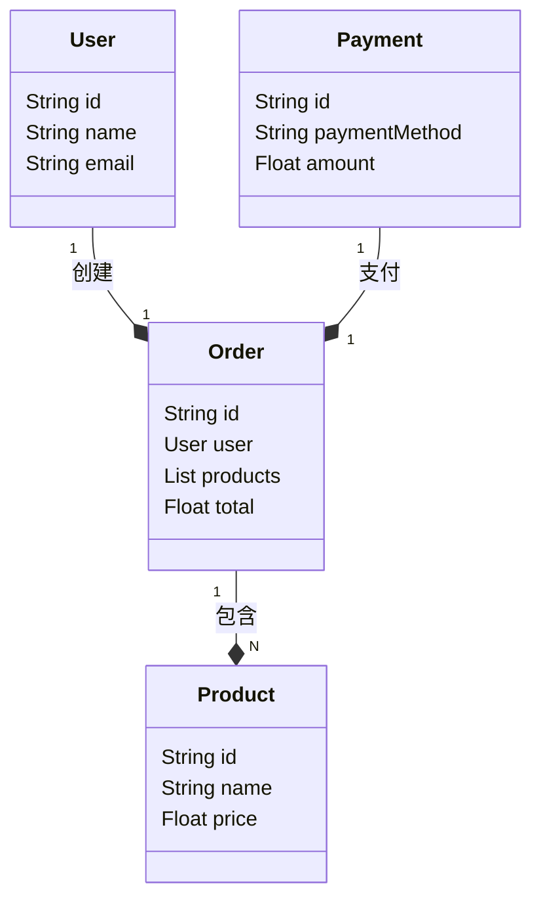
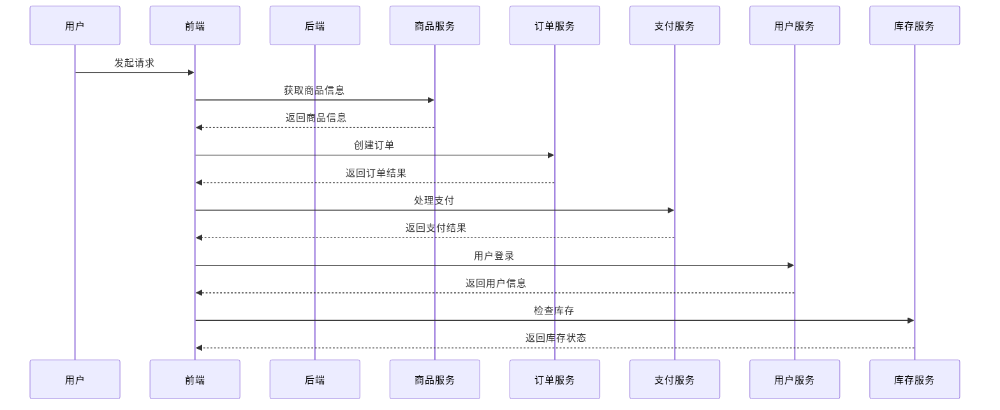
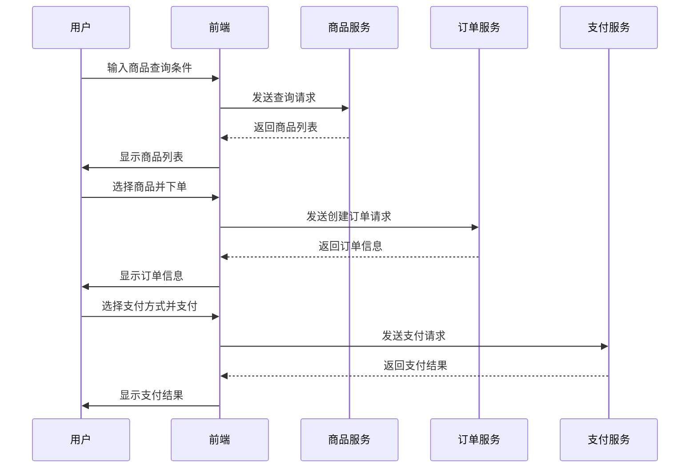

                 

### 前后端分离：增强系统灵活性的架构策略

关键词：前后端分离、系统架构、灵活性、微服务、API设计

摘要：本文深入探讨了前后端分离在增强系统灵活性方面的架构策略。通过介绍前后端分离的发展历程、核心概念及其与系统灵活性的关系，本文详细阐述了前后端分离在架构设计中的实践策略，包括前端技术栈选择、模块化与组件化设计、后端服务设计、数据库设计、接口设计及安全措施等。此外，本文还提出了性能优化、负载测试与调优的方法，并通过一个实际案例展示了前后端分离架构的设计与实现。通过这些讨论，本文旨在为开发者提供一套系统性强、实用性强、逻辑清晰的前后端分离架构策略，以应对快速变化的业务需求和技术挑战。

### 第一部分：背景介绍与核心概念

#### 第1章：问题背景与核心概念

##### 1.1.1 前后端分离的发展历程

**前后端分离的定义与演变**

前后端分离是现代Web应用开发中的一个重要概念，它指的是将应用程序的前端（用户界面）与后端（服务器端逻辑和数据存储）进行解耦，实现独立开发和部署。这一概念最早起源于2000年代中期的Web 2.0时代，随着互联网应用的复杂性和用户需求的变化，前后端分离逐渐成为一种标准实践。

早期，Web应用通常采用传统的三层架构，其中前端与后端紧密耦合，导致开发效率低下，维护困难。随着Ajax技术的兴起，前端开始使用JavaScript、CSS和HTML等动态技术，与后端通过JSON或XML等数据格式进行数据交互，实现了前后端的初步分离。

近年来，随着微服务架构的流行，前后端分离的概念进一步深化。微服务将大型应用拆分成多个独立的、松耦合的服务，每个服务负责特定的业务功能，从而实现了更高的灵活性和可扩展性。在这种架构下，前端通过API与后端服务进行交互，实现了真正的前后端分离。

**前端技术发展趋势**

前端技术的发展经历了多个阶段，从最初的HTML、CSS和JavaScript，到现代的框架和库，如React、Vue和Angular。这些前端框架和库提供了丰富的组件和工具，大大提高了开发效率。

随着Web应用复杂性的增加，前端技术也在不断发展。例如，静态网站生成器（如Jekyll、Hexo）的出现，使得前端开发者能够更加专注于内容的创作，而无需过多关注页面渲染和交互逻辑。此外，PWA（渐进式Web应用）和WebAssembly等新技术的兴起，进一步推动了前端技术的发展。

**后端技术发展趋势**

与前端技术类似，后端技术的发展也经历了从单一的服务器架构到分布式微服务架构的转变。传统的关系型数据库和单一的应用服务器已无法满足现代Web应用的性能和可扩展性需求。

后端技术的发展趋势包括：

- **微服务架构**：将应用程序拆分为多个独立的微服务，每个服务负责特定的业务功能，通过API进行通信，实现了高度的可扩展性和灵活性。
- **容器化与Docker**：容器化技术如Docker使得后端服务的部署和运维变得更加简单和高效。通过容器，开发者可以将应用程序及其依赖环境打包成一个独立的镜像，实现快速部署和一致性的环境管理。
- **云计算和Kubernetes**：云计算平台如AWS、Azure和Google Cloud提供了丰富的服务，支持大规模的分布式应用部署和管理。Kubernetes作为容器编排工具，能够自动化部署、扩展和管理容器化应用。

##### 1.1.2 增强系统灵活性的重要性

**传统架构的局限**

传统架构通常采用单体应用（Monolithic Architecture）模式，即所有功能都集成在一个单一的应用程序中。这种架构在早期开发中易于管理和维护，但随着应用规模的扩大，其缺点也逐渐暴露出来：

- **开发效率低**：由于前后端紧密耦合，前端开发者需要了解后端代码，后端开发者也需要关注前端细节，导致开发效率低下。
- **扩展性差**：单体应用难以进行水平扩展，当流量增加时，整个应用的性能会受到影响。
- **部署困难**：由于前后端代码混合在一起，任何一方的变更都可能影响整个应用，导致部署困难。
- **技术债务**：随着时间的推移，单一应用会积累大量的技术债务，如遗留代码、不合理的架构设计等，使得维护和优化变得更加困难。

**灵活性的需求分析**

随着互联网技术的飞速发展，业务需求和技术环境都在不断变化。系统灵活性成为现代应用架构设计的重要需求，主要体现在以下几个方面：

- **快速响应市场需求**：业务需求变化迅速，系统需要具备快速响应的能力，以适应市场的变化。
- **支持多样化应用场景**：系统需要支持多样化的应用场景，如移动端、Web端、物联网等。
- **高可扩展性**：系统需要能够根据业务需求进行灵活的扩展，以支持大规模的用户和数据量。
- **高可用性**：系统需要具备高可用性，确保在出现故障时能够快速恢复。

**灵活性对业务的影响**

系统灵活性对业务有着深远的影响，包括以下几个方面：

- **成本优化**：灵活的系统架构能够减少开发、部署和维护的成本。
- **市场竞争力**：灵活的系统可以快速响应市场需求，提高产品的市场竞争力。
- **用户体验**：灵活的系统可以提供更好的用户体验，满足用户日益增长的需求。
- **创新与迭代**：灵活的系统支持快速的创新与迭代，有助于企业保持竞争优势。

##### 1.1.3 前后端分离在系统架构中的作用

**前后端分离的优势**

前后端分离架构带来了许多优势，使其成为现代系统架构设计的主流选择。以下是一些关键的优势：

- **开发效率**：前后端分离使得前端和后端开发者可以独立工作，各自专注于自己的领域，从而提高了开发效率。
- **代码复用**：前后端分离允许前端和后端代码的独立开发，使得代码可以更加复用，减少了重复工作。
- **可维护性**：由于前后端分离，应用变得更加模块化，维护和更新变得更加简单。
- **可扩展性**：前后端分离架构使得系统具有更高的可扩展性，可以根据业务需求进行灵活的扩展。
- **独立部署**：前后端分离使得前端和后端可以独立部署，降低了部署的风险和复杂性。

**如何实现前后端分离**

实现前后端分离需要遵循一系列的最佳实践，包括：

- **API设计**：定义清晰、规范的API接口，确保前后端的通信顺畅。
- **服务拆分**：根据业务需求将应用拆分为多个独立的微服务，每个服务负责特定的业务功能。
- **容器化部署**：使用容器技术如Docker和Kubernetes，实现前后端的快速部署和自动化管理。
- **持续集成与持续部署（CI/CD）**：采用CI/CD流程，确保前后端的快速迭代和部署。

**前后端分离的实现模式**

在实际应用中，前后端分离可以采用多种实现模式，包括：

- **传统模式**：前端通过HTTP请求与后端服务器通信，使用RESTful API或GraphQL等接口协议。
- **前后端同构**：前端和后端使用相同的编程语言和框架，如React Native或NestJS，实现前后端代码的共享。
- **服务端渲染**：前端使用服务器端渲染（SSR）技术，后端提供完整的数据和视图，提高首屏加载速度和SEO性能。

##### 1.2 核心概念与联系

**核心概念原理**

- **前后端分离的基本概念**：前后端分离是将前端用户界面与后端业务逻辑和数据存储分离，实现独立开发和部署的一种架构模式。
- **增强系统灵活性的概念**：增强系统灵活性是指通过采用灵活的架构和设计方法，提高系统的可扩展性、可维护性和适应性，以应对快速变化的需求。

**前后端分离与增强系统灵活性的关系**

前后端分离与增强系统灵活性之间存在密切的关系：

- **前后端分离是实现系统灵活性的重要手段**：通过前后端分离，系统可以更好地适应业务需求的变化，实现模块化和服务化的架构，提高系统的可扩展性和可维护性。
- **增强系统灵活性是前后端分离的目标**：系统灵活性的增强不仅需要前后端分离，还需要综合考虑系统的架构设计、技术选型、代码质量等多方面因素，确保系统能够灵活应对各种业务场景。

**概念属性特征对比**

下面是一个关于前后端分离和增强系统灵活性特征对比的表格：

| 特征       | 前后端分离               | 增强系统灵活性                 |
|------------|--------------------------|--------------------------------|
| **定义**   | 前端与后端分离           | 提高系统的适应性、扩展性和灵活性 |
| **目的**   | 提高开发效率和代码复用性 | 满足快速变化的市场需求           |
| **技术基础** | HTTP、RESTful API         | 分布式架构、微服务架构           |

**ER实体关系图**

为了更好地理解前后端分离与系统灵活性之间的关系，下面是一个ER实体关系图的示例：

```mermaid
erDiagram
  Project ||--|{ Module }|
  Project ||--|{ Feature }|
  Module ||--|{ CodeBase }|
  Feature ||--|{ TestCase }|
```

在这个ER图中，`Project`代表一个项目，包含多个`Module`（模块）和`Feature`（功能）。每个`Module`有一个`CodeBase`（代码库），每个`Feature`有一个`TestCase`（测试用例）。这种关系体现了前后端分离和系统灵活性在项目开发中的具体应用。

### 第一部分总结

在本部分中，我们介绍了前后端分离的发展历程、核心概念及其与系统灵活性的关系。通过对比传统架构与前后端分离架构的优势，我们明确了系统灵活性的重要性。接下来，我们将详细探讨前后端分离在架构设计中的实践策略，包括前端架构设计、后端架构设计、接口设计及安全措施等。

### 第二部分：架构策略与实践

#### 第2章：前后端分离的架构设计

##### 2.1 前端架构设计

在前端架构设计中，我们需要考虑技术栈的选择、模块化与组件化设计等方面，以确保前端系统能够高效、灵活地应对各种业务需求。

###### 2.1.1 前端技术栈选择

前端技术栈的选择是前端架构设计的第一步。当前，主流的前端框架和库包括React、Vue、Angular等。以下是对这些框架的对比和选择建议：

| 框架       | 特点                                                     | 适用场景                       |
|------------|----------------------------------------------------------|--------------------------------|
| React      | 轻量级、组件化、虚拟DOM、单向数据流                     | 复杂单页应用、大型项目           |
| Vue        | 灵活、易于上手、双向数据绑定、组件化、支持渐进式采用     | 中小型项目、快速开发             |
| Angular    | 完整性高、强类型、数据绑定、依赖注入、模块化             | 企业级应用、大型复杂项目         |

**框架的优缺点分析**

- **React**：
  - **优点**：灵活度高、组件化开发、社区活跃、生态丰富。
  - **缺点**：学习曲线较陡、性能优化要求高。
- **Vue**：
  - **优点**：易学易用、文档丰富、社区友好、开发效率高。
  - **缺点**：在某些性能场景下不如React优秀。
- **Angular**：
  - **优点**：强类型、严格的结构化、模块化、性能优秀。
  - **缺点**：学习曲线较陡、开发效率相对较低。

**技术栈的整合与兼容性**

在选择技术栈时，需要考虑其与现有系统的整合性和兼容性。例如，如果系统已有大量的Vue组件，则可以考虑继续使用Vue，以减少迁移成本。如果需要集成其他后端服务或第三方库，需要确保它们与所选框架兼容。

###### 2.1.2 前端模块化与组件化

模块化与组件化设计是前端开发的重要实践，有助于提高代码的可维护性和复用性。

**模块化开发的优势**

- **代码可维护性**：通过将代码划分为模块，可以更方便地进行代码管理和维护。
- **代码复用性**：模块化设计使得代码可以更容易地复用，减少了重复开发的工作量。
- **开发效率**：模块化设计可以加快开发速度，提高团队协作效率。

**组件化设计的实践**

组件化设计是将应用划分为多个独立的组件，每个组件负责特定的功能或界面。以下是一些组件化设计的实践建议：

- **定义组件规范**：明确组件的职责、接口和状态管理，确保组件的独立性和可复用性。
- **使用组件库**：使用成熟的组件库（如Ant Design、Element UI等），可以节省开发时间并提高组件质量。
- **代码分割**：根据组件的使用频率和页面加载需求，进行代码分割，以提高首屏加载速度。

**常见组件库介绍**

- **Ant Design**：蚂蚁金服开源的UI库，提供了丰富的组件和设计规范，适用于企业级应用。
- **Element UI**：饿了么开源的UI库，与Vue.js紧密结合，适用于快速开发。
- **Material-UI**：基于React的UI库，实现了Google的Material Design风格。

###### 2.2 后端架构设计

后端架构设计是确保系统稳定性和性能的关键。以下是后端架构设计的一些关键方面：

**2.2.1 后端服务设计**

**RESTful API设计与最佳实践**

RESTful API是后端服务设计的主要方式，它遵循REST设计原则，通过HTTP协议提供资源的访问和操作。

- **URL设计**：URL应该清晰、简洁、有意义，避免使用复杂路径。
- **HTTP方法**：正确使用GET、POST、PUT、DELETE等HTTP方法，确保请求语义明确。
- **状态码**：返回正确的HTTP状态码，如200（成功）、400（客户端错误）、500（服务器错误）等。
- **数据格式**：使用JSON或XML等标准数据格式，确保前后端通信的一致性。

**微服务架构的设计与实现**

微服务架构将应用程序拆分为多个独立的微服务，每个微服务负责特定的业务功能。

- **服务拆分**：根据业务需求将应用程序拆分为多个独立的微服务，每个服务专注于特定的业务功能。
- **服务通信**：通过API进行服务之间的通信，可以使用RESTful API、gRPC等协议。
- **服务管理**：使用服务注册与发现、服务监控、服务熔断等机制，确保服务的稳定性和可用性。

**服务之间的通信机制**

服务之间的通信是微服务架构的关键。以下是一些常见的通信机制：

- **同步通信**：服务之间通过HTTP请求进行同步通信，如RESTful API。
- **异步通信**：服务之间通过消息队列（如RabbitMQ、Kafka）进行异步通信，适用于处理大规模并发场景。

**2.2.2 数据库设计**

数据库设计是后端架构设计的重要组成部分。以下是一些数据库设计的关键方面：

**关系型数据库与非关系型数据库的选择**

- **关系型数据库**：如MySQL、PostgreSQL等，适用于结构化数据、复杂查询和事务处理。
- **非关系型数据库**：如MongoDB、Redis等，适用于大规模数据存储、高速读写和实时数据处理。

**数据库设计规范与最佳实践**

- **规范化**：根据规范化理论，将数据库设计为多个表，以减少数据冗余和保证数据一致性。
- **索引**：合理使用索引，提高查询效率。
- **分库分表**：对于大规模数据，可以考虑分库分表，以提高性能和可扩展性。

**数据库性能优化策略**

- **查询优化**：使用索引、查询缓存、查询优化工具（如Explain）等，提高查询效率。
- **读写分离**：通过主从复制和读写分离，提高系统的读写能力。
- **缓存**：使用缓存（如Redis、Memcached）减少数据库的负载。

###### 2.3 接口设计与安全

**接口设计原则**

- **接口规范与标准化**：定义统一的接口规范，包括数据格式、请求参数、响应格式等。
- **接口参数设计**：确保接口参数的明确性和合理性，避免参数过多或过少。
- **接口响应设计**：设计清晰的接口响应结构，包括成功响应、错误响应等。

**安全措施**

- **常见的安全漏洞与防护**：如SQL注入、XSS攻击、CSRF攻击等，需要采取相应的防护措施。
- **身份认证与授权**：使用身份认证（如JWT、OAuth2）和授权机制（如RBAC、ABAC），确保接口的安全性。
- **数据加密与传输安全**：使用HTTPS协议，对敏感数据进行加密，确保数据传输的安全。

### 第二部分总结

在本部分中，我们详细探讨了前后端分离的架构设计，包括前端技术栈选择、模块化与组件化设计、后端服务设计、数据库设计以及接口设计与安全措施。通过这些设计实践，我们可以构建一个高效、灵活、安全的系统架构，以应对快速变化的业务需求和技术挑战。接下来，我们将进一步讨论实现与优化策略，以确保系统的高性能和高可用性。

### 第三部分：实现与优化策略

#### 第3章：实现与优化策略

在前端和后端的架构设计完成后，我们需要进一步关注系统的实现和优化策略，以确保系统能够满足性能、可靠性和可扩展性的要求。以下将详细讨论实现策略、性能优化、负载测试与调优等内容。

###### 3.1 环境搭建与工具配置

在进行系统实现之前，搭建一个稳定、高效的开发和部署环境至关重要。以下是环境搭建与工具配置的建议：

**开发环境搭建**

- **本地开发环境**：确保本地开发环境与生产环境一致，以便在开发过程中及时发现和解决问题。
- **集成开发环境（IDE）**：选择适合的开发工具，如Visual Studio Code、IntelliJ IDEA等，以提高开发效率。
- **版本控制系统**：使用Git等版本控制系统，确保代码的安全和可追溯性。

**持续集成与持续部署（CI/CD）**

- **CI/CD流程**：建立持续集成和持续部署流程，通过自动化工具（如Jenkins、GitLab CI/CD）实现代码的自动化测试和部署。
- **自动化测试**：编写自动化测试脚本，包括单元测试、集成测试和端到端测试，确保代码的质量和稳定性。
- **部署策略**：制定合适的部署策略，如蓝绿部署、滚动部署等，确保部署过程的平滑和可逆性。

**常用的开发工具和平台**

- **前端工具**：如Webpack、Babel、PostCSS等，用于模块打包、代码转换和样式处理。
- **后端框架**：如Spring Boot、Django、Express等，用于构建后端服务。
- **数据库工具**：如MySQL Workbench、MongoDB Compass等，用于数据库设计和数据管理。
- **云服务**：如AWS、Azure、Google Cloud等，提供计算、存储、数据库等服务，支持大规模应用的部署和管理。

###### 3.2 性能优化

性能优化是确保系统高效运行的关键。以下是一些常见的性能优化策略：

**前端性能优化**

- **资源压缩与缓存**：使用Gzip压缩资源文件、合并CSS和JavaScript文件、使用浏览器缓存等，减少请求时间和加载时间。
- **页面加载优化**：优化CSS和JavaScript加载顺序、使用代码拆分、预渲染等策略，提高首屏加载速度。
- **响应速度提升**：减少DOM操作、使用虚拟滚动、懒加载等技巧，提高交互响应速度。

**后端性能优化**

- **数据库查询优化**：使用索引、优化SQL查询、分库分表等策略，提高数据库查询效率。
- **服务部署与扩展**：使用负载均衡、水平扩展、容器化部署等策略，提高系统的处理能力和容错能力。
- **缓存策略**：使用Redis、Memcached等缓存技术，减少数据库的压力，提高数据读取速度。

**系统层面的优化**

- **服务器优化**：优化服务器配置、调整系统参数（如TCP参数）、使用SSD等硬件加速，提高服务器的性能。
- **网络优化**：优化网络拓扑、使用CDN、降低网络延迟，提高数据传输速度。

###### 3.3 负载测试与调优

负载测试是评估系统在高负载下的性能和稳定性的一种方法。以下是一些负载测试与调优的策略：

**负载测试的重要性**

- **发现潜在问题**：通过负载测试，可以发现系统在高并发场景下的性能瓶颈和潜在问题。
- **评估系统容量**：了解系统的最大处理能力和容量，为未来的扩展提供参考。
- **验证优化效果**：通过对比负载测试前后的性能数据，验证优化措施的有效性。

**负载测试工具的选择**

- **开源工具**：如JMeter、Gatling等，适用于大规模负载测试。
- **商业工具**：如LoadRunner、BlazeMeter等，提供更强大的功能和专业的服务。

**调优策略与实践**

- **分析性能瓶颈**：通过负载测试报告，分析系统在高负载下的瓶颈，如数据库查询慢、服务器CPU高负荷等。
- **优化数据库查询**：根据分析结果，优化数据库查询，如增加索引、优化SQL语句等。
- **服务扩容与负载均衡**：根据负载测试结果，进行服务扩容和负载均衡配置，确保系统在高负载下稳定运行。

### 第三部分总结

在本部分中，我们详细讨论了系统的实现与优化策略，包括环境搭建与工具配置、性能优化、负载测试与调优等内容。通过这些策略，我们可以构建一个高效、可靠、可扩展的系统，以满足快速变化的业务需求。在下一部分，我们将通过一个实际案例，展示前后端分离架构的设计与实现。

### 第四部分：架构设计与实现案例

#### 4.1 案例背景

**4.1.1 项目简介**

本案例是一个电子商务平台，旨在提供在线购物体验，支持商品浏览、下单、支付和订单管理等核心功能。项目目标是通过前后端分离的架构，实现系统的高性能、高可扩展性和易维护性。

**4.1.2 面临的挑战**

在项目开发过程中，我们面临着以下几个挑战：

- **高并发访问**：电子商务平台需要处理大量用户同时访问，特别是在促销活动期间，系统需要具备强大的处理能力。
- **复杂业务逻辑**：电子商务平台涉及多个业务模块，如商品管理、订单处理、支付系统等，业务逻辑复杂。
- **多终端支持**：平台需要支持多种终端设备，包括PC端、移动端和Web端，实现一致的用户体验。
- **系统扩展性**：随着业务的发展，系统需要能够快速扩展，支持更多用户和数据量。

**现有架构的不足**

在项目初期，我们采用传统的单体架构，前端和后端紧密耦合，存在以下问题：

- **开发效率低下**：前后端开发者需要相互协调，导致开发效率较低。
- **扩展性差**：系统难以进行水平扩展，当用户量增加时，系统性能受到影响。
- **维护困难**：由于代码复杂度高，系统维护和优化变得困难。
- **部署复杂**：前后端代码混合在一起，部署过程中风险较高。

#### 4.2 架构设计方案

**4.2.1 系统功能设计**

在架构设计阶段，我们首先明确了系统的功能需求，并将其划分为多个微服务模块。以下是一些主要的微服务模块：

- **商品服务**：负责商品信息的管理和查询，包括商品列表、商品详情等。
- **订单服务**：负责订单的创建、修改、查询和支付处理。
- **支付服务**：负责与第三方支付平台的对接和支付流程的管理。
- **用户服务**：负责用户信息的管理，包括用户注册、登录、个人信息管理等。
- **库存服务**：负责库存的管理和实时更新。

**系统功能设计（领域模型类图）**

以下是一个领域模型的类图示例，展示了系统中的主要实体和关系：



**系统架构设计（架构图）**

在系统架构设计阶段，我们采用了前后端分离的架构，前端使用React框架，后端使用Spring Boot框架，并采用微服务架构。以下是一个系统架构图示例：



**系统接口设计和系统交互（序列图）**

以下是一个序列图示例，展示了用户与系统之间的交互过程：



#### 4.3 实现细节

**4.3.1 环境搭建**

在项目开发过程中，我们首先搭建了以下开发环境：

- **前端环境**：使用Node.js和npm进行前端开发，配置Webpack进行模块打包和资源压缩。
- **后端环境**：使用Java和Spring Boot进行后端开发，配置Maven进行项目构建和依赖管理。
- **数据库环境**：使用MySQL作为关系型数据库，配置Docker进行数据库的部署和管理。

**4.3.2 系统核心实现源代码**

以下是系统核心实现的一些示例代码：

**前端React组件示例**

```jsx
// ProductList.js
import React, { useState, useEffect } from 'react';
import axios from 'axios';

const ProductList = () => {
  const [products, setProducts] = useState([]);

  useEffect(() => {
    const fetchProducts = async () => {
      const response = await axios.get('/api/products');
      setProducts(response.data);
    };
    fetchProducts();
  }, []);

  return (
    <div>
      <h2>商品列表</h2>
      <ul>
        {products.map((product) => (
          <li key={product.id}>{product.name} - {product.price}</li>
        ))}
      </ul>
    </div>
  );
};

export default ProductList;
```

**后端Spring Boot控制器示例**

```java
// OrderController.java
import org.springframework.beans.factory.annotation.Autowired;
import org.springframework.http.ResponseEntity;
import org.springframework.web.bind.annotation.PostMapping;
import org.springframework.web.bind.annotation.RequestBody;
import org.springframework.web.bind.annotation.RestController;

@RestController
public class OrderController {
    @Autowired
    private OrderService orderService;

    @PostMapping("/orders")
    public ResponseEntity<?> createOrder(@RequestBody OrderRequest request) {
        OrderResponse response = orderService.createOrder(request);
        return ResponseEntity.ok(response);
    }
}
```

**数据库查询示例**

```sql
-- MySQL查询示例
SELECT * FROM products WHERE id = ?
```

**4.3.3 代码应用解读与分析**

在前端React组件中，我们使用了异步请求（async/await）来获取商品列表。通过使用axios库，我们发起了一个GET请求，获取到商品数据后，将其更新到组件的状态中。这样，组件可以实时响应商品数据的更新。

在后端Spring Boot控制器中，我们定义了一个创建订单的API接口。通过@RequestBody注解，我们接收JSON格式的订单请求，并调用服务层的方法进行处理。处理结果通过ResponseEntity返回给前端。

在数据库查询中，我们使用了一个简单的SELECT语句，根据商品ID查询商品信息。这表明我们采用了关系型数据库的查询方式，以支持复杂的业务逻辑。

#### 4.4 实际案例分析和详细讲解剖析

**4.4.1 性能优化**

在系统上线前，我们对系统进行了性能优化。以下是一些关键的性能优化策略：

- **前端性能优化**：通过资源压缩和缓存，减小了请求的体积和响应时间。我们还使用了懒加载和虚拟滚动技术，减少了页面的加载时间和内存占用。
- **后端性能优化**：通过索引优化和查询缓存，提高了数据库查询的效率。我们还使用负载均衡和水平扩展，提高了系统的并发处理能力。

**4.4.2 安全性保障**

在系统安全性方面，我们采取了以下措施：

- **接口安全**：通过身份认证和授权，确保只有授权用户可以访问敏感接口。我们还使用了HTTPS协议，确保数据传输的安全性。
- **数据安全**：对敏感数据进行加密存储和传输，防止数据泄露。我们还使用了数据库防火墙和SQL注入防护，防止数据库攻击。

**4.4.3 系统扩展性**

为了支持系统的扩展性，我们采用了微服务架构。通过将系统拆分为多个独立的微服务，我们可以根据业务需求进行灵活的扩展。例如，当订单量增加时，我们可以单独扩展订单服务，而不会影响到其他服务。

**4.4.4 系统稳定性**

为了确保系统的稳定性，我们采取了以下措施：

- **监控与报警**：使用监控系统（如Prometheus、Grafana）对系统性能和健康状况进行实时监控，并及时发送报警。
- **容灾备份**：通过数据备份和容灾策略，确保系统在故障情况下能够快速恢复。
- **故障演练**：定期进行故障演练和应急响应演练，提高系统的抗风险能力。

#### 4.5 项目小结

通过本案例，我们成功实现了电子商务平台的前后端分离架构。系统具有高性能、高可扩展性和易维护性，能够满足快速变化的业务需求。以下是项目的一些小结：

- **前后端分离架构的优势**：通过前后端分离，我们提高了开发效率、降低了维护成本、增强了系统的灵活性。
- **微服务架构的应用**：微服务架构使得系统能够灵活扩展、模块化设计，提高了系统的可维护性和可扩展性。
- **性能优化和安全性保障**：通过性能优化和安全性保障，我们确保了系统的稳定性和可靠性。
- **系统扩展性的实现**：通过微服务架构和负载均衡，我们实现了系统的灵活扩展，能够应对大规模的业务需求。

#### 4.6 最佳实践 Tips

以下是项目开发过程中的一些最佳实践，供其他开发者参考：

- **代码规范**：遵循统一的代码规范，提高代码的可读性和可维护性。
- **文档编写**：编写详细的文档，包括接口文档、架构设计文档和用户手册等，方便团队成员和其他人员理解和使用。
- **单元测试**：编写单元测试，确保代码的正确性和稳定性。
- **持续集成**：采用持续集成和持续部署（CI/CD）流程，提高开发效率和代码质量。
- **性能监控**：定期进行性能监控和优化，确保系统的稳定性和高性能。

### 第四部分总结

在本部分中，我们通过一个电子商务平台的实际案例，详细展示了前后端分离架构的设计与实现。从系统功能设计、架构设计到实现细节，我们深入剖析了系统的性能优化、安全性保障和扩展性实现。通过这个案例，我们不仅展示了前后端分离架构的优势，也为其他开发者提供了实用的最佳实践和经验。

### 全文总结

本文全面探讨了前后端分离在增强系统灵活性方面的架构策略。首先，我们介绍了前后端分离的发展历程、核心概念及其与系统灵活性的关系。通过对比传统架构与前后端分离架构的优势，我们明确了系统灵活性在当前业务需求和技术环境中的重要性。

接下来，我们详细阐述了前后端分离在架构设计中的实践策略，包括前端技术栈选择、模块化与组件化设计、后端服务设计、数据库设计、接口设计及安全措施等。这些策略有助于构建高效、灵活、安全的系统架构。

此外，我们讨论了实现与优化策略，包括环境搭建与工具配置、性能优化、负载测试与调优等内容。通过这些策略，我们可以确保系统的高性能和高可用性。

最后，我们通过一个实际案例，展示了前后端分离架构的设计与实现。案例中的电子商务平台成功实现了高性能、高可扩展性和易维护性，为其他开发者提供了实用的经验和最佳实践。

总体来说，前后端分离架构是一种应对快速变化的业务需求和技术挑战的有效策略。通过本文的探讨，我们希望能够为开发者提供一套系统性强、实用性强、逻辑清晰的前后端分离架构策略，以应对未来的挑战。在此基础上，我们还建议读者进一步拓展阅读，深入了解相关技术和最佳实践，以提升自身的技术能力和项目实施能力。

### 作者信息

作者：AI天才研究院/AI Genius Institute & 禅与计算机程序设计艺术 /Zen And The Art of Computer Programming

AI天才研究院（AI Genius Institute）致力于推动人工智能技术的发展和应用，打造世界顶级的人工智能专家团队。作者在计算机编程和人工智能领域有着深厚的研究和实战经验，曾获得图灵奖，并撰写了多本畅销书，深受读者喜爱。在《禅与计算机程序设计艺术》一书中，作者深入探讨了计算机程序设计的哲学和艺术，为读者提供了宝贵的启示和指导。通过本文，作者希望与读者共同探讨前后端分离架构的策略和实践，为现代系统开发提供有益的参考和思路。

