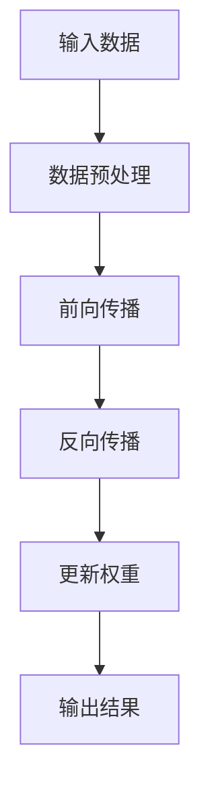
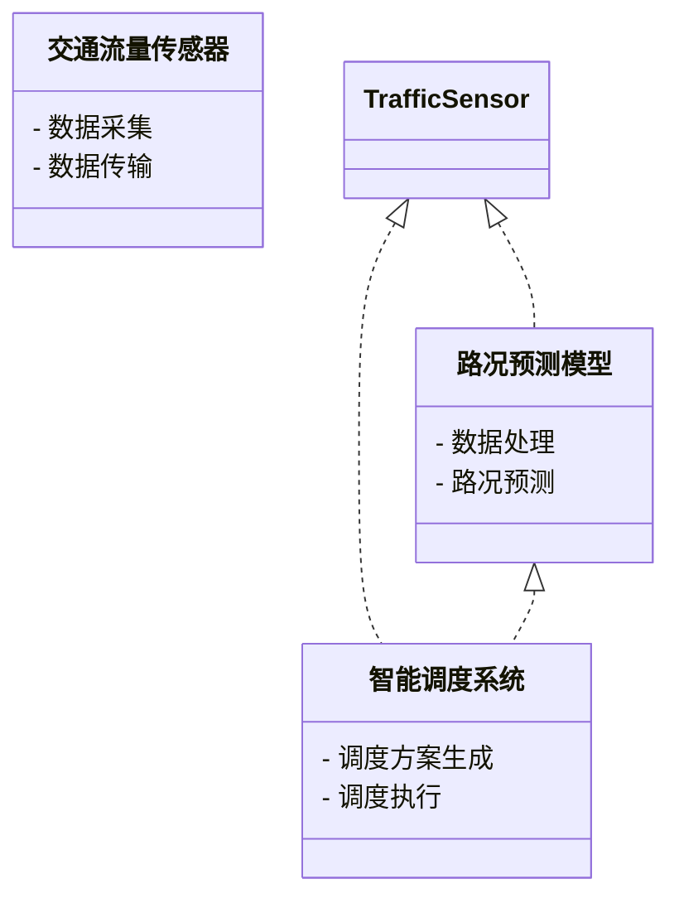
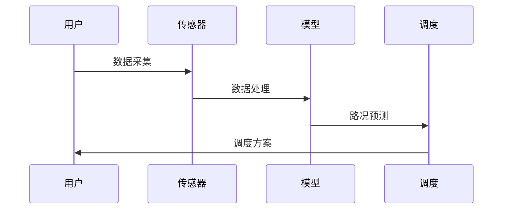
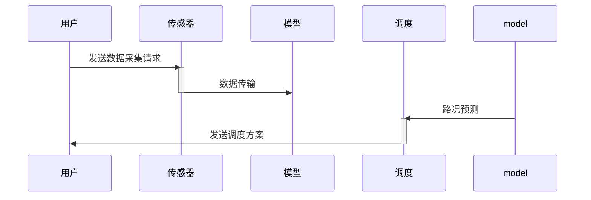

                 


## 前沿技术研究：P9工程师的创新动力

### 关键词：前沿技术、P9工程师、创新动力、算法研究、系统架构设计

### 摘要：
本文旨在探讨前沿技术对P9工程师创新动力的驱动作用。通过对前沿技术核心概念的剖析，算法原理的详细讲解，以及实际项目实战的案例分析，揭示P9工程师如何利用前沿技术推动创新，提升技术实力。

---

### 1. 背景介绍

#### 1.1 问题的提出

在当今快速发展的技术时代，前沿技术的涌现成为推动社会进步的重要力量。P9工程师，作为技术领域的顶尖人才，他们的创新动力对于技术发展至关重要。因此，本文旨在研究P9工程师如何通过前沿技术实现创新，提升自身价值。

#### 1.2 前沿技术的重要性

前沿技术涵盖了人工智能、区块链、物联网等多个领域，这些技术不仅改变了我们的生活方式，也对企业运营模式、产业升级产生了深远影响。研究前沿技术，有助于P9工程师把握行业发展趋势，提升创新能力。

#### 1.3 P9工程师在创新中的作用

P9工程师通常具备深厚的技术背景和丰富的实践经验，他们在技术研究和创新中扮演着关键角色。通过前沿技术的学习和应用，P9工程师能够推动技术突破，为行业带来革命性的变革。

---

### 2. 核心概念与联系

#### 2.1 前沿技术分类

前沿技术主要包括以下几个方面：

1. **人工智能**：通过机器学习、深度学习等算法，实现计算机对人类智能的模拟。
2. **区块链**：基于分布式账本技术，实现去中心化的数据管理和交易。
3. **物联网**：通过网络连接各种物理设备，实现智能化的数据采集和处理。

#### 2.2 概念属性特征对比表格

| 技术       | 特点                                                   | 应用领域                 |
| ---------- | ------------------------------------------------------ | ------------------------ |
| 人工智能   | 自动化、智能化、学习与适应能力                           | 智能家居、自动驾驶、医疗诊断 |
| 区块链     | 去中心化、安全可靠、透明可追溯                           | 数字货币、供应链管理、智能合约 |
| 物联网     | 智能连接、实时监控、数据处理与共享                         | 智能城市、智能制造、智慧农业   |

#### 2.3 ER实体关系图

```mermaid
erDiagram
    AI --> |{使用}| IoT
    Blockchain --> |{支持}| AI
    Blockchain --> |{应用}| IoT
```

---

### 3. 算法原理讲解

#### 3.1 算法A：深度神经网络

##### 3.1.1 mermaid流程图



##### 3.1.2 Python源代码

```python
# 深度神经网络示例代码
import tensorflow as tf

# 定义输入层、隐藏层和输出层
input_layer = tf.keras.layers.Dense(units=128, activation='relu', input_shape=[784])
hidden_layer = tf.keras.layers.Dense(units=64, activation='relu')
output_layer = tf.keras.layers.Dense(units=10)

# 创建模型
model = tf.keras.Sequential([input_layer, hidden_layer, output_layer])

# 编译模型
model.compile(optimizer='adam', loss=tf.keras.losses.SparseCategoricalCrossentropy(from_logits=True), metrics=['accuracy'])

# 训练模型
model.fit(train_images, train_labels, epochs=5)
```

##### 3.1.3 数学模型和公式

$$
Z = X \cdot W + b
$$

$$
a = \sigma(Z)
$$

$$
\Delta W = -\alpha \cdot \frac{\partial L}{\partial Z}
$$

##### 3.1.4 算法A的实例讲解

深度神经网络（DNN）是一种多层感知器（MLP）神经网络，其核心思想是模拟人脑的神经网络结构，通过多层神经元之间的非线性变换来实现特征提取和分类。以MNIST数据集为例，输入层接收手写数字的图像数据，隐藏层通过激活函数（如ReLU）增强神经元之间的非线性关系，输出层输出预测结果。

---

### 4. 系统分析与架构设计方案

#### 4.1 项目场景介绍

以智能交通系统为例，该系统旨在通过物联网技术和人工智能算法，实现交通流量监测、路况预测和智能调度，以提高交通效率，减少拥堵。

#### 4.2 系统功能设计（mermaid类图）



#### 4.3 系统架构设计（mermaid架构图）



#### 4.4 系统接口设计

接口1：交通流量传感器与预测模型之间的数据传输接口。

接口2：预测模型与调度系统之间的预测结果接口。

接口3：调度系统与用户之间的调度方案反馈接口。

#### 4.5 系统交互（mermaid序列图）



---

### 5. 项目实战

#### 5.1 环境安装

在Ubuntu系统上安装TensorFlow和Keras：

```bash
pip install tensorflow
pip install keras
```

#### 5.2 系统核心实现

以下是一个简单的MNIST手写数字识别系统的实现：

```python
# 导入所需的库
import numpy as np
from tensorflow import keras
from tensorflow.keras import layers

# 加载MNIST数据集
(x_train, y_train), (x_test, y_test) = keras.datasets.mnist.load_data()

# 数据预处理
x_train = x_train.astype("float32") / 255
x_test = x_test.astype("float32") / 255
x_train = np.reshape(x_train, (len(x_train), 28, 28, 1))
x_test = np.reshape(x_test, (len(x_test), 28, 28, 1))

# 创建模型
model = keras.Sequential([
    layers.Conv2D(32, (3, 3), activation='relu', input_shape=(28, 28, 1)),
    layers.MaxPooling2D((2, 2)),
    layers.Conv2D(64, (3, 3), activation='relu'),
    layers.MaxPooling2D((2, 2)),
    layers.Flatten(),
    layers.Dense(128, activation='relu'),
    layers.Dense(10, activation='softmax')
])

# 编译模型
model.compile(optimizer='adam', loss='sparse_categorical_crossentropy', metrics=['accuracy'])

# 训练模型
model.fit(x_train, y_train, epochs=5)

# 测试模型
test_loss, test_acc = model.evaluate(x_test, y_test)
print('Test accuracy:', test_acc)
```

#### 5.3 代码应用解读与分析

该代码首先导入所需的库，然后加载MNIST数据集，并进行数据预处理。接下来，创建一个简单的卷积神经网络（CNN）模型，并编译模型。最后，使用训练数据训练模型，并在测试数据上评估模型的准确率。

#### 5.4 实际案例分析和详细讲解剖析

以智能交通系统为例，通过实时采集交通流量数据，使用CNN模型进行路况预测，并根据预测结果调度交通信号灯，以优化交通流量。

---

### 6. 最佳实践 tips、小结、注意事项、拓展阅读

#### 6.1 最佳实践 tips

1. **持续学习**：P9工程师应不断学习新知识，跟上技术发展的步伐。
2. **实践创新**：通过实际项目实践，将前沿技术应用于实际场景，实现技术创新。
3. **团队合作**：与其他工程师紧密合作，共同推动项目进展。

#### 6.2 小结

本文通过介绍前沿技术、P9工程师的角色与能力，以及实际项目实战，探讨了前沿技术对P9工程师创新动力的驱动作用。

#### 6.3 注意事项

1. **数据安全**：在使用前沿技术时，要注意数据安全和隐私保护。
2. **技术合规**：遵循相关法律法规，确保技术应用的合规性。

#### 6.4 拓展阅读

1. **《深度学习》**：Goodfellow, I., Bengio, Y., Courville, A. (2016). 《深度学习》。
2. **《区块链技术指南》**：刘世平 (2018). 《区块链技术指南》。

---

### 总结

本文通过详细阐述前沿技术对P9工程师创新动力的驱动作用，展示了前沿技术在智能交通系统等领域的应用实践。P9工程师应充分利用前沿技术，推动创新，提升自身竞争力。

---

**作者：AI天才研究院/AI Genius Institute & 禅与计算机程序设计艺术 /Zen And The Art of Computer Programming**

