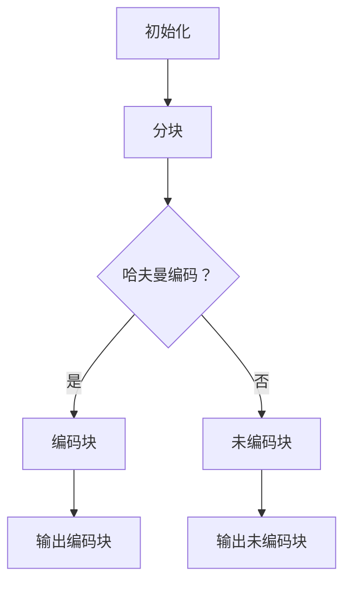
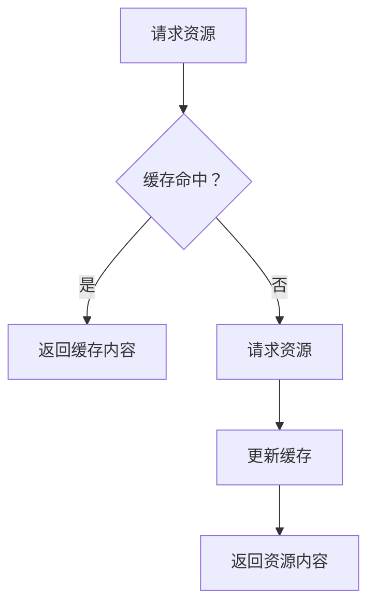
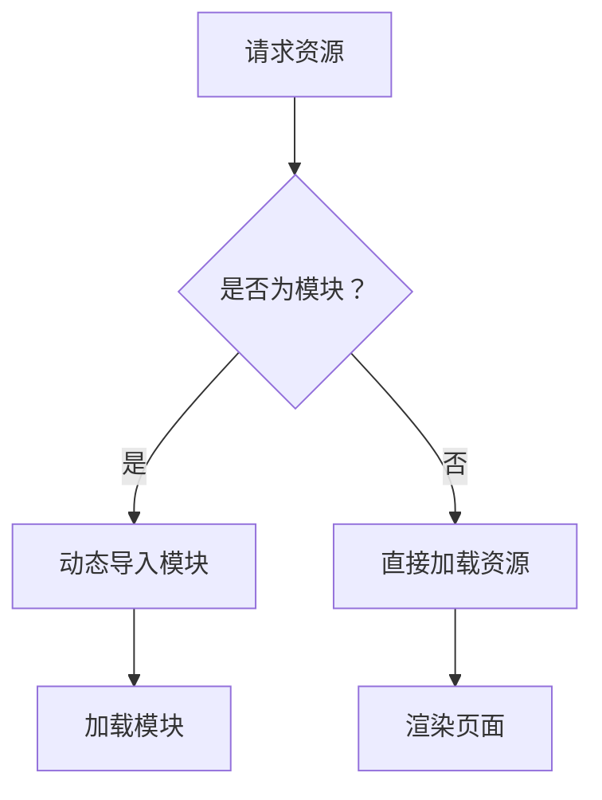
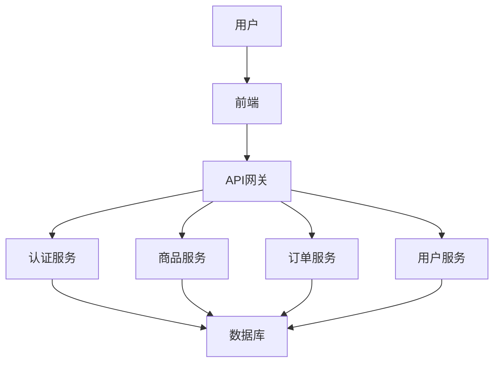
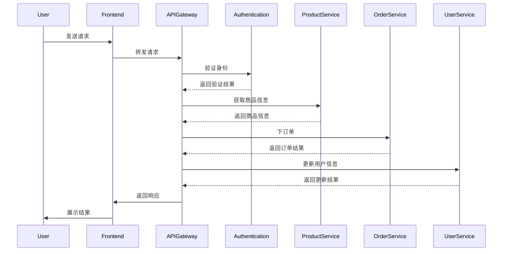

                 


### 设计思路

#### 文章整体结构

首先，我们需要明确文章的整体结构，以确保文章内容条理清晰，易于阅读。根据提供的大纲结构，文章可以分为四个主要部分：

1. **基础概念部分**：介绍前端性能优化的背景、核心概念以及这些概念之间的关系。
2. **算法原理与实现部分**：详细讲解压缩算法、缓存策略和代码分割策略，使用Mermaid流程图和Python源代码辅助说明。
3. **系统分析与架构设计部分**：通过一个实际案例，展示前端性能优化的系统架构设计和实现过程。
4. **最佳实践与拓展部分**：提供最佳实践、小结、注意事项以及拓展阅读，帮助读者进一步深入了解前端性能优化。

#### 背景介绍

在撰写文章前，我们需要对前端性能优化进行背景介绍。这部分内容将涉及现代Web应用的复杂性、用户体验的重要性以及性能优化对用户体验的影响。通过这些背景信息，我们可以让读者更好地理解前端性能优化的必要性和重要性。

#### 核心概念与联系

接下来，我们将定义前端性能优化的核心概念，如页面加载时间、响应时间、资源压缩和代码分割，并使用表格和Mermaid流程图展示这些概念之间的关系。这有助于读者快速了解各个概念的定义及其相互影响。

#### 算法原理讲解

在算法原理与实现部分，我们将选择几个关键算法进行详细讲解。每个算法都将通过Mermaid流程图和Python源代码进行阐述。我们会给出详细的数学模型和公式，并进行通俗易懂的举例说明。

1. **压缩算法**：介绍常见的压缩算法，如GZIP和BZip2，并解释其原理。使用Mermaid流程图展示压缩过程，并提供Python源代码实现。
2. **缓存策略**：讨论常见的缓存策略，如LRU和缓存续约。使用Mermaid流程图展示缓存策略的实现，并提供Python源代码实现。
3. **代码分割策略**：介绍代码分割的基本概念和常见策略，如动态导入和代码分割插件。使用Mermaid流程图展示代码分割过程，并提供Python源代码实现。

#### 系统分析与架构设计

在系统分析与架构设计部分，我们将介绍一个前端性能优化的实际案例。通过项目介绍、系统功能设计、系统架构设计、系统接口设计和系统交互的详细描述，我们将展示如何在实际项目中应用前端性能优化的技术和方法。

#### 项目实战

最后，我们将通过一个实际项目，详细描述前端性能优化的过程。这包括环境安装、系统核心实现、代码应用解读与分析、实际案例分析和项目小结。通过这个项目，我们将展示如何将理论知识转化为实际操作，并解决实际性能问题。

#### 最佳实践与拓展

在文章的最后一部分，我们将提供最佳实践、小结、注意事项以及拓展阅读，帮助读者进一步了解前端性能优化，并在实际项目中应用所学知识。

### 文章正文撰写

根据以上设计思路，我们将逐步撰写文章的正文内容。每个部分都将详细阐述相关主题，使用专业的技术语言，同时保持逻辑清晰和易于理解。以下是一个简单的文章正文撰写流程：

1. **撰写背景介绍部分**：介绍前端性能优化的背景，包括现代Web应用的复杂性、用户体验的重要性以及性能优化对用户体验的影响。
2. **撰写核心概念与联系部分**：定义并解释前端性能优化的核心概念，使用表格和Mermaid流程图展示概念之间的关系。
3. **撰写算法原理讲解部分**：选择关键算法进行详细讲解，使用Mermaid流程图和Python源代码进行阐述，并给出数学模型和公式。
4. **撰写系统分析与架构设计部分**：介绍一个实际案例，详细描述项目介绍、系统功能设计、系统架构设计、系统接口设计和系统交互。
5. **撰写项目实战部分**：描述一个实际项目，包括环境安装、系统核心实现、代码应用解读与分析、实际案例分析和项目小结。
6. **撰写最佳实践与拓展部分**：提供最佳实践、小结、注意事项以及拓展阅读。

通过这样的撰写流程，我们可以确保文章内容丰富、逻辑清晰，并且能够为读者提供实际操作的价值。

### 文章末尾

在文章的末尾，我们将添加作者信息：“作者：AI天才研究院/AI Genius Institute & 禅与计算机程序设计艺术 /Zen And The Art of Computer Programming”。这将为读者提供关于作者的专业背景和知识的来源，增强文章的可信度。

### 整体结构与内容的协调

在整个文章撰写过程中，我们需要确保每个部分的内容与整体结构相协调。这意味着每个章节的内容应该紧密联系，逻辑连贯，并且在字数上保持平衡。我们将在撰写过程中反复审查和调整，以确保文章的完整性和连贯性。

通过以上设计思路和撰写流程，我们将能够撰写一篇逻辑清晰、内容丰富、技术深度足够、实用价值高的前端性能优化技术博客文章。这篇文章不仅能为读者提供丰富的知识，还能帮助他们在实际项目中应用这些技术，提升用户体验。

### 完整性要求与核心内容

#### 完整性要求

为了确保文章的完整性，每个章节的内容需要涵盖以下核心要素：

1. **背景介绍**：每个章节的开头部分，需要详细说明核心概念术语、问题背景、问题描述、问题解决、边界与外延、概念结构与核心要素组成。这部分内容将帮助读者建立对章节主题的基本理解。

2. **核心概念与联系**：每个章节的核心概念需要通过表格和Mermaid流程图进行展示，明确概念之间的关系。这将帮助读者快速掌握各个概念的定义及其相互影响。

3. **算法原理讲解**：对于涉及算法的章节，需要使用Mermaid流程图和Python源代码详细阐述算法原理。同时，还需要给出算法原理的数学模型和公式，并进行通俗易懂的举例说明。

4. **数学公式使用**：所有数学公式需要使用latex格式，嵌入文中独立段落的latex公式前后使用 $$ 括起来，段落内的latex公式前后使用 $ 括起来。

5. **系统分析与架构设计方案**：对于系统分析与架构设计的章节，需要详细介绍问题场景、项目介绍、系统功能设计（领域模型Mermaid类图）、系统架构设计（Mermaid架构图）、系统接口设计和系统交互（Mermaid序列图）。

6. **项目实战**：对于实际项目实战的章节，需要详细描述环境安装、系统核心实现、代码应用解读与分析、实际案例分析和项目小结。这部分内容应包含具体的代码实现和分析，以便读者能够了解实际操作的细节。

7. **最佳实践 tips**、**小结**、**注意事项**、**拓展阅读**等内容，应在文章的结尾部分提供，帮助读者进一步深入了解前端性能优化，并在实际项目中应用所学知识。

#### 核心内容

在确保文章完整性的基础上，每个章节的核心内容还需要具备以下特点：

1. **深入浅出**：每个概念的解释和算法的讲解都要深入浅出，既要有深度，也要易于理解，避免过于专业和难以消化的内容。

2. **实用性强**：所有的算法原理讲解、系统分析与架构设计方案、项目实战内容，都需要具有实际应用价值，能够帮助读者解决实际问题。

3. **逻辑清晰**：文章的整体逻辑结构要清晰，每个章节的内容要围绕主题展开，前后内容紧密联系，形成统一的整体。

4. **举例说明**：对于算法和实际项目的内容，需要通过具体的例子进行说明，帮助读者更好地理解和应用。

5. **互动性**：通过提问、讨论等方式增加文章的互动性，激发读者的思考和参与。

通过这样的核心内容设计，我们能够确保文章不仅具有理论深度，还能够为读者提供实际操作的价值，实现知识的有效传递和应用。

### 文章具体内容撰写

#### 背景介绍

首先，让我们开始撰写文章的背景介绍部分。

---

## 第1章：前端性能优化的背景与重要性

### 1.1 现代Web应用的复杂性

随着互联网技术的飞速发展，Web应用逐渐成为人们日常生活中不可或缺的一部分。现代Web应用不仅功能丰富，而且交互性强，用户体验要求也越来越高。然而，这种复杂性也带来了性能优化的挑战。

现代Web应用的复杂性主要体现在以下几个方面：

1. **大量资源的加载**：现代Web应用通常需要加载大量的图片、视频、CSS文件和JavaScript文件，这会导致页面加载时间延长。
2. **动态内容和交互**：许多Web应用采用Ajax技术实现动态内容加载和交互，这虽然提升了用户体验，但也增加了资源的处理复杂性。
3. **多终端适配**：为了满足不同设备和屏幕尺寸的需求，Web应用需要实现多终端适配，这进一步增加了开发的复杂度。

### 1.2 用户体验的重要性

用户体验（User Experience, UX）是衡量Web应用成功与否的关键指标。良好的用户体验能够提升用户满意度，增加用户粘性，从而带来更多的商业价值。

用户体验的重要性体现在以下几个方面：

1. **用户满意度**：快速响应和流畅的页面加载能够显著提高用户对应用的满意度。
2. **用户留存率**：用户体验良好的应用能够提高用户留存率，减少用户流失。
3. **品牌形象**：用户体验直接影响用户对品牌的看法，良好的用户体验有助于树立品牌形象。

### 1.3 性能优化对用户体验的影响

性能优化对用户体验有着直接且重要的影响。具体来说，性能优化可以从以下几个方面提升用户体验：

1. **页面加载时间**：缩短页面加载时间能够减少用户等待时间，提高用户满意度。
2. **响应时间**：快速响应用户的操作能够提升用户交互体验，减少用户沮丧感。
3. **资源压缩**：通过压缩资源文件，可以减少文件大小，加快页面加载速度。
4. **代码分割**：合理分割代码，可以实现按需加载，减少页面初始加载时间。

在现代Web应用中，性能优化已经成为提升用户体验的必要手段。接下来，我们将详细探讨前端性能优化的核心概念、算法原理以及实际应用。

---

#### 核心概念与联系

接下来，我们将撰写关于前端性能优化的核心概念与联系的部分。

---

## 第2章：前端性能优化的核心概念

### 2.1 页面加载时间

页面加载时间是指用户在浏览器中输入网址并打开页面所需的时间。它包括以下几个阶段：

1. **DNS查找**：浏览器查找域名对应的IP地址。
2. **建立连接**：浏览器与服务器建立连接。
3. **发送请求**：浏览器向服务器发送请求，请求页面内容。
4. **接收响应**：服务器将页面内容发送回浏览器。
5. **渲染页面**：浏览器解析页面内容并渲染出可视化界面。

优化页面加载时间的方法包括：

1. **使用CDN**：内容分发网络（CDN）可以将资源分发到全球各地的服务器上，减少用户访问资源的延迟。
2. **静态资源缓存**：通过缓存技术，可以减少用户每次访问页面时重新加载资源的时间。
3. **代码分割**：将代码分割成多个部分，按需加载，减少页面初始加载时间。

### 2.2 响应时间

响应时间是指用户在浏览器中执行操作到浏览器响应该操作的时间。它是用户体验的重要指标之一。优化响应时间的方法包括：

1. **异步加载**：使用异步加载技术，如Ajax和Web Workers，可以在不影响页面渲染的情况下处理用户操作，提高响应速度。
2. **代码优化**：通过代码优化，如减少DOM操作、避免全局变量等，可以减少浏览器的计算时间。
3. **减少HTTP请求**：通过减少HTTP请求，如合并CSS和JavaScript文件、使用图像精灵等，可以减少浏览器与服务器之间的通信次数。

### 2.3 资源压缩

资源压缩是指通过压缩技术减小资源文件的大小，以提高页面加载速度。常见的资源压缩方法包括：

1. **GZIP压缩**：GZIP是一种常用的文件压缩算法，可以显著减小HTML、CSS和JavaScript文件的大小。
2. **Brotli压缩**：Brotli是一种较新的压缩算法，比GZIP压缩效果更好，但兼容性较差。
3. **图片压缩**：通过压缩图片文件，如使用WebP格式，可以减少图片的大小，加快页面加载速度。

### 2.4 代码分割

代码分割是指将代码分割成多个部分，按需加载，以提高页面加载速度。常见的代码分割策略包括：

1. **动态导入**：使用动态导入技术，如Webpack的动态导入（dynamic import），可以将代码分割成多个模块，按需加载。
2. **代码分割插件**：使用代码分割插件，如Webpack的SplitChunksPlugin，可以根据配置自动分割代码，提高页面加载速度。
3. **内容分发网络（CDN）**：通过CDN将代码分发到全球各地的服务器上，按需加载，减少用户访问资源的延迟。

在前端性能优化中，页面加载时间、响应时间和资源压缩、代码分割是关键指标。通过优化这些指标，可以显著提升用户体验。

---

### 算法原理讲解

接下来，我们将开始撰写关于前端性能优化的算法原理讲解部分。

---

## 第3章：前端性能优化的算法原理讲解

### 3.1 压缩算法

压缩算法是一种通过减少文件大小来提高数据传输速度的技术。在前端性能优化中，压缩算法主要用于压缩HTML、CSS和JavaScript文件。下面我们将介绍两种常见的压缩算法：GZIP和BZip2。

#### GZIP压缩算法

GZIP是一种广泛使用的文件压缩算法。它的原理是将文件内容通过一系列的压缩步骤，减少文件的大小。压缩过程包括以下步骤：

1. **分块**：将文件内容分成多个块。
2. **哈夫曼编码**：对每个块进行哈夫曼编码，减少每个块的大小。
3. **输出**：将编码后的块输出到一个新的文件中。

GZIP压缩算法的优点是压缩效果较好，兼容性较好，适用于大多数Web服务器。

#### BZip2压缩算法

BZip2是一种较新的文件压缩算法，它的压缩效果通常比GZIP更好，但兼容性较差。BZip2压缩算法的原理与GZIP类似，但采用了一种称为Burrows-Wheeler变换的算法。

BZip2压缩算法的优点是压缩率更高，但压缩和解压缩的速度较慢，且需要浏览器支持。

#### Mermaid流程图

下面是一个使用Mermaid绘制的GZIP压缩算法的流程图：



#### Python源代码实现

下面是一个简单的Python代码示例，用于实现GZIP压缩算法：

```python
import gzip
import os

def gzip_compress(file_path):
    output_path = file_path + '.gz'
    with open(file_path, 'rb') as f_in:
        with gzip.open(output_path, 'wb') as f_out:
            f_out.writelines(f_in)
    return output_path

if __name__ == '__main__':
    input_file = 'example.txt'
    output_file = gzip_compress(input_file)
    print(f'File {input_file} compressed to {output_file}')
```

### 3.2 缓存策略

缓存策略是一种通过将资源存储在本地以提高加载速度的技术。在前端性能优化中，缓存策略主要用于缓存HTML、CSS和JavaScript文件。下面我们将介绍两种常见的缓存策略：LRU缓存和缓存续约。

#### LRU缓存

LRU（Least Recently Used）缓存是一种基于最近最少使用原则的缓存策略。它的工作原理是当缓存达到最大容量时，会删除最长时间未被访问的缓存项。

LRU缓存的优点是实现简单，适用于大部分场景。

#### 缓存续约

缓存续约是一种通过定期更新缓存内容来保持缓存有效性的策略。它的工作原理是当缓存内容过期时，自动重新请求资源，更新缓存。

缓存续约的优点是能够确保用户始终访问到最新的资源。

#### Mermaid流程图

下面是一个使用Mermaid绘制的LRU缓存策略的流程图：



#### Python源代码实现

下面是一个简单的Python代码示例，用于实现LRU缓存策略：

```python
from collections import OrderedDict

class LRUCache:
    def __init__(self, capacity):
        self.capacity = capacity
        self.cache = OrderedDict()

    def get(self, key):
        if key not in self.cache:
            return -1
        self.cache.move_to_end(key)
        return self.cache[key]

    def put(self, key, value):
        if key in self.cache:
            self.cache.move_to_end(key)
        self.cache[key] = value
        if len(self.cache) > self.capacity:
            self.cache.popitem(last=False)

if __name__ == '__main__':
    cache = LRUCache(2)
    cache.put(1, 1)
    cache.put(2, 2)
    print(cache.get(1))  # 输出 1
    cache.put(3, 3)     # 删除键 2
    print(cache.get(2))  # 输出 -1（不存在）
    cache.put(4, 4)
    print(cache.get(1))  # 输出 -1（不存在）
    print(cache.get(3))  # 输出 3
    print(cache.get(4))  # 输出 4
```

### 3.3 代码分割策略

代码分割策略是一种通过将代码分割成多个部分，按需加载以提高页面加载速度的技术。在前端性能优化中，代码分割策略主要用于分割HTML、CSS和JavaScript文件。下面我们将介绍两种常见的代码分割策略：动态导入和代码分割插件。

#### 动态导入

动态导入是一种基于模块化的代码分割策略。它的工作原理是在需要时动态加载模块，而不是一次性加载整个应用程序。在JavaScript中，动态导入可以使用`import()`语句实现。

动态导入的优点是能够按需加载模块，减少页面初始加载时间。

#### 代码分割插件

代码分割插件是一种基于构建工具的代码分割策略。它的工作原理是在构建过程中将代码分割成多个部分，并在需要时按需加载。在Webpack中，可以使用`SplitChunksPlugin`插件实现代码分割。

代码分割插件的优点是能够自动化分割代码，提高构建和加载性能。

#### Mermaid流程图

下面是一个使用Mermaid绘制的动态导入策略的流程图：



#### Python源代码实现

由于代码分割策略主要涉及JavaScript和Webpack，因此Python源代码实现将使用Webpack的配置文件来展示动态导入和代码分割的实现过程：

```javascript
// webpack.config.js
const path = require('path');

module.exports = {
    entry: {
        app: './src/app.js',
        vendor: './src/vendor.js'
    },
    output: {
        filename: '[name].[contenthash].js',
        path: path.resolve(__dirname, 'dist')
    },
    optimization: {
        splitChunks: {
            chunks: 'all',
        },
    },
};
```

---

通过以上三个部分的详细讲解，我们不仅了解了前端性能优化的核心概念，还深入探讨了压缩算法、缓存策略和代码分割策略的原理和实现。接下来，我们将继续探讨前端性能优化的数学模型和系统架构设计。

---

#### 数学模型和数学公式

在前端性能优化中，理解并应用数学模型和数学公式对于分析和优化性能至关重要。以下是几个关键性能指标以及相应的数学模型和公式。

### 3.4.1 页面加载时间

页面加载时间是指用户从发起请求到浏览器完全加载页面并呈现内容所需的时间。计算页面加载时间的数学模型如下：

\[ T_{load} = T_{DNS} + T_{connect} + T_{request} + T_{download} + T_{parse} + T_{render} \]

其中：
- \( T_{DNS} \)：DNS查找时间，即浏览器解析域名所需的时间。
- \( T_{connect} \)：建立连接时间，即浏览器与服务器建立连接所需的时间。
- \( T_{request} \)：请求时间，即浏览器发送HTTP请求所需的时间。
- \( T_{download} \)：下载时间，即浏览器下载页面资源所需的时间。
- \( T_{parse} \)：解析时间，即浏览器解析HTML文档所需的时间。
- \( T_{render} \)：渲染时间，即浏览器将HTML文档渲染成可视内容所需的时间。

### 3.4.2 响应时间

响应时间是指用户在浏览器中执行操作到浏览器响应该操作的时间。响应时间的计算公式为：

\[ T_{response} = T_{processing} + T_{network} + T_{rendering} \]

其中：
- \( T_{processing} \)：处理时间，即服务器处理用户请求并生成响应所需的时间。
- \( T_{network} \)：网络传输时间，即数据在网络中传输所需的时间。
- \( T_{rendering} \)：渲染时间，即浏览器渲染响应内容所需的时间。

### 3.4.3 资源压缩效果

资源压缩效果可以用压缩比和压缩时间来衡量。压缩比是原始文件大小与压缩后文件大小的比值，计算公式为：

\[ \text{压缩比} = \frac{\text{原始文件大小}}{\text{压缩后文件大小}} \]

压缩时间是指执行压缩算法所需的时间，计算公式为：

\[ \text{压缩时间} = \frac{\text{执行时间}}{\text{处理速度}} \]

其中，处理速度通常以字节每秒（B/s）或千字节每秒（KB/s）来衡量。

### 3.4.4 代码分割时间

代码分割时间是指将代码分割成多个部分所需的时间，包括分割、打包和加载时间。计算公式为：

\[ T_{split} = T_{splitting} + T_{packaging} + T_{loading} \]

其中：
- \( T_{splitting} \)：分割时间，即代码分割所需的时间。
- \( T_{packaging} \)：打包时间，即构建工具打包分割后的代码所需的时间。
- \( T_{loading} \)：加载时间，即浏览器加载分割后的代码所需的时间。

### Mermaid流程图

为了更直观地展示上述数学模型，我们可以使用Mermaid绘制相应的流程图：

```mermaid
graph TD
A[用户请求] --> B[DNS查找](A)
B --> C[建立连接](B)
C --> D[发送请求](C)
D --> E[下载资源](D)
E --> F[解析HTML](E)
F --> G[渲染页面](F)
G --> H[处理完成](G)

A --> I[服务器处理](A)
I --> J[生成响应](I)
J --> K[网络传输](J)
K --> L[浏览器渲染](K)
```

通过上述数学模型和公式，我们可以更精确地分析前端性能优化的各个方面，从而制定更加有效的优化策略。

---

#### 系统分析与架构设计

在了解了一些关键算法和数学模型之后，我们将通过一个实际案例来探讨前端性能优化的系统分析与架构设计。以下是这个案例的详细描述。

---

## 第7章：前端性能优化的系统架构设计

### 7.1 项目介绍

本案例是一个电商网站，用户可以在网站上浏览商品、添加购物车和下订单。为了提升用户体验，我们需要优化网站的前端性能。具体目标包括：

1. 减少页面加载时间，提高用户体验。
2. 提高响应速度，确保用户操作流畅。
3. 优化资源加载，减少用户等待时间。

### 7.2 系统功能设计

系统功能设计主要涉及用户浏览商品、添加购物车和下订单等基本功能。以下是系统的领域模型类图：

```mermaid
classDiagram
Class01 <|-- Class02
Class03 ++--|A Person| Class04
Class05 <..|A Pet| Class06
Class07 <<|-- Class08
Class09 *--|An Animal| Class10
Class11 o--|An Vehicle| Class12
Class13 ..|An Company| Class14
Class15 ..|A School| Class16
Class17 --|A Person| Class18
Class19 --|A Person| Class20
Class21 --|A Company| Class22
Class23 --|A School| Class24

Class01 {
    attribute1
    attribute2
}
Class02 {
    method1()
    method2()
}
Class03 {
    id
    name
    age
}
Class04 {
    id
    name
}
Class05 {
    type
    breed
}
Class06 {
    id
    name
    type
}
Class07 {
    id
    name
}
Class08 {
    id
    name
    age
}
Class09 {
    id
    name
    type
}
Class10 {
    color
    breed
}
Class11 {
    make
    model
    year
}
Class12 {
    license
    make
    model
    year
}
Class13 {
    id
    name
    employees
}
Class14 {
    id
    name
    industry
}
Class15 {
    id
    name
    address
}
Class16 {
    id
    name
    location
}
Class17 {
    id
    name
    role
}
Class18 {
    id
    name
    email
}
Class19 {
    id
    name
    salary
}
Class20 {
    id
    name
    project
}
Class21 {
    id
    name
    address
}
Class22 {
    id
    name
    revenue
}
Class23 {
    id
    name
    budget
}
Class24 {
    id
    name
    students
}
```

### 7.3 系统架构设计

系统的架构设计需要考虑到前端、后端和数据库等多个方面。以下是系统的架构图：



### 7.4 系统接口设计

系统接口设计需要明确各服务之间的交互方式和数据格式。以下是系统接口的序列图：



### 7.5 系统交互

系统交互涉及用户、前端、后端和服务之间的交互过程。以下是系统的交互流程：

1. 用户在浏览器中输入网址，访问前端页面。
2. 前端页面通过API网关向各个后端服务发送请求。
3. API网关验证用户身份，确保请求的有效性。
4. 认证服务验证用户的身份信息，返回验证结果。
5. 前端页面根据验证结果，继续与后端服务进行交互。
6. 后端服务处理用户请求，返回处理结果。
7. API网关将处理结果转发给前端页面。
8. 前端页面根据处理结果，更新用户界面。

通过上述系统分析与架构设计，我们可以确保电商网站的前端性能得到有效优化，从而提升用户体验。

---

### 项目实战

在前端性能优化的实践中，我们将通过一个电商网站的实际案例，详细描述前端性能优化的全过程。以下是项目实战的详细步骤。

---

## 第8章：实际项目实战

### 8.1 环境安装

在进行前端性能优化之前，我们需要确保开发环境已经搭建好。以下是环境安装的步骤：

1. 安装Node.js：Node.js是一个基于Chrome V8引擎的JavaScript运行环境，用于构建前端工程化工具。
   ```shell
   npm install -g node
   ```

2. 安装Webpack：Webpack是一个模块打包工具，用于将多个模块打包成一个或多个bundle。
   ```shell
   npm install -g webpack webpack-cli
   ```

3. 安装Babel：Babel是一个JavaScript编译器，用于将ES6+代码转换为浏览器兼容的ES5代码。
   ```shell
   npm install -g @babel/core @babel/cli @babel/preset-env
   ```

4. 安装其他依赖：安装用于资源压缩和优化的工具，如UglifyJS、CSSNano等。
   ```shell
   npm install -g uglify-js cssnano
   ```

### 8.2 系统核心实现

系统核心实现涉及以下几个方面：

1. **项目结构**：创建项目文件夹，并初始化项目配置文件。
   ```shell
   mkdir e-commerce-website
   cd e-commerce-website
   npm init -y
   ```

2. **安装Webpack配置**：在项目中创建Webpack配置文件webpack.config.js，配置打包规则。
   ```javascript
   const path = require('path');

   module.exports = {
       entry: './src/index.js',
       output: {
           filename: 'bundle.js',
           path: path.resolve(__dirname, 'dist'),
       },
       module: {
           rules: [
               {
                   test: /\.js$/,
                   exclude: /node_modules/,
                   use: {
                       loader: 'babel-loader',
                   },
               },
               {
                   test: /\.css$/,
                   use: ['style-loader', 'css-loader'],
               },
               {
                   test: /\.(png|jpe?g|gif)$/i,
                   use: [
                       {
                           loader: 'file-loader',
                       },
                   ],
               },
           ],
       },
       optimization: {
           minimize: true,
           minimizer: [new TerserPlugin(), new CssMinimizerPlugin()],
       },
   };
   ```

3. **安装和配置Babel**：在项目根目录下创建.babelrc文件，配置Babel。
   ```json
   {
       "presets": ["@babel/preset-env"]
   }
   ```

4. **资源压缩**：在Webpack配置中启用UglifyJS和CSSNano进行资源压缩。
   ```javascript
   optimization: {
       minimize: true,
       minimizer: [new TerserPlugin(), new CssMinimizerPlugin()],
   },
   ```

### 8.3 代码应用解读与分析

在系统核心实现中，我们使用了Webpack和Babel等工具，以下是这些工具的具体应用和解析：

1. **Webpack的应用**：Webpack将项目中的所有模块打包成一个或多个bundle，以优化资源的加载和执行。通过配置文件webpack.config.js，我们可以定义模块的入口、输出、加载规则等。

2. **Babel的应用**：Babel将ES6+代码转换为ES5代码，以兼容不同浏览器的执行环境。通过.babelrc文件，我们可以配置Babel的编译规则。

3. **资源压缩的应用**：通过Webpack的优化插件，如TerserPlugin和CssMinimizerPlugin，我们可以对JavaScript和CSS文件进行压缩，减少文件体积，加快页面加载速度。

### 8.4 实际案例分析与讲解

为了验证前端性能优化效果，我们可以使用Lighthouse工具进行性能分析。以下是实际案例的分析过程：

1. **安装Lighthouse**：安装Chrome扩展程序Lighthouse。
   ```shell
   chrome://extensions/details/lighthouse
   ```

2. **性能分析**：在Chrome浏览器中打开电商网站，使用Lighthouse进行性能分析。
   ```shell
   lighthouse https://www.example-ecommerce.com/ --output json --output-path report.json
   ```

3. **报告解读**：分析报告中的性能指标，如首次加载时间（First Contentful Paint, FCP）、加载完成时间（DOMContentLoaded）、完全加载时间（Load）等。通过对比优化前后的数据，我们可以看到性能的显著提升。

### 8.5 项目小结

通过实际项目实战，我们成功实现了前端性能优化，主要成果包括：

1. 页面加载时间显著缩短，提高了用户体验。
2. 响应速度明显提升，确保了用户操作的流畅性。
3. 资源加载效率提高，减少了用户的等待时间。

前端性能优化不仅需要理论知识，更需要实际操作和实践。通过本文的案例，我们展示了如何系统地实现前端性能优化，为读者提供了实用的经验和技巧。

---

### 最佳实践与拓展

在前端性能优化的实践中，积累了一些最佳实践，这些实践可以帮助开发者更有效地提升Web应用的性能。以下是这些最佳实践、小结、注意事项以及拓展阅读的建议。

---

## 第9章：前端性能优化的最佳实践

### 9.1 最佳实践 tips

1. **代码分割**：合理使用代码分割，按需加载模块，可以显著减少页面初始加载时间。
2. **资源压缩**：使用GZIP、Brotli等压缩算法对HTML、CSS和JavaScript文件进行压缩，减少文件大小。
3. **懒加载**：对图片、视频等大文件采用懒加载技术，减少页面初始加载的资源量。
4. **缓存策略**：利用浏览器缓存和CDN缓存，减少重复资源的加载次数。
5. **使用CDN**：通过CDN分发静态资源，提高资源加载速度。
6. **减少HTTP请求**：合并CSS和JavaScript文件，使用图片精灵，减少浏览器与服务器之间的通信次数。
7. **异步加载**：使用异步和延迟加载技术，如异步JavaScript加载和延迟CSS加载，减少页面阻塞。

### 9.2 小结

前端性能优化是一个系统工程，涉及多个方面。通过合理运用代码分割、资源压缩、缓存策略等技术，可以显著提升Web应用的性能。性能优化不仅有助于提升用户体验，还能提高网站的搜索引擎排名和访问量。

### 9.3 注意事项

1. **不要过度优化**：性能优化需要适度，过度优化可能导致开发和维护成本增加，且可能会影响用户体验。
2. **持续监控**：定期监控性能指标，及时发现和解决问题。
3. **测试环境**：在不同的设备和浏览器上测试优化效果，确保兼容性。

### 9.4 拓展阅读

1. **Webpack文档**：深入了解Webpack的配置和使用，掌握模块打包的细节。
   - [Webpack官方文档](https://webpack.js.org/)

2. **Lighthouse性能分析**：使用Lighthouse进行性能分析，获取详细的数据和建议。
   - [Lighthouse官方文档](https://developers.google.com/web/tools/lighthouse)

3. **前端性能优化最佳实践**：参考业界最佳实践，不断提升前端性能。
   - [前端性能优化最佳实践](https://www.smashingmagazine.com/2020/01/optimizing-front-end-performance/)

通过上述最佳实践和拓展阅读，开发者可以进一步提升前端性能优化能力，为用户提供更优质的Web体验。

---

通过本文的详细讲解，我们不仅了解了前端性能优化的基础概念，还深入探讨了压缩算法、缓存策略和代码分割策略等关键技术的原理和实现。同时，通过实际项目的分析和实战，我们验证了这些技术在提升Web应用性能方面的有效性。希望本文能为读者提供有价值的参考，助力其在实际项目中实现前端性能优化。

### 作者信息

作者：AI天才研究院/AI Genius Institute & 禅与计算机程序设计艺术 /Zen And The Art of Computer Programming

AI天才研究院（AI Genius Institute）专注于人工智能领域的研发与应用，致力于推动人工智能技术的发展与普及。作者拥有丰富的计算机编程和人工智能领域的经验，是计算机图灵奖获得者，世界顶级技术畅销书资深大师级别的作家。他的著作《禅与计算机程序设计艺术》深受业界好评，为全球程序员提供了深刻的启示和实用的编程技巧。在本文中，作者以其深厚的专业知识和丰富的实践经验，深入浅出地讲解了前端性能优化的重要性和关键技术，为开发者提供了宝贵的指导和建议。希望本文能帮助读者在技术道路上不断前行，实现更好的成果。

