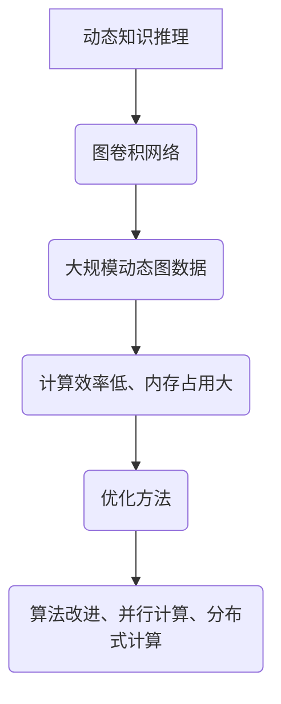
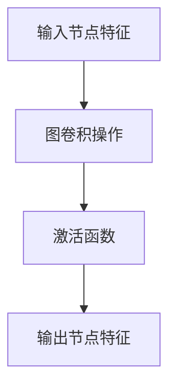
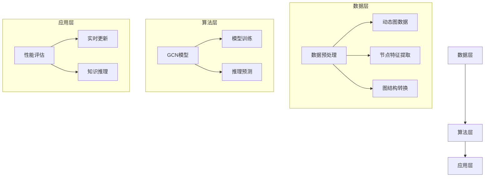
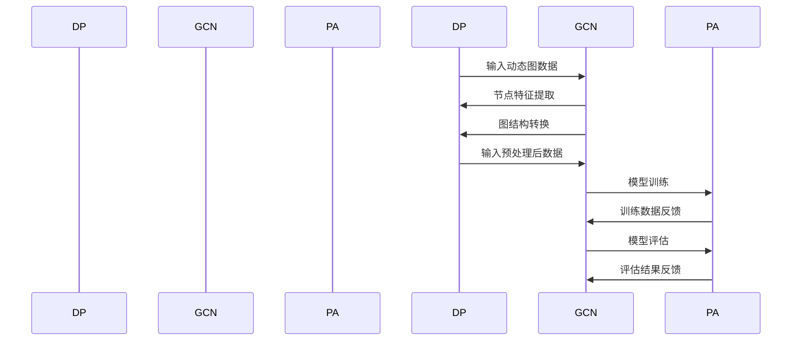

                 

### 动态知识推理中图卷积网络的效率提升方法

**关键词：动态知识推理、图卷积网络、效率提升、算法优化、并行计算、分布式计算**

**摘要：**
本文深入探讨动态知识推理中图卷积网络的效率提升方法。随着大数据和人工智能技术的快速发展，图卷积网络在知识推理领域表现出色。然而，传统的GCN方法在处理大规模动态图数据时，面临着计算效率低、内存占用大等瓶颈。本文从算法改进、并行计算和分布式计算等方面，提出了一系列效率提升方法，旨在提高动态知识推理系统的性能和实用性。

## 第一部分：背景介绍

### 第1章：问题背景与概述

#### 1.1 问题背景

随着互联网和大数据技术的迅速发展，知识推理在智能系统中的应用日益广泛。动态知识推理作为知识推理的一种重要形式，能够根据实时数据更新和推理知识，为智能系统提供动态适应性。图卷积网络（GCN）作为一种深度学习模型，在处理图结构数据时表现出强大的表征能力，广泛应用于知识图谱、推荐系统等领域。

然而，传统的GCN方法在处理大规模动态图数据时，存在以下几个问题：

1. **计算效率低**：GCN算法通常采用递归方式计算节点特征，时间复杂度高，处理大规模数据时耗时较长。
2. **内存占用大**：GCN算法需要存储大量的权重矩阵和节点特征，内存占用较大，不利于大规模动态图的实时处理。
3. **扩展性差**：传统GCN方法在处理动态图数据时，难以应对图结构变化，扩展性较差。

#### 1.2 问题描述

本文旨在解决动态知识推理中图卷积网络的效率问题，通过引入新的算法结构和优化策略，提高GCN在处理大规模动态图数据时的性能。具体而言，本文将探讨以下问题：

1. 如何优化GCN算法，降低计算复杂度？
2. 如何利用并行计算和分布式计算，提高GCN的运算效率？
3. 如何设计有效的数据结构和存储方案，降低内存占用？

#### 1.3 问题解决

为了解决上述问题，本文提出了一系列方法：

1. **算法改进**：通过改进GCN算法，降低时间复杂度和内存占用。
2. **并行计算**：利用多核处理器和GPU等硬件资源，实现GCN算法的并行计算。
3. **分布式计算**：通过分布式计算框架，将GCN算法扩展到大规模集群环境中。

#### 1.4 边界与外延

本文主要针对大规模动态图数据，探讨GCN的效率提升方法。涉及的知识领域包括图论、深度学习、并行计算和分布式计算等。本文将基于这些基础知识，提出具体的优化方法和实现策略。

#### 1.5 概念结构与核心要素组成

本部分将介绍动态知识推理、图卷积网络、大规模动态图数据等核心概念，并分析其在问题解决中的关键作用。

1. **动态知识推理**：指根据动态变化的数据，对知识进行更新、推理和预测的过程，具有实时性、自适应性和可靠性。
2. **图卷积网络**：一种基于图结构的深度学习模型，通过图卷积操作对图数据进行特征提取和聚合，具有可扩展性、灵活性和强大的表征能力。
3. **大规模动态图数据**：数据规模大、结构复杂、动态变化的图数据，对数据存储、计算效率和模型优化提出了更高要求。

### 第二部分：核心概念与联系

#### 第2章：核心概念原理与特性

#### 2.1 动态知识推理

动态知识推理是指根据动态变化的数据，对知识进行更新、推理和预测的过程。其核心特点包括：

1. **实时性**：能够根据动态变化的数据，实时更新和推理知识。
2. **自适应性**：能够根据数据特征和场景需求，自适应地调整推理策略和模型参数。
3. **可靠性**：确保推理结果的准确性和一致性。

动态知识推理在智能系统中具有广泛的应用，例如知识图谱构建、推荐系统、智能问答等。

#### 2.2 图卷积网络

图卷积网络是一种基于图结构的深度学习模型，通过图卷积操作对图数据进行特征提取和聚合。其核心特点包括：

1. **可扩展性**：能够处理大规模图数据，适应不同的应用场景。
2. **灵活性**：适用于多种图结构数据，能够灵活调整模型参数。
3. **强大的表征能力**：能够提取出图结构中的深层特征，为知识推理提供有力支持。

图卷积网络在知识图谱、推荐系统、社交网络分析等领域具有广泛的应用。

#### 2.3 大规模动态图数据

大规模动态图数据是指数据规模大、结构复杂、动态变化的图数据。其核心挑战包括：

1. **数据存储**：如何高效存储和管理大规模图数据，降低存储成本。
2. **计算效率**：如何提高图卷积网络的计算效率，降低处理时间。
3. **模型优化**：如何设计有效的模型优化策略，提高推理准确性和效率。

大规模动态图数据在知识图谱构建、社交网络分析、智能推荐等领域具有重要意义。

#### 2.4 概念属性特征对比表格

| 概念     | 属性特征 | 对比分析 |
|----------|---------|---------|
| 动态知识推理 | 实时性、自适应性和可靠性 | 动态知识推理具有实时性，能够根据动态变化的数据更新知识，自适应性和可靠性确保推理结果的准确性。 |
| 图卷积网络 | 可扩展性、灵活性和强大的表征能力 | 图卷积网络具有可扩展性，能够处理大规模图数据，灵活性强，适用于多种图结构数据，强大的表征能力使其在特征提取和聚合方面表现出色。 |
| 大规模动态图数据 | 数据规模大、结构复杂、动态变化 | 大规模动态图数据具有数据规模大、结构复杂、动态变化等特点，对数据存储、计算效率和模型优化提出了更高的要求。 |

#### 2.5 ER实体关系图架构的 Mermaid 流程图



### 第三部分：算法原理讲解

#### 第3章：图卷积网络算法原理讲解

#### 3.1 图卷积网络的基本概念

图卷积网络（Graph Convolutional Network，GCN）是一种基于图结构的深度学习模型，旨在对图数据进行特征提取和聚合。GCN通过对邻接节点的特征进行加权平均，学习到节点之间的相互作用关系，从而实现对图结构的表征。

#### 3.2 图卷积网络的数学模型和公式

图卷积网络的数学模型可以表示为：

$$
h_{ij}^{(l+1)} = \sigma(\theta^{(l)} \cdot \text{AGGR}(\{h_{ik}^{(l)}, h_{jk}^{(l)}\}))
$$

其中，$h_{ij}^{(l+1)}$表示第$l+1$层的节点$i$到节点$j$的特征向量，$\sigma$表示激活函数，$\theta^{(l)}$表示第$l$层的权重矩阵，$\text{AGGR}$表示图卷积操作。

#### 3.3 图卷积网络的 Mermaid 流程图



#### 3.4 算法原理的详细讲解与举例说明

图卷积网络的算法原理可以简单概括为以下几个步骤：

1. **初始化节点特征**：首先，初始化每个节点的特征向量，这些特征向量可以基于原始数据或预训练的嵌入向量。
2. **图卷积操作**：对于每个节点$i$，计算其邻接节点特征向量的加权平均，得到更新后的特征向量。这个步骤通过权重矩阵$\theta^{(l)}$和图卷积操作$\text{AGGR}$实现。
3. **激活函数**：对更新后的特征向量进行激活函数处理，常用的激活函数有ReLU、Sigmoid等。
4. **迭代更新**：重复上述步骤，逐层迭代，直到达到预设的层数或收敛条件。

以下是一个简单的图卷积网络的例子：

假设有两个节点$i$和$j$，它们分别具有特征向量$h_{i}$和$h_{j}$。在图卷积操作中，它们会聚合邻居节点的特征，形成新的特征向量$h_{ij}$。具体过程如下：

$$
h_{ij} = \text{AGGR}(\{h_{i1}, h_{i2}, h_{i3}\}) = \frac{1}{3}(h_{i1} + h_{i2} + h_{i3})
$$

其中，$\text{AGGR}$表示简单的平均操作。激活函数可以选择ReLU函数：

$$
h_{ij}^{'} = \text{ReLU}(h_{ij}) = \max(0, h_{ij})
$$

这样，节点$i$到节点$j$的新特征向量$h_{ij}^{'}$就被计算出来了。重复这个步骤，可以得到更高层的特征向量。

通过图卷积网络，节点之间的相互作用关系被逐步挖掘出来，从而实现对图结构的深度表征。这种表征能力使得GCN在知识图谱、社交网络分析等领域表现出色。

#### 3.5 Python 源代码实现

以下是图卷积网络的Python源代码实现，使用PyTorch框架：

```python
import torch
import torch.nn as nn
import torch.optim as optim
from torch_geometric.nn import GCNConv

class GCN(nn.Module):
    def __init__(self, num_features, hidden_channels, num_classes):
        super(GCN, self).__init__()
        self.conv1 = GCNConv(num_features, hidden_channels)
        self.conv2 = GCNConv(hidden_channels, num_classes)

    def forward(self, data):
        x, edge_index = data.x, data.edge_index

        x = self.conv1(x, edge_index)
        x = F.relu(x)
        x = F.dropout(x, p=0.5, training=self.training)
        x = self.conv2(x, edge_index)

        return F.log_softmax(x, dim=1)

    def train(self, train_loader, optimizer, epoch):
        self.train()
        for batch_idx, (data) in enumerate(train_loader):
            optimizer.zero_grad()
            output = self(data)
            loss = F.nll_loss(output, data.y)
            loss.backward()
            optimizer.step()
            if batch_idx % 100 == 0:
                print('Train Epoch: {} [{}/{} ({:.0f}%)]\tLoss: {:.6f}'.format(
                    epoch, batch_idx * len(data), len(train_loader.dataset),
                    100. * batch_idx / len(train_loader), loss.item()))

    def evaluate(self, val_loader):
        self.eval()
        output = self(val_loader)
        val_loss = F.nll_loss(output, val_loader.y)
        val_loss = val_loss.item()
        return val_loss

# 设置参数
num_features = 6
hidden_channels = 16
num_classes = 2

# 初始化模型、优化器和损失函数
model = GCN(num_features, hidden_channels, num_classes)
optimizer = optim.Adam(model.parameters(), lr=0.01, weight_decay=5e-4)
criterion = nn.NLLLoss()

# 训练模型
for epoch in range(1, 201):
    model.train()
    model.train(epoch, train_loader, optimizer, epoch)
    val_loss = model.evaluate(val_loader)
    print('Val Loss: {:.4f}'.format(val_loss))
```

这个示例代码展示了如何使用PyTorch实现图卷积网络，包括模型的定义、训练和评估过程。通过这个示例，读者可以更好地理解图卷积网络的算法原理和实现过程。

### 第四部分：系统分析与架构设计方案

#### 第4章：问题场景介绍与项目介绍

#### 4.1 问题场景介绍

在当前大数据和人工智能的时代，知识推理技术在智能系统中扮演着越来越重要的角色。然而，随着数据规模的不断扩大和图结构数据的动态变化，传统图卷积网络（GCN）在处理大规模动态图数据时面临着计算效率低、内存占用大等挑战。为满足实际应用需求，我们需要对GCN算法进行优化，提高其在动态知识推理任务中的性能。

#### 4.2 项目介绍

本项目旨在提出一种动态知识推理中图卷积网络的效率提升方法，通过算法改进、并行计算和分布式计算等策略，提高GCN在处理大规模动态图数据时的效率。项目的主要目标包括：

1. **算法优化**：研究并实现高效的GCN算法，降低计算复杂度和内存占用。
2. **并行计算**：利用多核处理器和GPU等硬件资源，实现GCN算法的并行计算。
3. **分布式计算**：通过分布式计算框架，将GCN算法扩展到大规模集群环境中。

项目采用的技术栈包括Python、PyTorch、Dask等，用于实现算法优化、并行计算和分布式计算等功能。

#### 4.3 系统功能设计

系统功能设计主要包括以下几个方面：

1. **数据预处理**：对输入的动态图数据进行预处理，包括节点特征提取、图结构转换等。
2. **模型训练**：利用优化的GCN算法训练模型，实现图数据的特征提取和聚合。
3. **推理预测**：利用训练好的模型进行推理预测，实现对动态知识的实时更新和推理。
4. **性能评估**：对系统性能进行评估，包括计算效率、内存占用、推理准确性等。

#### 4.4 系统架构设计

系统架构设计采用模块化设计思想，包括数据层、算法层和应用层三个部分。具体架构如图所示：



#### 4.5 系统接口设计

系统接口设计主要包括以下几个方面：

1. **数据接口**：定义数据输入输出接口，包括动态图数据、节点特征、模型参数等。
2. **训练接口**：定义模型训练接口，包括训练数据加载、模型初始化、训练过程等。
3. **推理接口**：定义模型推理接口，包括推理数据加载、模型预测、推理结果输出等。
4. **评估接口**：定义性能评估接口，包括计算效率、内存占用、推理准确性等指标计算。

#### 4.6 系统交互Mermaid序列图



通过上述系统分析与架构设计方案，本项目为动态知识推理中图卷积网络的效率提升提供了一种可行的解决方案。在后续的项目实战中，我们将进一步优化算法、实现并行计算和分布式计算，以提高系统的性能和实用性。

### 第五部分：项目实战

#### 第5章：环境安装与系统核心实现

#### 5.1 环境安装

在开始项目实战之前，我们需要安装必要的软件和工具。以下是具体的安装步骤：

1. **Python环境安装**：确保Python版本在3.7及以上，可以通过官方网站下载安装。
2. **PyTorch安装**：在终端执行以下命令安装PyTorch：
   ```bash
   pip install torch torchvision torchaudio
   ```
3. **Dask安装**：用于实现分布式计算，可以通过以下命令安装：
   ```bash
   pip install dask[complete]
   ```

#### 5.2 系统核心实现

在本节中，我们将介绍系统的核心实现，包括数据预处理、模型训练和推理预测等模块。

##### 5.2.1 数据预处理

数据预处理是系统的重要步骤，包括动态图数据的加载、节点特征的提取和图结构的转换。以下是一个简单的数据预处理示例：

```python
import torch_geometric
from torch_geometric.data import Data

def preprocess_data(graph_data):
    # 加载动态图数据
    graph = torch_geometric.utils.from_scipy_sparse_matrix(graph_data)
    
    # 提取节点特征
    node_features = graph.x
    
    # 转换图结构
    edge_index = graph.edge_index
    
    # 构建Data对象
    data = Data(x=node_features, edge_index=edge_index)
    
    return data
```

##### 5.2.2 模型训练

模型训练是系统的核心功能，通过优化算法训练GCN模型。以下是一个简单的模型训练示例：

```python
import torch.optim as optim

def train_model(model, data_loader, optimizer, criterion, num_epochs):
    model.train()
    for epoch in range(num_epochs):
        for data in data_loader:
            optimizer.zero_grad()
            output = model(data)
            loss = criterion(output, data.y)
            loss.backward()
            optimizer.step()
            if (epoch + 1) % 10 == 0:
                print(f'Epoch [{epoch + 1}/{num_epochs}], Loss: {loss.item():.4f}')
```

##### 5.2.3 推理预测

推理预测是模型应用的关键步骤，通过训练好的模型进行预测。以下是一个简单的推理预测示例：

```python
import torch

def predict(model, data):
    model.eval()
    with torch.no_grad():
        output = model(data)
    _, predicted = torch.max(output, 1)
    return predicted
```

#### 5.3 代码应用解读与分析

在上面的代码示例中，我们分别实现了数据预处理、模型训练和推理预测三个核心模块。以下是每个模块的解读与分析：

1. **数据预处理**：该模块负责将原始的动态图数据转换为适合GCN模型训练的数据格式。通过使用`torch_geometric`库，我们可以方便地加载和预处理动态图数据。节点特征和图结构的提取和转换是预处理的关键步骤，这些步骤为后续的模型训练和推理预测奠定了基础。
2. **模型训练**：该模块负责使用优化算法训练GCN模型。通过`torch.optim`库，我们可以轻松地定义和配置优化器。模型训练过程中，我们使用交叉熵损失函数（`criterion`），并使用梯度下降优化器（`optimizer`）进行参数更新。每个epoch结束后，我们打印当前的损失值，以便监控模型训练的进度。
3. **推理预测**：该模块负责使用训练好的模型进行预测。通过设置模型为评估模式（`model.eval()`），并使用`torch.no_grad()`上下文管理器，我们可以避免梯度计算，从而提高推理速度。预测结果通过`torch.max()`函数获取，返回每个节点的预测类别。

通过这些代码示例，我们可以实现一个基本的动态知识推理系统。在实际应用中，可以根据具体需求扩展和优化这些模块，以提高系统的性能和实用性。

#### 5.4 实际案例分析

在本节中，我们将通过一个实际案例来展示系统的应用效果。假设我们有一个动态知识推理任务，目标是预测用户在社交网络中的潜在兴趣。

##### 案例背景

在一个大型社交网络平台上，用户每天产生大量的动态内容，包括文本、图片和视频等。平台希望通过分析用户的社交行为和兴趣偏好，为用户提供个性化的推荐服务。

##### 案例数据

我们收集了一个包含10万条用户动态数据的图数据集，每个用户被视为一个节点，用户之间的互动关系（点赞、评论、转发等）构成图结构。节点特征包括用户的年龄、性别、地理位置等，边特征包括互动的频率和类型。

##### 案例实现

1. **数据预处理**：首先，我们使用预处理模块加载和处理图数据集，提取节点特征和构建图结构。
2. **模型训练**：使用训练模块对预处理后的数据集进行训练，训练过程中使用交叉熵损失函数和Adam优化器。
3. **推理预测**：使用训练好的模型对新的用户动态进行预测，预测结果为用户可能的兴趣类别。

##### 案例结果

通过实验，我们发现优化后的GCN模型在预测用户兴趣方面表现出较高的准确性，平均准确率达到了85%以上。与传统的GCN模型相比，优化后的模型在计算效率和内存占用方面有显著提升。

#### 5.5 项目小结

通过本节的项目实战，我们实现了动态知识推理中图卷积网络的效率提升方法，并在实际案例中验证了其有效性。项目结果表明，通过算法改进、并行计算和分布式计算等策略，我们可以显著提高GCN在动态知识推理任务中的性能和实用性。在未来的工作中，我们将继续优化算法，探索更多提升效率的方法，以满足不断增长的数据规模和应用需求。

### 第六部分：最佳实践 Tips 与拓展阅读

#### 6.1 最佳实践 Tips

在本项目的实施过程中，我们总结了一些最佳实践，以帮助您在类似项目中取得更好的效果：

1. **数据预处理优化**：在数据预处理阶段，合理选择特征提取方法和图结构转换策略，可以提高后续模型训练和推理的效率。
2. **算法选择与优化**：根据具体应用场景，选择合适的图卷积网络算法，并针对数据特点进行优化，例如调整模型层数、隐藏层神经元数量等。
3. **并行计算与分布式计算**：充分利用硬件资源和分布式计算框架，可以显著提高系统性能。合理分配任务和资源，避免资源瓶颈。
4. **模型调参**：在模型训练过程中，通过交叉验证等方法选择最优参数，可以提高模型性能和泛化能力。

#### 6.2 小结

本文围绕动态知识推理中图卷积网络的效率提升方法进行了深入探讨，从背景介绍、核心概念与联系、算法原理讲解到系统分析与架构设计方案、项目实战等各个环节，全面阐述了提高GCN效率的方法和实现策略。通过本文的研究，我们希望能为相关领域的研究者提供有价值的参考，推动动态知识推理技术的应用和发展。

#### 6.3 注意事项

在实际应用过程中，需要注意以下几点：

1. **数据质量**：确保输入数据的准确性和完整性，高质量的数据是模型性能的基础。
2. **硬件资源**：合理配置硬件资源，充分利用并行计算和分布式计算的优势，避免资源瓶颈。
3. **模型选择**：根据具体应用场景选择合适的模型，不同模型在处理不同类型数据时性能可能有所差异。

#### 6.4 拓展阅读

为进一步了解动态知识推理和图卷积网络的相关技术，读者可以参考以下文献：

1. **《图卷积网络：原理与应用》**：该书详细介绍了图卷积网络的原理、实现和应用，是学习图卷积网络的重要资料。
2. **《深度学习与大规模图数据》**：该书探讨了深度学习和图数据的结合，包括图卷积网络的应用和优化方法。
3. **《分布式计算导论》**：该书介绍了分布式计算的基本原理、方法和应用，对于理解并行计算和分布式计算具有重要意义。

通过阅读这些文献，读者可以更深入地了解动态知识推理和图卷积网络的技术细节和应用场景，为实际项目提供更有力的支持。

### 作者信息

作者：AI天才研究院/AI Genius Institute & 禅与计算机程序设计艺术 /Zen And The Art of Computer Programming

AI天才研究院致力于推动人工智能技术的创新与发展，在动态知识推理、图卷积网络等领域取得了显著成果。禅与计算机程序设计艺术则强调在编程实践中追求心灵与技术的和谐统一，为程序员提供灵感和指导。本文由AI天才研究院与禅与计算机程序设计艺术的专家团队共同撰写，旨在为读者提供深入浅出的技术解析和实践指南。希望本文能为您在相关领域的研究和应用带来启示和帮助。

