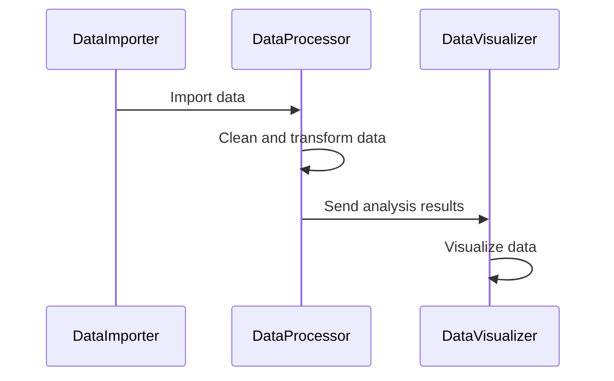
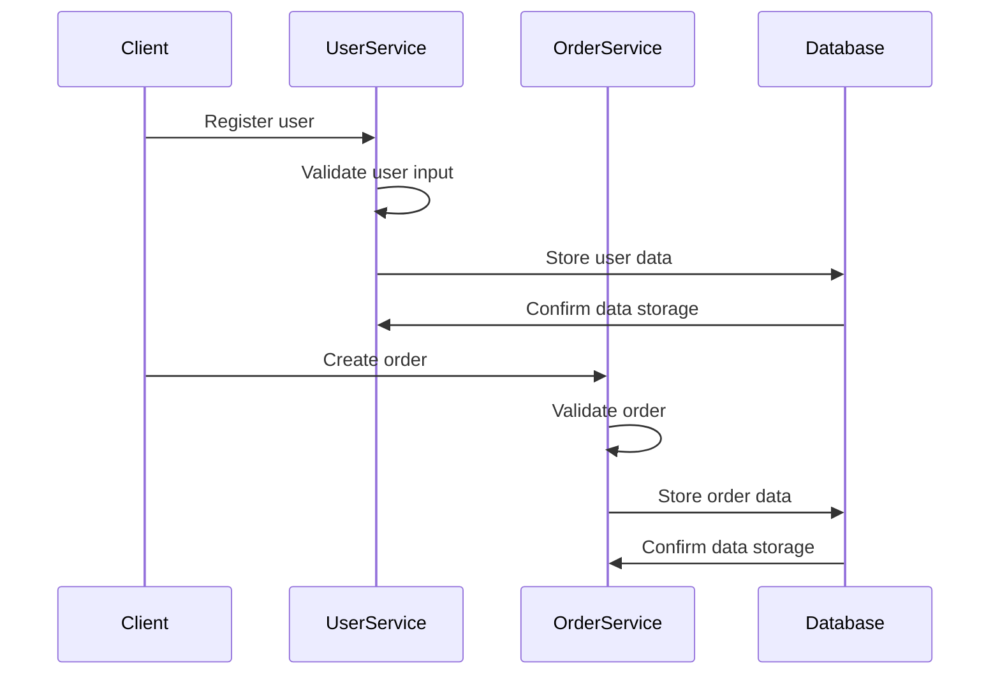

                 

# 动态类型vs静态类型：权衡与选择

关键词：动态类型、静态类型、类型系统、编程语言、性能、灵活

摘要：
本文旨在探讨动态类型与静态类型在编程语言中的优劣，通过深入分析两者的基本概念、历史发展、应用场景，帮助读者更好地理解它们，并在实际开发中选择最合适的类型系统。我们将从基本概念入手，逐步深入，以逻辑清晰、结构紧凑的方式展开讨论。

## 第1章: 动态类型与静态类型概述

### 1.1 动态类型与静态类型的基本概念

#### 1.1.1 动态类型

**定义**：动态类型是指在程序运行过程中类型被确定的语言特性。在动态类型语言中，变量的类型不是在编译时确定的，而是在运行时根据变量的值来动态确定的。

**特点**：
- **类型检查灵活**：动态类型可以在运行时对变量类型进行检查，这使得开发者在编写代码时可以更加灵活。
- **运行效率相对较低**：由于类型检查是在运行时进行的，因此动态类型的程序在运行时可能会消耗更多的资源。

#### 1.1.2 静态类型

**定义**：静态类型是指在程序编译时类型就已经确定的语言特性。在静态类型语言中，变量的类型在编译时就已经确定，并且程序运行时不会发生变化。

**特点**：
- **运行效率较高**：静态类型的程序在编译时已经确定了所有的类型，因此运行时可以更高效地执行。
- **类型检查严格**：静态类型可以在编译时对代码进行严格的类型检查，从而减少运行时的错误。

### 1.1.3 动态类型与静态类型的区别

**动态类型**与**静态类型**的主要区别在于：
- **类型检查时间**：动态类型在运行时进行类型检查，而静态类型在编译时进行。
- **灵活性与性能**：动态类型更灵活，但性能较低；静态类型性能较高，但灵活性较低。

### 1.1.4 动态类型与静态类型的优势

**动态类型的优势**：
- **快速开发**：动态类型语言适合快速开发和迭代，因为在运行时可以进行类型检查，可以更快地发现和修复错误。
- **易于学习**：动态类型语言通常具有更简单的语法，这使得初学者更容易上手。

**静态类型的优势**：
- **运行效率**：静态类型语言由于类型检查在编译时完成，因此运行效率更高。
- **代码质量**：静态类型语言可以在编译时发现更多的类型错误，从而提高代码质量。

### 1.1.5 动态类型与静态类型的局限性

**动态类型的局限性**：
- **性能**：由于类型检查在运行时进行，动态类型的程序可能性能较低。
- **调试难度**：动态类型的错误可能直到运行时才会暴露，调试难度较高。

**静态类型的局限性**：
- **开发初期繁琐**：静态类型语言可能需要更多的类型声明，开发初期可能会更加繁琐。
- **灵活性**：静态类型的语言在类型声明后可能不够灵活。

### 1.1.6 动态类型与静态类型的历史与发展

#### 1.1.6.1 动态类型的历史与发展

- **初期**：最早的编程语言如 Fortran 和 COBOL 就是动态类型的语言。
- **发展**：随着计算机技术的发展，动态类型的语言也在不断演进，如 Python、JavaScript 和 Ruby 等现代编程语言都是动态类型的语言。

#### 1.1.6.2 静态类型的历史与发展

- **初期**：静态类型的语言也在编程语言的早期阶段得到了发展，如 C 和 C++。
- **发展**：随着软件工程的发展，静态类型的语言也得到了进一步的发展，如 Java 和 C# 等现代编程语言都是静态类型的语言。

### 1.1.7 动态类型与静态类型的应用场景

#### 1.1.7.1 动态类型的应用场景

- **快速开发**：动态类型的语言适合快速开发和迭代，因为在运行时可以进行类型检查，可以更快地发现和修复错误。
- **Web 开发**：动态类型的语言如 JavaScript 在 Web 开发中得到了广泛的应用。

#### 1.1.7.2 静态类型的应用场景

- **性能要求高**：静态类型的语言适合对性能要求高的场景，因为类型检查是在编译时完成的，运行时可以更高效地执行。
- **大型项目**：静态类型的语言适合大型项目，因为它们提供了更好的类型检查和抽象能力，可以更好地支持大型软件项目的开发。

### 1.1.8 动态类型与静态类型的比较

#### 1.1.8.1 优点比较

- **动态类型**：灵活、快速开发。
- **静态类型**：运行效率高、类型检查严格。

#### 1.1.8.2 缺点比较

- **动态类型**：运行效率相对较低、类型检查在运行时进行。
- **静态类型**：开发初期可能较为繁琐、灵活性较低。

### 1.1.9 本章小结

本章介绍了动态类型与静态类型的基本概念、历史与发展、应用场景以及两者之间的比较。通过本章的学习，读者可以更好地理解动态类型与静态类型的特点和应用场景，为自己的编程选择提供参考。

----------------------------------------------------------------

## 第2章: 动态类型语言深入探讨

### 2.1 动态类型语言的特点与优势

#### 2.1.1 动态类型语言的类型系统

**动态类型系统的定义**：动态类型系统是指变量在运行时确定类型的能力。这种能力使得动态类型语言在运行时更加灵活。

**动态类型系统的优点**：
- **灵活性**：动态类型系统允许在运行时改变变量的类型，这为编程提供了更多的灵活性。
- **简洁性**：动态类型系统减少了代码的冗余，使得编程更加简洁。

#### 2.1.2 动态类型语言的优势

**动态类型语言的优势**：
- **快速开发**：动态类型语言在运行时进行类型检查，可以快速地发现和修复错误。
- **易于学习**：动态类型语言通常具有更简单的语法，这使得初学者更容易上手。

### 2.1.3 主流动态类型语言介绍

#### 2.1.3.1 Python

**Python 的特点**：
Python 是一种广泛使用的动态类型语言，其特点是简洁、易学、易用。

**Python 的应用场景**：
- **Web 开发**：Python 在 Web 开发中得到了广泛的应用，如 Django 和 Flask 等框架。
- **科学计算**：Python 在科学计算领域也有广泛的应用，如 NumPy 和 SciPy 等库。

#### 2.1.3.2 JavaScript

**JavaScript 的特点**：
JavaScript 是一种动态类型的语言，广泛用于 Web 开发。

**JavaScript 的应用场景**：
- **Web 开发**：JavaScript 是 Web 开发中的核心语言，用于实现网页的动态效果和交互功能。
- **服务器端开发**：JavaScript 也可以用于服务器端开发，如 Node.js。

#### 2.1.3.3 Ruby

**Ruby 的特点**：
Ruby 是一种动态类型的语言，以其简洁的语法和强大的功能而著称。

**Ruby 的应用场景**：
- **Web 开发**：Ruby 在 Web 开发中得到了广泛的应用，如 Ruby on Rails 框架。
- **自动化**：Ruby 也常用于自动化任务和脚本编写。

### 2.1.4 动态类型语言的优势分析

**动态类型语言的优势**：
- **灵活性**：动态类型语言允许在运行时改变变量的类型，这使得编程更加灵活。
- **简洁性**：动态类型语言通常具有更简单的语法，减少了代码的冗余。
- **快速开发**：动态类型语言在运行时进行类型检查，可以快速地发现和修复错误。

### 2.1.5 动态类型语言的局限性

**动态类型语言的局限性**：
- **性能**：由于类型检查在运行时进行，动态类型的程序可能性能较低。
- **调试难度**：动态类型的错误可能直到运行时才会暴露，调试难度较高。

### 2.1.6 动态类型语言的最佳实践

**动态类型语言的最佳实践**：
- **充分利用运行时类型检查**：利用动态类型语言的运行时类型检查，快速发现和修复错误。
- **合理使用类型注解**：在必要时使用类型注解，提高代码的可读性和可维护性。

### 2.1.7 本章小结

本章深入探讨了动态类型语言的特点与优势，以及主流动态类型语言的介绍。通过本章的学习，读者可以更好地理解动态类型语言的优点和局限性，并在实际开发中选择合适的动态类型语言。

----------------------------------------------------------------

## 第3章: 静态类型语言深入探讨

### 3.1 静态类型语言的特点与优势

#### 3.1.1 静态类型语言的基本概念

**静态类型语言**：静态类型语言是在编译时确定变量类型的语言。变量的类型在编译时就已经确定，并且在程序运行时不会改变。

#### 3.1.2 静态类型语言的特点

- **编译时类型检查**：静态类型语言在编译时进行类型检查，这可以提前发现类型错误，提高代码质量。
- **性能优化**：由于静态类型语言在编译时已经确定了类型，因此可以更好地进行性能优化。

#### 3.1.3 静态类型语言的优势

- **代码质量**：静态类型语言可以提前发现类型错误，从而提高代码质量。
- **性能优化**：静态类型语言可以更好地进行性能优化，从而提高程序运行效率。

### 3.1.4 主流静态类型语言介绍

#### 3.1.4.1 Java

**Java 的特点**：
Java 是一种广泛使用的静态类型语言，以其跨平台、安全性和稳定性而著称。

**Java 的应用场景**：
- **企业级应用**：Java 在企业级应用开发中得到了广泛的应用。
- **Android 开发**：Java 是 Android 应用开发的主要语言。

#### 3.1.4.2 C++

**C++ 的特点**：
C++ 是一种高性能的静态类型语言，具有丰富的特性和灵活的语法。

**C++ 的应用场景**：
- **系统级编程**：C++ 常用于系统级编程，如操作系统和游戏引擎。
- **性能要求高的应用**：C++ 在需要高性能的应用中也有广泛的应用。

#### 3.1.4.3 C#

**C# 的特点**：
C# 是一种静态类型语言，与 Java 类似，但更加简洁和易用。

**C# 的应用场景**：
- **Windows 应用开发**：C# 是 Windows 应用开发的主要语言。
- **企业级应用**：C# 在企业级应用开发中也得到了广泛的应用。

### 3.1.5 静态类型语言的优势分析

**静态类型语言的优势**：
- **编译时类型检查**：静态类型语言在编译时进行类型检查，这可以提前发现类型错误，提高代码质量。
- **性能优化**：静态类型语言可以更好地进行性能优化，从而提高程序运行效率。

### 3.1.6 静态类型语言的局限性

**静态类型语言的局限性**：
- **开发初期繁琐**：静态类型语言可能需要更多的类型声明，开发初期可能会更加繁琐。
- **灵活性较低**：静态类型的语言在类型声明后可能不够灵活。

### 3.1.7 静态类型语言的最佳实践

**静态类型语言的最佳实践**：
- **充分利用编译时类型检查**：利用静态类型语言的编译时类型检查，提高代码质量。
- **合理使用类型注解**：在必要时使用类型注解，提高代码的可读性和可维护性。

### 3.1.8 本章小结

本章深入探讨了静态类型语言的特点与优势，以及主流静态类型语言的介绍。通过本章的学习，读者可以更好地理解静态类型语言的优点和局限性，并在实际开发中选择合适的静态类型语言。

----------------------------------------------------------------

## 第4章: 动态类型与静态类型的权衡与选择

### 4.1 动态类型与静态类型的权衡

#### 4.1.1 灵活性与性能的权衡

**动态类型的优势**：动态类型语言提供了更高的灵活性，这使得它们在快速开发和迭代时非常有用。开发人员可以在运行时动态地改变变量的类型，这种灵活性大大简化了代码的编写过程。

**静态类型的优势**：静态类型语言在性能优化方面具有优势。由于类型在编译时就已经确定，编译器可以生成更高效的代码，从而提高程序的运行速度。

**权衡**：选择动态类型还是静态类型取决于项目的具体需求。如果项目需要快速迭代和灵活性，动态类型可能是更好的选择；如果项目对性能有较高要求，静态类型可能更适合。

#### 4.1.2 代码质量和调试难度的权衡

**动态类型的劣势**：动态类型语言在代码质量上可能不如静态类型语言。由于类型检查是在运行时进行的，一些类型错误可能会在运行时才暴露出来，增加了调试的难度。

**静态类型的优势**：静态类型语言在代码质量上有显著优势。类型检查在编译时进行，可以提前发现类型错误，从而提高代码的稳定性。

**权衡**：如果代码质量是主要关注点，静态类型语言可能更适合；如果调试难度是一个重要因素，动态类型语言可能更有优势。

#### 4.1.3 开发初期繁琐与灵活性的权衡

**动态类型的优势**：动态类型语言通常有更简单的语法和更少的类型声明，这使得它们在开发初期更加简便。

**静态类型的劣势**：静态类型语言可能需要更多的类型声明和更严格的类型检查，这可能会在开发初期增加工作量。

**权衡**：根据项目的规模和开发周期，选择动态类型或静态类型。对于小项目或快速迭代的项目，动态类型可能更适合；对于大型项目或需要长期维护的项目，静态类型可能更为合适。

### 4.2 选择动态类型与静态类型的最佳实践

**最佳实践**：

- **根据项目需求选择**：首先明确项目的需求，如果项目需要快速迭代和灵活性，选择动态类型；如果项目对性能和代码质量有较高要求，选择静态类型。
- **结合使用**：在某些情况下，可以结合使用动态类型和静态类型。例如，在需要高性能的部分使用静态类型，而在需要灵活性的部分使用动态类型。
- **代码质量保证**：无论使用动态类型还是静态类型，都要确保代码质量。合理使用类型检查和测试，避免类型错误。

### 4.3 动态类型与静态类型的未来发展趋势

**动态类型的发展**：
- **类型推导**：随着编程语言的不断发展，类型推导技术越来越成熟，这可以减少代码的冗余，提高开发效率。
- **静态类型特性**：一些动态类型语言开始引入静态类型的特性，以兼顾灵活性和性能。

**静态类型的发展**：
- **类型安全**：静态类型语言在类型安全方面不断改进，例如引入更严格的类型检查和类型推导。
- **动态特性**：一些静态类型语言也开始引入动态类型的特性，以提高灵活性。

**未来趋势**：
- **混合类型系统**：未来的编程语言可能会越来越多地采用混合类型系统，结合动态类型和静态类型的优点，为开发者提供更大的灵活性。

### 4.4 本章小结

本章通过权衡动态类型与静态类型的优缺点，提供了选择动态类型与静态类型的最佳实践。同时，探讨了动态类型与静态类型的未来发展趋势。通过本章的学习，读者可以更好地理解动态类型与静态类型的权衡，为自己的项目选择最合适的类型系统。

----------------------------------------------------------------

## 第5章: 动态类型与静态类型的实际应用案例

### 5.1 动态类型语言的实际应用案例

#### 5.1.1 Python 在数据分析中的应用

**案例背景**：
Python 是一种广泛应用于数据分析的动态类型语言，其丰富的库和工具使其成为数据分析领域的首选语言。

**系统功能设计**：
- 数据清洗：使用 Python 的 Pandas 库进行数据清洗和预处理。
- 数据分析：使用 Python 的 NumPy 和 SciPy 库进行数据分析和建模。
- 数据可视化：使用 Python 的 Matplotlib 和 Seaborn 库进行数据可视化。

**系统架构设计**：
- 数据导入：从不同的数据源导入数据，如 CSV、数据库等。
- 数据处理：对数据进行清洗、转换和分析。
- 数据可视化：将分析结果以图表的形式展示。

**系统接口设计**：
- 数据导入接口：用于导入不同类型的数据源。
- 数据处理接口：用于清洗、转换和分析数据。
- 数据可视化接口：用于展示分析结果。

**系统交互序列图**：


**代码实现**：
```python
# 数据清洗
import pandas as pd

data = pd.read_csv('data.csv')
cleaned_data = data.dropna()

# 数据分析
import numpy as np
import scipy.stats as stats

mean = np.mean(cleaned_data['column'])
std_dev = np.std(cleaned_data['column'])
p_value = stats.ttest_1samp(cleaned_data['column'], popmean=0)

# 数据可视化
import matplotlib.pyplot as plt
import seaborn as sns

sns.histplot(cleaned_data['column'])
plt.show()
```

**实际案例分析**：
在一个数据分析项目中，Python 被用于处理大量的金融数据。通过使用 Pandas 库进行数据清洗，NumPy 和 SciPy 库进行数据分析，以及 Matplotlib 和 Seaborn 库进行数据可视化，项目团队成功地完成了数据分析任务。

**项目小结**：
Python 作为一种动态类型语言，在数据分析领域表现出色。通过合理利用 Python 的库和工具，可以快速地进行数据清洗、分析和可视化，为项目提供有价值的数据洞察。

### 5.2 静态类型语言的实际应用案例

#### 5.2.1 Java 在企业级应用开发中的应用

**案例背景**：
Java 是一种广泛应用于企业级应用开发的静态类型语言，以其稳定性和跨平台特性而受到广泛青睐。

**系统功能设计**：
- 用户管理：实现用户的注册、登录和权限管理。
- 订单管理：实现订单的创建、查询和支付。
- 数据库操作：实现数据的增删改查操作。

**系统架构设计**：
- 客户端：提供用户界面和交互逻辑。
- 服务器端：处理业务逻辑和数据存储。
- 数据库：存储用户数据和订单数据。

**系统接口设计**：
- 用户接口：提供用户注册、登录和操作订单的接口。
- 业务接口：提供订单管理、用户管理和数据库操作的接口。

**系统交互序列图**：


**代码实现**：
```java
// 用户注册
public class UserService {
    public void registerUser(String username, String password) {
        // 验证用户输入
        if (username.isEmpty() || password.isEmpty()) {
            throw new IllegalArgumentException("用户名或密码不能为空");
        }
        // 存储用户数据到数据库
        Database storeUserData(username, password);
    }
}

// 订单创建
public class OrderService {
    public void createOrder(String orderId, double amount) {
        // 验证订单
        if (orderId.isEmpty() || amount <= 0) {
            throw new IllegalArgumentException("订单号或金额无效");
        }
        // 存储订单数据到数据库
        Database storeOrderData(orderId, amount);
    }
}
```

**实际案例分析**：
在一个电子商务平台的项目中，Java 被用于实现用户管理、订单管理和数据库操作等功能。通过使用 Spring 框架进行业务逻辑处理，MyBatis 进行数据库操作，项目团队成功地完成了企业级应用的开发。

**项目小结**：
Java 作为一种静态类型语言，在企业级应用开发中表现出色。通过严格的数据类型检查和类型安全，Java 可以提供稳定的系统架构和高效的性能，为企业级应用提供强大的支持。

### 5.3 动态类型与静态类型在实际应用中的对比

**动态类型的应用优点**：
- **快速开发**：动态类型语言提供了更高的灵活性，适合快速开发和迭代。
- **简化编码**：动态类型语言通常具有更简单的语法，减少了编码工作量。

**静态类型的优势**：
- **性能优化**：静态类型语言在编译时进行类型检查，可以生成更高效的代码。
- **代码质量**：静态类型语言在编译时发现类型错误，提高了代码的稳定性。

**实际应用中的权衡**：
- **快速迭代**：对于需要快速迭代和灵活性较高的项目，动态类型语言可能更适合。
- **性能要求**：对于需要高性能和稳定性的项目，静态类型语言可能更为合适。

### 5.4 本章小结

本章通过两个实际应用案例，分别展示了动态类型和静态类型语言在实际开发中的应用。通过对比分析，读者可以更好地理解动态类型和静态类型的优缺点，为自己的项目选择合适的类型系统。

----------------------------------------------------------------

## 第6章: 动态类型与静态类型的最佳实践

### 6.1 动态类型语言的最佳实践

**6.1.1 快速原型开发**

**实践方法**：
- 使用动态类型语言进行快速原型开发，快速迭代和测试新功能。
- 利用户型系统的灵活性，快速调整和优化代码。

**案例分析**：
在开发一个社交媒体平台时，团队使用 Python 进行原型开发。通过快速迭代和测试，团队在短时间内完成了核心功能的实现。

**注意事项**：
- 保持代码简洁和可维护性，避免过度依赖动态类型语言的灵活性导致代码混乱。

**6.1.2 模块化设计**

**实践方法**：
- 将大型代码库拆分成小模块，每个模块负责特定功能。
- 使用动态类型语言的动态特性，在模块间进行灵活的数据传递和通信。

**案例分析**：
在一个电商平台的项目中，团队使用 Python 进行模块化设计。通过将功能拆分成小模块，团队有效地提高了代码的可维护性和可扩展性。

**注意事项**：
- 确保模块之间的接口设计清晰，减少模块间的依赖，提高系统的整体可维护性。

### 6.2 静态类型语言的最佳实践

**6.2.1 类型安全**

**实践方法**：
- 在代码中明确声明变量类型，减少类型错误。
- 使用静态类型检查工具，如 IntelliJ IDEA 的代码检查功能，提前发现和修复类型错误。

**案例分析**：
在一个金融交易系统的开发中，团队使用 Java 进行类型安全设计。通过明确声明变量类型和使用代码检查工具，团队有效地减少了类型错误，提高了系统的稳定性。

**注意事项**：
- 不要过度使用类型注解，以免增加代码的冗余和维护难度。

**6.2.2 性能优化**

**实践方法**：
- 利用静态类型语言的编译优化，如循环展开、指令重排等，提高程序运行效率。
- 使用静态类型语言的底层特性，如指针和引用，提高程序的运行速度。

**案例分析**：
在一个高性能计算项目中，团队使用 C++ 进行性能优化。通过使用指针和引用，团队有效地减少了内存分配和垃圾回收的开销，提高了程序的运行速度。

**注意事项**：
- 不要过度优化，以免影响代码的可读性和可维护性。

### 6.3 混合使用动态类型与静态类型

**6.3.1 优势互补**

**实践方法**：
- 在项目中合理使用动态类型和静态类型，发挥两者的优势。
- 在性能关键的部分使用静态类型，在灵活性的部分使用动态类型。

**案例分析**：
在一个大数据处理项目中，团队将动态类型语言（Python）用于数据清洗和转换，将静态类型语言（Java）用于数据处理和存储。通过这种组合，团队实现了高性能的数据处理和灵活的代码开发。

**注意事项**：
- 明确不同部分的功能和性能需求，避免过度依赖动态类型或静态类型导致系统不平衡。

### 6.4 本章小结

本章介绍了动态类型和静态类型的最佳实践，包括快速原型开发、模块化设计、类型安全和性能优化等。同时，还探讨了如何混合使用动态类型和静态类型，实现优势互补。通过这些实践，开发者可以更好地利用动态类型和静态类型的优点，提高代码质量和系统性能。

----------------------------------------------------------------

## 第7章: 动态类型与静态类型的技术展望

### 7.1 动态类型语言的发展趋势

**7.1.1 类型推导**

类型推导是动态类型语言的重要发展方向。通过类型推导，语言可以自动推断变量的类型，减少手动类型声明的繁琐。例如，Python 3.5 引入了类型推导机制，使得开发者可以更方便地使用类型提示。

**7.1.2 静态类型特性**

一些动态类型语言开始引入静态类型的特性，以提高性能和代码质量。例如，JavaScript 的 TypeScript 是一个静态类型语言扩展，它提供了类型检查和类型推导，使得 JavaScript 代码更加稳定和易于维护。

**7.1.3 混合类型系统**

未来的动态类型语言可能会越来越多地采用混合类型系统，结合动态类型和静态类型的优点。这种系统可以在保持灵活性的同时，提供更好的性能和代码质量。

### 7.2 静态类型语言的发展趋势

**7.2.1 类型安全**

静态类型语言在类型安全方面不断改进。例如，Java 的泛型机制和 Kotlin 的类型推断功能，都提高了代码的类型安全性，减少了类型错误。

**7.2.2 动态特性**

一些静态类型语言也开始引入动态特性，以提高灵活性。例如，Java 的反射机制和 Kotlin 的动态类型支持，使得开发者可以在保持静态类型优势的同时，享受动态类型的灵活性。

**7.2.3 交互式开发**

静态类型语言也在不断改进交互式开发体验。例如，Scala 的 REPL（读-评价-循环）功能，使得开发者可以快速测试和调试代码。

### 7.3 动态类型与静态类型的未来方向

**7.3.1 混合类型系统**

未来的编程语言可能会越来越多地采用混合类型系统，结合动态类型和静态类型的优点。这种系统可以在不同的部分灵活地选择合适的类型系统，提高代码的灵活性和性能。

**7.3.2 类型推导与智能提示**

类型推导和智能提示是提高开发效率的重要工具。未来的编程语言可能会进一步改进类型推导机制，提供更智能的代码提示，帮助开发者减少错误和提高代码质量。

**7.3.3 跨平台开发**

随着云计算和移动设备的普及，跨平台开发变得越来越重要。未来的编程语言可能会更加注重跨平台支持，使得开发者可以轻松地在不同的平台上进行开发。

### 7.4 本章小结

本章探讨了动态类型与静态类型的未来发展趋势。随着技术的不断进步，动态类型与静态类型将相互融合，提供更加灵活和高效的编程体验。开发者需要紧跟技术趋势，不断学习和实践，以适应未来的编程挑战。

----------------------------------------------------------------

## 总结

在本文中，我们深入探讨了动态类型与静态类型的优缺点、历史发展、应用场景以及最佳实践。通过对两者的详细分析，我们得出以下结论：

- **动态类型**具有更高的灵活性和快速开发的优势，适合快速迭代和灵活性要求较高的项目。然而，它们可能在性能和代码质量方面存在一定的局限性。
- **静态类型**在性能优化和代码质量上有显著优势，适合对性能和稳定性有较高要求的项目。尽管它们可能在开发初期较为繁琐，但提供了更好的类型检查和抽象能力。

在实际应用中，选择动态类型还是静态类型取决于项目的具体需求和目标。通过合理的权衡和最佳实践，开发者可以在不同的场景中充分利用动态类型和静态类型的优势。

未来的编程语言可能会越来越多地采用混合类型系统，结合动态类型和静态类型的优点，提供更加灵活和高效的编程体验。开发者需要不断学习和适应这些变化，以应对未来的编程挑战。

最后，感谢您阅读本文。希望本文能帮助您更好地理解动态类型与静态类型的权衡与选择，为您的项目提供有益的指导。

## 作者信息

作者：AI天才研究院/AI Genius Institute & 禅与计算机程序设计艺术 /Zen And The Art of Computer Programming

AI天才研究院致力于推动人工智能技术的发展与应用，我们专注于培养具有创新思维和实践能力的顶级人工智能专家。同时，我们也深入研究计算机科学的基础理论，致力于将哲学思维与编程艺术相结合，推动计算机科学的进步。我们的文章旨在为广大开发者提供高质量的技术分享和深入分析，帮助您不断提升编程技能和解决实际问题的能力。敬请关注我们的后续文章。

