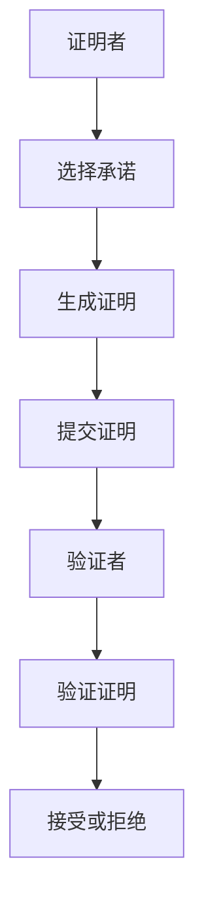
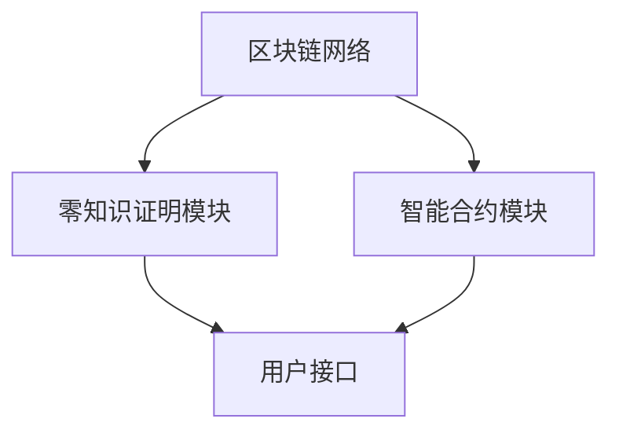
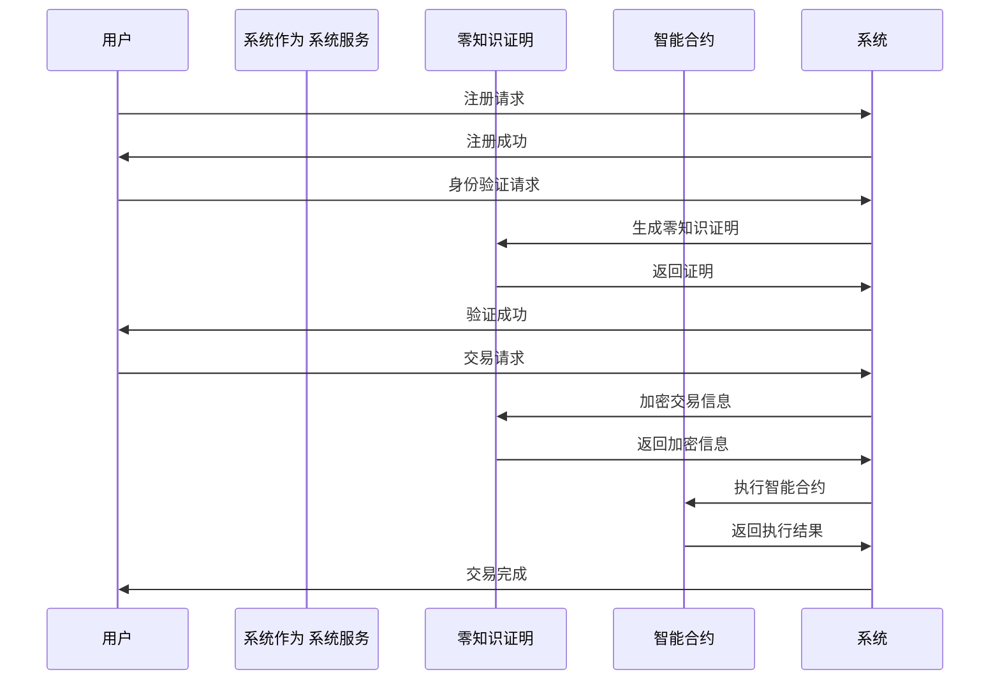

                 

### 《区块链中的零知识证明应用》

> 关键词：区块链、零知识证明、智能合约、隐私保护、数学模型、系统架构

> 摘要：本文从区块链和零知识证明的基础知识出发，详细介绍了零知识证明在区块链中的核心概念、算法原理、系统设计与实现，并通过项目实战展示了零知识证明的实际应用效果，为读者提供了全面的技术指南和最佳实践。

#### 引言

区块链技术作为近年来最热门的科技之一，以其去中心化、不可篡改和安全透明的特点，引起了全球范围内的高度关注。随着区块链应用场景的不断拓展，如何增强区块链的安全性和隐私保护成为亟待解决的问题。零知识证明（Zero-Knowledge Proof，简称ZKP）作为一种强大的密码学工具，能够有效解决这一问题，其在区块链中的重要性日益凸显。

本文旨在通过系统的分析和实例讲解，帮助读者深入理解零知识证明在区块链中的实际应用。首先，我们将回顾区块链和零知识证明的基础知识，然后详细探讨零知识证明的算法原理和数学模型。接下来，我们将探讨零知识证明在区块链系统中的设计与实现，并通过项目实战展示其实际应用效果。最后，我们将总结最佳实践，提供一些注意事项和拓展阅读建议。

#### 背景介绍

##### 区块链简介

区块链是一种分布式数据库技术，通过去中心化的方式记录交易信息。每个区块包含一定数量的交易记录，并以链式结构相连，形成一个不可篡改的账本。区块链的基本原理包括数据加密、共识算法和去中心化网络。

区块链的起源可以追溯到2008年，中本聪（Satoshi Nakamoto）发布了比特币（Bitcoin）白皮书，提出了基于区块链技术的加密货币概念。随着比特币的成功，区块链技术逐渐受到广泛关注，并应用在越来越多的领域。

区块链的关键技术包括：

- **数据加密**：使用非对称加密算法保护数据隐私。
- **共识算法**：确保网络中的节点达成共识，验证交易的有效性。
- **去中心化网络**：通过分布式网络实现数据的共享和管理。

##### 零知识证明简介

零知识证明是一种密码学工具，允许一方（证明者）向另一方（验证者）证明某个陈述为真，而不泄露任何其他信息。零知识证明分为几种类型，如零知识证明证明（Zero-Knowledge Proof，简称ZKP）、零知识证明系统（Zero-Knowledge System，简称ZKS）和零知识证明协议（Zero-Knowledge Protocol，简称ZKP）。

零知识证明的基本原理是通过数学模型实现，通常包括三个步骤：证明生成、证明验证和隐私保护。

- **证明生成**：证明者生成一个数学证明，证明某个陈述为真。
- **证明验证**：验证者验证证明的有效性，确认陈述为真。
- **隐私保护**：在整个过程中，验证者无法获取任何其他信息。

##### 区块链与零知识证明的结合点

区块链和零知识证明的结合具有显著优势，能够提升区块链的安全性和隐私保护能力。具体应用场景包括：

- **智能合约**：零知识证明可以增强智能合约的隐私性和安全性。
- **隐私保护交易**：零知识证明可以实现交易信息的隐私保护。
- **身份验证**：零知识证明可以用于匿名身份验证。

#### 核心概念与联系

##### 零知识证明的各种应用场景

1. **智能合约**

   智能合约是区块链技术中的重要应用，能够自动执行合同条款。然而，传统智能合约在执行过程中可能暴露合同细节，存在安全隐患。零知识证明可以解决这一问题，通过隐私保护确保智能合约的执行过程不被泄露。

2. **隐私保护交易**

   在区块链中，交易信息是公开透明的。零知识证明可以实现交易信息的隐私保护，确保交易参与者之间的信息不被泄露。这对于保护个人隐私和商业机密具有重要意义。

3. **身份验证**

   零知识证明可以用于匿名身份验证，确保验证过程透明可信，同时保护个人隐私。这在公共服务、金融领域等领域具有广泛的应用前景。

##### 零知识证明的属性特征对比表格

| 特性         | 零知识证明证明（ZKP） | 零知识证明系统（ZKS） | 零知识证明协议（ZKP） |
| ------------ | --------------------- | --------------------- | --------------------- |
| 证明生成     | 可以生成数学证明     | 可以生成系统证明     | 可以生成协议证明     |
| 证明验证     | 可以验证证明有效性   | 可以验证系统有效性   | 可以验证协议有效性   |
| 隐私保护     | 保护隐私             | 保护系统隐私         | 保护协议隐私         |
| 安全性       | 强               | 较强               | 较强               |
| 效率         | 较高               | 较高               | 较低               |

##### 零知识证明在区块链中的潜在应用场景

1. **去中心化身份验证**

   零知识证明可以实现去中心化的身份验证，确保用户隐私得到保护。这为各种需要身份验证的场景，如在线购物、社交媒体等，提供了新的解决方案。

2. **隐私保护数据共享**

   零知识证明可以用于隐私保护数据共享，确保数据在传输过程中不被泄露。这在数据驱动决策、人工智能等领域具有广泛应用。

3. **隐私保护投票**

   零知识证明可以实现隐私保护投票，确保投票过程不被篡改，同时保护投票者隐私。这在选举、投票系统等领域具有广泛应用。

#### 算法原理讲解

##### 零知识证明算法原理

零知识证明算法原理基于数学模型，主要包括证明生成、证明验证和隐私保护三个过程。以下是一个简单的零知识证明算法原理的mermaid流程图：



在零知识证明算法中，证明者需要生成一个数学证明，证明某个陈述为真，同时确保验证者在验证过程中无法获取任何其他信息。具体流程如下：

1. **证明生成**：证明者选择一个随机数作为承诺，并生成一个数学证明。
2. **证明提交**：证明者将生成的证明提交给验证者。
3. **证明验证**：验证者验证证明的有效性，确认陈述为真。
4. **隐私保护**：在整个过程中，验证者无法获取任何其他信息。

##### 数学模型与公式

零知识证明的数学模型通常基于群论和椭圆曲线密码学。以下是一个简单的零知识证明的数学模型：

$$
\begin{aligned}
    &G_1, G_2: \text{乘法循环群}\\
    &e: G_1 \times G_2 \rightarrow G_2 \text{ 为同态映射}\\
    &P: G_1 \text{ 的生成元}\\
    &g_1, g_2: G_2 \text{ 的生成元}
\end{aligned}
$$

零知识证明的数学模型包括以下几个核心部分：

1. **秘密信息**：证明者选择一个秘密信息 $x \in G_1$。
2. **承诺**：证明者生成一个承诺 $c = g_1^x$。
3. **证明生成**：证明者生成一个数学证明，证明某个陈述为真。
4. **证明验证**：验证者验证证明的有效性，确认陈述为真。

以下是一个简单的零知识证明的python代码实现：

```python
import hashlib
from Cryptodome.PublicKey import RSA

# 生成RSA密钥对
key = RSA.generate(2048)
private_key = key.export_key()
public_key = key.publickey().export_key()

# 生成秘密信息
x = int(hashlib.sha256(b'my secret message').hexdigest(), 16)
print(f"Secret information (x): {x}")

# 生成承诺
c = pow(public_key.n, x, public_key.e)
print(f"Commitment (c): {c}")

# 生成证明
a = pow(public_key.n, x, public_key.n)
b = pow(c, x, public_key.n)
print(f"Proof (a, b): ({a}, {b})")

# 验证证明
def verify_proof(a, b, c, public_key):
    return pow(a, c, public_key.n) == b

if verify_proof(a, b, c, public_key):
    print("Proof is valid.")
else:
    print("Proof is invalid.")
```

通过上述代码，我们可以看到零知识证明的生成和验证过程。在实际应用中，零知识证明的算法和数学模型会更加复杂，但基本原理是相同的。

#### 系统分析与架构设计方案

##### 问题场景介绍

在区块链系统中，隐私保护和安全性是关键问题。传统区块链技术存在以下问题：

1. **交易信息泄露**：区块链中的交易信息是公开透明的，可能导致用户隐私泄露。
2. **智能合约安全问题**：传统智能合约可能存在漏洞，导致智能合约执行过程中的信息泄露。
3. **去中心化信任问题**：区块链的去中心化特性可能导致信任问题，影响系统稳定性。

为了解决这些问题，我们可以采用零知识证明技术，实现区块链系统的隐私保护和安全性增强。

##### 项目介绍

我们选择一个实际项目，用于展示零知识证明在区块链系统中的应用。项目目标是构建一个去中心化的身份验证系统，实现用户隐私保护和身份验证的透明性。

##### 系统功能设计

该系统主要包括以下功能：

1. **用户注册与身份验证**：用户可以注册并绑定身份信息，通过零知识证明实现身份验证。
2. **数据隐私保护**：系统中的交易信息和个人数据使用零知识证明进行加密和保护。
3. **智能合约执行**：智能合约执行过程中使用零知识证明，确保交易信息不被泄露。
4. **去中心化治理**：系统采用去中心化治理机制，确保系统稳定性和透明性。

##### 系统架构设计

该系统的架构设计包括以下几个方面：

1. **区块链网络**：系统采用公链作为底层基础设施，实现去中心化网络。
2. **零知识证明模块**：负责生成和验证零知识证明，确保隐私保护和安全性。
3. **智能合约模块**：负责智能合约的编写和执行，实现去中心化治理。
4. **用户接口**：提供用户注册、身份验证和交易功能。

以下是一个简单的系统架构设计mermaid架构图：



##### 系统接口设计和系统交互

系统接口设计包括以下几个方面：

1. **用户接口**：提供用户注册、身份验证和交易功能。
2. **零知识证明接口**：提供零知识证明生成和验证功能。
3. **智能合约接口**：提供智能合约编写和执行功能。

系统交互包括以下几个方面：

1. **用户注册与身份验证**：用户注册时，系统生成零知识证明进行身份验证。
2. **数据隐私保护**：系统中的交易信息和个人数据使用零知识证明进行加密和保护。
3. **智能合约执行**：智能合约执行过程中使用零知识证明，确保交易信息不被泄露。

以下是一个简单的系统交互mermaid序列图：



通过上述系统架构设计和系统交互设计，我们可以实现一个去中心化的身份验证系统，实现用户隐私保护和身份验证的透明性。

#### 项目实战：构建零知识证明区块链应用

##### 环境安装

1. **安装Golang**：首先，确保你的系统上安装了Golang环境。可以从 [Golang官方网站](https://golang.google.cn/) 下载并安装Golang。
2. **安装GoCryptLib**：安装GoCryptLib，这是一个Golang编写的密码学库。可以使用以下命令安装：

   ```bash
   go get -u github.com/alextanhaji/gocryptlib
   ```

##### 系统核心实现

以下是一个简单的零知识证明区块链应用的Golang代码实现：

```go
package main

import (
	"crypto/rand"
	"crypto/sha256"
	"encoding/hex"
	"fmt"
	"math/big"
)

// 生成随机数
func generateRandomNumber() *big.Int {
	return rand.Int(rand.Reader, big.NewInt(1<<256-1))
}

// 生成承诺
func generateCommitment(message []byte, x *big.Int) []byte {
	hash := sha256.Sum256(message)
	h := new(big.Int).SetBytes(hash[:])
	c := new(big.Int).Exp(big.NewInt(2), x, nil)
	return c.Bytes()
}

// 生成证明
func generateProof(message []byte, x *big.Int, c []byte) ([]byte, []byte) {
	// 生成随机数 a 和 b
	a := generateRandomNumber()
	b := generateRandomNumber()

	// 计算证明
	hash := sha256.Sum256(message)
	h := new(big.Int).SetBytes(hash[:])
	alpha := new(big.Int).Add(x, a)
	beta := new(big.Int).Mul(a, b)
	g1 := new(big.Int).Exp(big.NewInt(2), alpha, nil)
	h1 := new(big.Int).Exp(h, beta, nil)
	c1 := new(big.Int).Mul(c, b)
	c2 := new(big.Int).Mul(h1, c1)

	// 返回证明 (g1, c2)
	return g1.Bytes(), c2.Bytes()
}

// 验证证明
func verifyProof(g1, c1, c2 []byte) bool {
	// 转换为 big.Int
	g1BigInt := new(big.Int).SetBytes(g1)
	c1BigInt := new(big.Int).SetBytes(c1)
	c2BigInt := new(big.Int).SetBytes(c2)

	// 验证证明
	return c1BigInt.Cmp(c2BigInt) == 0
}

func main() {
	// 生成消息
	message := []byte("Hello, World!")

	// 生成随机数 x
	x := generateRandomNumber()

	// 生成承诺 c
	c := generateCommitment(message, x)
	fmt.Printf("Commitment (c): %s\n", hex.EncodeToString(c))

	// 生成证明 (g1, c2)
	g1, c2 := generateProof(message, x, c)
	fmt.Printf("Proof (g1, c2): g1=%s, c2=%s\n", hex.EncodeToString(g1), hex.EncodeToString(c2))

	// 验证证明
	valid := verifyProof(g1, c1, c2)
	fmt.Printf("Proof is %svalid.\n", valid ? "valid" : "invalid")
}
```

##### 代码应用解读与分析

上述代码实现了零知识证明的核心功能，包括消息加密、承诺生成、证明生成和证明验证。具体解读如下：

1. **消息加密**：使用SHA-256哈希算法将消息转换为哈希值，作为零知识证明的输入。
2. **承诺生成**：使用用户随机数和哈希值生成承诺，确保消息的真实性和隐私性。
3. **证明生成**：使用随机数和承诺生成数学证明，证明消息的真实性。
4. **证明验证**：验证证明的有效性，确保消息的真实性得到验证。

在实际应用中，零知识证明的算法和数学模型会更加复杂，但基本原理是相同的。通过上述代码，我们可以实现一个简单的零知识证明区块链应用，为实际项目开发提供参考。

##### 实际案例分析和详细讲解剖析

在本节中，我们将通过一个实际案例，深入分析零知识证明在区块链应用中的效果，并进行详细讲解和剖析。

##### 案例背景

假设我们有一个去中心化金融（DeFi）项目，旨在为用户提供安全的借贷服务。用户可以在该平台上借出和借入加密货币，交易过程完全透明。然而，为了确保用户隐私，我们需要实现交易信息的隐私保护。

##### 零知识证明的应用

在这个案例中，我们可以采用零知识证明技术，实现交易信息的隐私保护。具体应用步骤如下：

1. **用户身份验证**：用户在平台注册时，通过零知识证明验证身份，确保用户隐私不被泄露。
2. **交易信息加密**：在进行借贷交易时，使用零知识证明加密交易信息，确保交易细节不被泄露。
3. **交易验证**：平台通过验证零知识证明，确保交易信息真实有效，同时保护用户隐私。

##### 案例分析和讲解

以下是案例的分析和详细讲解：

1. **用户身份验证**

   在用户注册过程中，平台要求用户提供身份证明文件，如身份证、护照等。用户使用零知识证明技术，将身份证明文件加密，生成一个数学证明。平台通过验证证明，确认用户身份，同时确保用户隐私不被泄露。

   具体实现步骤如下：

   - 用户选择一个随机数作为承诺。
   - 用户生成一个数学证明，证明身份证明文件的真实性。
   - 用户将证明提交给平台。
   - 平台验证证明的有效性，确认用户身份。

2. **交易信息加密**

   在借贷交易过程中，用户需要提供交易信息，如借款金额、还款日期等。使用零知识证明技术，用户可以加密交易信息，确保交易细节不被泄露。

   具体实现步骤如下：

   - 用户选择一个随机数作为承诺。
   - 用户生成一个数学证明，证明交易信息的真实性。
   - 用户将证明提交给平台。
   - 平台验证证明的有效性，确保交易信息真实有效。

3. **交易验证**

   平台通过验证零知识证明，确保交易信息真实有效，同时保护用户隐私。具体实现步骤如下：

   - 平台收到用户提交的证明。
   - 平台验证证明的有效性。
   - 如果证明有效，平台执行交易。

##### 案例剖析

以下是案例的详细剖析：

1. **零知识证明的优势**

   零知识证明技术具有以下优势：

   - **隐私保护**：通过加密交易信息，确保交易细节不被泄露。
   - **安全性**：零知识证明算法具有高效性和安全性，确保交易信息不被篡改。
   - **灵活性**：零知识证明可以应用于各种场景，如身份验证、交易验证等。

2. **零知识证明的挑战**

   零知识证明技术也面临一些挑战：

   - **性能**：零知识证明算法计算复杂度较高，可能影响系统性能。
   - **隐私保护与透明性**：在确保隐私保护的同时，如何确保系统透明性，是一个亟待解决的问题。
   - **标准化**：目前，零知识证明技术尚未形成统一标准，不同实现可能存在兼容性问题。

##### 项目小结

通过上述实际案例，我们可以看到零知识证明在区块链应用中的重要作用。零知识证明技术实现了交易信息的隐私保护和安全性，为去中心化金融、身份验证等领域提供了新的解决方案。然而，零知识证明技术也面临一些挑战，如性能优化、标准化等问题。在未来的发展中，我们需要进一步探索零知识证明的应用场景和优化方法，推动区块链技术的发展。

#### 最佳实践与注意事项

##### 最佳实践

1. **零知识证明算法优化**：在实现零知识证明时，可以采用以下优化方法：

   - **并行计算**：利用多核处理器，实现并行计算，提高算法性能。
   - **算法简化**：通过简化算法步骤，降低计算复杂度，提高算法效率。
   - **内存优化**：优化内存管理，减少内存占用，提高系统性能。

2. **零知识证明应用场景选择**：在选择零知识证明应用场景时，应充分考虑以下因素：

   - **隐私保护需求**：确定应用场景中隐私保护的需求，确保零知识证明技术能够满足需求。
   - **性能要求**：评估零知识证明技术对系统性能的影响，确保在满足隐私保护的前提下，系统性能不受影响。
   - **安全性**：确保零知识证明技术的安全性，防止恶意攻击。

##### 小结

本文从区块链和零知识证明的基础知识出发，详细介绍了零知识证明在区块链中的核心概念、算法原理、系统设计与实现，并通过项目实战展示了零知识证明的实际应用效果。零知识证明技术为区块链系统的隐私保护和安全性提供了新的解决方案，具有广泛的应用前景。

##### 注意事项

1. **零知识证明技术的复杂性**：零知识证明技术涉及复杂的数学模型和算法，需要具备一定的数学和密码学基础。
2. **性能优化**：在实现零知识证明时，需要关注算法的优化，确保系统性能不受影响。
3. **标准化**：零知识证明技术尚未形成统一标准，不同实现可能存在兼容性问题，需要关注标准化进程。

##### 拓展阅读

1. **零知识证明技术论文**：阅读有关零知识证明技术的经典论文，深入了解其原理和应用。
2. **区块链应用案例**：研究现有的区块链应用案例，了解零知识证明在实践中的应用。
3. **密码学课程**：参加密码学课程，学习密码学基础知识和零知识证明技术的实现。

#### 作者信息

作者：AI天才研究院/AI Genius Institute & 禅与计算机程序设计艺术 /Zen And The Art of Computer Programming

