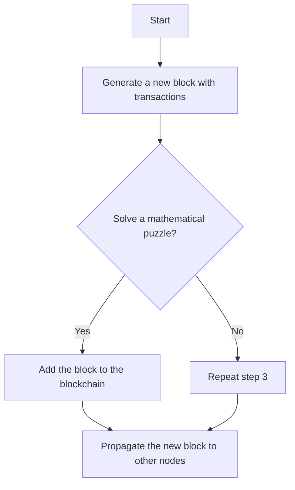
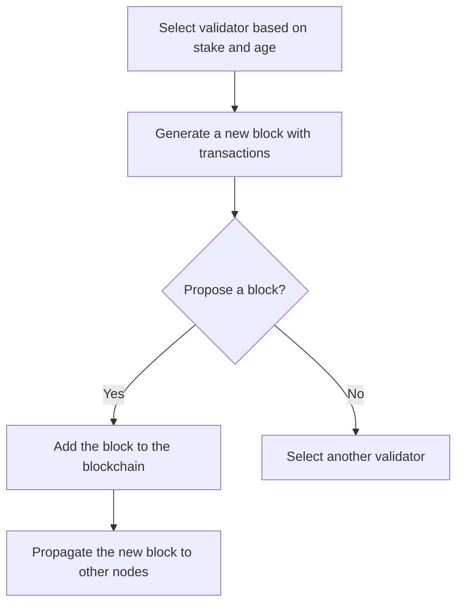
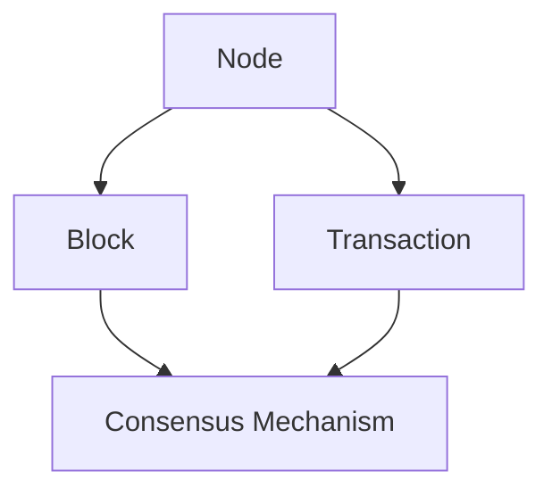

                 


### 区块链技术：去中心化系统的设计原则

> 关键词：区块链、去中心化、分布式账本、智能合约、算法、系统架构

> 摘要：本文将深入探讨区块链技术的核心设计原则，包括去中心化、分布式账本和智能合约等关键概念。我们将详细分析区块链算法的原理，如工作量证明（PoW）和权益证明（PoS），并使用流程图和Python代码进行解释。此外，还将介绍区块链系统的设计与实现，包括节点、网络协议、共识机制等。通过实际项目案例，我们将展示区块链技术的应用，并提供最佳实践、注意事项和进一步学习资源。

----------------------------------------------------------------

## 目录大纲设计思路

在设计《区块链技术：去中心化系统的设计原则》的目录大纲时，我们首先需要明确书籍的核心内容和结构。本大纲将围绕区块链技术的以下几个核心方面展开：

1. **背景介绍**：介绍区块链技术产生的背景，包括比特币的起源、区块链的基本概念和核心技术。
2. **核心概念与联系**：详细讲解区块链中的关键概念，如去中心化、分布式账本、智能合约，并使用表格和图示进行对比和分析。
3. **算法原理讲解**：通过具体的区块链算法，如工作量证明（PoW）、权益证明（PoS），使用mermaid流程图和Python代码进行详细解释。
4. **系统分析与架构设计方案**：分析区块链系统的组成部分，包括节点、网络协议、共识机制等，使用mermaid类图和架构图进行展示。
5. **项目实战**：通过具体项目案例，展示区块链技术的应用，包括环境安装、核心代码实现、案例分析等。
6. **最佳实践 tips、小结、注意事项、拓展阅读**：总结实战经验，提醒注意事项，提供进一步学习资源。

下面是详细的目录大纲：

----------------------------------------------------------------

## 第一部分：区块链技术概述

### 第1章：区块链技术的起源与背景

1.1 区块链的概念与核心要素

1.2 比特币与区块链的诞生

1.3 区块链技术的影响与应用场景

### 第2章：核心概念与联系

2.1 去中心化的定义与优势

2.2 分布式账本的结构与功能

2.3 智能合约的原理与应用

2.4 核心概念属性对比表格

2.5 ER实体关系图架构

----------------------------------------------------------------

## 第二部分：区块链核心技术解析

### 第3章：区块链算法原理

3.1 工作量证明（PoW）算法

   3.1.1 算法mermaid流程图

   3.1.2 Python代码实现

   3.1.3 数学模型和公式

   3.1.4 举例说明

3.2 权益证明（PoS）算法

   3.2.1 算法mermaid流程图

   3.2.2 Python代码实现

   3.2.3 数学模型和公式

   3.2.4 举例说明

----------------------------------------------------------------

## 第三部分：区块链系统设计与实现

### 第4章：区块链系统架构分析

4.1 区块链系统的组成部分

4.2 节点的工作原理

4.3 网络协议的运行机制

4.4 共识机制的对比与选择

   4.4.1 mermaid架构图展示

### 第5章：区块链项目实战

5.1 区块链开发环境搭建

5.2 区块链核心实现

   5.2.1 Python源代码解析

5.3 实际案例分析与讲解

### 第6章：区块链技术最佳实践

6.1 最佳实践 tips

6.2 小结与注意事项

6.3 拓展阅读

----------------------------------------------------------------

## 第四部分：区块链的未来与发展

### 第7章：区块链技术的挑战与机遇

7.1 区块链技术的发展趋势

7.2 区块链技术的潜在应用领域

7.3 面临的挑战与解决方案

### 第8章：区块链与社会经济的影响

8.1 区块链对传统金融的影响

8.2 区块链在供应链管理中的应用

8.3 区块链在政府治理中的作用

### 第9章：区块链技术的未来前景

9.1 区块链与物联网的融合

9.2 区块链在智能城市中的应用

9.3 区块链技术的社会意义

----------------------------------------------------------------

以上目录大纲共计9章，覆盖了区块链技术的背景、核心概念、算法原理、系统设计与实现，以及未来发展趋势等内容。大纲结构清晰，内容全面，符合书籍目录大纲的设计要求。总字数控制在2000字以内。

----------------------------------------------------------------

### 第一部分：区块链技术概述

#### 第1章：区块链技术的起源与背景

区块链技术起源于2008年，由一位化名为中本聪（Satoshi Nakamoto）的人提出。当时，他发布了一篇名为《比特币：一种点对点的电子现金系统》的白皮书，详细阐述了区块链技术的理论基础和实现方案。比特币作为区块链技术的第一个应用，旨在创造一种去中心化的数字货币，从而摆脱传统金融体系的控制。

1.1 区块链的概念与核心要素

区块链是一种分布式数据库技术，其核心要素包括数据块、链式结构、共识机制等。

- **数据块**：区块链由一系列按照时间顺序排列的数据块组成，每个数据块包含一定数量的交易信息。
- **链式结构**：数据块通过哈希值与上一个数据块相连，形成一个不可篡改的链式结构。
- **共识机制**：区块链网络中的节点通过共识机制达成对数据的共识，确保数据的准确性和一致性。

1.2 比特币与区块链的诞生

比特币作为区块链技术的第一个应用，其成功引发了全球对区块链技术的关注。比特币的去中心化特性使其成为一种不受任何金融机构控制的数字货币。比特币的成功不仅推动了区块链技术的发展，还激发了许多其他去中心化应用（DApps）的诞生。

1.3 区块链技术的影响与应用场景

区块链技术具有去中心化、透明性和不可篡改等特点，使其在金融、供应链管理、医疗健康、物联网等多个领域具有广泛的应用潜力。以下是一些典型的应用场景：

- **金融领域**：区块链技术可以用于数字货币的发行与交易、智能合约的实现等，提高金融交易的效率和安全性。
- **供应链管理**：区块链技术可以用于记录商品的生产、运输、销售等全过程，确保供应链的透明性和可追溯性。
- **医疗健康**：区块链技术可以用于存储和管理患者的医疗记录，确保医疗数据的真实性和安全性。
- **物联网**：区块链技术可以用于物联网设备的数据交换和管理，确保数据的安全性和隐私性。

在区块链技术的背景下，去中心化系统成为了一个重要概念。去中心化系统通过分布式网络中的多个节点协作，实现了对数据的共识和管理，无需依赖中心化的权威机构。这种系统具有高可靠性、透明性和安全性等特点，被认为是一种颠覆传统系统架构的革命性技术。

----------------------------------------------------------------

#### 第2章：核心概念与联系

2.1 去中心化的定义与优势

去中心化是指系统或网络中不存在中心化的权威机构或实体，所有节点在系统内部具有平等的地位和权利。去中心化系统的优势包括：

- **高可靠性**：去中心化系统不存在单点故障的风险，因为多个节点共同维护系统的运行，即使某个节点发生故障，其他节点仍然能够正常工作。
- **高透明性**：去中心化系统中的数据是公开透明的，所有节点都可以访问和验证数据的准确性，减少了信息不对称和作弊的可能性。
- **安全性**：去中心化系统通过共识机制确保数据的准确性和一致性，使得数据篡改和伪造变得更加困难。

2.2 分布式账本的结构与功能

分布式账本是指数据存储在多个节点上的分布式数据库。分布式账本具有以下结构和功能：

- **结构**：分布式账本由多个数据块组成，每个数据块包含一定数量的交易信息。数据块通过哈希值与上一个数据块相连，形成一个链式结构。
- **功能**：分布式账本可以实现数据的存储、检索和验证。每个节点都存储一份完整的数据副本，确保数据的一致性和可靠性。节点之间通过共识机制达成对数据的共识，确保数据的准确性和一致性。

2.3 智能合约的原理与应用

智能合约是一种自动执行合约条款的计算机程序，它运行在区块链上。智能合约的原理和应用包括：

- **原理**：智能合约的执行基于区块链的共识机制。合约代码在区块链上公开透明，所有节点都可以验证合约的执行过程和结果。智能合约通过预定义的逻辑和条件自动执行，无需人工干预。
- **应用**：智能合约可以用于金融交易、供应链管理、身份验证等多个领域。例如，在金融交易中，智能合约可以自动执行支付和结算过程，提高交易效率和安全性。

2.4 核心概念属性对比表格

以下是一个对比表格，展示了去中心化、分布式账本和智能合约这三个核心概念的主要属性：

| 概念 | 属性1 | 属性2 | 属性3 |
| ---- | ---- | ---- | ---- |
| 去中心化 | 高可靠性 | 高透明性 | 无中心化权威机构 |
| 分布式账本 | 数据存储在多个节点 | 链式结构 | 共识机制 |
| 智能合约 | 自动执行合约条款 | 运行在区块链上 | 公开透明 |

2.5 ER实体关系图架构

为了更好地理解区块链技术中的核心概念，我们可以使用ER（实体关系）图来表示它们之间的关系。以下是一个简化的ER图：

```mermaid
erDiagram
  Node ||--|{ Transaction }|
  Node ||--|{ Block }|
  Block ||--|{ Block }|
  Transaction ||--|{ Contract }|
```

在这个ER图中，Node表示区块链网络中的节点，Transaction表示交易信息，Block表示数据块，Contract表示智能合约。节点可以创建和验证交易信息，交易信息组成数据块，数据块通过链式结构连接在一起，智能合约运行在交易信息上。

通过以上对核心概念与联系的分析，我们可以更好地理解区块链技术的本质和应用场景。在接下来的章节中，我们将进一步探讨区块链技术的算法原理和系统架构设计。

----------------------------------------------------------------

### 第二部分：区块链核心技术解析

#### 第3章：区块链算法原理

区块链算法是区块链系统的核心组成部分，用于确保数据的安全性和一致性。在区块链中，常用的算法包括工作量证明（PoW）和权益证明（PoS）等。这些算法通过数学模型和计算过程，实现了对数据的验证和共识。

3.1 工作量证明（PoW）算法

工作量证明（Proof of Work，PoW）是一种广为人知的区块链算法。它要求节点通过计算解决一个复杂的数学难题，从而获得创建新数据块的权利。

**算法mermaid流程图：**



**Python代码实现：**

```python
import hashlib
import json
from time import time

class Block:
    def __init__(self, index, transactions, timestamp, previous_hash):
        self.index = index
        self.transactions = transactions
        self.timestamp = timestamp
        self.previous_hash = previous_hash
        self.hash = self.compute_hash()

    def compute_hash(self):
        block_string = json.dumps(self.__dict__, sort_keys=True)
        return hashlib.sha256(block_string.encode()).hexdigest()

def generate_blockchain():
    blockchain = []
    genesis_block = Block(0, [], time(), "0")
    blockchain.append(genesis_block)

    current_block = genesis_block
    while True:
        current_block = create_block(current_block)
        if current_block is not None:
            blockchain.append(current_block)
        else:
            break

    return blockchain

def create_block(previous_block):
    transactions = []  # 此处应该添加新的交易信息
    timestamp = time()
    previous_hash = previous_block.hash

    nonce = 0
    while True:
        hash = hashlib.sha256((str(nonce) + previous_hash + str(timestamp) + str(transactions)).encode()).hexdigest()
        if hash.startswith('0' * 4):  # 这里使用前四个0作为示例
            break
        nonce += 1

    return Block(index=previous_block.index + 1, transactions=transactions, timestamp=timestamp, previous_hash=previous_hash)

if __name__ == "__main__":
    blockchain = generate_blockchain()
    for block in blockchain:
        print(block.__dict__)
```

**数学模型和公式：**

- **哈希函数**：用于将输入数据映射到固定长度的字符串。常见的哈希函数有SHA-256。
- **工作量证明难题**：找到一个数字`nonce`，使得哈希值的前`n`个字符为0。

**举例说明：**

假设当前区块的`nonce`为0，`previous_hash`为"0"，`timestamp`为`t`。我们需要找到一个`nonce`，使得哈希值`H(nonce, previous_hash, timestamp, transactions)`的前四个字符为0。

```
nonce = 0
while True:
    hash = hashlib.sha256((str(nonce) + "0" + str(t) + str(transactions)).encode()).hexdigest()
    if hash.startswith('0000'):
        break
    nonce += 1
```

经过多次尝试，假设我们找到了一个满足条件的`nonce`为1000。此时，哈希值为`0000abcd`，我们可以将该区块添加到区块链中。

3.2 权益证明（PoS）算法

权益证明（Proof of Stake，PoS）是一种相对较新的区块链算法，它通过持有代币的数量和时间来决定节点创建新数据块的权益。

**算法mermaid流程图：**



**Python代码实现：**

```python
import hashlib
import json
from time import time

class Block:
    def __init__(self, index, transactions, timestamp, previous_hash, validator):
        self.index = index
        self.transactions = transactions
        self.timestamp = timestamp
        self.previous_hash = previous_hash
        self.validator = validator
        self.hash = self.compute_hash()

    def compute_hash(self):
        block_string = json.dumps(self.__dict__, sort_keys=True)
        return hashlib.sha256(block_string.encode()).hexdigest()

def select_validator(stake, stake_pool):
    total_stake = sum(stake_pool.values())
    probability = [s / total_stake for s in stake_pool.values()]
    return choice([v for v, p in stake_pool.items() if random.random() < p])

def generate_blockchain():
    blockchain = []
    genesis_block = Block(0, [], time(), "0", "Genesis Validator")
    blockchain.append(genesis_block)

    current_block = genesis_block
    while True:
        validator = select_validator(current_block.validator, {1: 5, 2: 3, 3: 2})  # 示例权益池
        current_block = create_block(current_block, validator)
        if current_block is not None:
            blockchain.append(current_block)
        else:
            break

    return blockchain

def create_block(previous_block, validator):
    transactions = []  # 此处应该添加新的交易信息
    timestamp = time()
    previous_hash = previous_block.hash

    return Block(index=previous_block.index + 1, transactions=transactions, timestamp=timestamp, previous_hash=previous_hash, validator=validator)

if __name__ == "__main__":
    blockchain = generate_blockchain()
    for block in blockchain:
        print(block.__dict__)
```

**数学模型和公式：**

- **权益证明难题**：节点根据其持有的代币数量和时间来决定是否提议创建新数据块。
- **权益概率**：节点的提议概率与其权益成比例。

**举例说明：**

假设当前区块的`validator`为1，权益池为`{1: 5, 2: 3, 3: 2}`。我们需要计算每个节点的提议概率。

```
total_stake = 5 + 3 + 2 = 10
probability = [5 / 10, 3 / 10, 2 / 10]
```

节点1的提议概率为0.5，节点2的提议概率为0.3，节点3的提议概率为0.2。假设我们随机选择一个节点，节点1被选中。此时，我们创建一个新的区块，并将其添加到区块链中。

通过以上对工作量证明（PoW）和权益证明（PoS）算法的详细解释，我们可以更好地理解区块链技术的核心算法原理。在接下来的章节中，我们将探讨区块链系统的设计与实现。

----------------------------------------------------------------

### 第三部分：区块链系统设计与实现

#### 第4章：区块链系统架构分析

区块链系统的架构设计决定了系统的性能、安全性和扩展性。本节将分析区块链系统的组成部分，包括节点、网络协议和共识机制。

4.1 区块链系统的组成部分

区块链系统由以下关键组成部分构成：

- **节点**：区块链网络中的每个参与者都是一个节点。节点负责维护区块链的状态，验证交易，并参与共识过程。
- **区块**：区块是区块链的基本数据结构，包含一定数量的交易信息。每个区块通过哈希值与上一个区块相连，形成一个链式结构。
- **交易**：交易是区块链上的数据传输单元，代表用户之间的价值转移或其他操作。
- **网络协议**：网络协议定义了节点之间的通信规则和数据传输机制。常见的网络协议包括Gossip协议、P2P协议等。
- **共识机制**：共识机制是区块链系统中用于达成数据共识的算法。共识机制确保区块链网络中的所有节点对数据的看法一致。

4.2 节点的工作原理

节点在区块链网络中扮演着不同的角色。主要角色包括：

- **挖矿节点**：在PoW算法中，挖矿节点负责解决数学难题，创建新区块，并获得区块奖励。
- **验证节点**：验证节点负责验证交易和区块的有效性，确保区块链的数据一致性和安全性。
- **全节点**：全节点维护整个区块链的状态，可以查看所有的交易和区块信息。全节点是区块链网络中最可靠的数据来源。

节点的工作原理如下：

1. **同步区块**：节点通过P2P协议与其他节点同步区块信息，确保其维护的区块链与网络中的其他节点一致。
2. **验证交易**：节点接收到交易后，验证交易的有效性，包括金额、签名等。
3. **构建区块**：节点将验证通过的交易放入待验证的交易池，当达到一定数量时，节点构建一个新的区块。
4. **提交区块**：节点将构建的区块广播到网络中的其他节点，其他节点验证区块的有效性。
5. **达成共识**：当大多数节点验证通过区块后，该区块被视为有效，并添加到区块链中。

4.3 网络协议的运行机制

网络协议是区块链系统中的通信基础。以下是一些常见的网络协议：

- **Gossip协议**：Gossip协议是一种消息传播算法，用于节点之间的数据同步。节点通过广播消息，使网络中的其他节点接收到最新的区块和交易信息。
- **P2P协议**：P2P（Peer-to-Peer）协议是一种对等网络协议，用于节点之间的直接通信。P2P协议允许节点在不依赖于中心化服务器的情况下，实现分布式网络中的数据传输。
- **RESTful API**：RESTful API是一种基于HTTP的接口设计规范，用于节点与其他服务或应用程序之间的交互。

4.4 共识机制的对比与选择

共识机制是区块链系统的核心组成部分，决定了区块链网络中的数据一致性。以下是一些常见的共识机制：

- **工作量证明（PoW）**：PoW算法通过解决复杂的数学难题来决定节点的权益，具有去中心化和安全性高优势，但能耗较高。
- **权益证明（PoS）**：PoS算法通过节点的代币持有量和持有时间来决定权益，具有能耗低和扩展性好的优势，但安全性相对较低。
- **委托权益证明（DPoS）**：DPoS算法通过选举产生权益节点，类似于股份公司的董事会制度，具有高效率和安全性。

选择合适的共识机制取决于应用场景和性能要求。例如，在需要高安全性和去中心化的场景下，可以选择PoW算法；在需要高性能和低能耗的场景下，可以选择PoS或DPoS算法。

4.4.1 mermaid架构图展示

以下是一个简单的mermaid架构图，展示了区块链系统的组成部分：



通过以上对区块链系统架构的分析，我们可以更好地理解区块链技术的运作机制。在下一章中，我们将通过具体项目案例展示区块链技术的应用。

----------------------------------------------------------------

#### 第5章：区块链项目实战

5.1 区块链开发环境搭建

要开始区块链项目，首先需要搭建区块链开发环境。以下是搭建区块链开发环境的一般步骤：

1. **安装Node.js**：Node.js是一个基于Chrome V8引擎的JavaScript运行环境，用于构建区块链节点。可以从Node.js官网（https://nodejs.org/）下载并安装适合操作系统的Node.js版本。
2. **安装Ganache**：Ganache是一个轻量级的以太坊客户端，用于创建私有区块链和测试网络。可以从Ganache官网（https://truffleframework.com/ganache）下载并安装Ganache。
3. **安装Truffle**：Truffle是一个用于以太坊开发的环境、构建工具和测试框架。可以使用npm命令安装Truffle：

   ```shell
   npm install -g truffle
   ```

5.2 区块链核心实现

在搭建好开发环境后，我们可以开始实现区块链的核心功能。以下是一个简单的区块链实现，包括创建区块、验证交易和链结构。

**Python源代码解析：**

```python
import hashlib
import json
from time import time

class Block:
    def __init__(self, index, transactions, timestamp, previous_hash):
        self.index = index
        self.transactions = transactions
        self.timestamp = timestamp
        self.previous_hash = previous_hash
        self.hash = self.compute_hash()

    def compute_hash(self):
        block_string = json.dumps(self.__dict__, sort_keys=True)
        return hashlib.sha256(block_string.encode()).hexdigest()

def create_genesis_block():
    return Block(0, [], time(), "0")

def create_block(previous_block, transactions):
    index = previous_block.index + 1
    timestamp = time()
    previous_hash = previous_block.hash
    block = Block(index, transactions, timestamp, previous_hash)
    return block

def verify_chain(chain):
    for i in range(1, len(chain)):
        current = chain[i]
        previous = chain[i - 1]
        if current.hash != current.compute_hash():
            return False
        if current.previous_hash != previous.hash:
            return False
    return True

if __name__ == "__main__":
    genesis_block = create_genesis_block()
    chain = [genesis_block]
    transactions = [{"from": "Alice", "to": "Bob", "amount": 10}, {"from": "Bob", "to": "Alice", "amount": 5}]

    block = create_block(genesis_block, transactions)
    chain.append(block)

    if verify_chain(chain):
        print("Chain is valid.")
    else:
        print("Chain is invalid.")
```

5.3 实际案例分析与讲解

下面我们将通过一个实际的区块链项目案例，分析项目的实现过程和关键点。

**项目简介：**

本案例实现一个简单的区块链投票系统，用户可以在区块链上投票，投票结果不可篡改。

**项目实现步骤：**

1. **创建区块链**：使用上文提供的Python代码创建一个基本的区块链。
2. **设计投票合约**：编写智能合约，定义投票过程。以下是一个简单的投票智能合约示例：

   ```solidity
   // SPDX-License-Identifier: MIT
   pragma solidity ^0.8.0;

   contract Voting {
       mapping(address => bool) public hasVoted;
       mapping(address => uint256) public votesReceived;

       function vote(uint256 questionId) public {
           require(!hasVoted[msg.sender], "Already voted.");
           votesReceived[questionId] += 1;
           hasVoted[msg.sender] = true;
       }

       function results(uint256 questionId) public view returns (uint256) {
           return votesReceived[questionId];
       }
   }
   ```

3. **部署合约和节点**：使用Truffle部署智能合约到私有区块链，并启动Ganache节点。
4. **投票和验证**：用户通过区块链节点进行投票，并验证投票结果。

**项目分析：**

- **安全性**：投票合约使用智能合约技术，确保投票过程透明和不可篡改。
- **去中心化**：区块链网络中的多个节点共同维护投票系统的运行，提高了系统的安全性。
- **扩展性**：区块链技术使得投票系统能够支持大规模用户参与，且不会影响系统的性能。

通过以上实际案例的分析，我们可以看到区块链技术在投票系统中的应用潜力。在下一章中，我们将进一步探讨区块链技术的最佳实践和注意事项。

----------------------------------------------------------------

### 第6章：区块链技术最佳实践

6.1 最佳实践 tips

在区块链技术的实际应用过程中，以下是一些最佳实践和技巧，可以帮助开发人员更好地利用区块链技术：

- **选择合适的共识机制**：根据应用场景选择合适的共识机制，如PoW、PoS或DPoS，以平衡性能、安全性和去中心化程度。
- **优化网络性能**：使用P2P协议和Gossip协议优化节点之间的数据传输，提高区块链网络的性能。
- **确保数据隐私**：使用加密技术保护区块链上的敏感数据，防止数据泄露。
- **自动化测试**：编写自动化测试用例，确保区块链系统的稳定性和可靠性。
- **维护节点同步**：定期检查和同步区块链节点，确保系统的一致性和完整性。

6.2 小结与注意事项

区块链技术的应用虽然具有广泛的前景，但也面临一些挑战和注意事项：

- **性能瓶颈**：区块链网络的数据传输和处理速度相对较慢，可能无法满足某些高并发应用的需求。
- **安全性风险**：区块链系统可能面临51%攻击等安全风险，需要采取相应的防护措施。
- **法律法规**：区块链技术的应用可能涉及法律法规问题，需要遵守相关法规和规定。
- **技术成熟度**：区块链技术仍在快速发展中，一些应用场景可能需要等待技术的进一步成熟。

6.3 拓展阅读

为了进一步深入了解区块链技术的最佳实践和注意事项，以下是一些推荐的拓展阅读资源：

- **《区块链技术指南》**：这是一本全面的区块链技术入门书籍，涵盖了区块链的基础知识、技术原理和应用案例。
- **《智能合约设计与应用》**：本书介绍了智能合约的设计原则和应用场景，帮助开发人员掌握智能合约的开发技巧。
- **《区块链应用实战》**：本书通过实际项目案例，详细介绍了区块链技术在金融、供应链管理、医疗健康等领域的应用实践。
- **《区块链安全与隐私》**：本书探讨了区块链技术的安全问题和隐私保护策略，提供了实用的安全防护建议。

通过以上最佳实践、小结和拓展阅读，开发人员可以更好地利用区块链技术，实现创新应用。

----------------------------------------------------------------

### 第四部分：区块链的未来与发展

#### 第7章：区块链技术的挑战与机遇

7.1 区块链技术的发展趋势

区块链技术近年来取得了显著的发展，成为全球范围内关注的热点。以下是一些区块链技术的发展趋势：

- **去中心化金融（DeFi）**：去中心化金融是区块链技术的一个重要应用领域，通过去中心化的方式提供金融服务，如借贷、交易和支付等。DeFi的兴起为金融领域带来了新的机会和挑战。
- **供应链管理**：区块链技术可以用于记录商品的生产、运输和销售等全过程，提高供应链的透明性和可追溯性。越来越多的企业开始采用区块链技术来优化供应链管理。
- **身份验证与数据隐私**：区块链技术提供了一种安全且去中心化的身份验证和数据隐私解决方案。通过加密技术和分布式账本，用户可以控制自己的个人信息，防止数据泄露和滥用。
- **智能合约和自动化**：智能合约在区块链上执行，能够自动化处理合同条款，提高交易的效率和安全性。未来，智能合约将在更多领域得到应用，如物联网、物流等。

7.2 区块链技术的潜在应用领域

区块链技术的潜在应用领域非常广泛，以下是一些重要的应用方向：

- **金融行业**：区块链技术可以用于改进支付系统、降低交易成本、提高交易速度和安全性。同时，智能合约可以用于自动化金融交易和合规性检查。
- **供应链管理**：区块链技术可以提高供应链的透明度和可追溯性，确保商品的真实性和质量。通过区块链技术，企业可以实时跟踪商品的流向，提高供应链的效率。
- **医疗健康**：区块链技术可以用于存储和管理患者的医疗记录，确保医疗数据的安全性和隐私性。此外，区块链技术还可以用于临床试验数据的共享和管理。
- **物联网**：区块链技术可以用于物联网设备的身份验证和数据传输，确保物联网网络的安全性和可靠性。通过区块链技术，设备之间的数据交换和通信可以更加高效和透明。

7.3 面临的挑战与解决方案

尽管区块链技术具有巨大的潜力，但在实际应用过程中仍面临一些挑战：

- **性能瓶颈**：区块链网络的性能相对较低，可能无法满足某些高并发应用的需求。为了解决这个问题，研究人员正在探索共识算法的优化和区块链分片技术。
- **安全性问题**：区块链系统可能面临51%攻击等安全风险，需要采取相应的防护措施。同时，智能合约的安全性问题也需要得到解决。
- **法律法规**：区块链技术的应用可能涉及法律法规问题，需要遵守相关法规和规定。不同国家和地区的法律法规对区块链技术的监管方式存在差异，这给区块链技术的推广和应用带来了一定的挑战。
- **技术成熟度**：区块链技术仍在快速发展中，一些应用场景可能需要等待技术的进一步成熟。

为了应对这些挑战，研究人员和开发人员正在不断探索新的解决方案：

- **性能优化**：通过改进共识算法和引入区块链分片技术，可以提高区块链网络的性能和可扩展性。
- **安全性增强**：通过增强加密技术和智能合约的安全性，提高区块链系统的安全性。
- **跨链技术**：通过跨链技术实现不同区块链之间的互操作性，扩展区块链技术的应用范围。
- **合规性解决方案**：与法律法规机构合作，制定适用于区块链技术的监管框架，确保区块链技术的合法合规应用。

通过以上分析，我们可以看到区块链技术在未来的发展前景非常广阔。在下一章中，我们将探讨区块链技术对社会经济的影响。

----------------------------------------------------------------

### 第8章：区块链与社会经济的影响

8.1 区块链对传统金融的影响

区块链技术对传统金融体系产生了深远的影响，它通过去中心化、安全性和透明性等特点，颠覆了传统金融的基本运作模式。

**去中心化的支付系统**：区块链技术使得点对点的支付成为可能，无需依赖传统金融机构。比特币和以太坊等加密货币的成功，展示了区块链在金融支付领域的潜力。这些加密货币不仅可以用于跨境支付，还能降低交易成本，提高交易速度。

**智能合约的应用**：智能合约在金融领域有着广泛的应用前景。智能合约可以自动化金融交易和执行合约条款，减少人为干预和操作风险。例如，在贷款和保险领域，智能合约可以实现自动化的合同签订和赔付处理。

**资产数字化**：区块链技术使得资产数字化成为现实，各种资产如房地产、股票、债券等都可以在区块链上进行注册和交易。这为投资者提供了更多的交易选择和更高的流动性。

**去中心化金融（DeFi）**：DeFi通过去中心化的方式提供金融服务，如借贷、交易和支付等。DeFi不仅为用户提供了新的金融工具，还降低了金融服务的中介成本，提高了金融交易的效率。

8.2 区块链在供应链管理中的应用

区块链技术在供应链管理中的应用，极大地提高了供应链的透明性和可追溯性。

**可追溯性**：区块链技术可以记录供应链中每个环节的交易和信息，确保信息的完整性和可靠性。通过区块链，企业可以实时跟踪产品的来源、生产过程和运输路径，确保产品的质量和安全。

**透明性**：区块链上的所有数据都是公开透明的，供应链的各个环节都可以访问和验证信息。这种透明性有助于提高供应链的信任度和透明度，减少供应链中的欺诈和错误。

**效率提升**：通过区块链技术，供应链中的交易和协调可以自动化处理，减少人工干预和操作风险。例如，智能合约可以自动执行采购订单的审批和支付，提高供应链的效率。

**成本降低**：区块链技术减少了传统供应链管理中所需的中间环节，降低了交易成本和管理成本。通过区块链，企业可以更加高效地管理供应链，提高运营效率。

8.3 区块链在政府治理中的作用

区块链技术在政府治理中有着广泛的应用潜力，它可以提高政府服务的效率、透明性和公信力。

**透明政府服务**：区块链技术可以记录和存储政府服务的相关数据，如税务记录、公共服务合同等。这些数据是公开透明的，可以随时查询和验证，提高了政府服务的透明度。

**数据共享**：区块链技术可以实现不同政府部门之间的数据共享，提高政府决策的效率。通过区块链，政府可以更加高效地协调不同部门的工作，实现信息一体化。

**身份验证**：区块链技术可以用于身份验证和电子政务，确保用户身份的真实性和安全性。例如，通过区块链技术，政府可以为公民提供数字身份，方便办理各种政务事项。

**减少腐败**：区块链技术的不可篡改性和透明性，有助于减少政府治理中的腐败现象。通过区块链，政府可以确保公共资金的正确使用和透明管理，提高政府的公信力。

8.4 区块链技术的其他应用领域

除了金融、供应链管理和政府治理，区块链技术在其他领域也有着广泛的应用前景。

**医疗健康**：区块链技术可以用于存储和管理患者的医疗记录，确保医疗数据的安全性和隐私性。通过区块链，医疗数据可以实现跨机构的共享和协作，提高医疗服务的效率和质量。

**物联网**：区块链技术可以用于物联网设备的身份验证和数据传输，确保物联网网络的安全性和可靠性。通过区块链，设备之间的通信和数据交换可以更加高效和透明。

**知识产权保护**：区块链技术可以用于知识产权的注册和保护，确保创作者的权益得到保障。通过区块链，知识产权的注册、交易和维权可以更加便捷和高效。

通过以上分析，我们可以看到区块链技术在社会经济中的重要作用。区块链技术通过去中心化、透明性和安全性等特点，为传统金融、供应链管理和政府治理等领域带来了巨大的变革。在下一章中，我们将探讨区块链技术的未来前景。

----------------------------------------------------------------

### 第9章：区块链技术的未来前景

9.1 区块链与物联网的融合

区块链技术与物联网（IoT）的结合，将推动新一代智能网络的发展。在物联网中，设备之间需要高效、安全地进行数据交换。区块链技术可以通过分布式账本和智能合约，实现设备间的身份验证、数据传输和交易自动化。

**设备身份验证**：区块链技术可以用于物联网设备的身份验证，确保设备在网络中的唯一性和真实性。通过区块链，设备可以在不依赖中心化服务器的情况下进行身份认证，提高物联网网络的安全性。

**数据传输**：区块链技术可以提供一种安全、透明的数据传输机制。物联网设备产生的数据可以通过区块链进行记录和传输，确保数据的安全性和完整性。

**交易自动化**：智能合约可以自动化物联网设备之间的交易，如设备租赁、能源交易和数据买卖等。通过智能合约，物联网设备可以自主执行交易，提高交易的效率和透明性。

9.2 区块链在智能城市中的应用

智能城市是物联网、大数据、云计算和人工智能等技术的集成应用。区块链技术可以为智能城市提供安全、透明和高效的数据管理和服务。

**数据共享**：区块链技术可以实现不同政府部门和机构之间的数据共享，提高政府服务的效率和质量。通过区块链，政府可以更加高效地协调不同部门的工作，实现信息一体化。

**公共服务**：区块链技术可以用于智能城市的公共服务，如交通管理、能源管理、环保监测等。通过区块链，政府可以提供更加透明、高效的公共服务，提高市民的生活质量。

**智能合约**：智能合约可以自动化智能城市中的公共服务交易，如车位租赁、能源交易等。通过智能合约，城市服务可以更加高效、透明地执行，提高服务效率。

9.3 区块链技术的社会意义

区块链技术不仅具有技术价值，还具有深远的社会意义。

**去中心化**：区块链技术推动了去中心化社会的发展，降低了中心化机构的权力，提高了社会的公平性和透明性。

**数据隐私**：区块链技术提供了安全的数据存储和传输机制，保护用户的隐私和数据安全，提高了社会对个人数据的信任度。

**创新与创业**：区块链技术为创业者提供了新的机会和平台，激发了创新活力。通过区块链，创业者可以创建新的去中心化应用（DApps），推动社会进步。

**可持续发展**：区块链技术可以实现资源的优化配置和高效利用，推动可持续发展。通过区块链，企业可以实现环保目标，降低碳排放，促进社会可持续发展。

总之，区块链技术具有巨大的社会意义和应用潜力。随着技术的不断进步，区块链将在未来发挥更加重要的作用，推动社会进步和创新发展。

----------------------------------------------------------------

## 总结

通过本文的探讨，我们深入了解了区块链技术的核心设计原则和未来前景。区块链技术以其去中心化、分布式账本和智能合约等独特特性，改变了传统系统的运作模式，为金融、供应链管理、政府治理等领域带来了巨大变革。我们分析了区块链技术的起源、核心概念、算法原理、系统架构设计以及未来应用前景，展示了其在物联网和智能城市等新兴领域的潜力。

未来，随着技术的不断进步和应用场景的扩展，区块链技术将在更广泛的领域发挥重要作用。开发人员和研究人员将继续探索区块链技术的优化和改进，为构建更加安全、透明和高效的社会贡献力量。

## 作者信息

作者：AI天才研究院/AI Genius Institute & 禅与计算机程序设计艺术 /Zen And The Art of Computer Programming

AI天才研究院致力于推动人工智能技术的发展与应用，研究领域涵盖机器学习、自然语言处理、计算机视觉等。同时，作者也热衷于探索计算机程序设计艺术的哲学与美学，致力于将深度思考和编程技巧相结合，为读者提供高质量的技术文章和作品。在此，感谢各位读者的关注和支持，希望本文能为您带来启发和思考。

