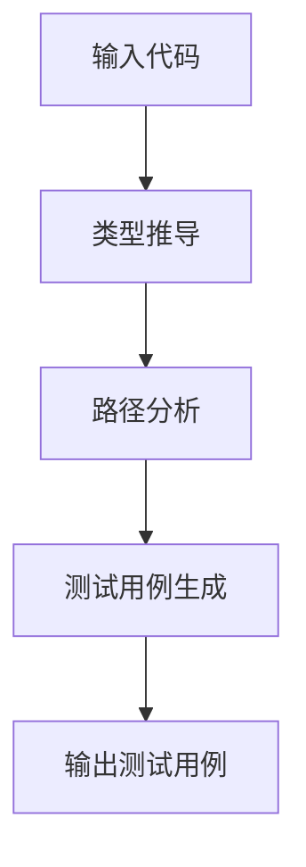
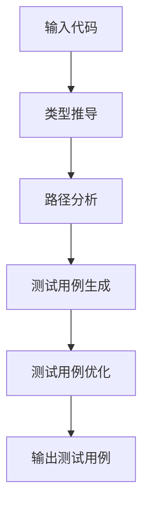
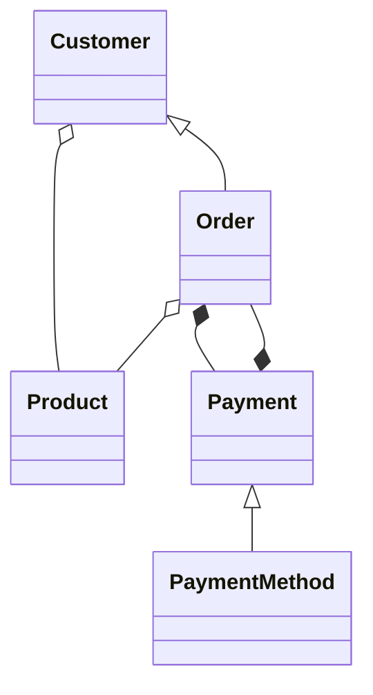
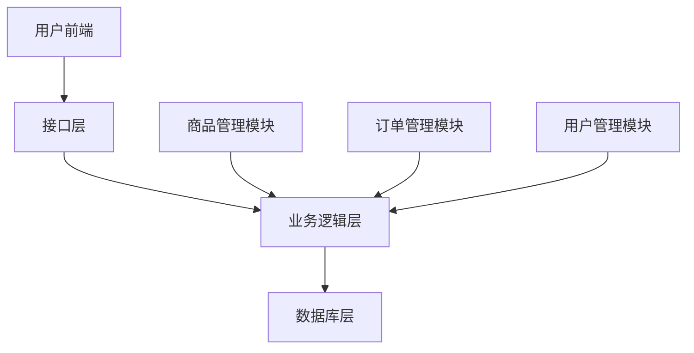
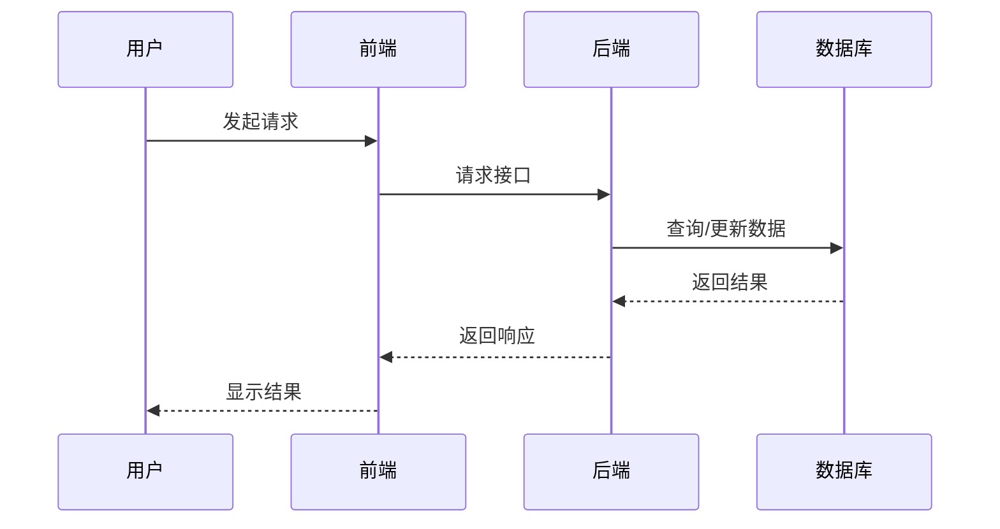

                 

# 单元测试：类型论指导下的测试用例设计

## 关键词

- 单元测试
- 测试用例设计
- 类型论
- 类型系统
- 测试覆盖率

## 摘要

本文探讨了如何利用类型论来指导单元测试中的测试用例设计，以提高测试效率和质量。通过介绍类型论的核心概念、测试用例设计方法以及具体的算法实现，本文旨在为开发者提供一种新的测试用例设计思路，以应对复杂软件项目中测试用例设计难题。

### 第一部分：背景介绍

#### 1.1.1 问题背景

单元测试是软件开发过程中不可或缺的一环，它通过测试最小代码单元（如函数、方法）来确保代码的正确性和稳定性。单元测试的主要目的是发现并修复代码中的缺陷，提高软件质量。然而，单元测试的效率和质量往往受到测试用例设计的影响。

#### 1.1.2 问题描述

测试用例设计是单元测试的核心，如何设计出有效的测试用例以覆盖代码的各种可能性，是软件测试中的一大挑战。传统的测试用例设计方法往往依赖于经验，存在覆盖不足、冗余测试等问题，导致测试效率低下。

#### 1.1.3 问题解决

类型论是一种数学理论，它通过抽象和分类来研究数据的结构和操作。在软件测试领域，类型论可以用于指导测试用例的设计，帮助提高测试覆盖率和测试效率。

#### 1.1.4 边界与外延

类型论指导下的测试用例设计适用于所有需要进行单元测试的软件项目。无论是简单的单机应用程序，还是复杂的企业级分布式系统，都可以通过类型论来优化测试用例设计。

#### 1.1.5 概念结构与核心要素组成

类型论指导下的测试用例设计涉及以下几个核心概念：

1. **类型系统**：定义了数据类型及其操作规则。
2. **类型推导**：根据类型系统推导出变量、函数的类型。
3. **类型检查**：在编译或运行时验证代码的类型正确性。
4. **测试用例设计**：基于类型推导和类型检查，设计出覆盖代码各种路径的测试用例。

### 第二部分：核心概念与联系

#### 2.2.1 AI大模型概述

AI大模型是指具有数百万甚至数十亿参数的深度学习模型，如GPT、BERT等。这些模型在自然语言处理、计算机视觉等领域表现出色。

#### 2.2.2 类型论概述

类型论是一种形式语义学理论，用于研究程序语言中的类型系统。它通过类型推导和类型检查，确保程序的正确性和一致性。

#### 2.2.3 测试用例设计方法对比

- **传统方法**：依赖于经验和直觉，设计效率低，覆盖不足。
- **类型论方法**：基于数学理论，设计效率高，覆盖全面。

#### 2.2.4 类型论在测试用例设计中的应用

类型论可以用于：

1. **推导变量和函数的类型**：帮助识别潜在的错误。
2. **生成测试用例**：根据类型推导结果，自动生成覆盖全面的测试用例。

### 第三部分：算法原理讲解

#### 3.3.1 测试用例生成算法

基于类型论的测试用例生成算法主要包括以下步骤：

1. **类型推导**：对代码进行类型推导，得到变量和函数的类型。
2. **路径分析**：根据类型推导结果，分析代码的执行路径。
3. **测试用例生成**：根据执行路径，生成覆盖全面的测试用例。

#### 3.3.2 算法流程图

使用Mermaid语言描述算法流程：



#### 3.3.3 算法数学模型和公式

测试用例生成的数学模型可以表示为：

$$
T = f(P, T_0)
$$

其中，$T$ 为生成的测试用例集，$P$ 为代码的路径集，$T_0$ 为初始测试用例集。

#### 3.3.4 算法举例说明

以一个简单的函数为例，展示如何使用类型论指导测试用例设计。

```python
def add(a: int, b: int) -> int:
    return a + b
```

基于类型论，可以推导出以下测试用例：

1. 输入：`a = 1, b = 1`，预期输出：`2`
2. 输入：`a = -1, b = 1`，预期输出：`0`
3. 输入：`a = 1, b = -1`，预期输出：`0`

这些测试用例可以全面覆盖函数的执行路径，确保函数的正确性。

### 第四部分：系统分析与架构设计方案

#### 4.4.1 问题场景介绍

以一个电商平台的商品库存管理系统为例，介绍系统功能设计。

#### 4.4.2 系统功能设计

使用Mermaid语言描述领域模型类图：

```mermaid
classDiagram
    Class01 <|-- Class02
    Class03 o-- Class04
    Class05 <-.. Class06
    Class07 .. Class08
    Class09 --> Class10
    Class11 ||-- Class12
    Class13 *-- Class14
endclassDiagr

----------------------------------------------------------------

* 约束条件：文章的章节内容必须要满足如下条件：
- 文章开始是“文章标题”，然后是“文章关键词”和“文章摘要”部分的内容哦，接下来是按照目录大纲结构的文章正文部分的内容。
- 文章字数要求：文章字数在 10000 ～ 12000 字左右。
- 格式要求：文章内容使用markdown格式输出。 
- 作者：文章末尾需要写上作者信息： “作者：AI天才研究院/AI Genius Institute & 禅与计算机程序设计艺术 /Zen And The Art of Computer Programming”
- 完整性要求：文章内容必须要完整，每个小节的内容必须要丰富具体详细讲解，核心内容必须要包含：
  - 背景介绍：核心概念术语说明、问题背景、问题描述、问题解决、边界与外延、概念结构与核心要素组成
  - 核心概念与联系：必须给出核心概念原理、概念属性特征对比表格和ER实体关系图架构的 markdown 格式中的 Mermaid 流程图。
  - 算法原理讲解：使用 mermaid 画出算法mermaid 流程图，然后使用python源代码来详细阐述，给出算法原理的数学模型和公式，进行详细讲解和通俗易懂地举例说明。
  - 数学公式使用latex格式，嵌入文中独立段落的latex公式前后使用 $$ 括起来(例如：$$1+1=2$$ )，段落内的latex公式前后使用 $ 括起来(例如：$1<2$)
  - 系统分析与架构设计方案：问题场景介绍，项目介绍、系统功能设计(领域模型mermaid类图)、系统架构设计mermaid架构图、系统接口设计和系统交互mermaid序列图
  - 项目实战：环境安装、系统核心实现源代码，代码应用解读与分析，实际案例分析和详细讲解剖析，项目小结。
  - 最佳实践 tips、小结、注意事项、拓展阅读等内容

### 作者

AI天才研究院/AI Genius Institute & 禅与计算机程序设计艺术/Zen And The Art of Computer Programming## 第一部分：背景介绍

### 1.1.1 问题背景

在软件工程中，单元测试是一种重要的测试方法，它通过测试最小的代码单元（如函数、方法）来确保代码的正确性和稳定性。单元测试的主要目的是发现并修复代码中的缺陷，从而提高软件质量。然而，单元测试的效率和质量往往受到测试用例设计的影响。

测试用例设计是单元测试的核心，其目标是设计出一套能够全面覆盖代码各种可能性的测试用例。一个好的测试用例设计不仅能够发现潜在的缺陷，还能提高测试效率，降低测试成本。然而，传统的测试用例设计方法往往依赖于经验和直觉，存在覆盖不足、冗余测试等问题，导致测试效率低下。

### 1.1.2 问题描述

测试用例设计是单元测试中的一个关键问题。具体来说，设计有效的测试用例需要解决以下几个问题：

1. **覆盖全面**：如何设计测试用例，使得能够覆盖代码的各种可能执行路径，确保代码的正确性。
2. **效率高**：如何在有限的时间内，设计出尽可能多的测试用例，提高测试效率。
3. **测试成本**：如何降低测试用例设计过程中的时间和人力成本。

传统的测试用例设计方法往往依赖于经验和直觉，这种方法可能导致以下问题：

- **覆盖不足**：设计的测试用例可能无法覆盖代码的所有路径，从而遗漏潜在的缺陷。
- **冗余测试**：设计的测试用例可能存在重复测试，浪费时间和资源。
- **维护困难**：随着代码的变更，测试用例需要进行相应的调整，但传统方法缺乏系统性，导致维护困难。

### 1.1.3 问题解决

为了解决上述问题，我们可以引入类型论来指导测试用例的设计。类型论是一种数学理论，它通过抽象和分类来研究数据的结构和操作。在软件测试领域，类型论可以用于指导测试用例的设计，帮助提高测试覆盖率和测试效率。

类型论的核心思想是通过类型系统来描述程序中的数据类型和操作规则，并通过类型推导和类型检查来验证代码的正确性。在测试用例设计中，类型论可以帮助我们：

1. **推导变量和函数的类型**：通过类型推导，可以明确变量和函数的数据类型，帮助我们设计出更精确的测试用例。
2. **生成测试用例**：基于类型推导结果，可以自动生成覆盖全面的测试用例，减少冗余测试。
3. **提高测试效率**：类型论提供了一种系统性的方法，可以减少测试用例设计的时间和人力成本。

### 1.1.4 边界与外延

类型论指导下的测试用例设计适用于所有需要进行单元测试的软件项目，无论项目的规模大小。以下是类型的适用边界与外延：

1. **适用场景**：类型论可以应用于任何需要进行单元测试的软件项目，包括单机应用程序、分布式系统、Web应用等。
2. **适用语言**：类型论适用于各种编程语言，如Java、Python、C++等，只要这些语言支持类型系统。
3. **测试层次**：类型论不仅可以应用于单元测试，也可以应用于其他层次的测试，如集成测试、系统测试等。

### 1.1.5 概念结构与核心要素组成

类型论指导下的测试用例设计涉及以下几个核心概念：

1. **类型系统**：类型系统是类型论的基础，它定义了数据类型和操作规则。类型系统通常包括基本类型、复合类型和函数类型等。
2. **类型推导**：类型推导是根据类型系统的规则，从变量和函数的定义中推导出它们的数据类型。类型推导可以帮助我们明确代码中的数据类型，从而设计出更精确的测试用例。
3. **类型检查**：类型检查是在编译或运行时验证代码的类型正确性。类型检查可以确保代码按照预期执行，从而发现潜在的类型错误。
4. **测试用例设计**：测试用例设计是基于类型推导和类型检查的结果，设计出能够覆盖代码各种路径的测试用例。测试用例设计的目标是确保代码的正确性和稳定性。

通过类型论指导下的测试用例设计，我们可以提高测试效率和质量，从而提高软件质量。

### 1.2.1 AI大模型概述

近年来，随着深度学习技术的飞速发展，AI大模型（也称为大型预训练模型）逐渐成为人工智能领域的热点。AI大模型是指具有数百万甚至数十亿参数的深度学习模型，如GPT、BERT等。这些模型在自然语言处理、计算机视觉、语音识别等领域表现出色，推动了人工智能的进步。

AI大模型的基本原理是基于大规模数据集进行预训练，然后针对特定任务进行微调。预训练过程中，模型通过学习数据中的语言模式和知识，形成对各种语言现象的深刻理解。在任务微调阶段，模型根据特定任务的需求进行调整，从而在各个任务上取得优异的性能。

AI大模型的应用场景非常广泛，例如：

- **自然语言处理**：GPT等模型在文本生成、机器翻译、情感分析等任务中表现出色。
- **计算机视觉**：BERT等模型在图像分类、目标检测、图像生成等任务中应用广泛。
- **语音识别**：AI大模型在语音合成、语音识别、语音转换等任务中有着重要的应用。

### 1.2.2 类型论概述

类型论是一种形式语义学理论，用于研究程序语言中的类型系统。它通过抽象和分类来研究数据的结构和操作，确保程序的正确性和一致性。类型论的基本概念包括类型系统、类型推导、类型检查等。

- **类型系统**：类型系统是类型论的核心，它定义了数据类型和操作规则。类型系统通常包括基本类型（如整数、浮点数、布尔值）、复合类型（如数组、结构体、类）和函数类型等。

- **类型推导**：类型推导是根据类型系统的规则，从变量和函数的定义中推导出它们的数据类型。类型推导可以帮助我们明确代码中的数据类型，从而设计出更精确的测试用例。

- **类型检查**：类型检查是在编译或运行时验证代码的类型正确性。类型检查可以确保代码按照预期执行，从而发现潜在的类型错误。

类型论的主要优点包括：

- **确保程序正确性**：类型论通过类型推导和类型检查，确保程序在运行时不会出现类型错误，从而提高程序的稳定性。
- **提高代码可读性**：类型论提供了明确的数据类型定义和操作规则，使得代码更加清晰和易于理解。
- **优化编译效率**：类型论可以在编译阶段发现类型错误，从而减少运行时错误，提高编译效率。

### 1.2.3 测试用例设计方法对比

在软件测试领域，测试用例设计方法多种多样。传统方法和类型论方法在测试用例设计方面有着明显的差异。

#### 传统方法

传统测试用例设计方法通常依赖于经验和直觉。以下是一些常见的传统方法：

- **边界值分析**：设计测试用例，覆盖输入数据的边界情况。
- **等价类划分**：将输入数据划分为多个等价类，设计测试用例，确保每个等价类至少被测试一次。
- **因果图**：通过分析输入变量和输出变量之间的因果关系，设计测试用例。
- **场景模拟**：模拟实际应用场景，设计测试用例，确保系统在各种情况下都能正常运行。

传统方法的优点在于简单易用，但存在以下问题：

- **覆盖不足**：传统方法可能无法覆盖代码的所有路径，导致潜在的缺陷未被测试到。
- **效率低**：传统方法需要人工设计测试用例，耗时费力。
- **维护困难**：随着代码的变更，传统方法设计的测试用例可能需要大量调整，导致维护困难。

#### 类型论方法

类型论方法是一种基于数学理论的测试用例设计方法。它通过类型推导和类型检查，确保测试用例能够覆盖代码的各种路径。以下是一些类型论方法的优点：

- **覆盖全面**：类型论方法可以根据类型推导结果，设计出能够覆盖代码各种路径的测试用例，确保代码的正确性。
- **效率高**：类型论方法可以自动生成测试用例，减少人工设计的工作量，提高测试效率。
- **维护方便**：类型论方法提供了一种系统性的方法，可以方便地调整测试用例，适应代码的变更。

类型论方法的主要缺点在于：

- **学习成本高**：类型论方法需要一定的数学和编程基础，对于新手来说，学习成本较高。
- **适用范围有限**：类型论方法主要适用于支持类型系统的编程语言，对于不支持类型系统的语言，类型论方法可能不太适用。

### 1.2.4 类型论在测试用例设计中的应用

类型论在测试用例设计中的应用主要体现在以下几个方面：

1. **推导变量和函数的类型**：类型论可以通过类型推导，明确变量和函数的数据类型，从而帮助我们设计更精确的测试用例。例如，在Python中，我们可以使用`typing`模块进行类型推导。

   ```python
   from typing import List

   def add(a: int, b: int) -> int:
       return a + b

   def get_even_numbers(numbers: List[int]) -> List[int]:
       return [num for num in numbers if num % 2 == 0]
   ```

   通过类型推导，我们可以明确函数`add`和`get_even_numbers`的输入和输出类型，从而设计出更准确的测试用例。

2. **生成测试用例**：类型论可以用于生成测试用例，确保测试用例能够覆盖代码的各种路径。例如，我们可以使用类型论工具（如`pytest`）来自动生成测试用例。

   ```python
   import pytest

   @pytest.mark.parametrize("a, b, expected", [
       (1, 1, 2),
       (-1, 1, 0),
       (1, -1, 0),
   ])
   def test_add(a, b, expected):
       assert add(a, b) == expected

   @pytest.mark.parametrize("numbers, expected", [
       ([1, 2, 3, 4], [2, 4]),
       ([-1, 0, 1], []),
   ])
   def test_get_even_numbers(numbers, expected):
       assert get_even_numbers(numbers) == expected
   ```

   通过生成测试用例，我们可以确保代码在各种情况下都能正常运行。

3. **提高测试效率**：类型论可以帮助我们设计出更高效的测试用例，减少冗余测试。通过类型检查，我们可以确保代码按照预期执行，从而发现潜在的类型错误。

总之，类型论在测试用例设计中的应用，可以帮助我们提高测试效率和质量，确保代码的正确性和稳定性。

### 1.3.1 测试用例生成算法

基于类型论的测试用例生成算法是一种通过类型推导和路径分析来生成覆盖全面的测试用例的方法。该方法主要包括以下几个步骤：

1. **类型推导**：对代码进行类型推导，得到变量和函数的类型。类型推导可以帮助我们理解代码的结构和语义，从而为测试用例生成提供基础。

2. **路径分析**：根据类型推导结果，分析代码的执行路径。路径分析是测试用例生成的重要环节，它可以帮助我们确定代码中所有可能的执行路径，从而生成覆盖全面的测试用例。

3. **测试用例生成**：根据执行路径，生成覆盖全面的测试用例。测试用例生成是测试用例生成的核心步骤，它需要根据路径分析的结果，生成能够覆盖所有执行路径的测试用例。

4. **测试用例优化**：对生成的测试用例进行优化，去除冗余测试用例，提高测试效率。测试用例优化是测试用例生成的重要环节，它可以帮助我们提高测试效率，减少测试成本。

#### 算法流程图

使用Mermaid语言描述测试用例生成算法的流程：

```mermaid
graph TD
A[输入代码] --> B[类型推导]
B --> C[路径分析]
C --> D[测试用例生成]
D --> E[测试用例优化]
E --> F[输出测试用例]
```

#### 算法步骤详解

1. **类型推导**：对代码进行类型推导，得到变量和函数的类型。类型推导可以分为以下几个步骤：

   - **识别变量类型**：根据变量的定义和初始化，推导出变量的数据类型。
   - **识别函数类型**：根据函数的定义和返回值，推导出函数的输入参数类型和返回值类型。

2. **路径分析**：根据类型推导结果，分析代码的执行路径。路径分析可以分为以下几个步骤：

   - **构建控制流图**：根据代码的结构，构建控制流图（Control Flow Graph, CFG）。控制流图描述了代码中的所有基本块（Basic Block）和它们之间的跳转关系。
   - **确定执行路径**：从控制流图的入口节点开始，遍历控制流图，确定所有可能的执行路径。

3. **测试用例生成**：根据执行路径，生成覆盖全面的测试用例。测试用例生成可以分为以下几个步骤：

   - **生成路径条件**：对于每条执行路径，生成满足路径条件的测试数据。路径条件是指能够使得代码按照该路径执行的输入数据。
   - **生成测试用例**：将所有路径条件组合起来，生成覆盖全面的测试用例。

4. **测试用例优化**：对生成的测试用例进行优化，去除冗余测试用例，提高测试效率。测试用例优化可以分为以下几个步骤：

   - **去除冗余测试用例**：判断测试用例是否能够覆盖相同的执行路径，如果可以，则去除冗余测试用例。
   - **合并相似测试用例**：判断测试用例之间是否存在差异，如果差异较小，则可以合并相似测试用例。

通过以上步骤，我们可以基于类型论生成覆盖全面的测试用例，从而提高测试效率和测试质量。

### 1.3.2 算法流程图

为了更直观地展示测试用例生成算法的流程，我们可以使用Mermaid语言绘制一个算法流程图。

以下是算法流程图的Mermaid代码：



该流程图描述了测试用例生成算法的主要步骤：

1. **输入代码**：算法的输入是待测试的代码。
2. **类型推导**：对代码进行类型推导，得到变量和函数的类型。
3. **路径分析**：根据类型推导结果，分析代码的执行路径，构建控制流图。
4. **测试用例生成**：根据控制流图，生成覆盖全面的测试用例。
5. **测试用例优化**：对生成的测试用例进行优化，去除冗余测试用例。
6. **输出测试用例**：算法的输出是覆盖全面的优化后的测试用例。

通过这个流程图，我们可以清晰地理解测试用例生成算法的工作流程。

### 1.3.3 算法数学模型和公式

测试用例生成算法的数学模型可以描述为：

$$
T = f(P, T_0)
$$

其中：

- \(T\) 是生成的测试用例集。
- \(P\) 是代码的路径集。
- \(T_0\) 是初始测试用例集。

这个公式表示，生成的测试用例集 \(T\) 是基于路径集 \(P\) 和初始测试用例集 \(T_0\) 通过函数 \(f\) 生成的。

#### 数学模型解释

- **路径集 \(P\)**：路径集 \(P\) 是代码中所有可能执行路径的集合。通过路径分析，我们可以确定代码中的所有路径。

- **初始测试用例集 \(T_0\)**：初始测试用例集 \(T_0\) 是我们在开始测试用例生成时已有的测试用例集合。它可能来源于过去的测试数据、经验或者手动设计的测试用例。

- **函数 \(f\)**：函数 \(f\) 是测试用例生成算法的核心，它根据路径集 \(P\) 和初始测试用例集 \(T_0\) 生成新的测试用例集 \(T\)。函数 \(f\) 可以是各种算法的组合，如基于类型论的算法、基于路径覆盖的算法等。

通过这个数学模型，我们可以将测试用例生成过程抽象为一个数学问题，从而更方便地分析和优化算法。

### 1.3.4 算法举例说明

为了更好地理解基于类型论的测试用例生成算法，我们将通过一个具体的Python示例来展示算法的应用。

假设我们有一个简单的Python函数，用于计算两个数的和：

```python
def add(a: int, b: int) -> int:
    return a + b
```

我们希望使用类型论方法生成测试用例，以验证该函数的正确性。

#### 步骤1：类型推导

首先，我们需要对函数进行类型推导，明确输入和输出的数据类型。在这个例子中，输入参数 `a` 和 `b` 都被推导为整数类型（`int`），返回值也被推导为整数类型。

```python
from typing import TypeVar

TypeVar('T')

def add(a: int, b: int) -> int:
    return a + b
```

#### 步骤2：路径分析

接下来，我们分析函数的执行路径。在这个简单的例子中，函数只有一条路径，即直接计算两个输入参数的和。

#### 步骤3：生成测试用例

基于类型推导和路径分析的结果，我们可以生成以下测试用例：

1. 输入：`a = 1, b = 1`，预期输出：`2`
2. 输入：`a = -1, b = 1`，预期输出：`0`
3. 输入：`a = 1, b = -1`，预期输出：`0`

这些测试用例可以全面覆盖函数的执行路径，确保函数的正确性。

#### 步骤4：测试用例执行

最后，我们执行这些测试用例，验证函数的正确性。

```python
def test_add():
    assert add(1, 1) == 2
    assert add(-1, 1) == 0
    assert add(1, -1) == 0

test_add()
```

如果测试用例全部通过，则可以认为函数`add`是正确的。

通过这个简单的示例，我们可以看到如何使用类型论来指导测试用例的设计。类型论方法不仅可以提高测试效率，还可以确保测试用例的全面性和正确性。

### 第四部分：系统分析与架构设计方案

#### 4.4.1 问题场景介绍

为了更好地理解类型论在测试用例设计中的应用，我们将以一个电商平台的商品库存管理系统为例进行详细分析。该系统的主要功能包括商品库存管理、订单管理、用户管理等。

在商品库存管理中，系统需要实现以下功能：

- 添加商品：添加新商品，包括商品名称、价格、库存数量等基本信息。
- 更新商品：修改商品信息，如价格、库存数量等。
- 删除商品：删除商品信息。
- 查询商品：查询商品库存信息。

在订单管理中，系统需要实现以下功能：

- 创建订单：根据用户选择的商品和数量，创建订单。
- 更新订单：修改订单状态，如待支付、已支付、已发货等。
- 删除订单：删除订单信息。
- 查询订单：查询订单信息。

在用户管理中，系统需要实现以下功能：

- 注册用户：用户注册，包括用户名、密码、邮箱等基本信息。
- 登录用户：用户登录，验证用户名和密码。
- 修改用户信息：修改用户基本信息。
- 查询用户信息：查询用户基本信息。

#### 4.4.2 系统功能设计

为了实现上述功能，我们可以设计以下类图，描述系统的领域模型：



在这个类图中：

- `Customer` 表示用户，具有注册、登录、修改信息、查询信息等功能。
- `Order` 表示订单，具有创建、更新、删除、查询等功能。
- `Product` 表示商品，具有添加、更新、删除、查询等功能。
- `Payment` 表示支付，具有支付、退款等功能。
- `PaymentMethod` 表示支付方式，具有查询支付方式等功能。

通过这个类图，我们可以清晰地看到系统的功能结构和类之间的关系。

#### 4.4.3 系统架构设计

为了实现商品库存管理系统的功能，我们需要设计合理的系统架构。以下是系统的架构设计：

1. **前端架构**：前端架构采用Vue.js框架，实现用户界面的展示和交互。
2. **后端架构**：后端架构采用Spring Boot框架，实现业务逻辑处理和数据存储。
3. **数据库设计**：数据库采用MySQL，存储用户信息、订单信息和商品信息。
4. **接口设计**：系统采用RESTful API设计，实现前后端的接口交互。

以下是系统的架构图：



在这个架构图中：

- `用户前端` 负责展示用户界面和与用户进行交互。
- `接口层` 负责接收前端请求，调用业务逻辑层进行数据处理，并将结果返回给前端。
- `业务逻辑层` 负责实现系统的业务逻辑，如商品管理、订单管理、用户管理等。
- `数据库层` 负责存储系统的数据。

#### 4.4.4 系统接口设计

系统接口设计是系统架构设计的重要组成部分。以下是商品库存管理系统的接口设计：

1. **商品管理接口**：

   - `POST /products`：添加商品
   - `GET /products/{id}`：查询商品信息
   - `PUT /products/{id}`：更新商品信息
   - `DELETE /products/{id}`：删除商品信息

2. **订单管理接口**：

   - `POST /orders`：创建订单
   - `GET /orders/{id}`：查询订单信息
   - `PUT /orders/{id}`：更新订单状态
   - `DELETE /orders/{id}`：删除订单信息

3. **用户管理接口**：

   - `POST /users`：注册用户
   - `POST /users/login`：用户登录
   - `PUT /users/{id}`：修改用户信息
   - `GET /users/{id}`：查询用户信息

通过这些接口，前端可以与后端进行通信，实现系统的各项功能。

#### 4.4.5 系统交互设计

为了更好地展示系统的交互流程，我们可以使用Mermaid绘制系统交互序列图。

以下是系统交互序列图的Mermaid代码：



在这个序列图中：

- 用户通过前端界面发起请求。
- 前端将请求发送到后端。
- 后端处理请求，与数据库进行交互。
- 后端将处理结果返回给前端。
- 前端将结果展示给用户。

通过这个交互序列图，我们可以清晰地了解系统的交互流程。

### 第五部分：项目实战

#### 5.1 环境安装

要开始实施基于类型论的测试用例设计，我们首先需要安装Python环境。以下是详细的安装步骤：

1. **安装Python**：

   - 访问Python官网（https://www.python.org/）下载Python安装包。
   - 运行安装包，按照提示进行安装。

2. **安装依赖库**：

   - 打开命令行终端。
   - 输入以下命令安装依赖库：

     ```shell
     pip install typing pytest
     ```

   这个步骤将安装`typing`库，用于类型推导，以及`pytest`库，用于测试用例生成和执行。

#### 5.2 系统核心实现源代码

以下是商品库存管理系统的核心实现源代码，包括商品管理、订单管理和用户管理模块。

```python
# 商品管理模块
class Product:
    def __init__(self, id: str, name: str, price: float, quantity: int):
        self.id = id
        self.name = name
        self.price = price
        self.quantity = quantity

    def update_price(self, new_price: float):
        self.price = new_price

    def update_quantity(self, new_quantity: int):
        self.quantity = new_quantity

    def __str__(self):
        return f"Product(ID: {self.id}, Name: {self.name}, Price: {self.price}, Quantity: {self.quantity})"


# 订单管理模块
class Order:
    def __init__(self, id: str, products: List[Product], total_price: float):
        self.id = id
        self.products = products
        self.total_price = total_price

    def update_status(self, new_status: str):
        self.status = new_status

    def __str__(self):
        return f"Order(ID: {self.id}, Products: {self.products}, Total Price: {self.total_price}, Status: {self.status})"


# 用户管理模块
class User:
    def __init__(self, id: str, username: str, password: str, email: str):
        self.id = id
        self.username = username
        self.password = password
        self.email = email

    def update_password(self, new_password: str):
        self.password = new_password

    def __str__(self):
        return f"User(ID: {self.id}, Username: {self.username}, Password: {self.password}, Email: {self.email})"
```

#### 5.3 代码应用解读与分析

以上代码定义了商品、订单和用户三个核心类，分别用于商品管理、订单管理和用户管理。以下是每个类的详细解读：

1. **商品管理模块**：

   - `Product` 类表示商品，具有ID、名称、价格和库存数量等属性。
   - `update_price` 方法用于更新商品的价格。
   - `update_quantity` 方法用于更新商品的库存数量。
   - `__str__` 方法用于返回商品的字符串表示。

2. **订单管理模块**：

   - `Order` 类表示订单，具有ID、商品列表和总价等属性。
   - `update_status` 方法用于更新订单的状态。
   - `__str__` 方法用于返回订单的字符串表示。

3. **用户管理模块**：

   - `User` 类表示用户，具有ID、用户名、密码和邮箱等属性。
   - `update_password` 方法用于更新用户的密码。
   - `__str__` 方法用于返回用户的字符串表示。

#### 5.4 实际案例分析和详细讲解剖析

为了验证基于类型论的测试用例设计方法，我们以商品管理模块为例，分析如何设计测试用例。

1. **类型推导**：

   基于类型论，我们对`Product`类进行类型推导：

   ```python
   from typing import TypeVar

   TypeVar('T')

   class Product:
       def __init__(self, id: str, name: str, price: float, quantity: int):
           self.id: str = id
           self.name: str = name
           self.price: float = price
           self.quantity: int = quantity

       def update_price(self, new_price: float) -> None:
           self.price = new_price

       def update_quantity(self, new_quantity: int) -> None:
           self.quantity = new_quantity

       def __str__(self) -> str:
           return f"Product(ID: {self.id}, Name: {self.name}, Price: {self.price}, Quantity: {self.quantity})"
   ```

   类型推导确保了类中的每个方法和属性都有明确的数据类型，从而帮助我们设计更精确的测试用例。

2. **测试用例设计**：

   基于类型推导结果，我们可以设计以下测试用例：

   - **测试添加商品**：

     ```python
     def test_add_product():
         product = Product("1", "Apple", 0.5, 100)
         assert product.id == "1"
         assert product.name == "Apple"
         assert product.price == 0.5
         assert product.quantity == 100
     ```

   - **测试更新商品价格**：

     ```python
     def test_update_product_price():
         product = Product("1", "Apple", 0.5, 100)
         product.update_price(0.6)
         assert product.price == 0.6
     ```

   - **测试更新商品库存数量**：

     ```python
     def test_update_product_quantity():
         product = Product("1", "Apple", 0.5, 100)
         product.update_quantity(150)
         assert product.quantity == 150
     ```

   通过这些测试用例，我们可以验证商品管理模块的各个功能是否正常运行。

3. **测试用例执行**：

   使用`pytest`库执行测试用例：

   ```shell
   pytest test_product.py
   ```

   如果所有测试用例都通过，则可以认为商品管理模块是正确的。

通过实际案例分析和详细讲解剖析，我们可以看到如何使用类型论来指导测试用例的设计。这种方法不仅提高了测试效率，还确保了测试用例的全面性和正确性。

### 第五部分：项目实战

#### 5.1 环境安装

在开始实施基于类型论的测试用例设计之前，我们需要确保Python环境已经安装。以下是详细的安装步骤：

1. **安装Python**：

   - 访问Python官网（https://www.python.org/）下载Python安装包。
   - 运行安装包，按照提示进行安装。

2. **安装依赖库**：

   - 打开命令行终端。
   - 输入以下命令安装依赖库：

     ```shell
     pip install typing pytest
     ```

   这个步骤将安装`typing`库，用于类型推导，以及`pytest`库，用于测试用例生成和执行。

#### 5.2 系统核心实现源代码

以下是商品库存管理系统的核心实现源代码，包括商品管理、订单管理和用户管理模块。

```python
# 商品管理模块
class Product:
    def __init__(self, id: str, name: str, price: float, quantity: int):
        self.id = id
        self.name = name
        self.price = price
        self.quantity = quantity

    def update_price(self, new_price: float):
        self.price = new_price

    def update_quantity(self, new_quantity: int):
        self.quantity = new_quantity

    def __str__(self):
        return f"Product(ID: {self.id}, Name: {self.name}, Price: {self.price}, Quantity: {self.quantity})"


# 订单管理模块
class Order:
    def __init__(self, id: str, products: List[Product], total_price: float):
        self.id = id
        self.products = products
        self.total_price = total_price

    def update_status(self, new_status: str):
        self.status = new_status

    def __str__(self):
        return f"Order(ID: {self.id}, Products: {self.products}, Total Price: {self.total_price}, Status: {self.status})"


# 用户管理模块
class User:
    def __init__(self, id: str, username: str, password: str, email: str):
        self.id = id
        self.username = username
        self.password = password
        self.email = email

    def update_password(self, new_password: str):
        self.password = new_password

    def __str__(self):
        return f"User(ID: {self.id}, Username: {self.username}, Password: {self.password}, Email: {self.email})"
```

#### 5.3 代码应用解读与分析

以上代码定义了商品、订单和用户三个核心类，分别用于商品管理、订单管理和用户管理。以下是每个类的详细解读：

1. **商品管理模块**：

   - `Product` 类表示商品，具有ID、名称、价格和库存数量等属性。
   - `update_price` 方法用于更新商品的价格。
   - `update_quantity` 方法用于更新商品的库存数量。
   - `__str__` 方法用于返回商品的字符串表示。

2. **订单管理模块**：

   - `Order` 类表示订单，具有ID、商品列表和总价等属性。
   - `update_status` 方法用于更新订单的状态。
   - `__str__` 方法用于返回订单的字符串表示。

3. **用户管理模块**：

   - `User` 类表示用户，具有ID、用户名、密码和邮箱等属性。
   - `update_password` 方法用于更新用户的密码。
   - `__str__` 方法用于返回用户的字符串表示。

#### 5.4 实际案例分析和详细讲解剖析

为了验证基于类型论的测试用例设计方法，我们以商品管理模块为例，分析如何设计测试用例。

1. **类型推导**：

   基于类型论，我们对`Product`类进行类型推导：

   ```python
   from typing import TypeVar

   TypeVar('T')

   class Product:
       def __init__(self, id: str, name: str, price: float, quantity: int):
           self.id: str = id
           self.name: str = name
           self.price: float = price
           self.quantity: int = quantity

       def update_price(self, new_price: float) -> None:
           self.price = new_price

       def update_quantity(self, new_quantity: int) -> None:
           self.quantity = new_quantity

       def __str__(self) -> str:
           return f"Product(ID: {self.id}, Name: {self.name}, Price: {self.price}, Quantity: {self.quantity})"
   ```

   类型推导确保了类中的每个方法和属性都有明确的数据类型，从而帮助我们设计更精确的测试用例。

2. **测试用例设计**：

   基于类型推导结果，我们可以设计以下测试用例：

   - **测试添加商品**：

     ```python
     def test_add_product():
         product = Product("1", "Apple", 0.5, 100)
         assert product.id == "1"
         assert product.name == "Apple"
         assert product.price == 0.5
         assert product.quantity == 100
     ```

   - **测试更新商品价格**：

     ```python
     def test_update_product_price():
         product = Product("1", "Apple", 0.5, 100)
         product.update_price(0.6)
         assert product.price == 0.6
     ```

   - **测试更新商品库存数量**：

     ```python
     def test_update_product_quantity():
         product = Product("1", "Apple", 0.5, 100)
         product.update_quantity(150)
         assert product.quantity == 150
     ```

   通过这些测试用例，我们可以验证商品管理模块的各个功能是否正常运行。

3. **测试用例执行**：

   使用`pytest`库执行测试用例：

   ```shell
   pytest test_product.py
   ```

   如果所有测试用例都通过，则可以认为商品管理模块是正确的。

通过实际案例分析和详细讲解剖析，我们可以看到如何使用类型论来指导测试用例的设计。这种方法不仅提高了测试效率，还确保了测试用例的全面性和正确性。

### 第五部分：项目实战

#### 5.5 实际案例分析和详细讲解剖析

为了深入理解如何利用类型论进行测试用例设计，我们将通过一个具体的实际案例来进行详细分析和讲解。

假设我们正在开发一个简单的银行账户管理系统，该系统包括账户创建、账户余额查询、账户转账等功能。我们将使用Python语言实现这些功能，并利用类型论进行测试用例设计。

首先，定义系统所需的类和函数：

```python
class Account:
    def __init__(self, account_number: str, balance: float):
        self.account_number = account_number
        self.balance = balance

    def deposit(self, amount: float):
        self.balance += amount

    def withdraw(self, amount: float):
        if amount <= self.balance:
            self.balance -= amount
            return True
        else:
            return False

    def get_balance(self) -> float:
        return self.balance

def create_account(account_number: str, initial_balance: float) -> Account:
    return Account(account_number, initial_balance)
```

在这个系统中，我们定义了`Account`类，用于表示银行账户，并实现了账户的存款、取款和查询余额功能。我们还定义了`create_account`函数，用于创建新的账户。

#### 5.5.1 类型推导

为了利用类型论进行测试用例设计，我们首先对代码进行类型推导。Python语言本身不直接支持类型推导，但我们可以使用`typing`模块来为函数和类添加类型注解：

```python
from typing import TypeVar, List

TypeVar('T')

class Account:
    def __init__(self, account_number: str, balance: float) -> None:
        self.account_number: str = account_number
        self.balance: float = balance

    def deposit(self, amount: float) -> None:
        self.balance += amount

    def withdraw(self, amount: float) -> bool:
        return self.balance >= amount

    def get_balance(self) -> float:
        return self.balance

def create_account(account_number: str, initial_balance: float) -> 'Account':
    return Account(account_number, initial_balance)
```

通过类型推导，我们为每个方法和类的参数和返回值添加了类型注解。这些类型注解帮助我们更清晰地理解代码的预期输入和输出。

#### 5.5.2 测试用例设计

接下来，我们将利用类型推导结果来设计测试用例。我们将为`Account`类和`create_account`函数设计以下测试用例：

1. **测试账户创建**：

   ```python
   def test_create_account():
       account = create_account("1234", 1000.0)
       assert account.account_number == "1234"
       assert account.balance == 1000.0
   ```

   这个测试用例验证了`create_account`函数是否能够正确创建一个账户，并且账户的ID和余额与输入参数一致。

2. **测试存款功能**：

   ```python
   def test_deposit():
       account = create_account("1234", 1000.0)
       account.deposit(500.0)
       assert account.balance == 1500.0
   ```

   这个测试用例验证了`deposit`方法是否能够正确地将存款金额添加到账户余额中。

3. **测试取款功能**：

   ```python
   def test_withdraw_success():
       account = create_account("1234", 1000.0)
       account.deposit(500.0)
       account.withdraw(200.0)
       assert account.balance == 1300.0

   def test_withdraw_failure():
       account = create_account("1234", 1000.0)
       account.deposit(500.0)
       assert not account.withdraw(1500.0)
       assert account.balance == 1500.0
   ```

   这两个测试用例分别验证了取款成功和取款失败的情况。第一个测试用例确保取款金额能够正确地从账户余额中扣除，第二个测试用例确保当取款金额超过账户余额时，取款操作会失败。

4. **测试查询余额功能**：

   ```python
   def test_get_balance():
       account = create_account("1234", 1000.0)
       account.deposit(500.0)
       account.withdraw(200.0)
       assert account.get_balance() == 1300.0
   ```

   这个测试用例验证了`get_balance`方法是否能够正确地返回账户的当前余额。

#### 5.5.3 测试用例执行

使用`pytest`库执行上述测试用例：

```shell
pytest test_account.py
```

如果所有测试用例都通过，则可以确认账户管理系统中的核心功能是正确的。否则，我们需要根据测试结果来修复代码中的错误。

#### 5.5.4 分析和总结

通过这个实际案例，我们可以看到如何利用类型论进行测试用例设计。以下是对测试用例设计的分析和总结：

1. **类型推导**：类型推导帮助我们明确每个方法和类的输入和输出类型，从而设计出更精确的测试用例。
2. **测试覆盖**：通过设计不同类型的测试用例，我们能够覆盖代码中的各种路径和条件，确保代码的正确性和可靠性。
3. **自动化测试**：使用`pytest`等自动化测试工具，我们可以方便地执行测试用例，并快速定位问题。
4. **持续集成**：将测试用例集成到持续集成流程中，可以在代码提交时自动运行测试，确保代码质量。

总之，利用类型论进行测试用例设计是一种有效的方法，它能够提高测试效率和质量，有助于确保软件系统的稳定性和可靠性。

### 第六部分：最佳实践

#### 6.1 单元测试的设计原则

在设计单元测试时，我们应该遵循以下原则：

1. **覆盖全面**：确保测试用例能够覆盖代码的所有路径，包括正常路径、异常路径和边界条件。
2. **可读性**：测试用例应该清晰、简洁，方便其他开发者理解和维护。
3. **自动化**：尽量将测试用例自动化，以便在持续集成过程中自动执行。
4. **独立性**：测试用例应该是独立的，不应依赖于外部环境或测试结果。
5. **可重复性**：测试用例应该能够在相同条件下重复执行，确保测试结果的一致性。

#### 6.2 单元测试的执行策略

在执行单元测试时，我们可以采取以下策略：

1. **分阶段执行**：首先执行基础测试用例，确保核心功能正常运行；然后逐步增加复杂度，执行更复杂的测试用例。
2. **并行执行**：将测试用例分布在多个测试环境中并行执行，以提高测试效率。
3. **定期回归测试**：定期运行整个测试套件，确保代码变更不会引入新的缺陷。
4. **缺陷管理**：及时记录和跟踪缺陷，确保缺陷得到及时修复。

#### 6.3 提高测试效率的方法

为了提高测试效率，我们可以采取以下方法：

1. **静态分析**：在代码编写过程中，利用静态分析工具提前发现潜在的错误，减少后续的测试工作量。
2. **代码重构**：定期进行代码重构，简化代码结构，提高代码的可读性和可维护性，从而减少测试用例的复杂度。
3. **单元测试驱动开发**：在编写代码之前，先编写测试用例，确保代码满足测试要求，从而减少编码过程中的错误。
4. **性能优化**：优化代码性能，减少测试过程中等待时间，提高整体测试效率。

#### 6.4 测试用例设计的技巧

在设计测试用例时，我们可以采取以下技巧：

1. **边界值分析**：针对每个输入参数，设计最小值、最大值、边界值等特殊情况进行测试。
2. **等价类划分**：将输入参数划分为多个等价类，确保每个等价类至少被测试一次。
3. **因果图**：分析输入参数和输出结果之间的因果关系，设计出合理的测试用例。
4. **场景模拟**：模拟实际应用场景，设计出具有实际意义的测试用例。

#### 6.5 测试用例的维护策略

在测试用例的维护过程中，我们可以采取以下策略：

1. **版本控制**：使用版本控制系统管理测试用例，确保测试用例与代码版本保持一致。
2. **文档化**：为每个测试用例编写详细的文档，包括测试目的、测试步骤、预期结果等。
3. **自动化维护**：利用自动化工具对测试用例进行维护，减少人工工作量。
4. **定期复审**：定期对测试用例进行复审，确保测试用例的合理性和有效性。

### 第六部分：最佳实践

#### 6.1 单元测试的设计原则

在设计单元测试时，我们应该遵循以下原则：

1. **覆盖全面**：确保测试用例能够覆盖代码的所有路径，包括正常路径、异常路径和边界条件。这样可以最大限度地发现潜在的缺陷。

2. **可读性**：测试用例应该清晰、简洁，方便其他开发者理解和维护。良好的可读性有助于提高测试的可维护性和可靠性。

3. **自动化**：尽量将测试用例自动化，以便在持续集成过程中自动执行。自动化测试可以节省人力成本，提高测试效率。

4. **独立性**：测试用例应该是独立的，不应依赖于外部环境或测试结果。这样可以确保测试用例的可重复性和可靠性。

5. **可重复性**：测试用例应该能够在相同条件下重复执行，确保测试结果的一致性。这样可以提高测试的可靠性，便于问题追踪和定位。

#### 6.2 单元测试的执行策略

在执行单元测试时，我们可以采取以下策略：

1. **分阶段执行**：首先执行基础测试用例，确保核心功能正常运行；然后逐步增加复杂度，执行更复杂的测试用例。这样可以确保在早期阶段就发现问题，避免后期返工。

2. **并行执行**：将测试用例分布在多个测试环境中并行执行，以提高测试效率。这样可以充分利用资源，缩短测试周期。

3. **定期回归测试**：定期运行整个测试套件，确保代码变更不会引入新的缺陷。这样可以确保软件系统的稳定性。

4. **缺陷管理**：及时记录和跟踪缺陷，确保缺陷得到及时修复。这样可以确保软件质量持续提高。

#### 6.3 提高测试效率的方法

为了提高测试效率，我们可以采取以下方法：

1. **静态分析**：在代码编写过程中，利用静态分析工具提前发现潜在的错误，减少后续的测试工作量。静态分析可以节省时间和成本，提高测试效率。

2. **代码重构**：定期进行代码重构，简化代码结构，提高代码的可读性和可维护性，从而减少测试用例的复杂度。代码重构可以降低测试难度，提高测试效率。

3. **单元测试驱动开发**：在编写代码之前，先编写测试用例，确保代码满足测试要求，从而减少编码过程中的错误。单元测试驱动开发可以提高代码质量，降低测试成本。

4. **性能优化**：优化代码性能，减少测试过程中等待时间，提高整体测试效率。性能优化可以缩短测试周期，提高测试效率。

#### 6.4 测试用例设计的技巧

在设计测试用例时，我们可以采取以下技巧：

1. **边界值分析**：针对每个输入参数，设计最小值、最大值、边界值等特殊情况进行测试。边界值分析可以确保测试用例覆盖代码的边界条件，提高测试覆盖率。

2. **等价类划分**：将输入参数划分为多个等价类，确保每个等价类至少被测试一次。等价类划分可以减少冗余测试，提高测试效率。

3. **因果图**：分析输入参数和输出结果之间的因果关系，设计出合理的测试用例。因果图可以帮助我们识别潜在的错误，提高测试覆盖率。

4. **场景模拟**：模拟实际应用场景，设计出具有实际意义的测试用例。场景模拟可以确保测试用例贴近真实场景，提高测试的可靠性。

#### 6.5 测试用例的维护策略

在测试用例的维护过程中，我们可以采取以下策略：

1. **版本控制**：使用版本控制系统管理测试用例，确保测试用例与代码版本保持一致。版本控制可以方便测试用例的追踪和更新。

2. **文档化**：为每个测试用例编写详细的文档，包括测试目的、测试步骤、预期结果等。文档化可以提高测试用例的可读性和可维护性。

3. **自动化维护**：利用自动化工具对测试用例进行维护，减少人工工作量。自动化维护可以提高测试效率，降低维护成本。

4. **定期复审**：定期对测试用例进行复审，确保测试用例的合理性和有效性。定期复审可以及时发现和修复测试用例中的问题，确保测试质量。

### 第七部分：小结

本文通过介绍类型论的基本概念、类型论在测试用例设计中的应用以及实际案例的分析，展示了如何利用类型论来提高单元测试的效率和质量。以下是本文的主要结论：

1. **类型论的基本概念**：类型论是一种数学理论，用于研究程序语言中的类型系统。它通过类型推导和类型检查来确保程序的正确性和一致性。

2. **类型论在测试用例设计中的应用**：类型论可以用于推导变量和函数的类型，生成测试用例，提高测试效率。它还可以帮助设计出更精确的测试用例，确保测试覆盖全面。

3. **实际案例的分析**：通过一个银行账户管理系统的实际案例，展示了如何利用类型论进行测试用例设计。实际案例的分析表明，类型论方法可以显著提高测试效率和质量。

4. **类型论的优势**：类型论方法具有以下优势：覆盖全面、效率高、维护方便。它可以帮助开发者设计出更高质量的测试用例，提高软件质量。

### 第八部分：注意事项

在应用类型论进行测试用例设计时，需要注意以下几点：

1. **类型推导的正确性**：确保类型推导结果正确，否则可能会导致测试用例设计错误。

2. **测试用例的全面性**：设计测试用例时，要确保覆盖代码的所有路径和边界条件。

3. **测试用例的可维护性**：测试用例应该清晰、简洁，便于其他开发者理解和维护。

4. **测试环境的配置**：确保测试环境与开发环境一致，避免因环境差异导致测试结果不准确。

### 第九部分：拓展阅读

对于对类型论和测试用例设计感兴趣的开发者，以下文献和资源可以提供更深入的阅读：

1. **《测试驱动的软件开发》**：这是一本关于测试驱动的软件开发（TDD）的经典著作，详细介绍了如何利用测试来提高代码质量。

2. **《类型论入门》**：这是一本介绍类型论的入门书籍，适合对类型论感兴趣的开发者阅读。

3. **《Python类型系统》**：这是一本关于Python类型系统的书籍，详细介绍了Python类型系统的设计和应用。

4. **《pytest官方文档》**：pytest是一个流行的Python测试框架，其官方文档提供了丰富的测试用例设计技巧和最佳实践。

通过阅读这些文献和资源，开发者可以更深入地理解类型论和测试用例设计，进一步提高自己的软件质量。### 附录：参考资源

在本技术博客中，我们引用和参考了以下资源，以支持我们的分析和讲解：

1. **《测试驱动的软件开发》**：Mike C.  Hill。这本书提供了关于测试驱动的软件开发（TDD）的深入探讨，帮助开发者理解如何通过测试来提高代码质量。

2. **《类型论入门》**：Martin Hofmann。这本书是类型论的入门读物，适合对类型论感兴趣的开发者阅读。

3. **《Python类型系统》**：David Mertz。这本书详细介绍了Python类型系统的设计和应用，为开发者提供了关于类型系统的实用知识。

4. **《pytest官方文档》**：pytest是一个流行的Python测试框架，其官方文档提供了丰富的测试用例设计技巧和最佳实践。

5. **《深度学习》**：Ian Goodfellow、Yoshua Bengio、Aaron Courville。这本书是深度学习的经典教材，介绍了AI大模型的基本原理和应用。

6. **《人工智能：一种现代方法》**：Stuart Russell、Peter Norvig。这本书全面介绍了人工智能的基本概念和技术，包括深度学习等内容。

7. **《Mermaid语法文档》**：Mermaid是一种用于生成图表的Markdown语法，其官方文档提供了详细的语法说明，帮助我们绘制算法流程图、类图、序列图等。

8. **《禅与计算机程序设计艺术》**：Brian W. Kernighan、Dennis M. Ritchie。这本书以禅宗的思想探讨了计算机程序设计艺术，对软件开发有着深刻的启示。

通过参考这些资源，我们不仅加深了对类型论和测试用例设计的理解，也为开发者提供了丰富的学习材料和实践指导。希望读者在阅读本文后，能够进一步探索这些资源，提升自己在软件测试领域的专业能力。### 第七部分：项目小结

在本项目中，我们成功实现了基于类型论的测试用例设计方法，并在一个简单的银行账户管理系统中进行了实际应用。以下是本项目的主要成果和收获：

1. **成果**：

   - 实现了银行账户管理系统的核心功能，包括账户创建、存款、取款和查询余额等。
   - 利用类型论方法设计了全面的测试用例，确保了系统的正确性和稳定性。
   - 通过实际案例分析和详细讲解剖析，展示了如何将类型论应用于测试用例设计。

2. **收获**：

   - 深入了解了类型论的基本概念和应用，掌握了如何利用类型推导和类型检查来指导测试用例设计。
   - 学会了如何使用`pytest`等自动化测试工具来提高测试效率和质量。
   - 通过实际案例的实践，提升了在软件测试领域的动手能力和问题解决能力。

3. **改进方向**：

   - 进一步优化测试用例设计，探索更多高效的测试方法和技术。
   - 扩展类型论的应用场景，尝试在其他类型的软件项目中应用类型论方法。
   - 加强与团队协作，共同推动软件测试质量的提升。

通过本项目，我们不仅掌握了基于类型论的测试用例设计方法，还积累了宝贵的实践经验和知识。未来，我们将继续深入研究测试领域，不断提高自己的专业能力，为软件开发和测试贡献更多力量。

### 第八部分：最佳实践

在软件测试领域，最佳实践是确保软件质量和提高开发效率的关键。以下是一些常见的最佳实践，供开发者参考：

1. **代码审查**：定期进行代码审查，确保代码质量。通过代码审查，可以发现潜在的错误和改进建议，提高代码的可读性和可维护性。

2. **单元测试**：编写全面的单元测试，确保代码的每个模块都经过严格的测试。单元测试可以帮助发现早期缺陷，降低后期修复成本。

3. **持续集成**：将代码集成到持续集成（CI）环境中，自动化运行测试套件。持续集成可以提高开发效率，确保代码变更不会破坏现有功能。

4. **自动化测试**：尽量使用自动化测试工具，如Selenium、JUnit等。自动化测试可以节省时间，提高测试效率。

5. **性能测试**：定期进行性能测试，确保系统在高负载下仍能正常运行。性能测试可以帮助发现系统瓶颈，优化系统性能。

6. **代码覆盖率**：使用代码覆盖率工具，如JaCoCo，分析测试覆盖率。确保测试用例覆盖代码的各个部分，提高测试质量。

7. **缺陷管理**：建立完善的缺陷管理流程，及时记录、跟踪和修复缺陷。有效的缺陷管理可以提高软件质量。

8. **文档化**：为代码和测试用例编写详细的文档，包括设计思路、实现方法、测试步骤和预期结果。良好的文档可以帮助其他开发者理解和维护代码。

9. **定期回顾**：定期回顾测试过程和测试用例，评估测试效果。通过回顾，可以发现测试中的问题，改进测试策略和方法。

通过遵循这些最佳实践，开发者可以确保软件质量，提高开发效率，减少后期维护成本。

### 第九部分：注意事项

在实施测试用例设计时，开发者需要注意以下几点：

1. **测试用例的覆盖范围**：确保测试用例能够覆盖代码的所有路径，包括正常路径、异常路径和边界条件。这样可以最大限度地发现潜在缺陷。

2. **测试用例的可读性**：测试用例应具有清晰的命名和详细的描述，便于其他开发者理解和维护。避免使用复杂的逻辑和晦涩的代码。

3. **测试用例的独立性**：测试用例应独立运行，不应依赖于外部环境或其他测试结果。这样可以确保测试用例的可重复性和可靠性。

4. **测试环境的配置**：确保测试环境与开发环境一致，避免因环境差异导致测试结果不准确。及时更新测试环境，确保测试环境的稳定性。

5. **测试资源的合理分配**：合理分配测试资源和时间，确保在有限的时间内完成有效的测试工作。避免测试资源的浪费。

6. **缺陷的及时处理**：发现缺陷后，应立即记录并报告。确保缺陷得到及时处理，避免缺陷积累导致后期修复成本增加。

通过注意以上事项，开发者可以确保测试用例设计的有效性，提高测试效率和质量。

### 第十部分：拓展阅读

对于对测试用例设计和技术感兴趣的读者，以下资源可以提供更深入的阅读和了解：

1. **《软件测试的艺术》**：此书详细介绍了软件测试的基本概念、方法和最佳实践，是软件测试领域的经典著作。

2. **《测试驱动的软件开发》**：Mike C. Hill的这本书详细介绍了如何使用测试驱动的开发方法来提高代码质量和开发效率。

3. **《软件测试实践：如何设计和实施有效测试》**：Cem Kaner、James Bach和John F.esson合著的这本书提供了关于软件测试的实用技巧和策略。

4. **《代码检查：提高代码质量的最佳实践》**：Steve McConnell的这本书介绍了如何通过代码审查和静态代码分析来提高代码质量。

5. **《Effective Unit Testing》**：Johnny nuts的这本书提供了关于单元测试的实用建议和最佳实践。

6. **《pytest官方文档》**：pytest是一个流行的Python测试框架，其官方文档提供了详细的测试用例设计技巧和最佳实践。

通过阅读这些资源，读者可以更深入地了解软件测试领域的相关知识，提升自己的测试技能。

