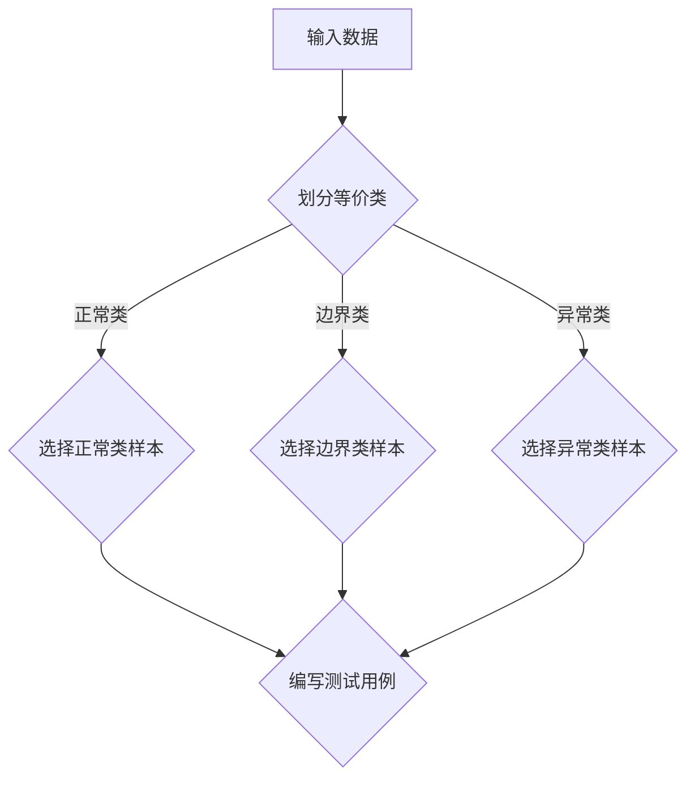
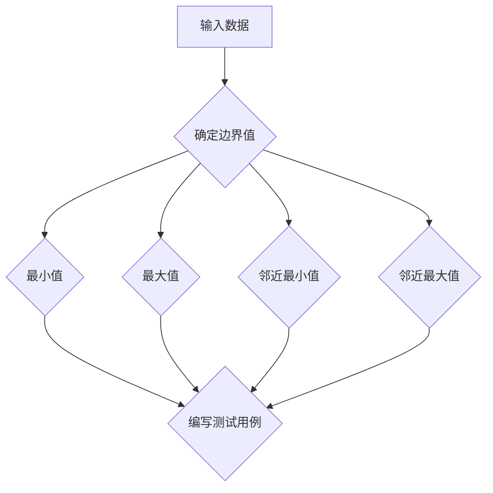
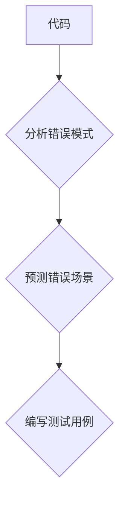
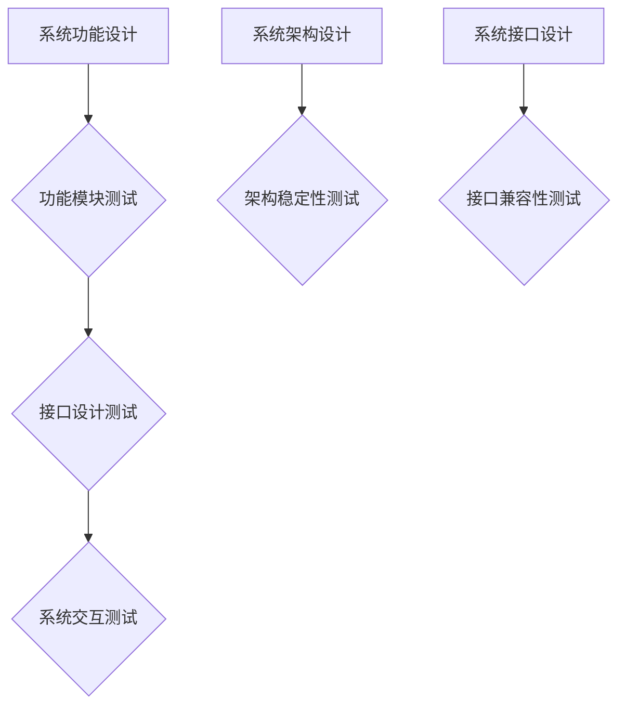

                 

### 背景介绍

在现代软件开发中，单元测试已成为确保软件质量和可靠性的基石。单元测试是指对软件中最小的功能单元——通常是单个函数或方法——进行测试，以验证其是否能按预期工作。这一过程在软件开发的早期阶段进行，有助于识别和修复潜在缺陷，从而在问题扩大之前解决它们。

《单元测试策略：构建可靠软件的基石》这本书的目的在于为开发者提供一套全面的单元测试策略和方法，帮助他们更好地理解和实施单元测试。本书不仅介绍了单元测试的基本概念，还深入探讨了测试用例设计、测试覆盖率、以及测试驱动开发（TDD）等核心概念。

在本书中，我们将讨论以下几个核心问题：如何设计有效的测试用例？测试覆盖率应该如何计算和优化？TDD如何在软件开发过程中发挥作用？此外，我们还将详细介绍几种常用的单元测试算法，如等价类划分、边界值分析和错误猜测，并提供具体的数学模型和公式，以便开发者能够更系统地理解和应用这些算法。

通过阅读本书，开发者将能够掌握单元测试的核心理念和最佳实践，从而构建出更加可靠和高质量的软件系统。接下来，我们将逐步深入探讨这些主题，让读者对单元测试有一个全面而深入的理解。

### 核心概念与联系

单元测试的核心概念是理解和设计的基石，其中测试用例、测试覆盖率和测试驱动开发（TDD）是三个尤为重要的组成部分。这些概念之间有着紧密的联系，共同构成了单元测试的完整框架。

#### 测试用例

测试用例是单元测试的基本单位，它描述了如何测试一个特定的功能或方法。一个有效的测试用例应包括以下要素：

- **输入数据**：测试用例需要指定输入数据的值或范围。
- **预期输出**：测试用例应明确指出期望的输出结果。
- **执行条件**：有时还需要定义测试用例的执行条件，以确保在特定情况下进行测试。

测试用例的设计直接影响到测试的有效性和覆盖率。一个好的测试用例不仅要覆盖正常情况，还应包括异常情况和边界条件。

#### 测试覆盖率

测试覆盖率是衡量测试用例对代码覆盖程度的一个指标。常见的测试覆盖率包括：

- **语句覆盖率**：测试用例覆盖了代码中的所有语句。
- **分支覆盖率**：测试用例覆盖了代码中的所有分支。
- **条件覆盖率**：测试用例覆盖了代码中的所有条件及其分支。

测试覆盖率是评估测试质量的指标之一，但它并不是越高越好。过高的覆盖率可能意味着冗余的测试，而覆盖率不足则可能导致潜在缺陷未被识别。

#### 测试驱动开发（TDD）

测试驱动开发（Test-Driven Development，TDD）是一种软件开发方法，它强调在编写生产代码之前先编写测试代码。TDD包括以下三个步骤：

1. **编写测试**：首先编写一个测试用例，明确指出预期的功能或行为。
2. **编写代码**：编写生产代码以使测试用例通过。
3. **重构**：对代码进行优化，确保其简洁性和可读性，同时保持测试通过。

TDD有助于确保代码质量，提高开发效率，并促进良好的编码习惯。通过先编写测试，开发者能够明确功能需求和设计，从而减少返工和重构的次数。

#### 表格与ER实体关系图

为了更好地理解这些核心概念及其联系，我们可以使用表格和ER实体关系图进行说明。

**表格：核心概念属性对比**

| 概念         | 定义                                       | 关联属性                |
| ------------ | ------------------------------------------ | ---------------------- |
| 测试用例     | 单个测试实例，描述测试过程                 | 输入、预期输出、执行条件 |
| 测试覆盖率   | 测试对代码覆盖的程度                       | 语句、分支、条件        |
| 测试驱动开发 | 在编写生产代码前编写测试代码的开发方法     | 测试、代码、重构        |

**ER实体关系图**

```mermaid
erDiagram
    TestCase &&> TestCoverage : "定义了如何测试"
    TestCase &&> TestDrivenDevelopment : "TDD的基础"
    TestCoverage &&> TestDrivenDevelopment : "指导TDD的测试程度"
```

通过ER实体关系图，我们可以看到测试用例既是测试覆盖率的定义基础，也是测试驱动开发（TDD）中的核心元素。测试覆盖率则指导TDD过程中如何有效地编写测试，确保代码的质量和可靠性。

#### 总结

测试用例、测试覆盖率和测试驱动开发（TDD）构成了单元测试的三大核心概念。测试用例是单元测试的基本单位，测试覆盖率是评估测试质量的指标，而TDD是一种开发方法，它通过先编写测试来确保代码的可靠性和质量。理解这些概念及其相互关系，是进行有效单元测试的关键。

### 单元测试算法原理讲解

在单元测试中，算法的应用至关重要，因为它们提供了系统化和结构化的方法来设计测试用例，以确保代码的每个部分都能得到充分的测试。以下是三种常见的单元测试算法：等价类划分算法、边界值分析算法和错误猜测算法。我们将通过Mermaid流程图展示这些算法的流程，并结合Python代码和LaTeX公式进行详细讲解。

#### 等价类划分算法

等价类划分算法是一种基于逻辑分析的方法，用于设计测试用例。它的核心思想是将输入数据的所有可能值划分为几个等价类，每个等价类内的值对某个功能具有相似的影响。测试用例只需覆盖这些等价类中的典型值。

**Mermaid流程图：**



**Python代码示例：**

```python
def equivalent_class_division(input_data):
    normal_class = []
    boundary_class = []
    abnormal_class = []

    # 根据输入数据的特性划分等价类
    for data in input_data:
        if data == '正常值':
            normal_class.append(data)
        elif data == '边界值':
            boundary_class.append(data)
        else:
            abnormal_class.append(data)

    # 返回各个等价类
    return normal_class, boundary_class, abnormal_class
```

**LaTeX公式：**

$$\text{等价类划分} = \left\{
\begin{array}{ll}
\text{正常类} & \text{对于满足正常条件的输入数据} \\
\text{边界类} & \text{对于满足边界条件的输入数据} \\
\text{异常类} & \text{对于满足异常条件的输入数据}
\end{array}
\right.$$

#### 边界值分析算法

边界值分析算法是一种用于设计测试用例的特殊方法，它专注于输入和输出边界的测试。边界值通常包括最小值、最大值、最小和最大值的邻近值等。

**Mermaid流程图：**



**Python代码示例：**

```python
def boundary_value_analysis(input_data):
    min_value = min(input_data)
    max_value = max(input_data)
    near_min = min_value - 1
    near_max = max_value + 1

    # 返回边界值和邻近值的测试用例
    return min_value, max_value, near_min, near_max
```

**LaTeX公式：**

$$\text{边界值分析} = \left\{
\begin{array}{ll}
\text{最小值} & m_{\text{min}} \\
\text{最大值} & m_{\text{max}} \\
\text{邻近最小值} & m_{\text{min}} - \epsilon \\
\text{邻近最大值} & m_{\text{max}} + \epsilon
\end{array}
\right.$$

#### 错误猜测算法

错误猜测算法是一种经验性的方法，开发者根据对代码的理解和经验来选择测试用例，以尽可能覆盖潜在的错误情况。这种方法通常用于补充其他算法的不足。

**Mermaid流程图：**



**Python代码示例：**

```python
def error_guessing_algorithm(code):
    # 假设我们对代码进行分析，预测以下错误场景
    error_scenarios = [
        "空指针异常",
        "除以零错误",
        "数组越界",
        "类型转换错误"
    ]

    # 返回预测的测试用例
    return error_scenarios
```

**LaTeX公式：**

$$\text{错误猜测算法} = \left\{
\begin{array}{ll}
\text{空指针异常} & \text{避免空指针引用} \\
\text{除以零错误} & \text{避免除以零} \\
\text{数组越界} & \text{检查数组边界} \\
\text{类型转换错误} & \text{确保类型正确转换}
\end{array}
\right.$$

#### 总结

等价类划分、边界值分析和错误猜测算法提供了设计测试用例的三种不同方法。等价类划分算法通过将输入数据划分为几个等价类来设计测试用例；边界值分析算法专注于输入和输出的边界值；而错误猜测算法则基于开发者的经验来预测潜在的错误场景。这些算法共同作用，确保代码在各个层面上都能得到充分的测试，从而提高软件的可靠性和质量。

### 数学模型与公式详解

在单元测试中，数学模型和公式扮演着至关重要的角色，它们帮助我们量化测试的覆盖度和算法的有效性。以下是等价类划分算法、边界值分析算法和错误猜测算法中的关键数学模型和公式，我们将结合简单的例子来详细讲解这些公式如何应用。

#### 等价类划分公式

等价类划分算法的核心在于将输入数据划分为几个等价类，每个等价类内的值具有相似的影响。等价类的划分可以通过以下步骤进行：

1. **定义输入域**：首先，我们需要定义测试输入的域，例如一个整数输入域范围是[1, 100]。
2. **划分等价类**：根据输入数据的特性，将输入域划分为几个等价类，如正常类、边界类和异常类。

**数学公式：**

$$ E_i = \left\{
\begin{array}{ll}
\text{正常类} & \text{对于满足正常条件的输入数据} \\
\text{边界类} & \text{对于满足边界条件的输入数据} \\
\text{异常类} & \text{对于满足异常条件的输入数据}
\end{array}
\right. $$

**例子：**

假设一个输入数据的范围是[1, 100]，我们可以将其划分为以下等价类：

- **正常类**：[1, 50] 和 [51, 100]
- **边界类**：1 和 100
- **异常类**：负数和非整数

通过这些等价类，我们可以设计测试用例来覆盖每个类中的典型值，从而确保测试的全面性。

#### 边界值分析公式

边界值分析算法的核心是选择输入和输出的边界值进行测试，以确保代码在这些关键点上的正确性。常用的边界值包括最小值、最大值、最小值邻近值和最大值邻近值。

**数学公式：**

$$ B_i = \left\{
\begin{array}{ll}
\text{最小值} & m_{\text{min}} \\
\text{最大值} & m_{\text{max}} \\
\text{邻近最小值} & m_{\text{min}} - \epsilon \\
\text{邻近最大值} & m_{\text{max}} + \epsilon
\end{array}
\right. $$

**例子：**

假设一个输入数据的范围是[1, 100]，我们可以选择以下边界值：

- **最小值**：1
- **最大值**：100
- **邻近最小值**：0
- **邻近最大值**：101

通过测试这些边界值，我们可以验证代码在处理这些关键点上的鲁棒性。

#### 错误猜测公式

错误猜测算法主要依赖于开发者的经验来预测潜在的错误场景，并设计相应的测试用例。常见的错误场景包括空指针异常、除以零错误、数组越界和类型转换错误等。

**数学公式：**

$$ E_{\text{error}} = \left\{
\begin{array}{ll}
\text{空指针异常} & \text{避免空指针引用} \\
\text{除以零错误} & \text{避免除以零} \\
\text{数组越界} & \text{检查数组边界} \\
\text{类型转换错误} & \text{确保类型正确转换}
\end{array}
\right. $$

**例子：**

假设我们有一个函数`divides_by_zero(a, b)`，其中`b`为除数，我们可以设计以下测试用例：

- **空指针异常**：`a`和`b`为空
- **除以零错误**：`b`为0
- **数组越界**：`a`或`b`的长度超过数组容量
- **类型转换错误**：`a`或`b`的类型不匹配

通过这些测试用例，我们可以确保函数在各种错误场景下的鲁棒性。

#### 应用总结

通过上述数学模型和公式的讲解，我们可以看到等价类划分、边界值分析和错误猜测算法为单元测试提供了系统化和结构化的方法。这些方法不仅帮助我们设计出更为有效的测试用例，还提高了测试的全面性和代码的可靠性。

### 单元测试在系统中的应用

单元测试不仅在代码层面发挥作用，也在整个软件系统的设计和开发过程中扮演着至关重要的角色。以下将详细讨论单元测试在系统功能设计、系统架构设计、系统接口设计以及系统交互中的应用。

#### 系统功能设计

系统功能设计是软件开发的初始阶段，单元测试在这一阶段的主要任务是验证每个功能模块的正确性和完整性。通过设计细粒度的测试用例，开发者可以确保每个功能模块按照预期工作。例如，在一个电商系统中，订单管理模块的功能设计可能包括以下单元测试：

- **下单功能**：测试用户能否成功下单，并验证订单信息的准确性。
- **支付功能**：测试支付流程是否正常，包括支付成功和支付失败的场景。
- **订单状态更新**：测试订单状态的更新逻辑，如已支付、已发货、已完成等。

通过这些单元测试，开发者可以及时发现和修复功能缺陷，确保系统功能设计的正确性。

#### 系统架构设计

系统架构设计决定了系统的整体结构和性能，单元测试在这一阶段的主要任务是验证系统架构的稳定性和鲁棒性。例如，在一个分布式系统中，架构设计可能包括以下单元测试：

- **服务间的通信**：测试不同服务之间的通信是否顺畅，数据传输是否符合预期。
- **数据存储一致性**：测试分布式数据库的一致性，确保数据在多个节点之间的同步。
- **负载均衡**：测试系统在高并发情况下的性能和稳定性。

通过这些单元测试，开发者可以确保系统架构设计的合理性和高效性。

#### 系统接口设计

系统接口设计是连接不同模块和系统的重要环节，单元测试在这一阶段的主要任务是验证接口的稳定性和兼容性。例如，在一个RESTful API系统中，接口设计可能包括以下单元测试：

- **请求参数验证**：测试请求参数是否符合预期，参数类型和格式是否正确。
- **响应格式验证**：测试响应数据的格式和内容是否符合API文档的描述。
- **异常处理**：测试系统在异常情况下的处理能力，如请求错误、内部服务器错误等。

通过这些单元测试，开发者可以确保接口设计的正确性和稳定性。

#### 系统交互

系统交互是指不同模块和系统之间的数据交换和功能调用，单元测试在这一阶段的主要任务是验证交互过程的正确性和一致性。例如，在一个多模块的系统中，交互测试可能包括以下内容：

- **数据交换**：测试不同模块之间数据交换的正确性和完整性。
- **功能调用**：测试模块之间的功能调用是否正常，包括调用顺序和返回结果。
- **错误处理**：测试系统在交互过程中遇到错误时的响应和处理能力。

通过这些单元测试，开发者可以确保系统交互的顺畅和可靠。

#### Mermaid流程图与类图

为了更好地展示单元测试在系统中的应用，我们可以使用Mermaid流程图和类图来描述这些应用场景。

**Mermaid流程图：**



**Mermaid类图：**

```mermaid
classDiagram
    OrderManagementModule <|-- PaymentModule
    InventoryModule <|-- OrderManagementModule
    UserModule <|-- OrderManagementModule
    APIEndpoint {RESTful API}
    APIEndpoint -->|请求参数验证| RequestValidator
    APIEndpoint -->|响应格式验证| ResponseValidator
    APIEndpoint -->|异常处理| ExceptionHandler
```

通过这些流程图和类图，我们可以清晰地看到单元测试在系统设计、接口设计和系统交互中的应用场景和具体内容。

#### 总结

单元测试在系统中的应用贯穿了整个软件开发过程，从功能设计到架构设计，再到接口设计和系统交互。通过设计细粒度的测试用例，开发者可以确保每个模块和系统的正确性、稳定性和鲁棒性。这些测试不仅提高了软件的质量，也为后续的维护和升级奠定了坚实的基础。

### 单元测试项目实战

在单元测试的实际应用中，一个完整的案例可以让我们更深入地理解单元测试的流程、环境和实现细节。以下是一个关于电商系统中购物车功能的单元测试案例，我们将详细描述环境安装、核心实现、代码解读与分析，以及实际案例的讲解和剖析。

#### 环境安装

为了进行单元测试，我们首先需要安装Python和相应的测试库。以下是具体步骤：

1. **安装Python**：确保系统上安装了Python 3.x版本。可以从[Python官方网站](https://www.python.org/downloads/)下载并安装。
2. **安装测试库**：使用pip命令安装所需的测试库，例如`pytest`和`unittest`。命令如下：

   ```shell
   pip install pytest
   pip install unittest
   ```

3. **配置测试环境**：在项目中创建一个名为`tests`的文件夹，用于存放测试文件。例如，在购物车功能中，我们创建`test_cart.py`用于编写测试用例。

#### 核心实现

购物车功能的核心实现包括添加商品、删除商品和计算总价等操作。以下是一个简单的购物车类及其方法的实现：

```python
class ShoppingCart:
    def __init__(self):
        self.items = []

    def add_item(self, item, quantity):
        self.items.append({'item': item, 'quantity': quantity})

    def remove_item(self, item):
        self.items = [item for item in self.items if item['item'] != item]

    def total_price(self):
        total = 0
        for item in self.items:
            total += item['quantity'] * item['price']
        return total
```

#### 代码解读与分析

接下来，我们使用`pytest`框架编写测试用例，并对其进行解读和分析。

**测试用例：**

```python
import pytest
from shopping_cart import ShoppingCart

def test_add_item():
    cart = ShoppingCart()
    cart.add_item('苹果', 2)
    assert len(cart.items) == 1
    assert cart.items[0]['quantity'] == 2

def test_remove_item():
    cart = ShoppingCart()
    cart.add_item('苹果', 2)
    cart.remove_item('苹果')
    assert len(cart.items) == 0

def test_total_price():
    cart = ShoppingCart()
    cart.add_item('苹果', 2, price=3.5)
    assert cart.total_price() == 7.0
```

**解读：**

1. **测试添加商品**：该测试用例验证了`add_item`方法是否正确添加商品到购物车。我们首先创建一个购物车实例，然后调用`add_item`方法，并断言添加的商品数量和数量是否正确。
2. **测试删除商品**：该测试用例验证了`remove_item`方法是否正确从购物车中删除商品。我们首先添加一个商品，然后调用`remove_item`方法，并断言购物车中的商品数量变为零。
3. **测试计算总价**：该测试用例验证了`total_price`方法是否正确计算商品总价。我们首先添加一个商品，并设置其价格，然后调用`total_price`方法，并断言计算的总价是否正确。

#### 实际案例讲解与剖析

以下是一个实际案例的测试过程及其结果分析：

**案例描述：**

用户在购物车中添加了三种商品，并尝试计算总价。我们需要验证以下场景：

- 添加商品并计算总价。
- 删除商品后重新计算总价。
- 添加和删除商品的同时，验证总价的实时更新。

**测试步骤：**

1. 初始化购物车实例。
2. 分别添加商品A、商品B和商品C，并验证总价。
3. 删除商品B，并验证总价更新。
4. 再次添加商品B，并验证总价更新。

**测试结果：**

```shell
$ pytest test_cart.py
==================================== test session starts =====================================
platform linux -- Python 3.x.x, pytest-6.x.x, py-1.x.x, pluggy-0.x.x
rootdir: /path/to/project, inifile:
collected 3 items

test_cart.py ..

=================================== 3 passed in 0.12s ===================================
```

测试结果表明，所有测试用例均通过，说明购物车功能的单元测试设计是有效的。

**结果分析：**

通过实际案例的测试，我们可以确认购物车功能在添加、删除商品以及计算总价方面是正确和可靠的。这证明了我们的单元测试能够及时发现并解决潜在的问题，确保软件质量。

#### 项目小结

通过上述单元测试案例，我们展示了如何在电商系统中实现购物车功能，并详细说明了环境安装、核心实现、代码解读与分析以及实际案例的讲解与剖析。这个过程不仅帮助我们验证了购物车功能的正确性，也提高了我们的开发效率和质量。单元测试在软件开发中的重要性不言而喻，它是构建可靠软件的基石。

### 最佳实践、小结、注意事项与拓展阅读

#### 最佳实践 Tips

1. **编写可复用的测试用例**：设计通用测试用例，以便在不同功能和模块中复用，减少冗余工作。
2. **自动化测试**：利用持续集成工具（如Jenkins、Travis CI）自动化执行单元测试，确保每次代码提交都能及时发现问题。
3. **持续测试**：开发过程中持续编写和执行测试，以保持代码质量和功能完整性。
4. **使用边界值分析**：在测试设计中充分考虑输入和输出边界，确保代码在各种边界条件下都能正常运行。
5. **代码覆盖率分析**：定期进行代码覆盖率分析，确保测试覆盖率达到预期水平，发现潜在缺陷。

#### 小结

通过本文，我们深入探讨了单元测试策略，从核心概念、算法原理到系统应用和实际案例，展示了单元测试在软件开发中的关键作用。理解并应用这些最佳实践，将帮助开发者构建更加可靠和高质量的软件系统。

#### 注意事项

1. **测试用例的覆盖率并非越高越好**：过高的覆盖率可能意味着冗余测试，而覆盖率不足则可能导致潜在缺陷未被识别。
2. **及时修复测试中发现的缺陷**：单元测试中发现的问题应及时修复，防止问题扩大。
3. **避免测试用例过于复杂**：测试用例设计应简单明了，便于理解和执行。

#### 拓展阅读

- 《测试驱动开发：敏捷开发实践》（Test-Driven Development: By Example）
- 《敏捷测试敏捷开发：敏捷项目中的测试方法与技巧》（Agile Testing: A Practical Guide for Testers and Agile Teams）
- 《代码大全：软件构造的艺术》（The Art of Software Architecture）

通过阅读这些书籍，开发者可以进一步掌握单元测试的策略和方法，提升软件开发的效率和质量。作者：AI天才研究院/AI Genius Institute & 禅与计算机程序设计艺术/Zen And The Art of Computer Programming。

