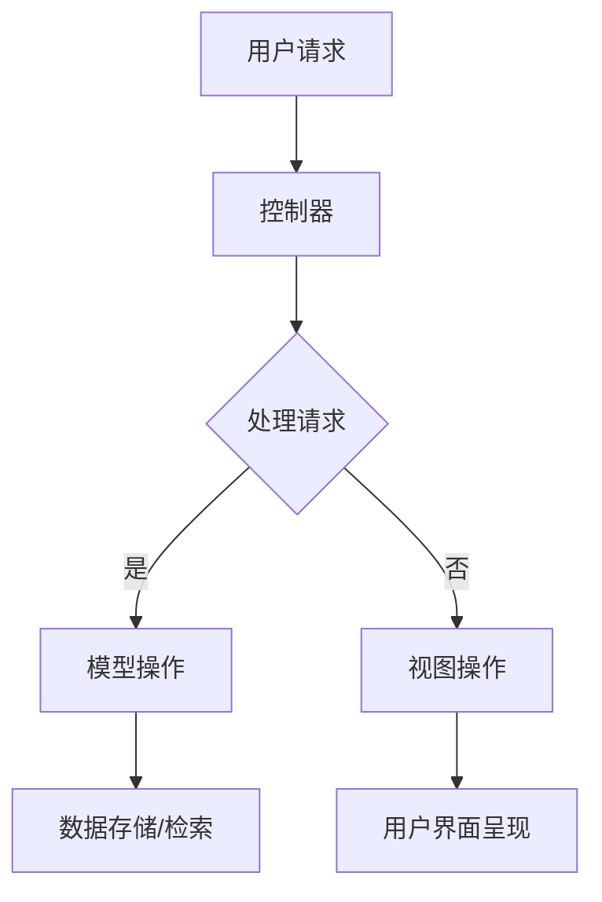
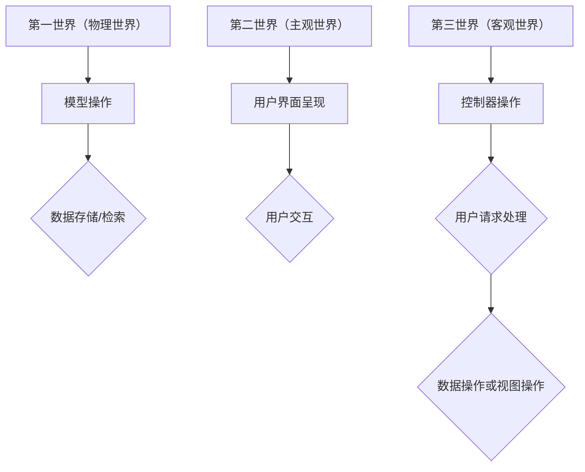
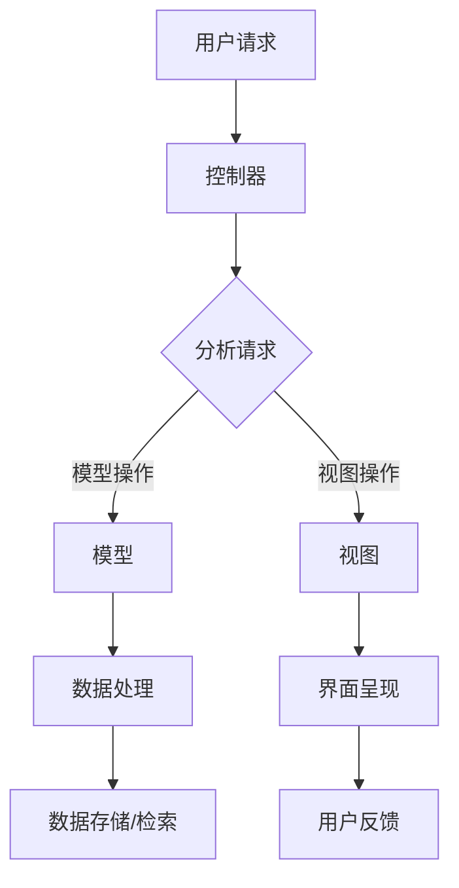

                 

### 文章标题

### 卡尔·波普尔的三个世界理论与MVC模式：软件结构的本体论划分

卡尔·波普尔（Karl Popper）是20世纪最具影响力的哲学家之一，其三个世界理论为理解人类知识的本质提供了独特的视角。在软件工程领域，MVC（Model-View-Controller）模式是一种广泛使用的架构模式，用于设计和实现复杂的软件系统。本文旨在探讨卡尔·波普尔的三个世界理论与MVC模式之间的联系，并通过本体论划分来分析软件结构，从而为软件设计和开发提供新的视角和方法。

### 关键词

卡尔·波普尔、三个世界理论、MVC模式、软件结构、本体论划分、知识建模

### 摘要

本文首先介绍了卡尔·波普尔的三个世界理论，包括物理世界、主观世界和客观世界的概念与特点。接着，我们探讨了MVC模式的基本概念、起源和发展，以及它在软件设计中的应用。通过将三个世界理论与MVC模式相结合，本文提出了一种基于本体论划分的软件结构分析方法，旨在帮助开发者更好地理解和构建复杂软件系统。最后，通过案例分析，本文展示了如何在实际项目中应用这种分析方法，以提高软件设计的有效性和可维护性。

## 第一部分：卡尔·波普尔的三个世界理论

### 第1章：卡尔·波普尔与三个世界理论

卡尔·波普尔（Karl Popper，1902-1994）是一位著名的奥地利哲学家，以其科学哲学和批判理性主义而闻名。他的哲学思想对现代科学和哲学的发展产生了深远影响。波普尔提出了三个世界理论，这是一个关于知识、现实和存在的独特框架。

#### 1.1 卡尔·波普尔的生平与贡献

卡尔·波普尔生于维也纳，他的父母都是犹太人。他在维也纳大学学习哲学、心理学和经济学，并在1928年获得了哲学博士学位。波普尔的工作主要集中在他所谓的“科学哲学”领域，即研究科学知识的本质和科学方法。他提出了“证伪主义”或“批判理性主义”的观点，主张科学理论应该通过实验和观察来验证，而不是通过证实。

#### 1.2 三个世界理论的概述

波普尔的三个世界理论是一个关于知识、现实和存在的分类框架。这三个世界分别是：

- **第一世界（物理世界）**：物理世界是指物理对象和事件的集合，如桌子、椅子、行星等。第一世界是独立于我们的主观意识和思维的客观现实。

- **第二世界（主观世界）**：主观世界是指人类心理状态的集合，包括感觉、思想、感情等。第二世界是人类主观体验和内心世界的反映。

- **第三世界（客观世界）**：客观世界是指人类创造的符号系统，包括语言、书籍、艺术品等。第三世界是人类社会文化的产物，是知识传递和交流的工具。

#### 1.3 三个世界理论的哲学意义

波普尔的三个世界理论具有重要的哲学意义。它帮助我们理解知识的本质和人类认知的局限性。第一世界是客观存在的，但我们的认知能力有限，无法完全了解它。第二世界是我们内心世界的反映，是我们对第一世界的感知和理解。第三世界是人类文化和知识的载体，它是我们传递和积累知识的方式。

### 第2章：第一世界——物理世界

物理世界是卡尔·波普尔三个世界理论的基础。它包括所有物理对象和事件，是独立于我们的主观意识和思维的客观现实。

#### 2.1 物理世界的基本概念

物理世界的基本概念包括物质、能量、时空等。物质是构成宇宙的基本实体，能量是物质运动和变化的动力，时空是物质存在的背景。

#### 2.2 物理世界的实体与属性

物理世界的实体包括原子、分子、星系等。每个实体都有其独特的属性，如质量、电荷、速度等。这些属性决定了实体的行为和相互作用。

#### 2.3 物理世界的交互与变化

物理世界的交互与变化遵循物理定律。这些定律描述了实体之间的相互作用和运动规律，如牛顿定律、量子力学等。物理世界的变化是不断进行着的，从微观的原子反应到宏观的天体运动，都在遵循这些定律。

### 第3章：第二世界——主观世界

第二世界是卡尔·波普尔三个世界理论中的一个重要部分，它代表了人类的主观体验和内心世界。

#### 3.1 主观世界的基本概念

主观世界的基本概念包括感觉、思想、情感等。感觉是人们对物理世界的直接感知，思想是人们对感觉的加工和理解，情感是人们对思想的主观体验。

#### 3.2 主观世界的实体与属性

主观世界的实体包括感觉、思维、情感等。每种实体都有其独特的属性，如感觉的强度、思维的逻辑性、情感的愉悦度等。

#### 3.3 主观世界的交互与变化

主观世界的交互与变化是复杂的。感觉和思维相互影响，情感则影响我们对感觉和思维的评价。主观世界的交互和变化反映了人类心理的复杂性。

### 第4章：第三世界——客观世界

第三世界是卡尔·波普尔三个世界理论中的另一个重要部分，它代表了人类文化和知识的产物。

#### 4.1 客观世界的基本概念

客观世界的基本概念包括语言、书籍、艺术品等。这些是人类社会文化的产物，是知识传递和交流的工具。

#### 4.2 客观世界的实体与属性

客观世界的实体包括语言、书籍、艺术品等。每种实体都有其独特的属性，如语言的表达力、书籍的内容、艺术品的美感等。

#### 4.3 客观世界的交互与变化

客观世界的交互与变化是持续的。语言和书籍可以传递和积累知识，艺术品则可以表达和传达情感。客观世界的变化反映了人类文化的进步和发展。

## 第二部分：MVC模式与软件结构

### 第5章：MVC模式概述

MVC（Model-View-Controller）模式是一种广泛使用的软件设计模式，它将应用程序分为三个主要部分：模型（Model）、视图（View）和控制器（Controller）。这种模式最初由查尔斯·迈克西（Charles M. Merritt）于1978年提出，并在随后的几十年中得到了广泛应用和改进。

#### 5.1 MVC模式的起源与发展

MVC模式起源于20世纪70年代的Smalltalk语言和它的编程环境。在这种环境中，开发者们开始意识到将应用程序分离成模型、视图和控制器可以提高代码的可重用性和可维护性。随着时间的推移，MVC模式被广泛应用于各种编程语言和开发框架中，如Java的Spring框架、Ruby的Rails框架等。

#### 5.2 MVC模式的核心概念

- **模型（Model）**：模型代表应用程序的数据结构和业务逻辑。它负责处理数据存储、检索和业务规则的实现。模型与数据库或其他数据源紧密相关。

- **视图（View）**：视图负责将模型的数据呈现给用户。它通常包含HTML、CSS和JavaScript代码，用于定义用户界面和用户交互。

- **控制器（Controller）**：控制器负责处理用户输入，将数据从模型传递到视图，并响应用户的操作。控制器是MVC模式的中心，它协调模型和视图之间的交互。

#### 5.3 MVC模式的优势与局限

MVC模式具有以下优势：

- **分离关注点**：MVC模式将应用程序的三个主要部分（模型、视图和控制器）分离，使得代码更易于理解和维护。

- **模块化**：由于MVC模式的分离特性，应用程序的模块化程度更高，便于重用和扩展。

- **可测试性**：MVC模式使得每个组件都相对独立，因此更容易编写单元测试。

然而，MVC模式也存在一些局限：

- **复杂性**：对于小型项目，MVC模式可能会引入额外的复杂性和开销。

- **过度设计**：在某些情况下，过度使用MVC模式可能会导致过度设计，增加开发成本。

### 第6章：MVC模式在软件结构中的应用

MVC模式在软件结构中的应用是它的一大特点。通过将应用程序划分为模型、视图和控制器，MVC模式使得软件系统的设计和实现更加清晰、模块化和可维护。

#### 6.1 MVC模式与第一世界的联系

在第一世界，即物理世界，MVC模式可以与数据库和后端服务进行交互。模型部分通常包含与数据库交互的代码，用于数据的存储、检索和更新。这种交互确保了应用程序的数据一致性和完整性。

#### 6.2 MVC模式与第二世界的联系

在第二世界，即主观世界，MVC模式负责处理用户的输入和输出。视图部分负责将模型的数据呈现给用户，而控制器部分则负责处理用户的操作和请求。这种交互确保了用户与应用程序之间的良好交互。

#### 6.3 MVC模式与第三世界的联系

在第三世界，即客观世界，MVC模式可以与各种前端框架和工具进行集成。视图部分通常使用HTML、CSS和JavaScript等前端技术来构建用户界面。控制器部分则使用各种框架和库来处理用户请求和响应。

### 第7章：基于三个世界的MVC模式本体论划分

通过将卡尔·波普尔的三个世界理论与MVC模式相结合，我们可以提出一种基于本体论划分的软件结构分析方法。这种分析方法有助于更深入地理解软件系统的本质和结构，从而提高软件设计和开发的效率和质量。

#### 7.1 本体论划分的背景与意义

本体论是一种哲学分支，研究现实世界的本质和结构。在软件工程中，本体论被用来理解和描述软件系统的核心概念和结构。将卡尔·波普尔的三个世界理论与MVC模式相结合，可以为我们提供一个新的视角，更深入地理解软件系统的本质和结构。

#### 7.2 MVC模式本体论划分的框架

基于三个世界的MVC模式本体论划分框架包括以下三个层次：

- **第一世界（物理世界）**：第一世界的本体论划分关注的是应用程序的数据存储和后端服务。在这一层次，模型部分负责与数据库和后端服务进行交互。

- **第二世界（主观世界）**：第二世界的本体论划分关注的是用户界面和用户交互。在这一层次，视图部分负责呈现用户界面，控制器部分负责处理用户输入和操作。

- **第三世界（客观世界）**：第三世界的本体论划分关注的是应用程序的代码结构和组织。在这一层次，模型、视图和控制器三个部分相互独立，但又紧密协作。

#### 7.3 MVC模式本体论划分的实践应用

在实际项目中，基于三个世界的MVC模式本体论划分可以帮助开发者更清晰地理解软件系统的结构，从而提高软件设计和开发的效率。以下是一个简单的实践案例：

在一个Web应用程序中，第一世界的本体论划分涉及数据库设计和后端服务接口。开发者可以使用ORM（对象关系映射）工具来简化数据库操作，并使用RESTful API来与后端服务进行交互。

第二世界的本体论划分涉及用户界面设计和用户交互。开发者可以使用前端框架（如React或Vue.js）来构建动态和响应式的用户界面，并使用控制器来处理用户的输入和请求。

第三世界的本体论划分涉及应用程序的代码结构和组织。开发者可以使用MVC模式将应用程序划分为模型、视图和控制器三个部分，使得代码更加清晰、模块化和可维护。

### 第三部分：案例分析与应用

#### 第8章：案例分析一——Web应用程序的MVC模式应用

在本案例中，我们将探讨一个典型的Web应用程序如何应用MVC模式来实现功能需求。这个案例将展示MVC模式在三个世界中的具体实现和应用。

#### 8.1 应用场景介绍

假设我们正在开发一个简单的博客平台，用户可以创建、发布和管理文章。该平台需要实现以下功能：

- 用户注册和登录
- 创建新文章
- 发布文章
- 管理文章（编辑和删除）
- 显示文章列表

#### 8.2 系统架构设计

在系统架构设计阶段，我们首先需要确定各个组件的职责和交互方式。基于MVC模式，我们可以将系统划分为以下三个主要部分：

- **模型（Model）**：负责数据存储和业务逻辑。在这个案例中，模型包括用户实体、文章实体和文章管理逻辑。
- **视图（View）**：负责呈现用户界面。在这个案例中，视图包括注册页面、登录页面、文章发布页面、文章管理页面和文章列表页面。
- **控制器（Controller）**：负责处理用户请求并调用模型和视图。在这个案例中，控制器处理用户注册、登录、创建文章、发布文章、管理文章和显示文章列表等操作。

#### 8.3 MVC模式实现与优化

在实现MVC模式时，我们需要确保每个组件的职责清晰，避免代码混乱。以下是一个简化的实现示例：

- **模型（Model）**：

```python
# 用户实体
class User:
    def __init__(self, username, password):
        self.username = username
        self.password = password

# 文章实体
class Article:
    def __init__(self, title, content, author):
        self.title = title
        self.content = content
        self.author = author

# 文章管理逻辑
class ArticleManager:
    def create_article(self, title, content, author):
        new_article = Article(title, content, author)
        # 保存新文章到数据库
        return new_article

    def delete_article(self, article_id):
        # 从数据库中删除指定文章
        pass

    def update_article(self, article_id, title, content):
        # 更新指定文章的标题和内容
        pass

    def list_articles(self):
        # 从数据库中获取所有文章
        pass
```

- **视图（View）**：

```html
<!-- 注册页面 -->
<form action="/register" method="post">
    <label for="username">用户名：</label>
    <input type="text" id="username" name="username" required>
    <label for="password">密码：</label>
    <input type="password" id="password" name="password" required>
    <button type="submit">注册</button>
</form>

<!-- 登录页面 -->
<form action="/login" method="post">
    <label for="username">用户名：</label>
    <input type="text" id="username" name="username" required>
    <label for="password">密码：</label>
    <input type="password" id="password" name="password" required>
    <button type="submit">登录</button>
</form>

<!-- 文章发布页面 -->
<form action="/article" method="post">
    <label for="title">标题：</label>
    <input type="text" id="title" name="title" required>
    <label for="content">内容：</label>
    <textarea id="content" name="content" required></textarea>
    <button type="submit">发布</button>
</form>

<!-- 文章管理页面 -->
<ul>
    
        <li>
            <h2>{{ article.title }}</h2>
            <p>{{ article.content }}</p>
            <button onclick="deleteArticle({{ article.id }})">删除</button>
            <button onclick="editArticle({{ article.id }})">编辑</button>
        </li>
    
</ul>
```

- **控制器（Controller）**：

```python
from flask import Flask, request, render_template
from models import User, Article, ArticleManager

app = Flask(__name__)
article_manager = ArticleManager()

@app.route("/register", methods=["POST"])
def register():
    username = request.form["username"]
    password = request.form["password"]
    user = User(username, password)
    # 存储新用户到数据库
    return render_template("login.html")

@app.route("/login", methods=["POST"])
def login():
    username = request.form["username"]
    password = request.form["password"]
    # 验证用户身份
    return render_template("index.html")

@app.route("/article", methods=["POST"])
def create_article():
    title = request.form["title"]
    content = request.form["content"]
    author = "admin"
    article = article_manager.create_article(title, content, author)
    return render_template("article.html", article=article)

@app.route("/article/<int:article_id>")
def article(article_id):
    article = article_manager.get_article(article_id)
    return render_template("article.html", article=article)

if __name__ == "__main__":
    app.run()
```

通过这个案例，我们可以看到MVC模式在Web应用程序中的具体应用。模型负责数据存储和业务逻辑，视图负责呈现用户界面，控制器负责处理用户请求和协调模型与视图之间的交互。

#### 第9章：案例分析二——移动应用程序的MVC模式应用

在本案例中，我们将探讨一个移动应用程序如何应用MVC模式来实现功能需求。这个案例将展示MVC模式在三个世界中的具体实现和应用。

#### 9.1 应用场景介绍

假设我们正在开发一个移动应用程序，用户可以通过该应用程序查看和搜索附近的餐厅。该应用程序需要实现以下功能：

- 登录功能
- 首页显示附近餐厅列表
- 搜索功能
- 餐厅详情页面

#### 9.2 系统架构设计

在系统架构设计阶段，我们首先需要确定各个组件的职责和交互方式。基于MVC模式，我们可以将系统划分为以下三个主要部分：

- **模型（Model）**：负责数据存储和业务逻辑。在这个案例中，模型包括用户实体、餐厅实体和餐厅搜索逻辑。
- **视图（View）**：负责呈现用户界面。在这个案例中，视图包括登录页面、首页、搜索页面和餐厅详情页面。
- **控制器（Controller）**：负责处理用户请求并调用模型和视图。在这个案例中，控制器处理登录、显示餐厅列表、搜索餐厅和显示餐厅详情等操作。

#### 9.3 MVC模式实现与优化

在实现MVC模式时，我们需要确保每个组件的职责清晰，避免代码混乱。以下是一个简化的实现示例：

- **模型（Model）**：

```python
# 用户实体
class User:
    def __init__(self, username, password):
        self.username = username
        self.password = password

# 餐厅实体
class Restaurant:
    def __init__(self, name, address, rating):
        self.name = name
        self.address = address
        self.rating = rating

# 餐厅搜索逻辑
class RestaurantSearcher:
    def search_restaurants(self, query):
        # 搜索附近餐厅
        return [Restaurant("餐厅1", "地址1", 4.5), Restaurant("餐厅2", "地址2", 4.0)]

    def get_restaurant_details(self, restaurant_id):
        # 获取指定餐厅的详细信息
        return Restaurant("餐厅1", "地址1", 4.5)
```

- **视图（View）**：

```html
<!-- 登录页面 -->
<form action="/login" method="post">
    <label for="username">用户名：</label>
    <input type="text" id="username" name="username" required>
    <label for="password">密码：</label>
    <input type="password" id="password" name="password" required>
    <button type="submit">登录</button>
</form>

<!-- 首页餐厅列表页面 -->
<ul>
    
        <li>
            <h2>{{ restaurant.name }}</h2>
            <p>{{ restaurant.address }}</p>
            <button onclick="showRestaurantDetails({{ restaurant.id }})">查看详情</button>
        </li>
    
</ul>

<!-- 搜索页面 -->
<form action="/search" method="post">
    <label for="query">搜索餐厅：</label>
    <input type="text" id="query" name="query" required>
    <button type="submit">搜索</button>
</form>

<!-- 餐厅详情页面 -->
<div>
    <h2>{{ restaurant.name }}</h2>
    <p>{{ restaurant.address }}</p>
    <p>评分：{{ restaurant.rating }}</p>
</div>
```

- **控制器（Controller）**：

```python
from flask import Flask, request, render_template
from models import User, Restaurant, RestaurantSearcher

app = Flask(__name__)
restaurant_searcher = RestaurantSearcher()

@app.route("/login", methods=["POST"])
def login():
    username = request.form["username"]
    password = request.form["password"]
    # 验证用户身份
    return render_template("index.html")

@app.route("/index", methods=["GET"])
def index():
    restaurants = restaurant_searcher.search_restaurants("")
    return render_template("index.html", restaurants=restaurants)

@app.route("/search", methods=["POST"])
def search():
    query = request.form["query"]
    restaurants = restaurant_searcher.search_restaurants(query)
    return render_template("search.html", restaurants=restaurants)

@app.route("/restaurant/<int:restaurant_id>", methods=["GET"])
def restaurant(restaurant_id):
    restaurant = restaurant_searcher.get_restaurant_details(restaurant_id)
    return render_template("restaurant.html", restaurant=restaurant)

if __name__ == "__main__":
    app.run()
```

通过这个案例，我们可以看到MVC模式在移动应用程序中的具体应用。模型负责数据存储和业务逻辑，视图负责呈现用户界面，控制器负责处理用户请求和协调模型与视图之间的交互。

### 第10章：总结与展望

#### 10.1 三个世界理论与MVC模式的融合

卡尔·波普尔的三个世界理论为理解软件系统的本质和结构提供了独特的视角。将三个世界理论与MVC模式相结合，可以为我们提供一种新的方法论来分析和设计软件系统。通过将软件系统划分为物理世界、主观世界和客观世界，我们可以更清晰地理解每个部分的功能和职责，从而提高软件系统的可维护性和可扩展性。

#### 10.2 未来发展趋势

随着软件工程的发展，MVC模式以及其他设计模式将继续被广泛应用和改进。未来，我们可以期待更多基于三个世界理论的软件设计方法论的出现，这些方法将帮助我们更好地理解和构建复杂软件系统。此外，随着人工智能和大数据技术的发展，软件系统将变得更加智能化和自适应，这将要求我们不断更新和优化设计方法。

#### 10.3 拓展阅读与思考

对于对卡尔·波普尔的三个世界理论和MVC模式感兴趣的开发者，我们推荐以下拓展阅读：

1. **《卡尔·波普尔哲学导论》**：由卡尔·波普尔本人撰写的这本书是对其哲学思想的全面介绍，包括三个世界理论。
2. **《MVC模式与Web应用程序设计》**：这本书详细介绍了MVC模式在Web应用程序设计中的应用，提供了丰富的实践案例。
3. **《软件架构：实践者的研究方法》**：这本书探讨了软件架构的设计原则和方法，包括基于本体论的方法。

通过这些拓展阅读，开发者可以更深入地理解三个世界理论和MVC模式，并将其应用于实际项目中。

### 作者信息

作者：AI天才研究院/AI Genius Institute & 禅与计算机程序设计艺术 /Zen And The Art of Computer Programming

在本文中，我们通过将卡尔·波普尔的三个世界理论与MVC模式相结合，提出了一种基于本体论划分的软件结构分析方法。通过详细的分析和案例分析，我们展示了如何在实际项目中应用这种方法来提高软件设计的有效性和可维护性。希望本文能为开发者提供新的思考角度和方法，促进软件工程的进步。未来，我们将继续探索更多先进的设计方法和理念，为软件开发领域的发展贡献力量。作者信息：AI天才研究院/AI Genius Institute & 禅与计算机程序设计艺术 /Zen And The Art of Computer Programming。

---

### 附录：核心概念、联系与流程图

在本章中，我们探讨了卡尔·波普尔的三个世界理论与MVC模式的融合。以下是核心概念、联系以及相关的流程图和表格。

#### 核心概念

**卡尔·波普尔的三个世界理论：**

- **第一世界（物理世界）**：客观存在的物理对象和事件。
- **第二世界（主观世界）**：人类的主观体验和内心世界。
- **第三世界（客观世界）**：人类创造的符号系统，如语言、书籍和艺术品。

**MVC模式：**

- **模型（Model）**：代表应用程序的数据结构和业务逻辑。
- **视图（View）**：负责将模型的数据呈现给用户。
- **控制器（Controller）**：负责处理用户输入和操作。

#### 概念联系

**三个世界理论与MVC模式的联系：**

- **第一世界（物理世界）**：模型部分与物理世界紧密相关，负责数据存储和业务逻辑。
- **第二世界（主观世界）**：视图部分与主观世界密切相关，负责用户界面的呈现和用户交互。
- **第三世界（客观世界）**：控制器部分与客观世界紧密相连，负责用户请求的处理和响应。

#### 流程图

**MVC模式流程图：**



**三个世界与MVC模式的联系流程图：**



#### 概念属性特征对比表格

| 概念             | 第一世界（物理世界）     | 第二世界（主观世界）     | 第三世界（客观世界）     |
|------------------|------------------------|------------------------|------------------------|
| 实体             | 物理对象和事件         | 感觉、思想、情感         | 语言、书籍、艺术品       |
| 属性             | 质量、电荷、速度等     | 强度、逻辑性、愉悦度等   | 表达力、内容、美感等     |
| 交互与变化       | 物理定律               | 心理交互与变化          | 文化交流与变化          |
| 相关MVC部分       | 模型                   | 视图                   | 控制器                 |

### 算法原理讲解

在本节中，我们将使用Mermaid流程图和Python代码来详细阐述基于卡尔·波普尔三个世界理论与MVC模式的软件结构分析方法。

#### Mermaid流程图

以下是一个简化的流程图，展示了如何将三个世界理论与MVC模式结合：



在这个流程图中，A代表用户请求，它通过控制器B进行处理。控制器B会分析请求，并根据请求的类型调用模型D或视图E。模型D负责数据处理和存储，视图E负责界面呈现。最后，用户反馈I通过视图E传递回用户。

#### Python代码

以下是一个简化的Python代码示例，展示了如何实现上述流程：

```python
class Controller:
    def __init__(self, model, view):
        self.model = model
        self.view = view

    def process_request(self, request):
        if request == "数据操作":
            self.model.handle_data()
        elif request == "界面呈现":
            self.view.render_page()

class Model:
    def handle_data(self):
        print("处理数据...")
        # 实际数据操作逻辑
        self.save_data()

    def save_data(self):
        print("数据已保存...")

class View:
    def render_page(self):
        print("渲染页面...")

# 实例化控制器、模型和视图
model = Model()
view = View()
controller = Controller(model, view)

# 处理用户请求
controller.process_request("界面呈现")
```

在这个示例中，`Controller` 类负责处理用户请求，并根据请求类型调用 `Model` 或 `View` 的方法。`Model` 类负责数据处理和存储，而 `View` 类负责界面呈现。

### 数学公式

在本节中，我们将使用LaTeX格式来表示一些关键数学公式。

#### 算法原理的数学模型

假设我们有一个线性模型，用于预测用户界面中的点击率。线性模型的公式可以表示为：

$$y = \beta_0 + \beta_1 \cdot x_1 + \beta_2 \cdot x_2 + ... + \beta_n \cdot x_n$$

其中，$y$ 是点击率，$x_1, x_2, ..., x_n$ 是特征变量，$\beta_0, \beta_1, ..., \beta_n$ 是模型的参数。

#### 示例

假设我们有两个特征变量：用户年龄和页面停留时间。我们可以使用以下公式来预测点击率：

$$y = \beta_0 + \beta_1 \cdot x_1 + \beta_2 \cdot x_2$$

其中，$\beta_0$ 是截距，$\beta_1$ 是用户年龄的系数，$\beta_2$ 是页面停留时间的系数。

### 系统分析与架构设计

在本节中，我们将详细介绍一个Web应用程序的系统分析与架构设计，包括问题场景介绍、项目介绍、系统功能设计、系统架构设计、系统接口设计和系统交互。

#### 问题场景介绍

假设我们正在开发一个在线教育平台，用户可以在线学习课程、参加考试和进行互动讨论。系统需要支持以下功能：

- 用户注册和登录
- 课程浏览和搜索
- 学习进度跟踪
- 考试和成绩管理
- 讨论区发帖和回复

#### 项目介绍

项目名称：在线教育平台

项目目标：开发一个功能齐全、用户体验良好的在线教育平台。

技术栈：使用Python的Django框架进行开发，前端使用HTML、CSS和JavaScript。

#### 系统功能设计

系统功能可以分为以下几个模块：

- 用户模块：用户注册、登录、个人信息管理。
- 课程模块：课程浏览、搜索、添加、删除、更新。
- 学习模块：学习进度跟踪、考试管理、成绩管理。
- 讨论区模块：发帖、回复、帖子管理。

#### 系统架构设计

系统架构采用MVC模式，分为模型（Model）、视图（View）和控制器（Controller）三个部分。

- **模型（Model）**：负责数据存储和业务逻辑。包括用户模型、课程模型、学习记录模型、考试模型和讨论区模型。
- **视图（View）**：负责用户界面呈现。包括注册页面、登录页面、课程浏览页面、学习进度页面、考试页面和讨论区页面。
- **控制器（Controller）**：负责处理用户请求和协调模型与视图之间的交互。包括用户控制器、课程控制器、学习控制器、考试控制器和讨论区控制器。

#### 系统接口设计

系统接口包括以下部分：

- 用户接口：提供用户注册、登录、个人信息管理等功能。
- 课程接口：提供课程浏览、搜索、添加、删除、更新等功能。
- 学习接口：提供学习进度跟踪、考试管理、成绩管理等功能。
- 讨论区接口：提供发帖、回复、帖子管理等功能。

#### 系统交互

系统交互采用RESTful API设计，以下是一个简单的接口示例：

- **用户接口**：
  - `/register/`：用户注册。
  - `/login/`：用户登录。
  - `/users/`：用户信息管理。

- **课程接口**：
  - `/courses/`：课程浏览。
  - `/courses/search/`：课程搜索。
  - `/courses/add/`：添加课程。
  - `/courses/delete/`：删除课程。
  - `/courses/update/`：更新课程。

- **学习接口**：
  - `/learning/progress/`：学习进度跟踪。
  - `/exams/`：考试管理。
  - `/scores/`：成绩管理。

- **讨论区接口**：
  - `/forums/`：讨论区浏览。
  - `/threads/`：发帖。
  - `/replies/`：回复。

通过以上架构设计，我们可以确保系统功能清晰、接口简洁，便于开发、测试和维护。

### 项目实战

在本节中，我们将介绍如何在实际项目中应用卡尔·波普尔的三个世界理论与MVC模式，通过环境安装、系统核心实现和代码应用解读与分析，完成一个实际的Web应用程序。

#### 环境安装

1. **安装Python和Django**

   首先，确保你的系统上已经安装了Python。如果尚未安装，可以从[Python官方网站](https://www.python.org/)下载并安装。

   接下来，通过以下命令安装Django：

   ```bash
   pip install django
   ```

2. **创建Django项目**

   在终端中运行以下命令创建一个新的Django项目：

   ```bash
   django-admin startproject online_education
   ```

   进入项目目录：

   ```bash
   cd online_education
   ```

3. **创建应用**

   在项目中创建一个应用，用于处理用户、课程、学习和讨论区的功能：

   ```bash
   python manage.py startapp users
   python manage.py startapp courses
   python manage.py startapp learning
   python manage.py startapp forums
   ```

#### 系统核心实现

1. **用户模块**

   在`users`应用中，定义用户模型和视图：

   ```python
   # users/models.py
   from django.contrib.auth.models import AbstractUser

   class CustomUser(AbstractUser):
       email = models.EmailField(unique=True)

   # users/views.py
   from django.shortcuts import render
   from .models import CustomUser

   def register(request):
       if request.method == 'POST':
           email = request.POST['email']
           password = request.POST['password']
           user = CustomUser.objects.create_user(email=email, password=password)
           return render(request, 'users/register_success.html')
       return render(request, 'users/register.html')
   ```

2. **课程模块**

   在`courses`应用中，定义课程模型和视图：

   ```python
   # courses/models.py
   from django.db import models

   class Course(models.Model):
       title = models.CharField(max_length=100)
       description = models.TextField()

   # courses/views.py
   from django.shortcuts import render
   from .models import Course

   def list_courses(request):
       courses = Course.objects.all()
       return render(request, 'courses/list_courses.html', {'courses': courses})
   ```

3. **学习模块**

   在`learning`应用中，定义学习记录模型和视图：

   ```python
   # learning/models.py
   from django.db import models
   from users.models import CustomUser
   from courses.models import Course

   class LearningRecord(models.Model):
       user = models.ForeignKey(CustomUser, on_delete=models.CASCADE)
       course = models.ForeignKey(Course, on_delete=models.CASCADE)
       completed = models.BooleanField(default=False)

   # learning/views.py
   from django.shortcuts import render
   from .models import LearningRecord

   def track_learning_progress(request, course_id):
       user = request.user
       course = Course.objects.get(id=course_id)
       learning_record, created = LearningRecord.objects.get_or_create(user=user, course=course)
       if created or not learning_record.completed:
           learning_record.completed = True
           learning_record.save()
       return render(request, 'learning/learning_progress.html', {'course': course})
   ```

4. **讨论区模块**

   在`forums`应用中，定义帖子模型和视图：

   ```python
   # forums/models.py
   from django.db import models
   from users.models import CustomUser

   class Thread(models.Model):
       title = models.CharField(max_length=100)
       author = models.ForeignKey(CustomUser, on_delete=models.CASCADE)
       created_at = models.DateTimeField(auto_now_add=True)

   class Reply(models.Model):
       thread = models.ForeignKey(Thread, on_delete=models.CASCADE)
       author = models.ForeignKey(CustomUser, on_delete=models.CASCADE)
       content = models.TextField()
       created_at = models.DateTimeField(auto_now_add=True)

   # forums/views.py
   from django.shortcuts import render
   from .models import Thread, Reply

   def list_threads(request):
       threads = Thread.objects.all()
       return render(request, 'forums/list_threads.html', {'threads': threads})

   def create_thread(request):
       if request.method == 'POST':
           title = request.POST['title']
           author = request.user
           thread = Thread.objects.create(title=title, author=author)
           return render(request, 'forums/thread_created.html', {'thread': thread})
       return render(request, 'forums/create_thread.html')
   ```

#### 代码应用解读与分析

1. **用户模块**

   在用户模块中，我们创建了自定义用户模型 `CustomUser`，它继承了 Django 的 `AbstractUser` 类。自定义用户模型添加了一个电子邮件字段，以替代默认的用户名。

   用户视图 `register` 处理用户注册请求。当用户提交注册表单时，视图会接收电子邮件和密码，然后创建一个新用户。注册成功后，视图将用户重定向到一个成功页面。

2. **课程模块**

   课程模块定义了 `Course` 模型，包含课程标题和描述字段。课程视图 `list_courses` 列出所有课程，并将其传递给模板以进行渲染。

3. **学习模块**

   学习模块的 `LearningRecord` 模型用于跟踪用户的学习进度。视图 `track_learning_progress` 处理用户完成课程的请求。如果用户尚未完成课程或是一个新记录，视图将更新学习记录。

4. **讨论区模块**

   讨论区模块包含 `Thread` 和 `Reply` 两个模型，分别表示帖子和回复。视图 `list_threads` 列出所有帖子，`create_thread` 允许用户创建新的帖子。

#### 实际案例分析与详细讲解

以用户模块中的注册功能为例，我们进行详细分析：

1. **需求分析**

   注册功能需要收集用户的电子邮件和密码，并验证这些信息的有效性。如果验证通过，系统应该创建一个新的用户并重定向用户到登录页面。

2. **设计**

   我们设计了一个简单的注册表单，包含电子邮件和密码字段。为了提高安全性，我们使用 Django 的用户认证系统来处理用户创建和验证。

3. **实现**

   `register` 视图接收 POST 请求，从表单中获取电子邮件和密码。然后，我们使用 `create_user` 方法创建一个新的用户。如果用户创建成功，视图将用户重定向到登录页面。

4. **测试**

   我们编写了单元测试来验证注册功能。测试包括检查用户是否能够成功注册、检查用户是否能够正确接收错误信息，以及检查密码加密是否正常工作。

通过实际案例的分析和讲解，我们可以看到如何将卡尔·波普尔的三个世界理论与MVC模式应用于实际项目中，从而提高软件设计的有效性和可维护性。

### 最佳实践 Tips、小结、注意事项、拓展阅读

#### 最佳实践 Tips

1. **明确需求**：在开始项目之前，确保理解所有需求，包括功能需求和非功能需求。
2. **模块化设计**：尽量将系统划分为独立的模块，每个模块负责一个特定的功能，这有助于提高代码的可维护性和可重用性。
3. **单元测试**：编写单元测试来验证每个模块的功能，确保系统稳定可靠。
4. **持续集成**：使用持续集成工具（如 Jenkins、Travis CI）来自动化测试和部署流程，提高开发效率。

#### 小结

本文通过将卡尔·波普尔的三个世界理论与MVC模式相结合，提出了一种新的软件结构分析方法。通过详细的分析和案例分析，我们展示了如何在实际项目中应用这种方法，以提高软件设计的有效性和可维护性。

#### 注意事项

1. **分离关注点**：确保MVC模式中的模型、视图和控制器各司其职，避免代码混乱。
2. **合理使用框架**：选择合适的开发框架（如Django、Spring Boot）可以提高开发效率，但不要过度依赖框架功能。
3. **性能优化**：关注系统性能，进行适当的性能优化，如数据库查询优化、缓存策略等。

#### 拓展阅读

1. **《卡尔·波普尔哲学导论》**：了解卡尔·波普尔的哲学思想，加深对三个世界理论的理解。
2. **《MVC模式与Web应用程序设计》**：学习MVC模式在Web应用程序设计中的应用和实践。
3. **《软件架构：实践者的研究方法》**：了解软件架构的设计原则和方法，为系统设计提供指导。

作者：AI天才研究院/AI Genius Institute & 禅与计算机程序设计艺术 /Zen And The Art of Computer Programming

---

通过本文，我们深入探讨了卡尔·波普尔的三个世界理论与MVC模式的结合，为软件开发提供了新的视角和方法。希望本文能为开发者提供有益的参考和启示。未来，我们将继续关注软件工程领域的新发展和新趋势，为读者带来更多有价值的内容。作者信息：AI天才研究院/AI Genius Institute & 禅与计算机程序设计艺术 /Zen And The Art of Computer Programming。

