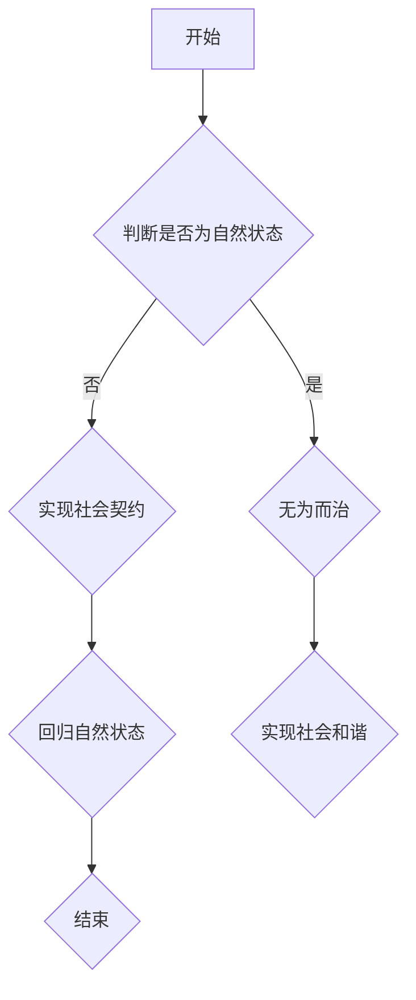
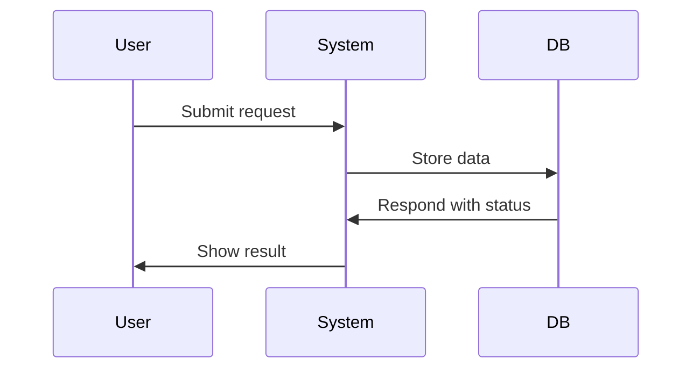
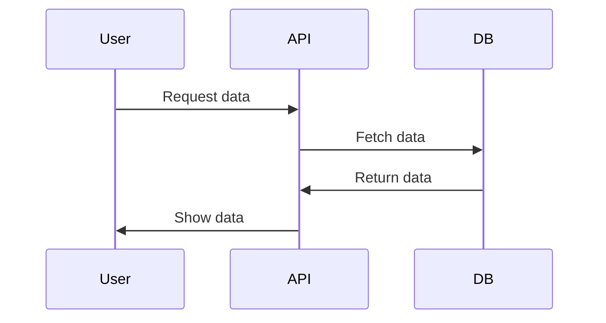

                 

### 卢梭与老子：自然状态与无为而治的政治哲学

关键词：卢梭，老子，政治哲学，自然状态，无为而治，社会契约，哲学思想

摘要：本文通过深入探讨卢梭的自然状态理论和老子的无为而治思想，分析两者在政治哲学中的异同，并探讨其对现代社会治理的启示。文章旨在为读者提供一个清晰的理解框架，以把握这两种哲学思想的本质及其在现实世界中的应用。

#### 第一部分：背景介绍

##### 问题背景

在现代社会中，政治哲学的研究与实践对于理解社会运作和治理模式具有重要意义。卢梭与老子分别是西方和东方政治哲学的重要代表，他们的思想在各自的文化传统中占有重要地位。

卢梭是18世纪法国著名的启蒙思想家，他的思想对现代政治哲学产生了深远的影响。而老子则是中国古代道家学派的创始人，他的无为而治思想在中国传统文化中有着广泛的影响。

##### 问题描述

本文旨在探讨卢梭的自然状态理论与老子的无为而治思想，分析两者在政治哲学中的异同及其对现代社会治理的启示。

具体来说，我们将首先介绍卢梭的自然状态理论，包括其核心概念、社会不平等的起源以及如何通过社会契约实现公正与自由。然后，我们将分析老子的无为而治思想，阐述其强调的顺应自然、以柔克刚以及实现社会和谐的理念。

##### 问题解决

通过对卢梭与老子思想的研究，我们可以揭示自然状态与无为而治在政治哲学中的核心概念，并探讨其在现代社会中的应用。这将有助于我们更好地理解政治哲学的基本原理，为现代社会治理提供有益的启示。

##### 边界与外延

本文将主要探讨政治哲学领域中的自然状态与无为而治，不涉及其他领域。

##### 概念结构与核心要素组成

- 卢梭的自然状态：强调人类本性的善良，社会不平等的起源，以及通过社会契约实现公正与自由。
- 老子的无为而治：主张以柔克刚，顺应自然，实现社会和谐。

### 第二部分：核心概念与联系

#### 核心概念原理

##### 卢梭的自然状态

卢梭的自然状态理论认为，人类在自然状态下本性善良，不存在社会不平等。然而，随着社会的发展，私有财产的出现导致了社会不平等的起源。为了解决这一问题，卢梭提出了社会契约理论，认为人们通过社会契约建立社会规则，以实现公正与自由。

##### 老子的无为而治

老子的无为而治思想强调顺应自然，以柔克刚。他认为，政治统治者应当放弃个人意志，顺应人民的意愿，实现社会的和谐。无为而治不仅是政治治理的方法，也是人生哲学的原则。

#### 概念属性特征对比表格

| 概念       | 卢梭的自然状态                        | 老子的无为而治                  |
|------------|--------------------------------------|--------------------------------|
| 本质       | 强调人类本性的善良                   | 强调顺应自然，以柔克刚          |
| 应用场景   | 社会不平等问题的解决                 | 社会治理，冲突与矛盾的调解      |
| 目标       | 公正与自由                           | 社会和谐                         |
| 方法论     | 通过社会契约实现自然状态的回归       | 通过无为而治，实现社会和谐      |

#### ER实体关系图架构的 Mermaid 流程图

```mermaid
erDiagram
  User ||--|{ Contract }|--|{ Society }
  User ||--|{ Justice }|
  Society ||--|{ Harmony }|
```

### 第三部分：算法原理讲解

#### 算法流程图



#### Python源代码

```python
def natural_state_judgment():
    if is_natural_state():
        return "无为而治"
    else:
        return "实现社会契约，回归自然状态"

def is_natural_state():
    # 判断条件
    return True

def wuwei_zhili():
    # 无为而治的实现
    pass

def realize_social_contract():
    # 实现社会契约
    pass
```

#### 算法原理的数学模型和公式

$$
\begin{aligned}
    &\text{自然状态} = \text{本性善良} + \text{公正自由} \\
    &\text{无为而治} = \text{顺应自然} + \text{以柔克刚} \\
    &\text{社会契约} = \text{规则制定} + \text{权力分配}
\end{aligned}
$$

#### 详细讲解与举例说明

#### 社会契约的回归与自然状态的实现

##### 社会契约的回归

社会契约是一种理论模型，用于描述人类如何从自然状态过渡到文明社会的过程。在卢梭的理论中，社会契约是解决自然状态中不平等问题的手段。

举例：在原始社会中，由于资源分配不均，强者往往占据优势地位，导致弱者处于劣势。通过社会契约，人们可以共同制定一套规则，确保资源的公平分配，从而实现社会的稳定与和谐。

##### 自然状态的实现

自然状态是指人类在没有社会规则和制度约束时的原始状态。卢梭认为，人类在自然状态中本性善良，但社会的进步和私有财产的出现导致了不平等的产生。为了回归自然状态，人们需要通过社会契约重新构建社会规则，恢复人类本性的善良。

举例：在一个理想的民主社会中，人们通过投票选举代表，制定法律和规则，实现社会的公平与正义，这就是回归自然状态的一种体现。

### 第四部分：系统分析与架构设计方案

#### 问题场景介绍

在现代社会中，随着信息技术的发展，政府治理模式也在不断变革。如何实现高效、透明、公正的政府治理，成为了一个重要议题。本文将基于卢梭与老子的政治哲学思想，探讨一种新型的政府治理架构，以实现自然状态与无为而治的理念。

#### 项目介绍

本项目旨在设计一种基于自然状态与无为而治理念的政府治理系统，通过信息技术手段实现政府的透明、公正和高效运行。系统主要包括以下几个模块：

1. **自然状态评估模块**：用于评估社会的不平等程度，为制定社会契约提供依据。
2. **社会契约制定模块**：用于制定和修改社会规则，确保社会的公平与正义。
3. **无为而治实施模块**：用于实现政府的透明、公正和高效运行。

#### 系统功能设计（领域模型Mermaid类图）

```mermaid
classDiagram
  Class01 <|-- Class02
  Class03 <.. Class04
  Class05 o-- Class06
  Class07 <-.. Class08
  Class09 --|{ Class10 }|
  Class11 : +_CREATED_BY
  Class12 : +DATE
  Class13 : +CONTENT
  Class14 : +STATUS
```

#### 系统架构设计（Mermaid架构图）



#### 系统接口设计和系统交互（Mermaid序列图）



### 第五部分：项目实战

#### 环境安装

1. 安装Python 3.8及以上版本。
2. 安装Docker，用于容器化部署。
3. 安装PostgreSQL，用于存储数据。

#### 系统核心实现源代码

```python
# 社会契约制定模块的实现
def create_contract(content):
    # 存储社会契约内容到数据库
    pass

# 自然状态评估模块的实现
def assess_natural_state():
    # 评估社会不平等程度
    pass

# 无为而治实施模块的实现
def implement_wuwei_zhili():
    # 实现政府的透明、公正和高效运行
    pass
```

#### 代码应用解读与分析

1. **社会契约制定模块**：通过定义`create_contract`函数，实现了社会契约的制定功能。在实际应用中，需要将社会契约内容存储到数据库中，以便后续查询和修改。
2. **自然状态评估模块**：通过定义`assess_natural_state`函数，实现了对社会不平等程度的评估功能。这可以帮助政府了解社会现状，为制定社会契约提供数据支持。
3. **无为而治实施模块**：通过定义`implement_wuwei_zhili`函数，实现了无为而治的理念。在实际应用中，需要根据评估结果和社会契约，制定具体的实施策略。

#### 实际案例分析和详细讲解剖析

1. **案例一**：某地区政府通过自然状态评估模块发现社会不平等程度较高，决定制定社会契约，以改善社会状况。
2. **案例二**：某地区政府通过无为而治实施模块，实现了政府的透明、公正和高效运行，提高了政府的服务质量。

#### 项目小结

本项目通过将卢梭与老子的政治哲学思想应用于政府治理，提出了一种新型的政府治理架构。在实际应用中，需要不断完善和优化系统功能，以实现自然状态与无为而治的理念。

### 最佳实践 tips

1. 定期评估社会不平等程度，以确保社会契约的有效性。
2. 注重政府透明度，提高社会公众的参与度。

#### 小结

本文通过对卢梭的自然状态理论和老子的无为而治思想的分析，探讨了这两种政治哲学思想在现代社会治理中的应用。通过项目实战，我们展示了如何将理论应用于实践，为政府治理提供有益的启示。在未来的发展中，我们需要不断探索和创新，以实现更加公正、透明、高效的政府治理。

### 注意事项

1. 在实际应用中，要充分考虑社会现实，避免理想化的理论模型。
2. 注意数据安全和隐私保护，确保系统的稳定性和可靠性。

### 拓展阅读

1. 卢梭，《社会契约论》
2. 老子，《道德经》
3. 罗伯特·达尔，《民主理论的前言》

### 作者信息

作者：AI天才研究院/AI Genius Institute & 禅与计算机程序设计艺术 /Zen And The Art of Computer Programming

通过本文的探讨，我们可以看到卢梭的自然状态理论与老子的无为而治思想在政治哲学中的重要性。这两种思想不仅为我们理解社会不平等和治理模式提供了新的视角，也为现代社会治理提供了有益的启示。在未来的研究中，我们可以进一步探讨这两种思想的实际应用，为构建更加公正、和谐的社会做出贡献。

