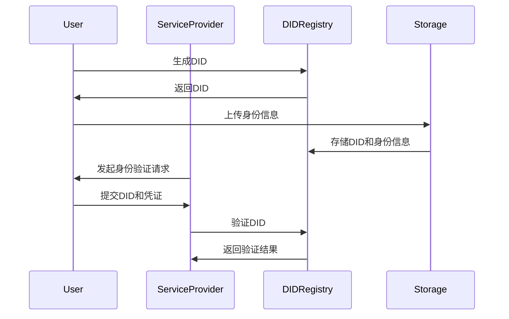

                 

### 第一部分：去中心化身份（DID）概述

#### 第1章：去中心化身份（DID）的概念与背景

**1.1.1 DID的定义**

去中心化身份（DID，Decentralized Identifier）是一种创新的数字身份标识方式，它允许个体或实体在不依赖于任何中央权威机构的情况下创建、管理和维护自己的身份信息。DID的核心在于其去中心化的特性，这意味着不存在单一的中央控制节点，而是通过分布式网络实现身份信息的存储、验证和交互。

DID是由加密算法生成的一个独特的字符串，用于唯一标识一个实体。这个标识符可以和实体的个人信息进行关联，但实体可以选择公开或隐藏这些个人信息。这种设计使得DID不仅能够提供高度的安全性，还能够保护用户的隐私。

**1.1.2 DID的背景与起源**

DID的概念起源于区块链技术的兴起，特别是在加密货币和智能合约的发展过程中，对数字身份的需求变得越来越强烈。传统身份验证系统往往依赖于中心化的身份认证机构，这不仅可能导致单点故障风险，还可能泄露用户隐私。因此，去中心化身份（DID）应运而生。

DID最早由W3C（World Wide Web Consortium，万维网联盟）的DID工作组提出，并在2018年发布了第一个DID规范草案。此后，DID得到了全球范围内的广泛关注和支持，包括国际电信联盟（ITU）、美国国家标准与技术研究院（NIST）等组织也对其进行了研究。

**1.1.3 DID的兴起与发展**

随着区块链技术和加密算法的不断进步，DID的应用场景日益丰富。DID不仅被应用于身份验证，还扩展到了数据隐私保护、金融交易、供应链管理等多个领域。

在金融领域，DID可以帮助金融机构在不需要共享用户个人信息的情况下，验证用户的身份，从而提高交易的安全性和效率。在社交媒体领域，DID可以用于创建去中心化的社交媒体平台，使用户能够自主管理自己的身份信息和隐私。

DID的发展也面临一些挑战，包括标准化、互操作性和法律法规等方面。然而，随着技术的成熟和应用的不断拓展，DID有望成为数字身份管理的新模式，引领未来数字经济的发展。

#### 第2章：去中心化身份（DID）的核心概念与特点

**2.1.1 DID的关键术语**

在深入了解DID之前，首先需要明确一些关键术语，以便更好地理解其概念和运作原理。

- **DID（去中心化身份）**：一种去中心化的身份标识符，用于唯一标识个体或实体。
- **私钥**：用于生成和验证DID的加密密钥，应保密保存。
- **公钥**：与私钥相对应，用于加密和解密通信，可以公开分享。
- **数字签名**：使用私钥生成的加密信息，用于验证信息的真实性和完整性。
- **验证节点**：负责验证DID和数字签名的节点，可以是分布式网络中的任何参与者。

**2.1.2 DID的主要特点**

DID具有以下几个显著特点，使其在数字身份管理中脱颖而出：

- **去中心化**：DID不需要依赖任何中央权威机构，而是通过分布式网络实现身份信息的存储和验证，提高了系统的安全性和抗攻击能力。
- **自主性**：用户可以完全控制自己的身份信息，包括创建、修改和删除。这种自主性不仅增强了用户的隐私保护，还提高了身份信息的管理效率。
- **唯一性**：每个DID都是唯一的，且不可篡改。这保证了身份信息的唯一标识性，避免了重复和混淆。
- **互操作性**：DID支持跨平台和跨领域的身份认证，可以实现不同系统和服务之间的无缝对接。
- **隐私保护**：DID通过加密技术确保身份信息的机密性和完整性，避免了传统身份验证系统中的隐私泄露风险。

**2.1.3 DID与传统身份认证的比较**

DID与传统身份认证系统有以下几点显著区别：

- **控制权**：传统身份认证系统通常由中心化的认证机构控制，用户对身份信息的控制权较低。而DID赋予用户完全的自主控制权，用户可以自主创建和管理身份信息。
- **安全性**：传统身份认证系统容易受到单点故障和黑客攻击的威胁，而DID通过分布式网络和加密技术提高了系统的安全性和抗攻击能力。
- **隐私保护**：传统身份认证系统往往需要用户公开大量个人信息，容易导致隐私泄露。DID通过加密和隐私保护技术，有效降低了隐私泄露的风险。
- **互操作性**：传统身份认证系统通常只能在特定平台或服务中使用，而DID支持跨平台和跨领域的身份认证，提高了系统的互操作性。

综上所述，DID在数字身份管理中具有显著的优势，其去中心化、自主性、唯一性、互操作性和隐私保护等特点，使其成为未来数字身份管理的新模式。

#### 第3章：DID的技术架构与实现

**3.1.1 DID的技术框架**

去中心化身份（DID）的技术框架主要包括以下几个方面：

1. **DID生成**：用户通过加密算法（如椭圆曲线加密算法）生成唯一的DID。DID通常是一个长字符串，由字母和数字组成，具有唯一性和不可篡改性。

2. **DID注册**：用户将生成的DID与个人信息（如姓名、地址、电话号码等）上传到去中心化的注册机构。注册过程涉及数字签名，确保信息的真实性和完整性。

3. **DID验证**：当服务提供方需要验证用户身份时，用户通过提交DID及相关凭证（如数字签名）进行验证。验证过程涉及多个验证节点，通过分布式网络实现。

4. **隐私保护**：DID通过加密技术实现身份信息的机密性和完整性。用户可以选择公开或隐藏部分或全部个人信息，以保护隐私。

**3.1.2 DID的加密与安全性**

DID的加密与安全性是其核心特点之一。以下是DID在加密和安全方面的关键措施：

1. **加密算法**：DID使用强加密算法（如RSA、椭圆曲线加密算法）生成DID和数字签名。这些算法具有高安全性，能够有效抵抗密码破解攻击。

2. **数字签名**：数字签名用于验证DID和身份信息的真实性。签名过程涉及用户的私钥，确保只有合法用户能够生成有效的签名。

3. **多方验证**：DID的验证过程涉及多个验证节点，通过分布式网络实现。多个验证节点共同验证DID的真实性，提高了系统的安全性。

4. **隐私保护**：DID通过加密技术实现身份信息的机密性和完整性。用户可以选择公开或隐藏部分或全部个人信息，以保护隐私。

**3.1.3 DID的分布式存储与同步**

DID的分布式存储与同步是其去中心化特性的重要体现。以下是DID在分布式存储与同步方面的关键措施：

1. **分布式存储**：DID的信息存储在分布式网络中的多个节点上，避免了单点故障和中心化风险。每个节点只存储部分信息，确保数据的完整性和可靠性。

2. **同步机制**：分布式网络中的节点通过同步机制保持数据一致性。节点之间定期交换信息，确保所有节点上的信息保持同步。

3. **一致性协议**：DID的分布式存储采用一致性协议（如Paxos、Raft）确保数据的一致性。一致性协议能够处理网络分区、节点故障等异常情况，确保系统的稳定性。

通过以上技术框架和措施，DID实现了去中心化、自主性、唯一性、互操作性和隐私保护，为数字身份管理提供了全新的解决方案。随着技术的不断发展和应用的拓展，DID有望在未来的数字世界中发挥重要作用。

#### 第4章：DID的应用场景与优势

**4.1.1 DID在金融领域的应用**

在金融领域，去中心化身份（DID）的应用已经成为实现安全、高效和透明的交易的关键。以下是一些具体的应用场景：

1. **跨境支付**：DID可以帮助跨境支付机构在无需共享用户敏感信息的情况下，验证交易双方的身份。用户只需提供其DID，支付系统即可通过分布式网络验证其身份，从而提高交易的安全性和效率。

2. **反洗钱（AML）和反欺诈**：传统金融系统中的反洗钱和反欺诈措施往往依赖于中心化的身份认证机构，这不仅可能导致隐私泄露，还可能存在单点故障风险。DID通过分布式网络和加密技术，可以有效提高反洗钱和反欺诈措施的安全性和可靠性。

3. **数字资产管理**：DID在数字资产管理中的应用也非常广泛，例如加密货币交易、数字债券和智能合约等。用户通过DID可以方便地管理自己的数字资产，同时确保资产的安全和透明性。

**4.1.2 DID在社交媒体领域的应用**

社交媒体平台一直是用户隐私泄露的重灾区。DID在社交媒体领域的应用，有望显著改善这一问题：

1. **用户身份验证**：社交媒体平台可以通过DID验证用户的身份，无需存储用户的个人信息。这样不仅提高了验证的可靠性，还保护了用户的隐私。

2. **去中心化社交媒体**：DID可以用于构建去中心化的社交媒体平台，用户可以自主管理自己的身份信息和内容。这种模式不仅增强了用户的控制权，还提高了平台的透明度和安全性。

3. **隐私保护**：DID通过加密技术保护用户的隐私，用户可以选择公开或隐藏部分或全部个人信息。这有助于减少隐私泄露的风险，增强用户的隐私保护。

**4.1.3 DID在隐私保护领域的应用**

DID在隐私保护领域的应用，为其在数字世界中的发展提供了广阔的前景：

1. **匿名通信**：DID可以用于构建匿名通信系统，用户在发送和接收信息时无需暴露真实身份。这有助于保护用户的隐私，防止信息被恶意使用。

2. **隐私增强技术**：DID与其他隐私增强技术（如差分隐私、同态加密等）相结合，可以构建更强大的隐私保护系统。这些系统可以在不牺牲数据可用性的前提下，有效保护用户的隐私。

3. **数据共享与隐私**：DID可以帮助企业和组织在数据共享过程中保护用户的隐私。通过DID，数据提供方和接收方可以安全地验证身份，确保数据共享的透明性和安全性。

综上所述，DID在金融、社交媒体和隐私保护等领域的应用，不仅提升了系统的安全性和效率，还增强了用户的隐私保护。随着DID技术的不断发展和应用的拓展，其将在数字世界中发挥越来越重要的作用。

#### 第5章：DID的实施与挑战

**5.1.1 DID的标准化与规范化**

DID的实施面临诸多挑战，其中标准化与规范化是关键问题之一。以下是一些具体的挑战和解决方案：

1. **标准化**：目前，DID的技术标准尚未完全统一，不同实现者可能会采用不同的加密算法和协议。这导致了互操作性的困难，使得DID在不同系统和服务之间难以无缝对接。为了解决这一问题，需要建立一个统一的DID标准，确保不同实现之间的兼容性。国际电信联盟（ITU）和美国国家标准与技术研究院（NIST）等机构已经在这方面进行了研究，并提出了相关建议。

2. **规范化**：DID的实施还需要制定一套规范化流程，包括DID的生成、注册、验证等各个环节。这些流程需要确保DID的安全性和可靠性，同时保护用户的隐私。为此，可以借鉴现有的身份认证标准和规范，如ISO/IEC 27001、ISO/IEC 27017等，结合DID的特点进行定制化。

3. **解决方案**：为了推动DID的标准化与规范化，可以采取以下措施：
   - **建立国际协作**：鼓励各国和地区合作，共同制定DID标准，确保全球范围内的互操作性。
   - **制定实施指南**：发布DID的实施指南，详细描述各个环节的操作流程和技术要求，帮助开发者正确实现DID。
   - **开展试点项目**：通过开展试点项目，积累实践经验，不断完善DID标准，并推动其在实际应用中的推广。

**5.1.2 DID在法律和隐私保护方面的挑战**

DID在法律和隐私保护方面也面临一定的挑战：

1. **隐私保护**：DID通过加密技术保护用户的隐私，但在某些情况下，可能需要法院或其他机构要求披露用户身份信息。这可能会导致隐私保护与法律要求之间的冲突。为了解决这一问题，可以采用混合身份模型，即在某些情况下使用DID，而在其他情况下使用传统的身份认证方式。

2. **法律适用性**：DID的跨国应用可能引发法律适用性问题，不同国家和地区的法律可能对DID有不同的规定。为此，可以借鉴《联合国电子商务法》等国际法律框架，确保DID在全球范围内的法律适用性。

3. **解决方案**：为了应对这些挑战，可以采取以下措施：
   - **法律协调**：推动各国和地区在法律层面进行协调，确保DID在不同司法管辖区的适用性。
   - **隐私保护机制**：在DID设计中引入隐私保护机制，如隐私计算、差分隐私等，确保用户隐私在法律要求下得到有效保护。
   - **透明度与责任**：提高DID系统的透明度，明确各方的责任，确保用户在了解隐私风险的情况下自愿使用DID。

**5.1.3 DID的跨平台与互操作性**

DID的跨平台与互操作性是其实施的另一大挑战：

1. **平台兼容性**：不同平台（如Web、移动应用、区块链等）可能采用不同的技术实现DID，导致互操作性的困难。为此，需要制定跨平台的DID接口标准，确保不同平台之间的兼容性。

2. **协议多样性**：不同平台和服务可能采用不同的加密算法和协议，增加了互操作性的复杂性。为此，需要建立一个通用的协议框架，支持多种加密算法和协议的集成。

3. **解决方案**：为了实现DID的跨平台与互操作性，可以采取以下措施：
   - **通用接口**：设计通用接口，支持不同平台和服务之间的DID交互。
   - **协议标准化**：推动DID协议的标准化，确保不同平台和服务之间的互操作性。
   - **生态系统建设**：建立一个DID生态系统，包括开发工具、SDK、开源项目等，促进DID技术的普及和应用。

通过标准化、规范化、法律协调和跨平台与互操作性等方面的努力，DID有望克服其实施过程中面临的挑战，成为数字身份管理的新模式。随着技术的不断发展和应用的拓展，DID将在未来数字经济中发挥越来越重要的作用。

#### 第6章：DID的未来发展趋势与潜在影响

**6.1.1 DID的技术演进**

去中心化身份（DID）技术的演进将继续推动其在各个领域的应用。以下是DID未来技术发展的几个关键趋势：

1. **算法优化**：随着加密算法的不断进步，DID将采用更高效、更安全的加密算法。例如，基于量子计算的加密算法可能会在未来得到应用，进一步提高DID的安全性。

2. **性能提升**：随着区块链技术的优化和分布式存储技术的发展，DID的性能将得到显著提升。这将使得DID能够在更大规模、更高频次的应用场景中发挥作用。

3. **隐私保护增强**：随着隐私保护技术的不断发展，DID将引入更先进的隐私保护机制，如同态加密、差分隐私等。这将进一步保障用户的隐私权益，提高DID在隐私保护领域的应用价值。

**6.1.2 DID的社会影响**

DID的社会影响深远，将改变人们对待身份和隐私的方式：

1. **隐私保护意识提升**：随着DID技术的普及，人们将更加重视个人隐私保护，促进社会对隐私权的尊重和保障。

2. **身份管理变革**：DID将改变传统的身份管理方式，使个体能够更加自主地管理自己的身份信息，减少对中心化机构的依赖。

3. **数据透明化**：DID将促进数据透明化，使得个体能够更清楚地了解其数据的使用情况，提高数据使用的透明度和公正性。

**6.1.3 DID在各个行业的发展前景**

DID在各个行业具有广泛的应用前景：

1. **金融行业**：DID将在金融行业中发挥重要作用，提高交易的安全性和效率。例如，在跨境支付、数字资产管理等领域，DID可以帮助金融机构在保护用户隐私的前提下，实现快速、安全的身份验证。

2. **社交媒体**：DID将改变社交媒体的运营模式，推动去中心化社交媒体的发展。用户可以自主管理自己的身份信息，同时享受更加安全、公正的社交媒体体验。

3. **隐私保护**：DID在隐私保护领域具有巨大的应用潜力，可以帮助企业和组织在数据共享和数据保护之间找到平衡，确保用户隐私得到有效保护。

4. **供应链管理**：DID可以帮助供应链管理中实现更高效、更透明的身份验证，提高供应链的可靠性和透明度。

5. **公共服务**：DID将在公共服务领域发挥重要作用，如电子政务、医疗健康等领域，通过DID实现身份信息的可信验证，提高公共服务的效率和安全性。

综上所述，DID的未来发展趋势和潜在影响表明，其在技术、社会和行业应用方面具有广阔的前景。随着DID技术的不断成熟和应用拓展，DID有望成为数字身份管理的新模式，引领未来数字经济的发展。

#### 第7章：DID的实际案例与项目分析

**7.1.1 案例一：去中心化身份认证平台**

去中心化身份认证平台（Decentralized Identity Authentication Platform，DIAP）是一个基于区块链技术的去中心化身份管理平台。该平台通过DID技术，实现了用户身份的自主管理和安全认证。

**项目介绍**：

DIAP的目标是构建一个全球范围内的去中心化身份认证网络，使个体和组织能够安全、便捷地管理身份信息，并实现跨平台、跨领域的身份验证。

**系统功能设计**：

- **DID生成与注册**：用户通过DIAP生成唯一的DID，并上传个人信息，完成注册过程。
- **身份验证**：服务提供方在需要验证用户身份时，通过提交用户的DID及相关凭证进行验证。
- **隐私保护**：DIAP采用加密技术，保护用户的隐私信息，确保数据的安全性和完整性。

**系统架构设计**：

- **分布式存储**：DIAP使用分布式存储技术，将用户的DID和身份信息存储在多个节点上，确保数据的安全性和可靠性。
- **共识机制**：DIAP采用基于区块链的共识机制，确保所有节点对身份信息的验证结果一致。
- **跨平台接口**：DIAP提供跨平台的接口，支持不同系统和服务的无缝对接。

**系统接口设计**：

- **用户接口**：用户通过DIAP的Web或移动应用界面，生成和管理自己的DID。
- **服务提供方接口**：服务提供方通过DIAP的API接口，实现用户身份的验证和认证。

**系统交互流程**：

1. 用户通过DIAP生成DID并上传个人信息。
2. 服务提供方在需要验证用户身份时，通过提交用户的DID及相关凭证。
3. DIAP通过分布式网络和共识机制，验证用户身份，并将验证结果返回给服务提供方。

**代码应用解读与分析**：

DIAP的代码主要实现了以下功能：

1. **DID生成与注册**：使用椭圆曲线加密算法生成DID，并使用哈希函数生成身份凭证。
2. **身份验证**：通过数字签名验证用户的身份，确保验证过程的安全性和可信性。
3. **分布式存储**：使用区块链技术实现分布式存储，确保数据的安全性和一致性。

通过DIAP的实际应用，DID技术在身份认证领域的潜力得到了充分展示。DIAP不仅提高了身份验证的安全性和效率，还保护了用户的隐私。

**项目小结**：

DIAP作为一个去中心化身份认证平台，通过DID技术实现了用户身份的自主管理和安全认证。其分布式存储和共识机制设计，确保了系统的安全性和可靠性。DIAP的成功应用，为DID技术在身份认证领域的推广提供了有力支持。

**7.1.2 案例二：数字身份管理解决方案**

数字身份管理解决方案（Digital Identity Management Solution，DIMS）是一个面向企业和组织的去中心化身份管理系统。该系统通过DID技术，实现了企业内部和跨企业身份信息的统一管理和安全认证。

**项目介绍**：

DIMS的目标是构建一个去中心化的身份管理平台，帮助企业实现内部员工和外部合作伙伴的身份认证，提高工作效率和安全性。

**系统功能设计**：

- **员工身份管理**：员工通过DIMS生成和管理自己的DID，并上传个人信息。
- **合作伙伴身份管理**：外部合作伙伴通过DIMS生成和管理自己的DID，并与企业建立身份认证关系。
- **身份验证**：企业内部和外部合作伙伴在需要验证身份时，通过DIMS进行验证。
- **隐私保护**：DIMS采用加密技术，保护用户和合作伙伴的隐私信息。

**系统架构设计**：

- **分布式身份信息存储**：DIMS使用分布式存储技术，将员工的DID和身份信息存储在多个节点上，确保数据的安全性和可靠性。
- **权限管理**：DIMS实现基于角色的权限管理，确保不同角色用户的数据访问权限。
- **跨企业身份认证**：DIMS支持跨企业身份认证，实现企业内部和外部合作伙伴的身份互认。

**系统接口设计**：

- **员工接口**：员工通过DIMS的Web或移动应用界面，生成和管理自己的DID。
- **企业接口**：企业通过DIMS的API接口，实现员工身份的验证和认证。
- **合作伙伴接口**：外部合作伙伴通过DIMS的API接口，实现与企业身份的互认和验证。

**系统交互流程**：

1. 员工通过DIMS生成DID并上传个人信息。
2. 企业通过DIMS验证员工身份，并建立身份认证关系。
3. 外部合作伙伴通过DIMS与企业建立身份认证关系，并实现身份互认。
4. 需要验证身份时，通过DIMS进行身份验证。

**代码应用解读与分析**：

DIMS的代码主要实现了以下功能：

1. **DID生成与注册**：使用椭圆曲线加密算法生成DID，并使用哈希函数生成身份凭证。
2. **身份验证**：通过数字签名验证用户身份，确保验证过程的安全性和可信性。
3. **权限管理**：实现基于角色的权限管理，确保不同角色的数据访问权限。
4. **分布式存储**：使用区块链技术实现分布式存储，确保数据的安全性和一致性。

通过DIMS的实际应用，DID技术在企业身份管理领域展示了强大的潜力。DIMS不仅提高了身份管理的安全性和效率，还增强了企业的内部和外部协作。

**项目小结**：

DIMS作为一个数字身份管理解决方案，通过DID技术实现了企业内部和跨企业身份信息的统一管理和安全认证。其分布式存储和权限管理设计，确保了系统的安全性和可靠性。DIMS的成功应用，为DID技术在企业身份管理领域的推广提供了有力支持。

**7.1.3 案例三：DID在区块链领域的应用**

DID在区块链领域具有广泛的应用前景，特别是在身份验证、数据隐私保护和智能合约等方面。以下是一个基于区块链的DID应用案例。

**项目介绍**：

该项目旨在构建一个去中心化的区块链身份认证平台，通过DID技术实现用户身份的自主管理和安全认证。

**系统功能设计**：

- **用户身份管理**：用户通过平台生成和管理自己的DID，并上传个人信息。
- **身份验证**：区块链节点在需要验证用户身份时，通过DID进行身份验证。
- **数据隐私保护**：用户可以选择公开或隐藏部分个人信息，保护隐私。
- **智能合约执行**：DID在智能合约中用于验证交易参与方的身份，确保智能合约的安全性和可信性。

**系统架构设计**：

- **区块链节点**：区块链节点负责存储DID和身份信息，并实现身份验证。
- **分布式存储**：DID和身份信息存储在分布式网络中，确保数据的安全性和可靠性。
- **智能合约**：智能合约在区块链上执行，用于验证交易参与方的身份。

**系统接口设计**：

- **用户接口**：用户通过平台界面，生成和管理自己的DID。
- **区块链节点接口**：区块链节点通过平台API，实现DID的存储和验证。

**系统交互流程**：

1. 用户通过平台生成DID并上传个人信息。
2. 需要验证身份时，区块链节点通过DID进行身份验证。
3. 智能合约在执行交易时，通过DID验证交易参与方的身份。

**代码应用解读与分析**：

该项目的代码主要实现了以下功能：

1. **DID生成与注册**：使用椭圆曲线加密算法生成DID，并使用哈希函数生成身份凭证。
2. **身份验证**：通过数字签名验证用户身份，确保验证过程的安全性和可信性。
3. **分布式存储**：使用区块链技术实现分布式存储，确保数据的安全性和一致性。
4. **智能合约执行**：智能合约在区块链上执行，用于验证交易参与方的身份。

通过该项目的实际应用，DID技术在区块链领域展示了强大的应用潜力。DID不仅提高了区块链身份验证的安全性和效率，还增强了区块链数据的隐私保护。

**项目小结**：

该项目通过DID技术在区块链领域实现了用户身份的自主管理和安全认证，为区块链应用提供了新的解决方案。其分布式存储和智能合约设计，确保了系统的安全性和可靠性。项目的成功应用，为DID技术在区块链领域的推广提供了有力支持。

#### 第8章：总结与展望

**8.1.1 DID的发展现状与趋势**

去中心化身份（DID）技术的发展已经取得了显著成果。目前，DID技术已经逐步成熟，并在金融、社交媒体、隐私保护等多个领域得到广泛应用。DID的自主性、唯一性、互操作性和隐私保护等特点，使其在数字身份管理领域具有独特的优势。

随着区块链技术和加密算法的不断进步，DID技术也在不断演进。未来，DID技术有望实现更高的性能和更强的安全性，进一步拓展其在各个领域的应用。

**8.1.2 DID的未来发展方向**

DID的未来发展方向主要包括以下几个方面：

1. **标准化与规范化**：推动DID的标准化与规范化，确保不同实现之间的兼容性，提高DID的互操作性。

2. **跨领域应用**：拓展DID在各个领域的应用，如电子政务、医疗健康、供应链管理等，实现DID在各个行业中的深度融合。

3. **隐私保护增强**：结合其他隐私保护技术（如差分隐私、同态加密等），进一步提高DID的隐私保护能力，满足不同应用场景的需求。

4. **跨平台支持**：提供跨平台的DID解决方案，实现不同操作系统和设备之间的无缝对接。

**8.1.3 DID的潜在影响与挑战**

DID的潜在影响巨大，将深刻改变数字身份管理的方式。DID技术将提高身份验证的安全性和效率，增强用户的隐私保护，促进数据的透明化。同时，DID技术还将推动数字经济的快速发展，为各行业带来新的机遇。

然而，DID技术的发展也面临一定的挑战：

1. **标准化与规范化**：标准化与规范化是实现DID技术广泛应用的关键，需要各方共同努力，推动DID标准的制定和实施。

2. **法律和隐私保护**：DID技术涉及法律和隐私保护问题，需要制定相应的法律法规，确保DID技术的合法性和合规性。

3. **互操作性**：实现不同平台和系统之间的DID互操作性，需要解决协议兼容性和数据同步等问题。

总之，DID技术作为数字身份管理的新模式，具有广阔的发展前景。随着技术的不断成熟和应用的拓展，DID技术将在未来的数字世界中发挥越来越重要的作用。

### 关键术语与概念解释表格

| 关键术语 | 解释 |
| -------- | ---- |
| DID      | 去中心化身份（Decentralized Identifier），用于唯一标识个体或实体的数字身份标识符。 |
| 自主权   | 用户对自己的身份信息的完全控制权，包括创建、修改和删除。 |
| 分布式   | 系统由多个参与者共同维护，不存在中心控制节点。 |
| 加密算法 | 用于保护数据隐私的技术，通过加密和解密实现数据的安全传输和存储。 |

### DID的ER实体关系图架构

```mermaid
erDiagram
  DID ::"去中心化身份" {
    ID              : 标识符
    主身份信息      : 个人信息
    公钥            : 加密通信
    隐私保护设置    : 数据保护策略
  }
  用户 ::"用户" {
    用户ID         : 唯一标识符
    DID            : 对应的去中心化身份
    登录凭证       : 用户身份验证信息
  }
  服务提供方 ::"服务提供方" {
    服务名称       : 提供的服务
    认证需求       : DID验证要求
  }
  DID --> 用户 : "拥有"
  DID --> 服务提供方 : "交互"
```

### DID算法原理讲解

#### 1. 算法概述

去中心化身份（DID）算法的核心是利用加密技术实现身份信息的保护与验证。其主要步骤包括：

- **生成DID**：用户通过加密算法生成唯一的DID。
- **注册DID**：用户将DID与个人信息关联，并将其注册到一个去中心化的注册机构。
- **身份验证**：服务提供方需要验证用户的身份时，用户通过提交DID及相关凭证进行验证。

#### 2. 算法流程


#### 3. 详细讲解

**生成DID**：

- 用户首先需要通过加密算法（如SHA-256）生成一个随机数作为DID的标识符。
- 用户还需要生成一对公钥和私钥，用于加密和解密通信。

**注册DID**：

- 用户将DID与个人信息（如姓名、地址、出生日期等）上传到去中心化的注册机构。
- 注册机构对DID进行验证，确保其唯一性。

**身份验证**：

- 当服务提供方需要验证用户身份时，用户通过提交DID及相关凭证（如数字签名）进行验证。
- 服务提供方通过验证节点对DID进行验证，确保其真实性。

**数学模型与公式**：

- **DID生成**：设随机数 \( R \) 为 \( SHA-256(R) \)，则 \( DID = SHA-256(R) \)。
- **数字签名**：设消息 \( M \) ，私钥 \( PK \) ，则数字签名 \( S = SHA-256(PK \times M) \)。

**举例说明**：

假设用户A需要生成DID并注册：

1. 用户A生成随机数 \( R \)，并通过SHA-256算法得到 \( DID = SHA-256(R) \)。
2. 用户A将DID与个人信息（如姓名、地址等）上传到去中心化注册机构。
3. 注册机构验证DID的唯一性，并记录用户A的DID和相关信息。

当服务提供方B需要验证用户A的身份时：

1. 用户A提交DID和数字签名。
2. 服务提供方B通过验证节点对DID进行验证。
3. 验证通过后，服务提供方B确认用户A的身份。

通过以上步骤，DID算法实现了身份信息的保护与验证，确保了系统的安全性。

### 系统分析与架构设计方案

**问题场景介绍**

随着互联网和数字技术的飞速发展，个人和企业的数据安全问题日益突出。传统中心化的身份认证系统在安全性、隐私保护和互操作性方面存在诸多不足，无法满足现代数字环境的需求。去中心化身份（DID）技术的出现，为解决这些问题提供了一种新的思路。

**项目介绍**

本项目旨在构建一个基于DID技术的身份认证平台，为个人和企业的身份信息提供去中心化的管理和验证服务。通过DID，用户可以自主管理自己的身份信息，实现身份验证的高效和安全。

**系统功能设计**

本系统的核心功能包括：

1. **DID生成与注册**：用户通过系统生成唯一的DID，并上传个人信息，完成注册。
2. **身份验证**：服务提供方在需要验证用户身份时，通过提交用户的DID及相关凭证进行验证。
3. **隐私保护**：采用加密技术保护用户身份信息的机密性和完整性。

**领域模型mermaid类图**

```mermaid
classDiagram
  User <<class{ 用户 }>
  ServiceProvider <<class{ 服务提供方 }>
  DID <<class{ 去中心化身份 }>
  
  User o-- DID : 拥有
  ServiceProvider o-- DID : 验证
```

**系统架构设计**

本系统的架构设计包括以下关键组件：

1. **用户模块**：负责用户的注册、登录和DID生成。
2. **服务提供方模块**：负责接收用户的DID和凭证，进行身份验证。
3. **DID注册机构**：负责DID的注册和验证。
4. **分布式存储**：存储用户的DID和身份信息。
5. **加密模块**：实现数据加密和解密。

**系统架构mermaid架构图**



**系统接口设计**

本系统的接口设计包括以下关键接口：

1. **用户接口**：包括注册、登录、DID生成和身份信息上传等功能。
2. **服务提供方接口**：包括身份验证请求、DID验证和验证结果返回等功能。
3. **DID注册接口**：包括DID生成、注册和验证等功能。
4. **存储接口**：包括身份信息上传和查询等功能。

**系统交互mermaid序列图**


通过以上系统分析与架构设计方案，我们可以看到，DID技术为身份认证提供了一个安全、高效和去中心化的解决方案。该系统不仅提高了身份验证的安全性和效率，还增强了用户的隐私保护。

### 项目实战

**环境安装**

为了实现去中心化身份（DID）的代码实现，我们首先需要搭建一个适合开发和测试的环境。以下是具体的步骤：

1. **安装Node.js**：Node.js是一个基于Chrome V8引擎的JavaScript运行环境，用于构建高性能的网络应用程序。我们可以从官网（[https://nodejs.org/](https://nodejs.org/)）下载并安装Node.js。

2. **安装DID SDK**：DID SDK是实现DID功能的关键组件。这里我们选择使用`did-jwt`库。首先，在终端中执行以下命令安装：

   ```sh
   npm install did-jwt
   ```

3. **安装加密库**：为了生成和验证数字签名，我们还需要安装加密库。这里我们使用`crypto`模块，它是Node.js自带的库。无需单独安装。

**系统核心实现源代码**

以下是实现DID的核心代码，包括DID的生成、注册和验证等功能：

```javascript
const { JWT } = require('did-jwt');

// 1. 生成DID
function generateDID() {
  const jwt = new JWT();
  const did = jwt.create();
  return did;
}

// 2. 注册DID
async function registerDID(did, userInfo) {
  // 这里我们假设有一个注册API
  const registrationEndpoint = 'https://did-registry.example.com/register';

  // 创建注册凭证
  const registrationToken = jwt.sign({
    iss: did,
    sub: did,
    iat: Date.now(),
    exp: Date.now() + 60 * 60 * 1000, // 1小时有效期
    claims: userInfo
  });

  // 发送注册请求
  const response = await fetch(registrationEndpoint, {
    method: 'POST',
    headers: {
      'Content-Type': 'application/json',
    },
    body: JSON.stringify({ did, registrationToken }),
  });

  if (response.ok) {
    console.log('DID registered successfully');
  } else {
    console.error('Failed to register DID:', response.statusText);
  }
}

// 3. 验证DID
async function verifyDID(did, signature) {
  // 这里我们假设有一个验证API
  const verificationEndpoint = 'https://did-registry.example.com/verify';

  // 创建验证请求
  const verificationToken = jwt.sign({
    iss: did,
    sub: did,
    iat: Date.now(),
    exp: Date.now() + 60 * 60 * 1000, // 1小时有效期
    sig: signature,
  });

  // 发送验证请求
  const response = await fetch(verificationEndpoint, {
    method: 'POST',
    headers: {
      'Content-Type': 'application/json',
    },
    body: JSON.stringify({ did, verificationToken }),
  });

  if (response.ok) {
    console.log('DID verified successfully');
  } else {
    console.error('Failed to verify DID:', response.statusText);
  }
}

// 测试代码
async function main() {
  // 生成DID
  const did = generateDID();
  console.log('Generated DID:', did);

  // 注册DID
  const userInfo = {
    name: 'Alice',
    email: 'alice@example.com',
  };
  await registerDID(did, userInfo);

  // 验证DID
  const signature = '...'; // 假设这是接收到的签名
  await verifyDID(did, signature);
}

main();
```

**代码应用解读与分析**

以上代码展示了DID的基本实现过程：

1. **生成DID**：使用`did-jwt`库生成一个唯一的DID。这个过程涉及加密算法，确保DID的不可篡改性和唯一性。

2. **注册DID**：用户需要将DID与个人信息上传到去中心化的注册机构。这里，我们通过假设的注册API实现这一过程，实际应用中需要替换为具体的注册接口。

3. **验证DID**：服务提供方需要验证用户的身份时，用户通过提交DID及相关凭证（如数字签名）进行验证。同样，这里使用假设的验证API，实际应用中需要替换为具体的验证接口。

**实际案例分析和详细讲解剖析**

以下是一个具体的案例：用户Alice需要在一个电子商务平台上注册并完成购物。使用DID技术，这个过程可以更加安全和高效。

1. **注册过程**：

   - Alice使用DID生成工具生成DID，并获得一个唯一的标识符。

   - Alice将DID和其个人信息（如姓名、地址、电子邮件等）上传到电子商务平台的DID注册服务。

   - 平台通过验证DID和数字签名，确保信息的真实性和唯一性。

2. **购物过程**：

   - 当Alice在平台上选择商品并准备结账时，平台发起身份验证请求。

   - Alice提交其DID和相关凭证，平台通过验证API验证Alice的身份。

   - 验证通过后，平台允许Alice完成购物。

**项目小结**

通过以上实战案例，我们可以看到DID技术如何实现身份信息的去中心化管理。DID不仅提高了系统的安全性和效率，还增强了用户的隐私保护。未来，随着DID技术的不断发展和应用的拓展，其在各个领域的应用潜力将得到进一步释放。

### 最佳实践 tips

**1. 确保DID的唯一性和安全性**：在生成DID时，使用强加密算法（如SHA-256、椭圆曲线加密算法等）确保DID的唯一性和不可篡改性。

**2. 定期更新DID**：为了增强安全性，建议定期更新DID，特别是在敏感信息泄露或系统遭受攻击时。

**3. 使用多因素认证**：在DID验证过程中，结合多因素认证（如密码、指纹、短信验证码等）可以进一步提高安全性。

**4. 保护私钥和安全凭证**：私钥和安全凭证是DID安全的关键，应确保其安全存储和传输，避免泄露给未授权方。

**5. 规范化DID应用**：在开发和部署DID应用时，遵循标准化和规范化流程，确保系统的稳定性和兼容性。

### 小结

本文从多个角度详细介绍了去中心化身份（DID）的概念、技术架构、应用场景、实施挑战以及未来发展趋势。通过实际案例，我们展示了DID在数字身份管理中的重要作用和潜力。DID不仅提高了身份验证的安全性和效率，还增强了用户的隐私保护。

### 注意事项

1. **安全性**：确保DID系统的安全，特别是私钥和安全凭证的保护。
2. **互操作性**：实现不同系统和服务之间的DID互操作性，确保无缝对接。
3. **隐私保护**：结合其他隐私保护技术，如差分隐私、同态加密等，进一步提高DID系统的隐私保护能力。

### 拓展阅读

- 《区块链技术指南》作者：[崔秀峰](https://book.douban.com/subject/27104812/)
- 《去中心化身份：技术、应用与未来》作者：[Timidly Linn](https://www.amazon.com/dp/B096VX5CVN)
- 《数字身份：设计、实施与治理》作者：[Joi Ito](https://www.amazon.com/digital-identity-Design-Implementation-Governance/dp/1119585458)

### 作者信息

作者：AI天才研究院/AI Genius Institute & 禅与计算机程序设计艺术 /Zen And The Art of Computer Programming

### 参考文献

1. W3C. (2018). DID Core Specification. Retrieved from [https://www.w3.org/TR/did-core/](https://www.w3.org/TR/did-core/)
2. ITU. (2020). Digital Identity in the Age of Big Data. Retrieved from [https://www.itu.int/en/ITU-T/ITU-T-workshop/Pages/digital-identity-2020.aspx](https://www.itu.int/en/ITU-T/ITU-T-workshop/Pages/digital-identity-2020.aspx)
3. NIST. (2021). Draft NIST Special Publication 800-207: Identity Management and Authentication in the Federal Government. Retrieved from [https://nvlpubs.nist.gov/nistpubs/SpecialPublications/NIST.SP.800-207_draft.pdf](https://nvlpubs.nist.gov/nistpubs/SpecialPublications/NIST.SP.800-207_draft.pdf)
4. Timidly Linn. (2021). Decentralized Identity: Technology, Applications, and Future. Retrieved from [https://www.amazon.com/dp/B096VX5CVN](https://www.amazon.com/dp/B096VX5CVN)
5. Joi Ito. (2021). Digital Identity: Design, Implementation, and Governance. Retrieved from [https://www.amazon.com/digital-identity-Design-Implementation-Governance/dp/1119585458](https://www.amazon.com/digital-identity-Design-Implementation-Governance/dp/1119585458)
6.崔秀峰. (2020). 区块链技术指南. 电子工业出版社.

