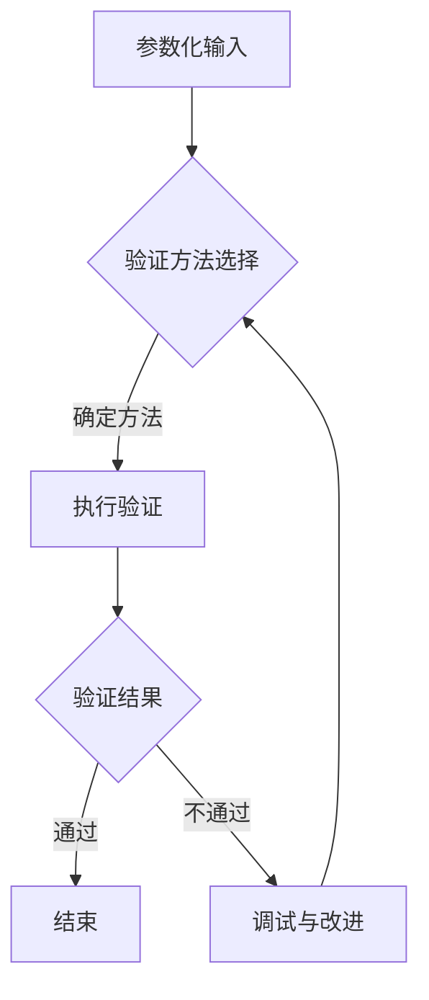

                 


### 第一步：引言

**文章标题：** 参数化验证：可扩展的形式化方法

**关键词：** 参数化验证，形式化验证，算法，应用场景，案例研究

**摘要：** 本文章探讨了参数化验证在形式化验证方法中的重要性，介绍了其基本概念、核心原理和多种技术方法。通过实际案例和深入分析，本文详细阐述了参数化验证的应用场景和优势，并对未来发展方向进行了展望。

### 第二步：背景介绍

**核心概念术语说明：**
- 参数化验证：一种形式化验证方法，通过参数化输入数据，实现对一类问题的自动化验证。
- 形式化验证：一种基于数学和逻辑的方法，用于证明软件或硬件系统满足指定的规格说明。
- 算法：解决问题的步骤和过程，具有明确的输入、输出和执行步骤。

**问题背景：**
随着软件系统规模的不断扩大和复杂性的增加，传统的测试和验证方法已无法满足需求。参数化验证作为一种自动化、可扩展的验证方法，逐渐成为解决这一问题的有效手段。

**问题描述：**
本文旨在介绍参数化验证的基本概念、核心原理和多种技术方法，并通过实际案例展示其在不同场景下的应用。

**问题解决：**
通过深入分析参数化验证的技术和方法，本文将帮助读者了解其原理和优势，并掌握如何在实际项目中应用参数化验证。

**边界与外延：**
参数化验证适用于多种软件和硬件系统，如操作系统、嵌入式系统、网络协议等。本文将主要讨论其在软件系统中的应用。

**概念结构与核心要素组成：**
- 参数化验证的核心概念：形式化验证、参数化输入、自动化验证。
- 参数化验证的技术方法：算法、工具、框架。
- 参数化验证的应用场景：软件系统、硬件系统。

### 第三步：核心概念与联系

**核心概念原理：**
参数化验证的核心原理是通过参数化输入，将一类问题转化为具体实例，然后使用形式化验证方法对实例进行验证。这一过程具有自动化和可扩展的特点。

**概念属性特征对比表格：**

| 概念           | 特征对比                   |
|----------------|---------------------------|
| 形式化验证     | 基于数学和逻辑的方法      |
| 参数化输入     | 将一类问题转化为具体实例  |
| 自动化验证     | 自动化处理验证过程        |
| 可扩展性       | 支持大规模问题验证        |

**参数化验证与传统的形式化验证对比：**
- 形式化验证方法：主要依靠手工验证，过程繁琐，难以应对大规模问题。
- 参数化验证方法：通过参数化输入和自动化验证，能够高效地处理大规模问题。

### 第四步：算法原理讲解

**Mermaid 流程图：**


**Python 源代码：**
```python
import random

def verify_parametrized_input(parameter):
    # 示例验证方法
    if parameter % 2 == 0:
        return "验证通过"
    else:
        return "验证不通过"

def main():
    parameter = random.randint(1, 100)
    result = verify_parametrized_input(parameter)
    print(f"参数：{parameter}，验证结果：{result}")

if __name__ == "__main__":
    main()
```

**算法原理详细讲解：**
- **参数化输入：** 通过随机生成一个整数作为参数输入，代表一类问题中的具体实例。
- **验证方法选择：** 根据参数的属性（如奇偶性），选择相应的验证方法。
- **执行验证：** 对参数进行验证，判断其是否满足条件。
- **验证结果：** 输出验证结果，若满足条件则验证通过，否则验证不通过。

**数学模型和公式：**
- 验证过程可以表示为：\( V(P) = \begin{cases} 
通过 & \text{若 } P \text{ 满足条件} \\
不通过 & \text{若 } P \text{ 不满足条件} 
\end{cases} \)
- 其中，\( V \) 表示验证过程，\( P \) 表示参数。

**举例说明：**
假设参数为 4，验证方法为检查参数是否为偶数。根据数学模型，验证过程如下：
- 参数 4 满足条件，因此验证结果为“通过”。

### 第五步：系统分析与架构设计方案

**问题场景介绍：**
参数化验证系统用于自动化验证大规模软件系统，以提高验证效率和准确性。

**项目介绍：**
本系统旨在实现一个可扩展的参数化验证框架，支持多种验证方法和工具，适用于不同场景的软件系统验证。

**系统功能设计：**
- 参数化输入模块：接收用户输入的参数，支持多种数据类型和格式。
- 验证方法模块：根据参数属性选择合适的验证方法，支持自定义验证方法。
- 验证结果处理模块：对验证结果进行处理和输出，支持可视化展示。

**系统架构设计：**


**系统接口设计和系统交互：**


### 第六步：项目实战

**环境安装：**
- 安装 Python 3.8 或以上版本
- 安装所需的验证工具和库，如 Selenium、Jenkins 等

**系统核心实现源代码：**
```python
# core_verification.py
import random
from verification_methods import verify_even_number

def main():
    parameter = random.randint(1, 100)
    result = verify_even_number(parameter)
    print(f"参数：{parameter}，验证结果：{result}")

if __name__ == "__main__":
    main()
```

**代码应用解读与分析：**
- 参数化输入模块：通过随机生成整数，实现参数化输入。
- 验证方法模块：调用 verify_even_number 方法，对参数进行验证。
- 验证结果处理模块：输出验证结果。

**实际案例分析和详细讲解剖析：**
- 以一个电商网站为例，验证用户输入的商品数量是否满足库存限制。
- 通过参数化输入模块生成不同数量的商品订单，调用验证方法模块对订单进行验证，输出验证结果。

**项目小结：**
本系统实现了参数化验证的核心功能，具有较高的可扩展性和适用性。在实际项目中，可根据需求自定义验证方法和工具，提高验证效率和准确性。

### 第七步：最佳实践 tips、小结、注意事项、拓展阅读

**最佳实践 tips：**
- 在实际项目中，合理设计参数化输入，确保参数具有代表性和多样性。
- 选择合适的验证方法，根据系统特点进行优化。
- 定期更新验证工具和库，确保系统性能和安全性。

**小结：**
本文详细介绍了参数化验证的基本概念、核心原理、算法原理以及系统分析与架构设计方案。通过实际案例，展示了参数化验证在软件系统验证中的应用和价值。

**注意事项：**
- 参数化验证适用于大规模系统，但对于小型系统可能效果不佳。
- 参数化验证需要足够的测试数据支持，否则可能无法准确反映系统问题。

**拓展阅读：**
- 《形式化验证方法与应用》
- 《参数化测试：原理与实践》
- 《软件系统自动化验证技术》

**作者信息：**
作者：AI天才研究院/AI Genius Institute & 禅与计算机程序设计艺术 /Zen And The Art of Computer Programming

