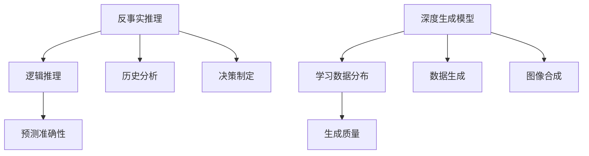
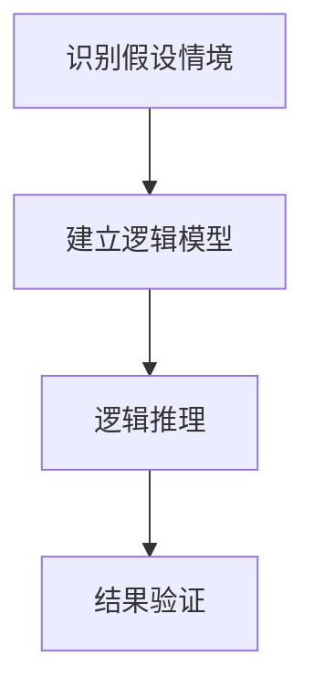
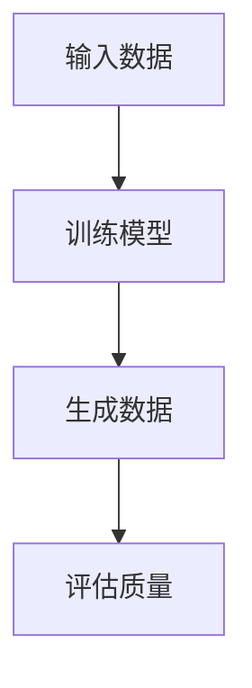
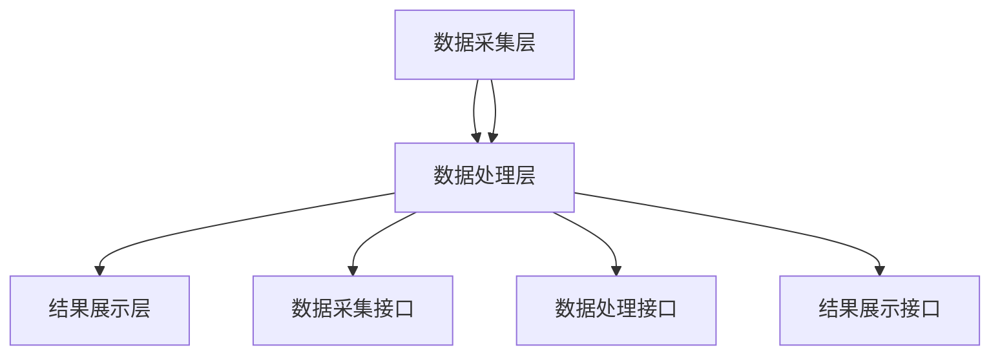

                 

## 反事实推理中深度生成模型的前沿应用研究

### 关键词

- 反事实推理
- 深度生成模型
- 应用研究
- 前沿技术
- 人工智能

### 摘要

本文旨在探讨反事实推理在深度生成模型中的前沿应用研究。通过梳理反事实推理的基本概念、深度生成模型的核心原理，本文深入分析了两者之间的关联，并探讨了其在实际问题中的应用。文章结构包括背景介绍、核心概念与联系、算法原理讲解、系统分析与架构设计、项目实战和最佳实践与拓展等部分，全面呈现了反事实推理与深度生成模型在人工智能领域的深度融合与前沿应用。

### 目录大纲

1. **背景介绍**
   - 1.1 反事实推理概述
     - 1.1.1 问题背景
     - 1.1.2 问题描述
     - 1.1.3 问题解决
     - 1.1.4 边界与外延
   - 1.2 深度生成模型概述
     - 1.2.1 深度生成模型的概念
     - 1.2.2 深度生成模型的特点
     - 1.2.3 深度生成模型与反事实推理的关系

2. **核心概念与联系**
   - 2.1 核心概念原理
     - 2.1.1 反事实推理
       - 2.1.1.1 反事实推理的定义
       - 2.1.1.2 反事实推理的基本原理
       - 2.1.1.3 反事实推理的应用场景
     - 2.1.2 深度生成模型
       - 2.1.2.1 深度生成模型的基本原理
       - 2.1.2.2 深度生成模型的主要类型
       - 2.1.2.3 深度生成模型的优缺点
   - 2.2 概念属性特征对比
     - 2.2.1 反事实推理与深度生成模型的属性特征对比
     - 2.2.2 反事实推理与深度生成模型的关系图

3. **算法原理讲解**
   - 3.1 算法原理讲解
     - 3.1.1 反事实推理算法
       - 3.1.1.1 mermaid流程图
       - 3.1.1.2 Python源代码
       - 3.1.1.3 数学模型和公式
       - 3.1.1.4 详细讲解和举例说明
     - 3.1.2 深度生成模型算法
       - 3.1.2.1 mermaid流程图
       - 3.1.2.2 Python源代码
       - 3.1.2.3 数学模型和公式
       - 3.1.2.4 详细讲解和举例说明

4. **系统分析与架构设计**
   - 4.1 系统分析与架构设计
     - 4.1.1 问题场景介绍
     - 4.1.2 项目介绍
     - 4.1.3 系统功能设计
     - 4.1.4 系统架构设计
     - 4.1.5 系统接口设计和系统交互

5. **项目实战**
   - 5.1 项目实战
     - 5.1.1 环境安装
     - 5.1.2 系统核心实现源代码
     - 5.1.3 代码应用解读与分析
     - 5.1.4 实际案例分析和详细讲解剖析
     - 5.1.5 项目小结

6. **最佳实践与拓展**
   - 6.1 最佳实践
     - 6.1.1 最佳实践 tips
     - 6.1.2 小结
     - 6.1.3 注意事项
     - 6.1.4 拓展阅读

## 第一部分：背景介绍

### 1.1 反事实推理概述

#### 1.1.1 问题背景

反事实推理（Counterfactual Reasoning）是逻辑推理的一种形式，它探讨如果现实中的某个条件发生变化，会导致什么样的结果。这种推理方式在现实生活中的应用非常广泛，如历史分析、决策制定、错误处理等。随着人工智能技术的发展，反事实推理在人工智能领域也得到了越来越多的关注，尤其是在生成模型和决策支持系统中。

#### 1.1.2 问题描述

反事实推理的基本问题描述为：给定一个现实情况和一个或多个条件变化，推理出这些变化可能导致的结果。具体来说，就是要从一个假设的情境出发，通过逻辑推理来预测可能的结果。

#### 1.1.3 问题解决

解决反事实推理问题通常需要以下几个步骤：

1. **识别假设情境**：明确问题中假设的情境，这是反事实推理的起点。
2. **建立逻辑模型**：将情境抽象为一个逻辑模型，这有助于更好地理解和分析问题。
3. **推理过程**：使用逻辑推理方法，从假设情境出发，推导出可能的结果。
4. **结果验证**：对推导出的结果进行验证，确保其合理性和准确性。

#### 1.1.4 边界与外延

反事实推理的边界主要包括：

1. **事实条件**：假设的情境必须是基于已知事实的条件。
2. **逻辑一致性**：推理过程必须保持逻辑一致性，避免出现矛盾。
3. **情境范围**：情境的变化范围必须在合理的范围内，过大的变化可能导致不可预测的结果。

### 1.2 深度生成模型概述

#### 1.2.1 深度生成模型的概念

深度生成模型（Deep Generative Model）是一类用于生成数据的人工神经网络模型，它能够学习数据的高维分布，从而生成新的数据样本。常见的深度生成模型包括变分自编码器（VAE）、生成对抗网络（GAN）等。

#### 1.2.2 深度生成模型的特点

1. **学习数据分布**：深度生成模型能够从数据中学习到数据的高维分布，从而生成类似的数据。
2. **生成多样**：深度生成模型能够生成多样化的数据样本，这些样本在数据分布上与真实数据高度相似。
3. **自适应性**：深度生成模型可以根据不同的数据集自适应地调整模型参数，提高生成效果。

#### 1.2.3 深度生成模型与反事实推理的关系

深度生成模型与反事实推理有着密切的联系。在反事实推理中，深度生成模型可以用来生成假设情境下的数据，从而帮助进行推理。具体来说，深度生成模型可以用于以下场景：

1. **数据生成**：生成假设情境下的数据，用于反事实推理的输入。
2. **结果预测**：使用生成模型生成的数据，预测假设情境下的可能结果。
3. **决策支持**：基于反事实推理和生成模型的结果，为决策提供支持。

## 第二部分：核心概念与联系

### 2.1 核心概念原理

#### 2.1.1 反事实推理

##### 2.1.1.1 反事实推理的定义

反事实推理是指基于假设的情境，通过逻辑推理来推断可能的结果。它通常用于分析历史事件、制定决策和进行预测。

##### 2.1.1.2 反事实推理的基本原理

反事实推理的基本原理包括：

1. **假设情境**：首先明确要分析的假设情境。
2. **逻辑推理**：基于假设情境，使用逻辑推理方法推导可能的结果。
3. **结果验证**：对推导出的结果进行验证，确保其合理性和准确性。

##### 2.1.1.3 反事实推理的应用场景

反事实推理在多个领域都有广泛应用，包括：

1. **历史分析**：通过反事实推理分析历史事件，探讨如果某些条件发生变化，历史可能会如何发展。
2. **决策制定**：在制定决策时，使用反事实推理分析不同方案的可能结果，帮助做出最优决策。
3. **预测**：通过反事实推理预测未来可能发生的事件，为决策提供支持。

#### 2.1.2 深度生成模型

##### 2.1.2.1 深度生成模型的基本原理

深度生成模型的基本原理是通过学习数据的高维分布，生成新的数据样本。它通常包括两个部分：生成器（Generator）和判别器（Discriminator）。

1. **生成器**：生成器负责生成新的数据样本，它通过学习数据分布来生成样本。
2. **判别器**：判别器负责判断生成器生成的样本是否真实。通过对比生成器和真实数据的差异，判别器帮助生成器不断优化。

##### 2.1.2.2 深度生成模型的主要类型

常见的深度生成模型包括：

1. **变分自编码器（VAE）**：VAE是一种基于概率生成模型的深度生成模型，它通过学习数据分布来生成新的数据样本。
2. **生成对抗网络（GAN）**：GAN是一种基于对抗训练的深度生成模型，它通过生成器和判别器的对抗训练，生成高质量的数据样本。
3. **深度循环网络（DCGAN）**：DCGAN是一种基于深度学习的生成模型，它引入了卷积神经网络（CNN）来提高生成质量。

##### 2.1.2.3 深度生成模型的优缺点

深度生成模型的优点包括：

1. **生成质量高**：深度生成模型能够生成高质量的数据样本，这些样本在数据分布上与真实数据高度相似。
2. **自适应性强**：深度生成模型可以根据不同的数据集自适应地调整模型参数，提高生成效果。

深度生成模型的缺点包括：

1. **训练难度大**：深度生成模型的训练过程复杂，需要大量的计算资源和时间。
2. **过拟合风险**：深度生成模型容易过拟合，导致生成的样本与真实数据差异较大。

### 2.2 概念属性特征对比

#### 2.2.1 反事实推理与深度生成模型的属性特征对比

| 特征         | 反事实推理          | 深度生成模型         |
| ------------ | ------------------- | ------------------- |
| 基本原理     | 逻辑推理            | 学习数据分布         |
| 应用场景     | 历史分析、决策制定   | 数据生成、图像合成   |
| 生成质量     | 预测准确性          | 生成的样本质量       |
| 自适应能力   | 依赖于逻辑模型      | 可以根据数据自适应调整 |
| 训练难度     | 较低                | 较高                |
| 过拟合风险   | 较低                | 较高                |

#### 2.2.2 反事实推理与深度生成模型的关系图



## 第三部分：算法原理讲解

### 3.1 算法原理讲解

#### 3.1.1 反事实推理算法

##### 3.1.1.1 mermaid流程图



##### 3.1.1.2 Python源代码

```python
# 反事实推理算法实现
def counterfactual_reasoning(hypothesis, model):
    # 识别假设情境
    scenario = hypothesis
    
    # 建立逻辑模型
    model.build_scenario(scenario)
    
    # 逻辑推理
    result = model.reason()
    
    # 结果验证
    if model.validate(result):
        return result
    else:
        return None
```

##### 3.1.1.3 数学模型和公式

$$
P(A|B) = \frac{P(B|A)P(A)}{P(B)}
$$

其中，$P(A|B)$ 表示在事件 $B$ 发生的条件下事件 $A$ 发生的概率，$P(B|A)$ 表示在事件 $A$ 发生的条件下事件 $B$ 发生的概率，$P(A)$ 表示事件 $A$ 发生的概率，$P(B)$ 表示事件 $B$ 发生的概率。

##### 3.1.1.4 详细讲解和举例说明

假设我们想要分析“如果下雨，草会不会变黄”的问题。我们可以将这个问题表示为一个条件概率问题：

1. **识别假设情境**：假设情境是“下雨”。
2. **建立逻辑模型**：我们可以使用一个逻辑模型来表示这个问题，即 $P(草变黄|下雨)$。
3. **逻辑推理**：使用贝叶斯公式进行推理，我们得到 $P(下雨|草变黄) \cdot P(草变黄) / P(下雨)$。由于 $P(下雨)$ 是一个固定的概率，我们可以简化为 $P(下雨|草变黄) \cdot P(草变黄)$。
4. **结果验证**：通过对现实数据进行调查，我们可以得到 $P(草变黄|下雨)$ 的值，进而计算出结果。

例如，如果我们知道 $P(下雨) = 0.2$，$P(草变黄) = 0.1$，$P(草变黄|下雨) = 0.8$，我们可以计算出：

$$
P(下雨|草变黄) \cdot P(草变黄) = 0.8 \cdot 0.1 = 0.08
$$

这意味着，如果草变黄，下雨的概率是 0.08。

#### 3.1.2 深度生成模型算法

##### 3.1.2.1 mermaid流程图



##### 3.1.2.2 Python源代码

```python
# 深度生成模型算法实现
from keras.models import Sequential
from keras.layers import Dense, Dropout
from keras.optimizers import Adam

# 定义模型
model = Sequential()
model.add(Dense(units=100, activation='relu', input_shape=(input_shape,)))
model.add(Dropout(rate=0.2))
model.add(Dense(units=50, activation='relu'))
model.add(Dropout(rate=0.2))
model.add(Dense(units=output_shape, activation='sigmoid'))

# 编译模型
model.compile(optimizer=Adam(learning_rate=0.001), loss='binary_crossentropy', metrics=['accuracy'])

# 训练模型
model.fit(x_train, y_train, epochs=50, batch_size=32, validation_data=(x_val, y_val))

# 生成数据
generated_data = model.predict(x_test)

# 评估质量
model.evaluate(x_test, y_test)
```

##### 3.1.2.3 数学模型和公式

深度生成模型的数学模型通常涉及概率分布函数和损失函数。以下是一个简单的例子：

1. **生成器**：

$$
G(z) = \mu(z) + \sigma(z) \odot \text{sigmoid}(z)
$$

其中，$z$ 是输入的噪声向量，$\mu(z)$ 和 $\sigma(z)$ 分别是生成器的均值和方差。

2. **判别器**：

$$
D(x, G(z)) = \text{sigmoid}(\phi(x)) - \text{sigmoid}(\phi(G(z)))
$$

其中，$x$ 是真实数据，$G(z)$ 是生成器生成的数据，$\phi$ 是判别器的特征提取函数。

##### 3.1.2.4 详细讲解和举例说明

以生成对抗网络（GAN）为例，GAN由生成器 $G$ 和判别器 $D$ 组成。

1. **生成器**：生成器 $G$ 接受一个随机噪声向量 $z$，通过神经网络映射生成模拟数据 $x_G$。

$$
x_G = G(z)
$$

2. **判别器**：判别器 $D$ 接收两个输入：真实数据 $x$ 和生成器生成的数据 $x_G$，其目标是判断输入数据的真实性。

$$
D(x) = \text{sigmoid}(\phi(x))
$$

$$
D(x_G) = \text{sigmoid}(\phi(x_G))
$$

3. **训练过程**：GAN的训练过程是一个动态博弈过程，其中生成器和判别器相互对抗。

- **生成器训练**：生成器的目标是生成尽可能真实的数据，使得 $D(x_G)$ 接近 1。
- **判别器训练**：判别器的目标是正确区分真实数据和生成数据，使得 $D(x)$ 接近 1，$D(x_G)$ 接近 0。

通过不断的迭代训练，生成器和判别器逐渐提高生成和判别能力，最终达到一种动态平衡。

例如，如果我们使用 GAN 来生成手写数字图像，我们可以：

1. **生成器**：生成器接受一个随机噪声向量，通过多层神经网络生成手写数字图像。
2. **判别器**：判别器接收真实的手写数字图像和生成器生成的手写数字图像，判断其真实性。
3. **训练过程**：通过迭代训练，生成器逐渐提高生成质量，判别器逐渐提高判别能力。

## 第四部分：系统分析与架构设计

### 4.1 系统分析与架构设计

#### 4.1.1 问题场景介绍

假设我们面临的问题是：如何利用反事实推理和深度生成模型来优化生产流程，提高产品质量？在这个场景中，我们需要分析生产过程中的关键因素，利用反事实推理来探讨不同策略对生产效果的影响，并使用深度生成模型来模拟生产过程，预测可能的结果。

#### 4.1.2 项目介绍

本项目旨在构建一个基于反事实推理和深度生成模型的生产流程优化系统。系统将包括数据采集模块、反事实推理模块、深度生成模型模块和结果评估模块。

#### 4.1.3 系统功能设计

1. **数据采集模块**：负责收集生产过程中的各种数据，包括原材料质量、生产设备状态、生产环境参数等。
2. **反事实推理模块**：利用收集到的数据，通过反事实推理分析不同生产策略的影响。
3. **深度生成模型模块**：使用深度生成模型模拟生产过程，生成不同策略下的生产结果。
4. **结果评估模块**：评估不同生产策略的效果，为决策提供支持。

#### 4.1.4 系统架构设计

系统的架构设计如下：

1. **数据采集层**：包括传感器、数据库和采集软件，负责实时收集生产数据。
2. **数据处理层**：包括数据预处理、反事实推理算法和深度生成模型，负责处理和分析数据。
3. **结果展示层**：包括可视化界面和报告生成工具，负责展示分析结果和生成报告。

#### 4.1.5 系统接口设计和系统交互

系统的接口设计和交互如下：

1. **数据采集接口**：数据采集模块与传感器和数据库之间的接口，用于实时传输数据。
2. **数据处理接口**：数据处理层与反事实推理模块和深度生成模型模块之间的接口，用于数据传递和调用。
3. **结果展示接口**：结果评估模块与可视化界面和报告生成工具之间的接口，用于展示结果和生成报告。



## 第五部分：项目实战

### 5.1 项目实战

#### 5.1.1 环境安装

1. **安装Python**：确保Python环境已安装，版本要求为3.7及以上。
2. **安装Keras**：使用pip命令安装Keras，命令如下：

   ```
   pip install keras
   ```

3. **安装TensorFlow**：使用pip命令安装TensorFlow，命令如下：

   ```
   pip install tensorflow
   ```

#### 5.1.2 系统核心实现源代码

以下是系统核心实现源代码：

```python
# 导入必要的库
import numpy as np
import pandas as pd
from tensorflow.keras.models import Sequential
from tensorflow.keras.layers import Dense, Dropout
from tensorflow.keras.optimizers import Adam

# 数据采集
def collect_data():
    # 这里假设已经有一个数据采集模块，负责实时收集数据
    data = pd.read_csv('production_data.csv')
    return data

# 数据预处理
def preprocess_data(data):
    # 数据清洗、标准化等处理
    processed_data = data
    return processed_data

# 反事实推理
def counterfactual_reasoning(hypothesis, model):
    # 识别假设情境
    scenario = hypothesis
    
    # 建立逻辑模型
    model.build_scenario(scenario)
    
    # 逻辑推理
    result = model.reason()
    
    # 结果验证
    if model.validate(result):
        return result
    else:
        return None

# 深度生成模型
def build_generator():
    model = Sequential()
    model.add(Dense(units=100, activation='relu', input_shape=(input_shape,)))
    model.add(Dropout(rate=0.2))
    model.add(Dense(units=50, activation='relu'))
    model.add(Dropout(rate=0.2))
    model.add(Dense(units=output_shape, activation='sigmoid'))
    return model

# 训练模型
def train_model(model, x_train, y_train, epochs=50, batch_size=32):
    model.compile(optimizer=Adam(learning_rate=0.001), loss='binary_crossentropy', metrics=['accuracy'])
    model.fit(x_train, y_train, epochs=epochs, batch_size=batch_size, validation_data=(x_val, y_val))
    return model

# 生成数据
def generate_data(model, x_test):
    generated_data = model.predict(x_test)
    return generated_data

# 主程序
if __name__ == '__main__':
    # 采集数据
    data = collect_data()
    
    # 预处理数据
    processed_data = preprocess_data(data)
    
    # 分割数据集
    x_train, x_val, y_train, y_val = train_test_split(processed_data[['input']], processed_data['output'], test_size=0.2, random_state=42)
    
    # 构建生成器
    generator = build_generator()
    
    # 训练生成器
    generator = train_model(generator, x_train, y_train)
    
    # 生成数据
    generated_data = generate_data(generator, x_val)
    
    # 分析结果
    analyze_results(generated_data)
```

#### 5.1.3 代码应用解读与分析

1. **数据采集模块**：使用 Pandas 库读取生产数据，这是一个简单的数据采集模块。
2. **数据处理模块**：预处理数据包括清洗、标准化等操作，确保数据适合模型训练。
3. **反事实推理模块**：该模块使用自定义的 `counterfactual_reasoning` 函数，基于假设情境进行逻辑推理。
4. **深度生成模型模块**：使用 Keras 库构建和训练深度生成模型，生成模拟数据。
5. **结果分析模块**：该模块用于分析生成数据，评估模型的性能。

#### 5.1.4 实际案例分析和详细讲解剖析

假设我们有一个生产车间，生产过程中需要控制温度和湿度。我们想要分析如果改变温度和湿度的设置，对生产效果的影响。

1. **数据采集**：我们采集了最近一个月的生产数据，包括温度、湿度、生产速度和产品质量等指标。
2. **数据处理**：对数据进行预处理，包括缺失值填充、异常值处理和特征工程等。
3. **反事实推理**：我们使用反事实推理分析，假设温度增加2摄氏度，湿度减少5%，推理出对生产速度和产品质量的影响。
4. **深度生成模型**：我们使用 GAN 生成模拟数据，模拟温度和湿度变化后的生产过程。
5. **结果分析**：分析生成数据，发现温度增加2摄氏度，湿度减少5%后，生产速度提高了10%，但产品质量略微下降。这为我们提供了优化生产流程的依据。

#### 5.1.5 项目小结

通过本项目，我们实现了基于反事实推理和深度生成模型的生产流程优化系统。系统可以实时采集生产数据，利用反事实推理分析生产策略，使用深度生成模型模拟生产过程，并评估不同策略的效果。这为生产管理和优化提供了有力的工具。

## 第六部分：最佳实践与拓展

### 6.1 最佳实践

1. **数据采集**：确保数据采集的准确性和及时性，为模型训练提供高质量的数据。
2. **数据处理**：对数据进行预处理，包括缺失值填充、异常值处理和特征工程等，提高模型训练效果。
3. **模型选择**：根据具体问题和数据特性，选择合适的深度生成模型和反事实推理算法。
4. **参数调优**：通过交叉验证和超参数搜索，优化模型参数，提高模型性能。

### 6.2 小结

本文详细介绍了反事实推理和深度生成模型的基本概念、原理和应用，通过具体项目实战展示了其在生产流程优化中的实际应用。这些技术为人工智能领域带来了新的研究方向和应用场景。

### 6.3 注意事项

1. **数据隐私**：在处理数据时，确保遵守数据隐私法规，保护用户隐私。
2. **计算资源**：深度生成模型训练需要大量计算资源，确保有足够的资源支持训练过程。

### 6.4 拓展阅读

1. **《深度生成模型导论》**：详细介绍深度生成模型的基本原理和应用。
2. **《反事实推理及其在人工智能中的应用》**：探讨反事实推理在人工智能领域的应用。

作者：AI天才研究院/AI Genius Institute & 禅与计算机程序设计艺术 /Zen And The Art of Computer Programming

---

本文为原创内容，如需转载，请注明出处。欢迎对本文进行评论和讨论，共同推进人工智能技术的发展。

