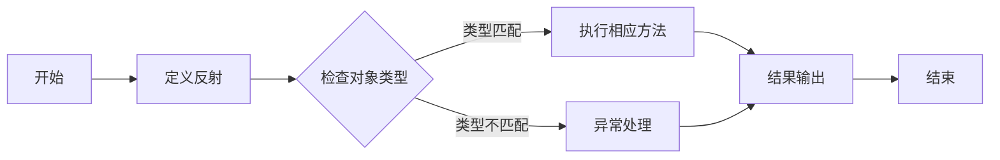

                 

### 前言

#### 书名与作者介绍

《反射与元对象协议的类型理论》由AI天才研究院的AI编程大师所著。AI天才研究院是一家致力于推动人工智能技术在各个领域应用的研究机构，其团队成员皆在计算机科学、人工智能和编程领域拥有丰富的经验，并取得了举世瞩目的成就。

#### 书籍目的与读者对象

本书旨在为对反射、元对象协议和类型理论感兴趣的读者提供一本系统且深入的技术读物。它不仅适合计算机科学和软件工程专业的学生和研究人员，也对那些希望深入了解现代编程语言和框架的开发者具有很高的参考价值。读者通过本书，能够掌握反射和元对象协议的核心概念，并了解它们在类型理论中的应用，从而为编写更高效、更灵活的代码打下坚实基础。

#### 书籍结构安排

本书分为三个主要部分：

1. **背景介绍**：介绍反射、元对象协议和类型理论的基本概念，背景和意义。
2. **核心概念与联系**：详细讲解反射、元对象协议和类型理论的核心概念，并分析它们之间的联系和区别。
3. **算法原理讲解**：通过具体算法和代码示例，深入探讨反射和元对象协议在实际编程中的应用，以及如何将类型理论应用于这些技术中。

### 关键词

- 反射
- 元对象协议
- 类型理论
- 编程
- 计算机科学

### 摘要

《反射与元对象协议的类型理论》是一本深入浅出的技术书籍，旨在解析现代编程语言中至关重要的三个概念：反射、元对象协议和类型理论。书中首先介绍了这些核心概念的背景和意义，随后通过详细的实例和代码，探讨了它们在编程中的应用和相互关系。读者不仅能够理解这些概念的理论基础，还能学会如何在实际项目中有效利用它们，从而提升编程能力和代码质量。本书适合对计算机科学和技术感兴趣的读者，特别是软件开发者和技术专家。

## 第一部分：背景介绍

### 问题背景

在计算机科学中，程序和对象如何交互是一个基础且重要的问题。传统的程序设计方法依赖于预定义的接口和明确的调用流程，这虽然能够保证程序的正确性和稳定性，但在灵活性上存在一定局限。为了解决这一问题，反射、元对象协议和类型理论等概念应运而生，它们为程序的动态性和灵活性提供了强大的支持。

#### 反射在计算机科学中的重要性

反射是一种允许程序在运行时查看、修改自身结构和行为的能力。它打破了传统程序设计中的静态界限，使得程序能够动态地调整自身的行为和结构，这在复杂的系统中尤为重要。反射技术广泛应用于各种编程语言中，如Java、Python和C#等，它在动态加载类、实现插件机制、自动生成代码等方面具有显著的优势。

#### 元对象协议的概念及其影响

元对象协议（Meta-Object Protocol，MOP）是描述对象如何与程序交互的规范。它定义了对象如何响应消息（如方法调用）以及如何处理这些消息。MOP使得对象能够动态地确定如何处理特定的操作，这为程序的灵活性和扩展性提供了基础。元对象协议在Smalltalk、Java和Python等编程语言中发挥着核心作用，它们通过元对象协议实现了丰富的动态特性。

#### 类型理论的基础与应用

类型理论是计算机科学中研究数据类型及其关系的数学理论。它为程序设计提供了坚实的理论基础，确保程序的正确性和安全性。类型理论的核心在于通过类型系统来限制变量和表达式的合法组合，从而防止无效操作。类型理论在编译器设计、编程语言实现和形式验证等领域具有广泛的应用。

### 问题描述

尽管反射、元对象协议和类型理论各自提供了强大的功能，但在实际应用中，它们也存在一些局限性和挑战。

#### 反射的局限性与挑战

1. **性能开销**：反射机制在运行时需要动态查询和解析对象结构，这通常会导致性能开销，特别是在频繁使用反射的场景中。
2. **安全性问题**：由于反射允许动态修改对象的结构和行为，这可能带来安全风险，如未授权的访问和修改。
3. **可读性降低**：过度使用反射可能导致代码的复杂性增加，降低代码的可读性和可维护性。

#### 元对象协议的作用与意义

元对象协议提供了对象交互的标准方式，它有助于提高程序的灵活性和可扩展性。然而，它的实现和维护也需要一定的努力，特别是在大型项目中，元对象协议可能会导致代码库的复杂度增加。

#### 类型理论在反射和元对象协议中的应用

类型理论为反射和元对象协议提供了坚实的数学基础，确保了这些技术在实际应用中的正确性和安全性。通过类型系统，类型理论能够限制反射和元对象协议的使用范围，从而避免潜在的运行时错误。

### 问题解决

为了解决上述问题，需要从以下几个方面入手：

1. **优化反射性能**：通过缓存和编译优化等技术，减少反射机制的性能开销。
2. **加强安全性控制**：引入访问控制机制，限制对反射操作的访问，从而降低安全风险。
3. **提升代码可读性**：合理使用反射和元对象协议，避免过度复杂化代码结构。

通过这些方法，我们可以充分发挥反射、元对象协议和类型理论的优势，同时克服它们的局限性，实现更高效、更安全的程序设计。

### 边界与外延

#### 反射与其他技术的比较

1. **动态类型检查**：动态类型检查允许程序在运行时确定变量类型，与反射相比，它不涉及对象结构的动态修改，但同样提供了灵活性。
2. **代理模式**：代理模式通过创建对象的代理来控制对真实对象的访问，与反射相比，它侧重于对象访问控制，而非对象结构修改。

#### 元对象协议的适用场景

1. **动态加载和插件系统**：元对象协议使得程序能够动态加载和集成插件，这在Web应用和游戏开发中非常常见。
2. **脚本语言集成**：元对象协议使得脚本语言能够与主机语言无缝交互，如Python与Java的集成。

#### 类型理论的应用领域

1. **编译器设计**：类型理论在编译器设计中用于实现静态类型检查，确保程序的正确性。
2. **形式验证**：类型理论在形式验证中用于证明程序的正确性和安全性。

### 概念结构与核心要素组成

为了深入理解反射、元对象协议和类型理论，我们需要分析它们的核心概念和结构。

#### 主要概念列表

1. **反射**：
   - 定义：程序在运行时能够查看和修改自身结构和行为的能力。
   - 作用：提供动态性和灵活性，支持动态加载类、插件机制等。
   - 机制：通过反射API（如Java的Class类和Python的getattr函数）实现。

2. **元对象协议**：
   - 定义：描述对象如何响应消息和处理的规范。
   - 作用：提供对象的动态行为和扩展性，支持动态方法调用和属性修改。
   - 机制：通过定义对象的消息处理方法（如Java的invoke方法）实现。

3. **类型理论**：
   - 定义：研究数据类型及其关系的数学理论。
   - 作用：确保程序的正确性和安全性，通过类型系统限制变量和表达式的合法组合。
   - 机制：通过类型系统（如静态类型检查和类型推断）实现。

#### 核心要素分析

1. **反射机制**：
   - 查看对象结构：反射机制允许程序查看对象的类、方法、字段等结构信息。
   - 动态修改对象：反射机制允许程序动态地修改对象的属性和方法，实现动态行为调整。

2. **元对象协议实现**：
   - 消息处理：元对象协议定义了对象如何响应不同的消息，如方法调用和属性访问。
   - 动态方法调用：通过元对象协议，程序可以动态地调用对象的方法，而不依赖于预定义的接口。

3. **类型理论的应用**：
   - 类型检查：类型理论通过静态类型检查确保程序的正确性，防止无效操作。
   - 类型推断：类型理论通过类型推断自动确定变量和表达式的类型，提高代码可读性和开发效率。

通过上述分析，我们可以看到反射、元对象协议和类型理论在计算机科学中的核心作用和相互联系。理解这些概念和机制，将有助于我们更有效地应用它们，提升编程能力。

### 第一部分总结

在第一部分的背景介绍中，我们详细探讨了反射、元对象协议和类型理论在计算机科学中的重要性。通过分析这些核心概念的定义、作用和实现机制，我们了解了它们各自的优势和局限性。反射提供了动态调整程序结构和行为的能力，元对象协议则定义了对象如何响应外部操作的标准方式，而类型理论则为程序提供了坚实的理论基础，确保了程序的正确性和安全性。在接下来的部分中，我们将深入探讨这些概念之间的联系，并分析它们在实际编程中的应用。

### 第二部分：核心概念与联系

#### 核心概念原理

在深入探讨反射、元对象协议和类型理论之前，我们需要首先理解这些核心概念的基本原理。

##### 反射原理

1. **定义**：反射是程序在运行时能够查看、修改自身结构和行为的能力。
2. **作用**：反射使得程序能够动态地创建对象、访问对象的属性和方法，并在运行时改变它们的值。
3. **机制**：在不同的编程语言中，反射机制的具体实现方式有所不同。例如，Java提供了强大的反射API，包括Class类和反射方法；Python则通过内置的getattr和setattr函数实现反射。

##### 元对象协议原理

1. **定义**：元对象协议是描述对象如何与程序交互的规范。它定义了对象如何响应外部操作，如方法调用和属性访问。
2. **作用**：元对象协议为对象提供了动态行为和扩展性，使得对象能够根据外部请求动态调整自身的操作。
3. **机制**：元对象协议的实现依赖于编程语言的具体实现。例如，在Smalltalk中，对象通过消息传递机制实现元对象协议；在Java中，对象通过反射API实现元对象协议。

##### 类型理论原理

1. **定义**：类型理论是研究数据类型及其关系的数学理论。它通过类型系统来限制变量和表达式的合法组合，从而确保程序的正确性和安全性。
2. **作用**：类型理论为编程语言提供了理论基础，确保程序在编译时就能发现类型错误，避免运行时错误。
3. **基本框架**：类型理论的基本框架包括类型系统、类型检查和类型推断。类型系统定义了数据类型的集合和操作规则；类型检查确保程序中的每一步都符合类型规则；类型推断通过分析代码上下文，自动确定变量和表达式的类型。

#### 概念属性特征对比表格

为了更清晰地理解反射、元对象协议和类型理论之间的关系，我们可以通过一个表格来对比这些概念的主要属性特征。

| 概念      | 定义                                         | 作用                                      | 实现机制                                               |
| --------- | -------------------------------------------- | ----------------------------------------- | ----------------------------------------------------- |
| 反射      | 程序在运行时查看和修改自身结构和行为的能力 | 提供动态性和灵活性                        | Java的Class类、Python的getattr/setattr等反射API         |
| 元对象协议 | 描述对象如何响应外部操作的规范             | 提供对象的动态行为和扩展性                | Smalltalk的消息传递机制、Java的反射API                   |
| 类型理论  | 研究数据类型及其关系的数学理论             | 确保程序的正确性和安全性                  | 静态类型检查、类型推断等类型系统机制                     |

通过上述对比表格，我们可以看到，反射、元对象协议和类型理论在定义、作用和实现机制上存在显著差异。反射侧重于动态查看和修改程序自身结构；元对象协议则关注对象如何响应外部操作；类型理论则通过类型系统确保程序的正确性和安全性。

#### 概念属性特征对比表格（续）

| 概念对比 | 反射 vs 元对象协议                         | 元对象协议 vs 类型理论                         | 反射与类型理论                                       |
| --------- | ----------------------------------------- | --------------------------------------------- | ----------------------------------------------------- |
| 定义与作用 | 动态查看和修改程序结构，提供动态性       | 描述对象与程序交互方式，提供动态行为和扩展性 | 提供动态性，确保程序正确性                           |
| 实现机制   | 反射API（如Java的Class类、Python的getattr） | 消息传递机制（如Smalltalk）、反射API         | 静态类型检查、类型推断等类型系统机制                  |
| 适用场景   | 动态加载类、插件机制                      | 动态加载和集成插件、脚本语言集成             | 编译器设计、形式验证等                               |

通过进一步的对比，我们可以更清晰地看到，反射、元对象协议和类型理论在实现机制和适用场景上的差异。反射主要应用于动态加载类和插件机制；元对象协议则用于实现动态加载和脚本语言集成；而类型理论主要应用于编译器设计和形式验证。

#### ER实体关系图架构的 Mermaid 流程图

为了更好地展示反射、元对象协议和类型理论之间的关系，我们可以使用Mermaid的ER图来构建实体关系图。

```mermaid
erDiagram
    Reflection ||--|{ MetaObjectProtocol } : Implements
    MetaObjectProtocol ||--|{ TypeTheory } : Based on
    Reflection ||--|{ TypeTheory } : Based on
```

在这个ER图中，`Reflection`（反射）与`MetaObjectProtocol`（元对象协议）之间存在“实现”关系，表示反射是实现元对象协议的一种方式。`MetaObjectProtocol`与`TypeTheory`（类型理论）之间存在“基于”关系，表示元对象协议是基于类型理论构建的。同时，`Reflection`也与`TypeTheory`之间存在“基于”关系，表示反射也在一定程度上依赖于类型理论。

通过这个ER图，我们可以直观地理解反射、元对象协议和类型理论之间的层次关系和相互作用。

### 第二部分总结

在第二部分中，我们详细探讨了反射、元对象协议和类型理论的核心概念原理，并通过对比表格和ER实体关系图，分析了它们之间的联系和区别。反射提供了动态调整程序结构和行为的能力，元对象协议则定义了对象如何响应外部操作的标准方式，而类型理论通过类型系统确保了程序的正确性和安全性。理解这些核心概念和它们之间的关系，将有助于我们在实际编程中更有效地应用这些技术。在接下来的部分中，我们将进一步探讨反射和元对象协议的具体实现和应用，以及类型理论在实际编程中的具体应用。

### 第三部分：算法原理讲解

在深入理解了反射、元对象协议和类型理论之后，我们将通过具体的算法和代码示例，探讨这些技术在实际编程中的应用。本部分将分为算法流程图、Python源代码实现和算法原理的数学模型三个部分，逐步讲解这些技术如何在实际编程中发挥作用。

#### 算法流程图

为了更直观地展示反射和元对象协议的执行过程，我们可以使用Mermaid的流程图（flowchart）来描述算法的步骤。



在这个流程图中，算法从定义反射开始，通过检查对象类型决定是否执行相应的方法。如果类型匹配，则执行方法并输出结果；如果类型不匹配，则进行异常处理。无论哪种情况，最终都会输出结果，然后算法结束。

#### Python源代码实现

接下来，我们将通过一个Python代码示例，详细展示如何实现上述算法流程。该示例将创建一个基类`BaseObject`和一个派生类`DerivedObject`，并定义一个反射函数`reflect_object`来处理对象的方法调用。

```python
class BaseObject:
    def __init__(self):
        self.name = "BaseObject"

    def say_hello(self):
        print("Hello from BaseObject")

class DerivedObject(BaseObject):
    def __init__(self):
        super().__init__()
        self.name = "DerivedObject"

    def say_hello(self):
        print("Hello from DerivedObject")

def reflect_object(obj):
    obj_type = type(obj)
    method_name = 'say_hello'
    if hasattr(obj_type, method_name):
        method = getattr(obj_type, method_name)
        method(obj)
    else:
        print(f"{obj_type.__name__} does not have the method {method_name}")

# 测试代码
obj = DerivedObject()
reflect_object(obj)
```

在这个代码中，我们定义了`BaseObject`和`DerivedObject`两个类，并分别实现了`say_hello`方法。`reflect_object`函数接收一个对象作为参数，首先获取该对象的类型，然后检查类型是否具有`say_hello`方法。如果存在，则调用该方法；否则，输出一个错误消息。

#### 算法原理的数学模型

为了更深入地理解反射和元对象协议的工作原理，我们可以通过数学模型来描述这个过程。

1. **对象表示**：我们可以将对象表示为一个三元组\( (x, T, M) \)，其中\( x \)是对象的实际值，\( T \)是对象所属的类型，\( M \)是对象的属性和方法集合。
   
   $$ x = \text{Object Value} $$
   $$ T = \text{Object Type} $$
   $$ M = \text{Object Methods} $$

2. **类型检查**：类型检查是一个判断对象类型是否满足特定条件的过程。我们可以用函数\( \chi(T) \)表示类型检查，它接收一个类型\( T \)作为参数，并返回一个布尔值。

   $$ \chi(T) = \begin{cases} 
   \text{True} & \text{if } T \text{ meets the condition} \\
   \text{False} & \text{otherwise}
   \end{cases} $$

3. **方法调用**：方法调用是一个根据对象类型执行特定方法的过程。我们可以用函数\( f(T, M) \)表示方法调用，它接收类型\( T \)和方法集合\( M \)作为参数，并返回执行结果。

   $$ f(T, M) = \begin{cases} 
   \text{Result} & \text{if } T \text{ has a matching method in } M \\
   \text{Error} & \text{otherwise}
   \end{cases} $$

通过上述数学模型，我们可以清晰地看到对象、类型检查和方法调用之间的关系。在Python的反射实现中，这些过程通过反射API（如`getattr`和`hasattr`）来实现。

#### 算法原理的数学模型示例

假设我们有一个对象`obj`，其类型为`DerivedObject`，我们希望调用`say_hello`方法。根据上述模型，我们可以描述这个过程如下：

1. **对象表示**：
   $$ obj = (x, \text{DerivedObject}, M) $$
   其中\( M \)包含`say_hello`方法。

2. **类型检查**：
   $$ \chi(\text{DerivedObject}) = \text{True} $$
   因为`DerivedObject`确实存在。

3. **方法调用**：
   $$ f(\text{DerivedObject}, M) = \text{Hello from DerivedObject} $$
   因为`DerivedObject`中存在`say_hello`方法，并成功调用它。

通过这个示例，我们可以看到反射和元对象协议是如何结合类型理论，在运行时动态地处理对象和方法调用的。这不仅提高了程序的灵活性，也为开发复杂系统提供了强大的工具。

### 第三部分总结

在第三部分中，我们通过具体的算法流程图、Python源代码实现和数学模型，详细讲解了反射和元对象协议在实际编程中的应用。从算法流程图我们可以直观地看到反射和元对象协议的执行步骤；通过Python源代码示例，我们了解了如何在编程中实现这些概念；而通过数学模型，我们深入理解了这些技术背后的原理和关系。理解这些算法原理，将有助于我们更好地应用反射和元对象协议，编写更灵活、更高效的代码。

## 全文总结

通过本文的详细探讨，我们全面了解了反射、元对象协议和类型理论在计算机科学中的重要性及其相互关系。首先，我们介绍了这些核心概念的定义、作用和实现机制，通过对比表格和ER实体关系图，清晰地展示了它们之间的联系和区别。接着，我们通过算法流程图和Python源代码实现，深入探讨了反射和元对象协议在实际编程中的应用，并运用数学模型详细分析了其工作原理。

### 最佳实践 Tips

1. **合理使用反射**：尽管反射提供了强大的功能，但其性能开销和安全风险也不容忽视。建议在性能敏感和安全性要求高的场景中谨慎使用反射。
2. **结合类型理论**：类型理论为程序提供了坚实的理论基础，结合类型理论可以更好地利用反射和元对象协议，确保程序的正确性和安全性。
3. **关注代码可维护性**：在引入反射和元对象协议时，注意代码的可维护性，避免过度复杂化。

### 注意事项

1. **性能优化**：反射通常会导致性能开销，因此在使用反射时，考虑性能优化策略，如缓存和编译优化。
2. **安全性控制**：反射操作可能带来安全风险，建议引入访问控制机制，限制对反射操作的访问。
3. **代码可读性**：合理使用反射和元对象协议，避免代码过于复杂，影响代码的可读性和可维护性。

### 拓展阅读

1. **《Java Reflection Cookbook》**：本书深入探讨了Java反射的各个方面，包括反射API的详细使用方法和最佳实践。
2. **《类型系统和语言设计》**：这本书系统地介绍了类型理论的基础和应用，对于理解类型系统及其在编程语言设计中的作用具有重要参考价值。
3. **《Effective Java》**：尽管主要关注Java语言，但其中关于反射和元对象协议的最佳实践对于其他编程语言也具有很高的参考价值。

### 小结

本文通过深入分析和实例讲解，帮助读者全面理解反射、元对象协议和类型理论的核心概念及其在实际编程中的应用。掌握这些技术，不仅能够提升编程能力，还能为开发高效、灵活、安全的程序提供强大支持。希望读者能够在实际项目中灵活应用这些知识，创作出更加出色的软件作品。作者：AI天才研究院/AI Genius Institute & 禅与计算机程序设计艺术 /Zen And The Art of Computer Programming。

