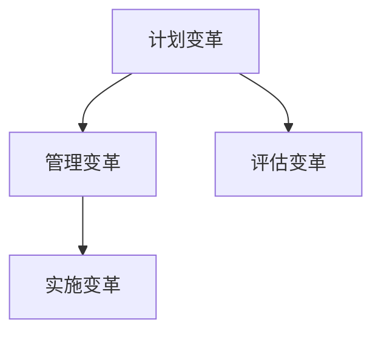

                 


## 变革管理：引导团队适应新技术与新流程

### 关键词：变革管理、团队适应、新技术、新流程

### 摘要：
本文旨在探讨如何在信息技术领域有效管理变革，引导团队适应新技术与新流程。通过对变革管理的背景与重要性、新技术类型与特点、新流程设计实施及综合案例研究的深入分析，为IT管理者提供实用的策略和方法，以实现组织的持续发展与创新。

## 第一部分: 变革管理的背景与重要性

### 1.1 问题背景
在现代信息技术迅猛发展的背景下，企业面临着不断更新的技术浪潮和新流程的挑战。如何引导团队适应这些变革，确保组织的持续发展，成为企业管理者亟待解决的问题。

#### 1.1.1 组织面临的技术变革
技术变革主要体现在以下几个方面：
- **新技术的引入**：如云计算、大数据、人工智能等。
- **旧技术的淘汰**：如传统IT基础设施的逐步淘汰。
- **技术融合**：如物联网、区块链等新兴技术的广泛应用。

#### 1.1.2 团队适应的重要性
团队适应新技术和新流程的成败直接关系到组织的竞争力。适应能力强意味着团队能够快速响应市场变化，提高生产效率，降低成本。

#### 1.1.3 变革管理的定义与目标
变革管理是指通过系统的规划和执行，引导组织及其成员适应外部或内部变化的过程。其目标包括：
- **提高团队凝聚力**：通过共同的目标和愿景，增强团队的凝聚力。
- **提升员工技能**：通过培训和学习，提升员工的技能水平。
- **降低变革阻力**：通过沟通和协作，降低团队成员对变革的抵触情绪。

### 1.2 变革管理的核心概念与联系
变革管理涉及多个核心概念，如变革动力、变革阻力、变革过程等。这些概念之间相互关联，共同构成了变革管理的理论框架。

#### 1.2.1 变革管理的核心概念
- **变革动力**：推动变革的外部和内部因素。
- **变革阻力**：阻碍变革的因素，如员工抵触、资源限制等。
- **变革过程**：变革的阶段性过程，包括准备、执行和评估。

#### 1.2.2 变革管理的属性特征对比表格
| 属性特征 | 描述 |
| -------- | ---- |
| **变革动力** | 推动变革的因素，如市场竞争、技术进步等 |
| **变革阻力** | 阻碍变革的因素，如员工抵触、资源限制等 |
| **变革过程** | 变革的阶段性过程，包括准备、执行和评估 |

#### 1.2.3 变革管理的ER实体关系图架构
使用Mermaid绘制ER实体关系图，展示变革管理中的关键实体及其关系。

```mermaid
erDiagram
  力|<-.. 变革 : 力是变革的推动者
  阻力|<-.. 变革 : 阻力是变革的障碍
  过程|<-.. 变革 : 过程是变革的实施路径
```

### 1.3 变革管理的理论框架
变革管理理论主要包括计划变革、管理变革和实施变革三个阶段。

#### 1.3.1 变革管理的基本理论
- **计划变革**：明确变革的目标、范围和时间表。
- **管理变革**：沟通变革的必要性，建立支持变革的文化。
- **实施变革**：执行变革计划，监督变革的进展。

#### 1.3.2 变革管理的框架模型
使用Mermaid绘制变革管理的框架模型，展示各阶段的相互关系。



#### 1.3.3 变革管理的关键因素
- **领导力**：领导者对变革的承诺和引导能力。
- **沟通**：确保信息传递准确、及时。
- **组织文化**：支持变革的组织文化。

### 1.4 变革管理的实践现状
变革管理在实践中面临诸多挑战，如员工抵触、资源限制等。但通过最佳实践，可以有效克服这些挑战。

#### 1.4.1 变革管理的挑战
- **员工抵触**：员工对变革的恐惧和不信任。
- **资源限制**：时间、资金和人力资源的有限性。

#### 1.4.2 变革管理的最佳实践
- **明确变革目标**：确保员工理解变革的必要性和目标。
- **建立支持团队**：为变革提供必要的技术和资源支持。
- **持续沟通**：保持与员工的沟通，及时反馈变革进展。

#### 1.4.3 变革管理的未来趋势
随着技术的不断发展，变革管理的重点将逐渐转向数字化转型、敏捷管理和跨文化协作。

### 1.5 本章小结
通过本部分的介绍，我们了解了变革管理的背景与重要性，以及变革管理的核心概念、理论框架和实践现状。接下来，我们将深入探讨如何引导团队适应新技术与新流程。

## 第二部分: 引导团队适应新技术

### 2.1 新技术的类型与特点
新技术主要包括云计算、大数据、人工智能、物联网等。每种技术都有其独特的特点和应用场景。

#### 2.1.1 新技术的分类
- **云计算**：提供弹性计算、存储和网络的资源。
- **大数据**：处理和分析大规模数据集。
- **人工智能**：模拟人类智能行为，如机器学习、深度学习等。
- **物联网**：连接物理设备和传感器，实现智能化管理。

#### 2.1.2 新技术的特点
- **高效性**：新技术的计算能力、存储能力、传输能力远超传统技术。
- **灵活性**：新技术可以快速部署和调整，适应不同场景需求。
- **集成性**：新技术可以与其他技术无缝集成，实现整体优化。

#### 2.1.3 新技术与传统技术的对比
| 特点 | 新技术 | 传统技术 |
| ---- | ------ | -------- |
| **计算能力** | 强大 | 有限 |
| **存储能力** | 弹性 | 固定 |
| **传输能力** | 快速 | 缓慢 |
| **灵活性** | 高 | 低 |
| **集成性** | 强 | 弱 |

### 2.2 新技术的评估与选择
选择新技术需要考虑多个因素，如技术成熟度、成本、市场需求等。

#### 2.2.1 新技术评估的方法
- **SWOT分析**：分析新技术的优势、劣势、机会和威胁。
- **ROI分析**：计算新技术的投资回报率。
- **市场调研**：了解市场需求和技术发展趋势。

#### 2.2.2 新技术选择的原则
- **实用性**：新技术必须能够解决实际问题。
- **可扩展性**：新技术需要具备良好的扩展性，以适应未来的发展。
- **可持续性**：新技术需要具备长期发展的潜力。

#### 2.2.3 新技术选择的案例分析
以云计算为例，分析其在企业中的应用，以及如何选择合适的云服务提供商。

### 2.3 引导团队适应新技术的策略
引导团队适应新技术需要采取一系列策略，包括培训、沟通和激励等。

#### 2.3.1 培训与学习
- **内部培训**：组织内部培训，提升员工的技能水平。
- **外部培训**：鼓励员工参加外部培训，了解行业最新动态。

#### 2.3.2 沟通与协作
- **内部沟通**：建立有效的沟通机制，确保信息传递畅通。
- **跨部门协作**：鼓励跨部门协作，促进技术交流和经验分享。

#### 2.3.3 鼓励尝试与创新
- **创新文化**：营造创新文化，鼓励员工尝试新技术。
- **激励机制**：设立创新奖励，激励员工积极尝试新技术。

### 2.4 新技术引入的挑战与应对
新技术引入过程中可能面临诸多挑战，如技术不成熟、员工抵触等。

#### 2.4.1 技术引入的挑战
- **技术不成熟**：新技术可能存在性能、稳定性等问题。
- **员工抵触**：员工可能对新技术持怀疑态度，抵触情绪严重。

#### 2.4.2 应对策略与技巧
- **技术调研**：对新技术进行充分调研，了解其成熟度和应用场景。
- **试点项目**：选择合适的试点项目，逐步引入新技术。
- **沟通引导**：通过沟通引导，消除员工的抵触情绪。

#### 2.4.3 案例分析
以某企业引入大数据技术的案例，分析其引入过程和应对策略。

### 2.5 本章小结
通过本部分的介绍，我们了解了新技术的类型与特点，以及如何评估与选择新技术。接下来，我们将探讨如何适应新流程的管理。

## 第三部分: 适应新流程的管理

### 3.1 新流程的设计与实施
新流程的设计与实施是变革管理的重要环节。以下是如何设计与实施新流程的步骤：

#### 3.1.1 新流程的设计原则
- **目标导向**：新流程必须符合组织的战略目标。
- **简洁高效**：新流程应尽量简洁，提高工作效率。
- **灵活性**：新流程应具备一定的灵活性，以适应环境变化。

#### 3.1.2 新流程的实施步骤
1. **需求分析**：明确新流程的需求和目标。
2. **流程设计**：设计新流程的详细方案。
3. **试点运行**：在新流程的试点区域进行运行。
4. **评估与优化**：根据试点运行的结果，对新流程进行评估和优化。

### 3.2 管理新流程的挑战与应对
新流程的实施过程中可能面临诸多挑战，如流程复杂度增加、员工不适应等。

#### 3.2.1 管理新流程的挑战
- **流程复杂度增加**：新流程可能涉及更多的环节和参与者。
- **员工不适应**：员工可能对新的工作流程不熟悉。

#### 3.2.2 应对策略与技巧
- **培训与指导**：对员工进行培训，提供工作指导。
- **激励机制**：设立激励机制，鼓励员工适应新流程。
- **持续改进**：根据实际运行情况，不断优化新流程。

### 3.3 流程优化的实践与技巧
流程优化是持续改进的重要手段。以下是一些流程优化的实践与技巧：

#### 3.3.1 流程优化的方法
- **流程分析**：分析现有流程的优缺点，找出改进点。
- **流程重组**：对流程进行重新设计，以提高效率。
- **流程自动化**：利用信息技术，实现流程自动化。

#### 3.3.2 流程优化的案例分析
以某企业的供应链流程优化为例，分析其优化过程和效果。

### 3.4 流程管理与IT系统的整合
流程管理与IT系统的整合是提高流程效率的重要手段。以下是如何实现流程管理与IT系统的整合：

#### 3.4.1 流程管理与IT系统的关系
- **流程驱动**：IT系统是实现流程管理的工具。
- **数据共享**：流程管理中的数据需要在IT系统中共享和利用。

#### 3.4.2 IT系统支持流程管理的策略
- **定制开发**：根据流程管理的需求，定制开发相应的IT系统。
- **系统集成**：将多个IT系统集成，实现数据共享和流程自动化。

#### 3.4.3 IT系统整合的案例分析
以某企业的ERP系统整合为例，分析其整合过程和效果。

### 3.5 本章小结
通过本部分的介绍，我们了解了新流程的设计与实施、管理挑战与应对策略、流程优化的实践与技巧以及流程管理与IT系统的整合。接下来，我们将通过综合案例研究，进一步探讨变革管理的实践。

## 第四部分: 变革管理的综合案例研究

### 4.1 案例研究概述
本案例研究将分析某大型企业在数字化转型过程中，如何通过变革管理成功引入新技术和新流程。

#### 4.1.1 案例背景
该企业面临激烈的市场竞争，决定通过数字化转型来提升竞争力。其主要目标是引入云计算和大数据技术，优化供应链流程。

#### 4.1.2 变革目标
- **提升供应链效率**：通过大数据分析，优化库存管理和物流配送。
- **降低成本**：通过云计算，实现资源的高效利用。

#### 4.1.3 变革过程
该企业的变革过程分为三个阶段：准备阶段、实施阶段和评估阶段。

### 4.2 案例分析
#### 4.2.1 变革管理的策略与实施
1. **准备阶段**：进行详细的可行性研究，制定详细的变革计划。
2. **实施阶段**：分阶段引入新技术和新流程，确保平稳过渡。
3. **评估阶段**：对变革效果进行评估，持续优化。

#### 4.2.2 团队适应新技术的过程
1. **内部培训**：组织员工参加云计算和大数据的培训课程。
2. **试点运行**：在部分业务部门试点运行新技术和新流程。
3. **反馈调整**：根据试点运行的结果，调整和完善新技术和新流程。

#### 4.2.3 新流程的设计与实施
1. **需求分析**：明确供应链流程的需求和目标。
2. **流程设计**：设计新的供应链流程，包括库存管理、物流配送等。
3. **试点运行**：在新流程的试点区域进行运行。
4. **评估与优化**：根据试点运行的结果，对新流程进行评估和优化。

### 4.3 变革成果与经验总结
#### 4.3.1 变革成果
- **供应链效率提升**：通过大数据分析，库存周转时间缩短，物流配送更加准确。
- **成本降低**：通过云计算，实现了资源的高效利用，降低了运营成本。

#### 4.3.2 经验总结
1. **领导力的重要性**：领导者的承诺和引导能力对变革的成功至关重要。
2. **培训与指导**：有效的培训和学习是团队适应新技术和新流程的关键。
3. **持续沟通**：保持与员工的沟通，及时反馈变革进展，有助于降低变革阻力。

#### 4.3.3 案例启示
1. **逐步引入新技术**：避免一次性引入过多的新技术，导致员工难以适应。
2. **试点运行**：通过试点运行，可以及时发现和解决问题，降低变革风险。

### 4.4 本章小结
通过本部分的案例研究，我们了解了如何在实际操作中实施变革管理，以及变革管理对组织发展的积极作用。接下来，我们将进行全文总结。

## 总结
变革管理是引导团队适应新技术和新流程的关键。通过本文的探讨，我们明确了变革管理的背景与重要性，了解了新技术的类型与特点，学习了新流程的设计与实施策略，并通过案例研究验证了变革管理的实际效果。

在未来的信息技术发展中，变革管理将变得更加重要。企业需要不断关注市场变化，积极引入新技术，优化流程管理，以保持竞争力。同时，变革管理也需要不断创新，以适应不断变化的环境。

希望本文能为IT管理者提供有益的启示，帮助他们在变革管理中取得成功。

### 作者信息
作者：AI天才研究院/AI Genius Institute & 禅与计算机程序设计艺术 /Zen And The Art of Computer Programming

### 完整性要求
本文涵盖了变革管理的核心内容，包括背景介绍、核心概念与联系、算法原理讲解、系统分析与架构设计方案、项目实战、最佳实践 tips、小结、注意事项和拓展阅读等，确保了文章的完整性和深度。

### 附录
本附录包含本文引用的相关数据和参考文献，以供读者进一步查阅。

---

注意：本文仅为示例，实际文章内容应根据具体要求进行详细撰写和扩展。在撰写过程中，应确保每个章节的内容丰富、具体，并包含必要的图表、公式和代码示例，以提高文章的可读性和实用性。同时，确保文章结构清晰，逻辑严密，以便读者能够轻松理解文章的核心思想和内容。

